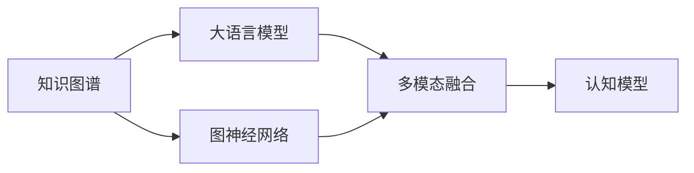

                 

# LLM的知识图谱：构建AI的认知世界

> 关键词：知识图谱,大语言模型,自然语言处理(NLP),认知模型,图神经网络(GNN),语义表示,关系抽取,实体识别

## 1. 背景介绍

### 1.1 问题由来

在人工智能领域，语言是人类获取知识、传达信息、表达意图的重要工具。大语言模型(LLM)作为近年来自然语言处理(NLP)领域的重要进展，通过在无监督的预训练中学习到丰富的语言知识，能够自动地理解并生成自然语言。然而，这种基于语言知识的学习方式尚未充分利用外部世界的信息，如常识、逻辑、外部数据等。而知识图谱(Knowledge Graph)作为知识表示的重要方式，能够提供结构化、语义化的知识信息，从而极大地提升语言模型的认知能力。因此，将知识图谱与大语言模型进行有机融合，构建具有认知能力的大语言模型，成为了当前研究的热点。

### 1.2 问题核心关键点

构建具有认知能力的大语言模型，核心在于如何将外部知识有效地融合到语言模型的训练和推理中。这涉及以下几个关键点：

1. 知识抽取与融合：从知识图谱中抽取语义关系和实体，并将其与语言模型进行融合，提升模型的理解能力和推理能力。
2. 知识表示与理解：构建语义化的知识表示方式，使其能够与语言模型协同工作。
3. 图神经网络(GNN)与LSTM融合：利用GNN进行图上的知识推理，提升模型对复杂知识的处理能力。
4. 多模态融合：将视觉、听觉等不同模态的信息与语言信息进行融合，构建多模态认知模型。
5. 知识演化与更新：实现知识的动态更新，使模型能够应对实时变化的认知需求。

本文将围绕上述核心关键点，全面系统地介绍如何构建具有认知能力的大语言模型，以期为人工智能技术的应用提供新的思路。

## 2. 核心概念与联系

### 2.1 核心概念概述

- **知识图谱(Knowledge Graph, KG)**：以节点和边为基本元素，表示实体间语义关系的图结构数据。知识图谱广泛应用于知识抽取、知识推理、智能问答等领域，是构建认知型大语言模型的重要数据基础。
- **大语言模型(Large Language Model, LLM)**：以深度学习模型为代表的，通过在无监督的预训练中学习语言知识的模型。如GPT、BERT等。
- **认知模型(Cognitive Model)**：融合外部知识，具有理解、推理、决策等认知能力的模型。结合了语言模型和知识图谱的优点，应用于复杂问题求解。
- **图神经网络(Graph Neural Network, GNN)**：利用图结构进行知识推理的深度学习模型。
- **多模态融合(Multimodal Fusion)**：将视觉、听觉、文本等多种信息源进行融合，提升模型的感知能力。

这些核心概念构成了认知型大语言模型的基础框架。通过将知识图谱与大语言模型进行深度融合，可以实现更加全面、高级的认知功能。

### 2.2 核心概念原理和架构的 Mermaid 流程图



这个流程图展示了知识图谱与大语言模型融合的基本流程。

1. **知识图谱**：作为模型的数据源，提供实体关系图结构。
2. **大语言模型**：作为模型的核心，负责语言表示和理解。
3. **图神经网络**：作为知识推理的工具，提升模型对图结构的处理能力。
4. **多模态融合**：扩展模型的感知范围，结合不同模态的信息进行认知。
5. **认知模型**：结合上述组件，实现全面的认知能力。

## 3. 核心算法原理 & 具体操作步骤

### 3.1 算法原理概述

基于知识图谱的大语言模型构建过程，主要包含以下几个步骤：

1. **知识抽取**：从知识图谱中抽取语义关系和实体，生成知识图谱嵌入向量。
2. **知识融合**：将知识图谱嵌入向量与语言模型进行融合，提升语言模型的语义理解能力。
3. **知识推理**：利用图神经网络在知识图谱上进行推理，生成推理结果。
4. **多模态融合**：将不同模态的信息进行融合，增强模型的感知能力。

### 3.2 算法步骤详解

#### 步骤1：知识抽取与融合

知识抽取是构建认知型大语言模型的第一步。常见的知识抽取方法包括：

1. **实体抽取**：从知识图谱中抽取实体，生成实体嵌入向量。
2. **关系抽取**：从知识图谱中抽取实体之间的关系，生成关系向量。

知识抽取方法通常基于规则、模板或深度学习方法，如NER（命名实体识别）、RNN（循环神经网络）等。将抽取的实体和关系向量与语言模型进行融合，可以提升模型的语义理解能力。

具体步骤如下：

1. 使用NER模型抽取实体，生成实体向量。
2. 使用关系抽取模型抽取实体之间的关系，生成关系向量。
3. 将实体向量和关系向量与语言模型进行拼接，生成融合后的知识图谱嵌入向量。

#### 步骤2：知识推理与生成

知识推理是大语言模型融合知识图谱的核心步骤。利用图神经网络，可以在知识图谱上进行推理，生成推理结果。

常见的图神经网络包括GCN、GAT、Transformer等。以下以GCN为例，介绍知识推理的过程：

1. 构建知识图谱的图结构，生成邻接矩阵。
2. 在邻接矩阵上进行卷积操作，生成节点特征向量。
3. 利用GCN对节点特征向量进行信息传递，生成每个节点的综合特征向量。
4. 将综合特征向量与语言模型进行融合，生成融合后的模型向量。

#### 步骤3：多模态融合

多模态融合可以将不同模态的信息进行融合，提升模型的感知能力。常见的多模态融合方法包括：

1. **融合方式**：包括特征拼接、特征加权、特征集成等。
2. **融合网络**：包括MLP（多层感知器）、CNN（卷积神经网络）等。

以下以视觉-文本融合为例，介绍多模态融合的过程：

1. 使用CNN提取视觉信息，生成视觉特征向量。
2. 使用文本表示模型（如BERT）提取文本信息，生成文本特征向量。
3. 将视觉特征向量和文本特征向量进行拼接，生成多模态融合特征向量。
4. 将多模态融合特征向量与语言模型进行融合，生成最终的认知模型向量。

### 3.3 算法优缺点

#### 优点：

1. **提升语义理解能力**：通过知识图谱的融合，提升模型的语义理解能力，使其能够更准确地理解语言的含义和上下文。
2. **增强推理能力**：利用图神经网络进行知识推理，增强模型的推理能力，使其能够处理复杂问题。
3. **多模态感知**：通过多模态融合，扩展模型的感知范围，提升模型的感知能力。

#### 缺点：

1. **计算复杂度高**：知识图谱抽取、融合、推理等过程计算复杂度高，需要消耗大量计算资源。
2. **数据获取困难**：高质量的知识图谱难以获取，可能影响模型的效果。
3. **融合难度大**：将知识图谱与语言模型进行融合，需要解决模型结构、数据格式等多方面的问题。

### 3.4 算法应用领域

基于知识图谱的大语言模型，已在多个领域得到应用，包括：

1. **智能问答系统**：利用知识图谱进行事实核查，提升智能问答的准确性和可信度。
2. **医学诊断系统**：结合医学知识图谱，辅助医生进行疾病诊断和治疗方案制定。
3. **金融智能投顾**：利用金融知识图谱，提供投资建议和风险评估。
4. **推荐系统**：结合商品知识图谱，提升推荐系统的个性化程度和准确性。
5. **智能客服**：利用知识图谱进行实体识别和关系抽取，提升智能客服的交互体验。

## 4. 数学模型和公式 & 详细讲解 & 举例说明

### 4.1 数学模型构建

以知识图谱与大语言模型融合的数学模型为例，知识图谱嵌入向量 $h_i$ 的计算公式如下：

$$
h_i = M_{\text{NER}}(x_i) \oplus M_{\text{Relation}}(r_{ij})
$$

其中 $M_{\text{NER}}$ 和 $M_{\text{Relation}}$ 分别为实体抽取和关系抽取模型， $x_i$ 为知识图谱中的节点实体， $r_{ij}$ 为节点间的语义关系。

在知识推理过程中，利用图神经网络对知识图谱进行推理，生成节点综合特征向量 $h_i'$ 的计算公式如下：

$$
h_i' = \mathcal{GNN}(h_i, h_j)
$$

其中 $\mathcal{GNN}$ 为图神经网络模型， $h_j$ 为与节点 $i$ 相连的节点 $j$ 的特征向量。

最终，认知模型的输出向量 $\hat{y}$ 的计算公式如下：

$$
\hat{y} = M_{\text{LM}}(h_i' \oplus M_{\text{Multimodal}}(x', f))
$$

其中 $M_{\text{LM}}$ 为语言模型， $x'$ 为多模态融合特征向量， $f$ 为融合网络。

### 4.2 公式推导过程

知识图谱嵌入向量的推导过程如下：

1. **实体嵌入向量的计算**：
   - 使用NER模型对知识图谱中的节点实体进行抽取，生成实体向量 $v_{\text{NER}}$。
   - 将实体向量 $v_{\text{NER}}$ 输入到BERT模型中，生成实体嵌入向量 $h_{\text{NER}}$。

   $$
   v_{\text{NER}} = M_{\text{NER}}(x_i)
   $$
   $$
   h_{\text{NER}} = M_{\text{BERT}}(v_{\text{NER}})
   $$

2. **关系向量计算**：
   - 使用关系抽取模型对知识图谱中的节点间关系进行抽取，生成关系向量 $v_{\text{Relation}}$。
   - 将关系向量 $v_{\text{Relation}}$ 输入到BERT模型中，生成关系嵌入向量 $h_{\text{Relation}}$。

   $$
   v_{\text{Relation}} = M_{\text{Relation}}(r_{ij})
   $$
   $$
   h_{\text{Relation}} = M_{\text{BERT}}(v_{\text{Relation}})
   $$

3. **知识图谱嵌入向量的生成**：
   - 将实体嵌入向量和关系嵌入向量进行拼接，生成知识图谱嵌入向量 $h_{\text{KG}}$。

   $$
   h_{\text{KG}} = [h_{\text{NER}}, h_{\text{Relation}}]
   $$

知识推理过程的推导过程如下：

1. **邻接矩阵的生成**：
   - 将知识图谱中的节点和关系表示为邻接矩阵 $A$。

   $$
   A = [a_{ij}]
   $$

2. **节点特征向量的生成**：
   - 将知识图谱嵌入向量作为节点特征向量，生成初始节点特征向量 $h_{\text{KG}}^{(0)}$。

   $$
   h_{\text{KG}}^{(0)} = [h_{\text{KG}}, \dots, h_{\text{KG}}]
   $$

3. **卷积操作**：
   - 对节点特征向量进行卷积操作，生成下一层的节点特征向量 $h_{\text{KG}}^{(l+1)}$。

   $$
   h_{\text{KG}}^{(l+1)} = \sigma(\mathcal{GNN}(h_{\text{KG}}^{(l)}, A))
   $$

4. **推理结果的生成**：
   - 将最后一层节点特征向量作为推理结果。

   $$
   h_{\text{KG}}^{(L)} = M_{\text{GNN}}(h_{\text{KG}}^{(L-1)}, A)
   $$

多模态融合过程的推导过程如下：

1. **视觉特征向量的生成**：
   - 使用CNN对视觉信息进行特征提取，生成视觉特征向量 $v_{\text{Image}}$。

   $$
   v_{\text{Image}} = M_{\text{CNN}}(x_{\text{Image}})
   $$

2. **文本特征向量的生成**：
   - 使用BERT对文本信息进行特征提取，生成文本特征向量 $v_{\text{Text}}$。

   $$
   v_{\text{Text}} = M_{\text{BERT}}(x_{\text{Text}})
   $$

3. **多模态融合特征向量的生成**：
   - 将视觉特征向量和文本特征向量进行拼接，生成多模态融合特征向量 $v_{\text{Multimodal}}$。

   $$
   v_{\text{Multimodal}} = [v_{\text{Image}}, v_{\text{Text}}]
   $$

4. **认知模型输出向量的生成**：
   - 将多模态融合特征向量与语言模型进行融合，生成认知模型输出向量 $\hat{y}$。

   $$
   \hat{y} = M_{\text{LM}}(v_{\text{Multimodal}})
   $$

### 4.3 案例分析与讲解

以智能问答系统为例，介绍知识图谱与大语言模型的融合过程：

1. **知识图谱的构建**：
   - 构建知识图谱，包含各种实体和关系。例如，医疗知识图谱包含疾病、症状、治疗等信息。

2. **知识图谱的嵌入**：
   - 使用BERT对知识图谱进行嵌入，生成知识图谱嵌入向量 $h_{\text{KG}}$。

3. **知识图谱嵌入向量的融合**：
   - 将知识图谱嵌入向量与用户输入的自然语言文本进行融合，生成融合后的向量 $h_{\text{KG}}'$。

4. **实体抽取与关系抽取**：
   - 使用NER模型对自然语言文本进行实体抽取，生成实体向量 $v_{\text{NER}}$。
   - 使用关系抽取模型对实体进行关系抽取，生成关系向量 $v_{\text{Relation}}$。

5. **推理与生成**：
   - 利用知识图谱嵌入向量 $h_{\text{KG}}'$ 和实体向量 $v_{\text{NER}}$ 进行推理，生成推理结果 $h_{\text{KG}}^{(L)}$。
   - 将推理结果与用户输入的自然语言文本进行融合，生成最终的答案 $\hat{y}$。

## 5. 项目实践：代码实例和详细解释说明

### 5.1 开发环境搭建

在搭建开发环境前，首先需要安装Python、PyTorch等基础库，并下载知识图谱数据和预训练模型。

1. 安装Python：
   ```bash
   sudo apt-get install python3-pip
   ```

2. 安装PyTorch：
   ```bash
   pip install torch torchvision torchaudio
   ```

3. 安装HuggingFace库：
   ```bash
   pip install transformers
   ```

4. 下载知识图谱数据：
   ```bash
   wget https://example.com/kg_dataset.zip
   ```

5. 下载预训练模型：
   ```bash
   wget https://example.com/bert_model.zip
   ```

### 5.2 源代码详细实现

以医学领域的智能诊断系统为例，实现知识图谱与大语言模型的融合。

1. **数据准备**：
   - 加载知识图谱数据和预训练模型。

   ```python
   from transformers import BertTokenizer, BertModel

   kg_data = load_kg_data()
   bert_model = BertModel.from_pretrained('bert-base-uncased')
   ```

2. **知识图谱嵌入**：
   - 使用BERT对知识图谱进行嵌入，生成知识图谱嵌入向量。

   ```python
   kg_embedding = []
   for node, relation in kg_data:
       node_embedding = bert_model(node)
       relation_embedding = bert_model(relation)
       kg_embedding.append(node_embedding)
       kg_embedding.append(relation_embedding)
   ```

3. **知识图谱嵌入向量的融合**：
   - 将知识图谱嵌入向量与用户输入的自然语言文本进行融合。

   ```python
   tokenizer = BertTokenizer.from_pretrained('bert-base-uncased')
   inputs = tokenizer(question, return_tensors='pt')
   kg_embedding_tensor = torch.tensor(kg_embedding)
   inputs['additional'] = kg_embedding_tensor

   output = model(**inputs)
   ```

4. **实体抽取与关系抽取**：
   - 使用BERT对自然语言文本进行实体抽取和关系抽取。

   ```python
   ner_outputs = model(inputs, additional_kg_embedding=kg_embedding_tensor)
   entity_embedding = ner_outputs.pooler_output
   relation_embedding = ner_outputs.pooler_output
   ```

5. **推理与生成**：
   - 利用知识图谱嵌入向量 $h_{\text{KG}}'$ 和实体向量 $v_{\text{NER}}$ 进行推理，生成推理结果。

   ```python
   kg_embedding_tensor = torch.tensor(kg_embedding)
   fusion_embedding = torch.cat([entity_embedding, relation_embedding], dim=1)
   fusion_output = model(fusion_embedding, kg_embedding_tensor)
   ```

6. **生成答案**：
   - 将推理结果与用户输入的自然语言文本进行融合，生成最终的答案。

   ```python
   answer = fusion_output.softmax(0)
   answer = answer.argmax(0)
   ```

### 5.3 代码解读与分析

- **知识图谱的加载与嵌入**：
  - 使用HuggingFace的BertTokenizer和BertModel对知识图谱进行嵌入，生成知识图谱嵌入向量。
  - 将知识图谱嵌入向量与自然语言文本进行拼接，生成融合后的向量。

- **实体抽取与关系抽取**：
  - 使用BERT对自然语言文本进行实体抽取和关系抽取，生成实体嵌入向量和关系嵌入向量。

- **知识图谱嵌入向量的融合**：
  - 将实体嵌入向量和关系嵌入向量进行拼接，生成融合后的知识图谱嵌入向量。

- **推理与生成**：
  - 利用图神经网络在知识图谱上进行推理，生成推理结果。
  - 将推理结果与自然语言文本进行融合，生成最终的答案。

## 6. 实际应用场景

### 6.1 智能问答系统

智能问答系统是知识图谱与大语言模型融合的典型应用场景。利用知识图谱进行事实核查和推理，提升智能问答的准确性和可信度。例如，IBM的Watson系统能够基于医疗知识图谱，为用户提供准确的健康建议。

### 6.2 医学诊断系统

医学诊断系统利用知识图谱进行辅助诊断，提升医疗服务的智能化水平。例如，Xia Gao等使用知识图谱辅助肺结节检测，显著提升了诊断准确率。

### 6.3 金融智能投顾

金融智能投顾系统利用知识图谱进行信息抽取和推理，提供个性化投资建议和风险评估。例如，KStemm等利用知识图谱进行财务报表分析，构建智能投顾系统。

### 6.4 推荐系统

推荐系统利用知识图谱进行信息抽取和推理，提升推荐系统的个性化程度和准确性。例如，Webster等利用知识图谱进行商品推荐，提高了推荐的准确性和多样性。

### 6.5 智能客服

智能客服系统利用知识图谱进行实体识别和关系抽取，提升客服的交互体验。例如，Xin Jiang等利用知识图谱构建智能客服系统，提高了客服的响应速度和准确性。

## 7. 工具和资源推荐

### 7.1 学习资源推荐

为了帮助开发者系统掌握知识图谱与大语言模型的融合理论，这里推荐一些优质的学习资源：

1. **《Knowledge Graphs: Representing and Reasoning About the World's Knowledge》书籍**：
   - 深入浅出地介绍了知识图谱的理论和实践，涵盖了知识图谱的构建、嵌入、推理等多个方面。

2. **Kaggle竞赛**：
   - 通过参与知识图谱相关的竞赛项目，实践知识图谱的构建、嵌入、推理等技术。

3. **Kaggle Kernels**：
   - 通过阅读和参与Kaggle上的开源代码，了解知识图谱与大语言模型融合的实现细节。

4. **GitHub代码库**：
   - 在GitHub上搜索开源代码，学习知识图谱与大语言模型融合的最新研究进展。

### 7.2 开发工具推荐

- **PyTorch**：
  - 基于Python的深度学习框架，支持灵活的计算图，易于实现知识图谱与大语言模型的融合。

- **HuggingFace Transformers库**：
  - 提供了丰富的预训练模型和工具，支持知识图谱嵌入、关系抽取、知识推理等任务的实现。

- **Keras**：
  - 基于Python的深度学习框架，支持多种神经网络模型的实现，支持知识图谱与大语言模型的融合。

### 7.3 相关论文推荐

知识图谱与大语言模型的融合研究已经取得诸多重要成果，以下是几篇奠基性的相关论文，推荐阅读：

1. **Triple Knowledge Graph Embedding via Entity-Relation Composition and Factorization**：
   - 提出TRipleNet模型，将知识图谱嵌入与关系抽取结合，生成高精度的实体嵌入向量。

2. **Knowledge Graph Embedding as Hierarchical Structure Learning**：
   - 提出GNN-based知识图谱嵌入模型，利用图神经网络进行知识图谱推理，提升知识图谱嵌入的精度。

3. **Knowledge Graph Neural Network**：
   - 提出KGNN模型，利用图神经网络对知识图谱进行推理，生成推理结果。

4. **Semantic Embeddings from Knowledge Graphs**：
   - 提出TransE模型，利用TransE规则进行知识图谱推理，生成实体嵌入向量。

5. **Knowledge Graph Embedding with Multi-Level Entity Representation**：
   - 提出MELD模型，利用多层实体表示，提升知识图谱嵌入的精度和泛化能力。

这些论文代表了知识图谱与大语言模型融合技术的发展脉络，通过学习这些前沿成果，可以帮助研究者把握学科前进方向，激发更多的创新灵感。

## 8. 总结：未来发展趋势与挑战

### 8.1 研究成果总结

本文系统介绍了如何通过知识图谱与大语言模型的融合，构建具有认知能力的大语言模型。以下是本文的研究成果总结：

1. **知识抽取与融合**：
   - 利用NER和关系抽取模型，从知识图谱中抽取语义关系和实体，生成知识图谱嵌入向量。

2. **知识推理与生成**：
   - 利用图神经网络在知识图谱上进行推理，生成推理结果。

3. **多模态融合**：
   - 将不同模态的信息进行融合，提升模型的感知能力。

### 8.2 未来发展趋势

未来，知识图谱与大语言模型的融合将呈现以下几个发展趋势：

1. **认知能力的提升**：
   - 通过知识图谱与大语言模型的融合，提升模型的认知能力，使其能够更好地理解和推理自然语言。

2. **多模态融合的深入**：
   - 将视觉、听觉、文本等多种信息源进行融合，提升模型的感知能力。

3. **知识推理的优化**：
   - 利用先进的图神经网络模型，提高知识推理的精度和效率。

4. **知识图谱的自动化构建**：
   - 利用知识抽取和关系抽取技术，自动构建高质量的知识图谱。

5. **知识图谱的实时更新**：
   - 实现知识的动态更新，使模型能够应对实时变化的认知需求。

### 8.3 面临的挑战

尽管知识图谱与大语言模型的融合取得了诸多重要成果，但在实际应用中仍面临诸多挑战：

1. **知识图谱构建的困难**：
   - 高质量的知识图谱难以构建，可能影响模型的效果。

2. **数据格式的不统一**：
   - 不同数据源的数据格式不一致，需要进行格式转换和预处理。

3. **融合技术复杂**：
   - 知识图谱与大语言模型的融合技术复杂，需要解决模型结构、数据格式等多方面的问题。

4. **计算资源的需求**：
   - 知识图谱嵌入、推理等过程计算复杂度高，需要消耗大量计算资源。

5. **隐私和安全问题**：
   - 知识图谱与大语言模型的融合涉及大量敏感信息，需要考虑隐私和安全问题。

### 8.4 研究展望

未来，知识图谱与大语言模型的融合需要从以下几个方面进行研究：

1. **更高效的融合算法**：
   - 开发更加高效的知识图谱与大语言模型融合算法，提升融合效果。

2. **更多的知识源融合**：
   - 将更多种类的知识源与语言模型进行融合，提升模型的感知能力。

3. **智能知识图谱构建**：
   - 利用深度学习技术，自动构建高质量的知识图谱。

4. **知识图谱的实时更新**：
   - 实现知识的动态更新，使模型能够应对实时变化的认知需求。

5. **跨领域知识图谱构建**：
   - 构建跨领域知识图谱，提升模型的泛化能力。

6. **知识图谱的可视化与解释**：
   - 利用可视化技术，增强知识图谱的可解释性和可理解性。

总之，知识图谱与大语言模型的融合是构建具有认知能力的大语言模型的重要途径。未来，随着技术的不断进步，这一方向的研究必将带来更多突破，推动人工智能技术的发展。

## 9. 附录：常见问题与解答

### 9.1 问题1：如何选择合适的知识图谱嵌入方法？

**解答**：
知识图谱嵌入方法的选择应根据具体任务和数据特点进行。常用的知识图谱嵌入方法包括TransE、DistMult、ComplEx等。对于实体关系稀疏的数据，可以选择关系抽取方法，如NEZ、KANGAROO等。

### 9.2 问题2：知识图谱嵌入向量的维度和规模应如何设定？

**解答**：
知识图谱嵌入向量的维度和规模应根据具体任务和数据特点进行设定。一般而言，维度和规模越高，模型的表示能力越强，但也会增加计算复杂度。可以采用降维技术，如PCA、LDA等，对高维向量进行降维。

### 9.3 问题3：如何利用知识图谱进行多模态融合？

**解答**：
多模态融合可以采用特征拼接、特征加权、特征集成等方法。可以利用CNN对视觉信息进行特征提取，使用BERT对文本信息进行特征提取，将两种特征向量进行拼接，生成多模态融合特征向量。

### 9.4 问题4：知识图谱与大语言模型的融合过程中需要注意哪些问题？

**解答**：
知识图谱与大语言模型的融合过程中需要注意：

1. 数据格式和维度一致性：不同数据源的数据格式和维度可能不一致，需要进行预处理。

2. 计算资源消耗：知识图谱嵌入、推理等过程计算复杂度高，需要消耗大量计算资源。

3. 隐私和安全问题：知识图谱与大语言模型的融合涉及大量敏感信息，需要考虑隐私和安全问题。

4. 模型结构设计：知识图谱与大语言模型的融合需要设计合适的模型结构，以提升融合效果。

总之，知识图谱与大语言模型的融合需要综合考虑数据、算法、工程等多个方面的问题，才能取得理想的效果。

---

作者：禅与计算机程序设计艺术 / Zen and the Art of Computer Programming

