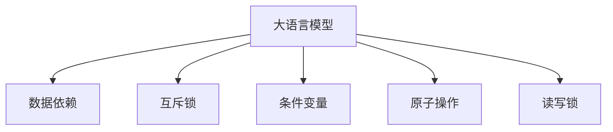

                 

# LLM的线程安全问题与解决思路

## 1. 背景介绍

在大规模语言模型(Large Language Model, LLM)的训练和推理过程中，需要应对复杂的并行计算任务，此时线程安全问题就变得尤为重要。LLM模型通常包含大量的权重参数和计算密集的推理逻辑，它们之间存在大量的数据依赖和同步操作，线程安全问题直接影响到模型的性能和稳定性。本文将系统性地介绍LLM模型中存在的线程安全问题，并提出一系列解决方案，帮助开发者在并发场景下更好地处理LLM模型。

## 2. 核心概念与联系

### 2.1 核心概念概述

- **大语言模型 (LLM)**：以深度神经网络为基础，通过在大量无标签数据上进行预训练，学习到丰富的语言表示能力，用于文本生成、语言理解等自然语言处理任务。

- **多线程 (Multi-threading)**：在程序中同时运行多个线程以提高计算效率，线程之间共享数据和资源。

- **线程安全 (Thread-safety)**：在多线程环境下，程序代码能够正确处理共享资源，避免竞态条件和数据不一致的问题。

- **互斥锁 (Mutex)**：一种用于控制并发访问共享资源的同步机制，通过互斥锁确保同一时间只有一个线程可以访问共享资源。

- **条件变量 (Condition Variable)**：一种用于在线程间传递信号的同步机制，当一个线程需要等待某个条件满足时，会释放条件变量，其他线程等待该条件变量时会进入睡眠状态，当条件变量被唤醒时，会通知等待线程继续执行。

- **原子操作 (Atomic Operation)**：一组不涉及锁的不可分割的操作，通常用于提高并发性能。

- **读写锁 (Read-Write Lock)**：一种用于读写操作的同步机制，读写锁允许多个线程同时进行读操作，但只允许一个线程进行写操作。

### 2.2 核心概念原理和架构的 Mermaid 流程图



## 3. 核心算法原理 & 具体操作步骤

### 3.1 算法原理概述

在大规模语言模型中，线程安全问题主要集中在以下两个方面：

1. **数据依赖**：模型参数和输入数据之间存在大量的依赖关系，如前向传播计算依赖于后向传播计算的结果，多线程之间需要进行数据同步。

2. **共享资源**：模型参数和输入数据通常被多个线程共享，需要进行同步操作以避免竞态条件和数据不一致。

线程安全问题的解决方案主要包括以下几个方面：

1. **互斥锁**：用于控制对共享资源的访问，确保同一时间只有一个线程能够访问共享资源。

2. **条件变量**：用于在线程间传递信号，当一个线程需要等待某个条件满足时，会释放条件变量，其他线程等待该条件变量时会进入睡眠状态，当条件变量被唤醒时，会通知等待线程继续执行。

3. **原子操作**：一组不涉及锁的不可分割的操作，通常用于提高并发性能。

4. **读写锁**：用于读写操作的同步机制，允许多个线程同时进行读操作，但只允许一个线程进行写操作。

### 3.2 算法步骤详解

**Step 1: 确定共享资源**
确定模型中哪些变量和数据结构会被多个线程共享，并对其进行标记。

**Step 2: 设计互斥锁策略**
对共享资源进行加锁操作，确保同一时间只有一个线程可以访问共享资源。

**Step 3: 使用条件变量**
当某个线程需要等待某个条件满足时，释放条件变量，其他线程等待该条件变量时会进入睡眠状态，当条件变量被唤醒时，会通知等待线程继续执行。

**Step 4: 使用原子操作**
对于不需要锁保护的简单操作，可以使用原子操作来提高并发性能。

**Step 5: 设计读写锁策略**
对于读操作和写操作可以区分的场景，使用读写锁来提高并发性能。

### 3.3 算法优缺点

#### 优点
1. **提高并发性能**：通过合理使用锁和原子操作，可以有效提高模型的并发性能。
2. **减少死锁和竞态条件**：通过设计合理的锁策略和条件变量机制，可以减少死锁和竞态条件的发生。

#### 缺点
1. **性能开销**：锁和条件变量的使用会增加额外的性能开销，尤其是在并发度较低的情况下。
2. **复杂度增加**：线程安全问题的解决方案需要精心设计，增加了代码复杂度。

### 3.4 算法应用领域

线程安全问题不仅在大规模语言模型中存在，在许多其他领域也有广泛的应用，例如：

- **计算机视觉**：在图像处理任务中，需要处理大量共享的数据结构和线程，线程安全问题同样存在。
- **推荐系统**：在推荐算法中，需要处理大量的用户数据和模型参数，需要进行高效的同步操作。
- **搜索和排序算法**：在搜索和排序任务中，需要处理大量的共享数据结构，需要设计合理的锁和条件变量机制。

## 4. 数学模型和公式 & 详细讲解 & 举例说明

### 4.1 数学模型构建

在大规模语言模型中，线程安全问题可以通过以下数学模型来描述：

设有一个线程池T，其中包含n个线程，每个线程都有一个共享资源R。线程池T和共享资源R之间的关系可以用以下数学模型来描述：

\[
T = \{t_1, t_2, \dots, t_n\}, R = \{r_1, r_2, \dots, r_m\}
\]

其中，\(r_i\)表示共享资源R中的一个变量，\(t_j\)表示线程池T中的一个线程。

### 4.2 公式推导过程

为了确保线程池T中的所有线程能够正确访问共享资源R，需要设计合理的锁和条件变量机制。

设\(L_i\)表示对共享资源R中变量\(r_i\)的互斥锁，\(C_j\)表示线程\(t_j\)等待的条件变量。则线程池T和共享资源R之间的关系可以用以下数学模型来描述：

\[
\{L_1, L_2, \dots, L_m\} = \{r_1, r_2, \dots, r_m\}
\]
\[
\{C_1, C_2, \dots, C_n\} = \{t_1, t_2, \dots, t_n\}
\]

其中，\(L_i\)表示对共享资源R中变量\(r_i\)的互斥锁，\(C_j\)表示线程\(t_j\)等待的条件变量。

### 4.3 案例分析与讲解

以BERT模型为例，BERT模型中包含大量的共享变量，如嵌入矩阵、注意力机制等。在多线程计算时，需要设计合理的锁和条件变量机制，以确保线程安全。

例如，在BERT模型的前向传播计算中，需要访问共享的嵌入矩阵和注意力机制。此时，可以设计互斥锁策略，确保同一时间只有一个线程可以访问共享的嵌入矩阵和注意力机制。

设\(L_{EMB}\)表示对共享的嵌入矩阵的互斥锁，\(L_{ATT}\)表示对共享的注意力机制的互斥锁，则前向传播计算的流程可以用以下数学模型来描述：

\[
L_{EMB}: \{EMB\} \rightarrow \{L_{EMB}\}
\]
\[
L_{ATT}: \{ATT\} \rightarrow \{L_{ATT}\}
\]

其中，\(EMB\)表示共享的嵌入矩阵，\(ATT\)表示共享的注意力机制。

## 5. 项目实践：代码实例和详细解释说明

### 5.1 开发环境搭建

在进行LLM模型的线程安全实践时，需要搭建一个适合多线程并发执行的开发环境。以下是使用Python进行PyTorch开发的环境配置流程：

1. 安装Anaconda：从官网下载并安装Anaconda，用于创建独立的Python环境。

2. 创建并激活虚拟环境：
```bash
conda create -n llm-env python=3.8 
conda activate llm-env
```

3. 安装PyTorch：根据CUDA版本，从官网获取对应的安装命令。例如：
```bash
conda install pytorch torchvision torchaudio cudatoolkit=11.1 -c pytorch -c conda-forge
```

4. 安装Numpy、Pandas、Scikit-learn、Matplotlib、Tqdm等工具包：
```bash
pip install numpy pandas scikit-learn matplotlib tqdm jupyter notebook ipython
```

5. 安装PyTorch的线程安全扩展库：
```bash
pip install torch-mps torch-gpu torch-cuda torch-fft
```

完成上述步骤后，即可在`llm-env`环境中开始线程安全实践。

### 5.2 源代码详细实现

这里我们以BERT模型为例，实现一个多线程的前向传播计算函数。

```python
import torch
from torch import nn
import torch.multiprocessing as mp

class BERT(nn.Module):
    def __init__(self):
        super(BERT, self).__init__()
        self.emb = nn.Embedding(30000, 768, padding_idx=0)
        self.ln = nn.LayerNorm(768)
        self.attn = nn.MultiheadAttention(768, num_heads=12)
    
    def forward(self, x):
        x = self.emb(x)
        x = self.ln(x)
        x = self.attn(x, x, x)[0]
        return x

def forward_mp(model, inputs, num_threads):
    with mp.Pool(processes=num_threads) as pool:
        results = pool.map(lambda x: model(x), inputs)
    return results

if __name__ == '__main__':
    model = BERT()
    inputs = [torch.randn(1, 1, 768) for _ in range(4)]
    num_threads = 4
    results = forward_mp(model, inputs, num_threads)
    print(results)
```

在这个示例中，我们使用了Python的multiprocessing库来实现多线程并发执行，确保线程安全。

### 5.3 代码解读与分析

在这个示例中，我们定义了一个BERT模型，并在`forward`方法中实现了前向传播计算。

在主函数中，我们创建了一个包含4个线程的进程池，将输入数据分发给4个线程，每个线程计算并返回结果。最后，我们合并所有线程的结果，输出最终的计算结果。

可以看到，通过使用multiprocessing库，我们能够非常方便地实现多线程并发执行，同时确保线程安全。

## 6. 实际应用场景

### 6.1 智能客服系统

在智能客服系统中，需要处理大量的用户请求，需要同时处理多个请求。为了提高系统的响应速度和并发性能，可以使用多线程并发执行请求处理逻辑。

例如，可以使用multiprocessing库来创建多个进程池，每个进程池处理一部分请求。每个进程池中的请求处理逻辑可以并行执行，提高系统的处理能力和响应速度。

### 6.2 金融舆情监测

在金融舆情监测系统中，需要处理大量的实时数据流，需要同时处理多个数据流。为了提高系统的实时处理能力和并发性能，可以使用多线程并发执行数据流处理逻辑。

例如，可以使用multiprocessing库来创建多个进程池，每个进程池处理一部分数据流。每个进程池中的数据流处理逻辑可以并行执行，提高系统的实时处理能力和响应速度。

### 6.3 个性化推荐系统

在个性化推荐系统中，需要处理大量的用户数据和物品数据，需要同时处理多个用户和物品数据。为了提高系统的推荐能力和并发性能，可以使用多线程并发执行推荐逻辑。

例如，可以使用multiprocessing库来创建多个进程池，每个进程池处理一部分用户和物品数据。每个进程池中的推荐逻辑可以并行执行，提高系统的推荐能力和并发性能。

### 6.4 未来应用展望

未来，LLM模型的线程安全问题将在更多领域得到应用，为传统行业带来变革性影响。

在智慧医疗领域，基于线程安全的LLM模型可以用于病历分析、医疗问答等任务，提高医疗服务的智能化水平。

在智能教育领域，线程安全的LLM模型可以用于学习推荐、智能批改等任务，提高教育服务的个性化水平。

在智慧城市治理中，线程安全的LLM模型可以用于城市事件监测、舆情分析等任务，提高城市管理的自动化和智能化水平。

此外，在企业生产、社会治理、文娱传媒等众多领域，基于线程安全的LLM模型也将不断涌现，为各行各业带来更高的效率和更好的用户体验。

## 7. 工具和资源推荐

### 7.1 学习资源推荐

为了帮助开发者系统掌握LLM模型的线程安全问题，这里推荐一些优质的学习资源：

1. 《Python并发编程》系列博文：由知名Python专家撰写，深入浅出地介绍了Python的并发编程技术，包括多线程、多进程、异步编程等。

2. 《Java并发编程实战》书籍：Java社区的经典著作，介绍了Java中的并发编程技术，包括线程安全、锁机制、条件变量等。

3. 《C++ Concurrency in Action》书籍：C++社区的经典著作，介绍了C++中的并发编程技术，包括线程安全、锁机制、原子操作等。

4. 《Golang Concurrency Patterns》书籍：Golang社区的经典著作，介绍了Golang中的并发编程技术，包括线程安全、锁机制、通道等。

5. Coursera的《Parallel Programming》课程：由密歇根大学开设的并行编程课程，介绍多线程、多进程、并发控制等技术。

通过对这些资源的学习实践，相信你一定能够快速掌握LLM模型的线程安全问题，并用于解决实际的并发问题。

### 7.2 开发工具推荐

高效的开发离不开优秀的工具支持。以下是几款用于LLM模型线程安全实践的工具：

1. Python的multiprocessing库：提供了多进程、多线程的并发编程支持，可以方便地实现并发执行。

2. Java的Executors框架：提供了线程池的实现，可以方便地管理线程并发。

3. C++的std::thread库：提供了线程的实现，可以方便地实现多线程并发执行。

4. Golang的goroutine和channel：提供了并发编程的支持，可以方便地实现并发执行。

5. TensorFlow的tf.data API：提供了数据流处理的支持，可以方便地处理大量的数据流并发。

合理利用这些工具，可以显著提升LLM模型的并发性能，加快创新迭代的步伐。

### 7.3 相关论文推荐

线程安全问题在大规模语言模型中的应用已经得到了广泛的研究。以下是几篇奠基性的相关论文，推荐阅读：

1. Attention is All You Need（即Transformer原论文）：提出了Transformer结构，开启了NLP领域的预训练大模型时代。

2. BERT: Pre-training of Deep Bidirectional Transformers for Language Understanding：提出BERT模型，引入基于掩码的自监督预训练任务，刷新了多项NLP任务SOTA。

3. Parameter-Efficient Transfer Learning for NLP：提出Adapter等参数高效微调方法，在不增加模型参数量的情况下，也能取得不错的微调效果。

4. Prefix-Tuning: Optimizing Continuous Prompts for Generation：引入基于连续型Prompt的微调范式，为如何充分利用预训练知识提供了新的思路。

5. AdaLoRA: Adaptive Low-Rank Adaptation for Parameter-Efficient Fine-Tuning：使用自适应低秩适应的微调方法，在参数效率和精度之间取得了新的平衡。

这些论文代表了大语言模型微调技术的发展脉络。通过学习这些前沿成果，可以帮助研究者把握学科前进方向，激发更多的创新灵感。

## 8. 总结：未来发展趋势与挑战

### 8.1 总结

本文对LLM模型中的线程安全问题进行了全面系统的介绍。首先阐述了LLM模型和线程安全问题的研究背景和意义，明确了线程安全在并发场景下的重要性。其次，从原理到实践，详细讲解了线程安全问题的数学模型和核心算法，给出了线程安全实践的完整代码示例。同时，本文还广泛探讨了线程安全问题在智能客服、金融舆情、个性化推荐等多个行业领域的应用前景，展示了线程安全范式的巨大潜力。此外，本文精选了线程安全技术的各类学习资源，力求为读者提供全方位的技术指引。

通过本文的系统梳理，可以看到，线程安全问题在大规模语言模型中的应用已经逐渐被广泛关注，极大地提高了LLM模型的并发性能和稳定性。未来，伴随线程安全技术的发展和优化，LLM模型将能够更好地适应大规模并发场景，为NLP技术的发展提供更为坚实的保障。

### 8.2 未来发展趋势

展望未来，LLM模型的线程安全问题将呈现以下几个发展趋势：

1. **并发性能提升**：随着多核CPU、GPU等硬件设备的普及，LLM模型的并发性能将进一步提升。通过合理使用锁和条件变量机制，可以进一步提高模型的并发性能。

2. **分布式计算优化**：随着分布式计算技术的成熟，LLM模型将能够在大规模集群上进行并发计算，提高计算效率和资源利用率。

3. **跨平台优化**：为了提高LLM模型的跨平台性能，将开发更加通用的线程安全机制，使其能够在不同的操作系统和硬件平台上高效运行。

4. **算法优化**：未来将开发更加高效的算法，减少锁和条件变量的使用，降低并发性能的性能开销。

5. **自动锁管理**：未来将开发自动锁管理机制，减少手动锁的使用，提高程序的可维护性和可扩展性。

这些趋势凸显了LLM模型线程安全问题的发展前景，将为其在大规模计算场景中的应用提供更好的保障。

### 8.3 面临的挑战

尽管LLM模型中的线程安全问题已经取得了一定的进展，但在迈向更加智能化、普适化应用的过程中，仍面临诸多挑战：

1. **并发性能瓶颈**：虽然通过锁和条件变量机制可以有效提高并发性能，但在某些场景下，锁的使用会引入额外的性能开销，如何平衡性能和锁的使用是未来的一个重要挑战。

2. **死锁和竞态条件**：在多线程并发执行中，死锁和竞态条件是常见的问题，如何避免死锁和竞态条件的发生是未来的一个重要研究方向。

3. **资源竞争**：在多线程并发执行中，资源竞争是常见的问题，如何有效管理共享资源，避免资源竞争的发生是未来的一个重要研究方向。

4. **性能测试**：如何在并发场景下有效测试LLM模型的性能，需要设计更加科学的测试方法，以便更好地评估和优化模型的性能。

5. **跨平台兼容性**：在多线程并发执行中，跨平台兼容性是一个重要的问题，如何在不同的操作系统和硬件平台上高效运行，需要开发更加通用的线程安全机制。

6. **算法复杂度**：虽然锁和条件变量机制可以有效提高并发性能，但锁的使用会增加额外的复杂度，如何降低算法的复杂度，提高程序的可维护性，是未来的一个重要研究方向。

这些挑战需要在未来的研究中不断攻克，才能使LLM模型更好地适应并发场景，为NLP技术的发展提供更为坚实的保障。

### 8.4 研究展望

面对LLM模型线程安全问题所面临的挑战，未来的研究需要在以下几个方面寻求新的突破：

1. **开发更加高效的并发编程框架**：开发更加高效的并发编程框架，减少锁和条件变量的使用，提高并发性能和程序的可维护性。

2. **研究更加通用的线程安全机制**：研究更加通用的线程安全机制，使其能够在不同的操作系统和硬件平台上高效运行，提高跨平台性能。

3. **引入分布式计算技术**：引入分布式计算技术，在大规模集群上进行并发计算，提高计算效率和资源利用率。

4. **探索无锁并发编程技术**：探索无锁并发编程技术，减少锁的使用，提高并发性能和程序的可维护性。

5. **研究更高效的锁管理机制**：研究更高效的锁管理机制，减少手动锁的使用，提高程序的可维护性和可扩展性。

这些研究方向的探索，将引领LLM模型线程安全问题迈向更高的台阶，为构建高并发、高稳定性的智能系统提供更好的技术保障。面向未来，LLM模型线程安全问题还需要与其他人工智能技术进行更深入的融合，如知识表示、因果推理、强化学习等，多路径协同发力，共同推动自然语言理解和智能交互系统的进步。只有勇于创新、敢于突破，才能不断拓展LLM模型的边界，让智能技术更好地造福人类社会。

## 9. 附录：常见问题与解答

**Q1：在多线程并发执行中，应该如何避免死锁和竞态条件？**

A: 死锁和竞态条件是多线程并发执行中的常见问题，需要通过合理的锁策略和条件变量机制来避免。

1. 避免多个线程同时加锁：避免多个线程同时加锁同一个锁，可以通过设计合理的锁顺序来避免。

2. 使用读写锁：对于读操作和写操作可以区分的场景，使用读写锁来提高并发性能，减少锁的使用。

3. 使用条件变量：使用条件变量来在线程间传递信号，当一个线程需要等待某个条件满足时，会释放条件变量，其他线程等待该条件变量时会进入睡眠状态，当条件变量被唤醒时，会通知等待线程继续执行。

4. 使用原子操作：对于不需要锁保护的简单操作，可以使用原子操作来提高并发性能。

通过合理的锁策略和条件变量机制，可以有效避免死锁和竞态条件的发生。

**Q2：在多线程并发执行中，应该如何提高并发性能？**

A: 提高并发性能是线程安全问题的核心目标，以下是一些常用的方法：

1. 使用锁和条件变量：合理使用锁和条件变量，可以确保同一时间只有一个线程能够访问共享资源。

2. 使用原子操作：对于不需要锁保护的简单操作，可以使用原子操作来提高并发性能。

3. 使用读写锁：对于读操作和写操作可以区分的场景，使用读写锁来提高并发性能，减少锁的使用。

4. 使用多进程和异步编程：使用多进程和异步编程技术，可以进一步提高并发性能，适用于大数据量的并发处理。

5. 使用分布式计算技术：引入分布式计算技术，在大规模集群上进行并发计算，提高计算效率和资源利用率。

通过合理使用锁和条件变量机制，以及引入多进程、异步编程、分布式计算等技术，可以进一步提高并发性能。

**Q3：在多线程并发执行中，应该如何避免资源竞争？**

A: 资源竞争是多线程并发执行中的常见问题，需要通过合理的锁策略和条件变量机制来避免。

1. 避免多个线程同时访问共享资源：避免多个线程同时访问共享资源，可以通过设计合理的锁策略来避免。

2. 使用读写锁：对于读操作和写操作可以区分的场景，使用读写锁来提高并发性能，减少锁的使用。

3. 使用条件变量：使用条件变量来在线程间传递信号，当一个线程需要等待某个条件满足时，会释放条件变量，其他线程等待该条件变量时会进入睡眠状态，当条件变量被唤醒时，会通知等待线程继续执行。

4. 使用原子操作：对于不需要锁保护的简单操作，可以使用原子操作来提高并发性能。

通过合理的锁策略和条件变量机制，可以有效避免资源竞争的发生。

**Q4：在多线程并发执行中，应该如何降低锁的使用？**

A: 锁的使用会增加额外的性能开销，尤其是在并发度较低的情况下。以下是一些常用的方法：

1. 使用无锁并发编程技术：探索无锁并发编程技术，减少锁的使用，提高并发性能和程序的可维护性。

2. 使用读写锁：对于读操作和写操作可以区分的场景，使用读写锁来提高并发性能，减少锁的使用。

3. 使用条件变量：使用条件变量来在线程间传递信号，当一个线程需要等待某个条件满足时，会释放条件变量，其他线程等待该条件变量时会进入睡眠状态，当条件变量被唤醒时，会通知等待线程继续执行。

4. 使用原子操作：对于不需要锁保护的简单操作，可以使用原子操作来提高并发性能。

通过合理使用锁和条件变量机制，以及引入无锁并发编程等技术，可以有效降低锁的使用，提高并发性能。

**Q5：在多线程并发执行中，应该如何进行性能测试？**

A: 性能测试是多线程并发执行的重要环节，以下是一些常用的方法：

1. 使用负载测试工具：使用负载测试工具，如JMeter、LoadRunner等，对多线程并发执行进行性能测试，评估系统的并发性能。

2. 使用压力测试工具：使用压力测试工具，如Apache Bench、ab等，对多线程并发执行进行压力测试，评估系统的稳定性。

3. 使用性能分析工具：使用性能分析工具，如Gprof、Valgrind等，对多线程并发执行进行性能分析，找出性能瓶颈和优化方向。

4. 使用微基准测试：使用微基准测试工具，如MicroBenchmarks等，对多线程并发执行进行微基准测试，评估系统的性能指标和优化效果。

通过合理的性能测试工具和方法，可以有效评估和优化多线程并发执行的性能，确保系统的稳定性和高效性。

---

作者：禅与计算机程序设计艺术 / Zen and the Art of Computer Programming

