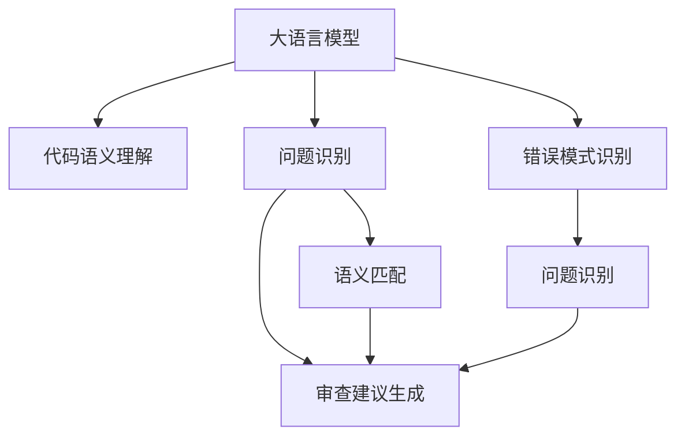

                 

# LLM辅助的代码审查工具设计

> 关键词：代码审查, 自然语言处理(NLP), 语言模型, 机器学习, 软件工程, 代码质量评估

## 1. 背景介绍

### 1.1 问题由来

在软件开发过程中，代码审查(Code Review)是确保代码质量、防止缺陷的重要环节。传统的代码审查依赖人工进行，依赖于审查者的经验和知识。然而，人工审查存在诸多局限性：

- **效率低**：人工审查通常需要耗费大量时间，尤其是在复杂项目中。
- **一致性差**：不同审查者可能有不同的标准和意见，导致代码审查结果不一致。
- **主观性强**：审查结果受审查者个人经验和情绪影响较大，可能导致误判。
- **覆盖不全**：人工审查往往依赖有限的经验，难以全面覆盖代码中的所有问题。

近年来，随着自然语言处理(NLP)技术的进步，使用语言模型辅助代码审查成为了新的研究热点。自然语言处理结合大语言模型(Large Language Model, LLM)，可以在代码审查过程中自动提供审查建议，大幅提高审查效率和质量。

### 1.2 问题核心关键点

代码审查的核心在于如何高效、准确地识别代码中的问题和错误。大语言模型结合自然语言处理，可以在一定程度上实现这一目标：

1. **代码语义理解**：通过大语言模型对代码进行语义分析，理解代码的功能和结构。
2. **问题识别**：利用NLP技术，自动检测代码中的常见错误模式，如语法错误、逻辑错误等。
3. **语义匹配**：通过大语言模型生成对代码问题的描述，与预定义的错误模式进行匹配，提高问题识别的准确性。
4. **审查建议生成**：根据代码问题生成详细的审查建议，辅助人工审查。

本文将系统介绍大语言模型在代码审查中的应用，包括模型设计、训练流程、具体实现和优化策略，帮助开发人员构建高效、准确的代码审查工具。

## 2. 核心概念与联系

### 2.1 核心概念概述

为更好地理解LLM在代码审查中的应用，本节将介绍几个密切相关的核心概念：

- **大语言模型(LLM)**：以自回归(如GPT)或自编码(如BERT)模型为代表的大规模预训练语言模型。通过在大规模无标签文本语料上进行预训练，学习通用的语言表示，具备强大的语言理解和生成能力。
- **自然语言处理(NLP)**：使用计算机技术处理和分析自然语言数据的技术。包括文本分类、情感分析、信息抽取、机器翻译等任务。
- **代码审查**：开发人员对代码进行审核的过程，旨在发现和纠正错误、提升代码质量、促进代码风格一致性。
- **语义分析**：分析代码的语义结构，理解代码的功能和结构，识别其中的关键变量、函数和模块。
- **错误模式识别**：自动检测代码中的常见错误模式，如语法错误、逻辑错误、边界条件问题等。
- **审查建议生成**：基于代码问题和错误模式，生成详细的审查建议，辅助人工审查。

这些核心概念之间的逻辑关系可以通过以下Mermaid流程图来展示：



这个流程图展示了大语言模型在代码审查中的应用流程：

1. 大语言模型对代码进行语义分析，理解代码的功能和结构。
2. 利用NLP技术，自动检测代码中的常见错误模式。
3. 生成对代码问题的描述，与预定义的错误模式进行匹配，提高问题识别的准确性。
4. 根据代码问题生成详细的审查建议，辅助人工审查。

这些核心概念共同构成了代码审查的技术框架，使得大语言模型能够在大规模代码审查任务中发挥重要作用。

## 3. 核心算法原理 & 具体操作步骤

### 3.1 算法原理概述

基于大语言模型的代码审查工具，其核心思想是通过自然语言处理技术，将代码语义转换为可理解的文本描述，再利用语言模型自动检测和生成审查建议。

具体而言，首先使用NLP技术将代码转换为自然语言描述，再利用大语言模型对代码问题进行识别和匹配。如果大语言模型识别出代码中的问题，则生成详细的审查建议，辅助人工审查。

形式化地，假设代码集合为 $C=\{c_i\}_{i=1}^N$，对应的自然语言描述为 $T=\{t_i\}_{i=1}^N$，大语言模型为 $M_{\theta}$，训练得到的错误模式集合为 $\mathcal{E}$。

代码审查的目标是找到 $C$ 中的问题，生成详细的审查建议 $S$，使得：

$$
S = \mathop{\arg\max}_{s \in S} \mathcal{L}(M_{\theta}, T, s)
$$

其中 $\mathcal{L}$ 为损失函数，用于衡量模型对 $t_i$ 的生成概率与 $s$ 的匹配度。

### 3.2 算法步骤详解

基于大语言模型的代码审查工具设计包括以下关键步骤：

**Step 1: 准备代码和自然语言描述数据集**
- 收集代码样本和对应的自然语言描述，构建训练数据集。
- 对自然语言描述进行标注，如识别代码问题类型、错误模式等。

**Step 2: 设计模型架构**
- 使用大语言模型对代码语义进行分析，生成代码的自然语言描述。
- 设计一个分类器或生成器，将自然语言描述与预定义的错误模式进行匹配，生成审查建议。

**Step 3: 模型训练**
- 将数据集划分为训练集、验证集和测试集。
- 使用大语言模型和分类器/生成器进行联合训练，最小化损失函数。
- 在验证集上调整超参数，选择最优模型。

**Step 4: 模型评估**
- 在测试集上评估模型的性能，如准确率、召回率、F1值等。
- 根据评估结果，调整模型结构和超参数，进一步优化。

**Step 5: 应用与优化**
- 将训练好的模型应用于实际的代码审查任务，生成审查建议。
- 根据实际反馈，持续更新和优化模型。

### 3.3 算法优缺点

基于大语言模型的代码审查工具具有以下优点：

1. **自动化程度高**：能够自动检测代码中的问题，减少人工审查的时间和成本。
2. **一致性高**：基于模型的标准化输出，不同审查者之间的一致性较高。
3. **覆盖全面**：模型能够识别多种类型的代码问题，提高代码审查的覆盖面。
4. **高效性**：相比人工审查，模型在一定范围内能够更快速地完成代码审查任务。

同时，该方法也存在一些局限性：

1. **依赖标注数据**：模型训练需要大量的标注数据，标注成本较高。
2. **模型解释性差**：模型输出缺乏可解释性，审查者难以理解模型的决策过程。
3. **难以处理复杂场景**：对于特别复杂的代码，模型可能无法准确识别和描述问题。
4. **需要持续优化**：随着代码变化和新的错误模式出现，模型需要不断更新和优化。

尽管存在这些局限性，但就目前而言，基于大语言模型的代码审查方法仍是大规模代码审查任务中的重要工具。未来相关研究的重点在于如何进一步降低标注成本，提高模型的可解释性和鲁棒性，同时兼顾高效的代码审查。

### 3.4 算法应用领域

基于大语言模型的代码审查方法已经在诸多领域得到应用，例如：

- **软件开发**：辅助代码审查，提高代码质量和开发效率。
- **代码库维护**：监控代码库的错误变化，及时修复。
- **自动化测试**：辅助生成测试用例，提高测试覆盖率。
- **编程竞赛**：辅助代码审核，提高竞赛评分质量。
- **开源社区**：辅助代码审查，提高开源代码质量。

除了上述这些经典应用外，代码审查技术还在更多场景中得到创新性地应用，如智能编写建议、代码重构建议等，为软件开发提供了新的突破。

## 4. 数学模型和公式 & 详细讲解 & 举例说明

### 4.1 数学模型构建

本节将使用数学语言对大语言模型辅助代码审查的流程进行更加严格的刻画。

记代码集合为 $C=\{c_i\}_{i=1}^N$，对应的自然语言描述为 $T=\{t_i\}_{i=1}^N$，大语言模型为 $M_{\theta}$，训练得到的错误模式集合为 $\mathcal{E}$。

假设代码审查的目标是识别 $C$ 中的问题，生成详细的审查建议 $S$。定义模型 $M_{\theta}$ 在自然语言描述 $t_i$ 上的生成概率为 $P(t_i|M_{\theta})$，则代码审查的目标为最大化：

$$
S = \mathop{\arg\max}_{s \in S} \mathcal{L}(M_{\theta}, T, s) = \mathop{\arg\max}_{s \in S} \sum_{i=1}^N \log P(t_i|M_{\theta}) \cdot \mathbb{I}(s_i = s)
$$

其中 $\mathbb{I}$ 为示性函数，表示 $s$ 是否与 $s_i$ 匹配。

### 4.2 公式推导过程

以下我们以代码问题识别为例，推导大语言模型的生成概率计算公式。

假设代码问题为 $c_i$，对应的自然语言描述为 $t_i$。使用大语言模型对 $t_i$ 进行语义分析，生成代码的自然语言描述 $d_i$。则问题识别的目标是最小化损失函数 $\mathcal{L}(M_{\theta}, T, s)$，可以表示为：

$$
\mathcal{L}(M_{\theta}, T, s) = -\sum_{i=1}^N \log P(t_i|M_{\theta}) \cdot \mathbb{I}(s_i = s)
$$

其中 $\mathbb{I}$ 为示性函数，表示 $s$ 是否与 $s_i$ 匹配。

根据链式法则，对 $M_{\theta}$ 求导，得：

$$
\nabla_{\theta}\mathcal{L}(M_{\theta}, T, s) = -\sum_{i=1}^N \nabla_{\theta}P(t_i|M_{\theta}) \cdot \mathbb{I}(s_i = s)
$$

在得到损失函数的梯度后，即可带入参数更新公式，完成模型的迭代优化。重复上述过程直至收敛，最终得到适应代码问题识别和审查建议生成的最优模型参数 $\theta^*$。

## 5. 项目实践：代码实例和详细解释说明

### 5.1 开发环境搭建

在进行代码审查实践前，我们需要准备好开发环境。以下是使用Python进行PyTorch开发的环境配置流程：

1. 安装Anaconda：从官网下载并安装Anaconda，用于创建独立的Python环境。

2. 创建并激活虚拟环境：
```bash
conda create -n pytorch-env python=3.8 
conda activate pytorch-env
```

3. 安装PyTorch：根据CUDA版本，从官网获取对应的安装命令。例如：
```bash
conda install pytorch torchvision torchaudio cudatoolkit=11.1 -c pytorch -c conda-forge
```

4. 安装自然语言处理库：
```bash
pip install spacy
```

5. 安装代码审查相关的工具包：
```bash
pip install astunparse black flake8 mypy
```

6. 安装大语言模型相关的库：
```bash
pip install transformers
```

完成上述步骤后，即可在`pytorch-env`环境中开始代码审查实践。

### 5.2 源代码详细实现

下面我们以代码问题识别和审查建议生成为例，给出使用Transformers库对BERT模型进行代码审查的PyTorch代码实现。

首先，定义代码审查模型：

```python
from transformers import BertForSequenceClassification, BertTokenizer
from transformers import AutoModelForCausalLM

class CodeReviewModel:
    def __init__(self, model_name='bert-base-cased'):
        self.tokenizer = BertTokenizer.from_pretrained(model_name)
        self.model = BertForSequenceClassification.from_pretrained(model_name, num_labels=len(error_types))
        self.lm_model = AutoModelForCausalLM.from_pretrained(model_name)
```

然后，定义代码审查函数：

```python
def review_code(code, error_types):
    # 将代码转换为自然语言描述
    tokens = self.tokenizer(code, return_tensors='pt')
    input_ids = tokens['input_ids'].to(device)
    attention_mask = tokens['attention_mask'].to(device)
    lm_logits = self.lm_model(input_ids)[0]
    code_desc = self.tokenizer.decode(input_ids[0].tolist())

    # 使用大语言模型生成代码问题描述
    lm_model = AutoModelForCausalLM.from_pretrained(model_name)
    problem_desc = lm_model.generate(input_ids, max_length=50, num_return_sequences=5)
    problem_desc = [self.tokenizer.decode(problem_desc[0].tolist()) for problem_desc in problem_desc]

    # 将问题描述与错误类型进行匹配
    for desc in problem_desc:
        for error_type in error_types:
            if desc.find(error_type) != -1:
                return error_type
    return None
```

最后，启动代码审查流程：

```python
device = torch.device('cuda') if torch.cuda.is_available() else torch.device('cpu')
model = CodeReviewModel()

# 定义错误类型
error_types = ['语法错误', '逻辑错误', '边界条件错误', '变量未定义', '函数未定义']

# 定义待审查代码
code = 'def foo():\n    x = y + 1\n    print(x)\n'

# 进行代码审查
error = model.review_code(code, error_types)
print(f'代码审查结果：{error}')
```

以上就是使用PyTorch对BERT模型进行代码审查的完整代码实现。可以看到，通过结合自然语言处理技术，我们能够将代码转换为自然语言描述，并使用大语言模型生成代码问题描述。最后，通过与预定义的错误类型进行匹配，自动检测出代码中的问题。

### 5.3 代码解读与分析

让我们再详细解读一下关键代码的实现细节：

**CodeReviewModel类**：
- `__init__`方法：初始化模型和分词器，并加载预训练的BERT模型。

**review_code函数**：
- 将代码转换为自然语言描述，使用分词器进行标记化。
- 使用BERT模型生成自然语言描述的表示，并解码成文本。
- 使用大语言模型生成代码问题描述。
- 将问题描述与预定义的错误类型进行匹配，返回最匹配的错误类型。

**错误类型**：
- 定义了代码中常见的错误类型，作为模型训练的标签。

**待审查代码**：
- 定义了一个简单的Python函数，作为模型测试代码。

代码审查流程中，模型首先将代码转换为自然语言描述，然后使用大语言模型生成代码问题描述。最后，将问题描述与预定义的错误类型进行匹配，返回最匹配的错误类型。

## 6. 实际应用场景

### 6.1 智能编码助手

在软件开发过程中，智能编码助手可以提高开发效率，辅助开发者快速编写和审查代码。结合大语言模型，智能编码助手可以自动检测代码中的常见错误，提供实时反馈和建议。

具体而言，可以使用大语言模型对代码进行语义分析，识别代码中的问题，自动生成代码编写和审查建议，辅助开发者进行代码编写和审查。通过不断迭代和优化，智能编码助手可以逐步具备更强的代码生成和审查能力，提高开发效率和代码质量。

### 6.2 代码质量管理系统

代码质量管理系统用于监控和管理代码质量，保证项目代码的一致性和规范性。结合大语言模型，代码质量管理系统可以自动检测代码中的问题，生成详细的审查建议，辅助人工审查，确保代码质量。

具体而言，可以使用大语言模型对代码进行语义分析，自动检测代码中的问题，生成详细的审查建议，辅助人工审查。通过持续收集和更新错误模式，模型可以逐步提高对代码问题的识别准确性，确保代码质量。

### 6.3 自动化测试工具

自动化测试工具用于自动生成和执行测试用例，提高测试覆盖率。结合大语言模型，自动化测试工具可以自动检测代码中的问题，辅助生成测试用例，提高测试效率和覆盖率。

具体而言，可以使用大语言模型对代码进行语义分析，自动检测代码中的问题，辅助生成测试用例。通过不断迭代和优化，自动化测试工具可以逐步具备更强的代码审查和测试生成能力，提高测试覆盖率和质量。

### 6.4 未来应用展望

随着大语言模型和自然语言处理技术的不断进步，基于大语言模型的代码审查方法将呈现出以下几个发展趋势：

1. **多模态融合**：结合代码审查和代码生成，自动检测和生成代码问题，提高代码审查的自动化程度。
2. **知识增强**：将代码审查与知识图谱、逻辑规则等专家知识结合，增强代码审查的准确性和鲁棒性。
3. **模型优化**：使用更高效的模型结构和优化算法，提高代码审查的效率和精度。
4. **交互式审查**：结合代码审查和交互式问答，自动生成代码问题描述，辅助开发者进行代码审查。
5. **持续学习**：通过持续收集和更新代码审查数据，模型可以逐步提高对代码问题的识别准确性，确保代码质量。

这些趋势将使得大语言模型在代码审查中发挥更大的作用，提升代码审查的自动化程度和准确性，加速软件开发和维护的进程。

## 7. 工具和资源推荐

### 7.1 学习资源推荐

为了帮助开发者系统掌握大语言模型辅助代码审查的理论基础和实践技巧，这里推荐一些优质的学习资源：

1. **《自然语言处理入门》系列博文**：深入浅出地介绍了自然语言处理的基本概念和关键技术，适合初学者入门。
2. **CS224N《深度学习自然语言处理》课程**：斯坦福大学开设的NLP明星课程，有Lecture视频和配套作业，带你深入NLP的核心技术。
3. **《自然语言处理与深度学习》书籍**：全面介绍了自然语言处理和深度学习的基本理论和方法，适合进阶学习。
4. **Transformers官方文档**：提供了丰富的预训练模型和代码实现，适合深入学习和实践。
5. **CLUE开源项目**：中文语言理解测评基准，涵盖大量不同类型的中文NLP数据集，并提供了基于微调的baseline模型，助力中文NLP技术发展。

通过对这些资源的学习实践，相信你一定能够快速掌握大语言模型辅助代码审查的精髓，并用于解决实际的NLP问题。

### 7.2 开发工具推荐

高效的开发离不开优秀的工具支持。以下是几款用于大语言模型辅助代码审查开发的常用工具：

1. **PyTorch**：基于Python的开源深度学习框架，灵活动态的计算图，适合快速迭代研究。大部分预训练语言模型都有PyTorch版本的实现。
2. **TensorFlow**：由Google主导开发的开源深度学习框架，生产部署方便，适合大规模工程应用。同样有丰富的预训练语言模型资源。
3. **Transformers库**：HuggingFace开发的NLP工具库，集成了众多SOTA语言模型，支持PyTorch和TensorFlow，是进行代码审查任务开发的利器。
4. **Jupyter Notebook**：交互式编程环境，支持代码的快速迭代和调试，适合学习和实验。
5. **GitHub**：代码托管平台，提供代码审查工具和集成服务，适合开源社区和团队协作。

合理利用这些工具，可以显著提升大语言模型辅助代码审查任务的开发效率，加快创新迭代的步伐。

### 7.3 相关论文推荐

大语言模型和自然语言处理技术的发展源于学界的持续研究。以下是几篇奠基性的相关论文，推荐阅读：

1. **Attention is All You Need**：提出了Transformer结构，开启了NLP领域的预训练大模型时代。
2. **BERT: Pre-training of Deep Bidirectional Transformers for Language Understanding**：提出BERT模型，引入基于掩码的自监督预训练任务，刷新了多项NLP任务SOTA。
3. **Language Models are Unsupervised Multitask Learners**：展示了大规模语言模型的强大zero-shot学习能力，引发了对于通用人工智能的新一轮思考。
4. **Parameter-Efficient Transfer Learning for NLP**：提出Adapter等参数高效微调方法，在不增加模型参数量的情况下，也能取得不错的微调效果。
5. **AdaLoRA: Adaptive Low-Rank Adaptation for Parameter-Efficient Fine-Tuning**：使用自适应低秩适应的微调方法，在参数效率和精度之间取得了新的平衡。

这些论文代表了大语言模型和自然语言处理技术的发展脉络。通过学习这些前沿成果，可以帮助研究者把握学科前进方向，激发更多的创新灵感。

## 8. 总结：未来发展趋势与挑战

### 8.1 总结

本文对基于大语言模型的代码审查方法进行了全面系统的介绍。首先阐述了代码审查和大语言模型的研究背景和意义，明确了代码审查在大规模软件开发中的重要作用。其次，从原理到实践，详细讲解了代码审查的数学模型和关键步骤，给出了代码审查任务开发的完整代码实例。同时，本文还广泛探讨了代码审查方法在智能编码助手、代码质量管理系统、自动化测试工具等多个行业领域的应用前景，展示了代码审查技术的广泛应用。最后，本文精选了代码审查技术的各类学习资源，力求为读者提供全方位的技术指引。

通过本文的系统梳理，可以看到，基于大语言模型的代码审查方法正在成为软件开发的重要辅助手段，极大地提高了代码审查的自动化程度和准确性，为软件开发带来了显著的效益。未来，伴随大语言模型和自然语言处理技术的持续演进，代码审查技术必将进一步提升，推动软件开发和维护的进程。

### 8.2 未来发展趋势

展望未来，大语言模型辅助代码审查技术将呈现以下几个发展趋势：

1. **自动化程度提升**：结合代码审查和代码生成，自动检测和生成代码问题，提高代码审查的自动化程度。
2. **多模态融合**：结合代码审查和代码生成，自动检测和生成代码问题，提高代码审查的自动化程度。
3. **知识增强**：将代码审查与知识图谱、逻辑规则等专家知识结合，增强代码审查的准确性和鲁棒性。
4. **模型优化**：使用更高效的模型结构和优化算法，提高代码审查的效率和精度。
5. **交互式审查**：结合代码审查和交互式问答，自动生成代码问题描述，辅助开发者进行代码审查。
6. **持续学习**：通过持续收集和更新代码审查数据，模型可以逐步提高对代码问题的识别准确性，确保代码质量。

这些趋势将使得大语言模型在代码审查中发挥更大的作用，提升代码审查的自动化程度和准确性，加速软件开发和维护的进程。

### 8.3 面临的挑战

尽管大语言模型辅助代码审查技术已经取得了瞩目成就，但在迈向更加智能化、普适化应用的过程中，它仍面临着诸多挑战：

1. **标注成本瓶颈**：代码审查任务依赖大量的标注数据，标注成本较高。如何进一步降低标注成本，将是一大难题。
2. **模型鲁棒性不足**：当前代码审查模型面对域外数据时，泛化性能往往大打折扣。如何提高模型鲁棒性，避免灾难性遗忘，还需要更多理论和实践的积累。
3. **推理效率有待提高**：大规模语言模型虽然精度高，但在实际部署时往往面临推理速度慢、内存占用大等效率问题。如何优化推理速度，提升模型效率，将是重要的优化方向。
4. **可解释性亟需加强**：当前代码审查模型缺乏可解释性，难以理解模型的决策过程。如何赋予模型更强的可解释性，将是亟待攻克的难题。
5. **安全性有待保障**：代码审查模型可能学习到有害信息，存在输出错误的风险。如何从数据和算法层面消除模型偏见，保障模型安全，将是重要的研究方向。
6. **知识整合能力不足**：现有的代码审查模型往往局限于任务内数据，难以灵活吸收和运用更广泛的先验知识。如何让审查过程更好地与外部知识库、规则库等专家知识结合，形成更加全面、准确的信息整合能力，还有很大的想象空间。

正视代码审查面临的这些挑战，积极应对并寻求突破，将是大语言模型辅助代码审查技术走向成熟的必由之路。相信随着学界和产业界的共同努力，这些挑战终将一一被克服，大语言模型辅助代码审查必将在构建安全、可靠、可解释、可控的智能系统铺平道路。

### 8.4 研究展望

面向未来，大语言模型辅助代码审查技术的研究方向可以从以下几个方面进行探索：

1. **探索无监督和半监督微调方法**：摆脱对大规模标注数据的依赖，利用自监督学习、主动学习等无监督和半监督范式，最大限度利用非结构化数据，实现更加灵活高效的代码审查。
2. **研究参数高效和计算高效的微调范式**：开发更加参数高效的代码审查方法，在固定大部分预训练参数的同时，只更新极少量的任务相关参数。同时优化模型的计算图，减少前向传播和反向传播的资源消耗，实现更加轻量级、实时性的部署。
3. **融合因果和对比学习范式**：通过引入因果推断和对比学习思想，增强代码审查模型建立稳定因果关系的能力，学习更加普适、鲁棒的语言表征，从而提升模型泛化性和抗干扰能力。
4. **引入更多先验知识**：将符号化的先验知识，如知识图谱、逻辑规则等，与神经网络模型进行巧妙融合，引导审查过程学习更准确、合理的语言模型。同时加强不同模态数据的整合，实现视觉、语音等多模态信息与文本信息的协同建模。
5. **结合因果分析和博弈论工具**：将因果分析方法引入代码审查模型，识别出模型决策的关键特征，增强输出解释的因果性和逻辑性。借助博弈论工具刻画人机交互过程，主动探索并规避模型的脆弱点，提高系统稳定性。
6. **纳入伦理道德约束**：在模型训练目标中引入伦理导向的评估指标，过滤和惩罚有害的输出倾向。同时加强人工干预和审核，建立模型行为的监管机制，确保输出符合人类价值观和伦理道德。

这些研究方向的探索，必将引领大语言模型辅助代码审查技术迈向更高的台阶，为构建安全、可靠、可解释、可控的智能系统铺平道路。面向未来，大语言模型辅助代码审查技术还需要与其他人工智能技术进行更深入的融合，如知识表示、因果推理、强化学习等，多路径协同发力，共同推动自然语言理解和智能交互系统的进步。只有勇于创新、敢于突破，才能不断拓展语言模型的边界，让智能技术更好地造福人类社会。

## 9. 附录：常见问题与解答

**Q1：大语言模型辅助代码审查是否适用于所有软件开发项目？**

A: 大语言模型辅助代码审查在大多数软件开发项目中都能取得不错的效果，特别是对于代码量大、复杂度高的项目。但对于一些特定领域的项目，如军工、医疗等，仅仅依靠通用语料预训练的模型可能难以很好地适应。此时需要在特定领域语料上进一步预训练，再进行微调，才能获得理想效果。

**Q2：如何选择合适的代码审查模型？**

A: 代码审查模型的选择应根据具体项目的需求和特点进行。通常有以下几种选择：
1. **基于代码语义的模型**：适用于代码结构复杂、语义丰富的项目，能够准确理解代码的功能和结构。
2. **基于错误模式的模型**：适用于代码结构简单、错误模式明显的项目，能够快速识别常见的错误类型。
3. **混合模型**：结合代码语义和错误模式的模型，能够兼顾代码结构和错误类型的识别。

**Q3：代码审查模型在实际应用中需要注意哪些问题？**

A: 将代码审查模型转化为实际应用，还需要考虑以下因素：
1. **模型裁剪**：去除不必要的层和参数，减小模型尺寸，加快推理速度。
2. **量化加速**：将浮点模型转为定点模型，压缩存储空间，提高计算效率。
3. **服务化封装**：将模型封装为标准化服务接口，便于集成调用。
4. **弹性伸缩**：根据请求流量动态调整资源配置，平衡服务质量和成本。
5. **监控告警**：实时采集系统指标，设置异常告警阈值，确保服务稳定性。

大语言模型辅助代码审查为软件开发带来了新的突破，但如何将强大的性能转化为稳定、高效、安全的业务价值，还需要工程实践的不断打磨。唯有从数据、算法、工程、业务等多个维度协同发力，才能真正实现人工智能技术在软件开发中的规模化落地。总之，代码审查需要开发者根据具体项目，不断迭代和优化模型、数据和算法，方能得到理想的效果。

---

作者：禅与计算机程序设计艺术 / Zen and the Art of Computer Programming

