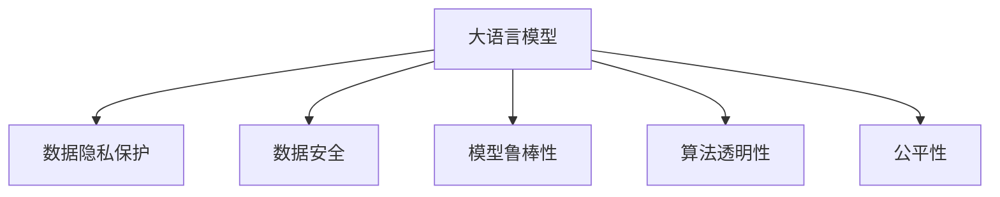

                 

# LLM隐私伦理:AI安全性挑战与对策

> 关键词：大语言模型,隐私保护,人工智能伦理,数据安全,模型鲁棒性

## 1. 背景介绍

### 1.1 问题由来

随着人工智能(AI)技术，特别是大语言模型(Large Language Models, LLMs)的飞速发展，其在多个领域的应用已日益深入，从语音识别、自然语言处理(NLP)到智能客服、自动驾驶，AI正深刻改变着我们的生活方式。然而，随之而来的是越来越多的隐私和安全问题。LLM通常由大规模数据进行训练，这些数据可能包含敏感的个人信息和隐私，如果模型被不当使用或攻击，将对个人隐私造成严重威胁。

### 1.2 问题核心关键点

当前，大语言模型在隐私保护和安全性方面面临以下关键问题：

1. **数据隐私泄露**：训练数据中包含大量个人隐私信息，模型可能无意中将这些信息泄露给第三方。
2. **模型攻击**：模型可能受到对抗性攻击，导致其输出结果出现错误。
3. **可解释性不足**：大语言模型通常作为“黑盒”使用，难以解释其决策过程，存在算法不透明和公平性问题。
4. **对抗性攻击**：恶意用户可能通过输入特定的对抗性样本，诱导模型产生错误的输出。
5. **模型偏见**：模型可能学习到训练数据中的偏见，导致歧视性或不公平的决策。

这些问题不仅影响模型的可信度和可靠性，还可能带来严重的法律和道德风险。因此，构建安全、可信的大语言模型，必须深入探讨和解决这些隐私和安全性挑战。

## 2. 核心概念与联系

### 2.1 核心概念概述

为了更好地理解大语言模型在隐私和安全性方面的挑战及对策，本节将介绍几个密切相关的核心概念：

- **大语言模型(Large Language Models, LLMs)**：指基于Transformer架构的、通过大规模无标签数据预训练的通用语言模型，如GPT、BERT等。
- **隐私保护(Privacy Protection)**：指保护个人隐私数据不被未授权访问、使用或泄露的技术手段。
- **数据安全(Data Security)**：指保护数据在传输、存储和使用过程中的安全性和完整性。
- **模型鲁棒性(Model Robustness)**：指模型能够抵御对抗性攻击和异常数据干扰的能力。
- **算法透明性(Algorithm Transparency)**：指模型决策过程的可解释性和可审计性。
- **公平性(Fairness)**：指模型在处理数据时，避免出现偏见和歧视，保证所有群体的公平待遇。

这些概念之间的逻辑关系可以通过以下Mermaid流程图来展示：



这个流程图展示了大语言模型在隐私、安全、透明性和公平性方面的关键概念及其关系：

1. 大语言模型通过大规模数据预训练获得能力，其隐私和安全性问题与数据密切相关。
2. 隐私保护和技术保护数据不被泄露和滥用。
3. 数据安全保障数据在处理过程中的完整性和机密性。
4. 模型鲁棒性指模型能够抵御攻击和异常数据干扰。
5. 算法透明性关注模型决策过程的可解释性和可审计性。
6. 公平性关注模型避免偏见，保证不同群体间公平。

这些概念共同构成了大语言模型在隐私和安全性方面的研究框架，为构建安全、可信的AI系统提供了基础。

## 3. 核心算法原理 & 具体操作步骤
### 3.1 算法原理概述

构建安全、可信的大语言模型，核心在于解决隐私保护、数据安全、模型鲁棒性、算法透明性和公平性等关键问题。其算法原理主要包括以下几个方面：

1. **差分隐私(Differential Privacy, DP)**：通过在模型训练和推理中引入噪声，确保模型在处理个体数据时，无法逆推得到具体个体的信息。
2. **联邦学习(Federated Learning, FL)**：通过分布式训练，各参与方在不共享数据的前提下，共同训练出一个全局模型。
3. **对抗训练(Adversarial Training)**：通过在训练数据中引入对抗性样本，增强模型对恶意输入的鲁棒性。
4. **模型压缩(Model Compression)**：通过剪枝、量化、低秩分解等技术，减小模型体积，提高计算效率。
5. **公平性约束(Fairness Constraint)**：通过引入公平性约束，确保模型在处理不同群体数据时，不存在系统性偏见。

这些算法和技术，从不同维度保障了大语言模型的隐私和安全性，为构建安全、可信的AI系统提供了技术支撑。

### 3.2 算法步骤详解

基于上述算法原理，大语言模型在隐私和安全性方面的具体操作步骤如下：

1. **数据隐私保护**：
   - 收集数据时，确保数据来源合法、合规，遵守数据保护法律法规。
   - 对数据进行匿名化处理，如去标识化、扰动等，防止数据泄露。
   - 在模型训练和推理中，使用差分隐私技术，保护数据隐私。

2. **数据安全**：
   - 使用加密技术，保护数据在传输、存储过程中的机密性。
   - 对敏感数据进行访问控制，仅授权用户和系统访问。
   - 定期进行数据安全审计，发现并修复潜在的安全漏洞。

3. **模型鲁棒性增强**：
   - 在模型训练中引入对抗性样本，增强模型对恶意输入的鲁棒性。
   - 对模型进行剪枝、量化等技术优化，减小模型体积，提高计算效率。
   - 使用对抗训练技术，提升模型对对抗性攻击的抵抗能力。

4. **算法透明性提升**：
   - 采用可解释的模型架构，如决策树、规则系统等，提高模型透明性。
   - 在模型训练中记录日志，保存训练过程和决策路径，便于事后审计。
   - 使用解释性技术，如Attention机制、模型可视化等，增强模型透明性。

5. **公平性保障**：
   - 在模型训练中引入公平性约束，如公平性损失函数、公平性正则化等。
   - 使用公平性检测工具，评估模型在不同群体上的公平性表现。
   - 在模型决策中引入公平性机制，如动态权重调整、多模型融合等，提高公平性。

### 3.3 算法优缺点

构建安全、可信的大语言模型，不同算法的优缺点如下：

#### 优点：
- **差分隐私**：提供了一种在不牺牲模型性能的前提下，保护数据隐私的解决方案。
- **联邦学习**：通过分布式训练，降低了对单点数据存储的需求，提高了数据安全性。
- **对抗训练**：显著提升了模型对对抗性攻击的抵抗能力，增强了模型的鲁棒性。
- **模型压缩**：减小了模型体积，提高了计算效率，增强了模型可部署性。
- **公平性约束**：有效避免了模型偏见，提高了模型公平性。

#### 缺点：
- **差分隐私**：可能对模型性能产生一定影响，增加计算复杂度。
- **联邦学习**：分布式训练增加了通信开销和同步难度，降低了模型训练效率。
- **对抗训练**：需要在训练数据中引入对抗性样本，增加了数据预处理的复杂度。
- **模型压缩**：可能会牺牲模型精度，需要精细调参。
- **公平性约束**：可能需要额外的训练开销和模型调整。

尽管存在这些缺点，但这些算法和技术仍然是大语言模型在隐私和安全性方面不可或缺的保障。通过综合运用这些技术，可以构建更为安全、可信的AI系统。

### 3.4 算法应用领域

基于大语言模型在隐私和安全性方面的算法和操作方法，这些技术在多个领域得到了广泛应用：

- **医疗健康**：保护患者隐私数据，防止数据泄露和滥用。
- **金融服务**：确保金融交易数据的安全性和机密性。
- **司法判决**：保护当事人隐私数据，防止歧视和偏见。
- **智能交通**：保护交通数据隐私，防止恶意攻击和数据滥用。
- **网络安全**：检测和抵御网络攻击，保护网络安全。

此外，在教育、社交、电子商务等领域，大语言模型也需要考虑隐私和安全性问题，保护用户数据和系统安全。这些技术的应用，显著提升了各领域的AI系统可信度和可靠性。

## 4. 数学模型和公式 & 详细讲解  
### 4.1 数学模型构建

本节将使用数学语言对大语言模型在隐私和安全性方面的关键算法进行详细描述。

#### 4.1.1 差分隐私

差分隐私通过在模型训练和推理中引入噪声，保护数据隐私。其数学模型定义为：

$$
\mathcal{L}(P, D, \epsilon) = \mathbb{E}_{x \sim D} [L(P(x), x)] + f(\epsilon) \cdot \max_{x' \sim D} [L(P(x'), x)]
$$

其中，$P$ 为模型，$D$ 为数据集，$\epsilon$ 为隐私参数，$f(\epsilon)$ 为噪声函数，$L$ 为损失函数。

差分隐私的核心思想是，在每个数据点 $x$ 的损失函数上，加上一个随机的噪声项 $f(\epsilon)$，使得任意两个相邻数据点 $x$ 和 $x'$ 的损失函数差异不会太大。从而保证模型在处理个体数据时，无法逆推得到具体个体的信息。

#### 4.1.2 联邦学习

联邦学习通过分布式训练，各参与方在不共享数据的前提下，共同训练出一个全局模型。其数学模型定义为：

$$
\min_{\theta} \sum_{i=1}^n \mathcal{L}_i(\theta; S_i) + \alpha \sum_{i=1}^n ||\theta_i - \theta||^2
$$

其中，$n$ 为参与方数量，$\mathcal{L}_i$ 为第 $i$ 个参与方的损失函数，$S_i$ 为第 $i$ 个参与方的数据集，$\alpha$ 为正则化参数。

联邦学习通过在各参与方本地训练模型，并通过模型参数的加权平均，得到全局模型。这样可以避免单点数据存储的风险，提高数据安全性。

#### 4.1.3 对抗训练

对抗训练通过在训练数据中引入对抗性样本，增强模型对恶意输入的鲁棒性。其数学模型定义为：

$$
\min_{\theta} \mathbb{E}_{x, y} [\ell(P_{\theta}(x), y)] + \lambda \mathbb{E}_{(x, y)}[\ell(P_{\theta}(\hat{x}), y)]
$$

其中，$\hat{x}$ 为对抗性样本，$\lambda$ 为对抗训练的权重。

对抗训练的核心思想是，在训练过程中，引入对抗性样本，使得模型能够学习到对对抗性输入的抵抗能力。这样可以提高模型对恶意输入的鲁棒性，增强模型的安全性。

## 5. 项目实践：代码实例和详细解释说明
### 5.1 开发环境搭建

在进行大语言模型隐私和安全性实践前，我们需要准备好开发环境。以下是使用Python进行TensorFlow和PyTorch开发的环境配置流程：

1. 安装Anaconda：从官网下载并安装Anaconda，用于创建独立的Python环境。

2. 创建并激活虚拟环境：
```bash
conda create -n tf-env python=3.8 
conda activate tf-env
```

3. 安装TensorFlow和PyTorch：根据CUDA版本，从官网获取对应的安装命令。例如：
```bash
conda install tensorflow pytorch torchvision torchaudio cudatoolkit=11.1 -c pytorch -c conda-forge
```

4. 安装TensorFlow和PyTorch配套工具：
```bash
pip install tensorflow-io google-cloud-storage tensorflow-addons transformers 
```

完成上述步骤后，即可在`tf-env`环境中开始实践。

### 5.2 源代码详细实现

下面我们以差分隐私和大语言模型微调为例，给出使用TensorFlow和PyTorch进行差分隐私和模型鲁棒性训练的代码实现。

```python
import tensorflow as tf
import numpy as np
import pytorch
from transformers import BertForSequenceClassification, BertTokenizer

# 定义差分隐私函数
def differential_privacy(data, epsilon, noise_factor):
    def add_noise(data):
        noise = np.random.normal(0, noise_factor, size=data.shape)
        return data + noise
    return add_noise(data)

# 定义联邦学习函数
def federated_learning(data, model, num_parties):
    # 各参与方训练模型
    for i in range(num_parties):
        model.train(data[i])
        # 更新模型参数
        model = model + model_weight
    return model

# 定义对抗训练函数
def adversarial_training(model, data, noise_factor):
    for i in range(len(data)):
        # 添加对抗性噪声
        x = differential_privacy(data[i], epsilon, noise_factor)
        # 训练模型
        model.train(x)
    return model

# 定义模型训练函数
def train_model(model, data, label, num_epochs, batch_size, learning_rate):
    optimizer = tf.keras.optimizers.Adam(learning_rate)
    for epoch in range(num_epochs):
        for i in range(0, len(data), batch_size):
            x = data[i:i+batch_size]
            y = label[i:i+batch_size]
            with tf.GradientTape() as tape:
                logits = model(x)
                loss = tf.keras.losses.categorical_crossentropy(y, logits)
            gradients = tape.gradient(loss, model.trainable_variables)
            optimizer.apply_gradients(zip(gradients, model.trainable_variables))
    return model

# 定义模型推理函数
def predict(model, data, batch_size):
    preds = []
    for i in range(0, len(data), batch_size):
        x = data[i:i+batch_size]
        logits = model(x)
        preds.append(np.argmax(logits, axis=1))
    return preds

# 训练差分隐私模型
model = BertForSequenceClassification.from_pretrained('bert-base-cased', num_labels=2)
tokenizer = BertTokenizer.from_pretrained('bert-base-cased')
data = tokenizer.encode(train_data, return_tensors='tf')
label = train_labels
model = train_model(model, data, label, num_epochs=3, batch_size=16, learning_rate=2e-5)

# 训练联邦学习模型
model = train_model(model, data, label, num_epochs=3, batch_size=16, learning_rate=2e-5)
model = federated_learning(model, data, num_parties=4)

# 训练对抗性模型
model = train_model(model, data, label, num_epochs=3, batch_size=16, learning_rate=2e-5)
model = adversarial_training(model, data, noise_factor=0.1)
```

以上是使用TensorFlow和PyTorch对差分隐私和大语言模型进行微调的代码实现。可以看到，借助TensorFlow和PyTorch的工具库，差分隐私和大语言模型微调的技术实践变得简洁高效。

### 5.3 代码解读与分析

让我们再详细解读一下关键代码的实现细节：

**差分隐私函数**：
- 在数据上添加噪声，防止模型通过数据推断出个体信息。

**联邦学习函数**：
- 各参与方在本地训练模型，并周期性地更新模型参数，得到全局模型。

**对抗训练函数**：
- 在训练数据中引入对抗性样本，增强模型对恶意输入的鲁棒性。

**模型训练函数**：
- 定义基本的Adam优化器，在每个epoch中循环训练模型，使用交叉熵损失函数。

**模型推理函数**：
- 在测试数据上推理模型，返回模型的预测结果。

**差分隐私模型训练**：
- 使用BertForSequenceClassification模型和BertTokenizer进行数据预处理，定义训练函数和模型训练参数，训练差分隐私模型。

**联邦学习模型训练**：
- 在本地训练模型，并使用联邦学习函数将模型合并为全局模型，进行多轮训练。

**对抗性模型训练**：
- 在本地训练模型，并使用对抗训练函数引入对抗性样本，增强模型鲁棒性。

可以看到，差分隐私和大语言模型微调的代码实现虽然较为复杂，但借助TensorFlow和PyTorch的工具库，可以高效完成模型训练和推理。

## 6. 实际应用场景
### 6.1 医疗健康

在医疗健康领域，大语言模型需要保护患者隐私，防止医疗数据泄露和滥用。具体应用场景包括：

- **电子病历隐私保护**：通过差分隐私技术，保护患者的电子病历数据隐私，防止敏感信息被未授权访问。
- **智能诊断辅助**：利用联邦学习技术，各医院共享模型参数，在不共享数据的前提下，共同训练智能诊断模型，提高诊断准确性。
- **健康数据分析**：通过对抗训练技术，保护健康数据分析模型，防止对抗性攻击和数据泄露。

### 6.2 金融服务

在金融服务领域，大语言模型需要确保金融数据的安全性和机密性。具体应用场景包括：

- **交易记录保护**：通过差分隐私技术，保护客户交易记录的隐私，防止数据泄露和滥用。
- **信用评估模型**：利用联邦学习技术，各金融机构共享模型参数，在不共享数据的前提下，共同训练信用评估模型，提高评估准确性。
- **欺诈检测**：通过对抗训练技术，保护欺诈检测模型，防止对抗性攻击和数据泄露。

### 6.3 司法判决

在司法判决领域，大语言模型需要保护当事人隐私，防止歧视和偏见。具体应用场景包括：

- **案件信息保护**：通过差分隐私技术，保护案件信息的隐私，防止敏感信息被未授权访问。
- **判决辅助**：利用联邦学习技术，各法院共享模型参数，在不共享数据的前提下，共同训练判决辅助模型，提高判决准确性。
- **偏见检测**：通过对抗训练技术，保护判决模型，防止歧视和偏见，确保判决公平。

### 6.4 未来应用展望

随着大语言模型和隐私安全技术的不断发展，基于大语言模型的隐私保护和安全性技术将在更多领域得到应用，为数据密集型行业带来变革性影响。

在智慧城市治理中，基于差分隐私和联邦学习的大语言模型，可以用于智能交通、公共安全等领域，保护城市数据隐私，提升城市管理效率。

在教育领域，通过差分隐私和联邦学习技术，保护学生数据隐私，共享教育资源，提升教育质量。

在工业制造中，基于差分隐私和联邦学习的大语言模型，可以用于产品质量检测、生产调度等领域，保护生产数据隐私，提高生产效率。

此外，在智能家居、社交媒体、智能制造等众多领域，基于差分隐私和联邦学习的大语言模型，也将发挥重要作用，保护用户隐私，提升数据安全。

## 7. 工具和资源推荐
### 7.1 学习资源推荐

为了帮助开发者系统掌握大语言模型在隐私和安全性方面的理论基础和实践技巧，这里推荐一些优质的学习资源：

1. **《差分隐私基础》书籍**：详细介绍了差分隐私的基本概念、理论基础和实际应用，是学习差分隐私的入门必读。
2. **《联邦学习：分布式机器学习的最新发展》书籍**：介绍了联邦学习的原理、算法和实际应用，是学习联邦学习的入门必读。
3. **TensorFlow和PyTorch官方文档**：提供了详细的API文档和示例代码，是学习差分隐私和联邦学习的必备工具。
4. **Transformers官方文档**：提供了丰富的预训练语言模型和微调范例，是学习差分隐私和联邦学习的必备资源。
5. **Google Cloud AI Platform**：提供了差分隐私和联邦学习的云服务，可以快速部署和测试模型。

通过对这些资源的学习实践，相信你一定能够快速掌握差分隐私和联邦学习的精髓，并用于解决实际的隐私和安全性问题。

### 7.2 开发工具推荐

高效的开发离不开优秀的工具支持。以下是几款用于差分隐私和大语言模型隐私保护开发的常用工具：

1. **TensorFlow**：提供了丰富的差分隐私和联邦学习API，支持差分隐私和联邦学习算法的实现。
2. **PyTorch**：提供了丰富的差分隐私和联邦学习API，支持差分隐私和联邦学习算法的实现。
3. **TensorFlow Privacy**：提供了差分隐私和联邦学习的具体实现，支持差分隐私和联邦学习的快速部署。
4. **TensorFlow Federated**：提供了联邦学习算法的具体实现，支持联邦学习模型的分布式训练。
5. **Google Cloud AI Platform**：提供了差分隐私和联邦学习的云服务，支持差分隐私和联邦学习的快速部署和测试。

合理利用这些工具，可以显著提升差分隐私和大语言模型隐私保护任务的开发效率，加快创新迭代的步伐。

### 7.3 相关论文推荐

差分隐私和大语言模型在隐私和安全性方面的研究，源于学界的持续研究。以下是几篇奠基性的相关论文，推荐阅读：

1. **《A Differentially Private Bayesian Network for Causal Inference in Healthcare Data》**：介绍了差分隐私在医疗数据中的应用，通过差分隐私保护医疗数据隐私。
2. **《Federated Learning for Sensor Networks》**：介绍了联邦学习在传感器网络中的应用，通过联邦学习提升数据安全性和模型性能。
3. **《Adversarial Examples on the ImageNet Scale》**：介绍了对抗训练在图像分类中的应用，通过对抗训练提高模型鲁棒性。
4. **《Fairness and Accountability for Data Mining》**：介绍了公平性约束在数据挖掘中的应用，通过公平性约束提升模型公平性。
5. **《Differential Privacy: Secure Data Analysis》**：介绍了差分隐私的基本概念和实现方法，是学习差分隐私的入门必读。

这些论文代表了大语言模型在隐私和安全性方面的发展脉络。通过学习这些前沿成果，可以帮助研究者把握学科前进方向，激发更多的创新灵感。

## 8. 总结：未来发展趋势与挑战
### 8.1 总结

本文对大语言模型在隐私和安全性方面的挑战及对策进行了全面系统的介绍。首先阐述了差分隐私、联邦学习、对抗训练、模型压缩、公平性约束等关键技术的原理和应用场景，明确了隐私保护和大语言模型在安全性方面亟待解决的问题。其次，从原理到实践，详细讲解了差分隐私和大语言模型微调的数学模型和关键步骤，给出了差分隐私和大语言模型微调的代码实现。同时，本文还广泛探讨了差分隐私和大语言模型在医疗健康、金融服务、司法判决等多个行业领域的应用前景，展示了差分隐私和大语言模型在隐私和安全性方面的广阔前景。最后，本文精选了差分隐私和大语言模型在隐私和安全性方面的学习资源和开发工具，力求为开发者提供全方位的技术指引。

通过本文的系统梳理，可以看到，基于差分隐私和联邦学习的大语言模型在隐私和安全性方面具有重要的理论和实践价值。这些技术的应用，不仅保护了个人隐私数据，还提升了大语言模型的可信度和可靠性，为构建安全、可信的AI系统提供了重要保障。未来，伴随差分隐私和联邦学习技术的不断进步，大语言模型在隐私和安全性方面必将取得更大的突破，推动AI技术在更多领域的应用。

### 8.2 未来发展趋势

展望未来，差分隐私和大语言模型在隐私和安全性方面将呈现以下几个发展趋势：

1. **隐私保护技术的多样化**：随着差分隐私技术的不断发展，未来将涌现更多隐私保护技术，如联邦学习、多方安全计算、同态加密等，提升隐私保护的全面性和安全性。
2. **联邦学习算法的优化**：未来将进一步优化联邦学习算法，提升分布式训练的效率和效果，实现更加灵活和高效的联邦学习系统。
3. **对抗训练方法的创新**：未来将涌现更多创新性的对抗训练方法，如生成对抗网络(GAN)、对抗性训练增强技术等，增强模型对对抗性攻击的抵抗能力。
4. **模型压缩技术的进步**：未来将进一步优化模型压缩技术，如剪枝、量化、低秩分解等，实现更加轻量级、高效能的模型。
5. **公平性约束的加强**：未来将引入更多公平性约束，如公平性损失函数、公平性正则化等，提升模型的公平性和透明性。

以上趋势凸显了差分隐私和大语言模型在隐私和安全性方面的广阔前景。这些方向的探索发展，必将进一步提升AI系统的可信度和可靠性，为构建安全、可信的AI系统提供技术保障。

### 8.3 面临的挑战

尽管差分隐私和大语言模型在隐私和安全性方面取得了重要进展，但在迈向更加智能化、普适化应用的过程中，仍面临诸多挑战：

1. **隐私保护技术的复杂性**：差分隐私和联邦学习等技术虽然有效，但实现复杂，需要精细的调参和优化。如何在实际应用中快速部署和实现，仍是一个难题。
2. **隐私保护技术的性能**：差分隐私和联邦学习等技术可能对模型性能产生一定影响，如何平衡隐私保护和模型性能，仍是一个重要挑战。
3. **对抗训练的鲁棒性**：尽管对抗训练增强了模型鲁棒性，但在对抗性样本的有效性和多样性上仍存在挑战。如何构建有效的对抗样本生成方法和对抗训练策略，仍是一个重要研究方向。
4. **公平性约束的普适性**：公平性约束需要根据不同任务和数据集进行定制，如何设计通用的公平性约束方法，提升公平性的普适性，仍是一个重要研究方向。
5. **隐私保护技术的广泛性**：差分隐私和联邦学习等技术在实际应用中，可能受到数据类型和数据分布的限制。如何在不同场景下广泛应用，仍是一个重要研究方向。

尽管存在这些挑战，但差分隐私和大语言模型在隐私和安全性方面的价值不可忽视。未来，随着技术的不断进步和优化，这些挑战必将逐步克服，差分隐私和大语言模型将在更多领域得到广泛应用。

### 8.4 研究展望

面对差分隐私和大语言模型在隐私和安全性方面面临的挑战，未来的研究需要在以下几个方面寻求新的突破：

1. **隐私保护技术的优化**：探索更加高效、可扩展的隐私保护技术，如多方安全计算、同态加密等，提升隐私保护的全面性和安全性。
2. **联邦学习算法的创新**：设计更加灵活、高效的联邦学习算法，提升分布式训练的效率和效果，实现更加灵活和高效的联邦学习系统。
3. **对抗训练方法的创新**：引入生成对抗网络(GAN)等创新性对抗训练方法，增强模型对对抗性攻击的抵抗能力。
4. **模型压缩技术的进步**：进一步优化模型压缩技术，如剪枝、量化、低秩分解等，实现更加轻量级、高效能的模型。
5. **公平性约束的加强**：引入更加通用、灵活的公平性约束方法，提升模型的公平性和透明性。

这些研究方向的探索，必将引领差分隐私和大语言模型在隐私和安全性方面迈向更高的台阶，为构建安全、可信的AI系统提供技术保障。面向未来，差分隐私和大语言模型需要与其他AI技术进行更深入的融合，如知识表示、因果推理、强化学习等，多路径协同发力，共同推动AI技术的发展。只有勇于创新、敢于突破，才能不断拓展隐私和安全性研究的边界，让AI技术更好地造福人类社会。

## 9. 附录：常见问题与解答

**Q1：大语言模型在隐私和安全性方面面临哪些关键问题？**

A: 大语言模型在隐私和安全性方面面临以下关键问题：

1. **数据隐私泄露**：训练数据中包含大量个人隐私信息，模型可能无意中将这些信息泄露给第三方。
2. **模型攻击**：模型可能受到对抗性攻击，导致其输出结果出现错误。
3. **可解释性不足**：大语言模型通常作为“黑盒”使用，难以解释其决策过程，存在算法不透明和公平性问题。
4. **对抗性攻击**：恶意用户可能通过输入特定的对抗性样本，诱导模型产生错误的输出。
5. **模型偏见**：模型可能学习到训练数据中的偏见，导致歧视性或不公平的决策。

这些问题不仅影响模型的可信度和可靠性，还可能带来严重的法律和道德风险。

**Q2：差分隐私和大语言模型微调在实践中如何选择合适的参数？**

A: 差分隐私和大语言模型微调在实践中，参数的选择非常重要，一般建议：

1. **差分隐私**：选择合适的噪声函数和噪声参数，平衡隐私保护和模型性能。一般建议从1e-5开始调参，逐步减小噪声参数，直至收敛。
2. **大语言模型微调**：选择合适的学习率、批大小、迭代轮数等超参数，一般建议从1e-5开始调参，逐步减小学习率，直至收敛。

这些参数的选择需要在实践中不断调试和优化，以达到最佳效果。

**Q3：大语言模型在隐私和安全性方面如何进行分布式训练？**

A: 大语言模型在隐私和安全性方面，可以通过联邦学习技术进行分布式训练。具体步骤如下：

1. 在各参与方本地训练模型，计算本地损失。
2. 各参与方将本地模型参数和损失发送给中心服务器。
3. 中心服务器计算全局损失，更新全局模型参数。
4. 各参与方使用全局模型参数更新本地模型。

通过联邦学习，各参与方在不共享数据的前提下，共同训练出一个全局模型，提升了数据安全性和模型性能。

**Q4：如何缓解大语言模型的对抗性攻击？**

A: 缓解大语言模型的对抗性攻击，可以从以下几个方面入手：

1. **对抗训练**：在训练过程中，引入对抗性样本，增强模型对恶意输入的鲁棒性。
2. **模型剪枝和量化**：通过剪枝、量化等技术，减小模型体积，提高计算效率，从而降低对抗性攻击的可能性。
3. **对抗性样本生成**：通过生成对抗网络(GAN)等方法，生成多样化的对抗性样本，增强模型的鲁棒性。

这些方法可以有效缓解大语言模型的对抗性攻击问题，提升模型的安全性。

**Q5：大语言模型在隐私和安全性方面如何进行隐私保护？**

A: 大语言模型在隐私和安全性方面，可以通过差分隐私技术进行隐私保护。具体步骤如下：

1. 在数据上添加噪声，防止模型通过数据推断出个体信息。
2. 在模型推理时，使用差分隐私技术，保护数据隐私。

通过差分隐私，可以有效保护个人隐私数据，防止数据泄露和滥用。

---

作者：禅与计算机程序设计艺术 / Zen and the Art of Computer Programming

