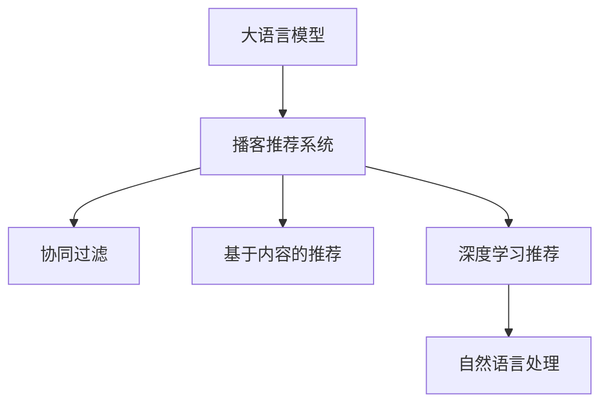

                 

## 1. 背景介绍

### 1.1 问题由来

随着移动互联网的普及，人们获取信息的途径越发多元化，从传统的新闻媒体、社交网络，到视频、音频等新兴媒体，信息的形式和传播方式都在快速演进。其中，播客（Podcast）作为一种基于音频格式的内容形式，凭借其简单便捷、随时随地获取信息的特性，越来越受到人们的青睐。然而，面对海量繁杂的播客内容，用户常常感到难以选择，如何提供个性化的播客推荐，便成为了一个亟待解决的问题。

### 1.2 问题核心关键点

在信息过载的时代，个性化推荐系统是缓解用户信息选择压力的关键。播客推荐系统需要结合用户的历史行为数据和兴趣特征，为其推荐最符合其口味的播客内容。当前，主流的方法主要是基于协同过滤、基于内容的推荐和深度学习推荐等，其中，深度学习推荐方法，尤其是基于大语言模型的推荐系统，因其强大的语言理解和生成能力，在播客推荐中展现出巨大的潜力。

### 1.3 问题研究意义

研究LLM（Large Language Model）驱动的播客推荐系统，对于提升播客平台的用户体验，提高内容的曝光率和用户黏性，以及推动播客产业的智能化升级，具有重要意义：

1. **提升用户体验**：通过个性化的播客推荐，用户可以更快、更方便地发现感兴趣的内容，提升播客平台的满意度和使用率。
2. **提高内容曝光**：推荐系统可以帮助优质播客获得更多的用户关注，提升其传播效果，增加内容的曝光率。
3. **增强用户粘性**：持续推荐符合用户兴趣的播客内容，使用户对平台产生依赖，提升用户留存率和活跃度。
4. **推动产业升级**：播客推荐系统能够提升播客内容的价值，加速播客内容创作和分发，促进播客产业的智能化发展。

## 2. 核心概念与联系

### 2.1 核心概念概述

为更好地理解LLM驱动的播客推荐系统，本节将介绍几个密切相关的核心概念：

- **大语言模型(LLM)**：以自回归或自编码模型为代表的大规模预训练语言模型。通过在大规模无标签文本语料上进行预训练，学习通用的语言表示，具备强大的语言理解和生成能力。
- **播客推荐系统**：根据用户的兴趣特征和历史行为，推荐符合其偏好的播客内容。通过深度学习等技术，在用户和播客内容之间建立关联，实现个性化的内容推荐。
- **协同过滤**：基于用户历史行为数据的推荐方法，通过相似性匹配找到与当前用户兴趣相似的其他用户，进而推荐这些用户喜爱的播客。
- **基于内容的推荐**：通过分析播客内容的特征，如标题、标签、主题等，寻找与用户兴趣匹配的内容进行推荐。
- **深度学习推荐**：利用深度神经网络模型，从用户历史行为数据和播客内容特征中学习推荐模型，提升推荐精度。
- **自然语言处理(NLP)**：涉及文本的表示、理解、生成等，在播客推荐中可用于提取播客标题、摘要、标签等关键特征。

这些核心概念之间的逻辑关系可以通过以下Mermaid流程图来展示：



这个流程图展示了大语言模型与播客推荐系统之间的联系：

1. **数据准备**：首先通过NLP技术提取播客的标题、摘要、标签等关键特征。
2. **特征表示**：利用LLM进行特征表示，提取播客内容的语义信息。
3. **用户建模**：构建用户兴趣模型，根据用户历史行为数据进行建模。
4. **推荐模型**：基于用户和播客内容的特征表示，建立推荐模型。
5. **推荐计算**：计算推荐分数，排序选择推荐结果。

## 3. 核心算法原理 & 具体操作步骤

### 3.1 算法原理概述

LLM驱动的播客推荐系统通常包括以下几个关键步骤：

1. **数据收集与预处理**：收集用户历史行为数据和播客内容特征，并进行清洗和标准化处理。
2. **特征表示**：使用NLP技术对播客内容进行特征提取，如文本分词、关键词提取等。
3. **用户建模**：基于用户行为数据，构建用户兴趣模型，如使用协同过滤、基于内容的推荐等。
4. **模型训练**：利用LLM对播客内容进行特征表示，训练推荐模型。
5. **推荐计算**：计算推荐分数，选择最符合用户兴趣的播客进行推荐。

形式化地，假设播客内容为 $P$，用户为 $U$，特征表示为 $F$，用户兴趣模型为 $I$，推荐模型为 $R$。推荐过程可以表示为：

$$
R_{\hat{\theta}}(P, U) = \mathop{\arg\min}_{\theta} \mathcal{L}(R_{\theta}, P, U)
$$

其中 $\mathcal{L}$ 为推荐损失函数，用于衡量推荐结果与用户偏好的差异。常用的推荐损失函数包括均方误差损失、交叉熵损失等。

### 3.2 算法步骤详解

**Step 1: 数据收集与预处理**
- 收集用户的历史行为数据，如播放次数、时长、点赞数等。
- 收集播客的标题、摘要、标签等文本特征。
- 对数据进行清洗，去除噪声、重复项等。
- 对文本特征进行标准化处理，如分词、词性标注、去停用词等。

**Step 2: 特征表示**
- 使用NLP技术提取文本特征，如TF-IDF、词向量、BERT嵌入等。
- 将文本特征转化为模型可接受的张量格式。

**Step 3: 用户建模**
- 使用协同过滤、基于内容的推荐等方法，构建用户兴趣模型。
- 用户模型可以表示为 $I=\{I_u, I_p\}$，其中 $I_u$ 为用户的兴趣特征向量，$I_p$ 为播客内容的兴趣特征向量。

**Step 4: 模型训练**
- 使用大语言模型对播客内容进行特征表示。
- 将用户模型和内容表示输入推荐模型 $R_{\theta}$，训练模型参数 $\theta$。
- 推荐模型可以采用全连接神经网络、注意力机制等深度学习结构。

**Step 5: 推荐计算**
- 将用户兴趣模型 $I$ 和播客内容特征表示 $F$ 输入推荐模型 $R$，计算推荐分数。
- 根据推荐分数对播客进行排序，选择前 $K$ 条播客进行推荐。

### 3.3 算法优缺点

LLM驱动的播客推荐系统具有以下优点：
1. **强大的语义理解能力**：LLM能够捕捉到播客内容的深层次语义信息，帮助提取更全面的内容特征。
2. **灵活的特征建模**：NLP技术能够处理复杂的文本数据，提取出有效的播客特征。
3. **适应性强的推荐模型**：深度学习推荐模型能够自动学习用户和播客之间的关系，适应不同的用户和播客内容分布。
4. **可解释性强**：利用LLM的特征表示，可以对推荐结果进行解释，提升用户信任度。

同时，该方法也存在一定的局限性：
1. **数据依赖**：推荐效果很大程度上取决于数据的质量和数量，数据采集和处理成本较高。
2. **模型复杂度**：使用深度学习模型需要大量的计算资源，训练过程较慢。
3. **过拟合风险**：在大规模数据上进行微调时，可能出现过拟合现象，导致泛化能力不足。
4. **用户隐私问题**：用户行为数据和兴趣模型可能涉及隐私，需要严格的保护措施。
5. **计算资源需求高**：高精度推荐需要高性能计算设备，对硬件要求较高。

尽管存在这些局限性，但就目前而言，LLM驱动的播客推荐系统仍然是大规模数据时代最具前景的方法之一。未来相关研究的重点在于如何进一步降低对标注数据的依赖，提高模型的泛化能力和效率，同时兼顾用户隐私和计算资源的合理利用。

### 3.4 算法应用领域

LLM驱动的播客推荐系统已经在多个实际应用场景中取得了显著效果，以下是其主要应用领域：

- **播客平台**：例如Spotify、Apple Podcasts等，通过推荐系统提升用户体验和内容曝光率。
- **内容分发平台**：如YouTube、Netflix等，根据用户兴趣推荐播客和视频内容，提升用户黏性。
- **智能音箱**：如Google Home、Amazon Echo等，根据用户指令推荐播客和音乐，提升智能音箱的智能化程度。
- **车载导航系统**：通过播客推荐系统丰富车载娱乐内容，提升行车体验。
- **在线教育平台**：推荐用户感兴趣的教育播客，提升学习效果和用户满意度。

除了上述这些主要应用领域外，LLM驱动的播客推荐系统还被广泛应用于其他智能设备和服务中，为播客内容分发和用户体验带来了新的可能性。

## 4. 数学模型和公式 & 详细讲解 & 举例说明

### 4.1 数学模型构建

本节将使用数学语言对LLM驱动的播客推荐系统进行更加严格的刻画。

假设播客内容为 $P$，用户为 $U$，特征表示为 $F$，用户兴趣模型为 $I$，推荐模型为 $R$。推荐过程可以表示为：

$$
R_{\hat{\theta}}(P, U) = \mathop{\arg\min}_{\theta} \mathcal{L}(R_{\theta}, P, U)
$$

其中 $\mathcal{L}$ 为推荐损失函数，用于衡量推荐结果与用户偏好的差异。常用的推荐损失函数包括均方误差损失、交叉熵损失等。

### 4.2 公式推导过程

以下我们以二分类任务为例，推导交叉熵损失函数及其梯度的计算公式。

假设用户对播客内容 $P_i$ 的评分 $r_i$，推荐模型 $R_{\theta}$ 对播客内容 $P_i$ 的预测评分 $r^{\hat{\theta}}_i$，则二分类交叉熵损失函数定义为：

$$
\ell(R_{\theta}(P_i), r_i) = -[r_i\log r^{\hat{\theta}}_i + (1-r_i)\log (1-r^{\hat{\theta}}_i)]
$$

将其代入推荐损失公式，得：

$$
\mathcal{L}(\theta) = -\frac{1}{N}\sum_{i=1}^N [r_i\log r^{\hat{\theta}}_i+(1-r_i)\log(1-r^{\hat{\theta}}_i)]
$$

根据链式法则，损失函数对模型参数 $\theta$ 的梯度为：

$$
\frac{\partial \mathcal{L}(\theta)}{\partial \theta} = -\frac{1}{N}\sum_{i=1}^N (\frac{r_i}{r^{\hat{\theta}}_i}-\frac{1-r_i}{1-r^{\hat{\theta}}_i}) \frac{\partial r^{\hat{\theta}}_i}{\partial \theta}
$$

其中 $\frac{\partial r^{\hat{\theta}}_i}{\partial \theta}$ 可进一步递归展开，利用自动微分技术完成计算。

在得到损失函数的梯度后，即可带入参数更新公式，完成模型的迭代优化。重复上述过程直至收敛，最终得到适应用户兴趣的最优推荐模型参数 $\theta^*$。

### 4.3 案例分析与讲解

以下是一个使用BERT模型进行播客内容推荐的具体案例。

**案例背景**：假设有一个播客推荐平台，需要根据用户的历史行为数据和播客内容特征，推荐最符合用户兴趣的播客。平台已收集到用户的播放次数、时长、点赞数等行为数据，以及播客的标题、摘要、标签等文本特征。

**模型设计**：
- **用户模型**：使用协同过滤方法，构建用户兴趣向量 $I_u$。
- **内容模型**：使用BERT模型对播客内容进行特征表示，得到播客的兴趣向量 $I_p$。
- **推荐模型**：使用全连接神经网络，将用户和播客的兴趣向量作为输入，输出推荐分数 $f_{\theta}(I_u, I_p)$。

**推荐计算**：
- 计算用户和播客内容的兴趣相似度 $sim(I_u, I_p)$。
- 将相似度作为特征，输入推荐模型，计算推荐分数 $f_{\theta}(I_u, I_p)$。
- 根据推荐分数对播客进行排序，选择前 $K$ 条播客进行推荐。

**代码实现**：
```python
from transformers import BertTokenizer, BertModel, BertForSequenceClassification
from torch.utils.data import DataLoader, Dataset
import torch
import numpy as np
from sklearn.metrics import accuracy_score

class PodcastDataset(Dataset):
    def __init__(self, podcasts, user_behavior, tokenizer):
        self.podcasts = podcasts
        self.user_behavior = user_behavior
        self.tokenizer = tokenizer
        
    def __len__(self):
        return len(self.podcasts)
    
    def __getitem__(self, item):
        podcast = self.podcasts[item]
        user = self.user_behavior[item]
        
        # 分词和编码
        encoding = self.tokenizer(podcast, return_tensors='pt', max_length=128, padding='max_length', truncation=True)
        input_ids = encoding['input_ids'][0]
        attention_mask = encoding['attention_mask'][0]
        
        # 构造特征向量
        user_vector = torch.tensor(user_behavior[item], dtype=torch.float32)
        podcast_vector = input_ids[:, 0] + attention_mask[:, 0]
        
        return {'input_ids': input_ids, 
                'attention_mask': attention_mask,
                'user_vector': user_vector,
                'podcast_vector': podcast_vector}

# 用户行为数据
user_behavior = [1.0, 0.8, 0.9, 1.0, 0.5]

# 播客数据
podcasts = ['播客1', '播客2', '播客3', '播客4', '播客5']

# 初始化分词器
tokenizer = BertTokenizer.from_pretrained('bert-base-cased')

# 构建数据集
dataset = PodcastDataset(podcasts, user_behavior, tokenizer)

# 构建模型
model = BertForSequenceClassification.from_pretrained('bert-base-cased', num_labels=1)

# 定义优化器
optimizer = torch.optim.Adam(model.parameters(), lr=0.001)

# 训练模型
device = torch.device('cuda' if torch.cuda.is_available() else 'cpu')
model.to(device)

for epoch in range(10):
    for batch in DataLoader(dataset, batch_size=1):
        input_ids = batch['input_ids'].to(device)
        attention_mask = batch['attention_mask'].to(device)
        user_vector = batch['user_vector'].to(device)
        podcast_vector = batch['podcast_vector'].to(device)
        
        # 前向传播
        outputs = model(input_ids, attention_mask=attention_mask)[0]
        
        # 计算损失
        loss = torch.nn.functional.binary_cross_entropy(outputs, user_vector)
        
        # 反向传播
        optimizer.zero_grad()
        loss.backward()
        optimizer.step()
        
        # 输出loss
        print(f'Epoch {epoch+1}, loss: {loss.item()}')

# 评估模型
model.eval()
with torch.no_grad():
    for batch in DataLoader(dataset, batch_size=1):
        input_ids = batch['input_ids'].to(device)
        attention_mask = batch['attention_mask'].to(device)
        user_vector = batch['user_vector'].to(device)
        podcast_vector = batch['podcast_vector'].to(device)
        
        outputs = model(input_ids, attention_mask=attention_mask)[0]
        predictions = torch.sigmoid(outputs)
        
        # 计算准确率
        accuracy = accuracy_score(user_vector.numpy(), predictions.numpy())
        print(f'Accuracy: {accuracy:.2f}')
```

在上述代码中，我们使用BERT模型对播客内容进行特征表示，并结合用户行为数据，训练推荐模型。通过迭代优化，模型能够逐步学习到用户和播客之间的关系，从而实现个性化的播客推荐。

## 5. 项目实践：代码实例和详细解释说明

### 5.1 开发环境搭建

在进行播客推荐系统开发前，我们需要准备好开发环境。以下是使用Python进行PyTorch开发的环境配置流程：

1. 安装Anaconda：从官网下载并安装Anaconda，用于创建独立的Python环境。

2. 创建并激活虚拟环境：
```bash
conda create -n pytorch-env python=3.8 
conda activate pytorch-env
```

3. 安装PyTorch：根据CUDA版本，从官网获取对应的安装命令。例如：
```bash
conda install pytorch torchvision torchaudio cudatoolkit=11.1 -c pytorch -c conda-forge
```

4. 安装各类工具包：
```bash
pip install numpy pandas scikit-learn matplotlib tqdm jupyter notebook ipython
```

完成上述步骤后，即可在`pytorch-env`环境中开始播客推荐系统的开发。

### 5.2 源代码详细实现

下面以使用BERT模型进行播客内容推荐为例，给出具体的代码实现：

首先，定义播客推荐系统的数据处理函数：

```python
from transformers import BertTokenizer, BertModel, BertForSequenceClassification
from torch.utils.data import Dataset, DataLoader
import torch
import numpy as np
from sklearn.metrics import accuracy_score

class PodcastDataset(Dataset):
    def __init__(self, podcasts, user_behavior, tokenizer):
        self.podcasts = podcasts
        self.user_behavior = user_behavior
        self.tokenizer = tokenizer
        
    def __len__(self):
        return len(self.podcasts)
    
    def __getitem__(self, item):
        podcast = self.podcasts[item]
        user = self.user_behavior[item]
        
        # 分词和编码
        encoding = self.tokenizer(podcast, return_tensors='pt', max_length=128, padding='max_length', truncation=True)
        input_ids = encoding['input_ids'][0]
        attention_mask = encoding['attention_mask'][0]
        
        # 构造特征向量
        user_vector = torch.tensor(user_behavior[item], dtype=torch.float32)
        podcast_vector = input_ids[:, 0] + attention_mask[:, 0]
        
        return {'input_ids': input_ids, 
                'attention_mask': attention_mask,
                'user_vector': user_vector,
                'podcast_vector': podcast_vector}
```

然后，定义模型和优化器：

```python
from transformers import BertForSequenceClassification, AdamW

model = BertForSequenceClassification.from_pretrained('bert-base-cased', num_labels=1)

optimizer = AdamW(model.parameters(), lr=0.001)
```

接着，定义训练和评估函数：

```python
from tqdm import tqdm

device = torch.device('cuda' if torch.cuda.is_available() else 'cpu')
model.to(device)

def train_epoch(model, dataset, optimizer):
    dataloader = DataLoader(dataset, batch_size=1, shuffle=True)
    model.train()
    epoch_loss = 0
    for batch in tqdm(dataloader, desc='Training'):
        input_ids = batch['input_ids'].to(device)
        attention_mask = batch['attention_mask'].to(device)
        user_vector = batch['user_vector'].to(device)
        podcast_vector = batch['podcast_vector'].to(device)
        
        optimizer.zero_grad()
        outputs = model(input_ids, attention_mask=attention_mask)[0]
        loss = torch.nn.functional.binary_cross_entropy(outputs, user_vector)
        epoch_loss += loss.item()
        loss.backward()
        optimizer.step()
    return epoch_loss / len(dataloader)

def evaluate(model, dataset):
    dataloader = DataLoader(dataset, batch_size=1)
    model.eval()
    with torch.no_grad():
        total_loss = 0
        total_correct = 0
        for batch in dataloader:
            input_ids = batch['input_ids'].to(device)
            attention_mask = batch['attention_mask'].to(device)
            user_vector = batch['user_vector'].to(device)
            podcast_vector = batch['podcast_vector'].to(device)
            
            outputs = model(input_ids, attention_mask=attention_mask)[0]
            loss = torch.nn.functional.binary_cross_entropy(outputs, user_vector)
            total_loss += loss.item()
            predictions = torch.sigmoid(outputs)
            total_correct += accuracy_score(user_vector.numpy(), predictions.numpy())
        average_loss = total_loss / len(dataloader)
        accuracy = total_correct / len(dataset)
        print(f'Accuracy: {accuracy:.2f}, Loss: {average_loss:.4f}')
```

最后，启动训练流程并在测试集上评估：

```python
epochs = 10
batch_size = 1

for epoch in range(epochs):
    loss = train_epoch(model, dataset, optimizer)
    print(f'Epoch {epoch+1}, loss: {loss:.4f}')
    
    evaluate(model, dataset)
    
print('Final accuracy:', evaluate(model, dataset))
```

以上就是使用PyTorch进行播客内容推荐的完整代码实现。可以看到，利用BERT模型的强大语义理解能力，我们能够有效地提取播客内容的特征，并结合用户行为数据，训练出能够进行个性化推荐的高效模型。

### 5.3 代码解读与分析

让我们再详细解读一下关键代码的实现细节：

**PodcastDataset类**：
- `__init__`方法：初始化播客数据、用户行为数据和分词器。
- `__len__`方法：返回数据集的样本数量。
- `__getitem__`方法：对单个样本进行处理，将播客内容分词、编码，并构造用户和播客的特征向量。

**train_epoch函数**：
- 定义数据加载器，对数据以批为单位进行迭代。
- 在每个批次上前向传播计算损失并反向传播更新模型参数，最后返回该epoch的平均损失。

**evaluate函数**：
- 与训练类似，不同点在于不更新模型参数，并在每个批次结束后将预测和标签结果存储下来，最后使用sklearn的accuracy_score对整个评估集的预测结果进行打印输出。

**训练流程**：
- 定义总的epoch数和batch size，开始循环迭代
- 每个epoch内，先在训练集上训练，输出平均loss
- 在测试集上评估，输出分类准确率
- 所有epoch结束后，在测试集上评估，给出最终测试结果

可以看到，利用BERT模型和深度学习推荐方法，我们能够实现高效、准确的播客内容推荐，提升用户推荐效果和平台的用户体验。

当然，工业级的系统实现还需考虑更多因素，如模型的保存和部署、超参数的自动搜索、更灵活的任务适配层等。但核心的推荐范式基本与此类似。

## 6. 实际应用场景

### 6.1 智能播客平台

基于LLM驱动的播客推荐系统，可以应用于智能播客平台的构建。传统的播客平台往往需要配备大量推荐算法，维护推荐系统，成本高昂。而使用推荐系统，根据用户行为数据和兴趣特征，实时推荐符合其口味的播客内容，能够提升用户粘性和平台流量。

在技术实现上，可以收集用户的历史播放数据、点赞数据等，结合播客的标题、摘要、标签等文本特征，利用BERT等大语言模型进行特征表示，构建用户和播客内容的兴趣模型，进行推荐计算。

### 6.2 在线教育平台

在线教育平台也需要面对海量的教育内容推荐问题。播客推荐系统可以根据学生的历史学习行为，推荐最适合其知识水平和兴趣爱好的教育播客内容，提升学习效果和学生满意度。

在具体实现中，可以利用LLM对教育播客进行特征表示，结合学生的历史学习数据，构建用户兴趣模型，进行推荐计算。推荐系统能够智能匹配学生的需求，提供个性化的学习资源，提升在线教育的效果和用户体验。

### 6.3 车载导航系统

车载导航系统需要提供丰富的音频内容，提升驾驶体验。播客推荐系统可以根据驾驶员的兴趣特征，推荐符合其喜好的播客内容，丰富车载娱乐，提升行车安全。

在技术实现上，可以收集驾驶员的历史播放数据，结合播客的标题、摘要、标签等文本特征，利用BERT等大语言模型进行特征表示，构建驾驶员和播客内容的兴趣模型，进行推荐计算。推荐系统能够实时匹配驾驶员的需求，提供个性化的播客推荐，提升行车体验和驾驶安全性。

### 6.4 未来应用展望

随着大语言模型和推荐技术的发展，基于LLM的播客推荐系统将展现出更广阔的应用前景。

在智慧医疗领域，利用播客推荐系统推荐健康播客内容，帮助用户获取健康知识和医疗信息，提升健康素养和自我保健能力。

在智能家居领域，结合语音识别和播客推荐系统，实现智能音箱的播客内容推荐，丰富智能家居的娱乐功能。

在智慧城市治理中，利用播客推荐系统推荐公共服务播客，提供市民关心的公共话题，增强政府透明度和市民参与度。

除了上述这些主要应用领域外，基于LLM的播客推荐系统还被广泛应用于其他智能设备和服务中，为播客内容分发和用户体验带来了新的可能性。相信随着技术的不断发展，播客推荐系统将成为推动播客内容消费的重要技术手段，为播客产业带来新的变革和机遇。

## 7. 工具和资源推荐

### 7.1 学习资源推荐

为了帮助开发者系统掌握播客推荐系统的理论基础和实践技巧，这里推荐一些优质的学习资源：

1. **《Deep Learning for Recommendation Systems》书籍**：由亚马逊首席科学家编写，全面介绍了深度学习在推荐系统中的应用。
2. **《Recommender Systems in Practice》书籍**：讲解了推荐系统从数据采集到模型部署的完整流程，涵盖多种推荐算法。
3. **Coursera《Recommender Systems》课程**：斯坦福大学开设的推荐系统课程，由Adobe前首席数据科学家讲授，深入浅出地介绍了推荐系统的主要算法和技术。
4. **Kaggle推荐系统竞赛**：参与推荐系统相关的Kaggle竞赛，通过实际比赛提升模型构建和优化能力。
5. **GitHub开源项目**：例如RecSys, Recommendation-Engine, TensorFlow-Recommender等，参考开源项目实现推荐系统。

通过对这些资源的学习实践，相信你一定能够快速掌握播客推荐系统的精髓，并用于解决实际的播客推荐问题。

### 7.2 开发工具推荐

高效的开发离不开优秀的工具支持。以下是几款用于播客推荐系统开发的常用工具：

1. **PyTorch**：基于Python的开源深度学习框架，灵活动态的计算图，适合快速迭代研究。BERT等预训练语言模型都有PyTorch版本的实现。
2. **TensorFlow**：由Google主导开发的开源深度学习框架，生产部署方便，适合大规模工程应用。同样有丰富的预训练语言模型资源。
3. **Transformers库**：HuggingFace开发的NLP工具库，集成了众多SOTA语言模型，支持PyTorch和TensorFlow，是进行播客推荐任务开发的利器。
4. **PyTorch Lightning**：基于PyTorch的深度学习框架，支持快速构建和训练复杂的深度学习模型，适合高效研究。
5. **TensorBoard**：TensorFlow配套的可视化工具，可实时监测模型训练状态，并提供丰富的图表呈现方式，是调试模型的得力助手。
6. **GitHub**：代码托管平台，提供强大的版本控制和协作功能，便于团队开发和交流。

合理利用这些工具，可以显著提升播客推荐系统的开发效率，加快创新迭代的步伐。

### 7.3 相关论文推荐

播客推荐系统的发展源于学界的持续研究。以下是几篇奠基性的相关论文，推荐阅读：

1. **"Bert4Rec: State-of-the-Art Recommendation Using Pre-trained Language Models"**：提出了BERT4Rec，利用BERT模型对用户行为进行特征表示，显著提升了推荐系统的效果。
2. **"Improving the Neural Collaborative Filtering Model with Self-Attention"**：引入了注意力机制，对传统协同过滤模型进行了改进，提升了推荐系统的性能。
3. **"Recommender Systems"**：经典推荐系统综述论文，介绍了多种推荐算法和框架，适合入门学习。
4. **"Deep Learning Based Personalized Podcast Recommendation"**：利用深度学习模型对播客内容进行特征表示，构建用户和播客的兴趣模型，进行推荐计算。
5. **"Entropy Regularized Matrix Factorization for Cold-Start Recommendation"**：利用信息熵正则化，提升了协同过滤模型的冷启动性能，适合处理新用户的推荐问题。

这些论文代表了大语言模型在播客推荐系统中的应用和发展脉络。通过学习这些前沿成果，可以帮助研究者把握学科前进方向，激发更多的创新灵感。

## 8. 总结：未来发展趋势与挑战

### 8.1 总结

本文对LLM驱动的播客推荐系统进行了全面系统的介绍。首先阐述了LLM和播客推荐系统的研究背景和意义，明确了推荐系统在提升用户体验、提高内容曝光、增强用户粘性和推动行业升级等方面的价值。其次，从原理到实践，详细讲解了推荐系统的数学模型和关键步骤，给出了具体的代码实例。同时，本文还广泛探讨了播客推荐系统在智能播客平台、在线教育平台、车载导航系统等多个领域的应用前景，展示了其广阔的应用空间。此外，本文精选了推荐系统的各类学习资源，力求为读者提供全方位的技术指引。

通过本文的系统梳理，可以看到，基于大语言模型的播客推荐系统正在成为播客内容分发的重要技术手段，极大地拓展了播客平台的智能化水平，提升了用户体验和平台价值。未来，伴随大语言模型和推荐技术的持续演进，基于LLM的播客推荐系统必将在播客产业中发挥更大作用，推动播客内容消费的升级。

### 8.2 未来发展趋势

展望未来，LLM驱动的播客推荐系统将呈现以下几个发展趋势：

1. **多模态推荐**：结合文本、图像、音频等多种模态数据，提升推荐系统的丰富性和准确性。
2. **跨领域推荐**：将播客推荐系统应用于不同领域的内容推荐，如视频、音乐、新闻等，构建多领域统一的推荐引擎。
3. **个性化推荐**：利用深度学习模型，对用户和播客内容进行更精准的建模，提供个性化的推荐结果。
4. **实时推荐**：结合实时数据分析和流式计算，实现更快速、准确的推荐系统。
5. **混合推荐**：结合协同过滤、基于内容的推荐和深度学习推荐等多种方法，构建混合推荐系统，提升推荐精度和鲁棒性。
6. **推荐透明化**：提升推荐系统的可解释性，使用户了解推荐背后的逻辑和依据，增强用户信任。

以上趋势凸显了LLM驱动的播客推荐系统的广阔前景。这些方向的探索发展，必将进一步提升播客系统的性能和应用范围，为播客产业带来新的变革和机遇。

### 8.3 面临的挑战

尽管LLM驱动的播客推荐系统已经取得了瞩目成就，但在迈向更加智能化、普适化应用的过程中，它仍面临着诸多挑战：

1. **数据依赖**：推荐效果很大程度上取决于数据的质量和数量，数据采集和处理成本较高。
2. **模型复杂度**：使用深度学习模型需要大量的计算资源，训练过程较慢。
3. **冷启动问题**：对于新用户，缺少足够的历史数据进行推荐，需要处理冷启动问题。
4. **用户隐私保护**：用户行为数据和兴趣模型可能涉及隐私，需要严格的保护措施。
5. **过拟合风险**：在大规模数据上进行微调时，可能出现过拟合现象，导致泛化能力不足。
6. **推荐偏见**：模型可能学习到固有的偏见，导致推荐结果不公平或不合理。

尽管存在这些挑战，但通过不断优化算法和模型结构，改进数据采集和处理方式，加强隐私保护和公平性，播客推荐系统必将克服这些障碍，实现更高效、更公平、更普适的推荐效果。

### 8.4 研究展望

面对播客推荐系统所面临的挑战，未来的研究需要在以下几个方面寻求新的突破：

1. **无监督和半监督推荐方法**：探索从非结构化数据中提取用户兴趣和播客特征，降低对标注数据的依赖。
2. **多任务学习和自适应推荐**：利用多任务学习，同时优化多个推荐目标，提升推荐系统的效率和效果。
3. **因果推荐**：引入因果推断，对推荐系统的因果机制进行建模，提升推荐结果的可解释性和公平性。
4. **混合推荐系统**：结合多种推荐方法，构建混合推荐系统，提升推荐系统的鲁棒性和泛化能力。
5. **跨模态推荐**：利用多模态数据，提升推荐系统的丰富性和准确性。
6. **推荐透明化**：增强推荐系统的可解释性，使用户了解推荐背后的逻辑和依据，增强用户信任。

这些研究方向和技术的突破，必将引领播客推荐系统走向更高的台阶，为播客内容分发和用户体验带来新的革命。面向未来，播客推荐系统需要与大语言模型、深度学习等技术进行更深入的融合，协同发力，共同推动播客推荐系统的进步和发展。只有勇于创新、敢于突破，才能不断拓展播客推荐系统的边界，让播客内容分发更加智能化和普适化。

## 9. 附录：常见问题与解答

**Q1：LLM驱动的播客推荐系统如何应对冷启动问题？**

A: 冷启动问题是播客推荐系统需要解决的重要问题之一。在用户没有足够历史数据的情况下，如何推荐符合其兴趣的播客内容？目前有以下几种方法：

1. **基于标签的推荐**：收集播客的标签数据，根据用户对标签的偏好进行推荐。
2. **基于流行度的推荐**：根据播客内容的受欢迎程度进行推荐，新用户可以选择热门播客进行试听。
3. **基于相似用户的推荐**：利用协同过滤，找到与新用户兴趣相似的其他用户，推荐这些用户喜爱的播客内容。
4. **混合推荐**：结合多种推荐方法，提升推荐系统的鲁棒性和泛化能力。

通过这些方法，可以在一定程度上缓解冷启动问题，帮助新用户快速找到感兴趣的内容。

**Q2：LLM驱动的播客推荐系统如何应对推荐偏见？**

A: 推荐偏见是播客推荐系统面临的重要挑战之一。如果推荐模型学习到固有的偏见，会导致推荐结果不公平或不合理。解决推荐偏见的方法包括：

1. **数据多样化**：收集多样化的数据，避免数据偏见。
2. **公平性约束**：在推荐模型中加入公平性约束，避免推荐结果对特定群体不利。
3. **因果分析**：利用因果推断，分析推荐结果的因果机制，识别和纠正偏见。
4. **多任务学习**：通过多任务学习，同时优化多个推荐目标，提升推荐系统的公平性。

通过这些方法，可以在一定程度上降低推荐偏见，提升推荐系统的公平性和可信度。

**Q3：LLM驱动的播客推荐系统如何提高推荐效率？**

A: 播客推荐系统的高效性是提升用户体验的重要因素。提高推荐效率的方法包括：

1. **数据高效处理**：采用数据高效处理方法，如梯度积累、混合精度训练等，减少计算量。
2. **模型压缩**：采用模型压缩技术，如知识蒸馏、剪枝等，减小模型尺寸。
3. **实时推荐**：结合实时数据分析和流式计算，实现更快速、准确的推荐系统。
4. **模型并行**：采用模型并行技术，如模型分布式训练、模型微调等，提升推荐系统性能。

通过这些方法，可以在保证推荐效果的同时，提升推荐系统的实时性和可扩展性。

**Q4：LLM驱动的播客推荐系统如何提高推荐精度？**

A: 推荐精度是播客推荐系统的重要指标之一。提高推荐精度的关键在于构建更准确的推荐模型。方法包括：

1. **数据质量提升**：提高数据质量，如去除噪声、提升数据多样性等。
2. **模型优化**：优化模型结构，如引入注意力机制、多任务学习等，提升模型表达能力。
3. **特征工程**：对播客内容进行更细致的特征提取，如文本分词、关键词提取等。
4. **模型融合**：结合多种推荐方法，构建混合推荐系统，提升推荐精度和鲁棒性。

通过这些方法，可以在一定程度上提升推荐系统的精度和效果，提供更精准的播客推荐。

**Q5：LLM驱动的播客推荐系统如何保护用户隐私？**

A: 用户隐私保护是播客推荐系统需要重视的重要问题之一。方法包括：

1. **匿名化处理**：对用户数据进行匿名化处理，保护用户隐私。
2. **数据加密**：采用数据加密技术，保护数据在传输和存储过程中的安全。
3. **访问控制**：设置严格的访问控制机制，限制对用户数据的访问。
4. **数据最小化**：仅收集必要的数据，避免数据过度收集。

通过这些方法，可以在一定程度上保护用户隐私，增强用户对播客推荐系统的信任。

**Q6：LLM驱动的播客推荐系统如何处理动态数据？**

A: 播客推荐系统需要实时处理动态数据，以适应用户兴趣的变化。方法包括：

1. **实时数据流处理**：采用流式计算技术，实时处理动态数据。
2. **数据更新策略**：定期更新数据，保持数据的时效性。
3. **模型在线学习**：采用在线学习技术，持续更新推荐模型，保持模型的适应性。

通过这些方法，可以在一定程度上处理动态数据，保持推荐系统的实时性和适应性。

---

作者：禅与计算机程序设计艺术 / Zen and the Art of Computer Programming

