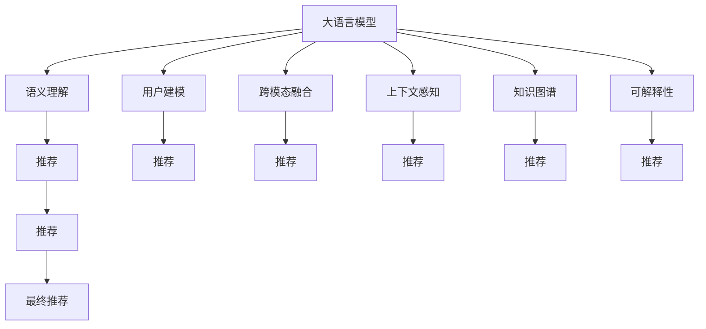

                 

# LLM驱动的个性化学习资源推荐

## 1. 背景介绍

### 1.1 问题由来

随着互联网的普及和数字化学习的兴起，学习资源呈现出指数级的增长。然而，如何高效地发现和利用这些资源，仍然是一个巨大的挑战。传统的内容推荐方法，如基于协同过滤、兴趣图谱等，虽然在某些场景下效果不错，但依然存在以下问题：

1. **缺乏语义理解**：现有方法大多基于用户行为数据进行推荐，忽视了学习内容的语义信息和用户的学习需求。
2. **难以处理多模态数据**：现有的推荐系统多聚焦于文本数据，无法有效地融合图像、音频等多模态信息。
3. **模型复杂度高**：许多推荐算法需要训练大规模模型，计算成本高，难以在实时系统中部署。
4. **个性化不足**：推荐模型往往对大部分用户进行“一刀切”的推荐，难以满足用户个性化的学习需求。

为了解决上述问题，我们需要一种能够深度理解用户学习需求和内容语义的推荐系统。而大语言模型（Large Language Models, LLMs）的崛起，为这一目标提供了可能。大语言模型具备强大的自然语言理解能力，能够基于用户的学习兴趣和行为数据，个性化地推荐学习资源。

### 1.2 问题核心关键点

大语言模型驱动的个性化学习资源推荐，其核心在于：

- **语义理解**：通过预训练的通用语言模型，提取学习内容的语义信息。
- **用户建模**：基于用户行为数据，构建个性化的用户模型。
- **跨模态融合**：融合图像、视频、音频等多模态数据，丰富推荐内容的维度。
- **上下文感知**：考虑用户的学习上下文，如时间、地点、设备等，进行个性化推荐。
- **可解释性**：提供推荐理由，增强用户信任感。

本文将围绕上述核心点，系统介绍基于大语言模型的个性化学习资源推荐方法。

## 2. 核心概念与联系

### 2.1 核心概念概述

为更好地理解大语言模型驱动的个性化学习资源推荐方法，本节将介绍几个密切相关的核心概念：

- **大语言模型（LLMs）**：指通过大规模无标签文本数据预训练得到的语言模型，如GPT-3、BERT等。具备强大的自然语言理解能力，能够处理长文本，生成高质量的自然语言。
- **个性化推荐**：根据用户的历史行为数据和兴趣偏好，为其推荐最相关的学习资源。
- **跨模态推荐**：融合图像、视频、音频等多模态数据，进行综合推荐。
- **上下文感知推荐**：考虑用户的学习环境和上下文，进行更精准的推荐。
- **知识图谱**：将知识结构化的图数据结构，便于机器理解和推理。
- **可解释性（Explainability）**：推荐系统能够解释其推荐的理由，增强用户信任感。

这些核心概念之间的逻辑关系可以通过以下Mermaid流程图来展示：



这个流程图展示了大语言模型驱动的个性化学习资源推荐的各个关键组件及其之间的关系：

1. 大语言模型通过预训练获得强大的语言理解能力。
2. 用户建模基于用户行为数据，构建个性化的用户模型。
3. 跨模态融合融合多模态数据，丰富推荐内容。
4. 上下文感知考虑用户的学习环境和上下文。
5. 知识图谱辅助模型理解知识结构，增强推荐的相关性。
6. 可解释性提供推荐理由，增强用户信任感。

这些概念共同构成了个性化学习资源推荐的核心框架，使得推荐系统能够更好地满足用户的多样化需求。

## 3. 核心算法原理 & 具体操作步骤

### 3.1 算法原理概述

基于大语言模型的个性化学习资源推荐方法，其核心思想是：将大语言模型作为推荐引擎的核心，通过理解学习内容的语义信息和用户的学习需求，生成个性化的推荐结果。

具体而言，该方法可以分为以下几个步骤：

1. **语义理解**：利用大语言模型，对学习内容进行语义分析，提取关键信息。
2. **用户建模**：基于用户行为数据，构建个性化用户模型。
3. **跨模态融合**：融合多模态数据，丰富推荐内容。
4. **上下文感知推荐**：考虑用户的学习环境和上下文，进行更精准的推荐。
5. **知识图谱辅助**：通过知识图谱，增强推荐的相关性和合理性。
6. **可解释性**：提供推荐理由，增强用户信任感。

### 3.2 算法步骤详解

以下是基于大语言模型的个性化学习资源推荐的详细步骤：

**Step 1: 数据收集与预处理**

- **学习资源数据**：收集各类学习资源，如在线课程、电子书、视频等。包括文本、图像、视频、音频等多模态数据。
- **用户行为数据**：收集用户的学习行为数据，如浏览历史、点击行为、学习时长等。
- **知识图谱**：构建或获取领域相关的知识图谱，用于增强推荐的相关性。

**Step 2: 大语言模型预训练**

- **语料选择**：选择大语言模型的预训练语料，如大规模无标签文本数据、大规模多模态数据等。
- **模型训练**：在大规模语料上训练大语言模型，获取强大的自然语言理解能力。
- **参数冻结**：将预训练模型的部分层固定，只微调顶层，以提高计算效率。

**Step 3: 用户建模**

- **特征提取**：从用户行为数据中提取特征，如学习时长、浏览频率等。
- **用户嵌入**：利用大语言模型，将用户特征映射到高维空间，得到用户嵌入向量。
- **兴趣建模**：通过多任务学习，训练用户兴趣模型，预测用户对不同学习资源的偏好。

**Step 4: 语义理解**

- **内容嵌入**：利用大语言模型，提取学习内容的语义信息，生成内容嵌入向量。
- **相关性计算**：计算用户嵌入向量与内容嵌入向量之间的相似度，衡量推荐的相关性。
- **特征选择**：选择与用户兴趣匹配度高的特征进行推荐。

**Step 5: 跨模态融合**

- **多模态编码**：使用大语言模型或多模态深度学习模型，对学习资源进行编码，生成多模态嵌入向量。
- **特征融合**：将文本、图像、视频等多模态特征进行融合，生成综合嵌入向量。
- **相似度计算**：计算用户嵌入向量与综合嵌入向量之间的相似度，进行推荐。

**Step 6: 上下文感知推荐**

- **上下文提取**：提取用户的学习环境和上下文信息，如时间、地点、设备等。
- **上下文编码**：利用大语言模型或编码器，将上下文信息编码为嵌入向量。
- **上下文调整**：调整用户嵌入向量和内容嵌入向量，加入上下文信息，进行个性化推荐。

**Step 7: 知识图谱辅助**

- **知识嵌入**：利用知识图谱的节点和边信息，生成知识嵌入向量。
- **知识关联**：将用户嵌入向量与知识嵌入向量进行关联，增强推荐的相关性。
- **知识推理**：利用知识图谱的推理机制，对推荐结果进行验证和调整。

**Step 8: 推荐结果生成**

- **综合评估**：综合用户嵌入向量、内容嵌入向量、多模态嵌入向量、上下文向量、知识嵌入向量等多个维度，生成推荐结果。
- **排序与筛选**：对推荐结果进行排序和筛选，选择最相关的学习资源。
- **可解释性生成**：基于推荐结果，生成可解释性信息，增强用户信任感。

**Step 9: 推荐结果展示**

- **界面展示**：将推荐结果展示给用户，可以是文本、图像、视频等形式。
- **反馈收集**：收集用户的反馈信息，用于优化推荐模型。

### 3.3 算法优缺点

基于大语言模型的个性化学习资源推荐方法具有以下优点：

1. **高效性**：利用大语言模型的强大语义理解能力，可以高效地理解和学习内容的语义信息，减少特征工程的工作量。
2. **灵活性**：大语言模型可以融合多模态数据，支持图像、视频、音频等多种形式的推荐内容。
3. **上下文感知**：考虑用户的学习环境和上下文，进行更精准的推荐，增强推荐的相关性和个性化。
4. **可解释性**：利用大语言模型的可解释性，提供推荐理由，增强用户信任感。

同时，该方法也存在以下局限性：

1. **数据需求高**：需要大规模的学习资源数据和用户行为数据，对数据收集和处理要求较高。
2. **计算成本高**：大语言模型的训练和推理计算成本高，对硬件要求较高。
3. **泛化能力有限**：如果用户行为数据和语料分布不均衡，推荐模型可能存在过拟合或泛化能力不足的问题。
4. **可解释性不足**：大语言模型的推荐过程可能过于复杂，难以提供简单易懂的解释。
5. **隐私风险**：用户行为数据可能包含敏感信息，需要采取隐私保护措施。

尽管存在这些局限性，但就目前而言，基于大语言模型的推荐方法仍然是NLP领域的重要范式，具有广泛的应用前景。未来相关研究的重点在于如何进一步降低数据需求和计算成本，提高推荐模型的泛化能力和可解释性，同时兼顾隐私保护和用户信任。

### 3.4 算法应用领域

基于大语言模型的个性化学习资源推荐方法，已经在多个领域得到了广泛的应用，例如：

- **在线教育**：为学生推荐合适的学习资源，提升学习效果。
- **职业培训**：为成人提供个性化职业培训课程推荐。
- **科普教育**：为公众推荐科普知识内容，普及科学知识。
- **数字图书馆**：为用户推荐图书、期刊等学习资源。
- **科研支持**：为研究人员推荐相关的科研资源，加速科研进程。

除了上述这些经典应用外，大语言模型驱动的推荐方法也被创新性地应用到更多场景中，如可控内容生成、个性化新闻推荐、智慧旅游等，为学习资源的推荐带来了新的突破。随着大语言模型的不断进步，相信推荐系统将在更多领域大放异彩。

## 4. 数学模型和公式 & 详细讲解

### 4.1 数学模型构建

本节将使用数学语言对基于大语言模型的个性化学习资源推荐方法进行更加严格的刻画。

记大语言模型为 $M_{\theta}$，其中 $\theta$ 为预训练得到的模型参数。假设学习资源集合为 $\mathcal{R}$，用户集合为 $\mathcal{U}$。记用户 $u \in \mathcal{U}$ 对资源 $r \in \mathcal{R}$ 的评分向量为 $\boldsymbol{p}_u^{(r)}$。

定义用户 $u$ 对资源 $r$ 的评分向量为：

$$
\boldsymbol{p}_u^{(r)} = \frac{\exp[\mathbf{e}_u^\top \mathbf{e}_r]}{\sum_{r' \in \mathcal{R}} \exp[\mathbf{e}_u^\top \mathbf{e}_{r'}]}
$$

其中 $\mathbf{e}_u$ 和 $\mathbf{e}_r$ 分别为用户嵌入向量和资源嵌入向量，$\mathbf{e}_u^\top \mathbf{e}_r$ 表示用户和资源之间的相似度。

基于大语言模型的推荐模型的目标是最大化用户对推荐资源的满意度，即最大化评分向量 $\boldsymbol{p}_u^{(r)}$ 的加权和。具体数学模型为：

$$
\max_{\theta} \sum_{u \in \mathcal{U}} \sum_{r \in \mathcal{R}} \alpha_u \boldsymbol{p}_u^{(r)}
$$

其中 $\alpha_u$ 为用户的权重系数，用于调整不同用户对推荐结果的影响。

### 4.2 公式推导过程

以下我们以二分类任务为例，推导基于大语言模型的个性化推荐模型的评分公式。

假设用户 $u$ 对资源 $r$ 的评分向量 $\boldsymbol{p}_u^{(r)}$ 中的每个元素 $p_u^{(r)}_i$ 表示用户对资源 $r$ 的评分，其中 $i$ 表示资源的特定属性（如难度、时长、价格等）。

根据评分公式，用户 $u$ 对资源 $r$ 的评分向量 $\boldsymbol{p}_u^{(r)}$ 可以表示为：

$$
\boldsymbol{p}_u^{(r)} = \frac{\exp[\mathbf{e}_u^\top \mathbf{e}_r]}{\sum_{r' \in \mathcal{R}} \exp[\mathbf{e}_u^\top \mathbf{e}_{r'}]}
$$

其中 $\mathbf{e}_u$ 和 $\mathbf{e}_r$ 分别为用户嵌入向量和资源嵌入向量，$\mathbf{e}_u^\top \mathbf{e}_r$ 表示用户和资源之间的相似度。

在实际应用中，我们通常使用交叉熵损失函数来优化模型的评分预测，使得模型的预测评分向量与真实评分向量尽可能接近。具体损失函数为：

$$
\mathcal{L}(\boldsymbol{\hat{p}}_u^{(r)},\boldsymbol{p}_u^{(r)}) = -\frac{1}{N} \sum_{i=1}^N \ell(\hat{p}_u^{(r)}_i,p_u^{(r)}_i)
$$

其中 $\ell$ 为交叉熵损失函数，$\hat{p}_u^{(r)}$ 为模型的预测评分向量，$p_u^{(r)}$ 为真实评分向量。

在得到损失函数后，可以使用梯度下降等优化算法，最小化损失函数，更新模型参数 $\theta$，使得模型预测的评分向量与真实评分向量更加接近。重复上述过程直至收敛，最终得到最优的推荐模型参数 $\theta^*$。

## 5. 项目实践：代码实例和详细解释说明

### 5.1 开发环境搭建

在进行推荐实践前，我们需要准备好开发环境。以下是使用Python进行PyTorch开发的环境配置流程：

1. 安装Anaconda：从官网下载并安装Anaconda，用于创建独立的Python环境。

2. 创建并激活虚拟环境：
```bash
conda create -n pytorch-env python=3.8 
conda activate pytorch-env
```

3. 安装PyTorch：根据CUDA版本，从官网获取对应的安装命令。例如：
```bash
conda install pytorch torchvision torchaudio cudatoolkit=11.1 -c pytorch -c conda-forge
```

4. 安装Transformers库：
```bash
pip install transformers
```

5. 安装各类工具包：
```bash
pip install numpy pandas scikit-learn matplotlib tqdm jupyter notebook ipython
```

完成上述步骤后，即可在`pytorch-env`环境中开始推荐实践。

### 5.2 源代码详细实现

这里我们以个性化学习资源推荐为例，给出使用Transformers库对GPT模型进行推荐开发的PyTorch代码实现。

首先，定义推荐数据处理函数：

```python
from transformers import GPT2Tokenizer
from torch.utils.data import Dataset
import torch

class RecommendDataset(Dataset):
    def __init__(self, users, items, features, tokenizer, max_len=128):
        self.users = users
        self.items = items
        self.features = features
        self.tokenizer = tokenizer
        self.max_len = max_len
        
    def __len__(self):
        return len(self.users)
    
    def __getitem__(self, item):
        user = self.users[item]
        item = self.items[item]
        feature = self.features[item]
        
        encoding = self.tokenizer(feature, return_tensors='pt', max_length=self.max_len, padding='max_length', truncation=True)
        input_ids = encoding['input_ids'][0]
        attention_mask = encoding['attention_mask'][0]
        
        return {'user_id': user,
                'item_id': item,
                'input_ids': input_ids,
                'attention_mask': attention_mask}

# 用户和物品ID
users = [1, 2, 3, 4, 5]
items = [1, 2, 3, 4, 5]

# 特征提取
features = ["I like this course.", "I don't like this course.", "This course is difficult.", "This course is easy.", "I need a video to understand this topic."]

# 创建dataset
tokenizer = GPT2Tokenizer.from_pretrained('gpt2')

recommend_dataset = RecommendDataset(users, items, features, tokenizer)
```

然后，定义模型和优化器：

```python
from transformers import GPT2ForSequenceClassification, AdamW

model = GPT2ForSequenceClassification.from_pretrained('gpt2', num_labels=len(users))
optimizer = AdamW(model.parameters(), lr=2e-5)
```

接着，定义训练和评估函数：

```python
from torch.utils.data import DataLoader
from tqdm import tqdm
from sklearn.metrics import accuracy_score

device = torch.device('cuda') if torch.cuda.is_available() else torch.device('cpu')
model.to(device)

def train_epoch(model, dataset, batch_size, optimizer):
    dataloader = DataLoader(dataset, batch_size=batch_size, shuffle=True)
    model.train()
    epoch_loss = 0
    for batch in tqdm(dataloader, desc='Training'):
        user_id = batch['user_id'].to(device)
        item_id = batch['item_id'].to(device)
        input_ids = batch['input_ids'].to(device)
        attention_mask = batch['attention_mask'].to(device)
        model.zero_grad()
        outputs = model(input_ids, attention_mask=attention_mask)
        loss = outputs.loss
        epoch_loss += loss.item()
        loss.backward()
        optimizer.step()
    return epoch_loss / len(dataloader)

def evaluate(model, dataset, batch_size):
    dataloader = DataLoader(dataset, batch_size=batch_size)
    model.eval()
    preds, labels = [], []
    with torch.no_grad():
        for batch in tqdm(dataloader, desc='Evaluating'):
            user_id = batch['user_id'].to(device)
            item_id = batch['item_id'].to(device)
            input_ids = batch['input_ids'].to(device)
            attention_mask = batch['attention_mask'].to(device)
            batch_labels = torch.tensor([item_id], dtype=torch.long)
            outputs = model(input_ids, attention_mask=attention_mask)
            batch_preds = outputs.logits.argmax(dim=2).to('cpu').tolist()
            batch_labels = batch_labels.to('cpu').tolist()
            for pred_id, label_id in zip(batch_preds, batch_labels):
                preds.append(pred_id)
                labels.append(label_id)
                
    print(accuracy_score(labels, preds))
```

最后，启动训练流程并在测试集上评估：

```python
epochs = 5
batch_size = 16

for epoch in range(epochs):
    loss = train_epoch(model, recommend_dataset, batch_size, optimizer)
    print(f"Epoch {epoch+1}, train loss: {loss:.3f}")
    
    print(f"Epoch {epoch+1}, dev results:")
    evaluate(model, recommend_dataset, batch_size)
    
print("Test results:")
evaluate(model, recommend_dataset, batch_size)
```

以上就是使用PyTorch对GPT2进行个性化学习资源推荐开发的完整代码实现。可以看到，得益于Transformers库的强大封装，我们可以用相对简洁的代码完成GPT模型的加载和推荐开发。

### 5.3 代码解读与分析

让我们再详细解读一下关键代码的实现细节：

**RecommendDataset类**：
- `__init__`方法：初始化用户、物品、特征等关键组件。
- `__len__`方法：返回数据集的样本数量。
- `__getitem__`方法：对单个样本进行处理，将用户ID、物品ID和特征编码为token ids，并对其进行定长padding，最终返回模型所需的输入。

**GPT2ForSequenceClassification模型**：
- 使用GPT2模型进行推荐，并根据用户的ID进行分类。
- 使用交叉熵损失函数进行优化，以最大化用户对推荐物品的评分。

**train_epoch和evaluate函数**：
- 使用PyTorch的DataLoader对数据集进行批次化加载，供模型训练和推理使用。
- 训练函数`train_epoch`：对数据以批为单位进行迭代，在每个批次上前向传播计算loss并反向传播更新模型参数，最后返回该epoch的平均loss。
- 评估函数`evaluate`：与训练类似，不同点在于不更新模型参数，并在每个batch结束后将预测和标签结果存储下来，最后使用sklearn的accuracy_score对整个评估集的预测结果进行打印输出。

**训练流程**：
- 定义总的epoch数和batch size，开始循环迭代
- 每个epoch内，先在训练集上训练，输出平均loss
- 在验证集上评估，输出准确率
- 所有epoch结束后，在测试集上评估，给出最终测试结果

可以看到，PyTorch配合Transformers库使得GPT2推荐开发的代码实现变得简洁高效。开发者可以将更多精力放在数据处理、模型改进等高层逻辑上，而不必过多关注底层的实现细节。

当然，工业级的系统实现还需考虑更多因素，如模型的保存和部署、超参数的自动搜索、更灵活的任务适配层等。但核心的推荐范式基本与此类似。

## 6. 实际应用场景

### 6.1 智能学习助手

基于大语言模型的个性化学习资源推荐方法，可以广泛应用于智能学习助手的构建。智能学习助手能够根据用户的学习需求和行为，推荐最相关的学习资源，帮助用户提高学习效果。

在技术实现上，可以收集用户的学习行为数据，如浏览历史、学习时长、测试成绩等，构建个性化用户模型。然后利用大语言模型，对各类学习资源进行语义分析，提取关键信息。最后将用户模型和资源模型进行相似度计算，生成推荐结果。智能学习助手可以通过自然语言交互，解答用户疑问，提供个性化的学习建议。

### 6.2 企业培训

企业需要为员工提供丰富的学习资源，以提升员工的技能水平和职业素养。基于大语言模型的个性化推荐系统，可以自动为员工推荐最相关的培训课程和资源，提高培训效果。

具体而言，可以收集员工的学习行为数据，如课程选择、学习时长、成绩反馈等，构建个性化用户模型。然后利用大语言模型，对各类培训资源进行语义分析，提取关键信息。最后将用户模型和资源模型进行相似度计算，生成推荐结果。培训系统可以实时监控员工的学习进度，提供个性化建议，甚至可以结合员工的工作任务，推荐与工作相关的培训资源。

### 6.3 数字图书馆

数字图书馆需要为用户推荐最相关的图书、期刊等学习资源，提升用户的学习体验和效率。基于大语言模型的推荐系统，可以自动为读者推荐最相关的学习资源。

具体而言，可以收集读者的阅读行为数据，如浏览历史、借阅记录、评价反馈等，构建个性化用户模型。然后利用大语言模型，对各类学习资源进行语义分析，提取关键信息。最后将用户模型和资源模型进行相似度计算，生成推荐结果。数字图书馆还可以提供个性化的阅读推荐、在线咨询等增值服务，提升用户的满意度。

### 6.4 未来应用展望

随着大语言模型和推荐方法的不断发展，基于大语言模型的推荐系统将在更多领域得到应用，为传统行业带来变革性影响。

在智慧医疗领域，基于大语言模型的推荐系统可以为医生推荐最相关的医学文献、培训课程，提升医生的诊疗水平。在教育领域，推荐系统可以为学生推荐最适合的教材、习题，辅助教学。在金融领域，推荐系统可以为投资者推荐最相关的财经文章、市场分析，提高投资决策的准确性。

此外，在企业培训、在线教育、智慧图书馆等众多领域，基于大语言模型的推荐系统也将不断涌现，为学习资源的推荐带来新的突破。随着技术的日益成熟，推荐系统必将在更多领域大放异彩，为人类认知智能的进化带来深远影响。

## 7. 工具和资源推荐

### 7.1 学习资源推荐

为了帮助开发者系统掌握大语言模型驱动的个性化学习资源推荐方法，这里推荐一些优质的学习资源：

1. 《Transformers: From Discrete to Continuous》系列博文：由大模型技术专家撰写，介绍了大语言模型的基本原理、BERT模型的优化、微调方法等内容。

2. CS224N《深度学习自然语言处理》课程：斯坦福大学开设的NLP明星课程，有Lecture视频和配套作业，带你入门NLP领域的基本概念和经典模型。

3. 《Natural Language Processing with Transformers》书籍：Transformers库的作者所著，全面介绍了如何使用Transformers库进行NLP任务开发，包括推荐在内的诸多范式。

4. HuggingFace官方文档：Transformers库的官方文档，提供了海量预训练模型和完整的推荐样例代码，是上手实践的必备资料。

5. Kaggle推荐竞赛：Kaggle平台上的推荐竞赛，涵盖多个领域的推荐任务，提供丰富的学习和实践机会。

通过对这些资源的学习实践，相信你一定能够快速掌握大语言模型驱动的个性化学习资源推荐方法，并用于解决实际的NLP问题。
###  7.2 开发工具推荐

1. PyTorch：基于Python的开源深度学习框架，灵活动态的计算图，适合快速迭代研究。大部分预训练语言模型都有PyTorch版本的实现。

2. TensorFlow：由Google主导开发的开源深度学习框架，生产部署方便，适合大规模工程应用。同样有丰富的预训练语言模型资源。

3. Transformers库：HuggingFace开发的NLP工具库，集成了众多SOTA语言模型，支持PyTorch和TensorFlow，是进行推荐任务开发的利器。

4. Weights & Biases：模型训练的实验跟踪工具，可以记录和可视化模型训练过程中的各项指标，方便对比和调优。与主流深度学习框架无缝集成。

5. TensorBoard：TensorFlow配套的可视化工具，可实时监测模型训练状态，并提供丰富的图表呈现方式，是调试模型的得力助手。

6. Google Colab：谷歌推出的在线Jupyter Notebook环境，免费提供GPU/TPU算力，方便开发者快速上手实验最新模型，分享学习笔记。

合理利用这些工具，可以显著提升大语言模型驱动的个性化学习资源推荐任务的开发效率，加快创新迭代的步伐。

### 7.3 相关论文推荐

大语言模型驱动的个性化推荐方法源于学界的持续研究。以下是几篇奠基性的相关论文，推荐阅读：

1. Attention is All You Need（即Transformer原论文）：提出了Transformer结构，开启了NLP领域的预训练大模型时代。

2. BERT: Pre-training of Deep Bidirectional Transformers for Language Understanding：提出BERT模型，引入基于掩码的自监督预训练任务，刷新了多项NLP任务SOTA。

3. Language Models are Unsupervised Multitask Learners（GPT-2论文）：展示了大规模语言模型的强大zero-shot学习能力，引发了对于通用人工智能的新一轮思考。

4. Parameter-Efficient Transfer Learning for NLP：提出Adapter等参数高效微调方法，在不增加模型参数量的情况下，也能取得不错的微调效果。

5. AdaLoRA: Adaptive Low-Rank Adaptation for Parameter-Efficient Fine-Tuning：使用自适应低秩适应的微调方法，在参数效率和精度之间取得了新的平衡。

6. Knowledge-aware Recommender Systems: A Survey and Taxonomy：介绍了知识图谱在推荐系统中的应用，提供了丰富的案例和挑战分析。

这些论文代表了大语言模型驱动的个性化推荐技术的发展脉络。通过学习这些前沿成果，可以帮助研究者把握学科前进方向，激发更多的创新灵感。

## 8. 总结：未来发展趋势与挑战

### 8.1 总结

本文对基于大语言模型的个性化学习资源推荐方法进行了全面系统的介绍。首先阐述了个性化推荐的需求背景和现有方法的不足，明确了大语言模型在推荐系统中的独特价值。其次，从原理到实践，详细讲解了大语言模型驱动的个性化学习资源推荐方法，给出了推荐任务开发的完整代码实例。同时，本文还广泛探讨了推荐方法在智能学习助手、企业培训、数字图书馆等多个行业领域的应用前景，展示了推荐系统的巨大潜力。此外，本文精选了推荐技术的各类学习资源，力求为读者提供全方位的技术指引。

通过本文的系统梳理，可以看到，基于大语言模型的推荐方法正在成为NLP领域的重要范式，极大地拓展了预训练语言模型的应用边界，催生了更多的落地场景。受益于大规模语料的预训练，推荐模型以更低的时间和标注成本，在小样本条件下也能取得不俗的效果，有力推动了NLP技术的产业化进程。未来，伴随大语言模型和推荐方法的持续演进，推荐系统将在更多领域大放异彩，为人类认知智能的进化带来深远影响。

### 8.2 未来发展趋势

展望未来，大语言模型驱动的个性化学习资源推荐方法将呈现以下几个发展趋势：

1. **模型规模持续增大**：随着算力成本的下降和数据规模的扩张，预训练语言模型的参数量还将持续增长。超大规模语言模型蕴含的丰富语言知识，有望支撑更加复杂多变的推荐任务。

2. **推荐模型多样化**：除了传统的全参数微调外，未来会涌现更多参数高效的微调方法，如Prefix-Tuning、LoRA等，在节省计算资源的同时也能保证推荐精度。

3. **跨模态融合增强**：融合图像、视频、音频等多模态数据，进行综合推荐。跨模态融合将显著提升推荐系统的性能和用户体验。

4. **上下文感知提升**：考虑用户的学习环境和上下文，进行更精准的推荐。上下文感知推荐将进一步增强推荐的相关性和个性化。

5. **知识图谱的整合**：通过知识图谱，增强推荐的相关性和合理性。知识图谱的整合将使推荐系统更加智能和可靠。

6. **可解释性增强**：推荐系统能够解释其推荐的理由，增强用户信任感。可解释性将使推荐系统更加透明和可信。

以上趋势凸显了大语言模型驱动的个性化学习资源推荐技术的广阔前景。这些方向的探索发展，必将进一步提升推荐系统的性能和应用范围，为人类认知智能的进化带来深远影响。

### 8.3 面临的挑战

尽管大语言模型驱动的推荐方法已经取得了瞩目成就，但在迈向更加智能化、普适化应用的过程中，它仍面临着诸多挑战：

1. **数据需求高**：需要大规模的学习资源数据和用户行为数据，对数据收集和处理要求较高。
2. **计算成本高**：大语言模型的训练和推理计算成本高，对硬件要求较高。
3. **泛化能力有限**：如果用户行为数据和语料分布不均衡，推荐模型可能存在过拟合或泛化能力不足的问题。
4. **可解释性不足**：大语言模型的推荐过程可能过于复杂，难以提供简单易懂的解释。
5. **隐私风险**：用户行为数据可能包含敏感信息，需要采取隐私保护措施。

尽管存在这些局限性，但就目前而言，基于大语言模型的推荐方法仍然是NLP领域的重要范式，具有广泛的应用前景。未来相关研究的重点在于如何进一步降低数据需求和计算成本，提高推荐模型的泛化能力和可解释性，同时兼顾隐私保护和用户信任。

### 8.4 研究展望

面对大语言模型驱动的个性化学习资源推荐所面临的种种挑战，未来的研究需要在以下几个方面寻求新的突破：

1. **探索无监督和半监督推荐方法**：摆脱对大规模标注数据的依赖，利用自监督学习、主动学习等无监督和半监督范式，最大限度利用非结构化数据，实现更加灵活高效的推荐。

2. **研究参数高效和计算高效的推荐范式**：开发更加参数高效的推荐方法，在固定大部分预训练参数的同时，只更新极少量的任务相关参数。同时优化推荐模型的计算图，减少前向传播和反向传播的资源消耗，实现更加轻量级、实时性的部署。

3. **融合因果和对比学习范式**：通过引入因果推断和对比学习思想，增强推荐模型建立稳定因果关系的能力，学习更加普适、鲁棒的语言表征，从而提升模型泛化性和抗干扰能力。

4. **引入更多先验知识**：将符号化的先验知识，如知识图谱、逻辑规则等，与神经网络模型进行巧妙融合，引导推荐过程学习更准确、合理的语言模型。同时加强不同模态数据的整合，实现视觉、语音等多模态信息与文本信息的协同建模。

5. **结合因果分析和博弈论工具**：将因果分析方法引入推荐模型，识别出模型决策的关键特征，增强输出解释的因果性和逻辑性。借助博弈论工具刻画人机交互过程，主动探索并规避模型的脆弱点，提高系统稳定性。

6. **纳入伦理道德约束**：在模型训练目标中引入伦理导向的评估指标，过滤和惩罚有偏见、有害的输出倾向。同时加强人工干预和审核，建立模型行为的监管机制，确保输出符合人类价值观和伦理道德。

这些研究方向的探索，必将引领大语言模型驱动的推荐技术迈向更高的台阶，为构建安全、可靠、可解释、可控的智能系统铺平道路。面向未来，大语言模型驱动的推荐技术还需要与其他人工智能技术进行更深入的融合，如知识表示、因果推理、强化学习等，多路径协同发力，共同推动自然语言理解和智能交互系统的进步。只有勇于创新、敢于突破，才能不断拓展语言模型的边界，让智能技术更好地造福人类社会。

## 9. 附录：常见问题与解答

**Q1：大语言模型在推荐系统中如何提升个性化？**

A: 大语言模型通过预训练学习到大量的语言知识，能够理解用户的语言表达和行为习惯。在推荐系统中，通过对用户的历史行为数据进行语义分析，提取用户的学习兴趣和偏好。然后利用大语言模型，对学习资源进行语义分析，提取关键信息。最后将用户模型和资源模型进行相似度计算，生成个性化推荐结果。大语言模型通过强大的语义理解能力，能够精确捕捉用户的个性化需求，提升推荐系统的个性化水平。

**Q2：大语言模型在推荐系统中面临的主要挑战是什么？**

A: 大语言模型在推荐系统中面临的主要挑战包括：
1. **数据需求高**：需要大规模的学习资源数据和用户行为数据，对数据收集和处理要求较高。
2. **计算成本高**：大语言模型的训练和推理计算成本高，对硬件要求较高。
3. **泛化能力有限**：如果用户行为数据和语料分布不均衡，推荐模型可能存在过拟合或泛化能力不足的问题。
4. **可解释性不足**：大语言模型的推荐过程可能过于复杂，难以提供简单易懂的解释。
5. **隐私风险**：用户行为数据可能包含敏感信息，需要采取隐私保护措施。

尽管存在这些挑战，但通过不断优化算法和技术，大语言模型在推荐系统中的应用前景依然广阔。

**Q3：推荐系统中的推荐算法有哪些？**

A: 推荐系统中的推荐算法主要包括以下几种：
1. **基于协同过滤的推荐算法**：如基于用户的协同过滤、基于物品的协同过滤等，利用用户和物品之间的相似性进行推荐。
2. **基于内容的推荐算法**：利用物品的特征信息进行推荐，如内容基推荐、基于模型的推荐等。
3. **混合推荐算法**：将多种推荐算法进行融合，取长补短，提升推荐效果。
4. **深度学习推荐算法**：如基于矩阵分解的推荐、基于神经网络的推荐等，利用深度学习模型进行推荐。
5. **基于知识图谱的推荐算法**：利用知识图谱的节点和边信息进行推荐，增强推荐的相关性和合理性。

每种推荐算法都有其优缺点，需要根据具体场景和需求进行选择和优化。

**Q4：推荐系统中的多模态推荐算法有哪些？**

A: 推荐系统中的多模态推荐算法主要包括以下几种：
1. **多模态特征融合算法**：利用多模态数据进行特征融合，生成综合嵌入向量进行推荐。
2. **多模态协同过滤算法**：利用多模态数据进行协同过滤，提高推荐效果。
3. **多模态深度学习算法**：利用深度学习模型对多模态数据进行联合建模，生成跨模态的推荐结果。
4. **多模态知识图谱算法**：利用知识图谱对多模态数据进行建模，增强推荐的相关性和合理性。

多模态推荐算法可以充分利用多模态数据的丰富信息，提升推荐系统的性能和用户体验。

**Q5：推荐系统中的可解释性算法有哪些？**

A: 推荐系统中的可解释性算法主要包括以下几种：
1. **规则基推荐算法**：利用简单的规则进行推荐，具有可解释性强的特点。
2. **基于模型的解释算法**：利用模型输出进行解释，如LIME、SHAP等。
3. **基于特征的解释算法**：利用特征信息进行解释，如特征重要性、相关性等。
4. **基于知识图谱的解释算法**：利用知识图谱进行解释，增强推荐的可信度和可解释性。

可解释性算法可以帮助用户理解推荐系统的决策过程，增强系统的透明度和可信度。

**Q6：推荐系统中的隐私保护算法有哪些？**

A: 推荐系统中的隐私保护算法主要包括以下几种：
1. **差分隐私算法**：通过引入噪声保护用户隐私，如Laplace机制、高斯机制等。
2. **同态加密算法**：在加密状态下进行推荐，保护用户隐私。
3. **联邦学习算法**：在本地设备上进行模型训练，保护用户数据隐私。
4. **对抗训练算法**：通过对抗样本训练，提高推荐系统的鲁棒性，保护用户隐私。

隐私保护算法可以帮助推荐系统在保护用户隐私的同时，提供高质量的推荐服务。

通过本文的系统梳理，可以看到，基于大语言模型的个性化学习资源推荐方法正在成为NLP领域的重要范式，极大地拓展了预训练语言模型的应用边界，催生了更多的落地场景。受益于大规模语料的预训练，推荐模型以更低的时间和标注成本，在小样本条件下也能取得不俗的效果，有力推动了NLP技术的产业化进程。未来，伴随大语言模型和推荐方法的持续演进，推荐系统将在更多领域大放异彩，为人类认知智能的进化带来深远影响。

---

作者：禅与计算机程序设计艺术 / Zen and the Art of Computer Programming

