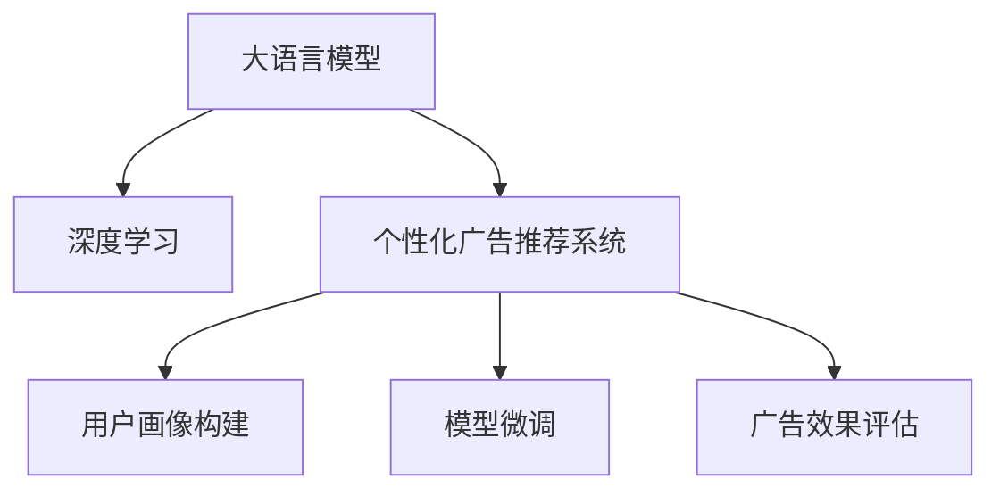

                 

# LLM驱动的个性化广告推荐系统

> 关键词：个性化广告推荐系统, 大语言模型(LLM), 深度学习, 推荐算法, 用户行为分析, 用户画像构建, 模型微调, 广告效果评估

## 1. 背景介绍

随着互联网技术的飞速发展，在线广告已经成为企业营销的重要手段。在移动互联网时代，用户获取信息的渠道变得多样化，海量的广告信息需要精准地传递到目标用户，这使得个性化广告推荐系统的应用变得越来越广泛。

个性化广告推荐系统通过分析用户的浏览、点击、购买等行为，为用户推荐最适合的广告，从而提升广告投放效果，降低营销成本。传统推荐系统依赖于用户的历史行为数据，在广告量级大、用户群体庞大时，难以兼顾个性化和实时性。而基于深度学习和大语言模型(LLM)的推荐系统，通过学习用户和广告的语义信息，能够更好地进行个性化匹配。

本文将从核心概念和原理入手，详细讲解LLM在个性化广告推荐系统中的应用，包括数据处理、模型构建、参数微调等关键步骤。同时，我们还将结合实际案例，展示LLM驱动的个性化广告推荐系统在落地应用中的效果。

## 2. 核心概念与联系

### 2.1 核心概念概述

为更好地理解LLM在个性化广告推荐系统中的应用，本节将介绍几个密切相关的核心概念：

- 大语言模型(LLM)：以自回归(如GPT)或自编码(如BERT)模型为代表的大规模预训练语言模型。通过在大规模无标签文本语料上进行预训练，学习通用的语言表示，具备强大的语言理解和生成能力。

- 深度学习：使用多层神经网络进行模型训练和预测的机器学习方法，广泛应用于计算机视觉、自然语言处理、推荐系统等领域。

- 个性化广告推荐系统：利用用户行为数据和广告特征，为不同用户推荐最适合的广告的系统。目标是提升广告的点击率、转化率等效果指标。

- 用户画像构建：基于用户行为数据，生成描述用户兴趣和特征的标签体系，是进行个性化广告推荐的基础。

- 模型微调：在预训练模型的基础上，使用下游任务的少量标注数据，通过有监督学习优化模型在特定任务上的性能。

- 广告效果评估：通过统计指标如点击率、转化率等，衡量广告推荐系统的性能。

这些核心概念之间的逻辑关系可以通过以下Mermaid流程图来展示：



这个流程图展示了大语言模型在个性化广告推荐系统中的应用流程：

1. 大语言模型通过预训练获得基础能力。
2. 在深度学习框架中构建个性化广告推荐系统。
3. 使用用户画像构建技术分析用户行为，生成用户画像。
4. 使用模型微调技术，对预训练模型进行适配，生成广告推荐模型。
5. 通过广告效果评估，不断优化广告推荐模型。

这些概念共同构成了LLM在个性化广告推荐系统中的应用框架，使其能够在各种场景下发挥强大的广告推荐能力。通过理解这些核心概念，我们可以更好地把握LLM的工作原理和优化方向。

## 3. 核心算法原理 & 具体操作步骤
### 3.1 算法原理概述

基于LLM的个性化广告推荐系统，本质上是一个深度学习模型在广告推荐任务上的应用。其核心思想是：利用LLM强大的语言理解能力，学习用户和广告之间的语义关系，生成个性化的广告推荐结果。

形式化地，假设个性化广告推荐系统的训练集为 $D=\{(x_i,y_i)\}_{i=1}^N, x_i \in \mathcal{X}, y_i \in \mathcal{Y}$，其中 $x_i$ 为包含用户行为特征的广告样本，$y_i$ 为推荐结果，可以是广告ID、广告展示位置等。

定义模型 $M_{\theta}$ 在输入 $x$ 上的输出为 $y$，则推荐系统的损失函数为：

$$
\mathcal{L}(\theta) = \frac{1}{N}\sum_{i=1}^N \ell(M_{\theta}(x_i),y_i)
$$

其中 $\ell$ 为针对任务设计的损失函数，通常包括交叉熵损失、均方误差损失等。

通过梯度下降等优化算法，推荐系统不断更新模型参数 $\theta$，最小化损失函数 $\mathcal{L}$，使得模型输出逼近真实标签。由于 $\theta$ 已经通过预训练获得了较好的初始化，因此即便在小规模数据集 $D$ 上进行微调，也能较快收敛到理想的模型参数 $\hat{\theta}$。

### 3.2 算法步骤详解

基于深度学习的个性化广告推荐系统，通常包括以下几个关键步骤：

**Step 1: 准备数据集**

- 收集用户的广告行为数据，如点击、浏览、购买等。
- 采集广告的相关信息，如广告ID、广告内容、广告展示位置等。
- 将用户和广告特征组合，构成监督数据集。

**Step 2: 数据预处理**

- 对用户行为数据和广告信息进行清洗和归一化。
- 处理缺失值、异常值和噪声。
- 将特征进行编码，以便于模型处理。

**Step 3: 构建用户画像**

- 使用K-means、LDA等聚类算法，生成用户兴趣标签。
- 将用户画像表示为高维向量。

**Step 4: 构建广告特征向量**

- 将广告内容进行分词、向量化处理。
- 利用LLM对广告内容进行预训练，提取特征向量。

**Step 5: 设计推荐模型**

- 选择合适的深度学习模型，如循环神经网络(RNN)、卷积神经网络(CNN)、Transformer等。
- 定义模型的输入、隐藏层、输出层等结构。
- 设计合适的损失函数和优化算法。

**Step 6: 模型微调**

- 使用部分标注数据对模型进行有监督微调，优化模型参数。
- 选择合适的学习率、批大小、迭代轮数等。
- 应用正则化技术，如L2正则、Dropout、Early Stopping等。

**Step 7: 评估推荐效果**

- 在测试集上评估模型的推荐效果，使用点击率、转化率等指标进行评估。
- 通过A/B测试等方式，验证推荐模型在实际场景中的效果。

### 3.3 算法优缺点

基于深度学习的个性化广告推荐系统，具有以下优点：

- 灵活高效。深度学习模型可以灵活适应不同的推荐任务，具有较强的泛化能力。
- 自适应能力。深度学习模型可以自动学习用户和广告之间的语义关系，适应用户行为的变化。
- 实时性好。深度学习模型可以在实时场景下进行广告推荐，满足用户对广告的即时需求。
- 数据多样性。深度学习模型可以同时利用用户行为数据和广告内容，生成更加个性化的推荐结果。

同时，该方法也存在一定的局限性：

- 模型复杂度高。深度学习模型通常包含大量参数，需要较高的计算资源和存储空间。
- 解释性不足。深度学习模型的决策过程难以解释，难以进行系统调优。
- 标注数据需求高。深度学习模型依赖于大量的标注数据进行训练，标注成本较高。
- 泛化性能受限。深度学习模型容易过拟合，泛化性能可能受到标注数据质量的影响。

尽管存在这些局限性，但就目前而言，基于深度学习的个性化广告推荐系统仍是广告推荐领域的主流范式。未来相关研究的重点在于如何进一步降低模型复杂度、提高数据利用效率，同时兼顾可解释性和泛化性能。

### 3.4 算法应用领域

基于深度学习的个性化广告推荐系统已经在电商、媒体、旅游等多个行业得到了广泛应用，以下是几个典型的应用场景：

- 电商广告推荐：利用用户浏览历史、点击行为等数据，推荐用户感兴趣的商品广告。
- 媒体广告推荐：根据用户阅读历史、互动行为等数据，推荐用户感兴趣的新闻、视频等广告内容。
- 旅游广告推荐：基于用户的旅游行为数据，推荐适合的旅游线路、景点等广告。
- 汽车广告推荐：通过用户购车行为数据，推荐适合的汽车品牌、车型等广告。

除了上述这些经典场景外，个性化广告推荐系统还被创新性地应用到更多领域中，如教育、金融、医疗等，为这些行业带来了新的广告投放模式。

## 4. 数学模型和公式 & 详细讲解  
### 4.1 数学模型构建

本节将使用数学语言对基于深度学习的个性化广告推荐系统进行更加严格的刻画。

记推荐系统的训练集为 $D=\{(x_i,y_i)\}_{i=1}^N, x_i \in \mathcal{X}, y_i \in \mathcal{Y}$。其中 $x_i$ 为包含用户行为特征的广告样本，$y_i$ 为推荐结果。

定义模型 $M_{\theta}$ 在输入 $x$ 上的输出为 $y$，则推荐系统的损失函数为：

$$
\mathcal{L}(\theta) = \frac{1}{N}\sum_{i=1}^N \ell(M_{\theta}(x_i),y_i)
$$

其中 $\ell$ 为针对任务设计的损失函数，通常包括交叉熵损失、均方误差损失等。

模型的输出 $y$ 可以是广告ID、广告展示位置等，具体的输出方式取决于推荐任务的具体要求。

### 4.2 公式推导过程

以下我们以二分类任务为例，推导交叉熵损失函数及其梯度的计算公式。

假设模型 $M_{\theta}$ 在输入 $x$ 上的输出为 $\hat{y}=M_{\theta}(x) \in [0,1]$，表示样本属于正类的概率。真实标签 $y \in \{0,1\}$。则二分类交叉熵损失函数定义为：

$$
\ell(M_{\theta}(x),y) = -[y\log \hat{y} + (1-y)\log (1-\hat{y})]
$$

将其代入经验风险公式，得：

$$
\mathcal{L}(\theta) = -\frac{1}{N}\sum_{i=1}^N [y_i\log M_{\theta}(x_i)+(1-y_i)\log(1-M_{\theta}(x_i))]
$$

根据链式法则，损失函数对参数 $\theta_k$ 的梯度为：

$$
\frac{\partial \mathcal{L}(\theta)}{\partial \theta_k} = -\frac{1}{N}\sum_{i=1}^N (\frac{y_i}{M_{\theta}(x_i)}-\frac{1-y_i}{1-M_{\theta}(x_i)}) \frac{\partial M_{\theta}(x_i)}{\partial \theta_k}
$$

其中 $\frac{\partial M_{\theta}(x_i)}{\partial \theta_k}$ 可进一步递归展开，利用自动微分技术完成计算。

在得到损失函数的梯度后，即可带入参数更新公式，完成模型的迭代优化。重复上述过程直至收敛，最终得到适应下游任务的最优模型参数 $\theta^*$。

## 5. 项目实践：代码实例和详细解释说明
### 5.1 开发环境搭建

在进行微调实践前，我们需要准备好开发环境。以下是使用Python进行PyTorch开发的环境配置流程：

1. 安装Anaconda：从官网下载并安装Anaconda，用于创建独立的Python环境。

2. 创建并激活虚拟环境：
```bash
conda create -n pytorch-env python=3.8 
conda activate pytorch-env
```

3. 安装PyTorch：根据CUDA版本，从官网获取对应的安装命令。例如：
```bash
conda install pytorch torchvision torchaudio cudatoolkit=11.1 -c pytorch -c conda-forge
```

4. 安装Transformers库：
```bash
pip install transformers
```

5. 安装各类工具包：
```bash
pip install numpy pandas scikit-learn matplotlib tqdm jupyter notebook ipython
```

完成上述步骤后，即可在`pytorch-env`环境中开始微调实践。

### 5.2 源代码详细实现

下面我以电商广告推荐任务为例，给出使用Transformers库对BERT模型进行微调的PyTorch代码实现。

首先，定义广告推荐任务的数据处理函数：

```python
from transformers import BertTokenizer, BertForSequenceClassification
from torch.utils.data import Dataset
import torch

class AdDataset(Dataset):
    def __init__(self, texts, labels, tokenizer, max_len=128):
        self.texts = texts
        self.labels = labels
        self.tokenizer = tokenizer
        self.max_len = max_len
        
    def __len__(self):
        return len(self.texts)
    
    def __getitem__(self, item):
        text = self.texts[item]
        label = self.labels[item]
        
        encoding = self.tokenizer(text, return_tensors='pt', max_length=self.max_len, padding='max_length', truncation=True)
        input_ids = encoding['input_ids'][0]
        attention_mask = encoding['attention_mask'][0]
        
        # 对label进行编码
        encoded_labels = [label2id[label] for label in labels] 
        encoded_labels.extend([label2id['O']] * (self.max_len - len(encoded_labels)))
        labels = torch.tensor(encoded_labels, dtype=torch.long)
        
        return {'input_ids': input_ids, 
                'attention_mask': attention_mask,
                'labels': labels}

# 标签与id的映射
label2id = {'O': 0, 'click': 1, 'ignore': 2, 'skip': 3}
id2label = {v: k for k, v in label2id.items()}

# 创建dataset
tokenizer = BertTokenizer.from_pretrained('bert-base-cased')

train_dataset = AdDataset(train_texts, train_labels, tokenizer)
dev_dataset = AdDataset(dev_texts, dev_labels, tokenizer)
test_dataset = AdDataset(test_texts, test_labels, tokenizer)
```

然后，定义模型和优化器：

```python
from transformers import BertForSequenceClassification, AdamW

model = BertForSequenceClassification.from_pretrained('bert-base-cased', num_labels=len(label2id))

optimizer = AdamW(model.parameters(), lr=2e-5)
```

接着，定义训练和评估函数：

```python
from torch.utils.data import DataLoader
from tqdm import tqdm
from sklearn.metrics import classification_report

device = torch.device('cuda') if torch.cuda.is_available() else torch.device('cpu')
model.to(device)

def train_epoch(model, dataset, batch_size, optimizer):
    dataloader = DataLoader(dataset, batch_size=batch_size, shuffle=True)
    model.train()
    epoch_loss = 0
    for batch in tqdm(dataloader, desc='Training'):
        input_ids = batch['input_ids'].to(device)
        attention_mask = batch['attention_mask'].to(device)
        labels = batch['labels'].to(device)
        model.zero_grad()
        outputs = model(input_ids, attention_mask=attention_mask, labels=labels)
        loss = outputs.loss
        epoch_loss += loss.item()
        loss.backward()
        optimizer.step()
    return epoch_loss / len(dataloader)

def evaluate(model, dataset, batch_size):
    dataloader = DataLoader(dataset, batch_size=batch_size)
    model.eval()
    preds, labels = [], []
    with torch.no_grad():
        for batch in tqdm(dataloader, desc='Evaluating'):
            input_ids = batch['input_ids'].to(device)
            attention_mask = batch['attention_mask'].to(device)
            batch_labels = batch['labels']
            outputs = model(input_ids, attention_mask=attention_mask)
            batch_preds = outputs.logits.argmax(dim=2).to('cpu').tolist()
            batch_labels = batch_labels.to('cpu').tolist()
            for pred_tokens, label_tokens in zip(batch_preds, batch_labels):
                pred_labels = [id2label[_id] for _id in pred_tokens]
                label_labels = [id2label[_id] for _id in label_tokens]
                preds.append(pred_labels[:len(label_labels)])
                labels.append(label_labels)
                
    print(classification_report(labels, preds))
```

最后，启动训练流程并在测试集上评估：

```python
epochs = 5
batch_size = 16

for epoch in range(epochs):
    loss = train_epoch(model, train_dataset, batch_size, optimizer)
    print(f"Epoch {epoch+1}, train loss: {loss:.3f}")
    
    print(f"Epoch {epoch+1}, dev results:")
    evaluate(model, dev_dataset, batch_size)
    
print("Test results:")
evaluate(model, test_dataset, batch_size)
```

以上就是使用PyTorch对BERT进行电商广告推荐任务微调的完整代码实现。可以看到，得益于Transformers库的强大封装，我们可以用相对简洁的代码完成BERT模型的加载和微调。

### 5.3 代码解读与分析

让我们再详细解读一下关键代码的实现细节：

**AdDataset类**：
- `__init__`方法：初始化文本、标签、分词器等关键组件。
- `__len__`方法：返回数据集的样本数量。
- `__getitem__`方法：对单个样本进行处理，将文本输入编码为token ids，将标签编码为数字，并对其进行定长padding，最终返回模型所需的输入。

**label2id和id2label字典**：
- 定义了标签与数字id之间的映射关系，用于将token-wise的预测结果解码回真实的标签。

**训练和评估函数**：
- 使用PyTorch的DataLoader对数据集进行批次化加载，供模型训练和推理使用。
- 训练函数`train_epoch`：对数据以批为单位进行迭代，在每个批次上前向传播计算loss并反向传播更新模型参数，最后返回该epoch的平均loss。
- 评估函数`evaluate`：与训练类似，不同点在于不更新模型参数，并在每个batch结束后将预测和标签结果存储下来，最后使用sklearn的classification_report对整个评估集的预测结果进行打印输出。

**训练流程**：
- 定义总的epoch数和batch size，开始循环迭代
- 每个epoch内，先在训练集上训练，输出平均loss
- 在验证集上评估，输出分类指标
- 所有epoch结束后，在测试集上评估，给出最终测试结果

可以看到，PyTorch配合Transformers库使得BERT微调的代码实现变得简洁高效。开发者可以将更多精力放在数据处理、模型改进等高层逻辑上，而不必过多关注底层的实现细节。

当然，工业级的系统实现还需考虑更多因素，如模型的保存和部署、超参数的自动搜索、更灵活的任务适配层等。但核心的微调范式基本与此类似。

## 6. 实际应用场景
### 6.1 电商广告推荐

基于深度学习的个性化广告推荐系统，已经在电商领域得到了广泛应用。电商平台通过分析用户的历史浏览、点击、购买行为，推荐用户感兴趣的商品广告，从而提升用户转化率和平台营收。

在技术实现上，可以收集用户的行为数据，如浏览记录、点击记录、购买记录等，将这些数据作为监督数据。对于广告，可以从电商平台收集广告的标题、图片、描述等，将这些特征作为输入。然后，使用BERT等预训练模型对广告内容进行特征提取，构建用户画像，生成推荐模型，进行广告推荐。

### 6.2 媒体广告推荐

媒体平台利用深度学习技术进行个性化广告推荐，根据用户的阅读历史、互动行为等数据，推荐用户感兴趣的新闻、视频等广告内容。通过分析用户的兴趣和行为，媒体平台可以提升广告的点击率、转化率等效果指标。

在实践中，可以收集用户的历史阅读数据、互动数据、地理位置等，将这些数据作为监督数据。对于广告，可以收集广告的标题、图片、内容等，将这些特征作为输入。然后，使用BERT等预训练模型对广告内容进行特征提取，构建用户画像，生成推荐模型，进行广告推荐。

### 6.3 旅游广告推荐

旅游平台通过深度学习技术，根据用户的旅游行为数据，推荐适合的旅游线路、景点等广告。通过分析用户的旅游偏好、预算等需求，旅游平台可以提升用户预订率和平台营收。

在技术实现上，可以收集用户的旅游行为数据，如预订记录、浏览记录、评价记录等，将这些数据作为监督数据。对于广告，可以收集广告的景点、线路、价格等，将这些特征作为输入。然后，使用BERT等预训练模型对广告内容进行特征提取，构建用户画像，生成推荐模型，进行广告推荐。

### 6.4 未来应用展望

随着深度学习技术的发展，基于大语言模型的广告推荐系统也将呈现更多的应用场景。

在智慧医疗领域，通过分析用户的健康数据，推荐适合的医疗广告，提升用户健康意识和治疗效果。

在智能家居领域，根据用户的居住习惯和生活需求，推荐适合的家居广告，提升用户生活质量。

在智慧城市治理中，利用用户的公共服务使用数据，推荐适合的政府服务广告，提升城市治理效能。

此外，在教育、金融、交通等多个领域，基于深度学习的广告推荐系统也将不断涌现，为各行业带来新的广告投放模式。相信随着技术的不断发展，广告推荐系统将在更多领域得到应用，为经济社会发展注入新的动力。

## 7. 工具和资源推荐
### 7.1 学习资源推荐

为了帮助开发者系统掌握深度学习和大语言模型的相关知识，这里推荐一些优质的学习资源：

1. 《Deep Learning》书籍：由深度学习领域的权威专家撰写，详细介绍了深度学习的基本概念和经典模型。

2. 《Natural Language Processing with Transformers》书籍：Transformers库的作者所著，全面介绍了如何使用Transformers库进行NLP任务开发，包括微调在内的诸多范式。

3. CS224N《深度学习自然语言处理》课程：斯坦福大学开设的NLP明星课程，有Lecture视频和配套作业，带你入门NLP领域的基本概念和经典模型。

4. 《Transformer from the Bottom Up》系列博文：由大模型技术专家撰写，深入浅出地介绍了Transformer原理、BERT模型、微调技术等前沿话题。

5. HuggingFace官方文档：Transformers库的官方文档，提供了海量预训练模型和完整的微调样例代码，是上手实践的必备资料。

通过对这些资源的学习实践，相信你一定能够快速掌握深度学习和大语言模型微调的理论基础和实践技巧，并将其应用于广告推荐系统中。

### 7.2 开发工具推荐

高效的开发离不开优秀的工具支持。以下是几款用于深度学习和大语言模型微调开发的常用工具：

1. PyTorch：基于Python的开源深度学习框架，灵活动态的计算图，适合快速迭代研究。

2. TensorFlow：由Google主导开发的开源深度学习框架，生产部署方便，适合大规模工程应用。

3. Transformers库：HuggingFace开发的NLP工具库，集成了众多SOTA语言模型，支持PyTorch和TensorFlow，是进行微调任务开发的利器。

4. Weights & Biases：模型训练的实验跟踪工具，可以记录和可视化模型训练过程中的各项指标，方便对比和调优。

5. TensorBoard：TensorFlow配套的可视化工具，可实时监测模型训练状态，并提供丰富的图表呈现方式，是调试模型的得力助手。

6. Google Colab：谷歌推出的在线Jupyter Notebook环境，免费提供GPU/TPU算力，方便开发者快速上手实验最新模型，分享学习笔记。

合理利用这些工具，可以显著提升深度学习和大语言模型微调任务的开发效率，加快创新迭代的步伐。

### 7.3 相关论文推荐

深度学习和大语言模型微调技术的发展源于学界的持续研究。以下是几篇奠基性的相关论文，推荐阅读：

1. Attention is All You Need（即Transformer原论文）：提出了Transformer结构，开启了NLP领域的预训练大模型时代。

2. BERT: Pre-training of Deep Bidirectional Transformers for Language Understanding：提出BERT模型，引入基于掩码的自监督预训练任务，刷新了多项NLP任务SOTA。

3. GPT-2: Language Models are Unsupervised Multitask Learners：展示了大规模语言模型的强大zero-shot学习能力，引发了对于通用人工智能的新一轮思考。

4. Adaptive Low-Rank Adaptation for Parameter-Efficient Fine-Tuning：提出自适应低秩适应的微调方法，在固定大部分预训练参数的同时，只更新极少量的任务相关参数。

5. Reformer: The Efficient Transformer：提出Reformer模型，使用局部敏感哈希等技术优化计算图，提升模型的效率和性能。

这些论文代表了大语言模型微调技术的发展脉络。通过学习这些前沿成果，可以帮助研究者把握学科前进方向，激发更多的创新灵感。

## 8. 总结：未来发展趋势与挑战

### 8.1 总结

本文对基于深度学习的大语言模型在个性化广告推荐系统中的应用进行了全面系统的介绍。首先阐述了深度学习和大语言模型在个性化广告推荐系统中的应用背景和重要性，明确了个性化广告推荐系统的目标和价值。其次，从原理到实践，详细讲解了深度学习模型的构建、数据处理、模型微调等关键步骤，给出了微调任务开发的完整代码实例。同时，本文还结合实际案例，展示了深度学习和大语言模型在电商、媒体、旅游等多个领域的应用效果。

通过本文的系统梳理，可以看到，基于深度学习的大语言模型在个性化广告推荐系统中具有强大的推荐能力，能够根据用户行为数据和广告特征，生成个性化广告推荐，提升广告投放效果。深度学习模型通过学习用户和广告的语义关系，实现精准推荐，有效降低营销成本，提升用户体验。

### 8.2 未来发展趋势

展望未来，深度学习和大语言模型在个性化广告推荐系统中的应用将呈现以下几个发展趋势：

1. 模型规模持续增大。随着算力成本的下降和数据规模的扩张，深度学习模型的参数量还将持续增长。超大规模模型蕴含的丰富语言知识，有望支撑更加复杂多变的广告推荐任务。

2. 模型多样性增加。未来的深度学习模型将更多样化，既有全参数微调的大模型，也有参数高效微调的轻量级模型。多种模型并存，能够更好地适应不同的推荐场景。

3. 跨领域迁移能力提升。深度学习模型将更具备跨领域迁移能力，能够在不同的数据分布和任务场景中取得良好的效果。

4. 数据利用效率提高。深度学习模型将更高效地利用非结构化数据，如文本、图片、音频等，生成更加多样化的广告推荐内容。

5. 实时性增强。深度学习模型将更加实时响应，能够在极短的时间内进行广告推荐，提升用户体验。

6. 自动化程度提升。深度学习模型将更具备自动化调参能力，能够根据数据特点自动选择最优超参数，提高模型训练效率。

### 8.3 面临的挑战

尽管深度学习和大语言模型在个性化广告推荐系统中已经取得了显著成效，但在迈向更加智能化、普适化应用的过程中，它仍面临着诸多挑战：

1. 模型复杂度高。深度学习模型通常包含大量参数，需要较高的计算资源和存储空间。

2. 数据依赖性高。深度学习模型依赖于大量的标注数据进行训练，标注成本较高。

3. 泛化性能受限。深度学习模型容易过拟合，泛化性能可能受到标注数据质量的影响。

4. 实时性问题。深度学习模型需要进行复杂的计算，响应速度较慢，难以满足实时性要求。

5. 系统可解释性不足。深度学习模型的决策过程难以解释，难以进行系统调优。

6. 安全性问题。深度学习模型可能学习到有害的推荐内容，带来安全风险。

尽管存在这些挑战，但就目前而言，基于深度学习的大语言模型仍是广告推荐领域的主流范式。未来相关研究的重点在于如何进一步降低模型复杂度、提高数据利用效率，同时兼顾可解释性和安全性。

### 8.4 研究展望

面对深度学习和大语言模型在个性化广告推荐系统中的应用挑战，未来的研究需要在以下几个方面寻求新的突破：

1. 探索无监督和半监督微调方法。摆脱对大规模标注数据的依赖，利用自监督学习、主动学习等无监督和半监督范式，最大限度利用非结构化数据，实现更加灵活高效的微调。

2. 研究参数高效和计算高效的微调范式。开发更加参数高效的微调方法，在固定大部分预训练参数的同时，只更新极少量的任务相关参数。同时优化微调模型的计算图，减少前向传播和反向传播的资源消耗，实现更加轻量级、实时性的部署。

3. 融合因果和对比学习范式。通过引入因果推断和对比学习思想，增强深度学习模型的稳定因果关系能力，学习更加普适、鲁棒的语言表征，从而提升模型泛化性和抗干扰能力。

4. 引入更多先验知识。将符号化的先验知识，如知识图谱、逻辑规则等，与深度学习模型进行巧妙融合，引导深度学习模型学习更准确、合理的语言模型。同时加强不同模态数据的整合，实现视觉、语音等多模态信息与文本信息的协同建模。

5. 结合因果分析和博弈论工具。将因果分析方法引入深度学习模型，识别出模型决策的关键特征，增强输出解释的因果性和逻辑性。借助博弈论工具刻画人机交互过程，主动探索并规避模型的脆弱点，提高系统稳定性。

6. 纳入伦理道德约束。在模型训练目标中引入伦理导向的评估指标，过滤和惩罚有偏见、有害的输出倾向。同时加强人工干预和审核，建立模型行为的监管机制，确保输出符合人类价值观和伦理道德。

这些研究方向的探索，必将引领深度学习和大语言模型在个性化广告推荐系统中的进一步发展，为广告推荐系统迈向智能化、普适化应用提供新的思路和技术支持。

## 9. 附录：常见问题与解答

**Q1：个性化广告推荐系统是否适用于所有电商领域？**

A: 个性化广告推荐系统在大多数电商领域都能取得不错的效果，特别是对于数据量较大的平台。但对于一些数据量较小、用户群体分散的电商平台，推荐效果可能不理想。此时需要在用户行为数据的质量和数量上进行优化，或者采用多模型融合等方法，以提高推荐精度。

**Q2：广告推荐模型如何优化超参数？**

A: 广告推荐模型的超参数包括学习率、批大小、迭代轮数等。超参数的优化通常使用网格搜索、随机搜索等方法，结合交叉验证等手段，找到最优的超参数组合。也可以使用自动调参工具，如AutoML、Hyperopt等，自动搜索超参数空间，提高模型的训练效率。

**Q3：广告推荐模型是否需要定期重新训练？**

A: 广告推荐模型通常需要定期重新训练，以适应用户行为和广告特征的变化。根据实际情况，可以选择固定间隔时间（如每天、每周）重新训练模型，或者根据数据流变化动态触发模型更新。重新训练时，需要收集新的广告和用户数据，使用微调方法优化模型，以保持推荐效果。

**Q4：广告推荐模型是否需要多模型融合？**

A: 多模型融合是一种常见的广告推荐策略，能够有效提升推荐效果。多模型融合的方法包括模型投票、权重叠加等，可以综合多个模型的输出，提升推荐的鲁棒性和精准度。多模型融合还可以缓解单一模型的泛化性能不足问题，提高系统的稳定性。

**Q5：广告推荐模型如何处理广告信息的多样性？**

A: 广告推荐模型需要能够处理多样化的广告信息，包括文字、图片、视频等。可以使用多模态学习方法，如文本-图片融合、跨模态学习等，提升广告推荐的丰富性和多样性。多模态学习方法可以利用不同模态的信息，提高广告推荐的准确性和用户满意度。

这些问题的回答展示了深度学习和大语言模型在个性化广告推荐系统中的应用场景和关键技术，帮助开发者更好地理解和应用这些技术。

---

作者：禅与计算机程序设计艺术 / Zen and the Art of Computer Programming

