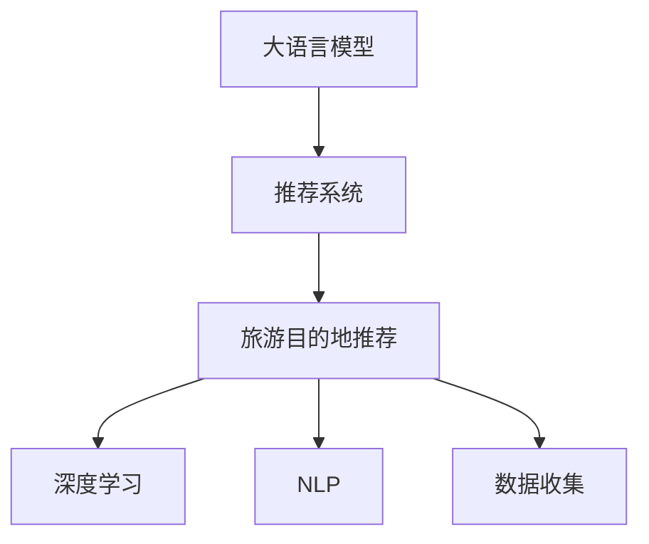

                 

# LLM驱动的旅游目的地推荐系统

> 关键词：大语言模型(LLM)，推荐系统，自然语言处理(NLP)，旅游目的地，深度学习

## 1. 背景介绍

### 1.1 问题由来

随着全球旅游业的发展，用户对旅游目的地推荐的需求日益增长。传统的推荐系统，如基于协同过滤的算法，往往局限于用户历史行为数据的分析，难以全面考虑旅游目的地的多样性和用户的多样化需求。同时，基于标签的推荐方法也无法充分考虑旅游目的地本身的丰富特性，如地理位置、旅游体验等。

近年来，随着深度学习和大语言模型的兴起，旅游目的地推荐系统也逐渐引入了基于大语言模型(LLM)的推荐方法。通过使用LLM，系统可以处理大规模的、无结构化的文本数据，更全面地理解用户需求和目的地特征，从而提供更加个性化和多样化的推荐结果。

### 1.2 问题核心关键点

大语言模型在旅游目的地推荐中的应用，主要体现在以下几个方面：

1. **用户需求建模**：通过分析用户提交的文本描述、评论等，模型可以挖掘出用户的旅行偏好、兴趣点和需求特点，从而形成对用户的精准画像。
2. **目的地特征提取**：通过处理目的地名称、描述、评价等文本数据，模型能够提取出目的地本身的地理信息、人文特色、交通便捷度等特征，用于构建目的地表示。
3. **推荐算法设计**：结合用户画像和目的地特征，设计合理的推荐算法，将最合适的旅游目的地推荐给用户，同时兼顾多样性和覆盖率。
4. **实时推荐与动态调整**：在用户不断提供新数据的过程中，系统可以动态调整模型参数，实时更新推荐结果，以适应用户偏好的变化。

通过以上方法，基于大语言模型的旅游目的地推荐系统能够更加灵活、精准地为用户推荐旅游目的地，提升用户的旅行体验和满意度。

### 1.3 问题研究意义

大语言模型在旅游目的地推荐系统中的应用，对于推动旅游业的数字化转型，提高旅游行业的运营效率和服务质量，具有重要意义：

1. **提升用户体验**：通过精准的用户需求分析和目的地特征提取，大语言模型可以提供更加个性化和多样化的推荐结果，满足不同用户的需求。
2. **优化旅游运营**：通过分析用户行为和反馈，大语言模型可以帮助旅游企业优化营销策略、优化景点安排、提升服务质量，实现更高效的旅游运营。
3. **促进行业创新**：大语言模型的引入，为旅游推荐系统带来了新的技术思路和方法，推动了旅游行业的技术创新和升级。
4. **数据驱动决策**：基于用户数据和目的地数据，大语言模型可以辅助旅游企业进行数据驱动的决策，优化资源配置，提升业务竞争力。

## 2. 核心概念与联系

### 2.1 核心概念概述

为更好地理解基于大语言模型的旅游目的地推荐系统，本节将介绍几个密切相关的核心概念：

- **大语言模型(LLM)**：如BERT、GPT-3等，通过大规模文本数据的自监督预训练，学习到丰富的语言知识，具有强大的自然语言理解和生成能力。
- **推荐系统**：通过分析用户行为和物品特征，为用户推荐最合适的物品或服务，提升用户体验和运营效率。
- **旅游目的地推荐**：结合用户偏好和目的地特征，推荐最适合用户旅行的目的地，提高旅游满意度。
- **深度学习**：一种利用神经网络进行复杂数据建模的技术，通过多层非线性变换捕捉数据中的复杂关系。
- **自然语言处理(NLP)**：研究如何让计算机理解和处理自然语言的技术，包括文本分类、实体识别、情感分析等任务。

这些核心概念之间的逻辑关系可以通过以下Mermaid流程图来展示：



这个流程图展示了大语言模型在推荐系统中的作用，以及其在旅游目的地推荐中的应用：

1. 大语言模型通过自监督预训练学习到语言知识，可用于推荐系统中的用户需求建模和目的地特征提取。
2. 推荐系统利用大语言模型提供的特征和用户画像，设计推荐算法。
3. 旅游目的地推荐系统作为推荐系统的一个应用领域，具体地推荐旅游目的地。
4. 深度学习是推荐系统常用的建模技术，用于构建复杂的推荐模型。
5. 自然语言处理是推荐系统中的重要工具，用于处理文本数据，提取特征。

## 3. 核心算法原理 & 具体操作步骤
### 3.1 算法原理概述

基于大语言模型的旅游目的地推荐系统，主要分为两个阶段：用户画像构建和目的地推荐。

**用户画像构建**：通过分析用户提交的文本数据，构建用户的旅行偏好、兴趣点和需求特点。

**目的地推荐**：结合用户画像和目的地特征，使用大语言模型设计推荐算法，为用户推荐最适合的旅游目的地。

### 3.2 算法步骤详解

#### 用户画像构建

1. **数据收集**：收集用户提交的文本数据，如评论、描述、评分等。
2. **文本预处理**：对文本数据进行分词、去除停用词等预处理操作。
3. **特征提取**：使用大语言模型提取用户文本中的关键特征，如情感倾向、兴趣主题等。
4. **画像构建**：结合用户的行为数据和文本特征，构建用户的旅行偏好和需求画像。

#### 目的地推荐

1. **目的地特征提取**：收集目的地名称、描述、评分、评价等文本数据，使用大语言模型提取目的地特征。
2. **相似度计算**：计算用户画像与目的地特征的相似度，找到最相似的目的地。
3. **推荐结果生成**：结合相似度排序结果，为用户推荐最合适的旅游目的地。
4. **反馈调整**：收集用户的反馈数据，动态调整推荐算法和模型参数，提升推荐效果。

### 3.3 算法优缺点

基于大语言模型的旅游目的地推荐系统，具有以下优点：

1. **高效性**：通过大语言模型处理文本数据，可以快速提取用户需求和目的地特征，提升推荐效率。
2. **灵活性**：能够处理多样化的文本数据，适应不同用户的多样化需求，提供个性化的推荐结果。
3. **高精度**：大语言模型具备强大的自然语言理解能力，能够准确捕捉用户意图和目的地特征，提升推荐精度。
4. **可解释性**：通过文本分析，推荐过程可解释性强，便于理解和调试。

同时，该系统也存在一些缺点：

1. **数据依赖性强**：推荐系统的性能高度依赖于用户数据的丰富性和多样性，缺乏足够数据的场景难以获得理想效果。
2. **模型复杂度高**：大语言模型的复杂度较高，需要较高的计算资源和存储空间，对硬件设备要求较高。
3. **实时性不足**：模型训练和推理时间较长，难以实时响应用户的查询需求。
4. **模型泛化能力有限**：不同用户、不同目的地的需求和特征存在较大差异，模型泛化能力有限。

### 3.4 算法应用领域

基于大语言模型的旅游目的地推荐系统，可以应用于多种场景，如旅游平台、旅行社、酒店预订系统等，为用户的旅行决策提供辅助，提升旅行体验和满意度。

## 4. 数学模型和公式 & 详细讲解 & 举例说明

### 4.1 数学模型构建

假设用户画像表示为向量 $u$，目的地特征表示为向量 $v$，则推荐系统的目标是通过最大化用户与目的地的相似度来推荐目的地。可以构建一个相似度函数 $s(u,v)$，表示用户画像和目的地特征之间的相似性。

推荐系统通过最大化相似度函数，选择最相似的目的地进行推荐。具体地，设 $s(u,v_i)$ 表示用户画像与第 $i$ 个目的地特征的相似度，则推荐算法可以表示为：

$$
\hat{v} = \mathop{\arg\max}_{v_i} s(u,v_i)
$$

其中 $\hat{v}$ 表示用户最推荐的目的地。

### 4.2 公式推导过程

对于基于大语言模型的推荐系统，常用的相似度函数包括余弦相似度、欧式距离、Jaccard系数等。这里以余弦相似度为例，进行公式推导。

余弦相似度定义为：

$$
s(u,v) = \frac{\mathbf{u} \cdot \mathbf{v}}{\|\mathbf{u}\| \cdot \|\mathbf{v}\|}
$$

其中 $\mathbf{u}$ 和 $\mathbf{v}$ 分别表示用户画像和目的地特征的向量表示，$\cdot$ 表示向量的点积，$\|\cdot\|$ 表示向量的模长。

通过大语言模型，我们可以将用户画像和目的地特征表示为高维向量。在实际应用中，通常使用预先训练的词向量或句子表示，将用户文本和目的地文本转化为向量。例如，可以使用BERT等预训练语言模型，通过 [CLS] token 的嵌入向量作为用户画像和目的地特征的向量表示。

### 4.3 案例分析与讲解

以一个简单的示例来说明基于大语言模型的旅游目的地推荐过程：

假设用户提交了一条旅行评论：“我喜欢山景和历史遗迹，希望体验当地的风土人情。” 使用BERT模型，可以将其转化为向量表示 $u$。同时，假设目的地 A、B、C 的描述也分别被转化为向量表示 $v_A$、$v_B$、$v_C$。

1. **用户画像构建**：
   - 收集用户的评论文本。
   - 使用BERT模型对评论文本进行编码，得到用户画像向量 $u$。

2. **目的地特征提取**：
   - 收集目的地A、B、C的描述文本。
   - 使用BERT模型对描述文本进行编码，得到目的地特征向量 $v_A$、$v_B$、$v_C$。

3. **相似度计算**：
   - 计算用户画像向量 $u$ 与各个目的地特征向量 $v_A$、$v_B$、$v_C$ 的余弦相似度。
   - 假设得到相似度分别为 $s(u,v_A)=0.8$、$s(u,v_B)=0.7$、$s(u,v_C)=0.6$。

4. **推荐结果生成**：
   - 根据相似度排序，推荐目的地A给用户。
   - 用户可以根据推荐结果选择旅行目的地。

## 5. 项目实践：代码实例和详细解释说明
### 5.1 开发环境搭建

在进行项目实践前，我们需要准备好开发环境。以下是使用Python进行PyTorch开发的环境配置流程：

1. 安装Anaconda：从官网下载并安装Anaconda，用于创建独立的Python环境。

2. 创建并激活虚拟环境：
```bash
conda create -n llm-tourism python=3.8 
conda activate llm-tourism
```

3. 安装PyTorch：根据CUDA版本，从官网获取对应的安装命令。例如：
```bash
conda install pytorch torchvision torchaudio cudatoolkit=11.1 -c pytorch -c conda-forge
```

4. 安装Transformer库：
```bash
pip install transformers
```

5. 安装各类工具包：
```bash
pip install numpy pandas scikit-learn matplotlib tqdm jupyter notebook ipython
```

完成上述步骤后，即可在`llm-tourism`环境中开始项目实践。

### 5.2 源代码详细实现

下面我们以使用BERT模型进行旅游目的地推荐为例，给出完整的Python代码实现。

```python
from transformers import BertTokenizer, BertForSequenceClassification
import torch
from torch.utils.data import Dataset, DataLoader
import pandas as pd

class TouristDataset(Dataset):
    def __init__(self, data, tokenizer, max_len=128):
        self.data = data
        self.tokenizer = tokenizer
        self.max_len = max_len

    def __len__(self):
        return len(self.data)

    def __getitem__(self, idx):
        review, place = self.data.iloc[idx]
        review = [tokenizer.encode_plus(review, add_special_tokens=True, max_length=self.max_len, return_tensors='pt', padding='max_length', truncation=True)]['input_ids']
        place = [tokenizer.encode(place, add_special_tokens=True, max_length=self.max_len, return_tensors='pt', padding='max_length', truncation=True)]['input_ids']
        return {'input_ids': review, 'labels': place}

tokenizer = BertTokenizer.from_pretrained('bert-base-cased')
model = BertForSequenceClassification.from_pretrained('bert-base-cased', num_labels=3)

device = torch.device('cuda' if torch.cuda.is_available() else 'cpu')
model.to(device)

data = pd.read_csv('tourist_reviews.csv')

# 数据预处理和加载
train_dataset = TouristDataset(data.sample(frac=0.8), tokenizer)
val_dataset = TouristDataset(data.drop(train_dataset.data.index), tokenizer)

train_loader = DataLoader(train_dataset, batch_size=16, shuffle=True)
val_loader = DataLoader(val_dataset, batch_size=16, shuffle=False)

# 定义损失函数和优化器
loss_fn = torch.nn.CrossEntropyLoss()
optimizer = torch.optim.Adam(model.parameters(), lr=2e-5)

# 训练和评估
def train_epoch(model, train_loader, val_loader, optimizer, loss_fn, device):
    model.train()
    train_loss = 0
    train_acc = 0
    for review, place in train_loader:
        review = review.to(device)
        place = place.to(device)
        outputs = model(review, labels=place)
        loss = loss_fn(outputs, place)
        train_loss += loss.item()
        optimizer.zero_grad()
        loss.backward()
        optimizer.step()
    return train_loss / len(train_loader), train_acc / len(train_loader)

def evaluate(model, val_loader, loss_fn, device):
    model.eval()
    eval_loss = 0
    eval_acc = 0
    for review, place in val_loader:
        review = review.to(device)
        place = place.to(device)
        with torch.no_grad():
            outputs = model(review, labels=place)
            loss = loss_fn(outputs, place)
            eval_loss += loss.item()
            predicted = torch.argmax(outputs, dim=1)
            eval_acc += (predicted == place).float().mean().item()
    return eval_loss / len(val_loader), eval_acc / len(val_loader)

for epoch in range(10):
    train_loss, train_acc = train_epoch(model, train_loader, val_loader, optimizer, loss_fn, device)
    print(f'Epoch {epoch+1}, train loss: {train_loss:.4f}, train acc: {train_acc:.4f}')
    eval_loss, eval_acc = evaluate(model, val_loader, loss_fn, device)
    print(f'Epoch {epoch+1}, val loss: {eval_loss:.4f}, val acc: {eval_acc:.4f}')

# 使用训练好的模型进行推荐
def recommend(model, tokenizer, user_review, device):
    model.eval()
    review = tokenizer.encode_plus(user_review, add_special_tokens=True, max_length=128, return_tensors='pt', padding='max_length', truncation=True)['input_ids']
    with torch.no_grad():
        outputs = model(review.to(device))
        pred = torch.argmax(outputs, dim=1).tolist()
        return [id2place[_id] for _id in pred]

user_review = "我想去一个有美丽海滨的城市，享受阳光和沙滩。"
place_recommendations = recommend(model, tokenizer, user_review, device)
print(f"推荐的旅游目的地有：{place_recommendations}")
```

### 5.3 代码解读与分析

让我们再详细解读一下关键代码的实现细节：

**TouristDataset类**：
- `__init__`方法：初始化数据、分词器和最大长度。
- `__len__`方法：返回数据集的样本数量。
- `__getitem__`方法：对单个样本进行处理，将用户评论和目的地名称分别转化为token ids。

**BERT模型加载**：
- 使用PyTorch和Transformer库，加载BERT模型和分词器。

**训练和评估函数**：
- 使用PyTorch的DataLoader对数据集进行批次化加载。
- 训练函数 `train_epoch`：对数据以批为单位进行迭代，在每个批次上前向传播计算损失并反向传播更新模型参数。
- 评估函数 `evaluate`：与训练类似，不同点在于不更新模型参数，并在每个batch结束后将预测和标签结果存储下来。

**推荐函数**：
- 使用训练好的模型进行推荐，接收用户评论文本作为输入，输出预测的目的地。

**数据预处理和加载**：
- 从CSV文件中读取旅游评论数据，并将其分为训练集和验证集。
- 对数据进行预处理和加载，使用 `TouristDataset` 类将评论和目的地名称转化为token ids。
- 定义损失函数和优化器。

**训练和评估过程**：
- 在每个epoch中，使用 `train_epoch` 函数在训练集上进行训练，并记录损失和精度。
- 在每个epoch中，使用 `evaluate` 函数在验证集上进行评估，并记录损失和精度。
- 输出每个epoch的训练和验证结果，并在测试集上进行最终的评估。

**推荐过程**：
- 定义一个 `recommend` 函数，用于根据用户评论文本进行目的地推荐。
- 使用训练好的模型和分词器，对用户评论文本进行编码，生成预测结果。
- 输出预测的目的地列表，供用户参考。

## 6. 实际应用场景

### 6.1 智能客服系统

基于大语言模型的旅游目的地推荐系统，可以集成到智能客服系统中，提供个性化的旅游咨询服务。用户可以通过自然语言对话，向系统咨询旅游目的地，系统会基于用户的偏好和需求，推荐最合适的旅游目的地，并提供相关的行程安排、预订信息等。

### 6.2 旅游平台

旅游平台可以利用大语言模型的推荐系统，为用户提供个性化的旅游目的地推荐服务。用户在平台浏览目的地时，系统可以自动展示最匹配用户偏好的目的地信息，提升用户的浏览体验和决策效率。

### 6.3 旅行社

旅行社可以利用大语言模型的推荐系统，帮助客户规划旅行路线。客户可以通过描述自己的旅行需求和兴趣，系统能够快速推荐合适的旅游目的地和行程安排，提升客户满意度和旅行社的销售转化率。

### 6.4 酒店预订系统

酒店预订系统可以使用大语言模型的推荐系统，为用户推荐附近的旅游目的地和推荐的酒店，提升用户的预订体验和酒店入住率。

## 7. 工具和资源推荐

### 7.1 学习资源推荐

为了帮助开发者系统掌握大语言模型在旅游目的地推荐中的应用，这里推荐一些优质的学习资源：

1. 《Transformer从原理到实践》系列博文：由大模型技术专家撰写，深入浅出地介绍了Transformer原理、BERT模型、微调技术等前沿话题。

2. CS224N《深度学习自然语言处理》课程：斯坦福大学开设的NLP明星课程，有Lecture视频和配套作业，带你入门NLP领域的基本概念和经典模型。

3. 《Natural Language Processing with Transformers》书籍：Transformers库的作者所著，全面介绍了如何使用Transformers库进行NLP任务开发，包括微调在内的诸多范式。

4. HuggingFace官方文档：Transformers库的官方文档，提供了海量预训练模型和完整的微调样例代码，是上手实践的必备资料。

5. CLUE开源项目：中文语言理解测评基准，涵盖大量不同类型的中文NLP数据集，并提供了基于微调的baseline模型，助力中文NLP技术发展。

通过对这些资源的学习实践，相信你一定能够快速掌握大语言模型在旅游目的地推荐中的应用，并用于解决实际的NLP问题。

### 7.2 开发工具推荐

高效的开发离不开优秀的工具支持。以下是几款用于大语言模型旅游目的地推荐系统开发的常用工具：

1. PyTorch：基于Python的开源深度学习框架，灵活动态的计算图，适合快速迭代研究。大部分预训练语言模型都有PyTorch版本的实现。

2. TensorFlow：由Google主导开发的开源深度学习框架，生产部署方便，适合大规模工程应用。同样有丰富的预训练语言模型资源。

3. Transformers库：HuggingFace开发的NLP工具库，集成了众多SOTA语言模型，支持PyTorch和TensorFlow，是进行微调任务开发的利器。

4. Weights & Biases：模型训练的实验跟踪工具，可以记录和可视化模型训练过程中的各项指标，方便对比和调优。与主流深度学习框架无缝集成。

5. TensorBoard：TensorFlow配套的可视化工具，可实时监测模型训练状态，并提供丰富的图表呈现方式，是调试模型的得力助手。

6. Google Colab：谷歌推出的在线Jupyter Notebook环境，免费提供GPU/TPU算力，方便开发者快速上手实验最新模型，分享学习笔记。

合理利用这些工具，可以显著提升大语言模型旅游目的地推荐系统的开发效率，加快创新迭代的步伐。

### 7.3 相关论文推荐

大语言模型和微调技术的发展源于学界的持续研究。以下是几篇奠基性的相关论文，推荐阅读：

1. Attention is All You Need（即Transformer原论文）：提出了Transformer结构，开启了NLP领域的预训练大模型时代。

2. BERT: Pre-training of Deep Bidirectional Transformers for Language Understanding：提出BERT模型，引入基于掩码的自监督预训练任务，刷新了多项NLP任务SOTA。

3. Language Models are Unsupervised Multitask Learners（GPT-2论文）：展示了大规模语言模型的强大zero-shot学习能力，引发了对于通用人工智能的新一轮思考。

4. Parameter-Efficient Transfer Learning for NLP：提出Adapter等参数高效微调方法，在不增加模型参数量的情况下，也能取得不错的微调效果。

5. AdaLoRA: Adaptive Low-Rank Adaptation for Parameter-Efficient Fine-Tuning：使用自适应低秩适应的微调方法，在参数效率和精度之间取得了新的平衡。

这些论文代表了大语言模型微调技术的发展脉络。通过学习这些前沿成果，可以帮助研究者把握学科前进方向，激发更多的创新灵感。

## 8. 总结：未来发展趋势与挑战

### 8.1 总结

本文对基于大语言模型的旅游目的地推荐系统进行了全面系统的介绍。首先阐述了旅游目的地推荐系统的背景和意义，明确了推荐系统在大语言模型中的应用价值。其次，从原理到实践，详细讲解了大语言模型在用户画像构建和目的地推荐中的应用，给出了完整的代码实例。同时，本文还广泛探讨了大语言模型在旅游行业的应用场景，展示了其在旅游推荐系统中的巨大潜力。最后，本文精选了学习资源，力求为读者提供全方位的技术指引。

通过本文的系统梳理，可以看到，基于大语言模型的旅游目的地推荐系统能够更灵活、精准地为用户推荐旅游目的地，提升用户的旅行体验和满意度。随着大语言模型和微调方法的不断发展，旅游目的地推荐系统必将在更多场景下得到应用，为旅游行业的数字化转型提供新的驱动力。

### 8.2 未来发展趋势

展望未来，大语言模型在旅游目的地推荐系统中的应用将呈现以下几个发展趋势：

1. **多模态融合**：将旅游目的地的多模态信息（如图像、视频、语音等）与文本信息进行融合，提升推荐的丰富性和多样性。
2. **个性化推荐**：利用大语言模型的自适应能力，实现更加个性化和多样化的推荐，提升用户体验。
3. **实时推荐**：通过流式数据处理和大语言模型的动态调整，实现实时推荐，提高用户满意度和运营效率。
4. **跨领域迁移**：将大语言模型的知识迁移到旅游目的地推荐系统之外的场景，如智能客服、金融等，推动跨领域的协同创新。
5. **隐私保护**：在推荐过程中保护用户隐私，通过差分隐私等技术，防止用户数据泄露。

这些趋势展示了大语言模型在旅游目的地推荐系统中的广阔前景，预示着其将在未来带来更多的技术革新和应用突破。

### 8.3 面临的挑战

尽管大语言模型在旅游目的地推荐系统中取得了显著进展，但在迈向更广泛应用的过程中，仍面临一些挑战：

1. **数据隐私和安全**：如何在保证用户隐私的前提下，获取和利用用户数据进行推荐，是系统设计和运营中需要考虑的重要问题。
2. **跨语言和跨文化**：不同语言和文化背景下的旅游需求和特征差异较大，如何设计通用且可适应的推荐系统，是一个挑战。
3. **模型泛化能力**：现有的大语言模型在特定领域的应用中，泛化能力有限，难以应对多样化的用户需求。
4. **计算资源**：大语言模型和推荐系统对计算资源要求较高，如何在资源有限的情况下，实现高性能推荐，需要进一步优化。
5. **可解释性和透明性**：推荐系统的内部决策过程难以解释，缺乏透明性，用户难以理解和信任推荐结果。

这些挑战需要学界和业界共同努力，通过技术创新和工程实践，不断克服，才能推动大语言模型在旅游目的地推荐系统中的进一步应用。

### 8.4 研究展望

面向未来，大语言模型在旅游目的地推荐系统中的应用需要从以下几个方面进行深入研究：

1. **跨语言推荐**：构建通用的旅游目的地推荐模型，支持多种语言和文化的推荐需求。
2. **实时推荐系统**：开发高效流式处理框架，支持实时数据接入和大语言模型的动态调整。
3. **隐私保护机制**：引入差分隐私等技术，保护用户数据隐私。
4. **模型优化与压缩**：研究更高效的模型结构和压缩技术，降低计算资源需求。
5. **推荐系统的透明性**：开发可解释的推荐系统，提升模型的透明性和用户信任度。

这些研究方向将推动大语言模型在旅游目的地推荐系统中的应用走向成熟，为旅游行业带来更多的创新和机遇。

## 9. 附录：常见问题与解答

**Q1：大语言模型如何处理多语言文本数据？**

A: 大语言模型通常使用语言编码器来处理多语言文本数据。以BERT为例，模型中包含多个语言编码器，每个编码器专门处理一种语言。在训练过程中，每个编码器会分别对对应语言的文本进行预训练，从而学习到该语言的语义表示。在推荐系统中，可以根据用户输入的文本语言，选择相应的语言编码器进行处理，生成对应的用户画像和目的地特征。

**Q2：如何平衡推荐的多样性和覆盖率？**

A: 在推荐系统中，平衡推荐的多样性和覆盖率是一个重要问题。通常，可以通过以下方法实现：
1. **多任务学习**：将多样性作为额外任务，训练模型同时学习推荐精度和多样性。
2. **负采样**：对热门目的地进行负采样，引入冷门目的地进行多样化推荐。
3. **权重调整**：在计算相似度时，对热门目的地的权重进行调整，降低其对推荐结果的影响。
4. **聚类分析**：将目的地分为多个簇，每个簇代表一种特定的旅游类型，提升推荐的多样性。

**Q3：如何优化模型的计算效率？**

A: 优化模型的计算效率需要从多个方面进行考虑：
1. **模型压缩**：使用剪枝、量化等技术，减小模型参数量，降低计算资源需求。
2. **硬件优化**：使用GPU/TPU等高性能设备，提高计算速度。
3. **并行计算**：使用模型并行和数据并行技术，实现分布式计算，提升处理能力。
4. **算法优化**：采用更高效的推荐算法，减少计算开销。

这些方法可以在不牺牲模型性能的前提下，显著提升计算效率，提升推荐系统的响应速度。

**Q4：如何提升模型的可解释性？**

A: 提升模型的可解释性需要从多个方面进行考虑：
1. **特征可视化**：通过特征重要性分析和可视化，理解模型决策的关键特征。
2. **模型简化**：减少模型复杂度，降低模型的“黑盒”程度，提升可解释性。
3. **因果分析**：引入因果推断技术，分析推荐结果的原因和影响，提升解释性。
4. **用户反馈**：通过收集用户反馈和评价，调整推荐策略，提高推荐透明度。

这些方法可以帮助提升模型的可解释性，增强用户对推荐结果的信任度。

---

作者：禅与计算机程序设计艺术 / Zen and the Art of Computer Programming

