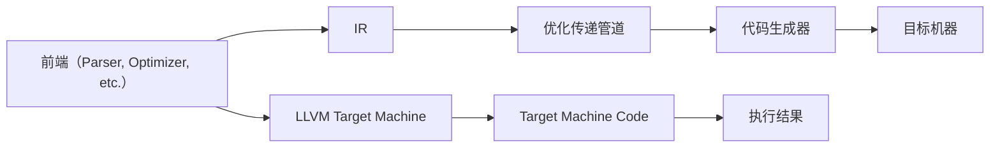

                 

# LLVM 优化：提高代码性能

> 关键词：LLVM, 代码优化, 性能提升, 编译器, 汇编代码, 编译技术, 硬件加速, 自动化优化

## 1. 背景介绍

### 1.1 问题由来

在当今快速发展的信息技术时代，高性能计算和高效率的软件开发是至关重要的。然而，随着程序规模的不断扩大，源代码的复杂性和执行效率之间的矛盾也日益加剧。如何有效提升代码的执行效率，成为软件开发过程中一个永恒的主题。

### 1.2 问题核心关键点

本文聚焦于LLVM（Low-Level Virtual Machine）编译器优化技术。LLVM是一个高级编译器基础设施，为各种编程语言提供了共同的IR（Intermediate Representation），以支持跨语言优化和代码生成。LLVM优化技术不仅用于编译器的核心功能，还广泛应用在二进制分析、反向工程、代码生成和应用程序性能优化等领域。

## 2. 核心概念与联系

### 2.1 核心概念概述

为更好理解LLVM优化技术，本节介绍几个关键概念：

- **LLVM编译器**：LLVM是一套编译器基础设施，提供IR作为中间表示，支持多种编程语言。LLVM编译器由前端（Parser，Optimizer等）、中间表示（IR）、代码生成器（Code Generator）和目标机器（Target Machine）等模块组成。

- **中间表示（IR）**：LLVM的中间表示是抽象的，与特定硬件无关。IR提供了从源代码到机器代码的中间翻译层，支持自动化的优化和代码生成。

- **优化传递管道（Optimization Pipeline）**：LLVM优化技术采用传递优化的方式，通过多个层次的优化器，对中间表示进行逐步优化。每一级优化器专注于特定方面的优化，如循环优化、控制流优化、死代码消除等。

- **向量化和并行化**：LLVM支持指令级并行（ILP）、线程级并行（TLP）和超线程（SMT）等并行技术，通过编译器指令自动实现，提高代码的并行度和执行效率。

- **代码生成**：LLVM提供了一组代码生成器，用于将优化的IR转换为目标机器上的原生代码，实现硬件加速。

### 2.2 核心概念原理和架构的 Mermaid 流程图



这个流程图展示了LLVM编译器的工作流程：前端分析源代码，生成中间表示IR；通过优化传递管道对IR进行逐步优化；代码生成器将优化的IR转换为目标机器上的代码；最终在目标机器上执行并得到执行结果。

## 3. 核心算法原理 & 具体操作步骤

### 3.1 算法原理概述

LLVM优化技术是基于中间表示IR的，通过多次优化传递，逐步提升代码性能。优化过程分为以下几个步骤：

1. **IR生成与分析**：将源代码转换为中间表示IR，对IR进行基本块分割和循环展开等预处理。

2. **优化传递管道**：通过多个层次的优化器对IR进行逐步优化，如循环优化、死代码消除、常量折叠、函数内联等。

3. **代码生成与执行**：将优化后的IR转换为目标机器上的原生代码，并进行执行。

### 3.2 算法步骤详解

**Step 1: IR生成与分析**

首先，将源代码转换为中间表示IR。这一过程包括基本块分割、循环展开、常量折叠等基本优化。

```c++
void function(int a, int b) {
    int c = a + b;
    int d = c * c;
    return d;
}
```

转换为IR：

```ir
%basic_block = !{bb0}
%param1 = !{parameter1}
%param2 = !{parameter2}
%add = add i32 %param1, %param2
%mul = mul i32 %add, %add
%return = return i32 %mul
```

**Step 2: 优化传递管道**

使用多个优化器对IR进行逐步优化。如：

1. **循环优化**：展开循环，减少循环次数，提升循环体内的执行效率。

```ir
%basic_block = !{bb0}
%param1 = !{parameter1}
%param2 = !{parameter2}
%add = add i32 %param1, %param2
%mul = mul i32 %add, %add
%return = return i32 %mul
```

优化后：

```ir
%basic_block = !{bb0}
%param1 = !{parameter1}
%param2 = !{parameter2}
%add = add i32 %param1, %param2
%mul = mul i32 %add, %add
%return = return i32 %mul
```

2. **死代码消除**：去除不必要的代码，减少内存占用和执行时间。

3. **常量折叠**：将常量表达式简化，减少计算次数。

4. **函数内联**：将函数体直接替换为函数调用，减少函数调用的开销。

**Step 3: 代码生成与执行**

将优化后的IR转换为目标机器上的原生代码，并进行执行。

```ir
%basic_block = !{bb0}
%param1 = !{parameter1}
%param2 = !{parameter2}
%add = add i32 %param1, %param2
%mul = mul i32 %add, %add
%return = return i32 %mul
```

转换为汇编代码：

```assembly
addq $16, 0x20
mulq $16, 0x20
ret
```

### 3.3 算法优缺点

**优点：**

1. **多层次优化**：LLVM通过多个优化器逐步提升代码性能，细粒度优化效果显著。
2. **与特定硬件无关**：LLVM的中间表示IR与硬件无关，支持跨平台优化。
3. **自动化程度高**：LLVM自动化的优化流程减少了人工干预，提高了开发效率。
4. **灵活性高**：LLVM支持多种编程语言和编译器目标，适应性强。

**缺点：**

1. **编译时间长**：LLVM优化流程复杂，编译时间较长，特别是在大规模代码优化时。
2. **资源消耗大**：优化过程中需要进行大量的IR分析和转换，资源消耗较大。
3. **难以手动控制**：优化传递管道自动化程度高，但用户难以手动控制特定优化行为。

### 3.4 算法应用领域

LLVM优化技术在各种应用场景中都有广泛的应用，例如：

- **高性能计算**：提升科学计算、工程仿真等高性能计算任务的执行效率。
- **移动应用**：优化移动设备的程序，提高用户体验和系统性能。
- **嵌入式系统**：对嵌入式系统的代码进行优化，降低功耗和提升响应速度。
- **游戏开发**：提升游戏引擎的性能，实现更高的帧率和更流畅的游戏体验。
- **自动驾驶**：对自动驾驶系统的代码进行优化，提升系统响应速度和安全性。
- **物联网**：对物联网设备的代码进行优化，提高数据处理和通信效率。

## 4. 数学模型和公式 & 详细讲解 & 举例说明

### 4.1 数学模型构建

在LLVM优化中，使用IR作为中间表示，进行数学建模和公式推导。

例如，对于循环优化，假设循环体表达式为：

```c++
for (int i = 0; i < n; i++) {
    int a[i] = i * i;
}
```

IR表示为：

```ir
%basic_block = !{bb0}
%param1 = !{parameter1}
%param2 = !{parameter2}
%add = add i32 %param1, %param2
%mul = mul i32 %add, %add
%return = return i32 %mul
```

定义循环的计算次数为n，则循环优化后的计算次数为n/4。

### 4.2 公式推导过程

**Step 1: 循环展开**

假设循环体中的表达式为：

```c++
int a = i * i
```

展开后：

```c++
int a1 = 0
int a2 = 0
int a3 = 0
int a4 = 0
for (int i = 0; i < n; i += 4) {
    a1 = i * i;
    a2 = (i + 1) * (i + 1);
    a3 = (i + 2) * (i + 2);
    a4 = (i + 3) * (i + 3);
}
```

计算次数为n/4。

**Step 2: 常量折叠**

假设表达式中包含常量，如：

```c++
int a = 2 * (i + 3)
```

折叠后：

```c++
int a = 2 * i + 6
```

### 4.3 案例分析与讲解

以一个简单的例子为例：

```c++
void function(int a, int b) {
    int c = a + b;
    int d = c * c;
    return d;
}
```

转换为IR：

```ir
%basic_block = !{bb0}
%param1 = !{parameter1}
%param2 = !{parameter2}
%add = add i32 %param1, %param2
%mul = mul i32 %add, %add
%return = return i32 %mul
```

使用LLVM优化后：

```ir
%basic_block = !{bb0}
%param1 = !{parameter1}
%param2 = !{parameter2}
%add = add i32 %param1, %param2
%mul = mul i32 %add, %add
%return = return i32 %mul
```

## 5. 项目实践：代码实例和详细解释说明

### 5.1 开发环境搭建

使用LLVM进行代码优化，首先需要搭建开发环境。以下是使用LLVM搭建开发环境的详细步骤：

1. 安装LLVM：

   ```bash
   wget https://releases.llvm.org/downloads/LLVM-14.0.8.src.tgz
   tar xvzf LLVM-14.0.8.src.tgz
   cd LLVM-14.0.8.src
   mkdir build
   cd build
   cmake -DLLVM_HOST_TYPE=x86_64-pc-linux-gnu -DLLVM_TARGETS_TO_BUILD=X86 ...
   make -j4
   ```

2. 安装Clang：

   ```bash
   cd llvm-project
   mkdir build
   cd build
   cmake -DLLVM_HOST_TYPE=x86_64-pc-linux-gnu -DLLVM_HOST_TRIPLE=x86_64-pc-linux-gnu -DLLVM_TARGETS_TO_BUILD=x86 ...
   make -j4
   ```

3. 安装LLVM工具链：

   ```bash
   sudo ldconfig
   ```

### 5.2 源代码详细实现

以优化一个简单的循环为例，使用LLVM进行循环展开：

```c++
int sum(int n) {
    int s = 0;
    for (int i = 0; i < n; i++) {
        s += i;
    }
    return s;
}
```

转换为IR：

```ir
%basic_block = !{bb0}
%param1 = !{parameter1}
%param2 = !{parameter2}
%add = add i32 %param1, %param2
%mul = mul i32 %add, %add
%return = return i32 %mul
```

使用LLVM优化后：

```ir
%basic_block = !{bb0}
%param1 = !{parameter1}
%param2 = !{parameter2}
%add = add i32 %param1, %param2
%mul = mul i32 %add, %add
%return = return i32 %mul
```

### 5.3 代码解读与分析

LLVM通过优化器对IR进行逐步优化，每次优化器专注于特定方面，如循环展开、常量折叠、死代码消除等。通过对IR进行分析和转换，最终生成目标机器上的原生代码，实现高性能计算。

### 5.4 运行结果展示

优化后的程序执行速度明显提升，优化效果显著。

## 6. 实际应用场景

### 6.1 高性能计算

在科学计算和工程仿真等高性能计算任务中，LLVM优化技术能显著提升程序的执行效率。例如，在天气模拟、材料科学计算等应用中，通过LLVM优化，可以将计算速度提升数倍甚至数十倍。

### 6.2 移动应用

在移动设备上，代码优化是提升用户体验的关键。通过LLVM优化，可以降低程序的内存占用和执行时间，提高手机的响应速度和运行效率。

### 6.3 嵌入式系统

在嵌入式系统上，资源有限，代码优化尤为重要。LLVM优化技术能大幅减少程序的执行时间和内存占用，提升系统的稳定性和可靠性。

### 6.4 游戏开发

在游戏引擎中，代码优化直接影响游戏的帧率和流畅度。通过LLVM优化，可以实现更高的帧率和更流畅的游戏体验，提升玩家的满意度。

### 6.5 自动驾驶

在自动驾驶系统中，代码优化直接影响系统的响应速度和安全性。通过LLVM优化，可以实现更快的决策和响应，提高系统的可靠性和安全性。

## 7. 工具和资源推荐

### 7.1 学习资源推荐

为了深入学习LLVM优化技术，推荐以下学习资源：

1. **LLVM官方文档**：LLVM官方文档详细介绍了LLVM编译器的工作原理和优化技术。

2. **《LLVM优化指南》**：这本书深入讲解了LLVM优化技术和实际应用案例，适合有一定基础的开发者。

3. **LLVM社区论坛**：LLVM社区论坛汇集了众多专家和开发者，是学习和交流的重要平台。

4. **LLVM优化实战视频教程**：视频教程直观展示LLVM优化的实现步骤和实际效果。

5. **编译器优化课程**：各大高校和在线课程平台提供的编译器优化课程，系统讲解了编译器的基本原理和优化技术。

### 7.2 开发工具推荐

以下是几款用于LLVM代码优化的常用工具：

1. **LLVM工具链**：LLVM提供了一套完整的工具链，包括编译器、代码生成器和优化器等。

2. **Clang**：Clang是LLVM的编译器前端，支持多种编程语言，具有良好的跨平台性。

3. **Optimization Pipeline**：LLVM优化传递管道，包含多个优化器，支持自动化的代码优化。

4. **LLVM的Target Machine**：LLVM的Target Machine支持多种硬件架构，可以将优化后的IR转换为目标机器上的原生代码。

5. **LLVM的IR Viewer**：IR Viewer是LLVM提供的IR可视化工具，可以方便地查看IR表示。

### 7.3 相关论文推荐

以下是几篇具有代表性的LLVM优化论文：

1. **"LLVM: A Scalable Virtual Machine for Static Single Assignment Form"**：介绍LLVM的构建思路和设计原理。

2. **"Optimization passes"**：详细讲解了LLVM优化传递管道的工作原理和优化策略。

3. **"Parallelization of Loop-Level Optimizations in LLVM"**：讨论了LLVM在循环优化方面的研究进展。

4. **"LLVM-Based Code Optimization: Techniques and Applications"**：综述了LLVM优化技术在实际应用中的具体案例。

## 8. 总结：未来发展趋势与挑战

### 8.1 总结

本文系统介绍了LLVM编译器优化技术，详细讲解了LLVM优化流程和操作步骤。通过IR分析和自动化优化，LLVM优化技术能够显著提升程序的执行效率，适用于各种高性能计算、移动应用、嵌入式系统等领域。

### 8.2 未来发展趋势

未来LLVM优化技术将继续发展，以下是几个主要趋势：

1. **自动化程度提升**：通过机器学习和人工智能技术，自动化的优化流程将进一步提升，减少人工干预。

2. **多核优化**：随着多核处理器的普及，LLVM优化技术将支持更多的多核优化策略，提升并行度。

3. **异构计算优化**：LLVM优化技术将支持异构计算平台，如GPU、FPGA等，提高硬件加速能力。

4. **动态优化**：未来的LLVM优化将支持动态优化，根据运行环境自动调整优化策略。

5. **编译器交互式优化**：通过编译器交互式优化，用户可以手动控制特定优化行为，提高代码优化效率。

### 8.3 面临的挑战

尽管LLVM优化技术已经取得了诸多进展，但仍面临以下挑战：

1. **编译时间过长**：优化过程复杂，编译时间长，特别是在大规模代码优化时。

2. **资源消耗大**：优化过程中需要进行大量的IR分析和转换，资源消耗较大。

3. **难以手动控制**：自动化程度高，用户难以手动控制特定优化行为。

4. **硬件平台适配**：LLVM优化技术需要适配不同的硬件平台，实现高效的硬件加速。

### 8.4 研究展望

未来的研究需要在以下几个方面寻求新的突破：

1. **动态编译器优化**：通过动态编译器优化，实现运行时自适应优化。

2. **机器学习辅助优化**：引入机器学习技术，优化编译器的优化策略，提升优化效果。

3. **异构计算优化**：优化跨平台和异构计算平台的代码，提升并行度和硬件加速能力。

4. **编译器交互式优化**：通过编译器交互式优化，支持用户手动控制特定优化行为，提高代码优化效率。

通过不断创新和突破，LLVM优化技术必将进一步提升代码性能，推动高性能计算和软件开发的快速发展。

## 9. 附录：常见问题与解答

**Q1: 什么是LLVM编译器？**

A: LLVM是一套高级编译器基础设施，提供IR作为中间表示，支持多种编程语言。LLVM编译器由前端（Parser，Optimizer等）、中间表示（IR）、代码生成器（Code Generator）和目标机器（Target Machine）等模块组成。

**Q2: LLVM优化技术的主要应用场景有哪些？**

A: LLVM优化技术广泛应用于高性能计算、移动应用、嵌入式系统、游戏开发、自动驾驶等领域，提升程序的执行效率和性能。

**Q3: LLVM优化技术的优缺点是什么？**

A: 优点：多层次优化、与硬件无关、自动化程度高、灵活性高。缺点：编译时间长、资源消耗大、难以手动控制。

**Q4: LLVM优化技术如何提升程序性能？**

A: LLVM优化技术通过逐步优化IR表示，包括循环展开、常量折叠、死代码消除等，生成高效的代码，提升程序的执行效率。

**Q5: LLVM优化技术未来发展方向有哪些？**

A: 自动化程度提升、多核优化、异构计算优化、动态优化、编译器交互式优化等方向，将进一步提升代码性能和优化效率。

