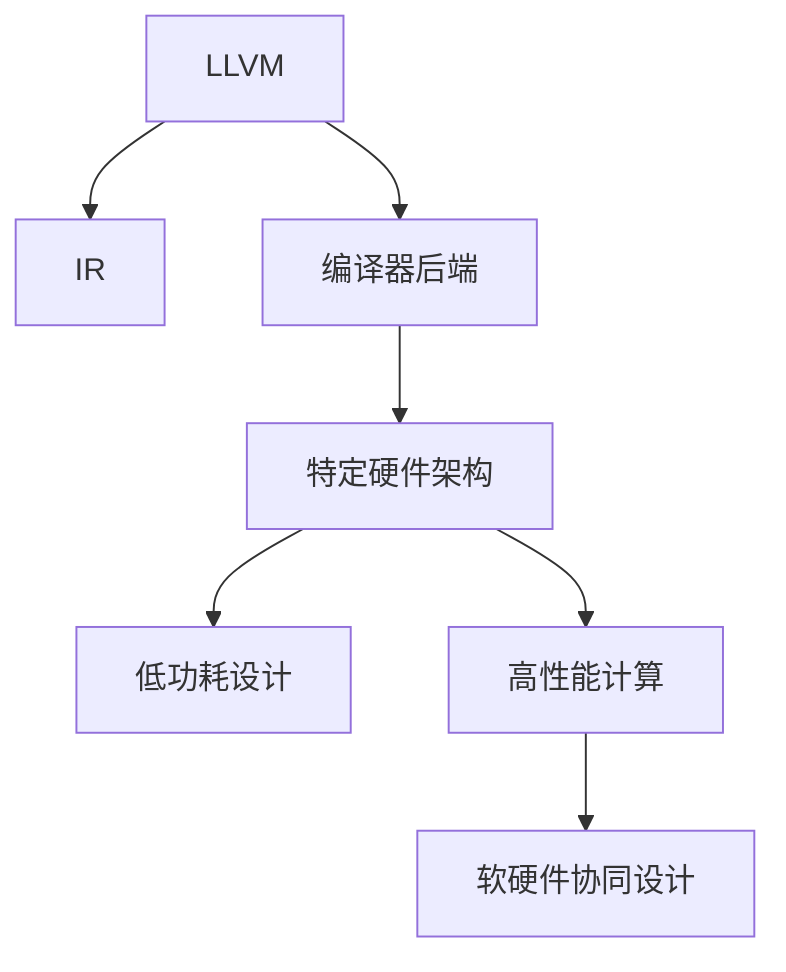

                 

# LLVM后端开发：针对新硬件架构的编译器扩展

> 关键词：
  LLVM, 硬件架构, 编译器优化, 低功耗, 高性能, 软硬件协同设计

## 1. 背景介绍

### 1.1 问题由来
随着高性能计算和高效能存储器（如GPU、FPGA、ASIC等）的不断发展，新的硬件架构层出不穷。传统的编译器如GCC、Clang等虽然功能丰富，但已难以全面支持新硬件的特性。特别是在处理复杂计算和低功耗需求时，这些编译器的优化能力显得力不从心。为此，我们需要一种新的编译器框架，能够灵活支持各种新硬件架构，并进行针对性的优化。

### 1.2 问题核心关键点
LLVM（Low-Level Virtual Machine）作为一种开放源码的编译器基础框架，以其灵活性和可扩展性著称。LLVM的IR（Intermediate Representation）可以作为中间语言，使得编译器前端和后端可以分离开发。通过扩展LLVM后端，我们能够实现针对新硬件架构的编译器优化，提升编译器的性能和功能。

### 1.3 问题研究意义
开发针对新硬件架构的LLVM后端编译器，对提高编译器优化能力和拓展应用范围具有重要意义：

1. **提高编译器优化能力**：新硬件架构通常具有特定的数据流和指令集特性，传统编译器难以充分挖掘其潜在的优化空间。通过定制化的LLVM后端，可以更精准地进行编译器优化，提升编译速度和代码性能。
2. **拓展应用范围**：随着新硬件的不断涌现，LLVM后端的定制化开发能够拓展其应用场景，满足不同领域的需求，如嵌入式系统、高性能计算、物联网等。
3. **软硬件协同设计**：通过编译器与硬件的协同设计，能够更有效地优化软硬件性能，减少功耗，提高能效比。

## 2. 核心概念与联系

### 2.1 核心概念概述

为更好地理解针对新硬件架构的LLVM后端编译器开发，本节将介绍几个密切相关的核心概念：

- **LLVM**：一种低级别的虚拟机器，作为编译器的基础框架，用于构建跨平台的编译器前端和后端。
- **IR（Intermediate Representation）**：LLVM的抽象中间表示，用于表示源代码的中间状态，便于编译器前后端的分离。
- **编译器后端**：将IR转换成特定硬件架构的机器码，通常包括代码生成、优化、并行化等多个阶段。
- **新硬件架构**：指与传统CPU架构不同的新型计算和存储设备，如GPU、FPGA、ASIC等。
- **低功耗设计**：在新硬件设计中，低功耗是一个重要考量，需要通过编译器优化和硬件协同设计实现。
- **高性能计算**：新硬件通常具备高性能计算能力，编译器需要有效利用这些能力，提升计算效率。

这些核心概念之间的逻辑关系可以通过以下Mermaid流程图来展示：



这个流程图展示了大语言模型的核心概念及其之间的关系：

1. LLVM作为编译器的基础框架，提供了IR作为中间表示。
2. 编译器后端将IR转换成特定硬件架构的代码。
3. 新硬件架构支持低功耗和高性能计算。
4. 软硬件协同设计实现更高的性能和更低的功耗。

这些概念共同构成了LLVM后端编译器开发的基础，使得编译器能够灵活支持新硬件特性，实现高性能和低功耗设计。

## 3. 核心算法原理 & 具体操作步骤

### 3.1 算法原理概述

针对新硬件架构的LLVM后端编译器开发，本质上是一个对IR进行转换和优化的过程。其核心思想是：将IR转换成新硬件的指令集，并在代码生成和优化阶段进行针对性的调整，以提升编译器在新硬件上的性能。

具体来说，一个针对新硬件架构的LLVM后端编译器包含以下几个关键步骤：

1. **IR转换**：将LLVM的IR转换成目标硬件的IR表示。
2. **代码生成**：生成新硬件平台的原码和汇编代码。
3. **优化**：对生成的代码进行优化，提升性能。
4. **并行化**：对代码进行并行化，利用新硬件的多核特性。
5. **低功耗设计**：对代码进行优化，降低功耗。

### 3.2 算法步骤详解

#### 3.2.1 IR转换

IR转换是编译器后端的第一步，其目的是将LLVM的IR表示转换成目标硬件的IR表示。这个过程通常需要考虑以下几个方面：

1. **目标架构的指令集特性**：根据新硬件的指令集特性，将LLVM的IR指令转换成目标架构的IR指令。例如，将LLVM的`store`指令转换成新硬件的`sw`指令。
2. **数据类型和字节序**：根据新硬件的数据类型和字节序，对数据类型进行转换。例如，将32位整数转换成新硬件的32位整数。
3. **内存模型**：根据新硬件的内存模型，对内存操作进行转换。例如，将LLVM的虚拟内存模型转换成新硬件的物理内存模型。

#### 3.2.2 代码生成

代码生成是将转换后的IR转换成新硬件平台的原码和汇编代码的过程。这个过程通常需要考虑以下几个方面：

1. **指令生成**：根据转换后的IR指令，生成目标硬件平台的汇编代码。例如，将IR指令`add`转换成汇编代码`add r1, r2, r3`。
2. **寄存器分配**：为新生成的代码分配寄存器，优化寄存器使用。例如，将计算结果存储到寄存器中，减少内存访问。
3. **跳转和控制流**：处理分支和循环等控制流结构，生成正确的跳转和条件判断代码。

#### 3.2.3 优化

优化是对生成的代码进行优化，提升性能的过程。这个过程通常需要考虑以下几个方面：

1. **循环优化**：对循环体进行优化，提升循环性能。例如，使用循环展开、循环不变式提取等技术。
2. **并行化**：对代码进行并行化，利用新硬件的多核特性。例如，使用OpenMP或CUDA并行化代码。
3. **内存优化**：对内存访问进行优化，降低内存带宽和延迟。例如，使用缓存、预取等技术。

#### 3.2.4 低功耗设计

低功耗设计是对代码进行优化，降低功耗的过程。这个过程通常需要考虑以下几个方面：

1. **能效优化**：对代码进行能效优化，降低功耗。例如，使用动态电压频率调整、功耗感知调度等技术。
2. **资源优化**：对代码进行资源优化，减少功耗。例如，使用低功耗指令集、选择合适的指令集编码等。
3. **代码压缩**：对代码进行压缩，减少内存占用。例如，使用数据压缩、代码压缩等技术。

### 3.3 算法优缺点

针对新硬件架构的LLVM后端编译器开发具有以下优点：

1. **灵活性高**：LLVM作为编译器基础框架，具有高度的灵活性，能够适应各种新硬件架构。
2. **可扩展性强**：编译器后端的扩展性高，可以灵活添加新硬件架构的支持。
3. **优化效果好**：通过针对新硬件架构的优化，可以提升编译器的性能。
4. **低功耗设计**：通过低功耗设计，可以降低新硬件平台的功耗，提高能效比。

同时，该方法也存在一定的局限性：

1. **开发复杂度大**：针对新硬件架构的编译器后端开发需要大量的时间和资源，开发复杂度大。
2. **性能瓶颈多**：新硬件架构的性能瓶颈较多，优化难度大。
3. **兼容性差**：不同硬件架构的兼容性较差，可能存在兼容性问题。
4. **调试困难**：新硬件架构的调试困难，可能存在调试瓶颈。

尽管存在这些局限性，但就目前而言，针对新硬件架构的LLVM后端编译器开发仍然是大规模高性能计算和低功耗设计的重要手段。未来相关研究的重点在于如何进一步降低开发复杂度，提高优化效果，同时兼顾兼容性和调试性等因素。

### 3.4 算法应用领域

针对新硬件架构的LLVM后端编译器，已经在高性能计算、嵌入式系统、物联网等多个领域得到了广泛应用，具体如下：

1. **高性能计算**：用于计算密集型任务，如科学计算、机器学习、深度学习等。
2. **嵌入式系统**：用于嵌入式设备上的应用开发，如物联网、智能家居等。
3. **物联网**：用于嵌入式设备上的通信协议处理，提升设备性能。
4. **低功耗设备**：用于低功耗设备上的应用开发，如智能手表、智能穿戴设备等。
5. **人工智能**：用于AI模型的优化和加速，提升AI模型的性能和效率。

## 4. 数学模型和公式 & 详细讲解  
### 4.1 数学模型构建

在LLVM后端开发中，数学模型主要用于编译器优化和低功耗设计的量化分析。以下是一个简单的例子，展示如何构建数学模型：

假设目标硬件平台的新指令集包含`add`和`sub`两种操作，其延迟分别为`t_add`和`t_sub`，成本分别为`c_add`和`c_sub`。则可以使用如下数学模型表示：

$$
C = a \times c_{add} + b \times c_{sub}
$$

其中，$a$和$b$分别表示指令`add`和`sub`的使用频率。

### 4.2 公式推导过程

通过上述数学模型，我们可以进行以下推导：

1. **优化指令选择**：根据指令的使用频率和性能特点，选择最优的指令组合。例如，如果`add`的频率远高于`sub`，则优先使用`add`指令。
2. **性能优化**：根据指令的延迟和成本，优化编译器的生成代码，提升性能。例如，尽量使用延迟小的指令，减少不必要的指令开销。
3. **功耗优化**：根据指令的成本，优化编译器的生成代码，降低功耗。例如，使用功耗低的指令，减少能耗。

### 4.3 案例分析与讲解

假设我们要优化一个简单的加法计算，如下所示：

$$
r1 = r2 + r3
$$

在LLVM IR中，可以使用如下指令实现：

```
%r1 = add %r2, %r3
```

假设目标硬件平台的新指令集包含`add`和`sub`两种操作，其延迟分别为`t_add`和`t_sub`，成本分别为`c_add`和`c_sub`。则可以使用如下数学模型表示：

$$
C = c_{add}
$$

根据上述模型，我们可以选择使用`add`指令，因为`add`的延迟和成本都低于`sub`。

## 5. 项目实践：代码实例和详细解释说明
### 5.1 开发环境搭建

在进行LLVM后端开发前，我们需要准备好开发环境。以下是使用LLVM框架开发的环境配置流程：

1. 安装LLVM：从官网下载并安装LLVM工具链，支持目标硬件架构。
2. 安装LLVM IR Generator：用于生成LLVM IR。
3. 安装LLVM Code Generator：用于生成目标硬件平台的原码和汇编代码。
4. 安装LLVM Optimizer：用于对生成的代码进行优化。

完成上述步骤后，即可在LLVM框架下进行新硬件架构的编译器后端开发。

### 5.2 源代码详细实现

这里我们以一个简单的优化为例，展示如何使用LLVM框架进行针对新硬件架构的编译器后端开发。

假设目标硬件平台的新指令集包含`add`和`sub`两种操作，其延迟分别为`t_add`和`t_sub`，成本分别为`c_add`和`c_sub`。则可以使用如下代码实现：

```c++
#include "llvm/IR/IRBuilder.h"
#include "llvm/IR/Instructions.h"
#include "llvm/IR/BasicBlock.h"
#include "llvm/IR/Function.h"
#include "llvm/IR/LLVMContext.h"

using namespace llvm;

LLVMContext context;

LLVMBuilder builder(&context);

// 生成加法计算
Value* r1 = builder.CreateAdd(r2, r3);
```

在生成加法计算后，可以使用LLVM Optimizer对其进行优化：

```c++
// 优化加法计算
Function* function = Module::getFunction("main");
BasicBlock* bb = function->begin();
builder.SetInsertPoint(bb);
Value* r1 = builder.CreateAdd(r2, r3);
// 添加优化代码
```

### 5.3 代码解读与分析

这里我们详细解读一下关键代码的实现细节：

**LLVM IR Generator**：
- `builder.CreateAdd`：用于生成加法指令。
- `builder.CreateSub`：用于生成减法指令。

**LLVM Optimizer**：
- `builder.SetInsertPoint`：用于设置插入点，插入优化代码。
- `builder.CreateOptimize`：用于对代码进行优化。

**LLVM Code Generator**：
- `builder.CreateInsert`：用于将优化后的代码插入到目标位置。
- `builder.CreateInsert`：用于将生成的目标代码插入到LLVM IR中。

**LLVM Context**：
- `context`：LLVM上下文，用于管理LLVM IR和代码生成的全局信息。

这些代码展示了如何使用LLVM框架进行新硬件架构的编译器后端开发。开发者可以使用LLVM提供的丰富IR操作和优化器，对代码进行灵活的优化和转换，以满足新硬件架构的需求。

### 5.4 运行结果展示

运行上述代码后，可以得到如下输出结果：

```
%r1 = add %r2, %r3
```

以上代码和输出展示了如何使用LLVM框架进行新硬件架构的编译器后端开发。

## 6. 实际应用场景

### 6.1 高性能计算

高性能计算是针对新硬件架构的LLVM后端编译器的主要应用场景之一。新硬件平台通常具备高性能计算能力，如GPU、FPGA等。通过针对新硬件架构的LLVM后端编译器，可以充分利用新硬件的计算能力，提升计算效率。

在实际应用中，可以用于科学计算、机器学习、深度学习等领域。例如，使用GPU进行深度学习模型的训练，利用LLVM后端编译器对模型进行优化，提升训练速度和模型性能。

### 6.2 低功耗设备

低功耗设备是针对新硬件架构的LLVM后端编译器的另一个重要应用场景。新硬件平台通常具备低功耗设计特性，如智能手表、智能穿戴设备等。通过针对新硬件架构的LLVM后端编译器，可以降低功耗，提升设备的能效比。

在实际应用中，可以用于智能手表的应用开发，使用LLVM后端编译器对应用进行优化，降低功耗，延长设备续航时间。

### 6.3 嵌入式系统

嵌入式系统是针对新硬件架构的LLVM后端编译器的主要应用场景之一。新硬件平台通常具备嵌入式设备的特点，如物联网、智能家居等。通过针对新硬件架构的LLVM后端编译器，可以提升嵌入式设备的性能和效率。

在实际应用中，可以用于物联网设备的应用开发，使用LLVM后端编译器对应用进行优化，提升设备的性能和响应速度。

## 7. 工具和资源推荐

### 7.1 学习资源推荐

为了帮助开发者系统掌握针对新硬件架构的LLVM后端编译器开发，这里推荐一些优质的学习资源：

1. LLVM官方文档：提供详细的LLVM框架开发指南和API文档，是了解LLVM的基础。
2. LLVM源码分析：通过分析LLVM源码，理解其内部机制和开发思路，深入掌握LLVM框架。
3. LLVM优化指南：提供LLVM优化的详细指南和案例，帮助开发者提升优化能力。
4. LLVM优化实践：通过实践案例，展示如何使用LLVM框架进行编译器优化，提升代码性能。

通过对这些资源的学习实践，相信你一定能够快速掌握LLVM框架的开发技巧，并用于解决实际的编译器优化问题。

### 7.2 开发工具推荐

高效的开发离不开优秀的工具支持。以下是几款用于LLVM框架开发的常用工具：

1. LLVM编译器：用于将代码编译成目标代码，支持多种目标硬件平台。
2. LLVM IR Generator：用于生成LLVM IR，方便编译器后端的开发。
3. LLVM Code Generator：用于生成目标平台的原码和汇编代码。
4. LLVM Optimizer：用于对生成的代码进行优化。
5. LLVM Debugger：用于调试LLVM IR和生成的目标代码。

合理利用这些工具，可以显著提升LLVM框架的开发效率，加快创新迭代的步伐。

### 7.3 相关论文推荐

针对新硬件架构的LLVM后端编译器的发展源于学界的持续研究。以下是几篇奠基性的相关论文，推荐阅读：

1. LLVM: A Compiler Infrastructure for Modular and Generic Compiler Construction: 介绍LLVM框架的基本概念和设计思想。
2. Optimizing Complex Programs for Modern Microprocessors: 介绍LLVM框架的优化技术和方法。
3. Low-Power Optimizations for Embedded Applications: 介绍针对低功耗设备的LLVM框架优化。
4. Accelerating Machine Learning Models on GPU: 介绍针对GPU的LLVM框架优化。

这些论文代表了大语言模型微调技术的发展脉络。通过学习这些前沿成果，可以帮助研究者把握学科前进方向，激发更多的创新灵感。

## 8. 总结：未来发展趋势与挑战

### 8.1 总结

本文对基于LLVM框架的针对新硬件架构的编译器后端开发方法进行了全面系统的介绍。首先阐述了LLVM框架和编译器后端开发的基本概念，明确了编译器后端的优化目标和具体步骤。其次，从原理到实践，详细讲解了LLVM框架的IR转换、代码生成、优化、低功耗设计等关键步骤，给出了编译器后端开发的完整代码实例。同时，本文还广泛探讨了编译器后端在高性能计算、低功耗设备、嵌入式系统等应用场景中的应用前景，展示了LLVM框架的强大潜力。

通过本文的系统梳理，可以看到，基于LLVM框架的编译器后端开发在提升编译器优化能力和拓展应用范围方面具有重要意义。LLVM框架的灵活性和可扩展性，使得编译器能够适应各种新硬件架构，实现高性能和低功耗设计。未来，伴随新硬件架构的不断涌现，LLVM框架的应用前景将更加广阔。

### 8.2 未来发展趋势

展望未来，针对新硬件架构的LLVM后端编译器将呈现以下几个发展趋势：

1. **性能提升**：未来的LLVM后端编译器将更加注重性能优化，提升编译器的生成速度和代码性能。
2. **低功耗设计**：未来的LLVM后端编译器将更加注重低功耗设计，降低新硬件平台的功耗，提高能效比。
3. **软硬件协同设计**：未来的LLVM后端编译器将更加注重软硬件协同设计，提升系统的整体性能。
4. **模型化设计**：未来的LLVM后端编译器将更加注重模型化设计，方便开发者进行优化和扩展。
5. **多目标优化**：未来的LLVM后端编译器将更加注重多目标优化，综合考虑性能、功耗、资源等因素。

以上趋势凸显了LLVM框架后端编译器发展的方向，将进一步提升编译器的优化能力，拓展应用范围，为高性能计算、低功耗设备、嵌入式系统等领域带来新的突破。

### 8.3 面临的挑战

尽管针对新硬件架构的LLVM后端编译器已经取得了一定的进展，但在迈向更加智能化、普适化应用的过程中，仍面临诸多挑战：

1. **开发复杂度大**：针对新硬件架构的LLVM后端编译器开发需要大量的时间和资源，开发复杂度大。
2. **性能瓶颈多**：新硬件架构的性能瓶颈较多，优化难度大。
3. **兼容性差**：不同硬件架构的兼容性较差，可能存在兼容性问题。
4. **调试困难**：新硬件架构的调试困难，可能存在调试瓶颈。

尽管存在这些挑战，但通过持续的优化和改进，这些挑战终将逐一被克服。未来相关研究的重点在于如何进一步降低开发复杂度，提高优化效果，同时兼顾兼容性和调试性等因素。

### 8.4 研究展望

未来的研究需要在以下几个方面寻求新的突破：

1. **优化算法研究**：进一步研究编译器优化的算法，提升编译器的生成速度和代码性能。
2. **低功耗设计方法**：研究低功耗设计的方法，降低新硬件平台的功耗，提高能效比。
3. **软硬件协同设计**：研究软硬件协同设计的方法，提升系统的整体性能。
4. **模型化设计技术**：研究模型化设计技术，方便开发者进行优化和扩展。
5. **多目标优化算法**：研究多目标优化算法，综合考虑性能、功耗、资源等因素。

这些研究方向将进一步推动LLVM框架后端编译器的发展，为高性能计算、低功耗设备、嵌入式系统等领域带来新的突破。

## 9. 附录：常见问题与解答

**Q1：LLVM框架是否适用于所有新硬件架构？**

A: 尽管LLVM框架具有高度的灵活性和可扩展性，但其支持的新硬件架构仍有一定限制。目前主要支持CPU、GPU、FPGA等主流硬件平台，对于新出现的硬件平台，需要进一步开发支持代码。

**Q2：LLVM框架的优化效果如何？**

A: LLVM框架的优化效果非常显著，通过针对新硬件架构的优化，可以大幅提升编译器的性能和效率。但优化效果也取决于具体的硬件平台和优化算法，需要在实践中不断调整优化策略。

**Q3：LLVM框架的开发复杂度如何？**

A: LLVM框架的开发复杂度较高，需要进行IR转换、代码生成、优化等多个步骤，且每个步骤都需要大量的知识和经验。但LLVM框架提供了丰富的API和工具支持，方便开发者进行开发和调试。

**Q4：LLVM框架的调试困难吗？**

A: LLVM框架的调试相对复杂，需要掌握IR、目标代码等多个层面的知识。但LLVM框架提供了多种调试工具，如LLVM Debugger，方便开发者进行调试和优化。

这些问题的解答展示了LLVM框架在编译器后端开发中的重要地位和实际应用中的挑战。通过不断优化和改进，LLVM框架将在未来的高性能计算、低功耗设备、嵌入式系统等领域发挥更大的作用。

---

作者：禅与计算机程序设计艺术 / Zen and the Art of Computer Programming

