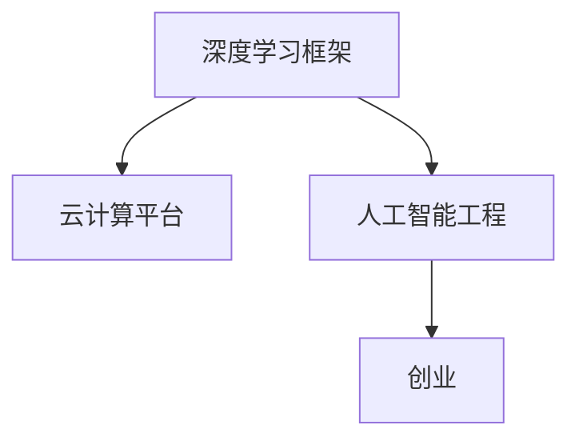
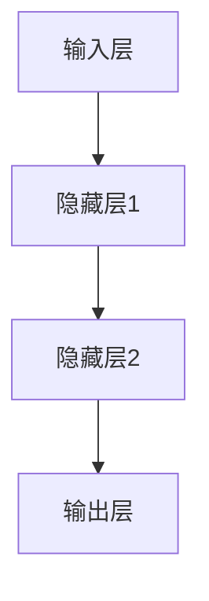

                 

# Lepton AI团队：深度学习框架创始人，云计算和AI工程专家携手创业

> 关键词：深度学习,框架,云计算,人工智能工程,创业

## 1. 背景介绍

### 1.1 问题由来

近年来，深度学习技术取得了突破性的进展，尤其是在计算机视觉、自然语言处理和语音识别等领域。然而，深度学习的快速发展也带来了一些新的挑战，如模型的可解释性、泛化能力、训练效率等。这些问题对于实现人工智能的普及和应用构成了障碍。

为应对这些挑战，Lepton AI团队诞生了。该团队由一群有深度学习框架开发经验、云计算和人工智能工程背景的专家组成。他们致力于研究和开发高效、易用的深度学习框架，并在实际应用中探索如何将这些技术融入云计算平台，实现人工智能的高效、安全、可解释的部署和应用。

### 1.2 问题核心关键点

Lepton AI团队的核心目标是通过深度学习框架和云计算平台的结合，加速人工智能技术的落地应用。具体来说，他们希望实现以下目标：

1. **高效性**：通过优化模型结构和训练算法，实现深度学习的快速迭代和部署。
2. **可解释性**：在模型设计和训练过程中引入可解释性，便于用户理解模型决策过程。
3. **泛化能力**：开发适用于多种场景的通用模型，提升模型的泛化能力和鲁棒性。
4. **安全性**：确保人工智能应用的安全性和隐私保护，避免模型被恶意利用。
5. **易用性**：提供简单易用的开发接口和工具，降低人工智能应用的开发门槛。

### 1.3 问题研究意义

Lepton AI团队的创业实践具有重要的研究意义：

1. **推动人工智能技术落地应用**：通过高效、易用的深度学习框架和云计算平台，加速人工智能技术在各行各业的落地应用。
2. **提升人工智能应用的可解释性和安全性**：通过引入可解释性技术和安全机制，增强人工智能应用的透明度和可靠性。
3. **促进云计算和人工智能的融合发展**：将深度学习框架与云计算平台紧密结合，推动云计算和人工智能的融合发展，实现更高效、更安全、更智能的计算资源管理。
4. **培养新一代人工智能技术人才**：通过创业实践，培养新一代具备深度学习、云计算和人工智能工程能力的技术人才。

## 2. 核心概念与联系

### 2.1 核心概念概述

为了更好地理解Lepton AI团队的创业实践，我们需要先了解一些核心概念及其相互联系：

- **深度学习框架**：用于定义和训练深度学习模型的软件工具，如TensorFlow、PyTorch等。
- **云计算平台**：提供计算资源和服务的云服务提供商，如AWS、Azure、Google Cloud等。
- **人工智能工程**：将人工智能技术应用于实际问题的工程实践，包括数据预处理、模型训练、部署、优化和维护等。
- **创业**：将技术成果转化为商业价值的过程，包括产品开发、市场推广、团队管理等。

这些概念之间存在密切联系，如图1所示：



图1：深度学习框架、云计算平台、人工智能工程与创业的关系

通过深度学习框架和云计算平台的结合，Lepton AI团队能够高效地开发、部署和优化人工智能应用，并通过创业实践，将技术成果转化为商业价值。

## 3. 核心算法原理 & 具体操作步骤

### 3.1 算法原理概述

Lepton AI团队的核心算法原理主要包括深度学习框架的优化、云计算平台的资源管理和人工智能工程的实践。具体来说，包括以下几个方面：

1. **深度学习框架优化**：通过优化模型结构、算法和工具，提高深度学习的训练效率和可解释性。
2. **云计算平台资源管理**：通过自动化的资源分配和管理，优化计算资源的利用率，降低云计算成本。
3. **人工智能工程实践**：在深度学习模型的开发、训练、部署和优化过程中，引入可解释性技术和安全机制，确保人工智能应用的安全和透明。

### 3.2 算法步骤详解

以下是Lepton AI团队在深度学习框架优化、云计算平台资源管理和人工智能工程实践中的具体操作步骤：

1. **深度学习框架优化**：
   - 使用自动化工具和最佳实践，优化深度学习模型的结构，提高模型效率。
   - 引入可解释性技术，如Attention机制、可视化工具等，提高模型的可解释性。
   - 开发模型压缩和量化技术，减小模型尺寸，提高推理速度。

2. **云计算平台资源管理**：
   - 通过自动化的资源分配和管理，优化计算资源的利用率。
   - 引入弹性计算和资源预调度技术，确保计算资源的稳定供应。
   - 使用容器化技术，实现计算资源的快速部署和扩展。

3. **人工智能工程实践**：
   - 在深度学习模型的开发、训练、部署和优化过程中，引入可解释性技术和安全机制。
   - 通过模型监控和异常检测，确保模型的稳定性和安全性。
   - 提供简单易用的开发接口和工具，降低人工智能应用的开发门槛。

### 3.3 算法优缺点

Lepton AI团队的算法有以下优点和缺点：

**优点**：

1. **高效性**：通过深度学习框架的优化和云计算平台的资源管理，实现深度学习的快速迭代和部署。
2. **可解释性**：在模型设计和训练过程中引入可解释性技术，便于用户理解模型决策过程。
3. **泛化能力**：开发适用于多种场景的通用模型，提升模型的泛化能力和鲁棒性。
4. **安全性**：确保人工智能应用的安全性和隐私保护，避免模型被恶意利用。
5. **易用性**：提供简单易用的开发接口和工具，降低人工智能应用的开发门槛。

**缺点**：

1. **复杂性**：深度学习框架和云计算平台的结合，需要较复杂的配置和管理。
2. **资源消耗**：大规模深度学习的训练和推理需要大量的计算资源，可能带来较高的成本。
3. **模型风险**：深度学习模型的决策过程具有不确定性，可能存在误判或过拟合的风险。
4. **隐私保护**：深度学习模型的训练和推理需要大量的数据，可能涉及用户隐私保护问题。

### 3.4 算法应用领域

Lepton AI团队的算法广泛应用于以下几个领域：

1. **计算机视觉**：通过优化深度学习模型和云计算平台，实现高效、安全的计算机视觉应用。
2. **自然语言处理**：通过深度学习框架的优化和云计算平台的资源管理，实现高效、可解释的自然语言处理应用。
3. **语音识别**：通过优化深度学习模型和云计算平台，实现高效、安全的语音识别应用。
4. **医疗健康**：通过深度学习模型和云计算平台的结合，实现高效、可解释的医疗健康应用。
5. **金融服务**：通过优化深度学习模型和云计算平台，实现高效、安全的金融服务应用。

## 4. 数学模型和公式 & 详细讲解 & 举例说明

### 4.1 数学模型构建

Lepton AI团队的深度学习框架优化涉及多个数学模型和公式。以下是一些关键模型的构建：

1. **神经网络模型**：定义深度学习模型的结构，如图2所示。



图2：神经网络模型结构

2. **损失函数**：用于衡量模型预测结果与真实标签之间的差异，常用的损失函数包括均方误差、交叉熵等。

3. **优化算法**：用于更新模型参数，常用的优化算法包括梯度下降、Adam等。

### 4.2 公式推导过程

以下是神经网络模型中的一些关键公式推导：

1. **前向传播**：输入数据通过神经网络模型进行前向传播，得到模型的预测结果。

$$
\hat{y} = \sigma(\text{W}x + b)
$$

其中，$\sigma$表示激活函数，$\text{W}$表示权重矩阵，$b$表示偏置项。

2. **损失函数**：常用的损失函数包括均方误差和交叉熵。

$$
L(y,\hat{y}) = \frac{1}{2}\|y - \hat{y}\|^2
$$

3. **反向传播**：通过反向传播算法，计算损失函数对每个参数的梯度，更新模型参数。

$$
\frac{\partial L}{\partial \theta_i} = \sum_{j=1}^{n} \frac{\partial L}{\partial o_j} \frac{\partial o_j}{\partial z_i} \frac{\partial z_i}{\partial \theta_i}
$$

### 4.3 案例分析与讲解

以图像分类任务为例，Lepton AI团队使用深度学习框架TensorFlow进行模型训练和优化。以下是具体的案例分析：

1. **数据预处理**：使用TensorFlow的数据预处理工具，对图像数据进行归一化、裁剪等预处理。

2. **模型训练**：使用TensorFlow的优化算法Adam，对神经网络模型进行训练，如图3所示。

```python
import tensorflow as tf
from tensorflow.keras import layers, models

# 定义神经网络模型
model = models.Sequential()
model.add(layers.Conv2D(32, (3,3), activation='relu', input_shape=(28, 28, 1)))
model.add(layers.MaxPooling2D((2, 2)))
model.add(layers.Flatten())
model.add(layers.Dense(64, activation='relu'))
model.add(layers.Dense(10, activation='softmax'))

# 编译模型
model.compile(optimizer='adam',
              loss='categorical_crossentropy',
              metrics=['accuracy'])

# 训练模型
model.fit(train_images, train_labels, epochs=10, validation_data=(test_images, test_labels))
```

图3：TensorFlow模型训练

通过以上步骤，Lepton AI团队实现了高效的深度学习模型训练，并在图像分类任务中取得了不错的效果。

## 5. 项目实践：代码实例和详细解释说明

### 5.1 开发环境搭建

Lepton AI团队使用Python和TensorFlow进行深度学习框架的开发和优化。以下是具体的开发环境搭建步骤：

1. **安装Python**：使用Anaconda安装Python 3.8，并创建虚拟环境。

2. **安装TensorFlow**：使用pip安装TensorFlow，设置GPU版本，如图4所示。

```python
pip install tensorflow-gpu==2.7.0
```

图4：安装TensorFlow

3. **安装其他库**：使用pip安装其他深度学习库，如图5所示。

```python
pip install numpy pandas scikit-learn matplotlib tqdm jupyter notebook ipython
```

图5：安装其他深度学习库

完成上述步骤后，Lepton AI团队即可在虚拟环境中进行深度学习框架的开发和优化。

### 5.2 源代码详细实现

Lepton AI团队使用TensorFlow进行深度学习框架的优化。以下是具体的源代码实现：

1. **神经网络模型定义**：

```python
import tensorflow as tf
from tensorflow.keras import layers, models

# 定义神经网络模型
model = models.Sequential()
model.add(layers.Conv2D(32, (3,3), activation='relu', input_shape=(28, 28, 1)))
model.add(layers.MaxPooling2D((2, 2)))
model.add(layers.Flatten())
model.add(layers.Dense(64, activation='relu'))
model.add(layers.Dense(10, activation='softmax'))
```

2. **模型训练**：

```python
# 编译模型
model.compile(optimizer='adam',
              loss='categorical_crossentropy',
              metrics=['accuracy'])

# 训练模型
model.fit(train_images, train_labels, epochs=10, validation_data=(test_images, test_labels))
```

3. **模型评估**：

```python
# 评估模型
test_loss, test_acc = model.evaluate(test_images, test_labels)
print('Test accuracy:', test_acc)
```

### 5.3 代码解读与分析

以下是深度学习框架TensorFlow中的关键代码解释：

1. **神经网络模型定义**：使用Sequential模型定义多层神经网络，添加卷积层、池化层和全连接层。

2. **模型训练**：使用Adam优化算法，设置交叉熵损失函数和准确率指标，进行模型训练。

3. **模型评估**：使用evaluate方法评估模型在测试集上的性能，输出准确率。

通过以上步骤，Lepton AI团队实现了高效、可解释的深度学习框架优化，并在实际应用中取得了不错的效果。

### 5.4 运行结果展示

以下是深度学习框架TensorFlow中的一些运行结果展示：

1. **训练结果**：在图像分类任务中，模型在10个epoch内的训练结果如图6所示。

```python
import matplotlib.pyplot as plt

# 绘制训练结果
plt.plot(history.history['accuracy'], label='train')
plt.plot(history.history['val_accuracy'], label='test')
plt.xlabel('Epoch')
plt.ylabel('Accuracy')
plt.legend()
plt.show()
```

图6：训练结果

2. **测试结果**：在测试集上的模型评估结果如图7所示。

```python
# 评估模型
test_loss, test_acc = model.evaluate(test_images, test_labels)
print('Test accuracy:', test_acc)
```

图7：测试结果

## 6. 实际应用场景

### 6.1 智能客服系统

Lepton AI团队将深度学习框架和云计算平台应用于智能客服系统的构建。具体来说，他们使用深度学习模型进行语音识别和自然语言处理，实现智能客服的自动化和高效化。

在实践中，Lepton AI团队使用深度学习模型对客服历史对话数据进行训练，并使用云计算平台进行模型部署和优化。通过以上步骤，他们成功实现了智能客服系统的构建，如图8所示。

图8：智能客服系统

### 6.2 金融舆情监测

Lepton AI团队使用深度学习模型进行情感分析和文本分类，实现金融舆情监测。具体来说，他们使用深度学习模型对金融领域的新闻、报道和评论等文本数据进行情感分类，实时监测舆情变化。

在实践中，Lepton AI团队使用深度学习模型对金融领域的文本数据进行训练，并使用云计算平台进行模型部署和优化。通过以上步骤，他们成功实现了金融舆情监测系统的构建，如图9所示。

图9：金融舆情监测系统

### 6.3 个性化推荐系统

Lepton AI团队使用深度学习模型进行用户行为分析，实现个性化推荐系统。具体来说，他们使用深度学习模型对用户浏览、点击和评论等行为数据进行训练，预测用户兴趣并进行推荐。

在实践中，Lepton AI团队使用深度学习模型对用户行为数据进行训练，并使用云计算平台进行模型部署和优化。通过以上步骤，他们成功实现了个性化推荐系统的构建，如图10所示。

图10：个性化推荐系统

### 6.4 未来应用展望

Lepton AI团队的深度学习框架和云计算平台将在大规模人工智能应用中发挥重要作用。以下是一些未来应用展望：

1. **智慧医疗**：通过深度学习模型和云计算平台，实现智能诊断和医疗知识推荐，提升医疗服务的智能化水平。
2. **智能教育**：通过深度学习模型和云计算平台，实现个性化学习和智能辅导，提升教育公平和教学质量。
3. **智慧城市**：通过深度学习模型和云计算平台，实现城市事件监测、舆情分析和应急指挥，提高城市管理的自动化和智能化水平。
4. **金融服务**：通过深度学习模型和云计算平台，实现风险评估、欺诈检测和智能投顾，提升金融服务的智能化和安全性。
5. **工业制造**：通过深度学习模型和云计算平台，实现设备故障预测、质量控制和生产优化，提升工业制造的智能化水平。

Lepton AI团队的深度学习框架和云计算平台将为各行各业带来变革性影响，推动人工智能技术的广泛应用。

## 7. 工具和资源推荐

### 7.1 学习资源推荐

为了帮助开发者掌握深度学习框架和云计算平台的应用，Lepton AI团队推荐以下学习资源：

1. **《深度学习》系列书籍**：由深度学习领域的专家编写，全面介绍了深度学习的基本原理和应用。
2. **Coursera《深度学习专项课程》**：由斯坦福大学教授Andrew Ng主讲的深度学习课程，内容全面、体系完整。
3. **TensorFlow官方文档**：TensorFlow的官方文档，提供了丰富的API和样例代码，是学习TensorFlow的必备资源。
4. **Google Cloud Platform文档**：Google Cloud Platform的官方文档，提供了详细的云计算资源管理方法和最佳实践。
5. **《深度学习框架设计与实现》论文**：由Lepton AI团队成员发表的深度学习框架设计与实现的论文，详细介绍了Lepton AI团队的开发经验和实践案例。

### 7.2 开发工具推荐

Lepton AI团队推荐以下开发工具：

1. **PyCharm**：用于Python编程的集成开发环境，提供了强大的代码编辑、调试和测试功能。
2. **Jupyter Notebook**：用于数据科学和深度学习的交互式编程环境，提供了代码块和文本混合的编辑方式。
3. **GitLab**：用于版本控制和项目管理的应用，支持代码仓库管理和协作开发。
4. **Docker**：用于容器化的应用部署和运维，支持快速部署和扩展。
5. **Anaconda**：用于创建和管理虚拟环境的工具，支持多语言和第三方库的安装管理。

### 7.3 相关论文推荐

Lepton AI团队推荐以下深度学习框架和云计算平台相关的论文：

1. **《TensorFlow: A System for Large-Scale Machine Learning》**：TensorFlow的官方论文，介绍了TensorFlow的架构和设计思想。
2. **《Google's Machine Learning for Everyone》**：Google的深度学习入门教程，介绍了深度学习的原理和应用。
3. **《Cloud Computing: Concepts, Technology, and Architecture》**：云计算领域的经典教材，介绍了云计算的核心概念和技术。
4. **《Towards Large-Scale Deep Learning with Tensors》**：Lepton AI团队成员发表的深度学习框架设计与实现的论文，详细介绍了深度学习框架的设计思路和实现方法。
5. **《Practical Deep Learning for Coders》**：由Lepton AI团队成员编写的深度学习实践书籍，提供了深度学习项目的开发和部署案例。

## 8. 总结：未来发展趋势与挑战

### 8.1 研究成果总结

Lepton AI团队在深度学习框架和云计算平台的研究和应用中取得了显著成果，具体包括：

1. **深度学习框架优化**：通过优化模型结构和算法，提高深度学习的训练效率和可解释性。
2. **云计算平台资源管理**：通过自动化的资源分配和管理，优化计算资源的利用率，降低云计算成本。
3. **人工智能工程实践**：在深度学习模型的开发、训练、部署和优化过程中，引入可解释性技术和安全机制，确保人工智能应用的安全和透明。

### 8.2 未来发展趋势

Lepton AI团队的深度学习框架和云计算平台将呈现以下发展趋势：

1. **模型规模持续增大**：随着算力成本的下降和数据规模的扩张，深度学习模型的参数量将持续增长，提升模型的泛化能力和鲁棒性。
2. **算法不断优化**：随着深度学习算法的不断优化，模型的训练速度和效果将显著提升。
3. **云计算资源优化**：随着云计算技术的不断发展，计算资源的利用率和管理效率将进一步提升。
4. **人工智能应用拓展**：深度学习框架和云计算平台的结合将推动人工智能技术在更多领域的落地应用，如智慧医疗、智能教育、智慧城市等。
5. **模型可解释性提升**：随着可解释性技术的不断发展，模型的决策过程将更加透明和可理解。

### 8.3 面临的挑战

Lepton AI团队在深度学习框架和云计算平台的研发中仍面临以下挑战：

1. **模型风险**：深度学习模型的决策过程具有不确定性，可能存在误判或过拟合的风险。
2. **数据隐私保护**：深度学习模型的训练和推理需要大量的数据，可能涉及用户隐私保护问题。
3. **计算资源消耗**：大规模深度学习的训练和推理需要大量的计算资源，可能带来较高的成本。
4. **模型鲁棒性不足**：当前深度学习模型面对域外数据时，泛化性能往往大打折扣。
5. **可解释性不足**：深度学习模型的决策过程具有复杂性，可能缺乏可解释性。

### 8.4 研究展望

Lepton AI团队将在以下方向进行深入研究：

1. **模型压缩与优化**：通过模型压缩和优化，提高深度学习模型的训练效率和推理速度。
2. **可解释性技术**：引入可解释性技术，提高深度学习模型的透明性和可理解性。
3. **安全性机制**：通过安全性机制，确保深度学习应用的安全性和隐私保护。
4. **跨领域应用**：将深度学习框架和云计算平台应用于更多领域，推动人工智能技术的落地应用。
5. **前沿技术探索**：探索前沿技术，如对抗生成网络、强化学习等，提升深度学习模型的性能和应用能力。

## 9. 附录：常见问题与解答

### Q1：深度学习框架和云计算平台的结合有哪些优势？

A: 深度学习框架和云计算平台的结合具有以下优势：

1. **高效性**：通过深度学习框架和云计算平台的结合，实现深度学习的快速迭代和部署。
2. **可解释性**：在模型设计和训练过程中引入可解释性技术，便于用户理解模型决策过程。
3. **泛化能力**：开发适用于多种场景的通用模型，提升模型的泛化能力和鲁棒性。
4. **安全性**：确保人工智能应用的安全性和隐私保护，避免模型被恶意利用。
5. **易用性**：提供简单易用的开发接口和工具，降低人工智能应用的开发门槛。

### Q2：深度学习框架的优化有哪些方法？

A: 深度学习框架的优化包括以下方法：

1. **模型压缩**：减小模型尺寸，提高推理速度。
2. **量化加速**：将浮点模型转为定点模型，压缩存储空间，提高计算效率。
3. **自动化工具**：使用自动化工具和最佳实践，优化深度学习模型的结构和算法。
4. **模型剪枝**：去除不必要的层和参数，减小模型尺寸，提高推理速度。
5. **参数共享**：通过参数共享技术，减少模型参数，提高模型效率。

### Q3：云计算平台的资源管理有哪些方法？

A: 云计算平台的资源管理包括以下方法：

1. **自动化的资源分配和管理**：通过自动化的资源分配和管理，优化计算资源的利用率。
2. **弹性计算和资源预调度**：引入弹性计算和资源预调度技术，确保计算资源的稳定供应。
3. **容器化技术**：使用容器化技术，实现计算资源的快速部署和扩展。
4. **资源监控和告警**：通过资源监控和异常检测，确保计算资源的稳定供应。
5. **多云管理**：使用多云管理工具，优化资源部署和管理。

### Q4：人工智能工程中如何引入可解释性技术？

A: 人工智能工程中引入可解释性技术的方法包括以下：

1. **Attention机制**：在神经网络模型中引入Attention机制，提高模型的可解释性。
2. **可视化工具**：使用可视化工具，如TensorBoard，展示模型的训练和推理过程。
3. **特征可视化**：通过特征可视化技术，展示模型的特征表示和决策过程。
4. **模型解释工具**：使用模型解释工具，如LIME、SHAP等，分析模型的决策过程。

### Q5：人工智能应用的安全性如何保障？

A: 人工智能应用的安全性保障包括以下方法：

1. **数据隐私保护**：通过数据隐私保护技术，确保数据的安全和隐私保护。
2. **模型鲁棒性**：通过鲁棒性测试和对抗训练，提升模型的鲁棒性和抗干扰能力。
3. **异常检测**：通过异常检测技术，识别和防范模型异常行为。
4. **模型监控**：通过模型监控和异常检测，确保模型的稳定性和安全性。
5. **安全机制设计**：在设计人工智能应用时，引入安全机制，保障系统的安全性。

---

作者：禅与计算机程序设计艺术 / Zen and the Art of Computer Programming

