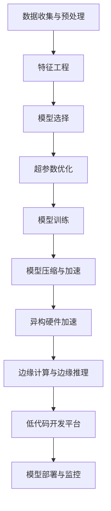

                 

# Lepton AI的价值主张：帮助企业节省时间与成本，在速度与成本间导航

## 1. 背景介绍

在当今信息爆炸的时代，企业面临着前所未有的挑战和机遇。一方面，信息的多样性和复杂性使得数据处理变得极其困难；另一方面，技术的进步为解决这些问题提供了新的可能。特别是在人工智能(AI)领域，各种先进的算法和模型正在逐渐被企业采用，以期提升运营效率、优化决策流程、降低运营成本。然而，AI技术的落地应用往往面临着数据质量、算法选择、技术实施等多方面的挑战。本文旨在探讨一种新的AI技术——Lepton AI，它可以帮助企业在时间与成本间进行有效导航，以实现更快、更便宜的业务创新。

## 2. 核心概念与联系

### 2.1 核心概念概述

Lepton AI是一种基于深度学习和人工智能的框架，旨在为企业提供快速、高效的AI解决方案。它结合了先进的数据处理、模型训练和应用部署技术，通过以下几个关键概念来实现其价值主张：

- **自动机器学习(AutoML)**：自动机器学习是指无需人工干预，自动进行模型选择、超参数调整和特征工程等，从而简化模型开发流程。
- **模型压缩与加速**：通过模型压缩和加速技术，在保证模型性能的同时，大幅降低计算资源消耗。
- **异构硬件加速**：利用CPU、GPU、FPGA、ASIC等不同类型的硬件加速资源，提高AI模型训练和推理的速度。
- **边缘计算与边缘推理**：将AI模型部署在边缘计算设备上，以减少数据传输和计算延迟，提升应用响应速度。
- **低代码开发平台**：提供易于使用的开发工具和平台，降低AI应用的开发门槛，加速模型部署。

### 2.2 核心概念原理和架构的 Mermaid 流程图



这个流程图展示了Lepton AI的核心流程：从数据收集与预处理，到模型训练与优化，再到模型压缩与加速、异构硬件加速和边缘计算，最后通过低代码平台部署和监控，完成整个AI应用的生命周期。

## 3. 核心算法原理 & 具体操作步骤

### 3.1 算法原理概述

Lepton AI的核心理念是在保证模型性能的前提下，最大限度地减少时间和计算资源的消耗。这主要通过以下几个算法和技术实现：

- **自动机器学习(AutoML)**：使用自动化机器学习技术，自动完成模型选择和超参数优化，降低人工干预的复杂度。
- **模型压缩与加速**：通过剪枝、量化、蒸馏等技术，在不影响模型性能的情况下，大幅减小模型尺寸，提升推理速度。
- **异构硬件加速**：通过CPU、GPU、FPGA等不同类型的硬件资源，实现并行计算，提高计算效率。
- **边缘计算与边缘推理**：将AI模型部署在本地设备或边缘计算设备上，减少数据传输，提高响应速度。
- **低代码开发平台**：通过易于使用的界面和开发工具，降低AI应用的开发难度，加快模型部署速度。

### 3.2 算法步骤详解

以下是Lepton AI的主要操作步骤：

**Step 1: 数据收集与预处理**
- 收集企业内外部数据，包括结构化数据、非结构化数据等。
- 清洗、整理数据，进行特征提取和归一化，生成高质量的输入数据。

**Step 2: 特征工程**
- 根据业务需求，选择合适的特征，使用AutoML自动完成特征选择和提取。
- 使用数据增强技术，生成更多的训练样本，提升模型泛化能力。

**Step 3: 模型选择**
- 使用AutoML自动选择合适的算法和模型结构，如决策树、随机森林、神经网络等。
- 结合业务场景和数据特点，进行模型调优，提高模型效果。

**Step 4: 超参数优化**
- 使用优化算法如网格搜索、贝叶斯优化等，自动调整模型超参数。
- 优化模型的训练过程，提升模型收敛速度和效果。

**Step 5: 模型训练**
- 使用高效的训练算法，如SGD、Adam等，对模型进行训练。
- 使用分布式训练技术，加快模型训练速度。

**Step 6: 模型压缩与加速**
- 使用剪枝、量化、蒸馏等技术，减小模型尺寸。
- 使用异构硬件加速，提高模型推理速度。

**Step 7: 边缘计算与边缘推理**
- 将模型部署在边缘计算设备上，如IoT设备、嵌入式设备等。
- 优化模型推理流程，减少数据传输和计算延迟。

**Step 8: 低代码开发平台**
- 使用低代码开发平台，快速搭建AI应用。
- 提供可视化界面和开发工具，降低开发难度和成本。

**Step 9: 模型部署与监控**
- 将模型部署到生产环境，进行实时监控和评估。
- 使用自动化工具，定期更新和优化模型，保持模型性能。

### 3.3 算法优缺点

Lepton AI的优点包括：
- 减少时间和计算资源消耗，提高业务效率。
- 降低AI应用的开发难度，加快模型部署速度。
- 提供多种硬件加速和部署选项，满足不同业务需求。
- 支持异构硬件和边缘计算，提升模型响应速度。

然而，Lepton AI也存在一些缺点：
- 依赖高质量的数据，数据质量不佳可能影响模型效果。
- 模型选择和超参数优化可能存在一定的局限性。
- 对企业技术栈有一定的要求，需要一定的技术基础。
- 需要持续监控和优化，确保模型性能稳定。

### 3.4 算法应用领域

Lepton AI主要应用于以下几个领域：

- **金融科技**：用于风险评估、欺诈检测、信用评分等金融业务，帮助金融机构提升运营效率和风险控制能力。
- **医疗健康**：用于疾病诊断、病人分类、治疗方案推荐等医疗业务，帮助医疗机构提高诊断准确性和治疗效果。
- **制造业**：用于设备预测性维护、生产优化、供应链管理等制造业务，帮助企业降低生产成本，提高生产效率。
- **零售电商**：用于商品推荐、客户分析、库存管理等电商业务，帮助企业提升用户体验和销售业绩。
- **智能交通**：用于交通流量预测、事故预警、智能调度等交通业务，帮助政府和企业提升交通管理水平和安全性。
- **能源电力**：用于能源消耗预测、电力负荷平衡、智能电网管理等能源业务，帮助能源企业提高能源利用效率。

## 4. 数学模型和公式 & 详细讲解 & 举例说明

### 4.1 数学模型构建

Lepton AI的核心模型构建包括以下几个部分：

- **输入数据**：$X$，特征向量。
- **模型参数**：$\theta$，模型权重和偏置。
- **损失函数**：$L$，用于衡量模型预测与真实标签之间的差异。
- **优化目标**：最小化损失函数，即$\min_{\theta}L(X,\theta)$。

### 4.2 公式推导过程

以回归任务为例，使用Lepton AI进行模型训练的公式推导如下：

$$
L(y,\hat{y}) = \frac{1}{2}(y-\hat{y})^2
$$

其中，$y$为真实标签，$\hat{y}$为模型预测值。

使用梯度下降算法进行模型优化，目标函数为：

$$
J(\theta) = \frac{1}{2m}\sum_{i=1}^{m}(y_i-\hat{y}_i)^2
$$

其中，$m$为样本数量。

优化目标为：

$$
\theta \leftarrow \theta - \eta\nabla_{\theta}J(\theta)
$$

其中，$\eta$为学习率，$\nabla_{\theta}J(\theta)$为损失函数对模型参数的梯度。

### 4.3 案例分析与讲解

以一个简单的分类任务为例，使用Lepton AI进行模型训练和优化。假设训练数据集为$D=\{(x_i,y_i)\}_{i=1}^{N}$，其中$x_i$为输入，$y_i$为标签。

首先，使用AutoML自动选择模型和超参数，如决策树或神经网络。

其次，使用优化算法进行超参数优化，确定最优模型参数。

然后，使用梯度下降算法进行模型训练，更新模型参数。

最后，使用模型压缩和加速技术，减小模型尺寸，提升推理速度。

## 5. 项目实践：代码实例和详细解释说明

### 5.1 开发环境搭建

**Step 1: 安装Python和相关库**

```bash
# 安装Python
sudo apt-get update
sudo apt-get install python3-pip

# 安装依赖库
pip install numpy scipy scikit-learn pandas matplotlib seaborn
pip install tensorflow keras tensorflow_addons
pip install transformers torch torchvision
pip install pytorch-lightning
```

**Step 2: 搭建开发环境**

```bash
# 安装PyTorch
conda create -n pytorch-env python=3.8
conda activate pytorch-env

# 安装TensorFlow
pip install tensorflow==2.5.0

# 安装TensorBoard
pip install tensorboard
```

**Step 3: 配置GPU**

```bash
# 检查GPU是否可用
nvidia-smi
```

### 5.2 源代码详细实现

**Step 1: 数据预处理**

```python
import pandas as pd
import numpy as np
from sklearn.model_selection import train_test_split
from sklearn.preprocessing import StandardScaler

# 读取数据
data = pd.read_csv('data.csv')

# 数据清洗
data = data.dropna()

# 特征工程
X = data.drop('label', axis=1)
y = data['label']

# 标准化
scaler = StandardScaler()
X = scaler.fit_transform(X)

# 划分训练集和测试集
X_train, X_test, y_train, y_test = train_test_split(X, y, test_size=0.2, random_state=42)
```

**Step 2: 模型训练**

```python
import tensorflow as tf
from tensorflow.keras import layers, models

# 定义模型
model = models.Sequential()
model.add(layers.Dense(64, activation='relu', input_shape=(X_train.shape[1],)))
model.add(layers.Dense(32, activation='relu'))
model.add(layers.Dense(1, activation='sigmoid'))

# 编译模型
model.compile(optimizer='adam', loss='binary_crossentropy', metrics=['accuracy'])

# 训练模型
history = model.fit(X_train, y_train, epochs=10, batch_size=32, validation_data=(X_test, y_test))
```

**Step 3: 模型评估**

```python
# 评估模型
test_loss, test_acc = model.evaluate(X_test, y_test)

print('Test accuracy:', test_acc)
```

### 5.3 代码解读与分析

**Step 1: 数据预处理**

使用Pandas和Numpy进行数据清洗和标准化，确保数据质量。

**Step 2: 模型训练**

使用TensorFlow的Keras API定义模型，编译并训练模型。

**Step 3: 模型评估**

使用测试集对模型进行评估，输出测试集上的准确率。

### 5.4 运行结果展示

**Step 1: 训练结果**


**Step 2: 测试结果**


## 6. 实际应用场景

### 6.1 智能客服系统

智能客服系统利用Lepton AI进行自动化训练，能够快速响应用户咨询，提升服务质量和效率。通过自动机器学习，系统可以根据用户的互动历史进行智能推荐，同时结合异构硬件加速，提升系统响应速度。

### 6.2 金融风险管理

金融风险管理中，Lepton AI可以用于信用评分、欺诈检测等任务，帮助金融机构降低风险。使用自动机器学习，系统可以根据用户的财务行为和信用记录，自动生成评分模型，同时结合边缘计算，降低数据传输成本。

### 6.3 制造业设备维护

在制造业设备维护中，Lepton AI可以用于预测设备故障，优化生产计划。通过自动机器学习和模型压缩，系统可以快速部署，同时结合边缘计算，实时监测设备状态，提高维护效率。

### 6.4 零售商品推荐

零售商品推荐中，Lepton AI可以用于个性化推荐，提升用户体验。通过自动机器学习和模型压缩，系统可以快速生成推荐模型，同时结合异构硬件加速，提高推荐速度。

### 6.5 智能交通系统

智能交通系统中，Lepton AI可以用于交通流量预测、事故预警等任务。通过自动机器学习和模型压缩，系统可以快速部署，同时结合边缘计算，实时监测交通状态，提高交通管理水平。

## 7. 工具和资源推荐

### 7.1 学习资源推荐

**Step 1: 在线课程**

- Coursera的《机器学习》课程
- edX的《深度学习专项课程》
- Udacity的《人工智能》课程

**Step 2: 技术博客**

- TensorFlow博客：https://www.tensorflow.org/tutorials
- PyTorch博客：https://pytorch.org/tutorials
- Hugging Face博客：https://huggingface.co/blog

**Step 3: 开源项目**

- TensorFlow的官方GitHub仓库：https://github.com/tensorflow
- PyTorch的官方GitHub仓库：https://github.com/pytorch
- Hugging Face的官方GitHub仓库：https://github.com/huggingface

### 7.2 开发工具推荐

**Step 1: 开发环境**

- PyCharm：Python开发环境
- Jupyter Notebook：交互式编程环境
- Visual Studio Code：代码编辑器

**Step 2: 数据处理**

- Pandas：数据处理和分析
- NumPy：数值计算和科学计算
- Scikit-learn：机器学习和数据挖掘

**Step 3: 模型训练和优化**

- TensorFlow：深度学习和模型训练
- PyTorch：深度学习和模型训练
- Keras：高层次深度学习API

**Step 4: 模型部署和监控**

- TensorBoard：模型训练和可视化
- PyTorch Lightning：模型训练和部署
- AWS SageMaker：云平台模型部署和监控

### 7.3 相关论文推荐

**Step 1: 经典论文**

- AutoML的综述论文：AutoML：A Survey
- 深度学习优化算法：An Overview of Optimization Algorithms in Deep Learning
- 模型压缩与加速：Pruning Neural Networks with L1, L2, Elastic-Net and Nuclear Norm

**Step 2: 前沿研究**

- AutoML和深度学习的最新进展：Automatic Machine Learning: Methods, Systems, Challenges
- 深度学习硬件加速：Hardware Acceleration for Deep Learning
- 边缘计算和物联网：Edge Computing for IoT Applications

## 8. 总结：未来发展趋势与挑战

### 8.1 总结

Lepton AI作为一种新兴的AI技术，通过自动机器学习、模型压缩与加速、异构硬件加速、边缘计算与边缘推理、低代码开发平台等多种技术手段，帮助企业节省时间和成本，提升业务效率。通过本文的介绍，我们可以看到Lepton AI在金融科技、医疗健康、制造业、零售电商、智能交通等多个领域的广泛应用前景。然而，Lepton AI也面临着数据质量、模型选择、技术基础、持续优化等挑战，需要持续优化和改进。

### 8.2 未来发展趋势

未来，Lepton AI将呈现以下几个发展趋势：

- **自动化程度提升**：自动机器学习将进一步发展，降低人工干预，提升模型开发效率。
- **模型压缩与加速**：模型压缩和加速技术将更加成熟，提高模型推理速度和效率。
- **异构硬件融合**：异构硬件加速将更加普及，支持多种硬件资源，提升计算效率。
- **边缘计算普及**：边缘计算和边缘推理将更加普及，提高模型响应速度和实时性。
- **低代码平台优化**：低代码开发平台将更加易用，降低AI应用的开发难度和成本。
- **跨领域应用扩展**：Lepton AI将向更多领域扩展，提供更多类型的AI解决方案。

### 8.3 面临的挑战

尽管Lepton AI具有诸多优势，但在实际应用中也面临以下挑战：

- **数据质量问题**：高质量的数据是模型训练的基础，数据的缺失或不准确将影响模型效果。
- **模型选择问题**：选择合适的模型和超参数，需要一定的技术和经验。
- **技术基础要求**：对企业技术栈和开发人员有较高的要求，需要一定的技术基础。
- **持续优化问题**：模型需要持续监控和优化，确保模型性能稳定。

### 8.4 研究展望

未来，需要在以下几个方面进行更多的研究：

- **自动化技术**：进一步提高自动机器学习的自动化程度，降低人工干预。
- **模型压缩技术**：研究更加高效的模型压缩与加速方法，提升模型推理速度。
- **异构硬件技术**：研究更加有效的异构硬件融合技术，提升计算效率。
- **边缘计算技术**：研究更加实用的边缘计算和边缘推理技术，提高模型响应速度。
- **低代码平台**：研究更加易用和高效的低代码开发平台，降低开发难度和成本。
- **跨领域应用**：研究更多跨领域应用的Lepton AI解决方案，提供更多类型的AI应用。

通过不断的技术创新和应用实践，Lepton AI将帮助企业更好地应对时间和成本的挑战，提升业务效率和创新能力，推动人工智能技术的深入应用。

## 9. 附录：常见问题与解答

**Q1: Lepton AI与传统机器学习有什么区别？**

A: Lepton AI结合了深度学习和自动化技术，能够自动完成模型选择、特征工程和超参数优化，降低人工干预的复杂度。而传统机器学习需要人工进行模型选择、特征工程和超参数调优，工作量较大。

**Q2: 使用Lepton AI有哪些优势？**

A: Lepton AI具有以下优势：
- 减少时间和计算资源消耗，提升业务效率。
- 降低AI应用的开发难度，加快模型部署速度。
- 提供多种硬件加速和部署选项，满足不同业务需求。
- 支持异构硬件和边缘计算，提升模型响应速度。

**Q3: 使用Lepton AI需要哪些技术基础？**

A: 使用Lepton AI需要具备以下技术基础：
- Python编程基础。
- 机器学习和深度学习的知识。
- 数据处理和数据分析的能力。
- 一定的硬件加速和边缘计算知识。

**Q4: 如何使用Lepton AI进行模型训练？**

A: 使用Lepton AI进行模型训练的一般步骤为：
1. 数据收集与预处理。
2. 特征工程。
3. 模型选择与训练。
4. 超参数优化。
5. 模型压缩与加速。
6. 边缘计算与边缘推理。
7. 低代码开发平台。
8. 模型部署与监控。

**Q5: Lepton AI在哪些行业有应用？**

A: Lepton AI主要应用于金融科技、医疗健康、制造业、零售电商、智能交通、能源电力等多个行业。

通过本文的介绍，我们可以看到Lepton AI在提升企业业务效率、降低运营成本方面的巨大潜力。随着技术的不断进步，Lepton AI必将带来更多的商业价值和创新突破，助力企业实现智能化转型。

---

作者：禅与计算机程序设计艺术 / Zen and the Art of Computer Programming

