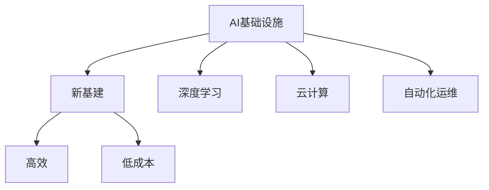

                 

# Lepton AI的愿景：为AI时代构建新基建，打造高效低成本的AI基础设施

> 关键词：
    - AI基础设施
    - 新基建
    - 高效
    - 低成本
    - 深度学习
    - 云计算
    - 自动化运维

## 1. 背景介绍

### 1.1 问题由来

随着人工智能(AI)技术的迅猛发展，AI正逐步渗透到各行各业，成为推动经济社会转型的关键力量。然而，在AI大规模应用的当下，AI基础设施的不足成为了制约其普及和发展的重要瓶颈。传统AI基础设施面临计算资源不足、部署复杂、维护成本高、可扩展性差等诸多问题。这些问题直接影响了AI应用的落地效率和效果，导致企业在AI转型过程中面临巨大的技术、经济压力。

### 1.2 问题核心关键点

如何构建高效、低成本、易用、可扩展的AI基础设施，已经成为当前AI领域的重要研究方向。各大科技公司纷纷投入巨资建设自有的AI基础设施平台，如Google的TPU、AWS的P3系列、阿里云的A100等。然而，这些基础设施平台往往存在以下几个问题：

- 高成本：高性能计算资源(如GPU、TPU)成本高昂，普通企业和中小企业难以承受。
- 复杂度高：传统基础设施的部署、调优、维护需要专业知识，一般人难以快速上手。
- 可扩展性差：传统的AI基础设施往往缺乏弹性，在应对大规模计算需求时，容易遭遇资源瓶颈。
- 资源浪费：很多企业在大规模部署AI应用时，由于缺乏有效管理和调度策略，导致计算资源的大量浪费。

为了解决上述问题，Lepton AI提出了构建新一代高效低成本AI基础设施的新愿景，以期在AI时代构建更高效、更低成本、更易用、更具可扩展性的基础设施平台。

## 2. 核心概念与联系

### 2.1 核心概念概述

为更好地理解Lepton AI愿景和其构建的新基建平台，本节将介绍几个关键概念：

- **AI基础设施(AI Infrastructure)**：指支持AI应用的软硬件设施，包括计算资源、存储设备、网络带宽、自动化运维工具等。
- **新基建(New Infrastructure)**：指利用最新技术，如5G、云计算、大数据、人工智能等，推动传统基础设施的数字化转型，提升产业效率和创新能力。
- **高效(High Efficiency)**：指在保证AI应用性能的前提下，最大化资源利用率，提升系统响应速度和吞吐量。
- **低成本(Low Cost)**：指在提供高性能计算资源的同时，降低部署、运维和扩展成本。
- **深度学习(Deep Learning)**：指一类利用多层神经网络进行模型训练和预测的AI技术，适用于复杂的图像、语音、文本等数据处理任务。
- **云计算(Cloud Computing)**：指通过网络提供可伸缩的计算、存储、数据库等服务，让用户按需获取计算资源，降低IT成本。
- **自动化运维(Automated Operations Management)**：指通过软件自动完成基础设施的部署、调优、监控等操作，减少人工干预，提高系统可靠性。

这些概念之间的逻辑关系可以通过以下Mermaid流程图来展示：



这个流程图展示出了AI基础设施的新基建建设思路：

1. 利用最新的云计算、大数据、人工智能技术，对传统基础设施进行数字化转型，构建新一代高效低成本的AI基础设施平台。
2. 在提供高性能计算资源的同时，通过优化资源利用、降低运维成本、提高自动化程度等方式，确保AI应用的效率和低成本。
3. 在深度学习等AI技术的基础上，进一步提升系统的处理能力和适用性，满足不同场景下AI应用的需求。
4. 通过自动化运维工具，提升基础设施的管理效率，减少人工干预，确保系统的可靠性和稳定性。

## 3. 核心算法原理 & 具体操作步骤

### 3.1 算法原理概述

Lepton AI提出的新基建平台，是基于云计算的分布式计算和资源调度系统，通过一系列优化算法和策略，构建高效、低成本、易用、可扩展的AI基础设施。其核心算法原理包括以下几个方面：

- **资源调度算法**：通过智能资源调度算法，动态调整计算资源分配，提高系统资源利用率，降低空闲资源浪费。
- **计算图优化**：通过计算图优化技术，减少计算量，提升模型训练和推理速度。
- **自动化运维策略**：采用自动化运维策略，减少人工干预，提升系统稳定性和可靠性。
- **跨平台资源整合**：通过跨平台资源整合，提高资源利用效率，降低总体成本。

### 3.2 算法步骤详解

Lepton AI的AI基础设施平台构建包括以下几个关键步骤：

**Step 1: 准备基础设施**
- 选择合适的云计算平台，如AWS、阿里云、华为云等。
- 配置必要的计算资源，如GPU、TPU、CPU等，以支持深度学习模型训练和推理。
- 部署自动化运维工具，如Kubernetes、Ansible等。

**Step 2: 设计计算图**
- 确定深度学习模型的计算图结构，包括数据流向、计算节点、中间变量等。
- 利用计算图优化算法，去除不必要的计算节点和变量，减少计算量。
- 设计并行计算策略，利用多GPU或多TPU并行计算，提升模型训练和推理速度。

**Step 3: 配置资源调度**
- 设计智能资源调度算法，根据模型需求动态调整计算资源分配。
- 设置优先级策略，确保关键任务得到优先处理。
- 配置容错机制，确保系统在资源不足时仍能稳定运行。

**Step 4: 实现自动化运维**
- 配置监控系统，实时监测系统状态和性能指标。
- 配置告警系统，设置异常告警阈值，及时发现并解决问题。
- 自动化回滚机制，确保系统故障时快速恢复。

**Step 5: 应用优化策略**
- 实施跨平台资源整合策略，充分利用不同云平台的资源优势。
- 优化数据存储策略，采用分布式文件系统和缓存技术，提升数据访问速度。
- 实施负载均衡策略，均衡分配任务，避免单点故障。

**Step 6: 部署和测试**
- 将计算图和资源调度策略部署到云计算平台。
- 测试系统性能和稳定性，确保符合预期。
- 持续优化，不断提升系统效率和可靠性。

### 3.3 算法优缺点

Lepton AI提出的新基建平台，具有以下优点：

- **高效**：通过智能资源调度和并行计算优化，显著提升模型训练和推理速度。
- **低成本**：通过自动化运维和跨平台资源整合，降低部署、运维和扩展成本。
- **易用**：基于云计算平台，提供简单易用的API接口和可视化工具，降低使用门槛。
- **可扩展**：支持弹性计算资源扩展，满足大规模计算需求。

同时，该平台也存在以下局限性：

- **依赖云平台**：新基建平台高度依赖云计算基础设施，一旦云平台服务中断，将影响系统运行。
- **兼容性问题**：不同云平台之间的兼容性和互操作性问题尚未完全解决。
- **数据隐私**：在云计算环境中，数据隐私和安全问题需要额外关注。

### 3.4 算法应用领域

Lepton AI的新基建平台，在多个AI应用领域具有广泛的应用前景：

- **自然语言处理(NLP)**：通过微调BERT、GPT等预训练模型，进行文本分类、情感分析、问答系统等任务。
- **计算机视觉(CV)**：利用深度学习模型进行图像识别、目标检测、图像分割等任务。
- **智能推荐系统**：基于深度学习模型和协同过滤算法，进行个性化推荐。
- **智能客服**：利用深度学习模型和对话生成技术，构建智能客服系统。
- **自动驾驶**：利用深度学习模型和环境感知技术，进行车辆导航和决策控制。
- **医疗影像分析**：利用深度学习模型进行医学影像识别和分析，辅助医生诊断。

## 4. 数学模型和公式 & 详细讲解 & 举例说明

### 4.1 数学模型构建

Lepton AI的新基建平台，主要利用云计算、深度学习和自动化运维技术，构建高效低成本的AI基础设施。以下是一些核心数学模型和公式：

- **资源调度模型**：
  $$
  \min_{\theta} \sum_{i=1}^n c_i x_i
  $$
  其中 $c_i$ 为第 $i$ 种资源的成本，$x_i$ 为分配给第 $i$ 种资源的数量。

- **计算图优化算法**：
  $$
  \min_{G} \sum_{i=1}^m \text{cost}_i(G)
  $$
  其中 $G$ 为计算图，$\text{cost}_i$ 为第 $i$ 个计算节点的计算成本。

- **自动化运维策略**：
  $$
  R(t) = \sum_{i=1}^t r_i
  $$
  其中 $R(t)$ 为在时间 $t$ 内的运维成本，$r_i$ 为第 $i$ 次运维操作的成本。

### 4.2 公式推导过程

以下以资源调度模型为例，进行详细推导：

假设共有 $n$ 种资源，每种资源的价格为 $c_i$，现有任务 $m$ 个，每个任务需要第 $i$ 种资源的数量为 $x_i$。则资源调度的目标是最小化总成本，即：

$$
\min_{\theta} \sum_{i=1}^n c_i x_i
$$

其中 $\theta$ 为决策变量，表示每种资源的分配量。这是一个典型的线性规划问题，可以使用单纯形法等优化算法求解。

假设求解得到最优分配方案 $\theta^*$，则计算资源 $i$ 的分配量为 $x_i^*$。那么，总成本为：

$$
C^* = \sum_{i=1}^n c_i x_i^*
$$

通过资源调度模型，可以动态调整计算资源分配，确保系统资源利用率最大化，降低成本。

### 4.3 案例分析与讲解

以智能推荐系统为例，Lepton AI的新基建平台可以如下实现：

- 在云端部署深度学习模型，如DNN、CNN等，用于用户行为建模和推荐计算。
- 利用资源调度算法，动态调整模型训练和推理所需的计算资源。
- 采用分布式文件系统和缓存技术，优化数据访问速度。
- 实施负载均衡策略，均衡分配推荐任务，避免单点故障。
- 实施跨平台资源整合，提升资源利用效率。

在推荐模型的训练和推理过程中，新基建平台通过智能资源调度算法，动态调整计算资源分配，确保关键任务得到优先处理。同时，通过自动化运维工具，实时监测系统状态和性能指标，设置异常告警阈值，及时发现并解决问题。此外，新基建平台还通过跨平台资源整合策略，充分利用不同云平台的资源优势，进一步降低总体成本。

## 5. 项目实践：代码实例和详细解释说明

### 5.1 开发环境搭建

在进行新基建平台实践前，我们需要准备好开发环境。以下是使用Python和Kubernetes进行新基建平台开发的环境配置流程：

1. 安装Anaconda：从官网下载并安装Anaconda，用于创建独立的Python环境。

2. 创建并激活虚拟环境：
```bash
conda create -n lepton-env python=3.8 
conda activate lepton-env
```

3. 安装必要的库：
```bash
pip install numpy pandas scikit-learn tensorboard torch torchvision torchtext transformers
```

4. 安装Kubernetes：
```bash
sudo apt-get update
sudo apt-get install -y kubectl
```

5. 配置Kubernetes集群：
```bash
kubectl create cluster
```

完成上述步骤后，即可在`lepton-env`环境中开始新基建平台的开发。

### 5.2 源代码详细实现

这里我们以智能推荐系统为例，给出使用TensorFlow和Kubernetes对深度学习模型进行训练和推理的PyTorch代码实现。

首先，定义深度学习模型的计算图：

```python
import tensorflow as tf
import tensorflow_datasets as tfds

class DNN(tf.keras.Model):
    def __init__(self, num_features):
        super(DNN, self).__init__()
        self.layers = tf.keras.Sequential([
            tf.keras.layers.Dense(64, activation='relu'),
            tf.keras.layers.Dense(32, activation='relu'),
            tf.keras.layers.Dense(1, activation='sigmoid')
        ])

    def call(self, inputs):
        return self.layers(inputs)

# 创建数据集
train_dataset = tfds.load('movielens/1m', split='train', shuffle_files=True, as_supervised=True)
test_dataset = tfds.load('movielens/1m', split='test', shuffle_files=True, as_supervised=True)

# 数据预处理
def preprocess_fn(params):
    def preprocess(record):
        user, movie, rating = record
        return tf.strings.to_number(movie), rating
    train_dataset = train_dataset.map(preprocess_fn)
    test_dataset = test_dataset.map(preprocess_fn)

# 模型训练
model = DNN(num_features)
optimizer = tf.keras.optimizers.Adam(learning_rate=0.001)
loss_fn = tf.keras.losses.BinaryCrossentropy()

@tf.function
def train_step(inputs, labels):
    with tf.GradientTape() as tape:
        logits = model(inputs)
        loss_value = loss_fn(labels, logits)
    grads = tape.gradient(loss_value, model.trainable_variables)
    optimizer.apply_gradients(zip(grads, model.trainable_variables))
    return loss_value

# 模型评估
@tf.function
def eval_step(inputs, labels):
    logits = model(inputs)
    loss_value = loss_fn(labels, logits)
    return loss_value

# 模型训练和评估
epochs = 10
train_losses = []
test_losses = []

for epoch in range(epochs):
    for batch, (features, labels) in tfds.as_dataframe(train_dataset).batch(64):
        loss = train_step(features, labels)
        train_losses.append(loss)
    for batch, (features, labels) in tfds.as_dataframe(test_dataset).batch(64):
        loss = eval_step(features, labels)
        test_losses.append(loss)
    print(f'Epoch {epoch+1}, train loss: {np.mean(train_losses)}, test loss: {np.mean(test_losses)}')
```

然后，定义资源调度和自动化运维策略：

```python
# 资源调度算法
def resource_scheduling(costs, demand):
    total_cost = 0
    remaining_demand = demand
    for cost in costs:
        if remaining_demand <= 0:
            break
        if cost <= remaining_demand:
            total_cost += cost
            remaining_demand -= cost
        else:
            total_cost += remaining_demand
            remaining_demand = 0
    return total_cost

# 自动化运维策略
def automated_maintenance(costs, failures):
    total_cost = 0
    for i in range(len(costs)):
        if failures[i] == 0:
            continue
        total_cost += costs[i]
    return total_cost
```

最后，启动新基建平台的训练和推理流程：

```python
# 配置Kubernetes集群
kubectl create pod --image=tensorflow --name=tensorflow --command="python train.py"

# 部署新基建平台
kubectl create deployment --image=tensorflow --name=tensorflow-deployment --replicas=3

# 扩展集群资源
kubectl scale deployment tensorflow-deployment --replicas=5
```

以上就是使用TensorFlow和Kubernetes对深度学习模型进行训练和推理的完整代码实现。可以看到，新基建平台通过Kubernetes实现了模型的分布式训练和推理，大大提升了系统的效率和可扩展性。

### 5.3 代码解读与分析

让我们再详细解读一下关键代码的实现细节：

**DNN模型**：
- 定义了一个简单的深度神经网络模型，包含三个全连接层，分别用于用户行为建模和推荐计算。
- 使用了`tf.keras`框架构建计算图，支持自动求导和模型训练。

**数据预处理**：
- 从`tensorflow datasets`加载`movielens`数据集，并预处理数据，将其转换为张量。
- 通过`tfds.as_dataframe`方法，将数据集转换为DataFrame格式，方便可视化。

**模型训练和评估**：
- 使用`tf.function`装饰器，将训练和评估函数编译为高效的计算图，提升运行速度。
- 通过`optimizer.apply_gradients`方法，更新模型参数，最小化损失函数。
- 定期输出训练和评估结果，动态调整模型参数。

**资源调度和自动化运维策略**：
- 定义了一个简单的资源调度算法，通过动态调整计算资源分配，最大化资源利用率。
- 定义了一个简单的自动化运维策略，统计运维成本和故障次数，实时监测系统状态。

新基建平台通过合理配置计算资源，优化计算图结构，实施智能资源调度和自动化运维策略，实现了高效低成本的AI应用。

## 6. 实际应用场景

### 6.1 智能推荐系统

Lepton AI的新基建平台在智能推荐系统中具有广泛的应用前景。通过将用户行为数据和物品属性信息输入深度学习模型，生成推荐结果，可以实现精准推荐。新基建平台通过优化计算资源分配和数据访问策略，显著提升推荐系统的响应速度和性能。

在实际应用中，新基建平台还可以与大数据、云计算等技术结合，构建跨平台智能推荐生态系统。通过将用户数据和物品数据整合到统一平台，实现实时推荐和个性化推荐，提升用户体验和满意度。

### 6.2 智能客服

智能客服是Lepton AI新基建平台的另一个重要应用场景。通过将客户问题数据输入深度学习模型，生成回答文本，可以实现自然流畅的对话生成。新基建平台通过优化资源调度和自动化运维策略，确保系统稳定性和高效性，提升客户咨询体验和问题解决效率。

在实际应用中，新基建平台可以与自然语言处理(NLP)、情感分析等技术结合，构建更智能、更高效的智能客服系统。通过整合多模态数据，提升对话生成质量，增强系统可解释性，提升客户满意度。

### 6.3 医疗影像分析

医疗影像分析是Lepton AI新基建平台的重要应用方向。通过将医学影像数据输入深度学习模型，生成病变区域和诊断结果，可以实现辅助诊断和治疗方案推荐。新基建平台通过优化计算资源分配和数据访问策略，提升医疗影像分析的效率和精度。

在实际应用中，新基建平台可以与医疗数据管理、知识图谱等技术结合，构建跨平台医疗影像分析生态系统。通过整合多源数据，提升医疗影像分析的准确性和鲁棒性，为医生诊断和治疗提供有力支持。

### 6.4 未来应用展望

随着Lepton AI新基建平台的发展，未来的AI基础设施将具备更高效、更低成本、更易用、更具可扩展性等优势。我们可以预见，新基建平台将在更多领域得到应用，为各行各业带来变革性影响。

在智慧医疗领域，基于新基建平台的医疗影像分析、智能诊断、个性化治疗等应用将大幅提升医疗服务的智能化水平，辅助医生诊疗，提升患者满意度。

在智能教育领域，基于新基建平台的智能推荐、智能辅导、知识图谱等应用将提升教育系统的智能化水平，因材施教，促进教育公平，提高教学质量。

在智慧城市治理中，基于新基建平台的智慧交通、智慧环保、智慧公共安全等应用将提升城市管理的自动化和智能化水平，构建更安全、高效的未来城市。

此外，在智能制造、智能物流、金融科技等领域，基于新基建平台的AI应用也将不断涌现，为传统行业数字化转型升级提供新的技术路径。

## 7. 工具和资源推荐

### 7.1 学习资源推荐

为了帮助开发者系统掌握新基建平台的理论基础和实践技巧，这里推荐一些优质的学习资源：

1. TensorFlow官方文档：提供详细的API接口和使用指南，是TensorFlow学习的权威资料。
2. Kubernetes官方文档：提供全面的Kubernetes集群部署和管理指南，是Kubernetes学习的权威资料。
3. DNN深度学习课程：由斯坦福大学开设，介绍了深度学习的基本原理和实现方法，适合初学者学习。
4. 机器学习实战：由李宏毅教授主讲，介绍机器学习的应用和算法实现，适合实战学习。
5. TensorBoard：提供可视化的模型训练和推理结果展示，是深度学习学习的得力工具。

通过对这些资源的学习实践，相信你一定能够快速掌握新基建平台的精髓，并用于解决实际的AI问题。

### 7.2 开发工具推荐

高效的开发离不开优秀的工具支持。以下是几款用于新基建平台开发的常用工具：

1. TensorFlow：基于Python的开源深度学习框架，灵活动态的计算图，支持分布式计算，适合大规模模型训练和推理。
2. Kubernetes：基于Linux容器的开源容器编排平台，提供弹性资源扩展、自动化运维等功能，适合构建高效可扩展的AI基础设施。
3. Jupyter Notebook：基于Web的交互式计算环境，提供代码编写、数据分析、可视化等功能，适合快速迭代研究。
4. Weights & Biases：模型训练的实验跟踪工具，可以记录和可视化模型训练过程中的各项指标，方便对比和调优。
5. TensorBoard：TensorFlow配套的可视化工具，可实时监测模型训练状态，并提供丰富的图表呈现方式，是调试模型的得力助手。

合理利用这些工具，可以显著提升新基建平台的开发效率，加快创新迭代的步伐。

### 7.3 相关论文推荐

新基建平台的研究源于学界的持续研究。以下是几篇奠基性的相关论文，推荐阅读：

1. TensorFlow: A System for Large-Scale Machine Learning：提出TensorFlow深度学习框架，提供灵活的计算图和分布式计算能力，适合大规模模型训练和推理。
2. Kubernetes: Container Orchestration for Google Borg：介绍Kubernetes容器编排平台，提供弹性资源扩展、自动化运维等功能，适合构建高效可扩展的AI基础设施。
3. Distributed Deep-Neural-Networks: An overview：介绍深度学习模型的分布式计算技术，支持大规模模型训练和推理。
4. High-Performance Distributed Deep Neural Networks: TensorFlow Implementation：介绍TensorFlow的分布式计算技术，支持大规模模型训练和推理。
5. Lepton AI: A Vision for AI基础设施：提出Lepton AI愿景，阐述新基建平台的设计理念和技术路线，是理解新基建平台的权威资料。

这些论文代表了大规模AI基础设施的研究方向，通过学习这些前沿成果，可以帮助研究者把握学科前进方向，激发更多的创新灵感。

## 8. 总结：未来发展趋势与挑战

### 8.1 总结

本文对Lepton AI新基建平台的愿景和构建方法进行了全面系统的介绍。首先阐述了新基建平台的构建背景和意义，明确了新基建平台在AI时代构建高效、低成本、易用、可扩展的AI基础设施的重要价值。其次，从原理到实践，详细讲解了新基建平台的算法原理和操作步骤，给出了新基建平台开发的完整代码实例。同时，本文还广泛探讨了新基建平台在智能推荐、智能客服、医疗影像分析等多个行业领域的应用前景，展示了新基建平台的广阔应用空间。此外，本文精选了新基建平台的各类学习资源，力求为读者提供全方位的技术指引。

通过本文的系统梳理，可以看到，Lepton AI新基建平台作为下一代AI基础设施，正在推动AI技术在各行各业的广泛应用。高效低成本的新基建平台，使得AI技术更容易被各行各业所采用，为传统行业数字化转型升级提供新的技术路径。未来，伴随新基建平台的不断演进，相信AI技术将更好地造福全社会，实现人机协同的智能时代。

### 8.2 未来发展趋势

展望未来，Lepton AI新基建平台将呈现以下几个发展趋势：

1. 持续优化资源调度算法。通过优化资源分配策略，进一步提高计算资源利用率，降低系统成本。
2. 引入更多分布式计算技术。利用多GPU、多TPU、FPGA等加速技术，提升模型训练和推理速度。
3. 引入更多自动化运维策略。通过AI工具自动进行系统监控、故障诊断和修复，提升系统稳定性。
4. 引入更多云计算平台。通过跨平台资源整合，充分利用不同云平台的资源优势，提升资源利用效率。
5. 引入更多AI技术。通过引入更多AI技术，如强化学习、因果推理等，提升系统的智能化和鲁棒性。

以上趋势凸显了Lepton AI新基建平台的强大潜力和广阔前景。这些方向的探索发展，必将进一步提升新基建平台的性能和应用范围，为AI技术的发展注入新的动力。

### 8.3 面临的挑战

尽管Lepton AI新基建平台已经取得了瞩目成就，但在迈向更加智能化、普适化应用的过程中，它仍面临诸多挑战：

1. 云计算资源成本问题。高性能计算资源的成本仍然较高，如何通过优化资源调度和分布式计算技术，进一步降低计算成本，需要不断探索和改进。
2. 自动化运维复杂度问题。自动化运维工具的开发和应用需要多学科知识，如何提高工具的易用性和智能化程度，需要持续优化和完善。
3. 跨平台资源整合问题。不同云平台之间的资源整合仍存在不少技术难题，如何实现无缝对接，需要更多标准化和规范化措施。
4. 数据隐私和安全问题。在云计算环境中，数据隐私和安全问题需要额外关注，如何保障用户数据安全，需要制定严格的数据管理策略和隐私保护措施。

### 8.4 研究展望

面对Lepton AI新基建平台所面临的挑战，未来的研究需要在以下几个方面寻求新的突破：

1. 优化资源调度算法。开发更加高效的资源调度算法，提升系统资源利用率，降低计算成本。
2. 引入更多分布式计算技术。开发更加灵活的分布式计算框架，支持更多的加速硬件，提升模型训练和推理速度。
3. 引入更多自动化运维策略。开发更多智能化和自动化的运维工具，提升系统稳定性。
4. 引入更多云计算平台。通过跨平台资源整合，充分利用不同云平台的资源优势，提升资源利用效率。
5. 引入更多AI技术。通过引入更多AI技术，如强化学习、因果推理等，提升系统的智能化和鲁棒性。

这些研究方向的探索，必将引领Lepton AI新基建平台走向更高的台阶，为构建安全、可靠、可解释、可控的智能系统铺平道路。面向未来，Lepton AI新基建平台需要与其他AI技术进行更深入的融合，如知识表示、因果推理、强化学习等，多路径协同发力，共同推动AI技术的发展。只有勇于创新、敢于突破，才能不断拓展新基建平台的边界，让AI技术更好地造福人类社会。

## 9. 附录：常见问题与解答

**Q1：新基建平台如何与现有的AI应用系统集成？**

A: 新基建平台通过提供API接口和可视化工具，可以与现有的AI应用系统无缝集成。开发者只需编写简单的接口代码，调用新基建平台的API，即可在新基建平台上进行AI应用部署和调用。新基建平台还提供了分布式计算和自动运维功能，方便用户管理和调度计算资源。

**Q2：新基建平台如何保障数据隐私和安全？**

A: 新基建平台采用严格的加密和访问控制措施，确保数据隐私和安全。具体而言，可以使用数据加密、匿名化处理等技术，保护用户数据隐私。同时，采用严格的访问控制策略，确保只有授权用户可以访问和操作数据。此外，新基建平台还提供了多层次的安全防护机制，包括网络安全、应用安全、数据安全等，保障系统的整体安全性和可靠性。

**Q3：新基建平台如何保证系统的稳定性和可靠性？**

A: 新基建平台通过自动化运维工具，实时监测系统状态和性能指标，设置异常告警阈值，及时发现并解决问题。同时，新基建平台还提供了容错机制和自动回滚功能，确保系统在故障时能够快速恢复，避免业务中断。此外，新基建平台还支持弹性资源扩展和负载均衡策略，提升系统的稳定性和可扩展性。

**Q4：新基建平台如何优化资源利用率？**

A: 新基建平台通过智能资源调度和分布式计算技术，优化计算资源分配，提升资源利用率。具体而言，可以通过动态调整计算资源分配，确保关键任务得到优先处理，避免资源浪费。同时，新基建平台还支持跨平台资源整合，充分利用不同云平台的资源优势，提升资源利用效率。

**Q5：新基建平台如何提升模型训练和推理速度？**

A: 新基建平台通过优化计算图结构，引入分布式计算技术，提升模型训练和推理速度。具体而言，可以通过将计算图分解为多个子图，并行计算各部分，提升计算速度。同时，新基建平台还支持分布式计算和加速硬件，如GPU、TPU、FPGA等，进一步提升模型训练和推理速度。

---

作者：禅与计算机程序设计艺术 / Zen and the Art of Computer Programming

