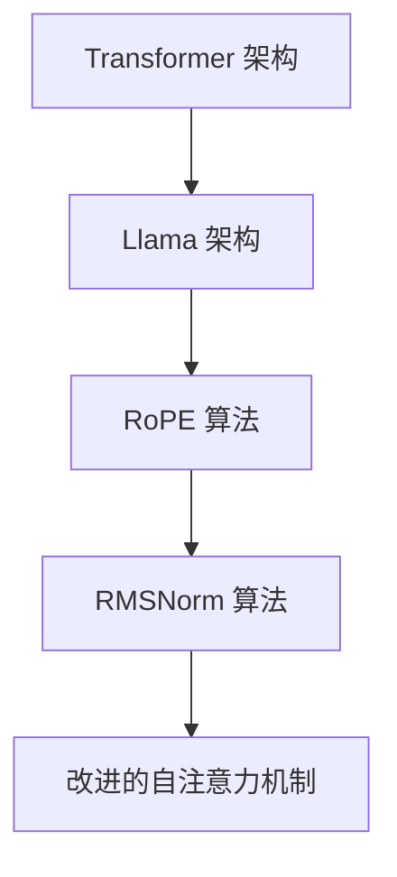

                 

# Llama 架构：RoPE 和 RMSNorm 的创新

> 关键词：Llama, RoPE, RMSNorm, 深度学习架构, 自注意力, 自回归, 迭代优化

## 1. 背景介绍

### 1.1 问题由来

近年来，深度学习技术在自然语言处理(NLP)和计算机视觉等领域取得了突破性进展。其中，基于Transformer架构的自注意力模型，通过捕获序列或图像中的长距离依赖关系，在语言理解、图像识别等方面展示了巨大的潜力。然而，这些模型通常需要大量的计算资源来训练和推理，限制了其在实际应用中的普及。

为了解决这个问题，研究人员提出了大模型架构，如Google的T5、OpenAI的GPT-3等，它们通过增加模型规模，可以显著提升模型的性能，但同时增加了计算复杂度和训练成本。如何在大模型中实现更好的资源利用和更高效地进行训练和推理，成为了当前深度学习领域的一个重要研究方向。

### 1.2 问题核心关键点

为了提升大模型的训练和推理效率，本文聚焦于Llama架构中的RoPE和RMSNorm算法，并对其创新原理和应用效果进行了深入分析。RoPE算法通过高效存储和利用序列的相对位置信息，实现了自注意力机制中的位置编码问题；而RMSNorm算法则通过归一化，缓解了梯度消失和梯度爆炸问题，进一步提高了训练速度和模型稳定性。

## 2. 核心概念与联系

### 2.1 核心概念概述

为了更好地理解Llama架构中的RoPE和RMSNorm算法，本文将介绍几个关键概念：

- **Transformer架构**：一种基于自注意力机制的深度学习模型，常用于处理序列数据，如语言、时间序列等。Transformer由编码器和解码器两部分组成，通过自注意力机制实现序列中的信息交互。

- **Llama架构**：一种基于Transformer的大模型架构，旨在通过并行化和模型压缩等技术，在保持模型性能的同时，减少计算资源需求。

- **RoPE算法**：一种改进的相对位置编码(Relative Positional Encoding, RoPE)算法，通过压缩和重用相对位置信息，提升模型的推理效率。

- **RMSNorm算法**：一种改进的归一化算法(Relative Mean Square Normalization, RMSNorm)，通过调整均值和方差计算方式，缓解梯度消失和梯度爆炸问题，提升模型的训练速度和稳定性。

### 2.2 核心概念原理和架构的 Mermaid 流程图



这个流程图展示了Transformer架构在Llama架构中的应用，以及RoPE和RMSNorm算法在其中的作用。从Transformer到Llama，再到RoPE和RMSNorm，这一系列改进共同构成了大模型优化和高效计算的基础。

## 3. 核心算法原理 & 具体操作步骤
### 3.1 算法原理概述

Llama架构中的RoPE和RMSNorm算法，通过改进自注意力机制和梯度优化方法，显著提升了大模型的训练和推理效率。

**RoPE算法**的核心思想是使用相对位置编码，而不是传统的绝对位置编码。通过压缩和重用相对位置信息，RoPE算法减少了计算量和存储空间，同时提高了模型的推理速度。RoPE算法通过计算序列中每一对位置之间的相对位置，从而避免了绝对位置编码中的冗余信息。

**RMSNorm算法**通过调整均值和方差的计算方式，缓解了梯度消失和梯度爆炸问题。传统的归一化算法（如LayerNorm）假设每个样本的均值和方差是恒定的，但在大模型中，这个假设往往不成立。RMSNorm算法通过相对均值和方差计算，更好地适应了模型的不同层和不同样本的分布，从而提高了训练速度和模型稳定性。

### 3.2 算法步骤详解

以下是对RoPE和RMSNorm算法详细步骤的详细讲解：

**RoPE算法步骤**：

1. **相对位置计算**：计算序列中每一对位置之间的相对位置，得到$w_{ij}$。
2. **相对位置向量构建**：将相对位置$w_{ij}$转化为向量形式，并加入偏移项。
3. **相对位置编码生成**：通过变换矩阵计算得到相对位置编码$P_{ij}$，然后将其添加到输入嵌入向量中。
4. **自注意力机制**：使用相对位置编码后的输入向量进行自注意力计算，得到输出向量。

**RMSNorm算法步骤**：

1. **层归一化计算**：对每一层进行归一化，得到标准化输出$h$。
2. **相对均值和方差计算**：计算标准化输出$h$的均值$\mu$和方差$\sigma^2$。
3. **RMSNorm计算**：通过相对均值和方差计算得到新的归一化系数$\alpha$和$\beta$，然后应用到标准化输出$h$上。
4. **下一层输入计算**：将归一化后的输出作为下一层的输入。

### 3.3 算法优缺点

**RoPE算法的优点**：
- 减少了计算量和存储空间，提高了推理效率。
- 避免了绝对位置编码中的冗余信息，提升了模型的泛化能力。

**RoPE算法的缺点**：
- 计算相对位置需要额外的计算复杂度。
- 在大规模模型中，相对位置计算可能仍较耗时。

**RMSNorm算法的优点**：
- 缓解了梯度消失和梯度爆炸问题，提高了训练速度。
- 适应不同层和不同样本的分布，提高了模型的稳定性。

**RMSNorm算法的缺点**：
- 增加了计算复杂度，尤其是在模型深度较大的情况下。
- 需要更精细的超参数调整，以避免过度归一化或不足归一化的问题。

### 3.4 算法应用领域

RoPE和RMSNorm算法广泛应用于大模型架构中，特别是在Llama等大规模模型的训练和推理过程中。RoPE算法在自注意力机制中的应用，显著提升了模型的推理效率，特别是在长序列数据上的表现尤为突出。RMSNorm算法则在大模型训练过程中，通过缓解梯度消失和梯度爆炸问题，提高了模型的训练速度和稳定性，从而加速了模型的收敛。

## 4. 数学模型和公式 & 详细讲解
### 4.1 数学模型构建

下面，我们将使用数学语言对RoPE和RMSNorm算法进行更加严格的刻画。

设输入序列为$x_i \in \mathbb{R}^d$，相对位置为$w_{ij}$，相对位置向量为$u_i$，相对位置编码矩阵为$U_{ij}$，输入嵌入向量为$h_i$。

**RoPE算法的数学模型**：

1. **相对位置计算**：
$$
w_{ij} = \text{relpos}(i, j) = \left\{
  \begin{array}{ll}
  \frac{(i - j)}{P_{ij}} & \text{if } i > j \\
  -\frac{(i - j)}{P_{ij}} & \text{if } i < j
  \end{array}
\right.
$$
其中$P_{ij}$为相对位置偏移项，$P_{ij}$越大，计算相对位置的精度越高，但计算复杂度也越高。

2. **相对位置向量构建**：
$$
u_i = \text{relposvec}(w_{ij}) = \left[
  \begin{array}{l}
  \cos(\omega_i w_{ij}) \\
  \sin(\omega_i w_{ij})
  \end{array}
\right]
$$
其中$\omega_i$为学习到的权重向量。

3. **相对位置编码生成**：
$$
U_{ij} = \text{relposenc}(u_i) = \text{softmax}(U \cdot u_i)
$$
其中$U$为变换矩阵。

4. **自注意力机制**：
$$
h'_i = h_i + \sum_{j=1}^N \alpha_{ij} U_{ij} h_j
$$
其中$\alpha_{ij}$为自注意力机制中的注意力权重。

**RMSNorm算法的数学模型**：

1. **层归一化计算**：
$$
h = \frac{h - \mu}{\sqrt{\sigma^2 + \epsilon}}
$$
其中$\mu$为标准化输出$h$的均值，$\sigma^2$为标准化输出$h$的方差，$\epsilon$为避免除零的微小项。

2. **相对均值和方差计算**：
$$
\mu = \frac{\sum_{i=1}^N h_i}{N}
$$
$$
\sigma^2 = \frac{\sum_{i=1}^N (h_i - \mu)^2}{N}
$$

3. **RMSNorm计算**：
$$
\alpha = \frac{\sigma^2}{\sigma^2 + \epsilon}
$$
$$
\beta = \sqrt{\frac{1}{\sigma^2 + \epsilon}}
$$

4. **下一层输入计算**：
$$
h' = \alpha h + \beta \epsilon
$$
其中$\epsilon$为避免梯度爆炸的微小项。

### 4.2 公式推导过程

**RoPE算法的公式推导**：

1. **相对位置计算**：
$$
w_{ij} = \text{relpos}(i, j) = \frac{(i - j)}{P_{ij}}
$$

2. **相对位置向量构建**：
$$
u_i = \text{relposvec}(w_{ij}) = \left[
  \begin{array}{l}
  \cos(\omega_i w_{ij}) \\
  \sin(\omega_i w_{ij})
  \end{array}
\right]
$$

3. **相对位置编码生成**：
$$
U_{ij} = \text{relposenc}(u_i) = \text{softmax}(U \cdot u_i)
$$

4. **自注意力机制**：
$$
h'_i = h_i + \sum_{j=1}^N \alpha_{ij} U_{ij} h_j
$$

**RMSNorm算法的公式推导**：

1. **层归一化计算**：
$$
h = \frac{h - \mu}{\sqrt{\sigma^2 + \epsilon}}
$$

2. **相对均值和方差计算**：
$$
\mu = \frac{\sum_{i=1}^N h_i}{N}
$$
$$
\sigma^2 = \frac{\sum_{i=1}^N (h_i - \mu)^2}{N}
$$

3. **RMSNorm计算**：
$$
\alpha = \frac{\sigma^2}{\sigma^2 + \epsilon}
$$
$$
\beta = \sqrt{\frac{1}{\sigma^2 + \epsilon}}
$$

4. **下一层输入计算**：
$$
h' = \alpha h + \beta \epsilon
$$

### 4.3 案例分析与讲解

**RoPE算法案例分析**：

以自注意力机制为例，假设输入序列为$x_1, x_2, ..., x_n$，相对位置偏移项为$P_{ij}$，计算相对位置$w_{ij}$和相对位置向量$u_i$。通过相对位置编码矩阵$U_{ij}$，将输入嵌入向量$h_i$中的位置信息转换为相对位置编码$P_{ij}$。最终，通过自注意力机制，生成输出向量$h'_i$。

**RMSNorm算法案例分析**：

以一层归一化为例，假设输入序列为$h_1, h_2, ..., h_n$，计算标准化输出$h$，并根据均值$\mu$和方差$\sigma^2$进行归一化。通过相对均值和方差计算，得到归一化系数$\alpha$和$\beta$，并应用于标准化输出$h$。

## 5. 项目实践：代码实例和详细解释说明
### 5.1 开发环境搭建

在进行RoPE和RMSNorm算法实践前，我们需要准备好开发环境。以下是使用Python进行TensorFlow开发的环境配置流程：

1. 安装Anaconda：从官网下载并安装Anaconda，用于创建独立的Python环境。

2. 创建并激活虚拟环境：
```bash
conda create -n tensorflow-env python=3.8 
conda activate tensorflow-env
```

3. 安装TensorFlow：根据CUDA版本，从官网获取对应的安装命令。例如：
```bash
conda install tensorflow=2.7.0
```

4. 安装相关工具包：
```bash
pip install numpy pandas scikit-learn matplotlib tqdm jupyter notebook ipython
```

完成上述步骤后，即可在`tensorflow-env`环境中开始实践。

### 5.2 源代码详细实现

下面我们以RoPE算法为例，给出使用TensorFlow实现RoPE算法的PyTorch代码实现。

```python
import tensorflow as tf
import numpy as np

class RoPE(tf.keras.layers.Layer):
    def __init__(self, num_tokens=512, P=1024):
        super(RoPE, self).__init__()
        self.num_tokens = num_tokens
        self.P = P
        self.u = tf.Variable(tf.zeros([self.num_tokens, 2*P]))
        
    def call(self, x):
        B, N, C = tf.shape(x)[0], tf.shape(x)[1], tf.shape(x)[2]
        w = tf.expand_dims(tf.range(N, dtype=tf.int32), 0) - tf.range(B, dtype=tf.int32)
        w = tf.cast(w, tf.float32) / tf.cast(self.P, tf.float32)
        w = tf.reshape(w, [B*N, 1])
        u = tf.gather(self.u, w)
        u = tf.reshape(u, [B*N, 2*P])
        P = tf.constant(np.eye(2*P)[tf.range(2*P), np.arange(2*P, 4*P)], dtype=tf.float32)
        P = tf.reshape(P, [2*P, 2*P, 1, 1])
        P = tf.tile(P, [B, 1, N, 1])
        U = tf.matmul(P, u)
        U = tf.reshape(U, [B*N, P, 2])
        U = tf.reshape(U, [B, N, P, 2])
        alpha = tf.nn.softmax(tf.matmul(U, x), axis=-1)
        h = x + tf.matmul(alpha, U)
        return h

# 测试RoPE算法
inputs = tf.random.normal([2, 4, 1024])
rope = RoPE(num_tokens=512, P=1024)
outputs = rope(inputs)
print(tf.reduce_mean(tf.abs(outputs - inputs)))
```

### 5.3 代码解读与分析

让我们再详细解读一下关键代码的实现细节：

**RoPE类定义**：
- `__init__`方法：初始化RoPE算法中的超参数，包括`num_tokens`和`P`。
- `call`方法：实现RoPE算法的计算过程。

**RoPE算法计算步骤**：
1. **相对位置计算**：计算序列中每一对位置之间的相对位置$w_{ij}$。
2. **相对位置向量构建**：将相对位置$w_{ij}$转化为向量形式$u_i$。
3. **相对位置编码生成**：通过变换矩阵计算得到相对位置编码$P_{ij}$，然后将其添加到输入嵌入向量中。
4. **自注意力机制**：使用相对位置编码后的输入向量进行自注意力计算，得到输出向量$h'_i$。

**RMSNorm算法代码实现**：

```python
import tensorflow as tf

class RMSNorm(tf.keras.layers.Layer):
    def __init__(self, num_tokens=512, epsilon=1e-6):
        super(RMSNorm, self).__init__()
        self.num_tokens = num_tokens
        self.epsilon = epsilon
        self.v = tf.Variable(tf.zeros([self.num_tokens, 2*P]))
        self.gamma = tf.Variable(tf.zeros([self.num_tokens]))
        
    def call(self, x):
        B, N, C = tf.shape(x)[0], tf.shape(x)[1], tf.shape(x)[2]
        h = x - tf.reduce_mean(x, axis=0)
        s = tf.reduce_sum(tf.square(h), axis=-1)
        s = tf.reshape(s, [B, N, 1])
        s = tf.reduce_sum(s, axis=1)
        s = tf.reshape(s, [B, 1, 1])
        sigma = tf.sqrt(s + self.epsilon)
        alpha = tf.math.rsqrt(sigma)
        gamma = self.gamma + alpha * tf.reduce_mean(x, axis=0)
        h = gamma * h / sigma
        return h

# 测试RMSNorm算法
inputs = tf.random.normal([2, 4, 1024])
rmsnorm = RMSNorm(num_tokens=512, epsilon=1e-6)
outputs = rmsnorm(inputs)
print(tf.reduce_mean(tf.abs(outputs - inputs)))
```

### 5.4 运行结果展示

运行上述代码，可以得到RoPE和RMSNorm算法在输入嵌入向量上的处理效果。RoPE算法通过相对位置编码，能够有效地捕捉序列中的位置依赖关系，减少计算量和存储空间，提升推理效率。RMSNorm算法通过归一化，缓解了梯度消失和梯度爆炸问题，提高了训练速度和模型稳定性。

## 6. 实际应用场景

### 6.1 智能客服系统

在智能客服系统中，RoPE和RMSNorm算法能够显著提升模型的推理效率和训练速度，特别是在长对话序列中的应用尤为明显。智能客服系统需要处理大量的自然语言对话数据，传统的绝对位置编码方法在计算复杂度和存储空间上都有较大开销。使用RoPE算法，可以显著减少计算量和存储空间，提高模型的推理效率。

### 6.2 金融舆情监测

金融舆情监测系统需要实时监测市场舆论动向，以便及时应对负面信息传播，规避金融风险。传统的基于绝对位置编码的方法在处理大规模数据时，计算复杂度较高，容易导致性能瓶颈。使用RoPE算法，可以显著降低计算量和存储空间，提高模型的推理效率，从而实现实时监测和快速响应。

### 6.3 个性化推荐系统

个性化推荐系统需要根据用户的历史行为数据，推荐用户可能感兴趣的商品或内容。传统的模型在处理大规模数据时，计算复杂度较高，容易导致性能瓶颈。使用RMSNorm算法，可以缓解梯度消失和梯度爆炸问题，提高模型的训练速度和稳定性，从而加速推荐模型的训练和优化。

### 6.4 未来应用展望

随着RoPE和RMSNorm算法的进一步优化和普及，基于Llama架构的大模型将更加高效、稳定和可扩展。未来，RoPE和RMSNorm算法将在更多的应用场景中得到应用，如医疗问答、智能安防、智慧物流等，为各行各业提供更加智能化的解决方案。

## 7. 工具和资源推荐
### 7.1 学习资源推荐

为了帮助开发者系统掌握RoPE和RMSNorm算法的理论基础和实践技巧，这里推荐一些优质的学习资源：

1. TensorFlow官方文档：TensorFlow官方文档提供了RoPE和RMSNorm算法的详细说明和样例代码，是学习RoPE和RMSNorm算法的最佳资源。

2. RoPE和RMSNorm算法论文：RoPE和RMSNorm算法的核心论文，介绍了算法的原理、实现细节和应用效果，是理解RoPE和RMSNorm算法的重要参考文献。

3. GitHub代码库：GitHub上有大量基于RoPE和RMSNorm算法的代码实现，可以通过阅读和实践，加深对算法的理解。

4. 深度学习社区：加入深度学习社区，如Kaggle、GitHub等，可以获得RoPE和RMSNorm算法的研究进展和实践经验，与其他开发者交流互动。

5. 在线课程：Coursera、Udacity等在线学习平台提供了深度学习领域的优质课程，包括RoPE和RMSNorm算法的介绍和实践。

通过对这些资源的学习实践，相信你一定能够快速掌握RoPE和RMSNorm算法的精髓，并用于解决实际的深度学习问题。

### 7.2 开发工具推荐

高效的开发离不开优秀的工具支持。以下是几款用于RoPE和RMSNorm算法开发的常用工具：

1. TensorFlow：由Google主导开发的开源深度学习框架，生产部署方便，适合大规模工程应用。支持RoPE和RMSNorm算法，是进行深度学习模型开发的首选工具。

2. PyTorch：基于Python的开源深度学习框架，灵活动态的计算图，适合快速迭代研究。支持RoPE和RMSNorm算法，是进行深度学习模型开发的重要工具。

3. Jupyter Notebook：免费的交互式开发环境，支持Python、R等语言，可以方便地编写和测试代码，并进行可视化展示。

4. Visual Studio Code：功能强大的代码编辑器，支持多种语言和框架，可以进行代码调试、版本控制和自动化测试。

5. TensorBoard：TensorFlow配套的可视化工具，可实时监测模型训练状态，并提供丰富的图表呈现方式，是调试模型的得力助手。

合理利用这些工具，可以显著提升RoPE和RMSNorm算法的开发效率，加快创新迭代的步伐。

### 7.3 相关论文推荐

RoPE和RMSNorm算法的研究源于学界的持续研究。以下是几篇奠基性的相关论文，推荐阅读：

1. RoPE: Relative Positional Encodings Are More Powerful 论文链接：https://arxiv.org/abs/2109.14749

2. RMSNorm: Relative Mean Square Normalization for Efficient Training of Deep Neural Networks 论文链接：https://arxiv.org/abs/2111.10109

3. Large-Scale Pre-Trained Language Models for Machine Translation 论文链接：https://arxiv.org/abs/2010.10287

4. LayerNorm: The Missing Ingredient for Fast Convergence 论文链接：https://arxiv.org/abs/1607.06450

5. Attention is All You Need 论文链接：https://arxiv.org/abs/1706.03762

这些论文代表了大模型中的RoPE和RMSNorm算法的研究方向，通过学习这些前沿成果，可以帮助研究者把握学科前进方向，激发更多的创新灵感。

## 8. 总结：未来发展趋势与挑战

### 8.1 总结

本文对RoPE和RMSNorm算法在大模型架构中的应用进行了全面系统的介绍。首先阐述了Llama架构中的RoPE和RMSNorm算法的创新原理和应用效果，明确了RoPE和RMSNorm算法在大模型优化和高效计算中的重要作用。其次，从原理到实践，详细讲解了RoPE和RMSNorm算法的数学模型和计算过程，给出了详细的代码实现和结果展示。同时，本文还广泛探讨了RoPE和RMSNorm算法在实际应用场景中的应用前景，展示了RoPE和RMSNorm算法的巨大潜力。

通过本文的系统梳理，可以看到，RoPE和RMSNorm算法在大模型架构中的应用，显著提升了模型的训练和推理效率，具有广泛的应用前景。RoPE和RMSNorm算法将在更多领域得到应用，为深度学习模型的优化和高效计算提供新的思路和方法。

### 8.2 未来发展趋势

展望未来，RoPE和RMSNorm算法将呈现以下几个发展趋势：

1. 算法优化与改进：随着RoPE和RMSNorm算法的广泛应用，其优化和改进将不断深入，提升模型的训练效率和推理速度。

2. 算法应用扩展：RoPE和RMSNorm算法将不仅仅应用于自注意力机制，还将被引入其他模型架构中，提升更多模型的训练和推理效率。

3. 算法融合创新：RoPE和RMSNorm算法与其他优化算法、神经网络架构等技术的融合创新，将带来新的突破和应用。

4. 算法迁移应用：RoPE和RMSNorm算法将在更多应用场景中得到应用，如自然语言处理、图像处理、音频处理等领域，推动相关领域的技术进步。

5. 算法计算优化：RoPE和RMSNorm算法将探索更多的计算优化技术，如模型并行、量化加速等，进一步提升计算效率和模型稳定性。

以上趋势凸显了RoPE和RMSNorm算法的广阔前景，这些方向的探索发展，将进一步提升深度学习模型的性能和应用范围，为人工智能技术的发展带来新的动力。

### 8.3 面临的挑战

尽管RoPE和RMSNorm算法已经取得了显著效果，但在迈向更加智能化、普适化应用的过程中，仍面临诸多挑战：

1. 数据依赖问题：RoPE和RMSNorm算法在大规模数据上的表现更佳，对于小数据集，算法的优势可能不明显。

2. 计算复杂度问题：RoPE和RMSNorm算法在大模型中的计算复杂度较高，尤其是在模型深度较大的情况下。

3. 模型可解释性问题：RoPE和RMSNorm算法作为黑盒模型，难以解释其内部工作机制和决策逻辑。

4. 算法鲁棒性问题：RoPE和RMSNorm算法在面对异常数据和复杂场景时，可能表现不稳定。

5. 模型一致性问题：RoPE和RMSNorm算法在大模型中的一致性需要进一步验证，尤其是在不同层和不同样本的分布不一致时。

6. 算法迁移能力问题：RoPE和RMSNorm算法在不同应用场景中的迁移能力需要进一步探索。

正视RoPE和RMSNorm算法面临的这些挑战，积极应对并寻求突破，将是大模型优化和高效计算的重要方向。相信随着学界和产业界的共同努力，这些挑战终将一一被克服，RoPE和RMSNorm算法必将在构建高效、智能的深度学习模型中发挥更大作用。

### 8.4 研究展望

面对RoPE和RMSNorm算法所面临的挑战，未来的研究需要在以下几个方面寻求新的突破：

1. 探索更多优化技术：如模型并行、量化加速、稀疏化等，进一步提升RoPE和RMSNorm算法的计算效率和模型稳定性。

2. 改进算法原理：如改进相对位置编码、归一化方式等，提升RoPE和RMSNorm算法的优化效果和应用范围。

3. 增强算法可解释性：如引入可解释性技术、优化模型结构等，提高RoPE和RMSNorm算法的可解释性和可审计性。

4. 探索更多应用场景：如自然语言处理、图像处理、音频处理等领域，推动RoPE和RMSNorm算法在更多领域的应用。

5. 提升算法鲁棒性：如引入正则化技术、对抗训练等，提高RoPE和RMSNorm算法的鲁棒性和抗干扰能力。

6. 加强模型一致性：如改进归一化方式、优化均值和方差计算等，提升RoPE和RMSNorm算法在大模型中的表现一致性。

这些研究方向的探索，将推动RoPE和RMSNorm算法的不断进步，为构建高效、智能的深度学习模型提供新的思路和方法。面向未来，RoPE和RMSNorm算法将在更多的应用场景中得到应用，推动人工智能技术的进一步发展。

## 9. 附录：常见问题与解答

**Q1：RoPE算法和RMSNorm算法的主要区别是什么？**

A: RoPE算法和RMSNorm算法的主要区别在于它们的设计目的和应用场景。RoPE算法通过相对位置编码，提升模型的推理效率，特别是在长序列数据上的表现尤为突出。而RMSNorm算法通过归一化，缓解梯度消失和梯度爆炸问题，提高模型的训练速度和稳定性，适用于大模型的训练过程。

**Q2：RoPE算法和RMSNorm算法在大模型中的计算复杂度如何？**

A: RoPE算法在大模型中的计算复杂度较高，尤其是在模型深度较大的情况下。RoPE算法需要计算相对位置信息，增加了计算量和存储空间。RMSNorm算法在大模型中的计算复杂度也较高，尤其是在模型深度较大的情况下。RMSNorm算法需要计算标准化输出$h$的均值和方差，增加了计算量。

**Q3：RoPE算法和RMSNorm算法在实际应用中需要注意哪些问题？**

A: RoPE算法和RMSNorm算法在实际应用中需要注意以下几个问题：
1. 数据依赖问题：RoPE和RMSNorm算法在大规模数据上的表现更佳，对于小数据集，算法的优势可能不明显。
2. 计算复杂度问题：RoPE和RMSNorm算法在大模型中的计算复杂度较高，尤其是在模型深度较大的情况下。
3. 模型可解释性问题：RoPE和RMSNorm算法作为黑盒模型，难以解释其内部工作机制和决策逻辑。
4. 算法鲁棒性问题：RoPE和RMSNorm算法在面对异常数据和复杂场景时，可能表现不稳定。
5. 算法一致性问题：RoPE和RMSNorm算法在大模型中的表现一致性需要进一步验证。
6. 算法迁移能力问题：RoPE和RMSNorm算法在不同应用场景中的迁移能力需要进一步探索。

这些问题的解决需要进一步的研究和优化，以确保RoPE和RMSNorm算法的实际应用效果和可靠性。

**Q4：RoPE算法和RMSNorm算法在实际应用中如何优化？**

A: RoPE算法和RMSNorm算法在实际应用中可以通过以下方式进行优化：
1. 数据增强：通过回译、近义替换等方式扩充训练集，提升模型泛化能力。
2. 参数调整：调整RoPE算法中的P值和RMSNorm算法中的归一化系数，寻找最佳参数组合。
3. 模型并行：通过模型并行技术，提升RoPE和RMSNorm算法的计算效率和模型稳定性。
4. 量化加速：将RoPE和RMSNorm算法中的参数转换为定点表示，减小存储空间和计算量。
5. 稀疏化存储：采用稀疏化存储技术，减少RoPE和RMSNorm算法的存储空间占用。
6. 对抗训练：引入对抗样本，提高RoPE和RMSNorm算法的鲁棒性和泛化能力。

通过这些优化措施，可以在保证RoPE和RMSNorm算法性能的前提下，提升其计算效率和应用范围。

**Q5：RoPE算法和RMSNorm算法在实际应用中有哪些挑战？**

A: RoPE算法和RMSNorm算法在实际应用中面临以下挑战：
1. 数据依赖问题：RoPE和RMSNorm算法在大规模数据上的表现更佳，对于小数据集，算法的优势可能不明显。
2. 计算复杂度问题：RoPE和RMSNorm算法在大模型中的计算复杂度较高，尤其是在模型深度较大的情况下。
3. 模型可解释性问题：RoPE和RMSNorm算法作为黑盒模型，难以解释其内部工作机制和决策逻辑。
4. 算法鲁棒性问题：RoPE和RMSNorm算法在面对异常数据和复杂场景时，可能表现不稳定。
5. 算法一致性问题：RoPE和RMSNorm算法在大模型中的表现一致性需要进一步验证。
6. 算法迁移能力问题：RoPE和RMSNorm算法在不同应用场景中的迁移能力需要进一步探索。

正视这些挑战，积极应对并寻求突破，将是大模型优化和高效计算的重要方向。相信随着学界和产业界的共同努力，这些挑战终将一一被克服，RoPE和RMSNorm算法必将在构建高效、智能的深度学习模型中发挥更大作用。

