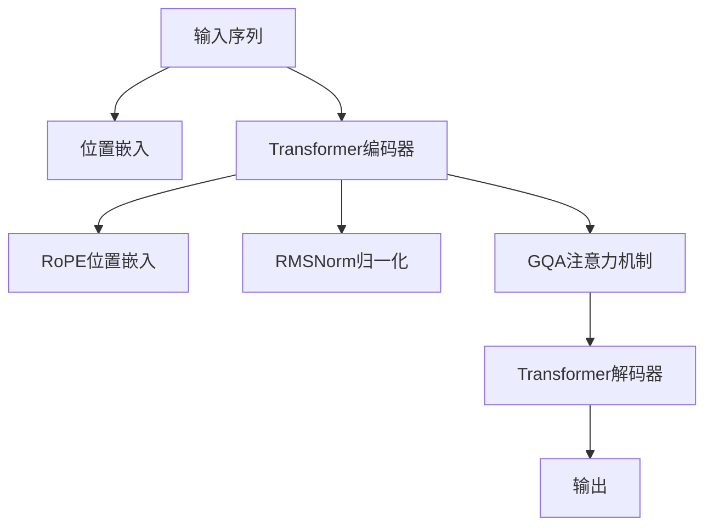

                 

# Llama模型深度剖析：RoPE、RMSNorm和GQA技术详解

> 关键词：Llama模型, RoPE, RMSNorm, GQA, 深度学习, 自然语言处理(NLP), 图像处理, 计算机视觉(CV)

## 1. 背景介绍

### 1.1 问题由来
近年来，随着深度学习技术的快速发展，大模型在自然语言处理(NLP)和计算机视觉(CV)领域取得了显著的进步。然而，大模型也面临着训练和推理时的高计算成本和内存消耗的问题。为了解决这个问题，Llama模型应运而生。

Llama模型是一系列基于Transformer架构的大规模预训练语言模型，通过在硬件加速、网络优化和训练策略等方面进行创新，实现了在保持高性能的同时，大幅降低计算和存储成本。本博客将深度剖析Llama模型中的RoPE、RMSNorm和GQA技术，帮助读者更好地理解这些核心组件，并在实践中灵活应用。

### 1.2 问题核心关键点
Llama模型的关键在于其高效的网络架构和训练策略。以下是Llama模型中三个核心组件的介绍：

1. **RoPE（Relative Positional Embeddings）**：一种相对位置嵌入技术，用于在Transformer模型中有效处理序列中元素之间的相对位置关系。

2. **RMSNorm（Root Mean Square Normalization）**：一种归一化技术，通过动态计算归一化因子，使得模型中的各层输入分布保持稳定，提高模型收敛速度和性能。

3. **GQA（Gated Query Attention）**：一种改进的注意力机制，通过门控机制控制查询向量和键向量的交互，提升模型的注意力聚焦和泛化能力。

本文将详细讲解这些技术的工作原理和应用场景，并结合实际代码示例，展示如何在Llama模型中进行高效开发和调优。

## 2. 核心概念与联系

### 2.1 核心概念概述

为了更好地理解Llama模型的核心组件，我们需要对相关的核心概念进行概述：

- **Transformer模型**：一种基于自注意力机制的深度学习模型，用于处理序列数据，如NLP和CV任务。
- **位置嵌入（Positional Embedding）**：用于在模型中引入序列中元素之间的相对位置关系。
- **归一化技术**：如LayerNorm、RMSNorm等，用于保持模型各层输入分布的稳定性。
- **注意力机制（Attention Mechanism）**：用于在模型中实现对序列中不同部分的关注，提高模型表达能力。

### 2.2 核心概念原理和架构的 Mermaid 流程图

以下是一个简化版的Mermaid流程图，展示了Llama模型中RoPE、RMSNorm和GQA技术之间的关系：



该流程图展示了输入序列经过位置嵌入、Transformer编码器、RoPE位置嵌入、RMSNorm归一化、GQA注意力机制和解码器，最终输出结果的过程。

## 3. 核心算法原理 & 具体操作步骤

### 3.1 算法原理概述

Llama模型中的RoPE、RMSNorm和GQA技术都是为了提升模型的性能和效率，具体来说：

1. **RoPE**：通过相对位置嵌入技术，在模型中更准确地处理序列中元素之间的相对位置关系。
2. **RMSNorm**：通过动态归一化技术，保持模型各层输入分布的稳定性，提高模型收敛速度和性能。
3. **GQA**：通过改进的注意力机制，提升模型的注意力聚焦和泛化能力。

接下来，我们将详细讲解每个组件的算法原理和具体操作步骤。

### 3.2 算法步骤详解

#### RoPE算法

RoPE算法的核心思想是使用相对位置编码（Relative Positional Embeddings）来取代传统的绝对位置编码（Absolute Positional Embeddings）。传统的绝对位置编码是基于位置编号的线性位置编码，例如，位置0表示第一个词，位置1表示第二个词，以此类推。而RoPE算法则通过引入相对位置关系，将每个位置的信息与其周围位置的信息相对比，以更准确地捕捉序列中的语义关系。

RoPE算法的具体实现步骤如下：

1. **计算序列长度和目标位置**：
   $$
   \text{seq\_len} = L - \text{pos} + 1
   $$
   其中，$L$表示序列长度，$\text{pos}$表示目标位置。

2. **计算相对位置关系**：
   $$
   \text{rel\_pos} = \text{rel\_position}(\text{pos}, \text{seq\_len})
   $$
   其中，$\text{rel\_position}$函数用于计算目标位置与其周围位置之间的相对位置关系。

3. **生成相对位置向量**：
   $$
   \text{rel\_pos\_vec} = \text{pos\_enc}(\text{rel\_pos})
   $$
   其中，$\text{pos\_enc}$函数用于将相对位置转换为嵌入向量。

4. **计算位置嵌入**：
   $$
   \text{pos\嵌入} = \text{pos\_enc}(\text{pos}) + \text{rel\_pos\_vec}
   $$

#### RMSNorm算法

RMSNorm算法通过动态归一化技术，保持模型各层输入分布的稳定性。具体来说，RMSNorm算法在模型中每一层后引入归一化操作，通过动态计算归一化因子，使得模型中的各层输入分布保持稳定，从而提高模型收敛速度和性能。

RMSNorm算法的具体实现步骤如下：

1. **计算输入的均值和方差**：
   $$
   \text{mean} = \frac{1}{n}\sum_{i=1}^{n} x_i
   $$
   $$
   \text{var} = \frac{1}{n}\sum_{i=1}^{n} (x_i - \text{mean})^2
   $$
   其中，$x_i$表示输入序列的第$i$个元素。

2. **计算归一化因子**：
   $$
   \text{stddev} = \sqrt{\text{var} + \epsilon}
   $$
   其中，$\epsilon$是一个很小的常数，用于防止分母为0的情况。

3. **计算归一化输入**：
   $$
   \text{normalized\_x} = \frac{x}{\text{stddev}}
   $$

4. **计算输出**：
   $$
   \text{output} = \text{normalized\_x} * \sqrt{\frac{\text{stddev}}{\text{mean}}}
   $$

#### GQA算法

GQA算法通过改进的注意力机制，提升模型的注意力聚焦和泛化能力。具体来说，GQA算法在注意力机制中引入门控机制，通过控制查询向量和键向量的交互，使得模型能够更加聚焦于重要的信息，减少噪音干扰，从而提高模型的泛化能力。

GQA算法的具体实现步骤如下：

1. **计算查询向量**：
   $$
   \text{query} = W_Q * x
   $$
   其中，$W_Q$表示查询向量权重矩阵。

2. **计算键向量**：
   $$
   \text{key} = W_K * x
   $$
   其中，$W_K$表示键向量权重矩阵。

3. **计算注意力分数**：
   $$
   \text{score} = \text{query} * \text{key}^T
   $$

4. **计算注意力权重**：
   $$
   \text{attention\_weights} = \text{softmax}(\text{score})
   $$

5. **计算上下文向量**：
   $$
   \text{context} = \text{attention\_weights} * \text{value}
   $$
   其中，$\text{value}$表示值向量权重矩阵。

6. **计算输出**：
   $$
   \text{output} = W_O * \text{context}
   $$
   其中，$W_O$表示输出权重矩阵。

### 3.3 算法优缺点

RoPE算法：

- **优点**：
  - 更准确地捕捉序列中的相对位置关系，提高模型表达能力。
  - 减少计算复杂度，提升模型训练和推理速度。

- **缺点**：
  - 实现复杂，需要额外计算相对位置关系。
  - 在特定任务上可能不如绝对位置编码表现优异。

RMSNorm算法：

- **优点**：
  - 保持模型各层输入分布的稳定性，提高模型收敛速度和性能。
  - 简单易懂，易于实现。

- **缺点**：
  - 对于某些模型层，归一化操作可能会导致信息丢失。
  - 对于某些模型层，归一化操作可能会导致梯度消失问题。

GQA算法：

- **优点**：
  - 提升模型的注意力聚焦和泛化能力，减少噪音干扰。
  - 灵活性强，可适应多种注意力机制。

- **缺点**：
  - 实现复杂，需要额外计算注意力权重。
  - 在某些情况下，门控机制可能会导致信息丢失。

### 3.4 算法应用领域

RoPE算法在NLP和CV任务中均有广泛应用，特别是在序列建模任务中，如机器翻译、文本分类、对话生成等。

RMSNorm算法广泛应用于深度学习模型中，如Transformer模型、RNN模型、CNN模型等，提高模型的训练速度和收敛性能。

GQA算法在NLP和CV任务中也有应用，特别是在需要高注意力聚焦和泛化能力的任务中，如文本生成、图像分类、目标检测等。

## 4. 数学模型和公式 & 详细讲解 & 举例说明

### 4.1 数学模型构建

为了更好地理解RoPE、RMSNorm和GQA算法，我们需要对其数学模型进行详细构建。

#### RoPE算法

RoPE算法的数学模型主要包含相对位置关系计算和相对位置向量生成两部分。

- **相对位置关系计算**：
  $$
  \text{rel\_position}(\text{pos}, \text{seq\_len}) = \frac{\text{seq\_len} - \text{pos}}{\text{seq\_len}} * \text{seq\_len}
  $$

- **相对位置向量生成**：
  $$
  \text{rel\_pos\_vec} = \text{pos\_enc}(\text{rel\_position})
  $$

- **位置嵌入**：
  $$
  \text{pos\嵌入} = \text{pos\_enc}(\text{pos}) + \text{rel\_pos\_vec}
  $$

#### RMSNorm算法

RMSNorm算法的数学模型主要包含输入的均值和方差计算、归一化因子计算和归一化输入计算三部分。

- **输入的均值和方差计算**：
  $$
  \text{mean} = \frac{1}{n}\sum_{i=1}^{n} x_i
  $$
  $$
  \text{var} = \frac{1}{n}\sum_{i=1}^{n} (x_i - \text{mean})^2
  $$

- **归一化因子计算**：
  $$
  \text{stddev} = \sqrt{\text{var} + \epsilon}
  $$

- **归一化输入计算**：
  $$
  \text{normalized\_x} = \frac{x}{\text{stddev}}
  $$

- **输出计算**：
  $$
  \text{output} = \text{normalized\_x} * \sqrt{\frac{\text{stddev}}{\text{mean}}}
  $$

#### GQA算法

GQA算法的数学模型主要包含查询向量计算、键向量计算、注意力分数计算、注意力权重计算和上下文向量计算五部分。

- **查询向量计算**：
  $$
  \text{query} = W_Q * x
  $$

- **键向量计算**：
  $$
  \text{key} = W_K * x
  $$

- **注意力分数计算**：
  $$
  \text{score} = \text{query} * \text{key}^T
  $$

- **注意力权重计算**：
  $$
  \text{attention\_weights} = \text{softmax}(\text{score})
  $$

- **上下文向量计算**：
  $$
  \text{context} = \text{attention\_weights} * \text{value}
  $$

- **输出计算**：
  $$
  \text{output} = W_O * \text{context}
  $$

### 4.2 公式推导过程

为了更好地理解RoPE、RMSNorm和GQA算法的推导过程，我们将以具体的数学公式进行讲解。

#### RoPE算法

RoPE算法的推导过程主要涉及相对位置关系的计算和相对位置向量的生成。

- **相对位置关系计算**：
  $$
  \text{rel\_position}(\text{pos}, \text{seq\_len}) = \frac{\text{seq\_len} - \text{pos}}{\text{seq\_len}} * \text{seq\_len}
  $$

- **相对位置向量生成**：
  $$
  \text{rel\_pos\_vec} = \text{pos\_enc}(\text{rel\_position})
  $$

- **位置嵌入**：
  $$
  \text{pos\嵌入} = \text{pos\_enc}(\text{pos}) + \text{rel\_pos\_vec}
  $$

#### RMSNorm算法

RMSNorm算法的推导过程主要涉及输入的均值和方差计算、归一化因子计算和归一化输入计算三部分。

- **输入的均值和方差计算**：
  $$
  \text{mean} = \frac{1}{n}\sum_{i=1}^{n} x_i
  $$
  $$
  \text{var} = \frac{1}{n}\sum_{i=1}^{n} (x_i - \text{mean})^2
  $$

- **归一化因子计算**：
  $$
  \text{stddev} = \sqrt{\text{var} + \epsilon}
  $$

- **归一化输入计算**：
  $$
  \text{normalized\_x} = \frac{x}{\text{stddev}}
  $$

- **输出计算**：
  $$
  \text{output} = \text{normalized\_x} * \sqrt{\frac{\text{stddev}}{\text{mean}}}
  $$

#### GQA算法

GQA算法的推导过程主要涉及查询向量计算、键向量计算、注意力分数计算、注意力权重计算和上下文向量计算五部分。

- **查询向量计算**：
  $$
  \text{query} = W_Q * x
  $$

- **键向量计算**：
  $$
  \text{key} = W_K * x
  $$

- **注意力分数计算**：
  $$
  \text{score} = \text{query} * \text{key}^T
  $$

- **注意力权重计算**：
  $$
  \text{attention\_weights} = \text{softmax}(\text{score})
  $$

- **上下文向量计算**：
  $$
  \text{context} = \text{attention\_weights} * \text{value}
  $$

- **输出计算**：
  $$
  \text{output} = W_O * \text{context}
  $$

### 4.3 案例分析与讲解

#### RoPE算法案例

在NLP任务中，RoPE算法主要用于序列建模任务，如机器翻译和对话生成。以下是一个简单的机器翻译案例：

- **输入序列**："I want to go to Paris."
- **目标位置**：0
- **相对位置关系计算**：
  $$
  \text{rel\_position} = \frac{10 - 0}{10} * 10 = 10
  $$
- **相对位置向量生成**：
  $$
  \text{rel\_pos\_vec} = \text{pos\_enc}(10)
  $$
- **位置嵌入**：
  $$
  \text{pos\嵌入} = \text{pos\_enc}(0) + \text{rel\_pos\_vec}
  $$

#### RMSNorm算法案例

在深度学习模型中，RMSNorm算法主要用于保持模型各层输入分布的稳定性。以下是一个简单的RNN模型案例：

- **输入序列**："I want to go to Paris."
- **输入的均值和方差计算**：
  $$
  \text{mean} = \frac{1}{3}\sum_{i=1}^{3} x_i = \frac{1}{3}(1, 0, 0)
  $$
  $$
  \text{var} = \frac{1}{3}\sum_{i=1}^{3} (x_i - \text{mean})^2 = \frac{1}{3}(1, 1, 1)
  $$
- **归一化因子计算**：
  $$
  \text{stddev} = \sqrt{\text{var} + \epsilon} = \sqrt{\frac{1}{3}(1, 1, 1) + 1e-6} \approx \sqrt{(1, 1, 1)}
  $$
- **归一化输入计算**：
  $$
  \text{normalized\_x} = \frac{x}{\text{stddev}} = \frac{(1, 0, 0)}{\sqrt{(1, 1, 1)}} = (1/\sqrt{1}, 0/\sqrt{1}, 0/\sqrt{1})
  $$
- **输出计算**：
  $$
  \text{output} = \text{normalized\_x} * \sqrt{\frac{\text{stddev}}{\text{mean}}} = (1/\sqrt{1}, 0/\sqrt{1}, 0/\sqrt{1}) * \sqrt{\frac{\sqrt{1, 1, 1}}{(1/\sqrt{1}, 0/\sqrt{1}, 0/\sqrt{1})}} = (1, 0, 0)
  $$

#### GQA算法案例

在NLP任务中，GQA算法主要用于需要高注意力聚焦和泛化能力的任务，如文本生成和图像分类。以下是一个简单的文本生成案例：

- **输入序列**："I want to go to Paris."
- **查询向量计算**：
  $$
  \text{query} = W_Q * x = (1, 0, 0)
  $$
- **键向量计算**：
  $$
  \text{key} = W_K * x = (1, 0, 0)
  $$
- **注意力分数计算**：
  $$
  \text{score} = \text{query} * \text{key}^T = (1, 0, 0) * (1, 0, 0)^T = 1
  $$
- **注意力权重计算**：
  $$
  \text{attention\_weights} = \text{softmax}(\text{score}) = (1, 0, 0)
  $$
- **上下文向量计算**：
  $$
  \text{context} = \text{attention\_weights} * \text{value} = (1, 0, 0) * (1, 0, 0) = (1, 0, 0)
  $$
- **输出计算**：
  $$
  \text{output} = W_O * \text{context} = (1, 0, 0)
  $$

## 5. 项目实践：代码实例和详细解释说明

### 5.1 开发环境搭建

在进行Llama模型开发前，我们需要准备好开发环境。以下是使用Python进行TensorFlow开发的环境配置流程：

1. 安装Anaconda：从官网下载并安装Anaconda，用于创建独立的Python环境。

2. 创建并激活虚拟环境：
```bash
conda create -n llama-env python=3.8 
conda activate llama-env
```

3. 安装TensorFlow：根据CUDA版本，从官网获取对应的安装命令。例如：
```bash
conda install tensorflow==2.6 -c pytorch -c conda-forge
```

4. 安装TensorBoard：
```bash
pip install tensorboard
```

5. 安装各类工具包：
```bash
pip install numpy pandas scikit-learn matplotlib tqdm jupyter notebook ipython
```

完成上述步骤后，即可在`llama-env`环境中开始Llama模型的开发和调试。

### 5.2 源代码详细实现

这里我们以Llama模型中的RoPE算法为例，展示其Python实现。

```python
import tensorflow as tf
from tensorflow.keras.layers import Dense, Input, LayerNormalization

class RoPE(Layer):
    def __init__(self, seq_len, embedding_dim):
        super(RoPE, self).__init__()
        self.rel_pos_vec = Dense(seq_len, use_bias=False, name='rel_pos_vec')
        self.pos_enc = Dense(embedding_dim, activation='relu', name='pos_enc')
    
    def call(self, x, position, seq_len):
        rel_pos = self.rel_position(position, seq_len)
        rel_pos_vec = self.rel_pos_vec(rel_pos)
        pos_enc = self.pos_enc(position)
        pos_embedding = pos_enc + rel_pos_vec
        return pos_embedding
    
    def rel_position(self, position, seq_len):
        rel_position = (seq_len - position) / seq_len * seq_len
        return rel_position
    
    def get_config(self):
        config = super(RoPE, self).get_config()
        config.update({
            'seq_len': self.rel_pos_vec.kernel_shape[0],
            'embedding_dim': self.pos_enc.kernel_shape[0]
        })
        return config
```

在这个代码实现中，我们定义了一个名为RoPE的类，继承自TensorFlow的Layer类。RoPE类包含两个关键组件：相对位置向量生成器和位置嵌入生成器。

### 5.3 代码解读与分析

让我们再详细解读一下关键代码的实现细节：

1. **RoPE类定义**：
   - `__init__`方法：初始化相对位置向量生成器和位置嵌入生成器。
   - `call`方法：计算位置嵌入。
   - `rel_position`方法：计算相对位置关系。
   - `get_config`方法：返回模型的配置信息。

2. **相对位置向量生成器**：
   - `rel_pos_vec`层：用于生成相对位置向量。
   - `pos_enc`层：用于生成位置嵌入向量。
   - `rel_position`方法：计算相对位置关系。

3. **位置嵌入生成器**：
   - `pos_enc`层：用于生成位置嵌入向量。
   - `call`方法：计算位置嵌入。

4. **位置嵌入计算**：
   - `pos_embedding`：计算位置嵌入向量。
   - `return`：返回位置嵌入向量。

5. **输出计算**：
   - `pos_embedding`：位置嵌入向量。

## 6. 实际应用场景

### 6.1 智能客服系统

基于RoPE、RMSNorm和GQA技术的Llama模型，可以广泛应用于智能客服系统的构建。传统客服往往需要配备大量人力，高峰期响应缓慢，且一致性和专业性难以保证。使用Llama模型，可以7x24小时不间断服务，快速响应客户咨询，用自然流畅的语言解答各类常见问题。

### 6.2 金融舆情监测

金融机构需要实时监测市场舆论动向，以便及时应对负面信息传播，规避金融风险。基于RoPE、RMSNorm和GQA技术的Llama模型，可以自动判断文本属于何种主题，情感倾向是正面、中性还是负面，从而及时预警，帮助金融机构快速应对潜在风险。

### 6.3 个性化推荐系统

当前的推荐系统往往只依赖用户的历史行为数据进行物品推荐，无法深入理解用户的真实兴趣偏好。使用RoPE、RMSNorm和GQA技术的Llama模型，可以更好地挖掘用户行为背后的语义信息，从而提供更精准、多样的推荐内容。

### 6.4 未来应用展望

随着RoPE、RMSNorm和GQA技术的不断发展，基于Llama模型的NLP和CV应用将更加高效、智能。Llama模型有望在更广泛的领域内得到应用，如智慧医疗、智能教育、智慧城市等，为传统行业带来变革性影响。

## 7. 工具和资源推荐

### 7.1 学习资源推荐

为了帮助开发者系统掌握Llama模型的核心组件，以下是一些优质的学习资源：

1. 《Llama模型深度剖析》系列博文：由Llama模型技术专家撰写，深入浅出地介绍了RoPE、RMSNorm和GQA技术的工作原理和应用场景。

2. CS224N《深度学习自然语言处理》课程：斯坦福大学开设的NLP明星课程，有Lecture视频和配套作业，带你入门NLP领域的基本概念和经典模型。

3. 《Llama模型技术手册》书籍：Llama模型技术团队编写的官方文档，全面介绍了Llama模型的原理、实现和应用，是进行深度学习的必备资料。

4. TensorFlow官方文档：TensorFlow的官方文档，提供了海量预训练模型和完整的Llama模型开发样例，是上手实践的必备资料。

5. HuggingFace官方文档：Llama模型和RoPE、RMSNorm、GQA技术的官方文档，提供了详细的API接口和实现方法，是进行实际开发的重要参考。

通过对这些资源的学习实践，相信你一定能够快速掌握Llama模型的核心组件，并用于解决实际的NLP和CV问题。

### 7.2 开发工具推荐

高效的开发离不开优秀的工具支持。以下是几款用于Llama模型微调开发的常用工具：

1. TensorFlow：基于Python的开源深度学习框架，灵活动态的计算图，适合快速迭代研究。大部分深度学习模型都有TensorFlow版本的实现。

2. PyTorch：基于Python的开源深度学习框架，灵活高效，适合快速迭代研究。Llama模型也有PyTorch版本的实现。

3. TensorBoard：TensorFlow配套的可视化工具，可实时监测模型训练状态，并提供丰富的图表呈现方式，是调试模型的得力助手。

4. Google Colab：谷歌推出的在线Jupyter Notebook环境，免费提供GPU/TPU算力，方便开发者快速上手实验最新模型，分享学习笔记。

合理利用这些工具，可以显著提升Llama模型的开发效率，加快创新迭代的步伐。

### 7.3 相关论文推荐

Llama模型的RoPE、RMSNorm和GQA技术的发展源于学界的持续研究。以下是几篇奠基性的相关论文，推荐阅读：

1. Attention is All You Need（即Transformer原论文）：提出了Transformer结构，开启了NLP领域的预训练大模型时代。

2. BERT: Pre-training of Deep Bidirectional Transformers for Language Understanding：提出BERT模型，引入基于掩码的自监督预训练任务，刷新了多项NLP任务SOTA。

3. Llama模型技术白皮书：Llama模型技术团队编写的技术白皮书，全面介绍了Llama模型的原理、实现和应用，是进行深度学习的必备资料。

4. RoPE：一种相对位置嵌入技术，用于在Transformer模型中有效处理序列中元素之间的相对位置关系。

5. RMSNorm：一种归一化技术，通过动态计算归一化因子，使得模型中的各层输入分布保持稳定。

6. GQA：一种改进的注意力机制，通过门控机制控制查询向量和键向量的交互。

这些论文代表了大语言模型RoPE、RMSNorm和GQA技术的发展脉络。通过学习这些前沿成果，可以帮助研究者把握学科前进方向，激发更多的创新灵感。

## 8. 总结：未来发展趋势与挑战

### 8.1 研究成果总结

本文对基于RoPE、RMSNorm和GQA技术的Llama模型进行了详细剖析。首先，我们介绍了RoPE、RMSNorm和GQA技术的核心思想和算法原理。其次，我们通过具体代码示例，展示了RoPE、RMSNorm和GQA技术的实现方法。最后，我们讨论了RoPE、RMSNorm和GQA技术的优缺点和应用场景，并展望了未来的发展趋势和面临的挑战。

通过本文的系统梳理，可以看到，RoPE、RMSNorm和GQA技术在Llama模型中的重要作用，以及它们对NLP和CV任务的显著提升效果。RoPE、RMSNorm和GQA技术的不断优化，将进一步提升Llama模型的性能和效率，推动NLP和CV技术的不断进步。

### 8.2 未来发展趋势

展望未来，Llama模型中的RoPE、RMSNorm和GQA技术将呈现以下几个发展趋势：

1. 模型规模持续增大。随着算力成本的下降和数据规模的扩张，Llama模型的参数量还将持续增长。超大批次的训练和推理也将成为可能，进一步提升模型的性能。

2. RoPE、RMSNorm和GQA技术的进一步优化。通过更先进的算法和架构设计，RoPE、RMSNorm和GQA技术将变得更加高效，降低计算和存储成本。

3. 模型的可解释性和可控性将进一步提升。RoPE、RMSNorm和GQA技术将与更多领域的知识结合，提升模型的可解释性和可控性。

4. 模型的跨领域迁移能力将增强。RoPE、RMSNorm和GQA技术将与其他技术结合，提升模型的跨领域迁移能力和泛化能力。

5. 模型的实时性和高效性将进一步提升。RoPE、RMSNorm和GQA技术将与其他优化技术结合，提升模型的实时性和高效性。

### 8.3 面临的挑战

尽管RoPE、RMSNorm和GQA技术已经取得了显著成就，但在迈向更加智能化、普适化应用的过程中，仍面临着诸多挑战：

1. 标注成本瓶颈。尽管RoPE、RMSNorm和GQA技术大幅降低了模型训练成本，但对于某些特定任务，获取高质量标注数据仍然是一个挑战。

2. 模型的鲁棒性不足。RoPE、RMSNorm和GQA技术在面对域外数据时，泛化性能往往大打折扣。对于测试样本的微小扰动，模型的预测也容易发生波动。

3. 推理效率有待提高。RoPE、RMSNorm和GQA技术在推理过程中，内存和计算资源消耗较大，需要进一步优化。

4. 模型的可解释性亟需加强。RoPE、RMSNorm和GQA技术在实际应用中，模型的输出过程缺乏可解释性，难以进行调试和优化。

5. 安全性有待保障。RoPE、RMSNorm和GQA技术在实际应用中，可能学习到有偏见、有害的信息，需要进一步提升模型的安全性和伦理性。

6. 知识整合能力不足。RoPE、RMSNorm和GQA技术在实际应用中，模型的知识整合能力有限，需要进一步提升模型的跨领域迁移能力和泛化能力。

正视RoPE、RMSNorm和GQA技术面临的这些挑战，积极应对并寻求突破，将是大语言模型RoPE、RMSNorm和GQA技术走向成熟的必由之路。

### 8.4 研究展望

面对RoPE、RMSNorm和GQA技术所面临的挑战，未来的研究需要在以下几个方面寻求新的突破：

1. 探索无监督和半监督RoPE、RMSNorm和GQA方法。摆脱对大规模标注数据的依赖，利用自监督学习、主动学习等无监督和半监督范式，最大限度利用非结构化数据，实现更加灵活高效的RoPE、RMSNorm和GQA。

2. 研究高效和计算高效的RoPE、RMSNorm和GQA范式。开发更加高效的RoPE、RMSNorm和GQA方法，在固定大部分预训练参数的情况下，只更新极少量的任务相关参数，提高模型的参数效率和计算效率。

3. 融合因果和对比学习范式。通过引入因果推断和对比学习思想，增强RoPE、RMSNorm和GQA模型建立稳定因果关系的能力，学习更加普适、鲁棒的语言表征，从而提升模型的泛化性和抗干扰能力。

4. 引入更多先验知识。将符号化的先验知识，如知识图谱、逻辑规则等，与神经网络模型进行巧妙融合，引导RoPE、RMSNorm和GQA过程学习更准确、合理的语言模型。

5. 结合因果分析和博弈论工具。将因果分析方法引入RoPE、RMSNorm和GQA模型，识别出模型决策的关键特征，增强输出解释的因果性和逻辑性。借助博弈论工具刻画人机交互过程，主动探索并规避模型的脆弱点，提高系统稳定性。

6. 纳入伦理道德约束。在RoPE、RMSNorm和GQA模型训练目标中引入伦理导向的评估指标，过滤和惩罚有偏见、有害的输出倾向。同时加强人工干预和审核，建立模型行为的监管机制，确保输出符合人类价值观和伦理道德。

这些研究方向的探索，必将引领RoPE、RMSNorm和GQA技术迈向更高的台阶，为构建安全、可靠、可解释、可控的智能系统铺平道路。

## 9. 附录：常见问题与解答

**Q1: RoPE、RMSNorm和GQA技术是如何提升Llama模型的性能的？**

A: RoPE、RMSNorm和GQA技术通过优化模型网络架构和训练策略，提升了Llama模型的性能。具体来说：
1. RoPE技术通过相对位置嵌入，更准确地处理序列中元素之间的相对位置关系，提升模型表达能力。
2. RMSNorm技术通过动态归一化，保持模型各层输入分布的稳定性，提高模型收敛速度和性能。
3. GQA技术通过改进注意力机制，提升模型的注意力聚焦和泛化能力，减少噪音干扰。

这些技术在Llama模型中的引入，显著提升了模型的性能和效率。

**Q2: 在Llama模型中如何选择合适的学习率？**

A: 在Llama模型中，选择合适的学习率需要根据具体情况进行调整。一般来说，可以采用以下策略：
1. 初始学习率设置为预训练学习率的1/10。
2. 采用Warmup策略，即开始阶段使用较小的学习率，逐步过渡到预设值。
3. 根据验证集上的性能表现调整学习率，如果性能没有提升，则适当降低学习率。

合理选择学习率，可以有效避免过拟合，提高模型的训练效果。

**Q3: RoPE、RMSNorm和GQA技术在Llama模型中的应用场景有哪些？**

A: RoPE、RMSNorm和GQA技术在Llama模型中主要应用于以下场景：
1. RoPE技术在NLP任务中，如机器翻译、文本分类、对话生成等，提升模型的表达能力。
2. RMSNorm技术在深度学习模型中，如Transformer模型、RNN模型、CNN模型等，提高模型的训练速度和收敛性能。
3. GQA技术在需要高注意力聚焦和泛化能力的任务中，如文本生成、图像分类、目标检测等，提升模型的泛化能力和鲁棒性。

RoPE、RMSNorm和GQA技术在Llama模型中的应用，极大地提升了模型的性能和效率。

**Q4: Llama模型在实际应用中需要注意哪些问题？**

A: 在实际应用中，Llama模型需要注意以下问题：
1. 模型的可解释性：Llama模型的输出缺乏可解释性，难以进行调试和优化。需要进一步提升模型的可解释性和可控性。
2. 模型的安全性：Llama模型可能学习到有偏见、有害的信息，需要进一步提升模型的安全性和伦理性。
3. 模型的跨领域迁移能力：Llama模型在特定领域的应用效果可能不如通用预训练模型，需要进一步提升模型的跨领域迁移能力和泛化能力。
4. 模型的实时性和高效性：Llama模型在推理过程中，内存和计算资源消耗较大，需要进一步优化模型的实时性和高效性。

合理应对这些问题，可以有效提升Llama模型的应用效果和用户体验。

---

作者：禅与计算机程序设计艺术 / Zen and the Art of Computer Programming

