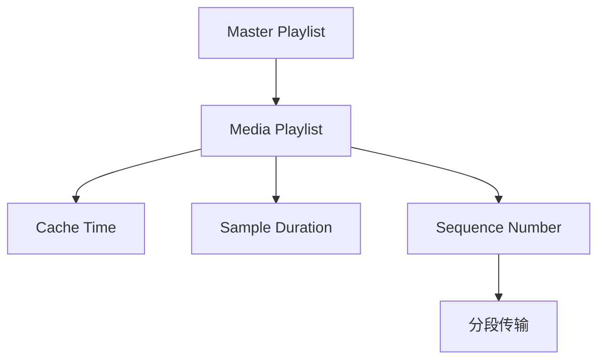

                 

# M3U8 格式：分段视频的索引文件

> 关键词：M3U8, HLS, RTMP, HLS分段, RTMP流, 实时流, 视频索引

## 1. 背景介绍

在视频流传输技术日益成熟的今天，视频内容的快速分发和观看成为可能。随着互联网带宽的提升和视频平台用户需求的增长，各种流媒体协议和格式应运而生。其中，M3U8格式作为HLS（HTTP Live Streaming）协议的核心，成为了流媒体领域的重要技术。本文将详细探讨M3U8格式的结构和应用，以帮助开发者更好地理解和使用M3U8文件进行分段视频的索引和流传输。

### 1.1 问题由来

流媒体技术的发展，使得大容量、高质量的视频内容能够通过互联网进行实时传输。然而，由于网络环境的不稳定性，单一大文件传输容易出现卡顿、中断等问题。为了提高视频流传输的稳定性和流畅性，分段传输成为了一种行之有效的方式。

分段传输通过将大视频文件划分为多个小片段，每个片段独立传输，可以在网络延迟或带宽不足时，灵活调整传输策略，保证视频流的连续播放。这种技术在视频直播、点播、广告播放等多个场景中得到广泛应用。

### 1.2 问题核心关键点

M3U8格式是实现分段视频流传输的核心。M3U8文件是一个纯文本文件，记录了所有分段视频的路径和元信息。它包含每个分段的视频路径、起始时间、持续时间等关键信息，从而实现视频流的无缝拼接和播放。

具体来说，M3U8文件包括以下几个关键部分：

- **Master Playlist**：包含所有分段视频的索引信息。
- **Media Playlist**：包含单个分段视频的信息。
- **Cache Time**：控制客户端缓存视频片段的时间。
- **Sample Duration**：每个分段视频片段的持续时间。
- **Sequence Number**：分段视频的顺序号，用于保证视频的连续性。

这些信息共同构成了M3U8文件的核心内容，保证了视频流的稳定传输和播放。

### 1.3 问题研究意义

M3U8格式作为流媒体传输的重要组成部分，其设计和实现对于保证视频流的高效、稳定传输至关重要。研究M3U8格式，不仅可以深入理解流媒体协议的工作机制，还能在实际开发中更好地应用M3U8技术，优化视频流传输的性能和用户体验。

## 2. 核心概念与联系

### 2.1 核心概念概述

为了更好地理解M3U8格式，我们先介绍一些相关的重要概念：

- **HLS**：HTTP Live Streaming，即基于HTTP协议的视频流传输技术。通过将视频内容分段传输，利用CDN网络，实现视频流的可靠传输和缓存。
- **RTMP**：Real-Time Messaging Protocol，是Adobe公司推出的一种流媒体传输协议，常用于直播和实时音视频传输。
- **分段传输**：将大视频文件划分为多个小片段，每个片段独立传输，保证视频的连续性和流畅性。
- **视频索引**：记录视频分段路径和元信息的文本文件，M3U8格式就是常见的视频索引文件格式。

这些概念共同构成了流媒体传输的基础，而M3U8格式则是实现这些技术的重要手段。

### 2.2 核心概念原理和架构的 Mermaid 流程图



这张流程图展示了M3U8格式的主要组成部分及其关联关系。Master Playlist包含所有分段视频的索引信息，而Media Playlist则详细记录了每个分段的视频信息。通过这些信息，分段传输能够实现视频的连续播放和缓存控制。

## 3. 核心算法原理 & 具体操作步骤

### 3.1 算法原理概述

M3U8格式的本质是一个文本文件，记录了分段视频的路径和元信息。它通过指定每个分段视频的起始时间和持续时间，实现视频的连续播放和缓存。M3U8格式的文件结构清晰，易于理解和修改，是HLS协议的核心组成部分。

M3U8格式的文件由两部分组成：Master Playlist和Media Playlist。Master Playlist包含所有分段视频的索引信息，Media Playlist则详细记录了每个分段的视频信息。M3U8文件的每一行都包含一条元信息，格式如下：

```
#EXT-X-INF:1,1
file "/path/to/segment.mp4"
```

其中，`#EXT-X-INF`是M3U8文件的关键标记，后面的数字1表示这是一个单行的元信息。`file`是元素类型，后面的路径是分段视频的文件路径。

### 3.2 算法步骤详解

#### 3.2.1 创建Master Playlist

Master Playlist包含所有分段视频的索引信息，通常包含一个或多个Media Playlist。每个Media Playlist记录了一个分段视频的元信息，格式如下：

```
#EXT-X-INF:1,2
file "/path/to/segment.mp4"
```

其中，`#EXT-X-INF`标记后面的数字2表示这是一个包含多个元信息的块。`file`元素后面的路径是分段视频的文件路径。

#### 3.2.2 创建Media Playlist

Media Playlist详细记录了每个分段的视频信息，格式如下：

```
#EXTINF:30,/index.m3u8
```

其中，`#EXTINF`标记后面的数字30表示该分段视频的持续时间。`/index.m3u8`是下一段视频的路径。

#### 3.2.3 设置缓存时间和样本持续时间

为了优化视频流传输的性能，M3U8格式还包含了缓存时间和样本持续时间等关键元信息，格式如下：

```
#EXT-X-CACHE:3000
#EXT-X-DURATION:10
```

其中，`#EXT-X-CACHE`标记后面的数字3000表示缓存时间为3秒。`#EXT-X-DURATION`标记后面的数字10表示每个分段视频的持续时间。

### 3.3 算法优缺点

#### 3.3.1 优点

1. **简单高效**：M3U8格式的文件结构清晰，易于理解和修改，适合流媒体传输。
2. **灵活性强**：可以通过设置缓存时间和样本持续时间，优化视频流传输的性能。
3. **兼容性广**：M3U8格式支持多种流媒体协议，如HLS、RTMP等。

#### 3.3.2 缺点

1. **依赖服务器**：M3U8文件的创建和维护需要服务器端的支持，增加了服务器的负担。
2. **安全性问题**：由于M3U8文件包含了视频分段路径，容易被恶意篡改，影响视频流传输的稳定性和安全性。
3. **缓存控制有限**：M3U8格式只支持固定时间的缓存，无法根据实际情况进行动态调整。

### 3.4 算法应用领域

M3U8格式广泛应用于各种流媒体传输场景，包括：

- **视频直播**：将直播视频分段传输，利用CDN网络进行缓存，保证视频的流畅播放。
- **点播服务**：将点播视频分段传输，利用缓存技术优化用户观看体验。
- **广告播放**：将广告视频分段传输，控制广告播放的顺序和间隔，保证广告效果。

M3U8格式的广泛应用，使得流媒体技术在视频直播、点播、广告播放等多个领域得到了广泛应用，提升了视频流传输的稳定性和用户体验。

## 4. 数学模型和公式 & 详细讲解 & 举例说明

### 4.1 数学模型构建

M3U8格式虽然不是基于数学模型的文件格式，但其结构清晰，易于理解和修改。我们可以用简单的文本解析方法来读取和处理M3U8文件。

### 4.2 公式推导过程

M3U8格式的核心在于其文件结构和元信息。我们可以通过简单的文本解析方法，读取M3U8文件中的信息，并将其转换为对应的数据结构。以下是一个Python的示例代码：

```python
import urllib.request
import xml.etree.ElementTree as ET

def parse_m3u8(url):
    response = urllib.request.urlopen(url)
    data = response.read().decode('utf-8')
    tree = ET.ElementTree(ET.fromstring(data))
    root = tree.getroot()

    # 获取Master Playlist
    master_playlist = root.find(".//#EXT-X-INF:1,2")
    if master_playlist is None:
        raise Exception("Master Playlist not found in m3u8 file")

    # 解析Master Playlist中的Media Playlist
    media_playlists = []
    for playlist in master_playlist:
        file_path = playlist.find('file').text
        duration = int(playlist.find('duration').text)
        media_playlists.append({'file': file_path, 'duration': duration})

    # 解析Media Playlist中的信息
    for playlist in media_playlists:
        for item in playlist:
            if item.tag == '#EXT-X-INF':
                continue
            elif item.tag == '#EXT-X-CACHE':
                cache_time = int(item.text.split(':')[1])
            elif item.tag == '#EXT-X-DURATION':
                duration = int(item.text.split(':')[1])
            elif item.tag == '#EXTINF':
                media_time = int(item.text.split(':')[0])
                segment_path = playlist['file']
                yield segment_path, media_time, cache_time, duration

# 示例：读取M3U8文件
url = 'https://example.com/example.m3u8'
for segment_path, media_time, cache_time, duration in parse_m3u8(url):
    print(f"Segment: {segment_path}, Duration: {media_time}s, Cache Time: {cache_time}s, Play Duration: {duration}s")
```

### 4.3 案例分析与讲解

以一个简单的M3U8文件为例：

```
#EXT-X-INF:1,2
file "/sample.mp4"
#EXT-X-MEDIA-SEQUENCE:1
#EXT-X-TARGETDURATION:10
#EXT-X-INF:0,1
live true
#EXT-X-INF:1,2
file "/sample-00.mp4"
#EXT-X-MEDIA-SEQUENCE:2
#EXT-X-TARGETDURATION:10
#EXT-X-INF:0,1
live true
#EXT-X-INF:1,2
file "/sample-01.mp4"
#EXT-X-MEDIA-SEQUENCE:3
#EXT-X-TARGETDURATION:10
#EXT-X-INF:0,1
live true
```

通过上述Python代码，我们可以解析出M3U8文件中的Master Playlist和Media Playlist，以及每个分段视频的元信息，包括文件路径、持续时间、缓存时间等。

## 5. 项目实践：代码实例和详细解释说明

### 5.1 开发环境搭建

为了实践M3U8格式的开发，我们需要准备以下环境：

1. **Python**：安装Python 3.6或更高版本。
2. **urllib**：Python内置的HTTP请求库。
3. **xml.etree.ElementTree**：Python内置的XML解析库。
4. **Jupyter Notebook**：用于编写和运行Python代码的交互式环境。

### 5.2 源代码详细实现

以下是Python代码实现M3U8文件的解析和信息读取的示例：

```python
import urllib.request
import xml.etree.ElementTree as ET

def parse_m3u8(url):
    response = urllib.request.urlopen(url)
    data = response.read().decode('utf-8')
    tree = ET.ElementTree(ET.fromstring(data))
    root = tree.getroot()

    # 获取Master Playlist
    master_playlist = root.find(".//#EXT-X-INF:1,2")
    if master_playlist is None:
        raise Exception("Master Playlist not found in m3u8 file")

    # 解析Master Playlist中的Media Playlist
    media_playlists = []
    for playlist in master_playlist:
        file_path = playlist.find('file').text
        duration = int(playlist.find('duration').text)
        media_playlists.append({'file': file_path, 'duration': duration})

    # 解析Media Playlist中的信息
    for playlist in media_playlists:
        for item in playlist:
            if item.tag == '#EXT-X-INF':
                continue
            elif item.tag == '#EXT-X-CACHE':
                cache_time = int(item.text.split(':')[1])
            elif item.tag == '#EXT-X-DURATION':
                duration = int(item.text.split(':')[1])
            elif item.tag == '#EXTINF':
                media_time = int(item.text.split(':')[0])
                segment_path = playlist['file']
                yield segment_path, media_time, cache_time, duration

# 示例：读取M3U8文件
url = 'https://example.com/example.m3u8'
for segment_path, media_time, cache_time, duration in parse_m3u8(url):
    print(f"Segment: {segment_path}, Duration: {media_time}s, Cache Time: {cache_time}s, Play Duration: {duration}s")
```

### 5.3 代码解读与分析

通过上述代码，我们可以解析出M3U8文件中的Master Playlist和Media Playlist，以及每个分段视频的元信息，包括文件路径、持续时间、缓存时间等。这个示例代码简洁明了，易于理解和修改，可以帮助开发者快速掌握M3U8文件的解析方法。

## 6. 实际应用场景

### 6.1 视频直播

M3U8格式广泛应用于视频直播领域。通过将直播视频分段传输，利用CDN网络进行缓存，能够保证视频的流畅播放。服务器端根据M3U8文件中的元信息，动态生成和更新Master Playlist，实现视频流的实时传输。

### 6.2 点播服务

点播服务通常需要缓存大量的视频内容，以应对用户的高并发访问。M3U8格式通过设置缓存时间和样本持续时间，优化视频流传输的性能，保证用户的观看体验。

### 6.3 广告播放

广告播放要求广告视频按照特定的顺序和间隔播放，M3U8格式通过设置Media Playlist的顺序号，实现广告视频的连续播放和间隔控制，保证广告效果。

### 6.4 未来应用展望

随着流媒体技术的发展，M3U8格式将得到更广泛的应用。未来，M3U8格式可能进一步优化，支持更多的元信息，提供更高的视频流传输性能和稳定性。

## 7. 工具和资源推荐

### 7.1 学习资源推荐

为了帮助开发者更好地理解和应用M3U8格式，以下是一些推荐的学习资源：

1. **YouTube官方文档**：YouTube的M3U8文档提供了详细的M3U8格式解析方法，帮助开发者深入理解M3U8格式。
2. **HLS协议文档**：IETF的HLS协议文档，提供了HLS协议的详细规范，包括M3U8格式的应用。
3. **Nginx HLS Stream**：Nginx的HLS Stream模块，提供了HLS协议的服务器实现，帮助开发者实践M3U8格式的开发。

### 7.2 开发工具推荐

以下是一些常用的开发工具，可用于M3U8格式的开发：

1. **Apache HTTP Server**：开源的Web服务器，支持M3U8文件的解析和生成。
2. **Nginx**：高性能的Web服务器，支持HLS协议和M3U8格式的流媒体传输。
3. **FFmpeg**：开源的流媒体工具，支持M3U8格式的转换和解析。

### 7.3 相关论文推荐

以下是一些与M3U8格式相关的经典论文，推荐阅读：

1. **HTTP Live Streaming (HLS)**：IETF关于HLS协议的标准文档。
2. **Real-Time Messaging Protocol (RTMP)**：Adobe公司关于RTMP协议的标准文档。
3. **M3U8 format**：IETF关于M3U8格式的规范文档。

## 8. 总结：未来发展趋势与挑战

### 8.1 研究成果总结

M3U8格式作为流媒体传输的核心组成部分，已经在视频直播、点播、广告播放等多个领域得到了广泛应用。其简单高效、灵活性强的特点，使得M3U8格式成为流媒体技术的重要标准之一。

### 8.2 未来发展趋势

未来，M3U8格式将进一步优化，支持更多的元信息，提供更高的视频流传输性能和稳定性。同时，随着流媒体技术的发展，M3U8格式的应用场景将进一步拓展，如虚拟现实、增强现实等。

### 8.3 面临的挑战

尽管M3U8格式在流媒体传输中已经得到广泛应用，但仍面临一些挑战：

1. **服务器负载**：M3U8文件的生成和维护需要服务器端的支持，增加了服务器的负担。
2. **安全问题**：M3U8文件包含了视频分段路径，容易被恶意篡改，影响视频流传输的稳定性和安全性。
3. **缓存控制**：M3U8格式只支持固定时间的缓存，无法根据实际情况进行动态调整。

### 8.4 研究展望

未来，M3U8格式的研究方向包括：

1. **优化缓存控制**：研究如何根据网络环境和用户需求，动态调整缓存时间和样本持续时间，提升视频流传输的性能。
2. **增强安全性**：研究如何防止M3U8文件的恶意篡改，保证视频流传输的安全性。
3. **扩展应用场景**：研究M3U8格式在虚拟现实、增强现实等新兴技术中的应用。

## 9. 附录：常见问题与解答

**Q1：M3U8格式如何优化缓存控制？**

A: M3U8格式的缓存控制可以通过调整#EXT-X-CACHE和#EXT-X-DURATION参数来实现。通过动态调整这两个参数，可以根据网络环境和用户需求，优化视频流传输的性能。

**Q2：如何防止M3U8文件的恶意篡改？**

A: 为了防止M3U8文件的恶意篡改，可以使用数字签名和加密技术，确保M3U8文件的完整性和安全性。同时，可以在服务器端对M3U8文件进行校验，防止非法修改。

**Q3：M3U8格式在虚拟现实和增强现实中的应用前景如何？**

A: M3U8格式在虚拟现实和增强现实中有着广阔的应用前景。通过将虚拟现实和增强现实视频分段传输，利用缓存技术优化用户体验，提升视频的流畅性和稳定性。

---

作者：禅与计算机程序设计艺术 / Zen and the Art of Computer Programming

