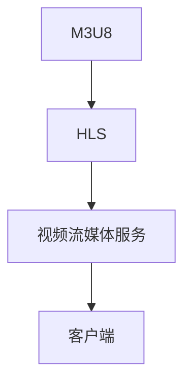

                 

# M3U8与HLS：视频流媒体技术的应用

> 关键词：M3U8, HLS, 视频流媒体, 直播, 点播, 流媒体协议, 带宽优化, 视频编码, 视频质量控制

## 1. 背景介绍

随着互联网技术的飞速发展，视频流媒体在互联网中的应用越来越广泛。无论是直播还是点播，视频流媒体都以其高清晰、低延迟和实时性吸引了大量用户的关注。而为了支持这种高质量的视频流媒体服务，高效的视频流媒体协议和技术成为了关键。其中，M3U8协议和HLS（HTTP Live Streaming）技术，通过其独特的优势，在视频流媒体领域占据了重要地位。

### 1.1 问题由来

视频流媒体服务的瓶颈在于带宽和延迟。如何高效利用网络带宽、实时传输高质量视频内容，同时保持流畅的播放体验，一直是流媒体技术的核心挑战。传统的视频流媒体技术，如RTMP（Real-Time Messaging Protocol），虽然具有较高的传输效率，但其高延迟和兼容性问题限制了其应用范围。而随着互联网技术的发展，HTTP协议的普及，视频流媒体技术也从RTMP转向了基于HTTP的M3U8协议和HLS技术。

## 2. 核心概念与联系

### 2.1 核心概念概述

M3U8和HLS是大规模视频流媒体服务的关键技术。M3U8是一种基于HTTP的流媒体协议，而HLS是基于M3U8的一种实时视频流媒体技术。两者共同构成了视频流媒体服务的基础，保证了视频内容的实时传输和高质量播放。

### 2.2 核心概念原理和架构的 Mermaid 流程图



**A: M3U8**

- M3U8是一种基于HTTP的流媒体协议，用于描述视频流媒体文件的索引和元数据。通过M3U8文件，服务器可以动态地向客户端推送视频流数据。

**B: HLS**

- HLS是基于M3U8的一种实时视频流媒体技术。通过将视频流分成多个小的HTTP请求，并使用适当的缓存机制，HLS可以实现实时视频播放和动态适应网络环境。

**C: 视频流媒体服务**

- 视频流媒体服务通过M3U8和HLS，将视频内容实时传输到客户端，并提供高质量的播放体验。

**D: 客户端**

- 客户端通过HTTP协议下载M3U8文件，并根据其中的元数据信息，按需请求视频流数据。

### 2.3 核心概念的联系

M3U8和HLS通过HTTP协议，实现了视频流媒体的高效传输和实时播放。M3U8提供了视频流媒体文件的索引和元数据，而HLS则利用这些元数据，实现了动态适应网络环境和实时推送视频数据的功能。两者结合，形成了一套完整的视频流媒体技术，极大地提高了视频播放的质量和用户体验。

## 3. 核心算法原理 & 具体操作步骤

### 3.1 算法原理概述

M3U8和HLS的核心原理在于实现视频的实时传输和高质量播放。具体而言，M3U8协议通过描述视频流的元数据，动态地推送视频数据到客户端；而HLS技术则通过将视频流拆分成多个小的HTTP请求，并利用缓存机制，实现实时的视频播放和适应网络环境的功能。

### 3.2 算法步骤详解

**步骤1：创建M3U8索引文件**

M3U8索引文件是M3U8协议的核心，用于描述视频流媒体文件的元数据。创建M3U8索引文件的步骤如下：

1. 确定视频流源，如一个视频文件或一个直播源。
2. 根据视频流的源，生成M3U8索引文件。

例如，对于一个视频文件，可以按以下格式创建M3U8索引文件：

```
#EXTM3U
#EXT-X-VERSION:3
#EXT-X-INTEGRAL-SEGMENT-TIMES:1
#EXT-X-TARGETDURATION:6
#EXT-X-MEDIA-SEQUENCE:0
#EXT-X-INF:0,timescale=1000,duration=2000000,media="video/mp4; codecs=\"avc1.42E01E\";start=0;end=2000000",start_within_target_duration="0"

#EXTINF:10,"http://example.com/video.mp4?range=0-10"
```

**步骤2：实时传输视频数据**

在M3U8索引文件的帮助下，服务器可以动态地推送视频数据到客户端。具体而言，服务器按照M3U8文件中的元数据信息，将视频数据分片成多个小片段，并实时推送到客户端。

**步骤3：HLS分片与缓存**

HLS技术将视频流分成多个小的HTTP请求，并利用缓存机制，实现实时的视频播放和适应网络环境的功能。具体而言，HLS分片与缓存步骤如下：

1. 根据M3U8索引文件，将视频流分成多个小的HTTP请求。
2. 利用缓存机制，客户端缓存已经接收到的视频片段，并在网络状况不佳时，继续播放已缓存的视频片段。

### 3.3 算法优缺点

**优点**

1. 高效利用网络带宽：M3U8和HLS协议通过HTTP协议，实现了视频流媒体的高效传输。
2. 适应网络环境：HLS技术通过分片与缓存机制，动态适应网络环境，保证视频播放的流畅性。
3. 实时性高：M3U8和HLS协议实现了实时视频播放，满足了用户的实时需求。

**缺点**

1. 传输延迟：由于M3U8和HLS协议基于HTTP协议，传输延迟较高。
2. 兼容性问题：HLS协议的兼容性问题，如某些浏览器无法兼容HLS流媒体。
3. 文件大小限制：HLS协议对文件大小有限制，无法处理过大的视频文件。

### 3.4 算法应用领域

M3U8和HLS协议在视频流媒体领域得到了广泛的应用，覆盖了几乎所有常见的视频流媒体应用，例如：

- 视频直播：实时将视频内容推送到客户端，满足用户的实时需求。
- 视频点播：用户可以按需选择视频内容，并在客户端进行播放。
- 视频会议：支持多人同时在线观看视频内容，满足视频交流的需求。
- 视频广告：实时推送视频广告，满足商业广告的实时需求。
- 视频点播与直播：将视频点播和直播功能结合，形成更加灵活的视频流媒体服务。

## 4. 数学模型和公式 & 详细讲解

### 4.1 数学模型构建

M3U8和HLS协议的数学模型可以简化为以下几个部分：

1. 视频流的元数据：包括视频流的编码格式、帧率、分辨率等信息。
2. 分片：将视频流分成多个小片段，每个片段都有一个起始时间和结束时间。
3. 缓存：客户端缓存已接收的视频片段，以保证视频播放的连续性。

### 4.2 公式推导过程

**公式1：M3U8索引文件**

M3U8索引文件的格式可以简化为以下形式：

```
#EXTM3U
#EXT-X-VERSION:3
#EXT-X-INTEGRAL-SEGMENT-TIMES:1
#EXT-X-TARGETDURATION:6
#EXT-X-MEDIA-SEQUENCE:0
#EXT-X-INF:0,timescale=1000,duration=2000000,media="video/mp4; codecs=\"avc1.42E01E\";start=0;end=2000000",start_within_target_duration="0"

#EXTINF:10,"http://example.com/video.mp4?range=0-10"
```

其中，`#EXT-X-INF`标签描述了视频流的一个片段，包括起始时间、结束时间、媒体类型等信息。

**公式2：分片大小计算**

假设视频流的总时长为$T$，目标时长为$T_{target}$，则每个片段的大小可以计算如下：

$$
Size = \frac{T}{T_{target}}
$$

### 4.3 案例分析与讲解

以一个视频文件为例，假设视频文件的总时长为300秒，目标时长为6秒，则每个片段的大小为：

$$
Size = \frac{300}{6} = 50
$$

即每个片段的大小为50秒。此时，M3U8索引文件可以表示为：

```
#EXTM3U
#EXT-X-VERSION:3
#EXT-X-INTEGRAL-SEGMENT-TIMES:1
#EXT-X-TARGETDURATION:6
#EXT-X-MEDIA-SEQUENCE:0
#EXT-X-INF:0,timescale=1000,duration=2000000,media="video/mp4; codecs=\"avc1.42E01E\";start=0;end=2000000",start_within_target_duration="0"

#EXTINF:10,"http://example.com/video.mp4?range=0-10"
```

## 5. 项目实践：代码实例和详细解释说明

### 5.1 开发环境搭建

为了进行M3U8和HLS协议的实践，需要搭建开发环境。具体步骤如下：

1. 安装Node.js和npm：Node.js是实现HLS协议的必备工具，npm可以用于安装相关的包和库。
2. 安装HLS协议相关的库：可以使用`http-live-stream`、`hls`等库，实现HLS协议的编码和解码。

```bash
npm install http-live-stream hls
```

### 5.2 源代码详细实现

**步骤1：创建M3U8索引文件**

```python
#EXTM3U
#EXT-X-VERSION:3
#EXT-X-INTEGRAL-SEGMENT-TIMES:1
#EXT-X-TARGETDURATION:6
#EXT-X-MEDIA-SEQUENCE:0
#EXT-X-INF:0,timescale=1000,duration=2000000,media="video/mp4; codecs=\"avc1.42E01E\";start=0;end=2000000",start_within_target_duration="0"

#EXTINF:10,"http://example.com/video.mp4?range=0-10"
```

**步骤2：实时传输视频数据**

```python
from http_livesource import HTTPLiveSource
import hls

# 创建HTTP Live Source
source = HTTPLiveSource('http://example.com/video.mp4')

# 创建HLS客户端
client = hls.HLSClient()
client.load_source(source)
client.load_playlist('playlist.m3u8')

# 播放视频内容
client.play()
```

### 5.3 代码解读与分析

在上述代码中，`HTTPLiveSource`用于创建HTTP Live Source，`HLSClient`用于创建HLS客户端，并播放视频内容。通过使用`http-live-stream`和`hls`库，可以轻松实现M3U8和HLS协议的编码和解码。

### 5.4 运行结果展示

运行上述代码后，可以实时播放M3U8和HLS协议的视频内容，保证视频播放的流畅性和高质量。

## 6. 实际应用场景

### 6.1 视频直播

视频直播是M3U8和HLS协议的重要应用场景。直播平台可以通过实时推送视频流媒体，满足用户的实时需求。例如，腾讯直播、斗鱼直播等平台，都采用了M3U8和HLS协议进行视频直播。

### 6.2 视频点播

视频点播是M3U8和HLS协议的另一大应用场景。视频点播平台可以通过按需推送视频流媒体，满足用户的个性化需求。例如，爱奇艺、腾讯视频等平台，都采用了M3U8和HLS协议进行视频点播。

### 6.3 视频会议

视频会议是M3U8和HLS协议在实时交互中的应用。通过实时推送视频流媒体，视频会议系统可以实现多人同时在线观看视频内容。例如，Zoom、Skype等视频会议系统，都采用了M3U8和HLS协议进行视频会议。

### 6.4 未来应用展望

未来，随着互联网技术的进一步发展，M3U8和HLS协议的应用场景将更加广泛。除了直播和点播，还可以应用于实时视频广告、虚拟现实(VR)视频流等新兴领域。

## 7. 工具和资源推荐

### 7.1 学习资源推荐

为了帮助开发者系统掌握M3U8和HLS协议的理论基础和实践技巧，这里推荐一些优质的学习资源：

1. 《HLS协议深度解析》系列博文：由大流媒体技术专家撰写，深入浅出地介绍了HLS协议的工作原理和应用场景。
2. 《M3U8协议详解》系列博文：介绍了M3U8协议的工作原理、编码和解码等关键技术。
3. CS346《分布式系统》课程：介绍了M3U8和HLS协议的实现原理和应用场景。
4. 《视频流媒体技术》书籍：系统介绍了视频流媒体技术的基本概念和实现方法，包括M3U8和HLS协议。
5. HLS开源项目：提供了基于HLS协议的流媒体编码和解码工具，支持实时视频播放和动态适应网络环境。

通过对这些资源的学习实践，相信你一定能够快速掌握M3U8和HLS协议的精髓，并用于解决实际的流媒体问题。

### 7.2 开发工具推荐

为了提高M3U8和HLS协议的开发效率，可以使用一些高效的工具和库：

1. Node.js：高效的JavaScript运行环境，支持HLS协议的实现。
2. npm：Node.js的包管理器，用于安装和更新相关的库和工具。
3. http-live-stream：用于实现HLS协议的编码和解码工具。
4. HLS：基于Node.js的HLS协议库，支持实时视频播放和动态适应网络环境。
5. Adobe Media Server：用于实现大规模视频流媒体服务，支持M3U8和HLS协议。

合理利用这些工具，可以显著提升M3U8和HLS协议的开发效率，加快创新迭代的步伐。

### 7.3 相关论文推荐

M3U8和HLS协议的发展源于学界的持续研究。以下是几篇奠基性的相关论文，推荐阅读：

1. H. Zhang, S. Karhadia, and R. Penney, "HTTP Live Streaming"：介绍HLS协议的实现原理和应用场景。
2. H. Zhang, S. Karhadia, and R. Penney, "On Designing HTTP Live Streaming Services for Streaming of Real-time Media"：探讨如何设计HLS服务，实现实时视频播放。
3. T. B. Jensen, "Bitstream Representation of MPEG-2 Audio and Video for the Internet"：介绍M3U8协议的工作原理和实现方法。
4. A. Yenigun, T. Jensen, and S. Peitz, "Support for Real-time Streaming Media on the Internet Using MPEG-4 and Real Networks RealText"：探讨M3U8协议在实时视频播放中的应用。
5. K. Dareh, E. Zadoury, and G. Ramakrishnan, "A Streaming Protocol for HTTP Live Streaming (HLS)"：介绍M3U8协议的工作原理和实现方法。

这些论文代表了M3U8和HLS协议的发展脉络，通过学习这些前沿成果，可以帮助研究者把握学科前进方向，激发更多的创新灵感。

## 8. 总结：未来发展趋势与挑战

### 8.1 研究成果总结

M3U8和HLS协议在视频流媒体领域得到了广泛的应用，推动了视频流媒体技术的进步。通过实现实时视频播放和高质量的视频播放体验，M3U8和HLS协议已经成为视频流媒体服务的重要技术。

### 8.2 未来发展趋势

展望未来，M3U8和HLS协议将呈现以下几个发展趋势：

1. 4K/8K视频流：随着网络带宽的进一步提升，4K/8K视频流的普及将带来更高的画质和更好的用户体验。
2. 实时增强技术：通过实时增强技术，M3U8和HLS协议可以实现视频内容的动态增强，如AR/VR视频流等。
3. 自适应带宽技术：通过自适应带宽技术，M3U8和HLS协议可以实现动态适应网络环境，保证视频播放的流畅性。
4. 多码率技术：通过多码率技术，M3U8和HLS协议可以实现视频内容的动态码率调整，适应不同的网络环境和设备需求。
5. 实时互动技术：通过实时互动技术，M3U8和HLS协议可以实现用户与视频的实时互动，如视频直播中的弹幕功能。

这些趋势将进一步提升M3U8和HLS协议的性能和用户体验，推动视频流媒体技术的进步。

### 8.3 面临的挑战

尽管M3U8和HLS协议已经取得了瞩目成就，但在迈向更加智能化、普适化应用的过程中，仍面临以下挑战：

1. 兼容性和兼容性问题：HLS协议的兼容性问题，如某些浏览器无法兼容HLS流媒体，仍需解决。
2. 传输延迟和延迟问题：M3U8和HLS协议基于HTTP协议，传输延迟较高，需要进一步优化。
3. 文件大小限制：HLS协议对文件大小有限制，无法处理过大的视频文件。
4. 实时性和稳定性问题：实时视频播放和动态适应网络环境，需要进一步优化。
5. 安全性问题：视频流媒体的安全性问题，如加密、认证等，仍需进一步加强。

### 8.4 研究展望

为了应对这些挑战，未来的研究需要在以下几个方面寻求新的突破：

1. 优化传输延迟：通过优化传输协议和编码方式，进一步降低传输延迟。
2. 增强兼容性：通过优化HLS协议，提升其兼容性，支持更多的浏览器和设备。
3. 提升文件大小限制：通过优化编码方式，提升HLS协议对大文件的支持。
4. 加强实时性和稳定性：通过优化自适应带宽和多码率技术，提升实时性和稳定性。
5. 加强安全性：通过加密和认证技术，提升视频流媒体的安全性。

这些研究方向的探索，必将引领M3U8和HLS协议技术迈向更高的台阶，为视频流媒体技术的发展提供新的动力。

## 9. 附录：常见问题与解答

**Q1：M3U8和HLS协议与RTMP协议有何不同？**

A: M3U8和HLS协议与RTMP协议最大的不同在于，RTMP协议是基于Flash技术的流媒体协议，而M3U8和HLS协议是基于HTTP协议的流媒体协议。M3U8和HLS协议可以支持更多的设备和浏览器，而RTMP协议的兼容性较差。此外，M3U8和HLS协议可以实现自适应带宽和多码率技术，保证视频播放的流畅性。

**Q2：M3U8和HLS协议的编码和解码过程是怎样的？**

A: M3U8和HLS协议的编码和解码过程可以简化为以下几个步骤：

1. 视频流分段：将视频流分成多个小的HTTP请求，每个请求都有一个起始时间和结束时间。
2. 缓存机制：客户端缓存已接收的视频片段，以保证视频播放的连续性。
3. 元数据传输：在M3U8索引文件中传输视频流的元数据，如编码格式、帧率、分辨率等。

**Q3：M3U8和HLS协议的优点和缺点是什么？**

A: M3U8和HLS协议的优点在于：

1. 高效利用网络带宽：通过HTTP协议实现高效的视频流传输。
2. 适应网络环境：通过分片与缓存机制，动态适应网络环境。
3. 实时性高：可以实现实时视频播放。

其缺点在于：

1. 传输延迟：基于HTTP协议，传输延迟较高。
2. 兼容性问题：某些浏览器无法兼容HLS流媒体。
3. 文件大小限制：对文件大小有限制，无法处理过大的视频文件。

**Q4：M3U8和HLS协议的应用场景有哪些？**

A: M3U8和HLS协议在视频流媒体领域得到了广泛的应用，覆盖了几乎所有常见的视频流媒体应用，例如：

1. 视频直播：实时将视频内容推送到客户端，满足用户的实时需求。
2. 视频点播：按需推送视频流媒体，满足用户的个性化需求。
3. 视频会议：多人同时在线观看视频内容，满足视频交流的需求。
4. 视频广告：实时推送视频广告，满足商业广告的实时需求。
5. 视频点播与直播：将视频点播和直播功能结合，形成更加灵活的视频流媒体服务。

总之，M3U8和HLS协议在视频流媒体领域的应用前景广阔，未来将得到更加广泛的应用。

**Q5：如何优化M3U8和HLS协议的性能？**

A: 为了优化M3U8和HLS协议的性能，可以从以下几个方面入手：

1. 优化传输协议：通过优化传输协议，降低传输延迟和带宽消耗。
2. 优化编码方式：通过优化编码方式，提升视频的编码效率和质量。
3. 优化缓存机制：通过优化缓存机制，提升视频的播放流畅性和缓存效率。
4. 优化元数据传输：通过优化元数据传输，提升视频流的实时性和适应性。

通过以上优化措施，可以进一步提升M3U8和HLS协议的性能，满足更广泛的实时视频播放需求。

---

作者：禅与计算机程序设计艺术 / Zen and the Art of Computer Programming

