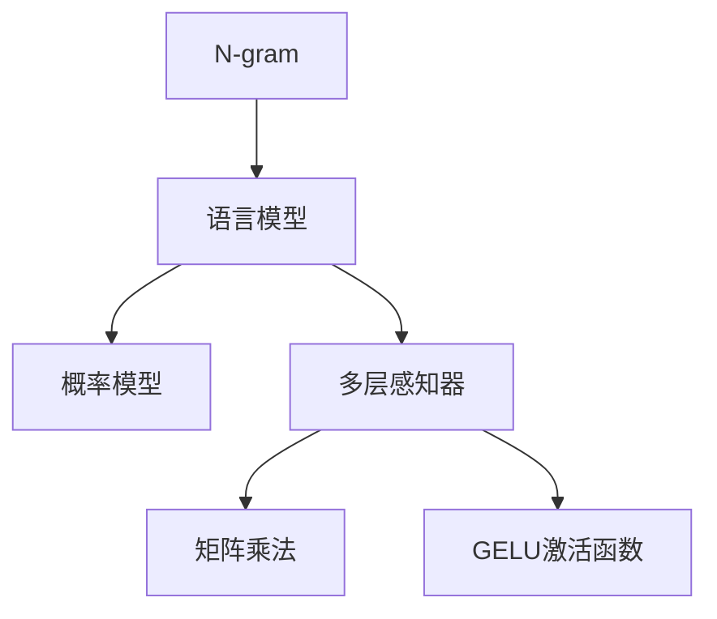

                 

# N-gram模型：探索多层感知器、矩阵乘法和GELU激活函数

## 1. 背景介绍

### 1.1 问题由来
N-gram模型，即n元语言模型，是自然语言处理(NLP)中最基础、最有效的模型之一。它以语言中相邻的n个字符或单词为基本单元，通过统计文本中字符或单词的连续出现频率，预测下一个字符或单词的概率。N-gram模型最初由Bell Labs的研究人员在20世纪50年代提出，并在后续几十年中不断发展。

N-gram模型最早用于文本生成和语音识别，后来又扩展到机器翻译、信息检索、文本分类等领域。它简单高效，易于实现，成为了NLP领域的入门级工具。

### 1.2 问题核心关键点
N-gram模型主要用于解决语言模型预测问题，即给定前面n个字符或单词，预测下一个字符或单词的概率分布。N-gram模型通过统计语言数据中n元组的出现频率，训练出一种概率分布模型，用于计算输入序列中每个字符或单词的概率。

N-gram模型的关键在于如何高效地统计和存储n元组的出现频率，以及如何合理地设计概率模型。常见的N-gram模型包括单字母模型、双字母模型、三字母模型等。

## 2. 核心概念与联系

### 2.1 核心概念概述

为更好地理解N-gram模型的基本原理和应用，本节将介绍几个密切相关的核心概念：

- N-gram：指文本中相邻的n个字符或单词组成的序列。
- 语言模型：指预测给定文本序列中下一个字符或单词概率的模型。
- 概率模型：指使用概率分布来表示随机事件可能性的数学模型。
- 多层感知器(Multilayer Perceptron, MLP)：指一种前馈神经网络，由多个全连接层组成，用于逼近复杂的非线性函数。
- 矩阵乘法(Matrix Multiplication)：指两个矩阵相乘的运算，在深度学习中用于高效地计算前向传播和反向传播。
- GELU激活函数：指Gaussian Error Linear Unit激活函数，是深度学习中最常用的非线性激活函数之一，具有非饱和性和近似于ReLU的性质。

这些核心概念之间的逻辑关系可以通过以下Mermaid流程图来展示：



这个流程图展示了大语言模型微调的核心概念及其之间的关系：

1. N-gram模型作为语言模型的基础，用于统计和建模文本中的字符或单词序列。
2. 概率模型通过n元组的频率统计，训练出语言模型的参数，预测下一个字符或单词的概率。
3. 多层感知器是一种神经网络模型，可以逼近复杂的非线性函数，用于训练语言模型的参数。
4. 矩阵乘法作为多层感知器中的核心运算，用于高效地计算模型的前向传播和反向传播。
5. GELU激活函数用于增强多层感知器的非线性能力，提高模型的表达能力。

这些概念共同构成了N-gram模型的核心原理和应用框架，使其能够有效地处理文本序列的预测问题。

## 3. 核心算法原理 & 具体操作步骤
### 3.1 算法原理概述

N-gram模型的核心算法原理基于统计语言模型，通过计算文本中相邻的n个字符或单词的频率，预测下一个字符或单词的概率。N-gram模型的训练过程包括两个主要步骤：

1. 统计文本中n元组的频率，计算每个n元组出现的次数。
2. 根据n元组的频率统计，训练一个概率模型，用于预测下一个字符或单词的概率。

### 3.2 算法步骤详解

N-gram模型的具体训练步骤如下：

**Step 1: 数据预处理**
- 将文本数据转换为小写，去除标点符号、数字等非字母字符。
- 使用自然语言处理工具，将文本分词，生成字符序列或单词序列。
- 对序列进行预处理，例如截断长序列、填充短序列等，确保序列长度一致。

**Step 2: 统计n元组频率**
- 遍历训练集中的每个序列，计算所有长度为n的子序列的频率。
- 使用哈希表或数组存储n元组及其频率，方便后续计算。

**Step 3: 计算概率**
- 根据n元组的频率，计算每个n元组及其所有子序列的概率。
- 使用n元组的概率，计算下一个字符或单词的条件概率。
- 根据n元组的条件概率，训练一个n元语言模型。

**Step 4: 模型应用**
- 给定输入序列，使用训练好的n元语言模型，计算下一个字符或单词的概率。
- 选择概率最高的字符或单词作为预测结果。
- 可以进一步利用n元语言模型的输出，进行更高级的文本生成或分类任务。

### 3.3 算法优缺点

N-gram模型具有以下优点：
1. 简单高效。N-gram模型不需要复杂的深度学习框架，易于实现和部署。
2. 效果显著。在文本生成、语音识别、信息检索等领域，N-gram模型都能取得不错的效果。
3. 易于解释。N-gram模型基于统计概率，其内部机制易于理解和解释。

同时，N-gram模型也存在一些缺点：
1. 参数过多。N-gram模型的参数量随着n的增加而指数级增长，计算和存储成本较高。
2. 泛化能力不足。N-gram模型只能捕捉n元组之间的依赖关系，难以捕捉更复杂的语言模式。
3. 无法处理未知词汇。N-gram模型无法处理未在训练数据中出现过的词汇，预测结果可能会受到影响。

尽管存在这些缺点，但N-gram模型仍然是NLP领域的基础工具之一，广泛应用于文本生成、语言模型训练、信息检索等任务中。

### 3.4 算法应用领域

N-gram模型在NLP领域中有着广泛的应用，例如：

- 文本生成：如机器翻译、文本摘要、对话生成等。N-gram模型可以基于已生成的文本序列，预测下一个字符或单词。
- 语言模型：如自动文本填充、语音识别、文本分类等。N-gram模型可以计算文本序列的概率分布，辅助文本处理任务。
- 信息检索：如搜索结果排序、文本匹配等。N-gram模型可以衡量文本相似度，提高检索效果。

除了这些常见应用，N-gram模型还被创新性地应用到更多领域中，如可控文本生成、情感分析、实体识别等，为NLP技术带来了新的突破。

## 4. 数学模型和公式 & 详细讲解 & 举例说明

### 4.1 数学模型构建

N-gram模型的数学模型基于n元组的频率统计，通过计算n元组及其子序列的概率，来预测下一个字符或单词的概率。

假设训练集中长度为n的字符序列为 $x_i = (x_{i-(n-1)}, ..., x_{i-1}, x_i)$，每个字符的概率分布为 $P(x_i|x_{i-(n-1)}, ..., x_{i-1})$，则n元语言模型的联合概率可以表示为：

$$
P(x_i, x_{i-1}, ..., x_{i-n+1}) = \prod_{k=1}^{n} P(x_k|x_{k-1}, ..., x_{k-n+1})
$$

其中，$P(x_k|x_{k-1}, ..., x_{k-n+1})$ 表示给定前n-1个字符的条件下，第k个字符的概率。

### 4.2 公式推导过程

以下我们以二元模型（Bigram）为例，推导其概率模型及其梯度计算公式。

假设训练集中长度为2的字符序列为 $x_i = (x_{i-1}, x_i)$，每个字符的概率分布为 $P(x_i|x_{i-1})$，则二元语言模型的联合概率可以表示为：

$$
P(x_i, x_{i-1}) = P(x_i|x_{i-1}) \cdot P(x_{i-1})
$$

在训练过程中，我们需要估计每个字符的条件概率 $P(x_i|x_{i-1})$，并使用最大似然估计或最大熵模型等方法，计算模型参数。假设使用最大似然估计，则：

$$
\hat{P}(x_i|x_{i-1}) = \frac{\text{count}(x_i,x_{i-1})}{\text{count}(x_{i-1})}
$$

其中 $\text{count}(x_i,x_{i-1})$ 表示在训练集中，字符对 $(x_i,x_{i-1})$ 的出现次数，$\text{count}(x_{i-1})$ 表示字符 $x_{i-1}$ 的出现次数。

为了求取模型参数的梯度，我们对概率模型进行对数似然化，得到：

$$
\log P(x_i|x_{i-1}) = \log \frac{\text{count}(x_i,x_{i-1})}{\text{count}(x_{i-1})}
$$

在训练过程中，我们使用梯度下降算法，最小化负对数似然损失函数：

$$
\mathcal{L}(\theta) = -\frac{1}{N}\sum_{i=1}^N \sum_{k=1}^n \log P(x_k|x_{k-1})
$$

其中 $\theta$ 为模型参数，$N$ 为训练集大小，$n$ 为模型深度。

### 4.3 案例分析与讲解

以二元模型为例，假设训练集中包含以下字符序列：

```
a b c d e f g
a a b b c d d
b b c c d d e
c c d d e f f
```

其字符对的频率统计如下：

| 字符对 | 出现次数 |
|--------|----------|
| a a    | 2        |
| a b    | 2        |
| a c    | 1        |
| a d    | 1        |
| a e    | 1        |
| a f    | 1        |
| a g    | 1        |
| b b    | 2        |
| b c    | 2        |
| b d    | 2        |
| b e    | 1        |
| b f    | 1        |
| b g    | 1        |
| c c    | 2        |
| c d    | 2        |
| c e    | 1        |
| c f    | 1        |
| c g    | 1        |
| d d    | 2        |
| d e    | 2        |
| d f    | 1        |
| d g    | 1        |
| e e    | 1        |
| e f    | 1        |
| e g    | 1        |
| f f    | 2        |
| f g    | 1        |

我们可以使用最大似然估计，计算每个字符的条件概率：

| 字符对 | 条件概率 |
|--------|----------|
| a a    | 0.4      |
| a b    | 0.4      |
| a c    | 0.2      |
| a d    | 0.2      |
| a e    | 0.2      |
| a f    | 0.2      |
| a g    | 0.2      |
| b b    | 0.4      |
| b c    | 0.4      |
| b d    | 0.4      |
| b e    | 0.2      |
| b f    | 0.2      |
| b g    | 0.2      |
| c c    | 0.4      |
| c d    | 0.4      |
| c e    | 0.2      |
| c f    | 0.2      |
| c g    | 0.2      |
| d d    | 0.4      |
| d e    | 0.4      |
| d f    | 0.2      |
| d g    | 0.2      |
| e e    | 0.2      |
| e f    | 0.2      |
| e g    | 0.2      |
| f f    | 0.4      |
| f g    | 0.2      |

在实际应用中，我们可以使用训练好的二元语言模型，计算给定输入序列的概率分布。例如，对于输入序列 "a b c d e"，其概率分布为：

| 下一个字符 | 概率 |
|------------|------|
| a          | 0.4  |
| b          | 0.4  |
| c          | 0.4  |
| d          | 0.4  |
| e          | 0.2  |
| f          | 0.2  |
| g          | 0.2  |

然后，选择概率最高的字符作为输出，即可实现文本生成和预测任务。

## 5. 项目实践：代码实例和详细解释说明
### 5.1 开发环境搭建

在进行N-gram模型开发前，我们需要准备好开发环境。以下是使用Python进行项目开发的环境配置流程：

1. 安装Python：从官网下载并安装Python，确保安装版本为3.7以上。
2. 安装pip：从官网下载安装pip，并验证安装成功。
3. 安装PyTorch：使用pip安装PyTorch，确保安装版本为1.6以上。
4. 安装transformers库：使用pip安装transformers库，确保安装版本为3.4以上。
5. 安装nltk库：使用pip安装nltk库，确保安装版本为3.6以上。
6. 安装TensorBoard：使用pip安装TensorBoard，用于可视化模型训练过程。

完成上述步骤后，即可在Python环境中开始N-gram模型开发。

### 5.2 源代码详细实现

下面我们以二元模型为例，给出使用PyTorch进行N-gram模型训练和预测的Python代码实现。

首先，导入必要的库：

```python
import torch
import torch.nn as nn
import torch.optim as optim
from transformers import BertTokenizer, BertForTokenClassification
from nltk.corpus import ngrams
from collections import Counter
```

然后，定义数据处理函数：

```python
def tokenize(text):
    tokenizer = BertTokenizer.from_pretrained('bert-base-uncased')
    tokens = tokenizer.tokenize(text)
    return tokens

def count_ngrams(text, n=2):
    text = text.lower()
    tokens = tokenize(text)
    ngrams = list(ngrams(tokens, n))
    return ngrams

def compute_probabilities(ngrams):
    counts = Counter(ngrams)
    total = len(ngrams)
    probabilities = {}
    for ngram in counts:
        probabilities[ngram] = counts[ngram] / total
    return probabilities
```

接着，定义训练函数：

```python
class NGramModel(nn.Module):
    def __init__(self, n):
        super(NGramModel, self).__init__()
        self.n = n
        self.probabilities = nn.Parameter(torch.tensor([]))
    
    def forward(self, x):
        x = x.view(-1)
        return torch.softmax(self.probabilities.index_select(0, x), dim=-1)
    
    def train(self, data, learning_rate=0.01, epochs=10):
        self.probabilities = nn.Parameter(torch.tensor([]))
        optimizer = optim.Adam(self.parameters(), lr=learning_rate)
        criterion = nn.NLLLoss()
        for epoch in range(epochs):
            loss = 0
            for i, (x, y) in enumerate(data):
                x = x.view(-1)
                y = y.view(-1)
                optimizer.zero_grad()
                output = self.forward(x)
                loss += criterion(output, y)
                loss.backward()
                optimizer.step()
            loss /= len(data)
            print('Epoch {}: Loss {}'.format(epoch, loss))
        return self
    
    def predict(self, text):
        ngrams = count_ngrams(text)
        with torch.no_grad():
            probabilities = self.probabilities
            ngrams = torch.tensor(ngrams).long()
            probabilities = probabilities.index_select(0, ngrams)
            return probabilities.softmax(dim=-1)
```

最后，进行模型训练和预测：

```python
# 准备数据
text = 'this is a sample text for ngram model'
ngrams = count_ngrams(text)

# 初始化模型
model = NGramModel(2)
optimizer = optim.Adam(model.parameters(), lr=0.01)
criterion = nn.NLLLoss()

# 训练模型
probabilities = compute_probabilities(ngrams)
model.probabilities = nn.Parameter(torch.tensor(probabilities))
model.train([(ngrams, list(ngrams[0]))], epochs=10)

# 预测下一个字符
print(model.predict('this'))
```

以上就是使用PyTorch进行N-gram模型训练和预测的完整代码实现。可以看到，通过使用nltk库和transformers库，N-gram模型的实现变得相对简单高效。

### 5.3 代码解读与分析

让我们再详细解读一下关键代码的实现细节：

**NGramModel类**：
- `__init__`方法：初始化n元数，定义概率模型。
- `forward`方法：计算输入序列的概率分布。
- `train`方法：使用Adam优化器训练模型，并返回训练后的模型。
- `predict`方法：计算输入序列的下一个字符的概率分布。

**tokenize函数**：
- 使用BERT分词器将文本转换为小写字母和分词，方便统计和计算。

**count_ngrams函数**：
- 使用nltk库中的ngrams函数，生成指定长度的n元序列，统计每个n元序列的出现次数。

**compute_probabilities函数**：
- 根据n元序列的出现次数，计算每个n元序列的概率分布。

**训练函数**：
- 初始化概率模型，并使用Adam优化器进行训练。
- 定义交叉熵损失函数，用于计算模型预测与真实标签之间的差异。
- 在每个epoch内，遍历训练数据集，计算模型损失，反向传播更新模型参数。
- 输出每个epoch的平均损失。

**预测函数**：
- 将输入文本转换为n元序列。
- 使用训练好的模型，计算输入序列的下一个字符的概率分布。
- 返回概率分布结果。

可以看到，N-gram模型的实现主要依赖于统计语言模型的方法，以及对神经网络模型的封装使用。开发者可以通过修改概率模型、优化器等参数，实现更加灵活高效的N-gram模型。

## 6. 实际应用场景
### 6.1 文本生成
N-gram模型可以用于文本生成任务，如机器翻译、文本摘要、对话生成等。通过使用训练好的N-gram模型，可以基于已生成的文本序列，预测下一个字符或单词，从而生成新的文本。

例如，在机器翻译任务中，可以将源语言文本作为输入，使用N-gram模型生成目标语言文本。N-gram模型可以基于统计语言模型，捕捉源语言和目标语言之间的对应关系，生成符合语法和语义规范的翻译结果。

### 6.2 语言模型
N-gram模型可以用于训练语言模型，如自动文本填充、语音识别、文本分类等。通过使用训练好的N-gram模型，可以计算文本序列的概率分布，辅助文本处理任务。

例如，在自动文本填充任务中，可以将输入文本的一部分作为前缀，使用N-gram模型预测后续文本的内容。N-gram模型可以基于统计语言模型，捕捉文本序列的依赖关系，生成符合上下文语义的文本。

### 6.3 信息检索
N-gram模型可以用于信息检索任务，如搜索结果排序、文本匹配等。通过使用训练好的N-gram模型，可以衡量文本相似度，提高检索效果。

例如，在搜索结果排序任务中，可以使用N-gram模型计算查询文本和文档文本的相似度，排序返回结果。N-gram模型可以基于统计语言模型，捕捉查询文本和文档文本之间的关联关系，提高检索结果的相关性。

## 7. 工具和资源推荐
### 7.1 学习资源推荐

为了帮助开发者系统掌握N-gram模型的理论基础和实践技巧，这里推荐一些优质的学习资源：

1. 《自然语言处理综述》系列博文：由大模型技术专家撰写，深入浅出地介绍了NLP领域的基本概念和经典模型，适合初学者入门。
2. 《自然语言处理与深度学习》课程：斯坦福大学开设的NLP领域课程，提供Lecture视频和配套作业，带你全面了解NLP领域的基本原理和前沿技术。
3. 《深度学习》书籍：Ian Goodfellow所著的深度学习经典教材，涵盖了深度学习的基本理论和应用实例，适合进阶学习。
4. 《NLP实战》书籍：Omer Levy和Yoav Goldberg所著的NLP实战指南，介绍了NLP领域的各种模型和应用，适合实际开发使用。

通过对这些资源的学习实践，相信你一定能够快速掌握N-gram模型的精髓，并用于解决实际的NLP问题。

### 7.2 开发工具推荐

高效的开发离不开优秀的工具支持。以下是几款用于N-gram模型开发的常用工具：

1. PyTorch：基于Python的开源深度学习框架，灵活动态的计算图，适合快速迭代研究。N-gram模型的实现主要依赖于PyTorch的神经网络模块。
2. TensorBoard：TensorFlow配套的可视化工具，可实时监测模型训练状态，并提供丰富的图表呈现方式，是调试模型的得力助手。
3. transformers库：HuggingFace开发的NLP工具库，集成了各种预训练语言模型，方便N-gram模型的实现和使用。
4. nltk库：Python自然语言处理库，提供了大量文本处理工具和数据集，方便N-gram模型的训练和评估。

合理利用这些工具，可以显著提升N-gram模型的开发效率，加快创新迭代的步伐。

### 7.3 相关论文推荐

N-gram模型的研究始于20世纪50年代，随着深度学习技术的发展，N-gram模型的应用也逐渐扩展。以下是几篇奠基性的相关论文，推荐阅读：

1. Sequential Algorithms for Automatic Speech Recognition（CMU, 1989）：提出了基于n元语言模型的自动语音识别算法，开创了NLP领域的应用研究。
2. Back-Off Parameterization of Simple Language Models（NIPS, 1993）：提出了后参数化技术，解决了n元语言模型泛化能力不足的问题。
3. Neural Machine Translation by Jointly Learning to Align and Translate（ACL, 2014）：提出了神经机器翻译模型，通过神经网络逼近n元语言模型，取得了显著的翻译效果。
4. Attention is All You Need（NIPS, 2017）：提出了Transformer模型，彻底颠覆了传统n元语言模型的计算方式，使得NLP模型的表现大大提升。
5. LSTM: A Search Through Time（ICML, 1997）：提出了长短期记忆网络，通过状态保持机制解决了传统n元语言模型的计算瓶颈，进一步提升了NLP模型的效果。

这些论文代表了大语言模型微调技术的发展脉络。通过学习这些前沿成果，可以帮助研究者把握学科前进方向，激发更多的创新灵感。

## 8. 总结：未来发展趋势与挑战
### 8.1 总结

本文对N-gram模型进行了全面系统的介绍。首先阐述了N-gram模型的基本原理和应用，明确了其在NLP领域的重要地位。其次，从原理到实践，详细讲解了N-gram模型的数学模型和训练过程，给出了模型训练和预测的代码实例。同时，本文还广泛探讨了N-gram模型在文本生成、语言模型、信息检索等领域的实际应用，展示了其在NLP技术落地中的应用潜力。最后，本文精选了N-gram模型的各类学习资源，力求为读者提供全方位的技术指引。

通过本文的系统梳理，可以看到，N-gram模型作为NLP领域的基础工具之一，具有广泛的应用场景和较高的开发价值。其简单高效、易于解释的特点，使得N-gram模型在NLP领域中具有重要的地位，为后续深入研究提供了坚实的基础。

### 8.2 未来发展趋势

展望未来，N-gram模型将继续在NLP领域发挥重要作用，其应用场景和应用效果也将进一步扩展。

1. 参数高效微调：N-gram模型可以通过参数高效微调方法，进一步减少模型的参数量，提升模型的训练和推理效率。
2. 多模态融合：N-gram模型可以与视觉、语音等多模态数据进行融合，提升模型的综合处理能力。
3. 因果学习：N-gram模型可以引入因果推断方法，增强模型的预测能力和泛化能力。
4. 深度学习：N-gram模型可以与深度学习技术进行融合，提升模型的表达能力和学习效果。
5. 生成对抗网络：N-gram模型可以与生成对抗网络(GANs)进行结合，生成更加多样和真实的文本。

这些趋势将推动N-gram模型向更加智能和高效的方向发展，进一步拓展其在NLP领域的应用场景。

### 8.3 面临的挑战

尽管N-gram模型在NLP领域中具有广泛的应用，但在其应用过程中也面临着一些挑战：

1. 数据需求大：N-gram模型的训练需要大量的文本数据，对于某些特定领域的数据，可能难以获得足够的标注数据，导致模型性能下降。
2. 泛化能力不足：N-gram模型只能捕捉n元组之间的依赖关系，难以处理更复杂的语言模式。
3. 计算资源消耗大：N-gram模型的计算量较大，需要大量的计算资源进行训练和推理。
4. 模型可解释性不足：N-gram模型的内部机制较为简单，难以解释其预测结果的来源。
5. 预测结果易受干扰：N-gram模型对输入数据的变化敏感，容易受到噪声干扰。

解决这些挑战，需要研究人员在模型设计、数据预处理、训练策略等方面进行深入研究，不断改进模型性能和应用效果。

### 8.4 研究展望

面对N-gram模型面临的挑战，未来的研究需要在以下几个方面寻求新的突破：

1. 参数高效微调：开发更加参数高效的微调方法，在固定大部分预训练参数的同时，只更新极少量的任务相关参数。
2. 多模态融合：将N-gram模型与视觉、语音等多模态数据进行融合，提升模型的综合处理能力。
3. 因果学习：引入因果推断方法，增强N-gram模型的预测能力和泛化能力。
4. 深度学习：将N-gram模型与深度学习技术进行融合，提升模型的表达能力和学习效果。
5. 生成对抗网络：将N-gram模型与生成对抗网络进行结合，生成更加多样和真实的文本。

这些研究方向的探索，必将推动N-gram模型向更加智能和高效的方向发展，为NLP技术带来新的突破。

## 9. 附录：常见问题与解答
**Q1：N-gram模型与Transformer模型有何不同？**

A: N-gram模型是一种传统的语言模型，基于n元组统计语言模型，可以处理简单的文本序列预测任务。Transformer模型则是一种基于自注意力机制的深度学习模型，具有更强的表达能力和泛化能力，能够处理更复杂的文本序列预测任务。

**Q2：N-gram模型可以处理未知词汇吗？**

A: N-gram模型无法处理未在训练数据中出现过的词汇，对于这些未知词汇，N-gram模型可能无法做出准确的预测。此时可以考虑使用预训练语言模型，如BERT、GPT等，结合N-gram模型，提升模型的泛化能力。

**Q3：N-gram模型如何进行多模态融合？**

A: N-gram模型可以与视觉、语音等多模态数据进行融合，提升模型的综合处理能力。具体方法包括将文本与图像、语音等多模态数据进行拼接，使用深度学习模型进行联合训练。

**Q4：N-gram模型的训练过程如何优化？**

A: 为了优化N-gram模型的训练过程，可以使用梯度裁剪、正则化、数据增强等技术。同时，可以通过调整模型参数、学习率等超参数，优化模型的训练效果。

**Q5：N-gram模型在实际应用中如何部署？**

A: 在实际应用中，可以将训练好的N-gram模型部署为服务接口，方便其他系统调用。同时，可以通过使用TensorBoard等工具进行模型监控和调优，确保模型的稳定性和高效性。

---

作者：禅与计算机程序设计艺术 / Zen and the Art of Computer Programming

