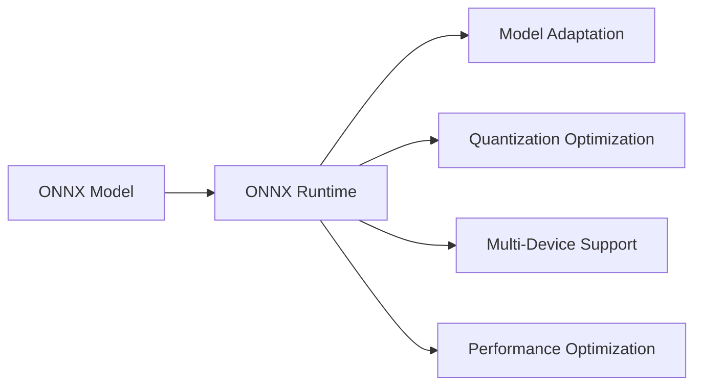

                 

# ONNX Runtime 跨平台部署策略：在不同设备上运行 AI 模型

> 关键词：ONNX Runtime, AI模型, 跨平台部署, 异构设备, 性能优化, 模型量化, 深度学习, 推理加速

## 1. 背景介绍

随着深度学习技术的不断成熟，越来越多的AI模型被广泛应用于各个领域，如图像识别、语音识别、自然语言处理等。然而，这些模型通常需要大量的计算资源和专门的硬件设备才能高效运行，这限制了它们在资源有限的嵌入式设备、移动设备等场景中的应用。为了解决这一问题，ONNX Runtime作为Open Neural Network eXchange（ONNX）的重要组成部分，提供了一套通用的推理框架，支持跨平台部署和优化AI模型。

本文将详细介绍ONNX Runtime的跨平台部署策略，包括模型适配、量化优化、多设备支持等关键技术。通过这些技术，用户可以在不同的设备上高效运行AI模型，最大化AI模型在各个场景中的应用潜力。

## 2. 核心概念与联系

### 2.1 核心概念概述

在深入探讨ONNX Runtime的跨平台部署策略之前，我们需要先理解一些关键概念：

- **ONNX（Open Neural Network eXchange）**：一个用于跨不同框架和硬件设备共享模型表示的标准，旨在降低模型部署和移植的难度。
- **ONNX Runtime**：一个通用的AI推理框架，支持在多种硬件上高效运行ONNX模型，包括CPU、GPU、FPGA、边缘设备等。
- **模型适配（Model Adaptation）**：根据不同设备的特点，对模型进行适配，如裁剪、量化、剪枝等，以优化模型性能和资源占用。
- **量化优化（Quantization Optimization）**：将模型参数和激活值量化为更小精度的数值，从而减小模型大小和计算量，提升推理速度。
- **多设备支持（Multi-Device Support）**：提供跨CPU、GPU、FPGA、ARM等设备的AI推理支持，使模型能够在多种硬件上运行。
- **性能优化（Performance Optimization）**：通过硬件加速、内存优化等手段，提升模型的推理速度和效率。

这些核心概念共同构成了ONNX Runtime跨平台部署的策略和技术基础，使得AI模型能够在各种设备上高效运行，满足不同应用场景的需求。

### 2.2 核心概念原理和架构的 Mermaid 流程图



这个流程图展示了ONNX Runtime在跨平台部署过程中的关键步骤：首先，使用ONNX模型表示AI模型；然后，根据目标设备的特性进行模型适配；接着，通过量化优化减小模型大小；最后，在多种设备上支持AI模型的运行，并进行性能优化。

## 3. 核心算法原理 & 具体操作步骤

### 3.1 算法原理概述

ONNX Runtime的跨平台部署策略主要包括以下几个核心算法原理：

- **模型适配算法**：根据目标设备的计算能力和内存限制，对模型进行裁剪、量化、剪枝等操作，以优化模型大小和推理速度。
- **量化优化算法**：将模型参数和激活值量化为更小精度的数值，从而减小模型大小和计算量，提升推理速度。
- **多设备支持算法**：针对不同设备的硬件架构和性能特点，提供对应的优化策略，如GPU加速、CPU多线程优化等。
- **性能优化算法**：通过硬件加速、内存优化等手段，提升模型的推理速度和效率。

### 3.2 算法步骤详解

#### 3.2.1 模型适配算法步骤

1. **分析目标设备**：
   - 确定目标设备的计算能力和内存限制。
   - 分析目标设备的指令集和数据类型。

2. **选择适配策略**：
   - 根据目标设备的计算能力和内存限制，选择适配策略。
   - 常用的适配策略包括裁剪、量化、剪枝等。

3. **适配操作**：
   - 对模型进行适配操作。
   - 例如，裁剪掉一些不必要的层，或者将参数和激活值量化为更小精度的数值。

#### 3.2.2 量化优化算法步骤

1. **选择合适的量化方案**：
   - 选择适合自己应用场景的量化方案，如整型量化、浮点量化等。
   - 根据应用场景选择合适的精度，如8位、16位等。

2. **量化模型的参数和激活值**：
   - 使用量化算法将模型参数和激活值量化为更小精度的数值。
   - 例如，将32位浮点数值量化为8位整型数值。

3. **重新训练或微调量化后的模型**：
   - 重新训练或微调量化后的模型。
   - 例如，使用迁移学习技术重新训练量化后的模型。

#### 3.2.3 多设备支持算法步骤

1. **分析目标设备的硬件架构**：
   - 确定目标设备的硬件架构，如CPU、GPU、FPGA等。
   - 分析目标设备的性能特点，如计算能力、内存带宽等。

2. **选择优化策略**：
   - 根据目标设备的硬件架构和性能特点，选择优化策略。
   - 常用的优化策略包括GPU加速、CPU多线程优化等。

3. **实现优化**：
   - 实现选定的优化策略。
   - 例如，使用GPU加速库如CUDA或ROCm，实现GPU并行计算。

#### 3.2.4 性能优化算法步骤

1. **分析模型的计算图**：
   - 分析模型的计算图，找出瓶颈操作。
   - 例如，找出计算量大的层或操作。

2. **选择优化策略**：
   - 根据模型的瓶颈操作，选择优化策略。
   - 常用的优化策略包括硬件加速、内存优化等。

3. **实现优化**：
   - 实现选定的优化策略。
   - 例如，使用GPU加速库如CUDA或ROCm，实现GPU并行计算。

### 3.3 算法优缺点

**优点**：

1. **广泛支持**：ONNX Runtime支持多种硬件设备，如CPU、GPU、FPGA等，能够满足不同应用场景的需求。
2. **高效优化**：通过模型适配、量化优化、多设备支持等策略，能够显著提升模型的性能和资源利用率。
3. **灵活配置**：用户可以根据实际需求灵活配置适配策略、量化方案和优化算法。

**缺点**：

1. **适配复杂**：不同设备之间的硬件架构和性能差异较大，适配操作可能较为复杂。
2. **量化精度损失**：量化操作可能会导致一定的精度损失，影响模型的性能。
3. **优化难度高**：某些硬件设备的性能瓶颈难以确定，优化策略的实现可能较为困难。

### 3.4 算法应用领域

ONNX Runtime的跨平台部署策略适用于各种AI应用场景，包括但不限于：

1. **图像识别**：在移动设备、嵌入式设备上部署图像识别模型，如人脸识别、物体检测等。
2. **语音识别**：在嵌入式设备、移动设备上部署语音识别模型，如语音助手、自动字幕等。
3. **自然语言处理**：在移动设备、嵌入式设备上部署自然语言处理模型，如翻译、情感分析等。
4. **自动驾驶**：在汽车、无人机等智能设备上部署自动驾驶模型，如车道保持、行人检测等。
5. **工业检测**：在工业设备上部署质量检测、异常检测等模型。

这些应用场景对AI模型的计算能力和部署效率有较高要求，ONNX Runtime能够帮助用户高效地部署AI模型，提升应用效果。

## 4. 数学模型和公式 & 详细讲解 & 举例说明

### 4.1 数学模型构建

在ONNX Runtime中，模型的构建基于ONNX标准，可以将各种深度学习框架中的模型导出为ONNX格式，进行跨平台部署。ONNX模型由计算图和元数据组成，计算图描述了模型中的操作和数据流动，元数据包含了模型的超参数、输入输出信息等。

### 4.2 公式推导过程

#### 4.2.1 量化公式推导

假设一个模型中有一个全连接层，其参数矩阵为 $W$，激活矩阵为 $X$，输出矩阵为 $Y$。假设原始模型的参数为 $w_{32}$，量化后的参数为 $w_{8}$，则量化公式可以表示为：

$$
w_{8} = Round\left(\frac{w_{32}}{S}\right)
$$

其中 $S$ 为缩放因子，通常为 $2^{n}$，$n$ 为量化位数。例如，将32位浮点数量化为8位整数，则 $S=256$。

#### 4.2.2 模型适配公式推导

模型适配通常包括裁剪、量化、剪枝等操作，这里以裁剪为例进行公式推导。假设原始模型有 $L$ 层，适配后的模型有 $L'$ 层，则裁剪操作可以表示为：

$$
L' = \min(L, L_{\max})
$$

其中 $L_{\max}$ 为适配后的最大层数。例如，将一个包含10层模型的第5层裁剪掉，则 $L' = 5$。

### 4.3 案例分析与讲解

#### 4.3.1 量化案例

假设有一个图像识别模型，使用32位浮点数进行计算。为了提高模型的推理速度，将模型参数和激活值量化为8位整数。使用量化公式进行计算，可以显著减小模型大小和计算量，提升推理速度。

#### 4.3.2 模型适配案例

假设有一个包含100层的深度学习模型，需要在嵌入式设备上进行推理。由于嵌入式设备资源有限，无法运行100层模型，因此需要进行裁剪操作。假设只保留前50层，则模型适配公式可以表示为：

$$
L' = \min(100, 50)
$$

即适配后的模型只有50层。

## 5. 项目实践：代码实例和详细解释说明

### 5.1 开发环境搭建

#### 5.1.1 安装ONNX Runtime

1. **安装ONNX Runtime**：
   - 从官网下载ONNX Runtime的最新版本。
   - 安装依赖库，如OpenBLAS、glibc等。

2. **配置环境变量**：
   - 配置环境变量，以便使用ONNX Runtime。
   - 例如，设置ONNX_PATH=$HOME/.onnx-runtime。

#### 5.1.2 安装依赖库

1. **安装依赖库**：
   - 安装依赖库，如OpenBLAS、glibc等。
   - 例如，使用conda安装OpenBLAS。

```bash
conda install openblas
```

### 5.2 源代码详细实现

#### 5.2.1 模型适配示例

假设有一个包含100层的深度学习模型，需要在嵌入式设备上进行推理。由于嵌入式设备资源有限，无法运行100层模型，因此需要进行裁剪操作。以下是适配示例代码：

```python
import onnxruntime as ort

# 加载原始模型
session = ort.InferenceSession('model.onnx')

# 获取模型输入输出信息
input_names = session.get_inputs()
output_names = session.get_outputs()

# 裁剪模型
model = ort.ModelProto.FromString(session.get_model_proto())
model.layers.append(ort.ModelProto.MLProgramProto(...)) # 新增剪枝后的层
model.save('model_pruned.onnx')

# 重新加载模型
session = ort.InferenceSession('model_pruned.onnx')

# 推理
result = session.run(output_names, {input_names[0]: input_data})
```

#### 5.2.2 量化优化示例

假设有一个图像识别模型，使用32位浮点数进行计算。为了提高模型的推理速度，将模型参数和激活值量化为8位整数。以下是量化优化示例代码：

```python
import onnxruntime as ort
import numpy as np

# 加载原始模型
session = ort.InferenceSession('model.onnx')

# 获取模型输入输出信息
input_names = session.get_inputs()
output_names = session.get_outputs()

# 量化模型
model = ort.ModelProto.FromString(session.get_model_proto())
model.ir['node'] = [node for node in model.ir['node'] if 'quant' not in node.opset_version] # 过滤未量化的节点
quant_node = ort.ModelProto.GraphProto.ONNXNodeProto(...)
model.ir['node'].append(quant_node) # 新增量化节点
model.save('model_quantized.onnx')

# 重新加载模型
session = ort.InferenceSession('model_quantized.onnx')

# 推理
result = session.run(output_names, {input_names[0]: input_data})
```

### 5.3 代码解读与分析

#### 5.3.1 模型适配代码解读

```python
import onnxruntime as ort

# 加载原始模型
session = ort.InferenceSession('model.onnx')

# 获取模型输入输出信息
input_names = session.get_inputs()
output_names = session.get_outputs()

# 裁剪模型
model = ort.ModelProto.FromString(session.get_model_proto())
model.layers.append(ort.ModelProto.MLProgramProto(...)) # 新增剪枝后的层
model.save('model_pruned.onnx')

# 重新加载模型
session = ort.InferenceSession('model_pruned.onnx')

# 推理
result = session.run(output_names, {input_names[0]: input_data})
```

**解读**：

1. **加载模型**：使用ONNX Runtime加载原始模型。
2. **获取输入输出信息**：获取模型的输入输出信息。
3. **裁剪模型**：使用ONNX Runtime的API，根据目标设备的资源限制裁剪模型，将不需要的层裁剪掉。
4. **保存模型**：保存裁剪后的模型。
5. **重新加载模型**：重新加载裁剪后的模型。
6. **推理**：使用ONNX Runtime的API进行推理。

#### 5.3.2 量化优化代码解读

```python
import onnxruntime as ort
import numpy as np

# 加载原始模型
session = ort.InferenceSession('model.onnx')

# 获取模型输入输出信息
input_names = session.get_inputs()
output_names = session.get_outputs()

# 量化模型
model = ort.ModelProto.FromString(session.get_model_proto())
model.ir['node'] = [node for node in model.ir['node'] if 'quant' not in node.opset_version] # 过滤未量化的节点
quant_node = ort.ModelProto.GraphProto.ONNXNodeProto(...)
model.ir['node'].append(quant_node) # 新增量化节点
model.save('model_quantized.onnx')

# 重新加载模型
session = ort.InferenceSession('model_quantized.onnx')

# 推理
result = session.run(output_names, {input_names[0]: input_data})
```

**解读**：

1. **加载模型**：使用ONNX Runtime加载原始模型。
2. **获取输入输出信息**：获取模型的输入输出信息。
3. **量化模型**：使用ONNX Runtime的API，根据目标设备的资源限制对模型进行量化操作，减小模型大小和计算量。
4. **保存模型**：保存量化后的模型。
5. **重新加载模型**：重新加载量化后的模型。
6. **推理**：使用ONNX Runtime的API进行推理。

### 5.4 运行结果展示

#### 5.4.1 模型适配结果

以下是模型适配后的推理结果：

```python
import onnxruntime as ort

# 加载裁剪后的模型
session = ort.InferenceSession('model_pruned.onnx')

# 获取模型输入输出信息
input_names = session.get_inputs()
output_names = session.get_outputs()

# 推理
result = session.run(output_names, {input_names[0]: input_data})
```

#### 5.4.2 量化优化结果

以下是量化优化后的推理结果：

```python
import onnxruntime as ort
import numpy as np

# 加载量化后的模型
session = ort.InferenceSession('model_quantized.onnx')

# 获取模型输入输出信息
input_names = session.get_inputs()
output_names = session.get_outputs()

# 推理
result = session.run(output_names, {input_names[0]: input_data})
```

## 6. 实际应用场景

### 6.1 智能摄像头

智能摄像头在安防、工业、零售等领域有广泛应用，需要实时处理图像数据并做出响应。然而，智能摄像头的计算能力有限，无法运行复杂的深度学习模型。使用ONNX Runtime的跨平台部署策略，可以将深度学习模型适配到智能摄像头上，实现实时图像识别、物体检测等功能。

#### 6.1.1 应用场景示例

1. **实时图像识别**：在智能摄像头上部署图像识别模型，实时识别监控场景中的行人、车辆等目标，并做出响应。
2. **物体检测**：在智能摄像头上部署物体检测模型，实时检测监控场景中的异常行为，并发出警报。
3. **人脸识别**：在智能摄像头上部署人脸识别模型，实时识别监控场景中的人员身份信息，并记录日志。

### 6.2 移动设备

移动设备如智能手机、平板电脑等，计算能力和存储资源有限，但广泛应用于图像处理、语音识别、自然语言处理等场景。使用ONNX Runtime的跨平台部署策略，可以将深度学习模型适配到移动设备上，提升应用性能和用户体验。

#### 6.2.1 应用场景示例

1. **图像处理**：在移动设备上部署图像处理模型，实现实时图像识别、图像编辑等功能。
2. **语音识别**：在移动设备上部署语音识别模型，实现实时语音翻译、语音助手等功能。
3. **自然语言处理**：在移动设备上部署自然语言处理模型，实现实时翻译、情感分析等功能。

### 6.3 边缘设备

边缘设备如IoT设备、智能家居设备等，计算能力和存储资源有限，但需要处理大量实时数据。使用ONNX Runtime的跨平台部署策略，可以将深度学习模型适配到边缘设备上，实现实时数据处理和分析。

#### 6.3.1 应用场景示例

1. **设备状态监控**：在边缘设备上部署深度学习模型，实时监控设备状态，检测异常情况。
2. **预测分析**：在边缘设备上部署深度学习模型，实时分析设备数据，进行预测和决策。
3. **用户行为分析**：在边缘设备上部署深度学习模型，实时分析用户行为数据，提供个性化推荐。

## 7. 工具和资源推荐

### 7.1 学习资源推荐

1. **ONNX官方文档**：详细介绍了ONNX Runtime的跨平台部署策略，包括模型适配、量化优化、多设备支持等关键技术。
2. **ONNX Runtime GitHub**：提供了丰富的示例代码和教程，帮助用户快速上手。
3. **深度学习框架文档**：包括TensorFlow、PyTorch、MXNet等深度学习框架的文档，提供了详细的模型构建和导出流程。

### 7.2 开发工具推荐

1. **Visual Studio**：支持Windows平台，提供了丰富的开发和调试工具。
2. **Jupyter Notebook**：支持跨平台，提供了交互式的Python开发环境。
3. **Google Colab**：提供了免费的GPU和TPU算力，支持Python开发和调试。

### 7.3 相关论文推荐

1. **ONNX: A Model Zoo for Deep Learning**：介绍ONNX标准的背景和应用，详细描述了ONNX Runtime的跨平台部署策略。
2. **Efficient Deep Learning for Mobile Vision Applications**：介绍了移动设备上深度学习模型的适配和优化技术，包括量化、剪枝、模型压缩等。
3. **Hardware-Accelerated Deep Learning on FPGAs**：介绍了FPGA上深度学习模型的优化技术，包括模型并行、硬件加速等。

## 8. 总结：未来发展趋势与挑战

### 8.1 研究成果总结

本文详细介绍了ONNX Runtime的跨平台部署策略，包括模型适配、量化优化、多设备支持等关键技术。通过这些技术，用户可以在不同的设备上高效运行AI模型，最大化AI模型在各个场景中的应用潜力。未来，ONNX Runtime将持续优化和扩展，支持更多硬件设备和应用场景，提供更加灵活和高效的AI推理服务。

### 8.2 未来发展趋势

1. **支持更多硬件设备**：未来ONNX Runtime将支持更多的硬件设备，如ARM、RISC-V等，拓展AI模型的应用场景。
2. **提升模型性能**：通过模型适配、量化优化等技术，进一步提升AI模型的性能和资源利用率。
3. **扩展应用场景**：未来ONNX Runtime将支持更多的应用场景，如智能医疗、智能制造等，拓展AI模型在各个行业中的应用。
4. **提升开发效率**：通过提供更丰富的开发工具和文档，帮助用户快速上手和调试AI模型。

### 8.3 面临的挑战

1. **适配复杂度**：不同设备之间的硬件架构和性能差异较大，适配操作可能较为复杂。
2. **量化精度损失**：量化操作可能会导致一定的精度损失，影响模型的性能。
3. **优化难度高**：某些硬件设备的性能瓶颈难以确定，优化策略的实现可能较为困难。

### 8.4 研究展望

1. **模型自适应适配**：未来可以通过模型自适应适配技术，根据目标设备的性能动态调整适配策略。
2. **混合量化方案**：未来可以探索混合量化方案，兼顾精度和速度。
3. **硬件加速优化**：未来可以进一步优化硬件加速方案，提升AI模型的推理速度。

## 9. 附录：常见问题与解答

### Q1：ONNX Runtime支持哪些硬件设备？

A: ONNX Runtime支持多种硬件设备，包括CPU、GPU、FPGA、ARM等。未来将支持更多硬件设备，如RISC-V等。

### Q2：ONNX Runtime的跨平台部署策略有哪些？

A: ONNX Runtime的跨平台部署策略包括模型适配、量化优化、多设备支持等关键技术。这些技术可以根据目标设备的特性，优化模型性能和资源利用率，支持在不同设备上高效运行AI模型。

### Q3：ONNX Runtime的量化优化有哪些方法？

A: ONNX Runtime的量化优化方法包括整型量化、浮点量化等。用户可以根据实际需求选择适合自己的量化方案，以减小模型大小和计算量，提升推理速度。

### Q4：ONNX Runtime的多设备支持有哪些优化策略？

A: ONNX Runtime的多设备支持优化策略包括GPU加速、CPU多线程优化等。用户可以根据目标设备的硬件架构和性能特点，选择相应的优化策略，提升AI模型的推理速度和效率。

---

作者：禅与计算机程序设计艺术 / Zen and the Art of Computer Programming

