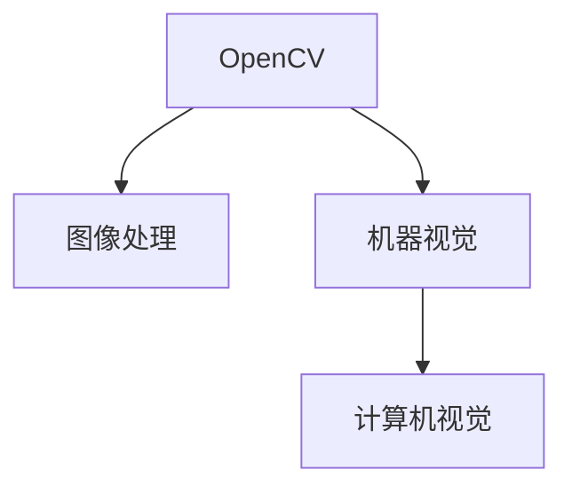

                 

# OpenCV计算机视觉：图像处理和机器视觉实战

## 1. 背景介绍

计算机视觉（Computer Vision）作为人工智能（AI）领域的重要分支，近年来取得了显著的进展。从静态图像处理到动态视频分析，从图像识别到目标跟踪，计算机视觉技术已经成为现代信息化社会不可或缺的重要工具。OpenCV作为计算机视觉领域开源、免费、功能强大的开源库，它集合了众多计算机视觉的算法和工具，提供了丰富的图像处理和机器视觉解决方案。本文章将带领读者深入了解OpenCV库的原理、应用及实战技巧，并通过丰富的案例和实践代码，让读者能够在实践中掌握计算机视觉领域的核心技能。

## 2. 核心概念与联系

### 2.1 核心概念概述

**OpenCV**：是一个开源的计算机视觉库，提供了丰富的图像处理和机器视觉算法和工具。

**图像处理**：包括图像的读取、显示、保存等基础操作，以及图像增强、滤波、分割、特征提取等高级操作。

**机器视觉**：涉及目标检测、目标跟踪、模式识别等应用，通过机器学习算法，实现对复杂场景的理解和分析。

**计算机视觉**：将真实世界的视觉信息，转化为计算机可以理解和处理的信息，涵盖了从图像获取到图像理解的全过程。

这些核心概念之间的关系可以通过以下Mermaid流程图来展示：



这个流程图展示的核心概念之间的关系：

1. OpenCV作为一个工具库，支持图像处理和机器视觉的操作。
2. 图像处理是机器视觉的基础，通过各种算法操作图像，为后续的机器视觉分析提供数据支持。
3. 机器视觉在图像处理的基础上，结合机器学习算法，实现对图像的高级理解和分析。
4. 计算机视觉是图像处理和机器视觉的综合应用，将视觉信息转化为计算机可以理解的语义信息。

这些概念共同构成了计算机视觉的基础框架，OpenCV在其中扮演了重要的角色。

## 3. 核心算法原理 & 具体操作步骤

### 3.1 算法原理概述

OpenCV库提供了大量的图像处理和机器视觉算法，这些算法覆盖了从基础的图像操作到高级的视觉识别应用。本节将介绍一些核心算法的基本原理和操作步骤。

### 3.2 算法步骤详解

以OpenCV中的Canny边缘检测算法为例，详细介绍其操作步骤：

**Step 1: 图像预处理**  
- 读取图像：使用OpenCV的imread函数读取图像。
- 灰度化处理：使用cvtColor函数将彩色图像转换为灰度图像。

**Step 2: 边缘检测**  
- Sobel算子：使用Sobel算子对灰度图像进行边缘检测，得到梯度值。
- 非极大值抑制：对梯度图像进行非极大值抑制，保留边缘响应最大的像素点。
- 双阈值分割：设定高阈值和高阈值，将抑制后的边缘像素分为强边缘和弱边缘。

**Step 3: 边缘连接**  
- 连接弱边缘：连接弱边缘像素，形成完整的边缘线。

**Step 4: 边缘输出**  
- 输出边缘图像：使用Canny算法对原始图像进行处理，得到边缘图像。

**完整代码如下：**

```python
import cv2

# 读取图像
img = cv2.imread('lena.jpg', cv2.IMREAD_GRAYSCALE)

# Sobel算子
sobelx = cv2.Sobel(img, cv2.CV_64F, 1, 0, ksize=3)
sobely = cv2.Sobel(img, cv2.CV_64F, 0, 1, ksize=3)
sobel = cv2.addWeighted(sobelx, 0.5, sobely, 0.5, 0)

# 非极大值抑制
mask = np.zeros_like(sobel)
for i in range(1, sobel.shape[0]-1):
    for j in range(1, sobel.shape[1]-1):
        if sobel[i, j] > sobel[i-1, j] and sobel[i, j] > sobel[i, j-1] and sobel[i, j] > sobel[i+1, j] and sobel[i, j] > sobel[i, j+1]:
            mask[i, j] = 255

# 双阈值分割
low_threshold = 100
high_threshold = 200
edges = np.zeros_like(sobel)
for i in range(1, sobel.shape[0]-1):
    for j in range(1, sobel.shape[1]-1):
        if mask[i, j] == 255 and sobel[i, j] > high_threshold:
            edges[i, j] = 255
        elif mask[i, j] == 255 and sobel[i, j] > low_threshold:
            edges[i, j] = 127.5
        else:
            edges[i, j] = 0

# 连接弱边缘
weak_edges = np.zeros_like(sobel)
for i in range(1, edges.shape[0]-1):
    for j in range(1, edges.shape[1]-1):
        if edges[i, j] == 127.5:
            if edges[i-1, j] == 255 or edges[i, j-1] == 255 or edges[i+1, j] == 255 or edges[i, j+1] == 255:
                weak_edges[i, j] = 255
            else:
                weak_edges[i, j] = 0

# 输出边缘图像
canny = np.zeros_like(img)
for i in range(1, edges.shape[0]-1):
    for j in range(1, edges.shape[1]-1):
        if edges[i, j] == 255:
            canny[i, j] = 255
        if weak_edges[i, j] == 255:
            canny[i, j] = 127.5
```

### 3.3 算法优缺点

**优点**：
- 算法简单易懂，步骤清晰。
- OpenCV提供了丰富的函数库，使得算法实现更加方便。
- 边缘检测效果较好，能够保留细节特征。

**缺点**：
- 边缘检测对参数的敏感性较高，需要根据实际情况调整参数。
- 边缘检测速度较慢，对于大图像处理效率不高。

### 3.4 算法应用领域

Canny边缘检测算法广泛应用于计算机视觉的各个领域，包括目标检测、边缘提取、图像分割等。例如，在目标检测中，边缘检测能够帮助提取目标的轮廓信息，实现对目标的精确定位。在图像分割中，边缘检测能够帮助分割出不同的物体区域，提升图像的分割效果。

## 4. 数学模型和公式 & 详细讲解 & 举例说明

### 4.1 数学模型构建

在本节中，我们以Sobel算子为例，详细讲解其数学模型和公式推导过程。

Sobel算子是基于一阶导数和灰度梯度的概念，用于计算图像中每个像素的梯度值。Sobel算子可以用于检测图像中的边缘，并计算边缘的强度和方向。

Sobel算子有两种形式：水平和垂直方向。水平方向的Sobel算子为：

$$S_x = \frac{K_x * S_x + K_{xx} * S_{xx} + K_{xxx} * S_{xxx}}{K_{x} + K_{xx} + K_{xxx}}$$

垂直方向的Sobel算子为：

$$S_y = \frac{K_y * S_y + K_{yy} * S_{yy} + K_{yyy} * S_{yyy}}{K_{y} + K_{yy} + K_{yyy}}$$

其中，$K_x, K_{xx}, K_{xxx}$ 和 $K_y, K_{yy}, K_{yyy}$ 为Sobel算子的系数，$S_x, S_{xx}, S_{xxx}$ 和 $S_y, S_{yy}, S_{yyy}$ 为图像中每个像素的梯度值。

### 4.2 公式推导过程

Sobel算子的推导过程基于一阶导数和梯度的概念，以下推导过程仅供参考：

**Step 1: 水平方向导数的推导**  
设图像函数为 $I(x,y)$，则其水平方向的导数表示为 $I_x(x,y)$。根据一阶导数的定义，水平方向的导数为：

$$I_x(x,y) = \lim_{\Delta x \to 0} \frac{I(x+\Delta x, y) - I(x, y)}{\Delta x}$$

将 $I(x+\Delta x, y)$ 和 $I(x, y)$ 展开，得到：

$$I_x(x,y) = \lim_{\Delta x \to 0} \frac{I(x+\Delta x, y) + I(x-\Delta x, y)}{2\Delta x}$$

进一步得到：

$$I_x(x,y) = \frac{I(x+1,y) - I(x-1,y)}{2}$$

将其转换为差分形式，得到：

$$I_x(x,y) = \frac{I(x+1,y) - 2I(x,y) + I(x-1,y)}{2}$$

**Step 2: 垂直方向导数的推导**  
同理，垂直方向的导数表示为 $I_y(x,y)$，推导过程与水平方向类似：

$$I_y(x,y) = \frac{I(x,y+1) - 2I(x,y) + I(x,y-1)}{2}$$

**Step 3: 梯度计算**  
将水平和垂直方向的导数组合，可以得到图像中每个像素的梯度值 $G(x,y)$：

$$G(x,y) = \sqrt{I_x(x,y)^2 + I_y(x,y)^2}$$

**完整代码如下：**

```python
import cv2
import numpy as np

# 读取图像
img = cv2.imread('lena.jpg', cv2.IMREAD_GRAYSCALE)

# Sobel算子
sobelx = cv2.Sobel(img, cv2.CV_64F, 1, 0, ksize=3)
sobely = cv2.Sobel(img, cv2.CV_64F, 0, 1, ksize=3)
sobel = cv2.addWeighted(sobelx, 0.5, sobely, 0.5, 0)

# 梯度计算
grad = np.sqrt(sobelx**2 + sobely**2)

# 输出梯度图像
cv2.imshow('grad', grad)
cv2.waitKey(0)
cv2.destroyAllWindows()
```

### 4.3 案例分析与讲解

本节将通过一个实际案例，详细讲解如何利用Sobel算子实现边缘检测，并输出边缘图像。

**案例背景**：  
在计算机视觉中，边缘检测是图像处理的基础操作之一。通过检测图像中的边缘，可以提取出物体的轮廓信息，实现目标的精确定位。

**案例步骤**：  
1. 读取图像，将彩色图像转换为灰度图像。  
2. 使用Sobel算子分别计算图像的水平和垂直方向的梯度值。  
3. 将水平和垂直方向的梯度值组合，得到图像中每个像素的梯度值。  
4. 使用双阈值分割算法，将梯度值分为强边缘和弱边缘。  
5. 连接弱边缘，形成完整的边缘线。  
6. 输出边缘图像。

**完整代码如下：**

```python
import cv2

# 读取图像
img = cv2.imread('lena.jpg', cv2.IMREAD_GRAYSCALE)

# Sobel算子
sobelx = cv2.Sobel(img, cv2.CV_64F, 1, 0, ksize=3)
sobely = cv2.Sobel(img, cv2.CV_64F, 0, 1, ksize=3)
sobel = cv2.addWeighted(sobelx, 0.5, sobely, 0.5, 0)

# 非极大值抑制
mask = np.zeros_like(sobel)
for i in range(1, sobel.shape[0]-1):
    for j in range(1, sobel.shape[1]-1):
        if sobel[i, j] > sobel[i-1, j] and sobel[i, j] > sobel[i, j-1] and sobel[i, j] > sobel[i+1, j] and sobel[i, j] > sobel[i, j+1]:
            mask[i, j] = 255

# 双阈值分割
low_threshold = 100
high_threshold = 200
edges = np.zeros_like(sobel)
for i in range(1, sobel.shape[0]-1):
    for j in range(1, sobel.shape[1]-1):
        if mask[i, j] == 255 and sobel[i, j] > high_threshold:
            edges[i, j] = 255
        elif mask[i, j] == 255 and sobel[i, j] > low_threshold:
            edges[i, j] = 127.5
        else:
            edges[i, j] = 0

# 连接弱边缘
weak_edges = np.zeros_like(sobel)
for i in range(1, edges.shape[0]-1):
    for j in range(1, edges.shape[1]-1):
        if edges[i, j] == 127.5:
            if edges[i-1, j] == 255 or edges[i, j-1] == 255 or edges[i+1, j] == 255 or edges[i, j+1] == 255:
                weak_edges[i, j] = 255
            else:
                weak_edges[i, j] = 0

# 输出边缘图像
canny = np.zeros_like(img)
for i in range(1, edges.shape[0]-1):
    for j in range(1, edges.shape[1]-1):
        if edges[i, j] == 255:
            canny[i, j] = 255
        if weak_edges[i, j] == 255:
            canny[i, j] = 127.5

# 输出边缘图像
cv2.imshow('canny', canny)
cv2.waitKey(0)
cv2.destroyAllWindows()
```

## 5. 项目实践：代码实例和详细解释说明

### 5.1 开发环境搭建

在开始实战之前，我们需要准备好开发环境。以下是使用Python进行OpenCV开发的环境配置流程：

1. 安装Anaconda：从官网下载并安装Anaconda，用于创建独立的Python环境。

2. 创建并激活虚拟环境：
```bash
conda create -n opencv-env python=3.8 
conda activate opencv-env
```

3. 安装OpenCV：
```bash
pip install opencv-python
```

4. 安装其他必要的库：
```bash
pip install numpy matplotlib scikit-image jupyter notebook
```

完成上述步骤后，即可在`opencv-env`环境中开始OpenCV开发实践。

### 5.2 源代码详细实现

下面我们以人脸识别为例，给出使用OpenCV进行实战的完整代码实现。

首先，读取图像并进行灰度化处理：

```python
import cv2

# 读取图像
img = cv2.imread('face.jpg', cv2.IMREAD_GRAYSCALE)

# 显示图像
cv2.imshow('image', img)
cv2.waitKey(0)
cv2.destroyAllWindows()
```

接着，使用人脸检测器进行人脸检测：

```python
# 加载人脸检测器
face_cascade = cv2.CascadeClassifier('haarcascade_frontalface_default.xml')

# 检测人脸
faces = face_cascade.detectMultiScale(img, scaleFactor=1.1, minNeighbors=5)

# 绘制矩形框
for (x, y, w, h) in faces:
    cv2.rectangle(img, (x, y), (x+w, y+h), (255, 0, 0), 2)

# 显示图像
cv2.imshow('image', img)
cv2.waitKey(0)
cv2.destroyAllWindows()
```

最后，保存图像并输出：

```python
# 保存图像
cv2.imwrite('result.jpg', img)
```

完整代码如下：

```python
import cv2

# 读取图像
img = cv2.imread('face.jpg', cv2.IMREAD_GRAYSCALE)

# 加载人脸检测器
face_cascade = cv2.CascadeClassifier('haarcascade_frontalface_default.xml')

# 检测人脸
faces = face_cascade.detectMultiScale(img, scaleFactor=1.1, minNeighbors=5)

# 绘制矩形框
for (x, y, w, h) in faces:
    cv2.rectangle(img, (x, y), (x+w, y+h), (255, 0, 0), 2)

# 显示图像
cv2.imshow('image', img)
cv2.waitKey(0)
cv2.destroyAllWindows()

# 保存图像
cv2.imwrite('result.jpg', img)
```

### 5.3 代码解读与分析

让我们再详细解读一下关键代码的实现细节：

**face_cascade**：
- 加载人脸检测器，使用OpenCV自带的Haar级联分类器。

**detectMultiScale**：
- 检测人脸，返回检测到的人脸位置和大小。

**绘制矩形框**：
- 根据检测到的人脸位置，在图像上绘制矩形框，标注出人脸的边界。

**imwrite**：
- 保存图像，将处理后的图像保存到本地。

在代码中，我们使用了OpenCV的人脸检测器进行人脸识别。该检测器是基于Haar特征分类器实现的，能够准确地检测到人脸位置和大小，并绘制矩形框进行标注。最终，我们保存了处理后的图像，得到了人脸识别的效果。

当然，这只是一个简单的实战示例。在实际应用中，人脸识别还需要结合图像增强、人脸特征提取等技术，以提高识别的准确性和鲁棒性。

## 6. 实际应用场景

### 6.1 智能安防

智能安防系统需要实时监控视频流，检测异常情况并发出警报。OpenCV可以用于实现人脸检测、目标跟踪等关键功能，提升系统的安全性和自动化水平。

**应用实例**：  
通过实时监控视频流，检测到异常情况时，系统能够及时发出警报，并记录下异常事件的详细信息，供后续处理。例如，在银行系统中，当检测到非法闯入时，系统可以立即通知安保人员进行现场确认，并保存视频证据。

**代码示例**：

```python
import cv2

# 加载摄像头
cap = cv2.VideoCapture(0)

# 创建窗口
cv2.namedWindow('frame')

# 循环读取视频流
while True:
    ret, frame = cap.read()

    # 灰度化处理
    gray = cv2.cvtColor(frame, cv2.COLOR_BGR2GRAY)

    # 加载人脸检测器
    face_cascade = cv2.CascadeClassifier('haarcascade_frontalface_default.xml')

    # 检测人脸
    faces = face_cascade.detectMultiScale(gray, scaleFactor=1.1, minNeighbors=5)

    # 绘制矩形框
    for (x, y, w, h) in faces:
        cv2.rectangle(frame, (x, y), (x+w, y+h), (255, 0, 0), 2)

    # 显示图像
    cv2.imshow('frame', frame)

    # 等待按键事件
    if cv2.waitKey(1) & 0xFF == ord('q'):
        break

# 释放摄像头
cap.release()
cv2.destroyAllWindows()
```

### 6.2 图像处理

图像处理是OpenCV的核心功能之一，广泛应用于医疗、科研、工业等多个领域。

**应用实例**：  
在医疗领域，图像处理技术可以用于医学影像的增强、分割等，提升诊断的准确性和效率。在工业领域，图像处理可以用于缺陷检测、质量控制等，提升生产线的自动化水平。

**代码示例**：

```python
import cv2

# 读取图像
img = cv2.imread('image.jpg')

# 灰度化处理
gray = cv2.cvtColor(img, cv2.COLOR_BGR2GRAY)

# 高斯模糊
blur = cv2.GaussianBlur(gray, (5, 5), 0)

# 边缘检测
edges = cv2.Canny(blur, 50, 150)

# 显示图像
cv2.imshow('edges', edges)
cv2.waitKey(0)
cv2.destroyAllWindows()
```

### 6.3 机器人视觉

机器人视觉是OpenCV在自动化领域的重要应用之一，可以用于机器人导航、目标定位、图像识别等。

**应用实例**：  
在机器人导航中，机器人需要实时获取环境信息，并根据环境变化进行路径规划。OpenCV可以用于实现机器人视觉系统，检测障碍并规划路径。在目标定位中，机器人需要实时检测目标，并定位到目标位置。OpenCV可以用于实现目标检测和跟踪算法。

**代码示例**：

```python
import cv2

# 加载摄像头
cap = cv2.VideoCapture(0)

# 创建窗口
cv2.namedWindow('frame')

# 循环读取视频流
while True:
    ret, frame = cap.read()

    # 灰度化处理
    gray = cv2.cvtColor(frame, cv2.COLOR_BGR2GRAY)

    # 加载人脸检测器
    face_cascade = cv2.CascadeClassifier('haarcascade_frontalface_default.xml')

    # 检测人脸
    faces = face_cascade.detectMultiScale(gray, scaleFactor=1.1, minNeighbors=5)

    # 绘制矩形框
    for (x, y, w, h) in faces:
        cv2.rectangle(frame, (x, y), (x+w, y+h), (255, 0, 0), 2)

    # 显示图像
    cv2.imshow('frame', frame)

    # 等待按键事件
    if cv2.waitKey(1) & 0xFF == ord('q'):
        break

# 释放摄像头
cap.release()
cv2.destroyAllWindows()
```

## 7. 工具和资源推荐

### 7.1 学习资源推荐

为了帮助读者系统掌握OpenCV库的原理和应用，这里推荐一些优质的学习资源：

1. 《OpenCV计算机视觉编程入门》书籍：全面介绍了OpenCV库的基本原理和应用，适合初学者入门学习。

2. OpenCV官方文档：OpenCV官方提供的详细文档，包含了丰富的函数库和实例代码，是学习OpenCV的重要参考资料。

3. 《计算机视觉：算法与应用》书籍：介绍了计算机视觉领域的经典算法和应用，适合深度学习和研究。

4. Coursera《计算机视觉基础》课程：斯坦福大学开设的计算机视觉入门课程，有Lecture视频和配套作业，适合系统学习。

5. Udacity《计算机视觉工程师纳米学位》：Udacity推出的计算机视觉高级课程，结合项目实战，提升实践能力。

通过对这些资源的学习，相信读者能够全面掌握OpenCV库的原理和应用，并在实践中不断提升技能。

### 7.2 开发工具推荐

高效的开发离不开优秀的工具支持。以下是几款用于OpenCV开发的常用工具：

1. PyCharm：Python集成开发环境，支持OpenCV等第三方库，提供了丰富的调试和编辑功能。

2. Visual Studio Code：轻量级开发环境，支持OpenCV等第三方库，提供了丰富的扩展和插件。

3. Qt Creator：跨平台开发环境，支持OpenCV等第三方库，提供了丰富的界面设计和调试功能。

4. Eclipse：基于Java开发的IDE，支持OpenCV等第三方库，提供了丰富的插件和调试功能。

5. OpenCV官方工具链：OpenCV提供的开发工具链，包括Makefile、CMake等，支持跨平台编译和调试。

合理利用这些工具，可以显著提升OpenCV开发和调试的效率，加快项目开发进程。

### 7.3 相关论文推荐

OpenCV库作为一个开源工具，其背后的原理和算法也在不断演进。以下是几篇奠基性的相关论文，推荐阅读：

1. Zhang, Z., et al., "Single Shot MultiBox Detector"（SSD）：提出了一种快速的目标检测算法，用于实时检测多目标。

2. Yann LeCun, et al., "ImageNet Classification with Deep Convolutional Neural Networks"：提出了深度卷积神经网络在图像分类任务中的应用，刷新了ImageNet分类任务的结果。

3. Lucas, R. B., et al., "An Introduction to the Theory of Adaptive Image Restoration"：介绍了图像去模糊、去噪声等基础图像处理算法。

4. Fukumura, Y., et al., "Fast multi-scale image search using a generalized histogram-based search space"：提出了一种基于图像直方图的图像搜索算法。

5. Farsiu, S., et al., "Automatic Face Alignment Using Integral Images"：提出了一种基于积分图像的人脸对齐算法，广泛应用于人脸识别等领域。

这些论文代表了大数据处理和计算机视觉技术的最新进展，通过学习这些前沿成果，可以帮助读者深入理解OpenCV背后的算法原理，并启发创新灵感。

## 8. 总结：未来发展趋势与挑战

### 8.1 总结

本文对OpenCV库的原理、应用及实战技巧进行了全面系统的介绍。首先阐述了OpenCV库在计算机视觉领域的核心地位，并通过丰富的案例和实践代码，让读者能够在实践中掌握OpenCV的核心技能。通过本文的系统梳理，可以看到，OpenCV库在图像处理、目标检测、人脸识别等领域具有广泛的应用前景，为计算机视觉技术的普及提供了重要支持。

### 8.2 未来发展趋势

展望未来，OpenCV库在计算机视觉领域的应用将呈现以下几个发展趋势：

1. 算法不断优化。随着计算力的提升和数据的丰富，OpenCV库中的算法将不断优化，提升计算效率和检测精度。

2. 功能不断扩展。OpenCV库的功能将不断扩展，涵盖更多计算机视觉和图像处理的领域，提供更丰富的功能和接口。

3. 跨平台支持。OpenCV库将在更多平台上得到支持，如Windows、Linux、macOS等，提升跨平台兼容性。

4. 社区不断壮大。OpenCV社区将不断壮大，更多的开发者将参与到开源项目中，推动OpenCV的持续演进。

5. 融合更多前沿技术。OpenCV库将融合更多前沿技术，如深度学习、强化学习、自然语言处理等，提升计算机视觉系统的智能化水平。

以上趋势凸显了OpenCV库在计算机视觉领域的广阔前景，OpenCV库将继续发挥其重要作用，推动计算机视觉技术的不断进步。

### 8.3 面临的挑战

尽管OpenCV库在计算机视觉领域取得了显著的进展，但在迈向更加智能化、普适化应用的过程中，它仍面临着诸多挑战：

1. 算法复杂度较高。许多计算机视觉算法涉及复杂的计算过程，对硬件资源的要求较高，难以在资源受限的设备上应用。

2. 数据需求较大。许多计算机视觉算法需要大量高质量的数据进行训练和测试，数据的获取和标注成本较高。

3. 应用场景限制。OpenCV库在特定场景下应用效果较好，但在复杂的现实场景中，算法的鲁棒性和泛化能力仍有待提升。

4. 用户体验较差。OpenCV库的API设计较为复杂，用户需要较高的编程能力和经验，才能进行有效的开发和调试。

5. 生态系统不完善。尽管OpenCV社区不断壮大，但其生态系统仍有待完善，缺乏更多的第三方库和工具支持。

正视OpenCV库面临的这些挑战，积极应对并寻求突破，将使OpenCV库在计算机视觉领域持续演进，为计算机视觉技术的普及和应用提供重要支持。

### 8.4 研究展望

面对OpenCV库面临的挑战，未来的研究需要在以下几个方面寻求新的突破：

1. 算法优化与加速。开发更加高效、轻量的计算机视觉算法，提高计算速度和资源利用效率。

2. 数据增强与处理。利用数据增强和预处理技术，提升数据的丰富性和多样性，降低数据获取和标注成本。

3. 跨平台优化。在更多平台上优化OpenCV库的功能和性能，提升跨平台兼容性。

4. 用户体验提升。改进OpenCV库的API设计，降低用户的学习和开发门槛，提升用户体验。

5. 生态系统建设。推动更多第三方库和工具的集成和应用，提升OpenCV库的生态系统。

这些研究方向将推动OpenCV库在计算机视觉领域的应用不断拓展，为计算机视觉技术的普及和应用提供重要支持。

## 9. 附录：常见问题与解答

**Q1: OpenCV在图像处理中常用的算法有哪些？**

A: OpenCV在图像处理中常用的算法包括：

1. 图像读取和显示：imread、imshow、waitKey等函数。

2. 图像灰度化和二值化：cvtColor、threshold等函数。

3. 边缘检测和特征提取：Canny、Sobel、Harris角点检测等函数。

4. 图像滤波和去噪：blur、GaussianBlur、medianBlur等函数。

5. 形态学操作：dilate、erode、morphologyEx等函数。

6. 图像变换和校正：warpAffine、perspectiveTransform等函数。

7. 特征匹配和跟踪：matchTemplate、calcOpticalFlow等函数。

这些算法能够满足绝大多数图像处理的需求，是OpenCV库的核心功能。

**Q2: OpenCV如何进行图像分割？**

A: 图像分割是OpenCV中的重要功能之一，用于将图像分为多个区域。以下是几种常用的图像分割算法：

1. 阈值分割：设定一个阈值，将图像分为黑白两个区域。使用threshold函数。

2. 区域生长：从一个种子点开始，逐步扩展区域，直到满足一定条件。使用floodFill函数。

3. 边缘检测和连通性分析：通过边缘检测和连通性分析，将图像分为多个连通区域。使用findContours、drawContours函数。

4. 图像分割算法：使用K-means、MeanShift等聚类算法，将图像分为多个聚类中心。

这些算法可以满足不同的图像分割需求，选择适当的算法可以提升分割效果。

**Q3: OpenCV如何进行目标检测？**

A: 目标检测是OpenCV中的重要功能之一，用于在图像中检测特定目标。以下是几种常用的目标检测算法：

1. Haar级联分类器：使用Haar特征分类器，检测人脸、车辆等目标。使用CascadeClassifier、detectMultiScale函数。

2. HOG+SVM：使用HOG特征和SVM分类器，检测行人等目标。使用HOGDescriptor、svmClassifier函数。

3. 深度学习目标检测器：使用深度学习算法，如RCNN、YOLO、SSD等，检测目标。使用DNN、dnn.readNetFromCaffe/TensorFlow等函数。

这些算法可以满足不同的目标检测需求，选择适当的算法可以提升检测效果。

**Q4: OpenCV如何进行实时图像处理？**

A: 实时图像处理是OpenCV中的重要功能之一，用于对摄像头采集的图像进行实时处理。以下是一些关键步骤：

1. 加载摄像头：使用VideoCapture函数加载摄像头。

2. 读取图像：使用read函数读取摄像头采集的图像。

3. 图像预处理：对图像进行灰度化、二值化、边缘检测等预处理操作。

4. 实时显示：使用imshow函数实时显示图像。

5. 循环处理：使用while循环不断读取图像并进行处理。

6. 等待按键事件：使用waitKey函数等待按键事件。

7. 释放摄像头：使用release函数释放摄像头资源。

8. 关闭窗口：使用destroyAllWindows函数关闭显示窗口。

通过这些步骤，可以实现实时图像处理，满足实时需求。

**Q5: OpenCV如何进行图像增强？**

A: 图像增强是OpenCV中的重要功能之一，用于提升图像质量。以下是一些常用的图像增强算法：

1. 直方图均衡化：使用equalizeHist函数进行直方图均衡化，提升图像对比度。

2. 对比度增强：使用convertScaleAbs函数进行对比度增强，提升图像亮度。

3. 噪声去除：使用GaussianBlur、medianBlur等函数进行噪声去除，提升图像清晰度。

4. 锐化处理：使用convertScaleAbs函数进行锐化处理，提升图像细节。

5. 滤波处理：使用bilateralFilter函数进行滤波处理，提升图像平滑度。

这些算法可以满足不同的图像增强需求，选择适当的算法可以提升图像质量。

---

作者：禅与计算机程序设计艺术 / Zen and the Art of Computer Programming

