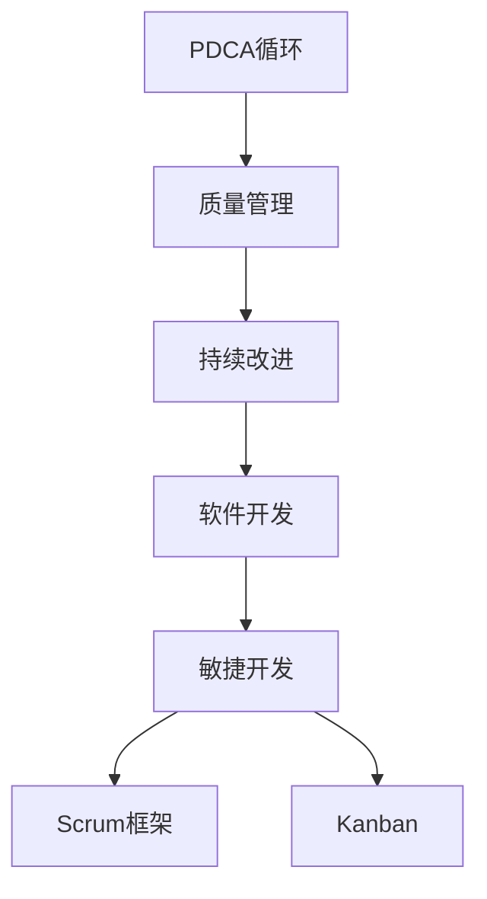

                 

# PDCA循环与管理持续改进的关系

## 1. 背景介绍

PDCA循环（Plan-Do-Check-Act Cycle），又称为戴明环，是管理学中一个经典的持续改进模型。它由四个基本步骤组成：计划（Plan）、执行（Do）、检查（Check）、行动（Act），通过循环迭代，不断提升管理效率和质量。在软件开发领域，PDCA循环同样具有重要意义，能够帮助团队系统化地进行项目管理，持续改进工作质量。

本文旨在深入探讨PDCA循环与软件管理之间的关系，分析如何在软件开发过程中应用PDCA循环，以提升项目管理和软件质量。

## 2. 核心概念与联系

### 2.1 核心概念概述

为更好地理解PDCA循环在软件开发中的应用，本节将介绍几个密切相关的核心概念：

- PDCA循环：由美国质量管理专家W. Edwards Deming提出，强调通过持续的计划、执行、检查、行动，逐步改进质量管理的过程。
- 质量管理：通过制订和实施质量方针、标准和体系，达到质量目标的过程，包括质量策划、质量保证、质量控制等环节。
- 持续改进：不断对现有流程和系统进行评估和优化，提升工作效率和产品质量。
- 软件开发：通过设计、实现、测试、部署等环节，将需求转换为可执行的软件系统的过程。
- 敏捷开发：一种快速响应市场需求变化的软件开发方法，强调灵活性和迭代性。
- Scrum框架：一种敏捷开发框架，以迭代和增量发布为目标，通过Sprint迭代和Scrum会议进行项目管理。
- Kanban：一种敏捷开发方法，通过看板管理、持续交付等手段，优化软件开发流程。

这些核心概念之间的逻辑关系可以通过以下Mermaid流程图来展示：



这个流程图展示了一系列的相互作用关系：PDCA循环是质量管理的基础，持续改进是质量管理的核心目标，而敏捷开发和Scrum、Kanban方法则是具体实现PDCA循环的工具和方法。通过这些核心概念的相互作用，PDCA循环在软件开发过程中得以有效实施。

## 3. 核心算法原理 & 具体操作步骤
### 3.1 算法原理概述

PDCA循环的基本原理是通过四个步骤的循环迭代，不断提升质量管理的水平。在软件开发中，PDCA循环的应用则具体体现在项目管理的各个环节。具体来说，PDCA循环可以用于软件开发项目的计划、执行、检查和行动四个阶段，从而实现对软件项目的持续改进。

### 3.2 算法步骤详解

以下是PDCA循环在软件开发项目管理中的应用步骤：

**Step 1: 计划（Plan）**
- 目标制定：根据客户需求和项目目标，确定项目范围和预期成果。
- 任务分解：将项目目标分解为可执行的任务和子任务。
- 资源配置：确定项目所需的资源（人力、技术、资金等），并分配给各个任务。
- 计划制订：为每个任务制订详细的时间表和责任分工，包括任务起始和完成时间、质量标准、测试方法等。

**Step 2: 执行（Do）**
- 任务执行：按照计划要求，开展各个任务的具体工作。
- 进度跟踪：定期检查任务进度，确保按计划进行。
- 沟通协作：及时沟通项目进展，解决可能出现的问题。
- 异常处理：对执行过程中出现的异常情况进行及时处理和调整。

**Step 3: 检查（Check）**
- 成果验证：对已完成的任务进行质量检查和测试，确保成果符合质量标准。
- 数据分析：收集任务执行过程中的数据，进行分析评估。
- 反馈反馈：根据检查结果，收集团队成员和客户反馈，了解工作质量和工作满意度。
- 调整计划：根据检查结果，对原计划进行调整，确保项目顺利进行。

**Step 4: 行动（Act）**
- 纠正行动：对检查中发现的问题进行纠正，并采取措施避免再次发生。
- 优化改进：根据数据分析和反馈，对项目管理和工作流程进行优化和改进。
- 下一循环：开始下一轮PDCA循环，继续提升项目管理水平和软件质量。

### 3.3 算法优缺点

PDCA循环在项目管理中的应用，具有以下优点：
1. 系统化管理：PDCA循环提供了一套系统化的项目管理框架，有助于团队有序地开展工作。
2. 持续改进：通过循环迭代，不断提升项目管理水平和软件质量。
3. 灵活适应：PDCA循环能够适应项目需求的变化，灵活调整计划和资源配置。
4. 风险控制：通过检查和行动环节，能够及时发现和处理风险，保障项目顺利进行。

同时，PDCA循环也存在一定的局限性：
1. 工作量大：在每个循环周期中，需要投入大量的时间和资源进行计划、检查和行动。
2. 过程复杂：循环周期较长，项目管理中可能会出现断层，影响项目进度。
3. 学习曲线陡峭：PDCA循环对团队成员的素质和技能要求较高，新手可能难以适应。
4. 灵活性受限：一旦进入执行阶段，调整计划和资源配置的灵活性相对较低。

尽管存在这些局限性，但就目前而言，PDCA循环仍然是最成熟、最可靠的项目管理方法之一。未来相关研究的重点在于如何进一步简化PDCA循环的步骤，提高其灵活性和效率，同时兼顾系统的持续改进目标。

### 3.4 算法应用领域

PDCA循环在软件开发项目管理中的应用非常广泛，涵盖了以下几个方面：

1. 敏捷项目管理：Scrum和Kanban方法都是以PDCA循环为基础的敏捷开发框架。Scrum中的Sprint迭代和回顾会议，Kanban中的看板管理，都是PDCA循环的体现。

2. 测试项目管理：测试团队通过PDCA循环进行需求分析、测试计划、测试执行、测试评估和总结，确保软件质量达到预期标准。

3. 性能优化：开发团队通过PDCA循环对软件性能进行持续优化，不断提升用户体验和系统效率。

4. 安全管理：通过PDCA循环进行风险识别、安全评估、安全改进和安全检查，保障软件系统的安全性和可靠性。

5. 知识管理：通过PDCA循环对知识进行积累、共享和创新，推动团队整体水平的提升。

以上这些领域中，PDCA循环都能够发挥重要作用，帮助团队系统化地进行项目管理，持续改进软件质量和效率。

## 4. 数学模型和公式 & 详细讲解  
### 4.1 数学模型构建

在项目管理中，PDCA循环通常采用系统化的方法和工具来辅助实施，其中常见的数学模型包括甘特图（Gantt Chart）和看板（Kanban Board）。

甘特图是一种基于时间线的项目管理工具，用于展示任务进度和资源分配情况。其数学模型可以表示为：

$$
G = \{(X, Y, W)|X \text{为任务起始时间}, Y \text{为任务结束时间}, W \text{为任务持续时间}\}
$$

其中，$G$表示甘特图，$X, Y, W$分别表示任务的时间轴、持续时间、实际执行时间等属性。通过甘特图，项目经理可以直观地了解任务的进展情况，并及时调整计划。

看板是一种基于看板的敏捷项目管理工具，用于显示任务状态和流程。其数学模型可以表示为：

$$
K = \{(X, Y, W, Z)|X \text{为任务状态}, Y \text{为任务优先级}, W \text{为任务描述}, Z \text{为任务负责人}\}
$$

其中，$K$表示看板，$X, Y, W, Z$分别表示任务的状态、优先级、描述和负责人等属性。通过看板，团队成员可以实时了解任务状态，并协调资源进行任务执行。

### 4.2 公式推导过程

在PDCA循环中，计划和执行环节通常需要结合甘特图进行时间线管理，而检查和行动环节通常需要结合看板进行任务状态跟踪。以下以甘特图为例，进行公式推导和案例分析。

假设项目包含三个任务，分别为任务1、任务2和任务3，每个任务的时间轴、持续时间、实际执行时间和完成时间分别为：

- 任务1：$X_1=(0, 10)$, $W_1=5$, $W_1=(0, 5)$, $W_1=(5, 10)$
- 任务2：$X_2=(10, 20)$, $W_2=5$, $W_2=(10, 15)$, $W_2=(15, 20)$
- 任务3：$X_3=(20, 30)$, $W_3=5$, $W_3=(20, 25)$, $W_3=(25, 30)$

在甘特图上，任务1、任务2和任务3的图形表示如图1所示：


根据甘特图，可以计算每个任务的进度情况，如表1所示：

| 任务 | 起始时间 | 持续时间 | 实际执行时间 | 完成时间 |
| --- | --- | --- | --- | --- |
| 任务1 | 0 | 5 | 0 | 5 |
| 任务2 | 10 | 5 | 5 | 15 |
| 任务3 | 20 | 5 | 5 | 25 |

通过甘特图和表格，项目经理可以直观地了解任务的执行情况，并及时调整计划和资源配置，确保项目顺利进行。

### 4.3 案例分析与讲解

假设某软件开发项目需要进行持续的质量改进，通过PDCA循环进行项目管理，具体步骤如下：

**Plan阶段：**
- 确定项目目标：开发一款用户友好的应用程序。
- 任务分解：将项目目标分解为需求分析、设计、开发、测试和部署五个子任务。
- 资源配置：配置开发人员、测试人员、服务器和开发工具等资源。
- 计划制订：为每个子任务制订详细的时间表和责任分工，包括任务起始和完成时间、质量标准、测试方法等。

**Do阶段：**
- 需求分析：收集用户需求，进行分析并生成需求文档。
- 设计：根据需求文档，设计应用程序的架构和功能模块。
- 开发：实现应用程序的功能模块，并进行单元测试和集成测试。
- 测试：对已完成的功能模块进行全面测试，确保符合质量标准。
- 部署：将应用程序部署到服务器，并进行系统测试。

**Check阶段：**
- 成果验证：对每个子任务进行质量检查和测试，确保成果符合质量标准。
- 数据分析：收集任务执行过程中的数据，进行分析评估。
- 反馈反馈：根据检查结果，收集团队成员和客户反馈，了解工作质量和工作满意度。
- 调整计划：根据检查结果，对原计划进行调整，确保项目顺利进行。

**Act阶段：**
- 纠正行动：对检查中发现的问题进行纠正，并采取措施避免再次发生。
- 优化改进：根据数据分析和反馈，对项目管理和工作流程进行优化和改进。
- 下一循环：开始下一轮PDCA循环，继续提升项目管理水平和软件质量。

通过PDCA循环的四个步骤，项目团队可以系统化地进行项目管理，持续改进软件质量和效率，确保项目顺利进行。

## 5. 项目实践：代码实例和详细解释说明
### 5.1 开发环境搭建

在进行PDCA循环项目实践前，我们需要准备好开发环境。以下是使用Python进行Scrum框架开发的简单环境配置流程：

1. 安装Anaconda：从官网下载并安装Anaconda，用于创建独立的Python环境。

2. 创建并激活虚拟环境：
```bash
conda create -n scrum-env python=3.8 
conda activate scrum-env
```

3. 安装Scrum框架所需的库：
```bash
pip install scrum
```

4. 安装其他开发工具：
```bash
pip install numpy pandas scikit-learn matplotlib tqdm jupyter notebook ipython
```

完成上述步骤后，即可在`scrum-env`环境中开始Scrum框架实践。

### 5.2 源代码详细实现

以下是一个简单的Scrum框架代码实现，使用Python的Scrum库进行项目管理：

```python
from scrum import ScrumMaster, ScrumUser, Sprint

class ProjectManager:
    def __init__(self, team_members):
        self.team_members = team_members
        self.scrum_master = ScrumMaster(self.team_members)
        
    def plan(self):
        # 任务分解和资源配置
        task1 = Task('需求分析', '收集用户需求', '需求分析', self.team_members[0])
        task2 = Task('设计', '设计应用程序架构', '设计', self.team_members[1])
        task3 = Task('开发', '实现应用程序功能模块', '开发', self.team_members[2])
        task4 = Task('测试', '进行功能模块测试', '测试', self.team_members[3])
        task5 = Task('部署', '部署应用程序', '部署', self.team_members[4])
        
        # 创建任务列表
        task_list = [task1, task2, task3, task4, task5]
        
        # 计划制订
        self.scrum_master.plan_tasks(task_list)
        
    def execute(self):
        # 开始Sprint
        self.scrum_master.start_sprint()
        
        # 任务执行
        for task in task_list:
            self.scrum_master.execute_task(task)
        
        # 完成Sprint
        self.scrum_master.end_sprint()
        
    def check(self):
        # 成果验证
        for task in task_list:
            self.scrum_master.validate_task(task)
        
        # 数据分析
        data = self.scrum_master.analyze_data()
        
        # 反馈反馈
        feedback = self.scrum_master.collect_feedback(data)
        
        # 调整计划
        self.scrum_master.update_plan(feedback)
        
    def act(self):
        # 纠正行动
        for task in task_list:
            self.scrum_master.correct_action(task)
        
        # 优化改进
        self.scrum_master.improve_workflow()
        
        # 下一循环
        self.scrum_master.start_next_cycle()

# 定义任务类
class Task:
    def __init__(self, name, description, priority, responsible):
        self.name = name
        self.description = description
        self.priority = priority
        self.responsible = responsible

# 创建团队成员
team_members = [
    ScrumUser('需求分析师', '需求分析'),
    ScrumUser('设计师', '设计'),
    ScrumUser('开发者', '开发'),
    ScrumUser('测试员', '测试'),
    ScrumUser('运维工程师', '部署')
]

# 创建项目管理器
project_manager = ProjectManager(team_members)

# 执行PDCA循环
project_manager.plan()
project_manager.execute()
project_manager.check()
project_manager.act()
```

### 5.3 代码解读与分析

这里我们详细解读一下关键代码的实现细节：

**ProjectManager类**：
- `__init__`方法：初始化团队成员和Scrum Master，创建任务列表。
- `plan`方法：任务分解和资源配置，计划制订。
- `execute`方法：开始Sprint，任务执行。
- `check`方法：成果验证、数据分析、反馈反馈、调整计划。
- `act`方法：纠正行动、优化改进、下一循环。

**Task类**：
- 定义任务的基本属性，包括任务名称、描述、优先级和负责人。

**ScrumUser类**：
- 定义团队成员的角色和职责，用于分配任务。

**Scrum框架实践**：
- 创建团队成员和项目管理器，执行PDCA循环，包括计划、执行、检查和行动四个阶段。

通过这个简单的Scrum框架代码实现，可以看出PDCA循环在软件开发项目管理中的应用。在实际应用中，还需要根据具体项目需求，对Scrum框架进行调整和优化。

## 6. 实际应用场景
### 6.1 软件开发项目管理

在软件开发项目中，PDCA循环可以应用于需求分析、设计、开发、测试和部署等各个环节，确保项目顺利进行。例如，某软件开发项目需要进行持续的质量改进，具体步骤如下：

1. **Plan阶段：**
- 确定项目目标：开发一款用户友好的应用程序。
- 任务分解：将项目目标分解为需求分析、设计、开发、测试和部署五个子任务。
- 资源配置：配置开发人员、测试人员、服务器和开发工具等资源。
- 计划制订：为每个子任务制订详细的时间表和责任分工，包括任务起始和完成时间、质量标准、测试方法等。

2. **Do阶段：**
- 需求分析：收集用户需求，进行分析并生成需求文档。
- 设计：根据需求文档，设计应用程序的架构和功能模块。
- 开发：实现应用程序的功能模块，并进行单元测试和集成测试。
- 测试：对已完成的功能模块进行全面测试，确保符合质量标准。
- 部署：将应用程序部署到服务器，并进行系统测试。

3. **Check阶段：**
- 成果验证：对每个子任务进行质量检查和测试，确保成果符合质量标准。
- 数据分析：收集任务执行过程中的数据，进行分析评估。
- 反馈反馈：根据检查结果，收集团队成员和客户反馈，了解工作质量和工作满意度。
- 调整计划：根据检查结果，对原计划进行调整，确保项目顺利进行。

4. **Act阶段：**
- 纠正行动：对检查中发现的问题进行纠正，并采取措施避免再次发生。
- 优化改进：根据数据分析和反馈，对项目管理和工作流程进行优化和改进。
- 下一循环：开始下一轮PDCA循环，继续提升项目管理水平和软件质量。

通过PDCA循环的四个步骤，项目团队可以系统化地进行项目管理，持续改进软件质量和效率，确保项目顺利进行。

### 6.2 质量管理

在质量管理中，PDCA循环可以应用于质量标准的制定、质量控制和质量改进等环节，确保产品质量达到预期标准。例如，某软件开发项目需要进行持续的质量改进，具体步骤如下：

1. **Plan阶段：**
- 确定质量目标：确保软件产品达到用户需求和设计标准。
- 任务分解：将质量目标分解为需求分析、设计、开发、测试和部署五个子任务。
- 资源配置：配置质量管理人员、测试人员、服务器和测试工具等资源。
- 计划制订：为每个子任务制订详细的时间表和责任分工，包括任务起始和完成时间、质量标准、测试方法等。

2. **Do阶段：**
- 需求分析：收集用户需求，进行分析并生成需求文档。
- 设计：根据需求文档，设计应用程序的架构和功能模块。
- 开发：实现应用程序的功能模块，并进行单元测试和集成测试。
- 测试：对已完成的功能模块进行全面测试，确保符合质量标准。
- 部署：将应用程序部署到服务器，并进行系统测试。

3. **Check阶段：**
- 成果验证：对每个子任务进行质量检查和测试，确保成果符合质量标准。
- 数据分析：收集任务执行过程中的数据，进行分析评估。
- 反馈反馈：根据检查结果，收集团队成员和客户反馈，了解工作质量和工作满意度。
- 调整计划：根据检查结果，对原计划进行调整，确保项目顺利进行。

4. **Act阶段：**
- 纠正行动：对检查中发现的问题进行纠正，并采取措施避免再次发生。
- 优化改进：根据数据分析和反馈，对质量管理和工作流程进行优化和改进。
- 下一循环：开始下一轮PDCA循环，继续提升质量管理水平和软件质量。

通过PDCA循环的四个步骤，质量管理人员可以系统化地进行质量管理，持续改进软件质量和效率，确保产品质量达到预期标准。

### 6.3 持续改进

在持续改进中，PDCA循环可以应用于知识管理、技术创新和员工培训等环节，确保团队整体水平的提升。例如，某软件开发团队需要进行持续改进，具体步骤如下：

1. **Plan阶段：**
- 确定改进目标：提高团队的技术水平和项目交付效率。
- 任务分解：将改进目标分解为知识管理、技术创新和员工培训三个子任务。
- 资源配置：配置技术专家、培训师和知识库等资源。
- 计划制订：为每个子任务制订详细的时间表和责任分工，包括任务起始和完成时间、改进措施、培训内容等。

2. **Do阶段：**
- 知识管理：收集和整理技术文档、案例分析和最佳实践，构建知识库。
- 技术创新：进行技术研讨和项目实验，探索新的技术方向和方法。
- 员工培训：组织技术培训和交流会议，提高团队成员的技术水平。

3. **Check阶段：**
- 成果验证：评估知识库的质量和应用效果，评估技术创新和员工培训的效果。
- 数据分析：收集任务执行过程中的数据，进行分析评估。
- 反馈反馈：根据检查结果，收集团队成员和客户的反馈，了解改进效果和工作满意度。
- 调整计划：根据检查结果，对原计划进行调整，确保改进计划顺利进行。

4. **Act阶段：**
- 纠正行动：对检查中发现的问题进行纠正，并采取措施避免再次发生。
- 优化改进：根据数据分析和反馈，对知识管理、技术创新和员工培训进行优化和改进。
- 下一循环：开始下一轮PDCA循环，继续提升团队整体水平和项目交付效率。

通过PDCA循环的四个步骤，团队可以系统化地进行持续改进，提升整体水平，确保项目顺利进行。

## 7. 工具和资源推荐
### 7.1 学习资源推荐

为了帮助开发者系统掌握PDCA循环的理论基础和实践技巧，这里推荐一些优质的学习资源：

1. 《精益管理》系列博文：由精益管理专家撰写，深入浅出地介绍了精益管理的基本概念和实践方法，是PDCA循环的重要理论基础。

2. 《敏捷开发》课程：由知名软件公司提供的敏捷开发课程，涵盖Scrum、Kanban等多种敏捷方法，是PDCA循环在软件开发中的实践指南。

3. 《质量管理》书籍：全面介绍了质量管理的基本理论和方法，包括PDCA循环、六西格玛、ISO标准等，是质量管理的经典教材。

4. 《持续改进》书籍：深入分析了持续改进的方法和案例，包括PDCA循环、精益生产、全面质量管理等，是持续改进的实用指南。

5. 《Scrum框架》书籍：详细介绍了Scrum框架的原理和实践方法，是敏捷开发项目管理的重要参考资料。

通过对这些资源的学习实践，相信你一定能够快速掌握PDCA循环的理论基础和实践技巧，并用于解决实际的项目管理问题。

### 7.2 开发工具推荐

高效的开发离不开优秀的工具支持。以下是几款用于PDCA循环项目管理开发的常用工具：

1. JIRA：一种项目管理工具，支持敏捷开发和Scrum框架，能够进行任务跟踪、报告生成、数据分析等。

2. Confluence：一种知识管理工具，支持文档协作、版本控制、知识库构建等，是PDCA循环中知识管理的重要工具。

3. Trello：一种看板管理工具，支持任务跟踪、进度可视化和实时协作，是Kanban方法的核心工具。

4. Asana：一种项目管理工具，支持任务分解、进度跟踪、协作通信等，是敏捷开发和Scrum框架的常用工具。

5. Slack：一种团队协作工具，支持实时通信、文件共享、项目管理等，是敏捷开发和PDCA循环中不可或缺的协作工具。

合理利用这些工具，可以显著提升PDCA循环项目管理的效率和效果，加快创新迭代的步伐。

### 7.3 相关论文推荐

PDCA循环作为一种经典的管理方法，近年来在多个领域得到了深入研究。以下是几篇代表性的相关论文，推荐阅读：

1. 《PDCA循环在质量管理中的应用研究》：详细介绍了PDCA循环在质量管理中的应用，分析了PDCA循环的实施步骤和效果。

2. 《敏捷开发与PDCA循环的结合研究》：分析了敏捷开发和PDCA循环的结合，探讨了敏捷开发中PDCA循环的实践方法。

3. 《Scrum框架与PDCA循环的协同应用》：讨论了Scrum框架和PDCA循环的协同应用，提出了敏捷开发中PDCA循环的实施策略。

4. 《持续改进与PDCA循环的结合研究》：分析了持续改进和PDCA循环的结合，探讨了PDCA循环在持续改进中的实施方法和效果。

5. 《Kanban方法与PDCA循环的协同应用》：讨论了Kanban方法和PDCA循环的协同应用，提出了敏捷开发中PDCA循环的实施策略。

这些论文代表了大语言模型微调技术的发展脉络。通过学习这些前沿成果，可以帮助研究者把握学科前进方向，激发更多的创新灵感。

## 8. 总结：未来发展趋势与挑战

### 8.1 总结

本文对PDCA循环与软件管理之间的关系进行了全面系统的介绍。首先阐述了PDCA循环的基本原理和实施步骤，明确了其在软件开发项目管理中的应用价值。其次，通过具体的项目实践案例，展示了PDCA循环在软件开发、质量管理和持续改进中的应用，深入分析了PDCA循环在各领域的具体实施方法。

通过本文的系统梳理，可以看到，PDCA循环在软件开发项目管理中具有重要的指导意义，能够帮助团队系统化地进行项目管理，持续改进软件质量和效率。同时，PDCA循环在质量管理、持续改进等多个领域也具有广泛的应用前景。未来，PDCA循环还将与更多现代管理方法相结合，为企业的持续改进和发展提供有力的支持。

### 8.2 未来发展趋势

展望未来，PDCA循环将在多个领域继续发挥重要作用，发展趋势如下：

1. 与敏捷开发结合：随着敏捷开发方法在软件项目管理中的应用日益广泛，PDCA循环将与敏捷开发框架进行更深度的融合，提供更加灵活和高效的项目管理方案。

2. 与人工智能结合：在智能项目管理、智能知识管理等领域，PDCA循环将与人工智能技术相结合，实现更加智能化、自动化的项目管理。

3. 与大数据结合：在项目管理中引入大数据技术，利用数据分析和挖掘技术，优化项目管理方案，提升项目管理效率和效果。

4. 与云平台结合：在云平台环境下，PDCA循环将与云服务、容器化技术相结合，实现更加灵活和弹性的项目管理。

5. 与全球化管理结合：在全球化管理中，PDCA循环将与国际标准、跨国团队管理等相结合，提升全球化项目管理水平。

以上趋势凸显了PDCA循环在现代管理中的重要作用和广泛应用前景。这些方向的探索发展，将进一步提升PDCA循环在各领域的实践价值，推动项目管理向更高层次发展。

### 8.3 面临的挑战

尽管PDCA循环在项目管理中具有显著的优势，但在实际应用中也面临一些挑战：

1. 学习曲线陡峭：PDCA循环的实施需要系统化的理论知识和实践经验，新手可能难以快速掌握。

2. 执行复杂度高：PDCA循环的实施过程复杂，需要团队成员的高度协作和沟通，容易出现断层和执行偏差。

3. 工具支持不足：尽管有许多项目管理工具，但缺乏专门支持PDCA循环的自动化工具，影响实施效率。

4. 数据收集困难：PDCA循环的实施需要大量的数据支持，但许多企业的数据管理水平较低，难以获取有效数据。

5. 动态调整困难：在PDCA循环的实施过程中，需要根据实际情况进行动态调整，但动态调整的策略和流程缺乏标准化。

6. 结果评估困难：PDCA循环的实施效果评估标准不统一，难以准确评估实施效果。

正视PDCA循环面临的这些挑战，积极应对并寻求突破，将使PDCA循环在更多领域得到广泛应用。相信随着PDCA循环的不断发展，这些挑战终将逐一被克服，PDCA循环必将在项目管理中发挥更大作用。

### 8.4 研究展望

未来，PDCA循环的研究将在以下几个方向进行突破：

1. 结合人工智能和大数据分析技术，实现更加智能化和自动化的项目管理。

2. 引入更多现代管理方法，如精益管理、六西格玛等，提升PDCA循环的应用效果。

3. 与云平台、物联网等新兴技术相结合，拓展PDCA循环的应用场景。

4. 引入区块链、人工智能等前沿技术，提升PDCA循环的透明度和安全性。

5. 结合全球化管理，提升跨国项目管理水平。

这些研究方向将使PDCA循环的应用更加广泛和深入，推动PDCA循环在现代管理中发挥更大作用。总之，PDCA循环作为一种经典的管理方法，将在未来继续发挥重要作用，为企业的持续改进和发展提供有力支持。

## 9. 附录：常见问题与解答

**Q1: PDCA循环的四个阶段的具体含义是什么？**

A: PDCA循环的四个阶段分别是计划（Plan）、执行（Do）、检查（Check）和行动（Act）。其中：

- 计划阶段：确定项目目标，进行任务分解和资源配置，制订详细的时间表和责任分工。
- 执行阶段：按照计划进行任务执行，确保任务按时间表顺利进行。
- 检查阶段：对任务成果进行质量检查和数据分析，收集团队成员和客户反馈，进行评估和调整。
- 行动阶段：根据检查结果进行纠正行动和优化改进，确保下一阶段顺利进行。

通过四个阶段的循环迭代，PDCA循环能够不断提升项目管理水平和质量。

**Q2: PDCA循环与敏捷开发框架的区别是什么？**

A: PDCA循环与敏捷开发框架在本质上是相辅相成的，它们都强调系统化、灵活性和持续改进。区别在于：

- PDCA循环是一种经典的管理方法，适用于各种类型的项目管理。
- 敏捷开发框架是一种敏捷开发方法，强调迭代、增量和快速响应变化。
- PDCA循环通常用于项目管理的各个环节，而敏捷开发框架主要应用于软件开发领域。

在敏捷开发中，PDCA循环可以作为敏捷开发的辅助方法，用于项目管理、质量控制和持续改进等方面。

**Q3: PDCA循环适用于所有类型的项目管理吗？**

A: PDCA循环适用于大多数类型的项目管理，但针对不同的项目类型，可能需要对PDCA循环的具体实施步骤进行调整。例如：

- 大型项目：需要更详细的计划和资源配置，确保项目顺利进行。
- 小型项目：简化了计划和资源配置，快速迭代和交付。
- 复杂项目：需要进行更复杂的任务分解和风险管理，确保项目质量和进度。
- 创新项目：需要更多的探索和创新，灵活调整计划和资源配置。

需要根据项目的具体情况，灵活调整PDCA循环的实施步骤，以适应不同的项目需求。

**Q4: PDCA循环与知识管理的关系是什么？**

A: PDCA循环与知识管理密切相关，知识管理是PDCA循环的重要环节之一。在PDCA循环中，通过收集、整理、共享和应用知识，可以提升团队整体水平，推动持续改进。具体而言：

- 计划阶段：通过知识管理，收集项目相关知识，制订详细的计划和任务分配。
- 执行阶段：通过知识管理，确保团队成员能够快速获取相关知识，提高执行效率。
- 检查阶段：通过知识管理，评估知识应用的有效性，进行优化和改进。
- 行动阶段：通过知识管理，总结经验教训，形成新的知识，用于下一轮PDCA循环。

通过知识管理，PDCA循环可以实现更加系统化和高效的项目管理，推动持续改进和知识创新。

**Q5: PDCA循环与大数据结合的难点是什么？**

A: PDCA循环与大数据结合的难点主要在于数据收集和处理：

- 数据收集困难：许多企业的数据管理水平较低，难以获取有效数据。
- 数据处理复杂：大数据处理需要高性能计算和存储，成本较高。
- 数据隐私和安全：在处理大数据时，需要注意数据隐私和安全性，防止数据泄露和滥用。

需要采用先进的数据管理和处理技术，如数据仓库、大数据平台、数据清洗和数据挖掘等，才能有效结合PDCA循环和大数据技术，实现更加智能化和自动化的项目管理。

通过本文的系统梳理，可以看到PDCA循环在项目管理中具有重要的指导意义，能够帮助团队系统化地进行项目管理，持续改进软件质量和效率。同时，PDCA循环在质量管理、持续改进等多个领域也具有广泛的应用前景。未来，PDCA循环还将与更多现代管理方法相结合，为企业的持续改进和发展提供有力的支持。

---

作者：禅与计算机程序设计艺术 / Zen and the Art of Computer Programming

