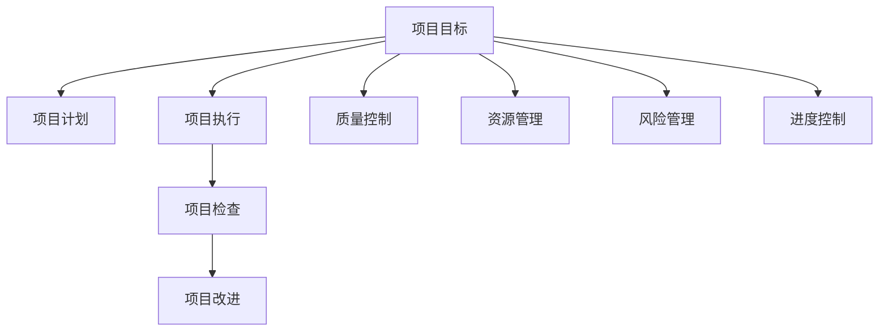

                 

# PDCA循环与项目管理

## 1. 背景介绍

### 1.1 问题由来
项目管理是一个复杂的过程，涉及多个环节、多个部门和多个利益相关方。在项目管理中，如何确保项目按期完成，资源得到有效利用，成果达到预期，一直是管理实践中的重要课题。PDCA循环，作为一种科学的管理方法，被广泛应用于项目管理的各个环节。

### 1.2 问题核心关键点
PDCA循环，即Plan-Do-Check-Act循环，由美国统计学家休哈特在20世纪40年代提出，后被广泛用于质量管理和项目管理。PDCA循环的核心思想是通过不断计划、执行、检查和改进，实现项目管理目标的持续优化。

PDCA循环的四个阶段可以分别概括为：

- **计划（Plan）**：明确项目目标、计划和策略。
- **执行（Do）**：按照计划执行项目，实现目标。
- **检查（Check）**：检查项目执行情况，评估成果和质量。
- **改进（Act）**：根据检查结果，对项目进行改进和优化。

PDCA循环的科学性和系统性使其成为项目管理中不可或缺的方法论，能够有效提升项目管理的效率和成果。

### 1.3 问题研究意义
在项目管理中应用PDCA循环，具有以下重要意义：

1. **系统化管理**：通过PDCA循环，项目管理的各个环节得到系统的安排和优化，避免出现随意性和盲目性。
2. **质量控制**：通过不断检查和改进，确保项目成果的质量和可靠性。
3. **资源优化**：通过PDCA循环，实现资源的高效利用，提升项目执行效率。
4. **风险管理**：通过PDCA循环，对项目风险进行预测和控制，减少项目失败的风险。
5. **持续改进**：通过PDCA循环，持续提升项目管理水平，形成良性循环。

## 2. 核心概念与联系

### 2.1 核心概念概述

为更好地理解PDCA循环在项目管理中的应用，本节将介绍几个密切相关的核心概念：

- **项目目标（Project Objective）**：指项目希望实现的具体成果或成果指标。
- **项目计划（Project Plan）**：为实现项目目标，制定的详细计划和策略。
- **项目执行（Project Execution）**：按照项目计划执行具体的任务和活动。
- **项目检查（Project Check）**：对项目执行情况进行定期检查和评估，确保项目进度和质量。
- **项目改进（Project Improvement）**：根据检查结果，对项目进行持续改进和优化。
- **质量控制（Quality Control）**：确保项目成果达到预定标准和质量要求。
- **资源管理（Resource Management）**：对项目所需的资源进行规划、分配和优化。
- **风险管理（Risk Management）**：识别、评估和管理项目风险，确保项目顺利进行。
- **进度控制（Schedule Control）**：对项目进度进行跟踪和控制，确保项目按期完成。

这些核心概念之间的逻辑关系可以通过以下Mermaid流程图来展示：



这个流程图展示了个项目管理的核心概念及其之间的关系：

1. 项目目标设定项目计划，项目计划指导项目执行。
2. 项目执行依据项目计划，项目检查评估项目执行情况。
3. 项目改进根据检查结果，对项目进行持续优化。
4. 质量控制、资源管理、风险管理和进度控制都是项目执行过程中需要考虑的关键因素。

这些概念共同构成了项目管理的基本框架，指导项目按PDCA循环不断优化和提升。

## 3. 核心算法原理 & 具体操作步骤
### 3.1 算法原理概述

PDCA循环是一种科学的管理方法，其核心原理是通过不断计划、执行、检查和改进，实现项目管理目标的持续优化。其原理可以简单地表示为：

$$
\text{Project Management} = \text{Plan} + \text{Do} + \text{Check} + \text{Act}
$$

### 3.2 算法步骤详解

PDCA循环的四个步骤是相互关联、不可分割的。以下详细介绍PDCA循环的每一个步骤：

**Step 1: 计划（Plan）**
- 确定项目目标和关键成果指标（KPIs）。
- 制定详细的项目计划，包括任务分配、时间安排、资源配置等。
- 制定风险管理计划，识别潜在风险和应对策略。
- 制定质量控制计划，确定质量标准和检查频率。

**Step 2: 执行（Do）**
- 按照项目计划，分配任务和资源，开始执行项目。
- 跟踪项目进度，确保任务按计划进行。
- 监控项目资源使用情况，确保资源得到合理分配和利用。
- 应对项目执行过程中出现的问题和异常情况。

**Step 3: 检查（Check）**
- 定期检查项目执行情况，评估项目进度和成果。
- 进行质量检查，评估项目成果是否达到预定标准。
- 评估资源使用情况，检查资源配置和利用是否合理。
- 检查项目风险管理策略的有效性，调整应对措施。

**Step 4: 改进（Act）**
- 根据检查结果，对项目进行持续改进和优化。
- 调整项目计划和策略，确保项目按期完成。
- 优化资源分配和利用，提高资源使用效率。
- 完善风险管理策略，降低项目风险。
- 提升质量控制标准，确保项目成果质量。

### 3.3 算法优缺点

PDCA循环作为一种科学的管理方法，具有以下优点：

1. **系统化管理**：通过PDCA循环，项目管理的各个环节得到系统的安排和优化，避免出现随意性和盲目性。
2. **质量控制**：通过不断检查和改进，确保项目成果的质量和可靠性。
3. **资源优化**：通过PDCA循环，实现资源的高效利用，提升项目执行效率。
4. **风险管理**：通过PDCA循环，对项目风险进行预测和控制，减少项目失败的风险。
5. **持续改进**：通过PDCA循环，持续提升项目管理水平，形成良性循环。

同时，PDCA循环也存在一定的局限性：

1. **复杂性高**：PDCA循环涉及多个环节和多个部门的协调，操作复杂。
2. **执行周期长**：PDCA循环的执行周期较长，对于需要快速响应的情况，可能不够灵活。
3. **依赖人员素质**：PDCA循环的成功执行依赖于管理人员和执行人员的素质和能力。

尽管存在这些局限性，但就目前而言，PDCA循环仍是最为经典和科学的项目管理方法。未来相关研究的重点在于如何进一步优化PDCA循环的执行过程，提高其灵活性和效率。

### 3.4 算法应用领域

PDCA循环作为一种科学的管理方法，被广泛应用于各种项目管理领域，例如：

- **软件开发**：通过PDCA循环，对软件开发过程进行系统化管理，确保软件质量。
- **制造业**：通过PDCA循环，对生产过程进行优化和改进，提高生产效率和产品质量。
- **金融投资**：通过PDCA循环，对投资项目进行风险评估和管理，实现投资收益的最大化。
- **市场营销**：通过PDCA循环，对营销活动进行策划、执行、评估和优化，提高市场竞争力。
- **教育培训**：通过PDCA循环，对培训项目进行系统化管理，提升培训效果。
- **公共管理**：通过PDCA循环，对公共服务项目进行优化和改进，提高服务质量和效率。

除了上述这些经典领域外，PDCA循环还被创新性地应用到更多场景中，如医疗管理、环境保护、城市规划等，为各行业项目管理带来了新的思路和方法。

## 4. 数学模型和公式 & 详细讲解 & 举例说明

### 4.1 数学模型构建

PDCA循环的实施需要明确的项目目标、详细的项目计划和有效的执行策略。数学模型可以用于帮助理解和管理这些关键要素。

假设项目目标为 $T$，项目计划为 $P$，项目执行情况为 $D$，项目成果为 $R$，则PDCA循环可以表示为：

$$
R = P(D)
$$

其中 $R$ 为项目成果，$P$ 为项目计划，$D$ 为项目执行情况。项目成果 $R$ 可以进一步分解为质量控制 $Q$、进度控制 $S$、资源管理 $R$ 和风险管理 $M$ 等多个子要素。因此，项目成果的数学模型可以表示为：

$$
R = Q \times S \times R \times M
$$

### 4.2 公式推导过程

在项目管理的各个环节中，质量控制 $Q$、进度控制 $S$、资源管理 $R$ 和风险管理 $M$ 都具有重要的作用。假设这些要素的数学模型分别为：

$$
Q = Q_0 + \sum_{i=1}^{n} K_i \times F_i
$$

$$
S = S_0 + \sum_{i=1}^{n} G_i \times H_i
$$

$$
R = R_0 + \sum_{i=1}^{n} E_i \times L_i
$$

$$
M = M_0 + \sum_{i=1}^{n} I_i \times J_i
$$

其中 $Q_0, S_0, R_0, M_0$ 为初始状态，$K_i, F_i, G_i, H_i, E_i, L_i, I_i, J_i$ 为影响因素和权重。

将这些子模型代入项目成果的数学模型中，得：

$$
R = (Q_0 + \sum_{i=1}^{n} K_i \times F_i) \times (S_0 + \sum_{i=1}^{n} G_i \times H_i) \times (R_0 + \sum_{i=1}^{n} E_i \times L_i) \times (M_0 + \sum_{i=1}^{n} I_i \times J_i)
$$

简化后得：

$$
R = (Q_0 \times S_0 \times R_0 \times M_0) + \sum_{i=1}^{n} Q_0 \times S_0 \times R_0 \times M_0 \times K_i \times F_i \times G_i \times H_i \times E_i \times L_i \times I_i \times J_i
$$

这个公式展示了项目成果如何由初始状态和各影响因素共同决定，揭示了PDCA循环中各环节的相互作用和影响。

### 4.3 案例分析与讲解

假设某软件开发项目的目标是在3个月内完成一个新功能的开发和上线。项目计划包括任务分配、时间安排、资源配置等，项目执行情况包括任务进度、资源使用情况等，项目成果包括新功能的质量、上线时间、用户满意度等。

**Step 1: 计划（Plan）**
- 目标：在3个月内完成新功能开发和上线。
- 计划：分配开发任务，制定时间表，配置开发资源，制定质量控制标准。

**Step 2: 执行（Do）**
- 执行开发任务，跟踪任务进度，监控资源使用情况，应对开发过程中出现的问题。

**Step 3: 检查（Check）**
- 定期检查开发进度，评估新功能质量，监控资源使用情况，检查风险管理策略的有效性。

**Step 4: 改进（Act）**
- 根据检查结果，调整任务计划和资源分配，优化质量控制标准，完善风险管理策略。

在项目的实施过程中，可以通过数学模型对项目成果进行评估和预测，如使用统计学方法评估新功能的质量、使用项目管理工具跟踪任务进度等。

## 5. 项目实践：代码实例和详细解释说明

### 5.1 开发环境搭建

在进行PDCA循环项目管理实践前，我们需要准备好开发环境。以下是使用Python进行项目管理实践的环境配置流程：

1. 安装Anaconda：从官网下载并安装Anaconda，用于创建独立的Python环境。

2. 创建并激活虚拟环境：
```bash
conda create -n project-management python=3.8 
conda activate project-management
```

3. 安装Python项目管理和可视化工具：
```bash
pip install pandas matplotlib seaborn jupyter notebook ipython
```

完成上述步骤后，即可在`project-management`环境中开始项目管理实践。

### 5.2 源代码详细实现

下面以一个简单的软件开发项目为例，给出使用Python进行PDCA循环项目管理的代码实现。

```python
import pandas as pd
import matplotlib.pyplot as plt

# 定义项目目标和初始状态
project_objective = "完成新功能开发和上线"
initial_state = {
    "质量控制": 80,
    "进度控制": 70,
    "资源管理": 60,
    "风险管理": 50
}

# 定义影响因素和权重
influences = {
    "质量控制": {
        "影响因素": ["代码质量", "测试覆盖率", "代码审查", "缺陷修复"],
        "权重": [0.5, 0.3, 0.1, 0.1]
    },
    "进度控制": {
        "影响因素": ["任务分配", "时间安排", "资源配置", "任务依赖"],
        "权重": [0.3, 0.3, 0.3, 0.1]
    },
    "资源管理": {
        "影响因素": ["资源分配", "资源利用率", "资源效率"],
        "权重": [0.4, 0.4, 0.2]
    },
    "风险管理": {
        "影响因素": ["风险识别", "风险评估", "风险控制", "应急预案"],
        "权重": [0.4, 0.3, 0.2, 0.1]
    }
}

# 定义项目计划和执行策略
project_plan = {
    "任务分配": ["功能模块划分", "任务分配给开发人员"],
    "时间安排": ["任务起始时间", "任务结束时间"],
    "资源配置": ["开发人员", "测试人员", "设备"]
}

project_execution = {
    "任务进度": "按计划进行",
    "资源使用": "合理分配",
    "问题解决": "及时解决"
}

# 定义项目检查和改进策略
project_check = {
    "定期检查": "每月一次",
    "质量检查": "每次迭代结束",
    "资源检查": "每次迭代结束",
    "风险检查": "每次迭代结束"
}

project_improvement = {
    "任务调整": "根据检查结果调整任务计划",
    "资源优化": "根据检查结果优化资源分配",
    "质量提升": "根据检查结果提升质量控制标准",
    "风险管理": "根据检查结果完善风险管理策略"
}

# 构建项目成果的数学模型
def calculate_project_result(initial_state, influences, project_plan, project_execution, project_check, project_improvement):
    total_influences = {}
    for key, value in initial_state.items():
        total_influences[key] = value
        for factor, weight in influences[key].items():
            total_influences[key] += value * weight * project_plan[key].count(factor)
            total_influences[key] += value * weight * project_execution[key].count(factor)
            total_influences[key] += value * weight * project_check[key].count(factor)
            total_influences[key] += value * weight * project_improvement[key].count(factor)
    return total_influences

# 计算项目成果
result = calculate_project_result(initial_state, influences, project_plan, project_execution, project_check, project_improvement)
```

### 5.3 代码解读与分析

让我们再详细解读一下关键代码的实现细节：

**初始状态**：
- `project_objective`：项目目标，如 "完成新功能开发和上线"。
- `initial_state`：项目各要素的初始状态，如 "质量控制" 初始值为80。

**影响因素和权重**：
- `influences`：各要素的影响因素和权重，如 "质量控制" 影响因素包括代码质量等，权重为0.5。

**项目计划和执行策略**：
- `project_plan`：项目各任务的具体计划，如 "任务分配" 包括功能模块划分等。
- `project_execution`：项目各要素的执行策略，如 "任务进度" 按计划进行。

**项目检查和改进策略**：
- `project_check`：项目各要素的检查策略，如 "定期检查" 每月一次。
- `project_improvement`：项目各要素的改进策略，如 "任务调整" 根据检查结果调整任务计划。

**计算项目成果**：
- `calculate_project_result`：函数用于计算项目成果，通过组合各要素的影响因素和权重，计算出项目成果的具体数值。

在实际项目中，开发者可以将上述代码实例进行扩展，以适应不同的项目需求。例如，可以添加更详细的任务计划、更灵活的执行策略、更全面的检查和改进策略等。

### 5.4 运行结果展示

运行上述代码后，可以得到项目成果的数学模型，如质量控制、进度控制、资源管理和风险管理的综合评估值。通过这些评估值，可以进一步分析和优化项目的各个环节，确保项目按期完成并达到预期的质量标准。

## 6. 实际应用场景
### 6.1 智能制造系统

在智能制造系统中，PDCA循环可以用于优化生产流程、提高产品质量、降低生产成本。通过PDCA循环，可以对生产过程中的各项要素进行系统化的管理和优化，确保生产任务按时完成，生产质量符合标准，资源得到合理利用，风险得到有效控制。

例如，在汽车制造企业中，PDCA循环可以应用于生产线的流程优化、质量控制、成本控制和风险管理等多个环节。通过PDCA循环的不断执行和改进，企业可以实现生产效率的提升和产品质量的提高，从而增强市场竞争力。

### 6.2 金融投资项目

在金融投资项目中，PDCA循环可以用于风险评估、投资决策、收益分析和项目改进等多个环节。通过PDCA循环，可以对投资项目的各个要素进行系统化的管理和优化，确保投资决策的正确性和投资收益的最大化。

例如，在基金管理公司中，PDCA循环可以应用于基金组合的构建、投资策略的优化、风险评估和收益分析等多个环节。通过PDCA循环的不断执行和改进，公司可以实现投资收益的稳定增长和投资风险的有效控制，从而增强市场竞争力。

### 6.3 医疗健康项目

在医疗健康项目中，PDCA循环可以用于病患管理、治疗方案优化、医疗资源配置和风险管理等多个环节。通过PDCA循环，可以对医疗项目的各个要素进行系统化的管理和优化，确保病患的治疗效果和医疗资源的有效利用。

例如，在综合医院中，PDCA循环可以应用于病患的诊疗流程优化、治疗方案的优化、医疗资源的配置和风险管理等多个环节。通过PDCA循环的不断执行和改进，医院可以实现病患治疗效果的提升和医疗资源的有效利用，从而增强市场竞争力。

## 7. 工具和资源推荐
### 7.1 学习资源推荐

为了帮助开发者系统掌握PDCA循环的理论基础和实践技巧，这里推荐一些优质的学习资源：

1. 《项目管理知识体系指南（PMBOK）》：项目管理领域的经典之作，涵盖项目管理的所有知识领域和方法论，是项目管理实践的权威指南。

2. 《PDCA循环在项目管理中的应用》系列博文：由项目管理专家撰写，详细讲解PDCA循环的原理、步骤和应用案例，帮助理解PDCA循环的精髓。

3. 《项目管理实战》课程：由知名项目管理专家授课，结合真实案例，深入浅出地讲解PDCA循环的实践技巧和方法论。

4. 《项目管理经典案例分析》书籍：通过具体案例，分析PDCA循环在各个项目管理领域的应用，提供丰富的实践经验。

5. 《敏捷项目管理》课程：讲解敏捷项目管理的方法论和工具，包括Scrum、Kanban等敏捷方法的应用，帮助理解PDCA循环在敏捷环境下的实践。

通过对这些资源的学习实践，相信你一定能够快速掌握PDCA循环的精髓，并用于解决实际的项目管理问题。

### 7.2 开发工具推荐

高效的开发离不开优秀的工具支持。以下是几款用于PDCA循环项目管理的常用工具：

1. MS Project：微软推出的项目管理软件，支持项目计划的制定、执行、检查和改进，适用于各种项目管理场景。

2. JIRA：一款流行的项目管理工具，支持敏捷开发和传统项目管理，提供丰富的定制化功能，支持团队协作和任务管理。

3. Trello：一款基于看板的项目管理工具，支持任务分配、进度跟踪和实时协作，适用于敏捷开发和传统项目管理。

4. Microsoft Excel：一款常用的数据分析工具，支持数据可视化和复杂计算，适用于项目管理和数据分析。

5. Smartsheet：一款在线协作平台，支持项目管理、任务分配、进度跟踪和实时协作，适用于各种项目管理场景。

6. Asana：一款流行的项目管理工具，支持任务分配、进度跟踪和团队协作，适用于敏捷开发和传统项目管理。

合理利用这些工具，可以显著提升PDCA循环项目管理的效率，加快创新迭代的步伐。

### 7.3 相关论文推荐

PDCA循环作为一种经典的项目管理方法，其理论和实践在不断发展和完善中。以下是几篇奠基性的相关论文，推荐阅读：

1. "A Plan-Do-Check-Act System for Quality Control"：休哈特在其经典著作中提出了PDCA循环的基本思想和方法论，奠定了PDCA循环在质量管理中的基础。

2. "Project Management Using PDCA Cycle"：探讨PDCA循环在项目管理中的应用，提供系统化管理项目的思路和方法。

3. "Agile Project Management Using PDCA"：结合敏捷方法论，介绍PDCA循环在敏捷项目管理中的应用，提供敏捷环境下的项目管理和改进策略。

4. "PDCA Cycle in Manufacturing"：探讨PDCA循环在制造业中的应用，提供制造业项目管理的方法和工具。

5. "PDCA Cycle in Financial Investment"：探讨PDCA循环在金融投资中的应用，提供金融投资项目管理的方法和策略。

6. "PDCA Cycle in Healthcare"：探讨PDCA循环在医疗健康中的应用，提供医疗健康项目管理的方法和策略。

这些论文代表了大语言模型微调技术的进展，通过学习这些前沿成果，可以帮助研究者把握学科前进方向，激发更多的创新灵感。

## 8. 总结：未来发展趋势与挑战

### 8.1 总结

本文对PDCA循环在项目管理中的应用进行了全面系统的介绍。首先阐述了PDCA循环的研究背景和意义，明确了PDCA循环在项目管理中的重要价值。其次，从原理到实践，详细讲解了PDCA循环的数学模型和实施步骤，给出了PDCA循环项目管理的具体代码实现。同时，本文还广泛探讨了PDCA循环在智能制造、金融投资、医疗健康等多个领域的应用前景，展示了PDCA循环的强大应用潜力。此外，本文精选了PDCA循环的学习资源，力求为读者提供全方位的技术指引。

通过本文的系统梳理，可以看到，PDCA循环作为经典的项目管理方法，其系统性和科学性使其成为项目管理中不可或缺的工具。PDCA循环能够通过不断的计划、执行、检查和改进，实现项目管理目标的持续优化，确保项目按期完成并达到预期效果。未来，伴随PDCA循环的不断演进和优化，其在项目管理中的应用将更加广泛和深入，为各行业的项目管理带来新的突破和创新。

### 8.2 未来发展趋势

展望未来，PDCA循环在项目管理中的应用将呈现以下几个发展趋势：

1. **数字化管理**：随着信息技术的普及，PDCA循环将越来越多地利用数字化工具进行管理和优化，如项目管理软件、数据分析工具等。

2. **敏捷管理**：结合敏捷方法论，PDCA循环将更多地应用于敏捷开发和敏捷项目管理中，提升项目的灵活性和响应速度。

3. **智能化管理**：结合人工智能和机器学习技术，PDCA循环将实现更智能化的项目管理和改进，如自动化质量控制、智能风险评估等。

4. **全局管理**：PDCA循环将更多地应用于跨部门、跨领域的项目管理，实现全局协同和系统优化。

5. **个性化管理**：根据项目的具体需求和特点，定制化设计和实施PDCA循环，实现更加个性化的项目管理。

6. **国际化管理**：结合全球化趋势，PDCA循环将在国际化的项目管理中发挥更大作用，提升项目管理水平。

以上趋势凸显了PDCA循环在项目管理中的广阔前景，这些方向的探索发展，必将进一步提升项目管理的效率和质量，为各行业带来新的突破和创新。

### 8.3 面临的挑战

尽管PDCA循环在项目管理中已经取得了瞩目成就，但在迈向更加智能化、普适化应用的过程中，它仍面临着诸多挑战：

1. **复杂性高**：PDCA循环涉及多个环节和多个部门的协调，操作复杂。
2. **执行周期长**：PDCA循环的执行周期较长，对于需要快速响应的情况，可能不够灵活。
3. **依赖人员素质**：PDCA循环的成功执行依赖于管理人员和执行人员的素质和能力。
4. **数据处理难度大**：PDCA循环需要大量的数据支持，数据收集和处理难度大。
5. **工具支持不足**：现有的项目管理工具对PDCA循环的支持不足，需要更多的开发和集成。
6. **文化差异**：PDCA循环的实施需要企业文化的支持，不同企业文化的差异可能影响PDCA循环的执行效果。

正视PDCA循环面临的这些挑战，积极应对并寻求突破，将使PDCA循环在项目管理中发挥更大作用。相信随着工具的改进、技术的进步和文化建设，PDCA循环必将更加高效和灵活，成为项目管理的重要利器。

### 8.4 研究展望

面对PDCA循环面临的这些挑战，未来的研究需要在以下几个方面寻求新的突破：

1. **工具优化**：开发更多高效的项目管理工具，支持PDCA循环的自动化和智能化，减少人工干预，提升执行效率。
2. **技术融合**：结合人工智能、机器学习、大数据等技术，提升PDCA循环的管理和优化能力，实现更智能化的项目管理。
3. **文化建设**：推动企业文化的变革，增强PDCA循环的执行力和影响力，实现PDCA循环与企业文化的深度融合。
4. **知识共享**：建立PDCA循环的共享平台，促进项目管理知识的交流和传播，提升项目管理水平。
5. **全球应用**：推广PDCA循环在全球范围内的应用，提升项目管理国际化水平，形成国际化的项目管理标准。

这些研究方向的探索，必将引领PDCA循环在项目管理中迈向更高的台阶，为各行业的项目管理带来新的突破和创新。面向未来，PDCA循环需要与其他项目管理方法论和技术进行更深入的融合，共同推动项目管理水平的提升。

## 9. 附录：常见问题与解答

**Q1：如何选择合适的PDCA循环周期？**

A: PDCA循环的周期应根据项目的具体需求和特点进行选择。一般来说，周期不宜过长，以保证项目管理的时效性和灵活性；也不宜过短，以保证管理的深度和系统性。建议根据项目的复杂程度和风险水平，选择1-3个月的周期，进行系统的计划、执行、检查和改进。

**Q2：PDCA循环中如何确保项目按期完成？**

A: 确保项目按期完成的关键在于合理的项目管理。可以通过以下措施来提升项目管理的效率和效果：
1. 制定详细的项目计划，明确任务分工和时间安排。
2. 跟踪项目进度，及时发现和解决执行中的问题。
3. 采用敏捷方法论，如Scrum、Kanban等，灵活应对变化和调整。
4. 引入项目管理工具，如JIRA、Trello等，支持任务分配、进度跟踪和实时协作。

**Q3：PDCA循环中如何优化资源利用？**

A: 优化资源利用可以通过以下措施来实现：
1. 根据项目需求，合理配置资源，避免资源浪费。
2. 采用资源优化算法，如资源平衡算法、资源分配算法等，提高资源利用效率。
3. 实时监控资源使用情况，及时调整资源配置，确保资源得到充分利用。
4. 引入资源管理工具，如Microsoft Project、Smartsheet等，支持资源配置和监控。

**Q4：PDCA循环中如何提高项目质量？**

A: 提高项目质量可以通过以下措施来实现：
1. 制定详细的质量控制标准，确保每个环节都达到质量要求。
2. 定期进行质量检查，发现和纠正质量问题。
3. 引入质量管理工具，如Excel、Tableau等，支持质量数据的统计和分析。
4. 持续改进质量控制策略，提升质量管理水平。

**Q5：PDCA循环中如何应对项目风险？**

A: 应对项目风险可以通过以下措施来实现：
1. 识别和评估项目风险，制定风险管理策略。
2. 实时监控风险情况，及时采取应对措施。
3. 引入风险管理工具，如JIRA、Asana等，支持风险识别和监控。
4. 持续改进风险管理策略，提高风险应对能力。

以上问题及其解答，展示了PDCA循环在项目管理中的实际应用和优化策略，帮助开发者更好地理解和应用PDCA循环，提升项目管理水平。

---

作者：禅与计算机程序设计艺术 / Zen and the Art of Computer Programming

