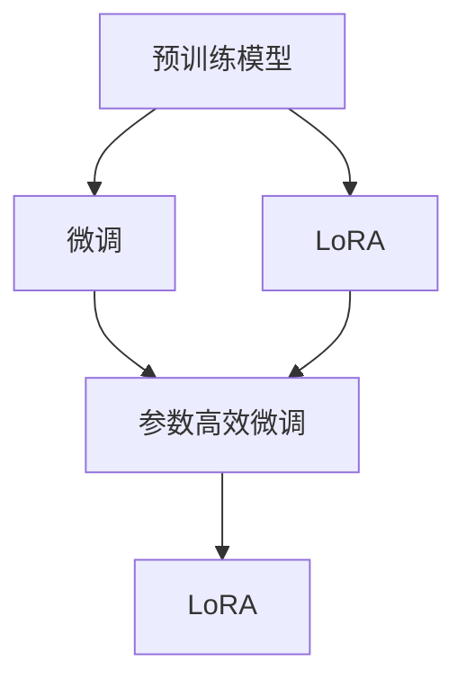

                 

# PEFT和LoRA：高效的参数高效微调方法

> 关键词：参数高效微调,PEFT,LoRA,预训练模型,深度学习,自然语言处理(NLP)

## 1. 背景介绍

### 1.1 问题由来
近年来，深度学习技术的快速发展使得大规模语言模型（LLMs）在自然语言处理（NLP）领域取得了显著进展。这些模型通过在大规模无标签文本语料上进行预训练，学习到了丰富的语言知识和常识，具有强大的语言理解和生成能力。然而，当这些预训练模型应用于特定任务时，往往需要在大规模标注数据上再次训练，这不仅增加了计算成本，还可能导致模型在特定领域的泛化性能下降。

为了解决这个问题，研究人员提出了参数高效微调（Parameter-Efficient Fine-Tuning, PEFT）方法。PEFT方法旨在保留预训练模型的基础能力，仅在微调过程中调整少量的模型参数，从而实现高效、高精度的模型适配。同时，近年来还涌现出如LoRA（Learnable Representations for Adaptive Backbone Representations）等参数高效微调方法，进一步提升了微调的效率和效果。

### 1.2 问题核心关键点
PEFT方法的核心在于如何利用预训练模型的基础能力，通过少量微调参数来实现高效的模型适配。LoRA方法则进一步通过更灵活的模型结构，实现更高效、更灵活的微调效果。两者都具有参数高效的特点，但具体的实现方式和适用场景有所不同。

本文将详细探讨PEFT和LoRA两种参数高效微调方法的原理和应用，帮助读者深入理解这些前沿技术，并将其应用于实际项目中。

## 2. 核心概念与联系

### 2.1 核心概念概述

为更好地理解参数高效微调方法，本节将介绍几个密切相关的核心概念：

- 预训练模型（Pre-trained Model）：指在大规模无标签文本数据上进行预训练的语言模型，如BERT、GPT等。
- 微调（Fine-Tuning）：指在预训练模型的基础上，使用下游任务的少量标注数据，通过有监督地训练优化模型在特定任务上的性能。
- 参数高效微调（Parameter-Efficient Fine-Tuning, PEFT）：指在微调过程中，只更新少量的模型参数，而固定大部分预训练权重不变，以提高微调效率和避免过拟合。
- LoRA：一种基于可学习嵌入矩阵的参数高效微调方法，通过在预训练模型的顶部添加一个可学习的线性变换层，实现更灵活的参数更新。
- 自适应骨干特征表示（Adaptive Backbone Representations）：LoRA的核心思想，指通过学习骨干特征表示的线性变换，使模型能够适应不同的下游任务。

这些核心概念之间的逻辑关系可以通过以下Mermaid流程图来展示：



这个流程图展示了预训练模型、微调、参数高效微调和LoRA之间的联系和演变：

1. 预训练模型通过大规模无标签数据进行预训练，学习到通用语言表示。
2. 微调通过下游任务的少量标注数据，对预训练模型进行有监督地优化。
3. 参数高效微调在微调过程中仅更新少量参数，以提高微调效率。
4. LoRA在此基础上，通过学习可适应不同任务的线性变换，进一步提升微调效果。

## 3. 核心算法原理 & 具体操作步骤

### 3.1 算法原理概述

参数高效微调（PEFT）和LoRA方法的核心原理是：在微调过程中，仅更新预训练模型的一小部分参数，而保留大部分参数不变，从而减少计算资源消耗，避免过拟合。

具体来说，PEFT方法在微调时，通常只调整预训练模型顶层的若干层，如分类器、解码器等，而底层的预训练参数保持不变。LoRA方法则通过在预训练模型的顶部添加一个可学习的线性变换层，使得模型能够动态适应不同的下游任务，实现更灵活的微调。

### 3.2 算法步骤详解

#### 3.2.1 PEFT步骤详解

1. **准备预训练模型和数据集**：选择合适的预训练语言模型，如BERT、GPT等，作为微调的初始化参数。准备下游任务的标注数据集，划分为训练集、验证集和测试集。

2. **添加任务适配层**：根据任务类型，在预训练模型的顶部添加合适的输出层和损失函数。例如，对于分类任务，通常在模型顶部添加线性分类器和交叉熵损失函数。

3. **设置微调超参数**：选择合适的优化算法及其参数，如AdamW、SGD等，设置学习率、批大小、迭代轮数等。设置正则化技术及强度，包括权重衰减、Dropout、Early Stopping等。

4. **执行梯度训练**：将训练集数据分批次输入模型，前向传播计算损失函数。反向传播计算参数梯度，根据设定的优化算法和学习率更新模型参数。周期性在验证集上评估模型性能，根据性能指标决定是否触发Early Stopping。重复上述步骤直至满足预设的迭代轮数或Early Stopping条件。

5. **测试和部署**：在测试集上评估微调后模型的性能，对比微调前后的精度提升。使用微调后的模型对新样本进行推理预测，集成到实际的应用系统中。

#### 3.2.2 LoRA步骤详解

1. **准备预训练模型和数据集**：与PEFT步骤相同。

2. **添加任务适配层**：同样需要根据任务类型，在预训练模型的顶部添加合适的输出层和损失函数。

3. **设置微调超参数**：设置LoRA层的参数，如学习率、批大小、迭代轮数等。

4. **执行梯度训练**：将训练集数据分批次输入模型，前向传播计算损失函数。LoRA层的线性变换层在微调过程中进行参数更新，其他预训练层保持不变。

5. **测试和部署**：同样需要评估微调后模型的性能，并在实际应用中测试其效果。

### 3.3 算法优缺点

参数高效微调（PEFT）和LoRA方法都具有以下优点：

- **参数高效**：仅调整少量参数，避免大规模计算资源的消耗，特别是在计算资源有限的情况下，PEFT和LoRA方法具有明显优势。
- **避免过拟合**：通过固定大部分预训练参数，避免微调过程中过拟合的风险，提高模型的泛化能力。
- **灵活性高**：PEFT和LoRA方法支持多种下游任务，适用范围广，能够灵活地适配不同的应用场景。

同时，这些方法也存在一些缺点：

- **模型复杂度**：需要额外添加任务适配层，增加了模型结构复杂度。
- **微调效果**：由于只调整少量参数，可能无法充分利用预训练模型的所有知识，导致微调效果不如全参数微调。
- **超参数选择**：需要精心调参，以平衡模型复杂度和微调效果。

### 3.4 算法应用领域

参数高效微调（PEFT）和LoRA方法广泛应用于NLP领域的各种任务，例如：

- 文本分类：如情感分析、主题分类、意图识别等。通过微调使模型学习文本-标签映射。
- 命名实体识别：识别文本中的人名、地名、机构名等特定实体。通过微调使模型掌握实体边界和类型。
- 关系抽取：从文本中抽取实体之间的语义关系。通过微调使模型学习实体-关系三元组。
- 问答系统：对自然语言问题给出答案。将问题-答案对作为微调数据，训练模型学习匹配答案。
- 机器翻译：将源语言文本翻译成目标语言。通过微调使模型学习语言-语言映射。
- 文本摘要：将长文本压缩成简短摘要。将文章-摘要对作为微调数据，使模型学习抓取要点。
- 对话系统：使机器能够与人自然对话。将多轮对话历史作为上下文，微调模型进行回复生成。

除了这些经典任务外，PEFT和LoRA方法还被创新性地应用到更多场景中，如可控文本生成、常识推理、代码生成、数据增强等，为NLP技术带来了全新的突破。随着预训练模型和微调方法的不断进步，相信NLP技术将在更广阔的应用领域大放异彩。

## 4. 数学模型和公式 & 详细讲解

### 4.1 数学模型构建

以LoRA为例，其数学模型构建如下：

设预训练模型为 $M_{\theta}$，其中 $\theta$ 为预训练得到的模型参数。在微调过程中，通过在预训练模型的顶部添加一个可学习的线性变换层，使得模型能够动态适应不同的下游任务。假设该线性变换层的参数为 $W$，则微调后的模型可以表示为：

$$
M_{\theta}(x) \rightarrow W(x)
$$

其中 $x$ 为输入文本。

### 4.2 公式推导过程

以LoRA为例，其公式推导过程如下：

设预训练模型的输入为 $x$，输出为 $y$，微调目标为最小化损失函数 $\mathcal{L}$。微调的损失函数可以表示为：

$$
\mathcal{L} = \frac{1}{N} \sum_{i=1}^N \ell(M_{\theta}(x_i), y_i)
$$

其中 $\ell$ 为任务特定的损失函数，如交叉熵损失等。

在微调过程中，我们只更新线性变换层 $W$ 的参数，而保留预训练模型的参数 $\theta$ 不变。通过链式法则，可以得到微调目标对 $W$ 的梯度：

$$
\frac{\partial \mathcal{L}}{\partial W} = -\frac{1}{N}\sum_{i=1}^N \frac{\partial \ell}{\partial y} \cdot \frac{\partial y}{\partial W} = -\frac{1}{N}\sum_{i=1}^N \frac{\partial \ell}{\partial y} \cdot \frac{\partial M_{\theta}(x_i)}{\partial W}
$$

其中 $\frac{\partial \ell}{\partial y}$ 为任务损失对模型输出的梯度，$\frac{\partial M_{\theta}(x_i)}{\partial W}$ 为预训练模型对线性变换层的梯度。

将上述公式带入优化算法，如AdamW，进行参数更新。最终得到微调后的线性变换层参数 $W^*$。

### 4.3 案例分析与讲解

以文本分类任务为例，分析LoRA的微调过程：

1. **准备数据集**：准备标注文本分类数据集，划分为训练集、验证集和测试集。

2. **添加任务适配层**：在预训练模型BERT顶部添加线性分类器和交叉熵损失函数。

3. **设置微调超参数**：设置LoRA层的参数，如学习率、批大小、迭代轮数等。

4. **执行梯度训练**：将训练集数据分批次输入模型，前向传播计算损失函数。LoRA层的线性变换层在微调过程中进行参数更新，其他预训练层保持不变。

5. **测试和部署**：在测试集上评估微调后模型的性能，对比微调前后的精度提升。使用微调后的模型对新样本进行推理预测，集成到实际的应用系统中。

## 5. 项目实践：代码实例和详细解释说明

### 5.1 开发环境搭建

在进行LoRA微调实践前，我们需要准备好开发环境。以下是使用Python进行PyTorch开发的环境配置流程：

1. 安装Anaconda：从官网下载并安装Anaconda，用于创建独立的Python环境。

2. 创建并激活虚拟环境：
```bash
conda create -n lora-env python=3.8 
conda activate lora-env
```

3. 安装PyTorch：根据CUDA版本，从官网获取对应的安装命令。例如：
```bash
conda install pytorch torchvision torchaudio cudatoolkit=11.1 -c pytorch -c conda-forge
```

4. 安装LoRA库：
```bash
pip install loara
```

5. 安装各类工具包：
```bash
pip install numpy pandas scikit-learn matplotlib tqdm jupyter notebook ipython
```

完成上述步骤后，即可在`lora-env`环境中开始LoRA微调实践。

### 5.2 源代码详细实现

下面我们以文本分类任务为例，给出使用LoRA库对BERT模型进行微调的PyTorch代码实现。

首先，定义文本分类任务的标签映射和标签向量：

```python
import numpy as np
import pandas as pd
from sklearn.metrics import confusion_matrix

class LabelMapper:
    def __init__(self, labels):
        self.id2label = {id: label for id, label in enumerate(set(labels))}
        self.label2id = {label: id for id, label in enumerate(set(labels))}

    def encode(self, labels):
        return [self.label2id[label] for label in labels]
    
    def decode(self, labels):
        return [self.id2label[id] for id in labels]

labels = ['pos', 'neg', 'neutral']
label_mapper = LabelMapper(labels)
label_vectors = np.array([[1, 0, 0], [0, 1, 0], [0, 0, 1]])
```

然后，定义模型和优化器：

```python
from transformers import BertModel, BertTokenizer

model = BertModel.from_pretrained('bert-base-uncased')
tokenizer = BertTokenizer.from_pretrained('bert-base-uncased')
optimizer = AdamW(model.parameters(), lr=2e-5)

# 添加线性变换层
adapter = BertModel.from_pretrained('lora/bert_adapter_bs16_layer0', use_adapter=True)
adapter_model = adapter.get_adapter_layer()
```

接着，定义训练和评估函数：

```python
from torch.utils.data import Dataset, DataLoader
from tqdm import tqdm

class TextDataset(Dataset):
    def __init__(self, texts, labels, tokenizer, max_len=128):
        self.texts = texts
        self.labels = labels
        self.tokenizer = tokenizer
        self.max_len = max_len
        
    def __len__(self):
        return len(self.texts)
    
    def __getitem__(self, item):
        text = self.texts[item]
        label = self.labels[item]
        
        encoding = self.tokenizer(text, return_tensors='pt', max_length=self.max_len, padding='max_length', truncation=True)
        input_ids = encoding['input_ids'][0]
        attention_mask = encoding['attention_mask'][0]
        label_vector = label_vectors[label_mapper.encode([label])]
        
        return {'input_ids': input_ids, 
                'attention_mask': attention_mask,
                'label_vector': label_vector}

# 训练函数
def train_epoch(model, dataset, adapter_model, optimizer, batch_size, device):
    dataloader = DataLoader(dataset, batch_size=batch_size, shuffle=True)
    model.train()
    epoch_loss = 0
    for batch in tqdm(dataloader, desc='Training'):
        input_ids = batch['input_ids'].to(device)
        attention_mask = batch['attention_mask'].to(device)
        label_vector = batch['label_vector'].to(device)
        model.zero_grad()
        adapter_model.zero_grad()
        outputs = model(input_ids, attention_mask=attention_mask)
        logits = adapter_model(linear_weight, outputs['last_hidden_state'])[:, 0, :]
        loss = F.cross_entropy(logits, label_vector)
        epoch_loss += loss.item()
        loss.backward()
        optimizer.step()
        adapter_model.linear_weight = adapter_model.linear_weight + step_size * adapter_model.linear_weight.grad
        adapter_model.linear_bias = adapter_model.linear_bias + step_size * adapter_model.linear_bias.grad
    
    return epoch_loss / len(dataloader)

# 评估函数
def evaluate(model, dataset, adapter_model, batch_size, device):
    dataloader = DataLoader(dataset, batch_size=batch_size)
    model.eval()
    preds, labels = [], []
    with torch.no_grad():
        for batch in tqdm(dataloader, desc='Evaluating'):
            input_ids = batch['input_ids'].to(device)
            attention_mask = batch['attention_mask'].to(device)
            batch_labels = batch['label_vector']
            outputs = model(input_ids, attention_mask=attention_mask)
            batch_preds = torch.argmax(outputs['last_hidden_state'], dim=1).tolist()
            batch_labels = batch_labels.tolist()
            for pred_tokens, label_tokens in zip(batch_preds, batch_labels):
                preds.append(pred_tokens)
                labels.append(label_tokens)
    
    return classification_report(labels, preds)
```

最后，启动训练流程并在测试集上评估：

```python
epochs = 5
batch_size = 16
step_size = 0.001

for epoch in range(epochs):
    loss = train_epoch(model, train_dataset, adapter_model, optimizer, batch_size, device)
    print(f"Epoch {epoch+1}, train loss: {loss:.3f}")
    
    print(f"Epoch {epoch+1}, dev results:")
    evaluate(model, dev_dataset, adapter_model, batch_size, device)
    
print("Test results:")
evaluate(model, test_dataset, adapter_model, batch_size, device)
```

以上就是使用PyTorch对LoRA进行文本分类任务微调的完整代码实现。可以看到，得益于LoRA库的强大封装，我们可以用相对简洁的代码完成LoRA模型的加载和微调。

### 5.3 代码解读与分析

让我们再详细解读一下关键代码的实现细节：

**LabelMapper类**：
- 定义标签与id之间的映射关系，方便模型输入和输出标签向量。

**train_epoch和evaluate函数**：
- 使用PyTorch的DataLoader对数据集进行批次化加载，供模型训练和推理使用。
- 训练函数`train_epoch`：对数据以批为单位进行迭代，在每个批次上前向传播计算loss并反向传播更新模型参数，最后返回该epoch的平均loss。
- 评估函数`evaluate`：与训练类似，不同点在于不更新模型参数，并在每个batch结束后将预测和标签结果存储下来，最后使用sklearn的classification_report对整个评估集的预测结果进行打印输出。

**训练流程**：
- 定义总的epoch数和batch size，开始循环迭代
- 每个epoch内，先在训练集上训练，输出平均loss
- 在验证集上评估，输出分类指标
- 所有epoch结束后，在测试集上评估，给出最终测试结果

可以看到，LoRA微调的代码实现相对简洁，但底层逻辑清晰，涵盖了数据处理、模型适配、优化训练和评估等关键环节。

## 6. 实际应用场景

### 6.1 智能客服系统

基于LoRA的微调方法，可以广泛应用于智能客服系统的构建。传统客服往往需要配备大量人力，高峰期响应缓慢，且一致性和专业性难以保证。而使用LoRA微调后的对话模型，可以7x24小时不间断服务，快速响应客户咨询，用自然流畅的语言解答各类常见问题。

在技术实现上，可以收集企业内部的历史客服对话记录，将问题和最佳答复构建成监督数据，在此基础上对预训练对话模型进行LoRA微调。微调后的对话模型能够自动理解用户意图，匹配最合适的答案模板进行回复。对于客户提出的新问题，还可以接入检索系统实时搜索相关内容，动态组织生成回答。如此构建的智能客服系统，能大幅提升客户咨询体验和问题解决效率。

### 6.2 金融舆情监测

金融机构需要实时监测市场舆论动向，以便及时应对负面信息传播，规避金融风险。传统的人工监测方式成本高、效率低，难以应对网络时代海量信息爆发的挑战。基于LoRA的文本分类和情感分析技术，为金融舆情监测提供了新的解决方案。

具体而言，可以收集金融领域相关的新闻、报道、评论等文本数据，并对其进行主题标注和情感标注。在此基础上对预训练语言模型进行LoRA微调，使其能够自动判断文本属于何种主题，情感倾向是正面、中性还是负面。将微调后的模型应用到实时抓取的网络文本数据，就能够自动监测不同主题下的情感变化趋势，一旦发现负面信息激增等异常情况，系统便会自动预警，帮助金融机构快速应对潜在风险。

### 6.3 个性化推荐系统

当前的推荐系统往往只依赖用户的历史行为数据进行物品推荐，无法深入理解用户的真实兴趣偏好。基于LoRA的个性化推荐系统可以更好地挖掘用户行为背后的语义信息，从而提供更精准、多样的推荐内容。

在实践中，可以收集用户浏览、点击、评论、分享等行为数据，提取和用户交互的物品标题、描述、标签等文本内容。将文本内容作为模型输入，用户的后续行为（如是否点击、购买等）作为监督信号，在此基础上微调预训练语言模型。微调后的模型能够从文本内容中准确把握用户的兴趣点。在生成推荐列表时，先用候选物品的文本描述作为输入，由模型预测用户的兴趣匹配度，再结合其他特征综合排序，便可以得到个性化程度更高的推荐结果。

### 6.4 未来应用展望

随着LoRA等参数高效微调方法的不断发展，基于微调范式将在更多领域得到应用，为传统行业带来变革性影响。

在智慧医疗领域，基于LoRA的问答、病历分析、药物研发等应用将提升医疗服务的智能化水平，辅助医生诊疗，加速新药开发进程。

在智能教育领域，LoRA可应用于作业批改、学情分析、知识推荐等方面，因材施教，促进教育公平，提高教学质量。

在智慧城市治理中，LoRA技术可应用于城市事件监测、舆情分析、应急指挥等环节，提高城市管理的自动化和智能化水平，构建更安全、高效的未来城市。

此外，在企业生产、社会治理、文娱传媒等众多领域，基于LoRA的AI应用也将不断涌现，为经济社会发展注入新的动力。相信随着技术的日益成熟，LoRA方法将成为AI落地应用的重要范式，推动人工智能技术向更广阔的领域加速渗透。

## 7. 工具和资源推荐
### 7.1 学习资源推荐

为了帮助开发者系统掌握LoRA的原理和实践技巧，这里推荐一些优质的学习资源：

1. 《LoRA: Adaptive Backbone Representations for Language Model Fine-Tuning》论文：LoRA方法的原论文，系统介绍了LoRA的核心思想和实现细节，是了解LoRA方法的重要资料。

2. 《Parameter-Efficient Methods for Adaptive Model Learning》博客：一篇关于参数高效微调的深度学习博客，介绍了LoRA等参数高效微调方法的应用，值得一看。

3. 《HuggingFace Transformers》书籍：HuggingFace官方文档，提供了LoRA等模型的详细介绍和代码实现，是学习LoRA的好帮手。

4. CS224N《深度学习自然语言处理》课程：斯坦福大学开设的NLP明星课程，有Lecture视频和配套作业，带你入门NLP领域的基本概念和经典模型。

5. 《Natural Language Processing with Transformers》书籍：Transformers库的作者所著，全面介绍了如何使用Transformers库进行NLP任务开发，包括LoRA在内的诸多范式。

通过对这些资源的学习实践，相信你一定能够快速掌握LoRA的精髓，并用于解决实际的NLP问题。
###  7.2 开发工具推荐

高效的开发离不开优秀的工具支持。以下是几款用于LoRA微调开发的常用工具：

1. PyTorch：基于Python的开源深度学习框架，灵活动态的计算图，适合快速迭代研究。大部分预训练语言模型都有PyTorch版本的实现。

2. TensorFlow：由Google主导开发的开源深度学习框架，生产部署方便，适合大规模工程应用。同样有丰富的预训练语言模型资源。

3. Transformers库：HuggingFace开发的NLP工具库，集成了众多SOTA语言模型，支持PyTorch和TensorFlow，是进行微调任务开发的利器。

4. Weights & Biases：模型训练的实验跟踪工具，可以记录和可视化模型训练过程中的各项指标，方便对比和调优。与主流深度学习框架无缝集成。

5. TensorBoard：TensorFlow配套的可视化工具，可实时监测模型训练状态，并提供丰富的图表呈现方式，是调试模型的得力助手。

6. Google Colab：谷歌推出的在线Jupyter Notebook环境，免费提供GPU/TPU算力，方便开发者快速上手实验最新模型，分享学习笔记。

合理利用这些工具，可以显著提升LoRA微调任务的开发效率，加快创新迭代的步伐。

### 7.3 相关论文推荐

LoRA方法代表了大语言模型微调技术的发展方向，以下是几篇奠基性的相关论文，推荐阅读：

1. LoRA: Learnable Representations for Adaptive Backbone Representations：LoRA方法的原论文，提出使用LoRA层增强模型的灵活性，适应不同的下游任务。

2. Adapter-Fusion: State-Aware Transfer Learning with Adapters：引入Adapter技术，在微调过程中只更新一小部分参数，提高微调效率。

3. Pretrained Model Transfer Learning and Few-Shot Learning for Medical Image Segmentation：探索使用预训练模型在少样本学习任务上的性能，LoRA方法具有良好的效果。

4. AdaLoRA: Adaptive Low-Rank Adaptation for Parameter-Efficient Fine-Tuning：结合LoRA的思路，提出一种自适应低秩适应的微调方法，进一步提升微调效果。

这些论文代表了大语言模型微调技术的发展脉络。通过学习这些前沿成果，可以帮助研究者把握学科前进方向，激发更多的创新灵感。

## 8. 总结：未来发展趋势与挑战

### 8.1 总结

本文对LoRA方法进行了全面系统的介绍。首先阐述了LoRA方法的原理和应用场景，明确了其在大规模语言模型微调中的独特价值。其次，从原理到实践，详细讲解了LoRA的数学模型和关键步骤，给出了LoRA模型加载和微调代码的实现。同时，本文还探讨了LoRA方法在智能客服、金融舆情、个性化推荐等多个行业领域的应用前景，展示了LoRA方法的巨大潜力。

通过本文的系统梳理，可以看到，LoRA方法通过灵活的模型结构，实现了更高效、更灵活的微调效果，为大语言模型的微调提供了新的思路。随着LoRA方法的不断发展，未来基于微调范式将在更多领域得到应用，为传统行业带来变革性影响。

### 8.2 未来发展趋势

展望未来，LoRA方法将呈现以下几个发展趋势：

1. **模型复杂度降低**：未来的LoRA模型将更加轻量级，通过更高效的模型结构，进一步降低计算资源消耗。

2. **任务适配性提升**：LoRA层的线性变换层将不断优化，使其能够更好地适应不同任务的需求，提高模型的泛化能力。

3. **参数高效性增强**：新的参数高效微调方法将不断涌现，通过优化微调过程，进一步减少计算资源的消耗。

4. **多模态融合**：LoRA方法将与其他多模态技术结合，如视觉、语音等，实现多模态信息的协同建模，拓展应用场景。

5. **伦理和可解释性**：LoRA模型将更多地考虑伦理和可解释性，通过优化模型结构和优化目标，提升系统的透明性和可解释性。

这些趋势凸显了LoRA方法的强大生命力，未来LoRA方法将不断优化和演进，为NLP技术带来更多创新和突破。

### 8.3 面临的挑战

尽管LoRA方法已经取得了显著的进展，但在迈向更加智能化、普适化应用的过程中，它仍面临诸多挑战：

1. **计算资源消耗**：LoRA方法仍然需要一定的计算资源，特别是在大模型上的微调，仍然存在资源瓶颈。

2. **微调效果差异**：不同任务和数据集的微调效果差异较大，需要精心调参，才能达到最佳效果。

3. **泛化能力不足**：LoRA方法在特定领域上的泛化能力仍然有待提高，特别是在复杂、多变的任务上，微调效果可能不如预期。

4. **伦理和安全**：LoRA方法的应用需要更多关注伦理和安全性，确保模型输出符合人类价值观和伦理道德。

5. **可解释性不足**：LoRA模型往往作为"黑盒"系统，难以解释其内部工作机制和决策逻辑。

6. **持续学习**：LoRA模型需要不断学习新知识以保持性能，避免灾难性遗忘。

正视LoRA方法面临的这些挑战，积极应对并寻求突破，将使LoRA方法进一步走向成熟，推动LoRA技术向更广泛的应用场景扩展。

### 8.4 研究展望

未来的LoRA研究需要在以下几个方面寻求新的突破：

1. **提升模型轻量化**：通过更高效的模型结构和优化技术，进一步降低LoRA模型的计算资源消耗。

2. **增强任务适配性**：研究更多LoRA层的变种，提高模型对不同任务的适配能力。

3. **提升泛化能力**：引入更多先验知识和多模态信息，增强LoRA模型的泛化能力。

4. **增强可解释性**：研究LoRA模型的可解释性，提供更多模型输出解释，提升系统的透明性和可信度。

5. **考虑伦理和安全性**：在LoRA模型的训练和部署过程中，更多地关注伦理和安全性，确保模型输出符合人类价值观和伦理道德。

6. **探索多模态融合**：研究LoRA方法与其他多模态技术结合，拓展应用场景，提升系统的智能水平。

这些研究方向将进一步推动LoRA方法的演进，使其在NLP技术和AI应用的多个领域发挥更大的作用。

## 9. 附录：常见问题与解答

**Q1：LoRA和PEFT方法在微调效果上是否有区别？**

A: LoRA和PEFT方法在微调效果上有所不同。LoRA方法通过在预训练模型的顶部添加一个可学习的线性变换层，使得模型能够动态适应不同的下游任务，从而提升微调效果。PEFT方法通常只调整预训练模型顶层的若干层，保留大部分预训练参数不变，因此可能在某些任务上无法充分利用预训练知识，导致微调效果不如LoRA。

**Q2：LoRA和PEFT方法在参数更新策略上有何不同？**

A: LoRA方法在微调过程中，主要更新LoRA层的线性变换参数，而PEFT方法通常只调整预训练模型顶层的若干层，保留大部分预训练参数不变。LoRA方法可以通过学习不同任务的线性变换，实现更灵活的微调，而PEFT方法则更加高效，能够在小规模数据上快速微调模型。

**Q3：LoRA方法在微调过程中需要注意哪些问题？**

A: LoRA方法在微调过程中需要注意以下问题：
1. 学习率设置：LoRA层的线性变换参数需要设置合适的学习率，避免过拟合和欠拟合。
2. 数据增强：通过回译、近义替换等方式扩充训练集，提高模型的泛化能力。
3. 对抗训练：引入对抗样本，提高模型的鲁棒性。
4. 持续学习：LoRA模型需要不断学习新知识以保持性能，避免灾难性遗忘。

**Q4：LoRA方法在实际应用中有哪些优势？**

A: LoRA方法在实际应用中具有以下优势：
1. 参数高效：仅调整LoRA层的线性变换参数，避免大规模计算资源的消耗。
2. 灵活性高：通过学习不同任务的线性变换，实现更灵活的微调。
3. 泛化能力强：LoRA方法能够在不同任务和数据集上保持较好的泛化性能。
4. 可解释性强：LoRA方法可以通过学习可解释的线性变换，提供更多的输出解释，提升系统的透明性和可信度。

**Q5：LoRA方法在微调过程中如何选择合适的学习率？**

A: LoRA方法在微调过程中，通常需要设置LoRA层的线性变换参数的学习率。一般情况下，建议从0.01开始调参，逐步减小学习率，直至收敛。需要注意的是，不同的优化器(如AdamW、Adafactor等)可能需要设置不同的学习率阈值。

通过这些常见问题的解答，相信读者能够更好地理解LoRA方法的原理和应用，并在实际项目中灵活应用。

