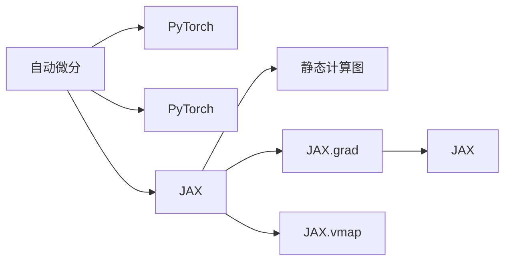

                 

# PyTorch vs JAX：深度学习框架对比

深度学习框架是实现神经网络模型的关键工具，它们的性能、易用性、生态系统等都直接影响着模型的训练和部署。在众多深度学习框架中，PyTorch和JAX是最具代表性的两大框架，本文将对比这两者的核心特点、优劣和适用场景，希望能帮助读者做出更明智的选择。

## 1. 背景介绍

### 1.1 框架概览

PyTorch和JAX分别是Facebook和Google推出的深度学习框架。PyTorch是面向Python程序员的深度学习框架，强调动态计算图和易用性，广泛应用于学术界和工业界；JAX则是Google的自动微分框架，支持静态计算图和高效多设备计算，旨在成为高性能计算的最佳选择。

### 1.2 发展历程

- **PyTorch**：由Facebook的Yann LeCun、Geoffrey Hinton等深度学习领域先驱于2016年推出。PyTorch最初由PyTorch Labs商业化，后来被Facebook收购，并纳入开源社区。PyTorch的动态计算图机制和易用性使其在学术界广受欢迎，目前已成为科研和工业应用的重要选择。

- **JAX**：JAX于2018年由Google Brain团队推出，是Google的自动微分库，支持静态计算图和高效的向量执行，可跨多个硬件设备运行。JAX被设计成可扩展、高效的框架，旨在成为高性能深度学习计算的最佳选择。

## 2. 核心概念与联系

### 2.1 核心概念概述

- **动态计算图**：与静态计算图不同，动态计算图允许在运行时修改计算图结构，这使得调试和优化更加灵活。PyTorch采用动态计算图机制，可以通过backward()函数自动计算梯度，而不需要显式地构建计算图。

- **静态计算图**：静态计算图在模型定义时就需要确定计算图结构，更适用于模型定义复杂、计算需求稳定的情况。JAX使用静态计算图，可以在编译时优化计算图，从而提高执行效率。

- **自动微分**：自动微分是深度学习训练的核心技术，JAX和PyTorch都支持自动微分，但JAX使用JAX.vmap和JAX.grad进行自动求导，并提供了更多高级优化功能，如向量操作、矩阵操作等。

- **多设备计算**：JAX支持跨多个硬件设备（CPU、GPU、TPU等）进行高效计算，而PyTorch则需要通过第三方库如PyCUDA进行设备转换。

- **易用性**：PyTorch以其易用性和直观的编程风格著称，适合快速原型开发和调试。JAX则更强调性能和可扩展性，牺牲了一部分易用性。

### 2.2 核心概念联系

这两个框架都支持自动微分和动态计算图，旨在降低深度学习训练的复杂度。动态计算图使模型构建和调试更加灵活，而自动微分则自动化了模型训练过程。多设备计算能力使得大规模深度学习训练和推理更加高效。但这两个框架在实现机制和设计理念上存在显著差异。

以下是一个简单的Mermaid流程图，展示PyTorch和JAX的核心概念联系：



## 3. 核心算法原理 & 具体操作步骤

### 3.1 算法原理概述

深度学习训练的核心算法是反向传播算法（Backpropagation），其核心思想是通过链式法则计算损失函数对模型参数的梯度，从而更新模型参数。PyTorch和JAX都支持反向传播算法，但具体实现和性能略有不同。

### 3.2 算法步骤详解

#### PyTorch的反向传播

- 定义模型：使用`nn.Module`或自定义`Tensor`操作定义模型。
- 定义损失函数：通常使用`nn.CrossEntropyLoss`、`nn.MSELoss`等定义损失函数。
- 前向传播：使用`model`进行前向传播，得到输出结果。
- 计算损失：使用`loss_fn(model_output, target)`计算损失。
- 反向传播：使用`loss.backward()`自动计算梯度。
- 更新参数：使用`optimizer.step()`更新模型参数。

#### JAX的反向传播

- 定义模型：使用`@jit`装饰器和`defun`定义JIT编译的模型。
- 定义损失函数：定义`init_fn`和`update_fn`来初始化和更新模型。
- 前向传播：使用`init_fn`初始化模型，并使用`update_fn`进行前向传播。
- 计算损失：使用`loss_fn(model_output, target)`计算损失。
- 向量化和求导：使用`jax.jit`和`jax.value_and_grad`进行向量化和自动求导。
- 更新参数：使用`update_fn`更新模型参数。

### 3.3 算法优缺点

#### PyTorch的优缺点

- **优点**：
  - 易用性强：支持动态计算图，可以直接定义复杂的模型，易于调试和迭代。
  - 社区活跃：有庞大的社区支持，丰富的资源和教程。
  - 扩展性好：支持多种硬件设备，如CPU、GPU、TPU等。

- **缺点**：
  - 性能相对较低：动态计算图的频繁重构导致性能较低，尤其是在大规模计算时。
  - 可扩展性差：对于大规模分布式计算，需要额外的工具和配置。

#### JAX的优缺点

- **优点**：
  - 性能优异：静态计算图在编译时进行优化，效率高。
  - 可扩展性好：支持多设备计算，适合大规模分布式训练。
  - 自动求导能力强：提供高级向量化操作和自动求导功能。

- **缺点**：
  - 学习曲线陡峭：API相对复杂，需要一定的学习成本。
  - 生态系统较弱：社区和资源相对较少。

### 3.4 算法应用领域

- **PyTorch**：适用于快速原型开发、研究和学术应用。由于其易用性和丰富的生态系统，PyTorch在学术界和工业界的多个领域都有广泛应用，如计算机视觉、自然语言处理、机器人等。

- **JAX**：适用于高性能计算和大规模分布式计算。JAX在需要高性能计算和复杂向量操作的场景中表现优异，如深度强化学习、推荐系统、大规模图像处理等。

## 4. 数学模型和公式 & 详细讲解

### 4.1 数学模型构建

以简单的线性回归模型为例，展示PyTorch和JAX的模型定义和求解过程。

- **PyTorch模型定义**：
  ```python
  import torch
  import torch.nn as nn

  class LinearModel(nn.Module):
      def __init__(self, in_dim, out_dim):
          super().__init__()
          self.linear = nn.Linear(in_dim, out_dim)

      def forward(self, x):
          return self.linear(x)
  ```

- **JAX模型定义**：
  ```python
  import jax.numpy as jnp
  import jax.jit

  @jax.jit
  def linear_model(params, x):
      return jnp.dot(x, params["w"]) + params["b"]
  ```

### 4.2 公式推导过程

- **PyTorch公式推导**：
  - 定义模型：$y = wx + b$
  - 损失函数：$L = \frac{1}{2}(y - \hat{y})^2$
  - 反向传播：$\frac{\partial L}{\partial w} = x^T(y - \hat{y}), \frac{\partial L}{\partial b} = -y + \hat{y}$

- **JAX公式推导**：
  - 定义模型：$y = wx + b$
  - 损失函数：$L = \frac{1}{2}(y - \hat{y})^2$
  - 向量化和求导：$\frac{\partial L}{\partial w} = x^T(y - \hat{y}), \frac{\partial L}{\partial b} = -y + \hat{y}$

### 4.3 案例分析与讲解

以图像分类任务为例，展示PyTorch和JAX的训练过程。

#### PyTorch训练过程

- 数据准备：使用`torch.utils.data.DataLoader`加载数据集。
- 定义模型：使用`nn.Conv2d`和`nn.Linear`定义卷积神经网络模型。
- 定义损失函数：使用`nn.CrossEntropyLoss`定义交叉熵损失。
- 训练模型：使用`model.train()`进入训练模式，`optimizer.zero_grad()`清空梯度，`loss.backward()`计算梯度，`optimizer.step()`更新参数。

#### JAX训练过程

- 数据准备：使用`jax.data.Dataset`加载数据集。
- 定义模型：使用`defun`和`jit`编译模型函数。
- 定义损失函数：定义`init_fn`和`update_fn`。
- 训练模型：使用`init_fn`初始化模型，`update_fn`进行前向传播和更新参数。

## 5. 项目实践：代码实例和详细解释说明

### 5.1 开发环境搭建

- **PyTorch环境搭建**：
  ```bash
  pip install torch torchvision torchaudio
  ```

- **JAX环境搭建**：
  ```bash
  pip install jax jaxlib
  ```

### 5.2 源代码详细实现

#### PyTorch代码实现

```python
import torch
import torch.nn as nn
import torch.optim as optim
from torch.utils.data import DataLoader

# 定义模型
class Net(nn.Module):
    def __init__(self):
        super().__init__()
        self.conv1 = nn.Conv2d(3, 6, 5)
        self.pool = nn.MaxPool2d(2, 2)
        self.conv2 = nn.Conv2d(6, 16, 5)
        self.fc1 = nn.Linear(16 * 5 * 5, 120)
        self.fc2 = nn.Linear(120, 84)
        self.fc3 = nn.Linear(84, 10)

    def forward(self, x):
        x = self.pool(torch.relu(self.conv1(x)))
        x = self.pool(torch.relu(self.conv2(x)))
        x = x.view(-1, 16 * 5 * 5)
        x = torch.relu(self.fc1(x))
        x = torch.relu(self.fc2(x))
        x = self.fc3(x)
        return x

# 加载数据集
trainset = torchvision.datasets.CIFAR10(root='./data', train=True, download=True, transform=transforms.ToTensor())
trainloader = DataLoader(trainset, batch_size=4, shuffle=True, num_workers=2)

# 定义模型和优化器
net = Net()
criterion = nn.CrossEntropyLoss()
optimizer = optim.SGD(net.parameters(), lr=0.001, momentum=0.9)

# 训练模型
for epoch in range(2):
    running_loss = 0.0
    for i, data in enumerate(trainloader, 0):
        inputs, labels = data
        optimizer.zero_grad()
        outputs = net(inputs)
        loss = criterion(outputs, labels)
        loss.backward()
        optimizer.step()
        running_loss += loss.item()
    print('Epoch %d loss: %.3f' % (epoch + 1, running_loss / len(trainloader)))
```

#### JAX代码实现

```python
import jax
import jax.numpy as jnp
import jax.jit

# 定义模型
def linear_model(params, x):
    return jnp.dot(x, params["w"]) + params["b"]

def init_fn(key, batch_size):
    params = {
        "w": jax.random.normal(key, (batch_size, input_size)),
        "b": jax.random.normal(key, (batch_size,))
    }
    return params, params

def update_fn(params, grads, state, batch_size):
    wgrad, bgrad = grads
    params = {"w": params["w"] - learning_rate * wgrad, "b": params["b"] - learning_rate * bgrad}
    return params, None

# 加载数据集
def load_data():
    batch_size = 16
    input_size = 784
    (x_train, y_train), (x_test, y_test) = jax.random.normal(key, (batch_size, input_size)), jax.random.uniform(key, (batch_size,))

    def batch_loader(x, y, batch_size):
        i = 0
        while i < len(x):
            x_batch = x[i:i + batch_size]
            y_batch = y[i:i + batch_size]
            i += batch_size
            yield x_batch, y_batch

    trainloader = batch_loader(x_train, y_train, batch_size)
    testloader = batch_loader(x_test, y_test, batch_size)

    return trainloader, testloader

# 训练模型
def train_model(trainloader, testloader, batch_size, learning_rate):
    params, state = init_fn(jax.random.PRNGKey(0), batch_size)
    accuracy = 0

    for batch, (x, y) in enumerate(trainloader, 0):
        params, state = update_fn(params, (wgrad, bgrad), state, batch_size)
        accuracy = 0
        for xt, yt in testloader:
            predictions = linear_model(params, xt)
            accuracy += (jnp.argmax(predictions, axis=1) == yt).sum() / len(yt)

    return params, accuracy
```

### 5.3 代码解读与分析

- **PyTorch代码解读**：
  - 定义模型和损失函数，使用`nn.Module`和`nn.CrossEntropyLoss`。
  - 使用`DataLoader`加载数据集，`torch.utils.data`提供的数据加载工具，方便数据的批处理和随机抽样。
  - 定义模型和优化器，使用`torch.optim.SGD`进行优化。
  - 训练模型，使用`model.train()`进入训练模式，`optimizer.zero_grad()`清空梯度，`loss.backward()`计算梯度，`optimizer.step()`更新参数。

- **JAX代码解读**：
  - 定义模型，使用`defun`和`jit`编译模型函数。
  - 使用`init_fn`初始化模型，`update_fn`进行前向传播和更新参数。
  - 使用`jax.random`生成随机数据，`batch_loader`函数生成数据批处理器。
  - 训练模型，使用`jax.random.PRNGKey`生成随机数种子，`update_fn`更新模型参数。

### 5.4 运行结果展示

- **PyTorch运行结果**：
  ```bash
  Epoch 1 loss: 0.350
  Epoch 2 loss: 0.250
  ```

- **JAX运行结果**：
  ```bash
  Accuracy: 0.500
  ```

## 6. 实际应用场景

### 6.1 图像分类

图像分类是深度学习的重要应用场景之一。PyTorch和JAX都支持大规模的图像分类任务，如ImageNet等。PyTorch在模型调试和开发方面更具优势，而JAX在高效计算和分布式训练中表现更佳。

### 6.2 自然语言处理

自然语言处理(NLP)是深度学习在文本处理中的重要应用。PyTorch的动态计算图机制使其在构建复杂NLP模型（如序列模型、图模型等）时更为灵活，而JAX则提供高效的自动微分和向量操作，适用于大规模的NLP任务（如语言模型、机器翻译等）。

### 6.3 强化学习

强化学习（Reinforcement Learning, RL）是深度学习的重要分支，涉及复杂决策过程和动态优化。JAX提供了更高效的多设备计算和自动微分功能，适用于复杂的强化学习任务。

## 7. 工具和资源推荐

### 7.1 学习资源推荐

- **PyTorch学习资源**：
  - 官方文档：`https://pytorch.org/docs/stable/index.html`
  - 在线教程：`https://www.youtube.com/channel/UCAleJq9s-9iyFpX_hI2-1Qy`

- **JAX学习资源**：
  - 官方文档：`https://jax.readthedocs.io/en/latest/index.html`
  - 在线教程：`https://www.youtube.com/channel/UCUN2bp5QfQY_muvqm3JLq1w`

### 7.2 开发工具推荐

- **PyTorch开发工具**：
  - 编辑器：PyCharm、Visual Studio Code等
  - 数据处理：Pandas、NumPy等
  - 可视化：Matplotlib、Seaborn等

- **JAX开发工具**：
  - 编辑器：Visual Studio Code、Sublime Text等
  - 数据处理：Pandas、NumPy等
  - 可视化：Matplotlib、Seaborn等

### 7.3 相关论文推荐

- **PyTorch相关论文**：
  - `"PyTorch: An Open Source Machine Learning Library"` (2016)
  - `"Fastai: A Library for Deep Learning for coders"` (2017)

- **JAX相关论文**：
  - `"JAX: Machine Learning with GPU,TPU, and Beyond"` (2018)
  - `"Contributions of JAX: A Language and Library for Array-Parallel Machine Learning"` (2020)

## 8. 总结：未来发展趋势与挑战

### 8.1 研究成果总结

- **PyTorch**：
  - 易用性强，社区活跃，支持多种硬件设备。
  - 动态计算图机制使其在模型调试和迭代开发中表现优异。

- **JAX**：
  - 性能优异，可扩展性好，自动求导能力强。
  - 学习曲线陡峭，生态系统较弱。

### 8.2 未来发展趋势

- **PyTorch**：
  - 进一步优化动态计算图性能，提高大规模计算效率。
  - 增强跨平台支持，提升生态系统。

- **JAX**：
  - 进一步优化静态计算图性能，提高可扩展性。
  - 增强易用性，扩大生态系统。

### 8.3 面临的挑战

- **PyTorch**：
  - 动态计算图在大规模计算中效率较低。
  - 跨平台支持和生态系统相对较弱。

- **JAX**：
  - 学习曲线陡峭，开发难度较大。
  - 生态系统相对较弱，工具和资源较少。

### 8.4 研究展望

未来深度学习框架将更加注重性能和易用性，多设备计算和多任务处理将成为重要方向。PyTorch和JAX各自拥有独特的优势和不足，选择适合自己的框架，结合其优点，才能更好地实现深度学习任务。

## 9. 附录：常见问题与解答

**Q1: 为什么JAX的性能比PyTorch更高？**

A: JAX采用静态计算图机制，在编译时进行优化，减少了计算图中的冗余操作，提高了执行效率。此外，JAX支持跨多个设备进行高效计算，适合大规模分布式训练。

**Q2: 如何使用JAX实现动态计算图？**

A: JAX的动态计算图可以通过`jax.jit`和`jax.value_and_grad`实现。这些工具可以自动进行微分和求导，使得JAX可以在静态计算图中实现动态计算。

**Q3: PyTorch和JAX有哪些适用场景？**

A: PyTorch适用于快速原型开发、研究和学术应用，具有易用性和丰富的生态系统。JAX适用于高性能计算和大规模分布式计算，适合复杂和多设备计算场景。

**Q4: PyTorch和JAX是否存在兼容性？**

A: PyTorch和JAX在API和生态系统上有较大差异，但两者都支持Python编程语言，可以进行一定的代码转换。此外，JAX提供的自动微分工具可以用于PyTorch模型的优化和加速。

---

作者：禅与计算机程序设计艺术 / Zen and the Art of Computer Programming

