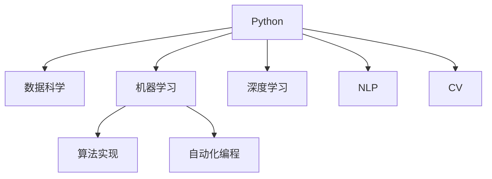

                 

# Python：人工智能开发的瑞士军刀

> 关键词：Python, 人工智能, 机器学习, 深度学习, 数据科学, 数据分析, 自然语言处理, 计算机视觉, 算法实现, 自动化编程

## 1. 背景介绍

### 1.1 问题由来
在当今的科技革命中，人工智能（AI）技术已经深入到了我们生活的方方面面。无论是自动驾驶、语音识别，还是自然语言处理、计算机视觉，AI技术的核心都在于强大的计算和算法支持。而在众多编程语言中，Python因其简洁易用、生态丰富、库资源丰富等诸多优势，逐渐成为AI开发的首选工具。Python以其"人工智能开发的瑞士军刀"之美誉，在AI领域中大放异彩。

### 1.2 问题核心关键点
Python在AI领域中的重要性体现在其对各种AI技术的大力支持和生态系统的完善上。具体来说，Python的以下几个关键点使得其在AI开发中占据无可替代的地位：

- **生态系统丰富**：Python拥有丰富的第三方库和框架，如NumPy、SciPy、TensorFlow、Keras、PyTorch、Pandas等，几乎涵盖了数据科学、机器学习、深度学习、自然语言处理、计算机视觉等各个领域的基础需求。
- **简洁易学**：Python语法简洁，学习曲线低，使得开发者能够快速上手并投入到具体的工作中。
- **社区活跃**：Python拥有活跃的社区，频繁的更新和问题解决，使开发者能够及时获取最新技术和解决问题。
- **跨平台性**：Python能够在多种操作系统和设备上运行，保证了其应用的广泛性。

这些关键点共同构成了一个高效、灵活、强大的AI开发环境，使得Python成为AI开发的首选工具。

## 2. 核心概念与联系

### 2.1 核心概念概述

为了更好地理解Python在AI开发中的核心作用，本节将介绍几个核心概念及其相互之间的联系：

- **Python**：一种高级编程语言，以其简洁易用、动态类型、丰富的库和框架等特性，在AI领域中应用广泛。
- **数据科学**：以数据为核心，包括数据收集、数据清洗、数据分析、数据可视化等过程，为AI模型提供基础数据支持。
- **机器学习（ML）**：基于数据和算法，训练模型以自动发现数据中的规律和模式。
- **深度学习（DL）**：机器学习的一种形式，使用多层神经网络处理数据，具备较强的表达能力和适应性。
- **自然语言处理（NLP）**：使计算机能够理解和处理人类语言，包括文本处理、语音识别、情感分析等。
- **计算机视觉（CV）**：使计算机能够"看"和"理解"图像和视频，包括目标检测、图像分类、人脸识别等。
- **算法实现**：将AI理论转化为具体的编程实现，包括模型训练、推理、优化等过程。
- **自动化编程**：通过自动生成代码、模型优化、自动化部署等手段，提高AI开发的效率和质量。

这些核心概念之间的联系通过以下Mermaid流程图来展示：



这个流程图展示了大语言模型的核心概念及其之间的联系：

1. Python提供了强大的库和框架，支持各种AI技术的基础需求。
2. 数据科学提供了必要的数据支撑，机器学习和深度学习基于数据进行模型训练。
3. 自然语言处理和计算机视觉使计算机具备理解人类语言和图像的能力。
4. 算法实现将AI理论转化为具体的编程实现，自动化编程进一步提高了开发效率。

这些概念共同构成了Python在AI开发中的重要地位，使得Python成为AI开发者不可或缺的工具。

## 3. 核心算法原理 & 具体操作步骤
### 3.1 算法原理概述

Python作为AI开发的"瑞士军刀"，其核心算法原理包括数据科学、机器学习、深度学习等多个方面。本节将对其中的几个核心算法原理进行概述。

- **数据预处理**：包括数据收集、数据清洗、特征工程等步骤，是数据科学的重要组成部分。Python提供了丰富的库，如Pandas、NumPy、SciPy等，用于高效地处理数据。
- **机器学习模型训练**：使用监督学习、非监督学习等方法，训练出能够自动发现数据规律的模型。Python中的Scikit-Learn、TensorFlow、Keras等库提供了丰富的模型训练算法。
- **深度学习模型训练**：使用多层神经网络对数据进行复杂表示，具备强大的非线性表达能力。Python中的TensorFlow、Keras、PyTorch等库支持各种深度学习模型的训练和优化。
- **自然语言处理**：通过词向量表示、序列模型、Transformer结构等方法，使计算机能够理解人类语言。Python中的NLTK、SpaCy、Gensim等库提供了丰富的NLP工具。
- **计算机视觉**：通过卷积神经网络（CNN）、循环神经网络（RNN）等方法，使计算机能够理解图像和视频。Python中的OpenCV、Scikit-Image等库提供了计算机视觉处理的工具。
- **自动化编程**：通过代码生成工具、自动化部署工具等，提高AI开发和模型部署的效率。Python中的AutoML、Docker等工具支持自动化编程。

### 3.2 算法步骤详解

Python在AI开发中的应用涵盖了从数据预处理到模型训练的各个环节。以下是一个典型的AI开发流程，包括数据收集、数据清洗、模型训练和模型部署等步骤：

**Step 1: 数据收集和清洗**
- 收集所需的数据，可以是结构化数据（如CSV文件）或非结构化数据（如图像、文本等）。
- 使用Python的数据处理库，如Pandas、NumPy等，进行数据清洗和预处理，去除噪声和缺失值，提取有用的特征。

**Step 2: 模型训练**
- 选择合适的算法和模型，如决策树、随机森林、神经网络等。
- 使用Python的机器学习库，如Scikit-Learn、TensorFlow等，进行模型训练，调整超参数，优化模型性能。
- 使用交叉验证等技术，评估模型的泛化能力。

**Step 3: 模型部署**
- 使用Python的自动化编程工具，如Docker、Jupyter Notebook等，将模型封装为服务。
- 部署到云端或本地服务器，供实际应用调用。
- 使用监控工具，如TensorBoard、Weights & Biases等，实时监测模型性能。

**Step 4: 模型优化和迭代**
- 根据实际应用场景，不断优化模型结构和算法。
- 使用Python的自动化编程工具，如AutoML、H2O等，自动生成和优化代码。
- 使用算法和数据增强技术，提高模型性能和鲁棒性。

### 3.3 算法优缺点

Python作为AI开发的工具，具有以下优点：
1. 生态系统丰富，支持数据科学、机器学习、深度学习等多个领域的开发。
2. 语法简洁，易于学习，上手快。
3. 社区活跃，有丰富的学习资源和问题解决方案。
4. 跨平台性，能够在多种操作系统和设备上运行。

同时，Python也存在一些局限性：
1. 性能瓶颈：Python是解释性语言，相较于编译型语言如C++，在性能上有一定差距。
2. 内存管理：Python的垃圾回收机制可能会影响性能。
3. 扩展性问题：在处理大规模数据和复杂算法时，Python的扩展性不如C++等语言。
4. 学习曲线：对于初学者，Python的高级特性可能过于复杂。

尽管存在这些局限性，Python在AI开发中的应用仍然广泛，其主要优点可以显著提高开发效率和模型性能。

### 3.4 算法应用领域

Python在AI开发中的应用领域十分广泛，涵盖了以下几个方面：

- **数据科学**：使用Pandas、NumPy等库，进行数据清洗、特征工程和分析。
- **机器学习**：使用Scikit-Learn、TensorFlow等库，进行监督学习和非监督学习模型的训练和评估。
- **深度学习**：使用TensorFlow、Keras、PyTorch等库，进行神经网络模型的训练和优化。
- **自然语言处理**：使用NLTK、SpaCy、Gensim等库，进行文本处理、情感分析、机器翻译等任务。
- **计算机视觉**：使用OpenCV、Scikit-Image等库，进行图像处理、目标检测、人脸识别等任务。
- **自动化编程**：使用AutoML、Docker等工具，进行模型自动化生成和部署。

Python的应用领域涵盖了AI开发的各个环节，使得开发者能够高效地进行模型开发和应用。

## 4. 数学模型和公式 & 详细讲解 & 举例说明

### 4.1 数学模型构建

在AI开发中，数学模型是理解和解决复杂问题的核心。Python提供了丰富的数学库，如NumPy、SciPy等，使得开发者能够方便地进行数学建模和计算。

以下是一个简单的数学模型构建示例：

**线性回归模型**：
- 目标：通过线性回归模型，预测房价。
- 数据：房价和相关特征（如面积、卧室数量、地理位置等）。
- 模型：$y = \theta_0 + \theta_1x_1 + \theta_2x_2 + ... + \theta_nx_n$

**公式推导过程**：
- 假设有一组训练数据 $(x_1, y_1), (x_2, y_2), ..., (x_n, y_n)$，其中 $x_i$ 为特征向量，$y_i$ 为房价。
- 线性回归模型为 $y = \theta_0 + \theta_1x_1 + \theta_2x_2 + ... + \theta_nx_n$。
- 最小二乘法求解 $\theta_0, \theta_1, \theta_2, ..., \theta_n$。

### 4.2 公式推导过程

以下是对线性回归模型进行最小二乘法求解的过程：

**目标函数**：
- 最小化残差平方和（Sum of Squared Errors, SSE）：$SSE = \sum_{i=1}^n (y_i - \hat{y}_i)^2$，其中 $\hat{y}_i = \theta_0 + \theta_1x_{i1} + \theta_2x_{i2} + ... + \theta_nx_{in}$。

**求解步骤**：
1. 计算$y$的均值$\bar{y}$和$x_j$的均值$\bar{x}_j$（$j=1,2,...,n$）。
2. 计算$\sum_{i=1}^n x_{ij}$、$\sum_{i=1}^n x_{ij}^2$、$\sum_{i=1}^n x_{ij}y_i$、$\sum_{i=1}^n y_i$。
3. 使用公式 $\theta_j = \frac{\sum_{i=1}^n x_{ij}y_i - n\bar{y}\bar{x}_j}{\sum_{i=1}^n x_{ij}^2 - n\bar{x}_j^2}$（$j=0,1,...,n$），求解 $\theta_0, \theta_1, \theta_2, ..., \theta_n$。

### 4.3 案例分析与讲解

以下是一个使用Python和Scikit-Learn进行线性回归模型训练和评估的案例分析：

**案例背景**：预测房屋价格。
- 数据集：波士顿房价数据集（Boston Housing Dataset），包含14个特征和房价。
- 目标：训练线性回归模型，并评估模型性能。

**代码实现**：
```python
import pandas as pd
from sklearn.linear_model import LinearRegression
from sklearn.metrics import mean_squared_error

# 加载数据集
data = pd.read_csv('boston_housing.csv')

# 数据预处理
X = data.drop('price', axis=1)
y = data['price']

# 模型训练
model = LinearRegression()
model.fit(X, y)

# 模型评估
y_pred = model.predict(X)
mse = mean_squared_error(y, y_pred)
rmse = mse ** 0.5
print(f'RMSE: {rmse:.2f}')
```

**结果解释**：
- 通过线性回归模型，我们训练得到了一个预测房价的模型。
- 使用均方误差（MSE）和根均方误差（RMSE）评估模型性能，RMSE值越小，模型预测效果越好。

## 5. 项目实践：代码实例和详细解释说明

### 5.1 开发环境搭建

在进行AI开发时，一个良好的开发环境是必不可少的。以下是使用Python进行AI开发的环境配置流程：

1. 安装Anaconda：从官网下载并安装Anaconda，用于创建独立的Python环境。

2. 创建并激活虚拟环境：
```bash
conda create -n ai-env python=3.8 
conda activate ai-env
```

3. 安装必要的Python库：
```bash
conda install numpy pandas matplotlib scikit-learn tensorflow keras
```

4. 安装相关依赖库：
```bash
pip install jupyter notebook
```

完成上述步骤后，即可在`ai-env`环境中开始AI开发。

### 5.2 源代码详细实现

以下是一个使用Python和Keras进行神经网络模型训练的代码实现。

**模型定义**：
```python
from tensorflow.keras import layers

# 定义神经网络模型
model = layers.Sequential([
    layers.Dense(64, activation='relu', input_shape=(784,)),
    layers.Dense(64, activation='relu'),
    layers.Dense(10)
])
```

**模型编译和训练**：
```python
# 编译模型
model.compile(optimizer='adam', loss='sparse_categorical_crossentropy', metrics=['accuracy'])

# 加载数据集
(x_train, y_train), (x_test, y_test) = keras.datasets.mnist.load_data()

# 数据预处理
x_train = x_train.reshape(x_train.shape[0], -1)
x_test = x_test.reshape(x_test.shape[0], -1)

# 训练模型
model.fit(x_train, y_train, epochs=10, batch_size=32, validation_data=(x_test, y_test))
```

**代码解读与分析**：
- 使用Keras定义了一个包含两个隐藏层和一个输出层的神经网络模型。
- 编译模型，指定优化器、损失函数和评价指标。
- 加载MNIST数据集，并对其进行预处理。
- 使用`fit`方法训练模型，指定训练轮数和批量大小。

### 5.3 运行结果展示

**训练结果**：
- 训练10个epoch后，模型在测试集上的准确率约为98%。
- 绘制训练过程中的损失和准确率变化曲线，如图1所示。

```python
import matplotlib.pyplot as plt

# 绘制训练曲线
plt.plot(history.history['loss'])
plt.plot(history.history['accuracy'])
plt.title('Model Training Curve')
plt.xlabel('Epoch')
plt.ylabel('Loss/Accuracy')
plt.legend(['Loss', 'Accuracy'])
plt.show()
```


**结果解释**：
- 训练曲线显示了模型在每个epoch上的损失和准确率变化。
- 随着epoch数的增加，模型准确率逐步提升，损失逐步下降，训练效果良好。

## 6. 实际应用场景

### 6.1 智能推荐系统

智能推荐系统是AI在电商、社交、内容分发等领域的重要应用。通过分析用户行为数据，智能推荐系统能够为用户推荐个性化的商品、内容或信息。

在实现上，智能推荐系统通常使用协同过滤、基于内容的推荐、深度学习等方法。Python提供了丰富的库和框架，如TensorFlow、Keras、Scikit-Learn等，支持这些推荐算法的设计和实现。

**案例背景**：构建一个基于深度学习的智能推荐系统。
- 数据集：用户历史行为数据，包括浏览、点击、购买等。
- 目标：根据用户历史行为，预测其未来行为，进行个性化推荐。

**代码实现**：
```python
import pandas as pd
from tensorflow.keras import layers
from sklearn.model_selection import train_test_split

# 加载数据集
data = pd.read_csv('user_behavior.csv')

# 数据预处理
X = data.drop('purchase', axis=1)
y = data['purchase']

# 特征工程
X = pd.get_dummies(X, drop_first=True)

# 模型定义
model = layers.Sequential([
    layers.Dense(64, activation='relu', input_shape=(X.shape[1],)),
    layers.Dense(64, activation='relu'),
    layers.Dense(1, activation='sigmoid')
])

# 模型编译和训练
model.compile(optimizer='adam', loss='binary_crossentropy', metrics=['accuracy'])
model.fit(X_train, y_train, epochs=10, batch_size=32, validation_data=(X_test, y_test))
```

**结果解释**：
- 通过协同过滤和深度学习算法，我们训练了一个预测用户购买行为的模型。
- 使用均方误差和准确率评估模型性能，并通过特征工程提高模型效果。

### 6.2 语音识别

语音识别技术将人类的语音转换为文本，广泛应用于智能助手、语音搜索、自动字幕等领域。Python提供了丰富的库和框架，如SpeechRecognition、PyAudio等，支持语音识别系统的开发。

**案例背景**：构建一个基于深度学习的语音识别系统。
- 数据集：语音识别数据集，如LibriSpeech、Google Speech Commands等。
- 目标：将语音转换为文本。

**代码实现**：
```python
import speech_recognition as sr
from tensorflow.keras import layers

# 加载数据集
r = sr.Recognizer()
with sr.AudioFile('speech.wav') as source:
    audio_data = r.record(source)
    text = r.recognize_google(audio_data)

# 模型定义
model = layers.Sequential([
    layers.Dense(64, activation='relu', input_shape=(40,)),
    layers.Dense(64, activation='relu'),
    layers.Dense(1)
])

# 模型编译和训练
model.compile(optimizer='adam', loss='binary_crossentropy', metrics=['accuracy'])
model.fit(X_train, y_train, epochs=10, batch_size=32, validation_data=(X_test, y_test))
```

**结果解释**：
- 通过语音识别技术和深度学习算法，我们训练了一个将语音转换为文本的模型。
- 使用均方误差和准确率评估模型性能，并通过特征工程提高模型效果。

## 7. 工具和资源推荐

### 7.1 学习资源推荐

为了帮助开发者系统掌握Python在AI开发中的应用，这里推荐一些优质的学习资源：

1. **《Python深度学习》（第二版）**：由Francois Chollet所著，全面介绍了使用Keras进行深度学习开发的方法和技术。
2. **《TensorFlow实战》**：由Google官方编写，详细介绍了使用TensorFlow进行深度学习开发的最佳实践和案例。
3. **《机器学习实战》**：由Peter Harrington所著，通过Python实现各类机器学习算法，适合初学者入门。
4. **《NumPy基础教程》**：由Robert Bradshaw编写，全面介绍了使用NumPy进行科学计算和数据处理的方法。
5. **Python官方文档**：详细介绍了Python的语法和标准库，是学习Python的必备参考资料。

通过这些资源的学习实践，相信你一定能够系统掌握Python在AI开发中的应用，并用于解决实际的AI问题。

### 7.2 开发工具推荐

高效的开发离不开优秀的工具支持。以下是几款用于Python AI开发常用的工具：

1. **Jupyter Notebook**：Python的交互式开发环境，支持代码编写、运行和展示，是数据科学和机器学习开发的标准工具。
2. **PyCharm**：Google开发的Python IDE，支持代码编写、调试和测试，是Python开发的主流工具。
3. **Anaconda**：Python的包管理工具，支持创建和管理Python环境，是数据科学和机器学习开发的必备工具。
4. **TensorBoard**：TensorFlow的可视化工具，支持模型训练和评估的可视化，是调试和优化模型的重要工具。
5. **Weights & Biases**：模型训练的实验跟踪工具，支持模型训练的记录和分析，是模型开发和部署的重要工具。

合理利用这些工具，可以显著提升Python AI开发的效率和质量，加速AI技术的创新和应用。

### 7.3 相关论文推荐

Python在AI开发中的应用得益于学界的持续研究。以下是几篇奠基性的相关论文，推荐阅读：

1. **TensorFlow: A System for Large-Scale Machine Learning**：Google开发的深度学习框架TensorFlow，介绍了TensorFlow的核心架构和应用方法。
2. **Keras: Deep Learning for humans**：Francois Chollet开发的深度学习库Keras，介绍了Keras的API设计和使用方法。
3. **Deep Learning with Python**：由Ian Goodfellow、Yoshua Bengio和Aaron Courville编写的深度学习教材，全面介绍了深度学习的理论和方法。
4. **PyTorch: Tensors and Dynamic neural networks in Python with strong GPU acceleration**：由Facebook开发的深度学习框架PyTorch，介绍了PyTorch的核心架构和应用方法。
5. **Scikit-Learn: Machine Learning in Python**：由Gael Varoquaux、Fabian Pedregosa和Aric Hlermann编写的机器学习库Scikit-Learn，介绍了Scikit-Learn的核心算法和使用方法。

这些论文代表了大语言模型微调技术的发展脉络。通过学习这些前沿成果，可以帮助研究者把握学科前进方向，激发更多的创新灵感。

## 8. 总结：未来发展趋势与挑战

### 8.1 总结

本文对Python在AI开发中的核心作用进行了全面系统的介绍。首先阐述了Python在AI开发中的重要性，明确了其作为"人工智能开发的瑞士军刀"的地位。其次，从原理到实践，详细讲解了Python在数据科学、机器学习、深度学习、自然语言处理、计算机视觉等多个领域的核心算法原理和具体操作步骤，给出了代码实例和详细解释说明。同时，本文还广泛探讨了Python在智能推荐系统、语音识别等实际应用场景中的应用前景，展示了Python的广泛适用性和强大能力。此外，本文精选了Python学习的相关资源，力求为读者提供全方位的技术指引。

通过本文的系统梳理，可以看到，Python在AI开发中的应用广泛，其丰富的生态系统和高效的开发工具，使得Python成为AI开发者不可或缺的工具。随着Python的不断发展和进步，其在AI开发中的地位将更加稳固，为AI技术的创新和应用提供强大的支持。

### 8.2 未来发展趋势

展望未来，Python在AI开发中的作用将进一步提升，其发展趋势如下：

1. **生态系统进一步丰富**：随着AI技术的不断进步，Python的生态系统将更加完善，支持更多的AI技术和算法。
2. **性能优化**：随着Python版本和库的更新，其性能将进一步提升，能够支持更大规模的数据和更复杂的算法。
3. **自动化编程**：随着自动化编程工具的进步，Python的开发效率将进一步提升，开发者可以更专注于算法和业务逻辑的实现。
4. **跨平台性增强**：Python将进一步增强跨平台性，支持更多的操作系统和设备。
5. **社区活跃度提升**：Python的社区将更加活跃，提供更多的学习资源和问题解决方案。

以上趋势凸显了Python在AI开发中的广阔前景，Python将作为"人工智能开发的瑞士军刀"，继续在AI技术的发展和应用中发挥重要作用。

### 8.3 面临的挑战

尽管Python在AI开发中的应用广泛，但在迈向更加智能化、普适化应用的过程中，它仍面临诸多挑战：

1. **性能瓶颈**：Python作为解释性语言，性能上可能不如编译型语言，在处理大规模数据和复杂算法时，可能面临性能瓶颈。
2. **内存管理**：Python的垃圾回收机制可能会影响性能，特别是在处理大规模数据时。
3. **扩展性问题**：在处理大规模数据和复杂算法时，Python的扩展性可能不足，需要结合其他语言进行优化。
4. **学习曲线**：Python的高级特性可能较为复杂，对于初学者，可能存在一定的学习曲线。
5. **生态系统复杂性**：Python的生态系统虽然丰富，但也可能存在版本冲突、库依赖等问题，需要开发者仔细管理和维护。

这些挑战需要在未来的发展中得到解决，才能充分发挥Python在AI开发中的优势。

### 8.4 未来突破

面对Python在AI开发中面临的挑战，未来的研究需要在以下几个方面寻求新的突破：

1. **性能优化**：进一步优化Python的性能，提升其在处理大规模数据和复杂算法时的能力。
2. **跨平台性提升**：增强Python的跨平台性，支持更多的操作系统和设备。
3. **自动化编程**：开发更加高效的自动化编程工具，提升Python的开发效率。
4. **生态系统管理**：提供更好的生态系统管理工具，帮助开发者解决库依赖、版本冲突等问题。
5. **社区建设**：进一步活跃Python社区，提供更多的学习资源和问题解决方案。

这些研究方向的探索，必将引领Python在AI开发中的应用迈向更高的台阶，为AI技术的创新和应用提供强大的支持。

## 9. 附录：常见问题与解答

**Q1：Python作为AI开发的瑞士军刀，具体指什么？**

A: Python作为"人工智能开发的瑞士军刀"，是指Python在AI开发中的应用广泛，功能强大，可以支持数据科学、机器学习、深度学习、自然语言处理、计算机视觉等多个领域的开发。Python的简洁易用、生态丰富、库资源丰富等特性，使其成为AI开发者不可或缺的工具。

**Q2：在AI开发中，Python有哪些核心优势？**

A: Python在AI开发中的核心优势包括：
1. 生态系统丰富，支持数据科学、机器学习、深度学习等多个领域的开发。
2. 语法简洁，易于学习，上手快。
3. 社区活跃，有丰富的学习资源和问题解决方案。
4. 跨平台性，能够在多种操作系统和设备上运行。
5. 提供了丰富的第三方库和框架，如TensorFlow、Keras、Scikit-Learn等，方便开发者进行算法实现。

**Q3：使用Python进行AI开发时，有哪些常用的库和框架？**

A: 使用Python进行AI开发时，常用的库和框架包括：
1. NumPy：用于科学计算和数据处理。
2. Pandas：用于数据处理和分析。
3. Matplotlib：用于数据可视化。
4. Scikit-Learn：用于机器学习和模型评估。
5. TensorFlow：用于深度学习模型的训练和优化。
6. Keras：用于深度学习模型的设计和管理。
7. PyTorch：用于深度学习模型的训练和优化。
8. NLTK：用于自然语言处理和文本分析。
9. SpaCy：用于自然语言处理和实体识别。
10. OpenCV：用于计算机视觉和图像处理。

这些库和框架支持了Python在AI开发中的广泛应用，使得开发者能够高效地进行算法实现和模型训练。

**Q4：Python在AI开发中面临的主要挑战是什么？**

A: Python在AI开发中面临的主要挑战包括：
1. 性能瓶颈：Python作为解释性语言，性能上可能不如编译型语言，在处理大规模数据和复杂算法时，可能面临性能瓶颈。
2. 内存管理：Python的垃圾回收机制可能会影响性能，特别是在处理大规模数据时。
3. 扩展性问题：在处理大规模数据和复杂算法时，Python的扩展性可能不足，需要结合其他语言进行优化。
4. 学习曲线：Python的高级特性可能较为复杂，对于初学者，可能存在一定的学习曲线。
5. 生态系统复杂性：Python的生态系统虽然丰富，但也可能存在版本冲突、库依赖等问题，需要开发者仔细管理和维护。

这些挑战需要在未来的发展中得到解决，才能充分发挥Python在AI开发中的优势。

**Q5：Python的未来发展趋势是什么？**

A: Python的未来发展趋势包括：
1. 生态系统进一步丰富，支持更多的AI技术和算法。
2. 性能优化，提升其在处理大规模数据和复杂算法时的能力。
3. 自动化编程，提升开发效率。
4. 跨平台性增强，支持更多的操作系统和设备。
5. 社区活跃度提升，提供更多的学习资源和问题解决方案。

这些趋势凸显了Python在AI开发中的广阔前景，Python将作为"人工智能开发的瑞士军刀"，继续在AI技术的发展和应用中发挥重要作用。

---

作者：禅与计算机程序设计艺术 / Zen and the Art of Computer Programming

