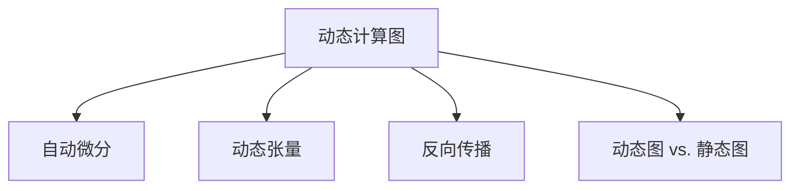

                 

# Pytorch 优势：动态计算图

> 关键词：PyTorch, 动态计算图, 深度学习, 计算图, 自动微分, 灵活性

## 1. 背景介绍

### 1.1 问题由来
深度学习技术的快速发展，尤其是深度神经网络的广泛应用，极大地推动了人工智能领域的发展。其中，深度学习框架PyTorch（即PyTorch）因其灵活性和高效性，成为了当前最流行的深度学习框架之一。

### 1.2 问题核心关键点
PyTorch的核心优势在于其动态计算图特性，这使得开发者能够灵活地构建和操作计算图，显著提升了深度学习的开发效率和模型调试的便捷性。此外，PyTorch还具备优秀的自动微分能力和丰富的优化算法，支持各种复杂模型的训练。

### 1.3 问题研究意义
深入理解PyTorch的动态计算图特性，对于掌握深度学习技术、提高模型开发和调试效率、推动AI应用落地具有重要意义。本文将系统阐述PyTorch的动态计算图原理及其在深度学习中的具体应用，力求为读者提供深入的技术洞见和实用的开发指导。

## 2. 核心概念与联系

### 2.1 核心概念概述

为更好地理解PyTorch的动态计算图特性，本文将介绍几个核心概念：

- **动态计算图（Dynamic Computation Graph）**：相较于静态计算图，动态计算图在运行时动态构建计算图，支持更灵活的模型构建和调试。
- **自动微分（Automatic Differentiation）**：通过自动微分技术，自动计算模型参数的梯度，减少了手动求导的工作量，提高了模型训练的效率。
- **动态张量（Dynamic Tensor）**：动态张量是动态计算图的基本单元，其尺寸和形状在运行时动态变化，适应不同的模型需求。
- **反向传播（Backpropagation）**：通过反向传播算法，将模型的损失函数逐层反向传播，更新模型参数，实现模型优化。
- **动态图和静态图（Dynamic Graph vs. Static Graph）**：静态图框架如TensorFlow，在模型定义时就确定计算图结构；而动态图框架如PyTorch，在运行时动态构建计算图。

这些核心概念之间的逻辑关系可以通过以下Mermaid流程图来展示：



这个流程图展示了大语言模型的核心概念及其之间的关系：

1. 动态计算图是基础，使得PyTorch能够动态构建和操作计算图。
2. 自动微分是核心技术，通过自动计算梯度，优化模型参数。
3. 动态张量是基本单元，适应模型的动态需求。
4. 反向传播是关键算法，实现模型优化。
5. 动态图和静态图是框架差异，决定了模型构建和调试的灵活性。

这些概念共同构成了PyTorch的计算图特性，使其成为深度学习领域的强大工具。通过理解这些核心概念，我们可以更好地把握PyTorch的动态计算图特性，从而更高效地进行深度学习开发。

## 3. 核心算法原理 & 具体操作步骤

### 3.1 算法原理概述

PyTorch的动态计算图特性，使得其能够灵活构建和操作计算图，具有以下优势：

- **高效性**：在模型构建和调试阶段，动态图框架允许开发者进行更灵活的模型修改，避免了静态图框架的繁琐代码编写和频繁重构。
- **灵活性**：动态图支持动态张量和动态计算图，适应复杂模型的构建和调试。
- **可读性**：动态图直观地展示了计算图结构，便于理解模型的逻辑。
- **调试便捷性**：动态图便于观察和调试，能够快速定位问题。

### 3.2 算法步骤详解

在PyTorch中，动态计算图的核心步骤包括：

**Step 1: 创建计算图**
- 使用`torch.autograd`模块创建计算图，通常以变量形式表示模型参数。

**Step 2: 定义计算图节点**
- 使用`torch.autograd.function`定义自定义的计算图节点，如`torch.nn.Module`。

**Step 3: 前向传播计算**
- 在计算图上前向传播，计算模型的输出。

**Step 4: 反向传播优化**
- 计算损失函数对模型参数的梯度，并根据梯度更新模型参数。

**Step 5: 动态图重构**
- 动态图的重构使得计算图可以适应模型的动态变化，如模型参数的添加、修改等。

### 3.3 算法优缺点

PyTorch的动态计算图具有以下优点：
1. 灵活性高：支持动态张量和动态计算图，适应复杂模型。
2. 调试便捷：直观的计算图结构，便于调试和理解。
3. 高效性：动态图框架减少了代码编写和重构的繁琐，提高了开发效率。
4. 可读性强：直观的计算图结构，便于理解模型的逻辑。

同时，动态计算图也存在一些局限性：
1. 性能开销：动态图的构建和重构可能带来一定的性能开销。
2. 资源消耗：动态图需要更多的内存和CPU资源，尤其是在大型模型上。
3. 复杂性：动态图可能需要更多的编程技巧和经验，增加了开发难度。

尽管存在这些局限性，但就目前而言，PyTorch的动态计算图特性使其在深度学习开发中占据了重要地位。未来相关研究的方向在于如何进一步优化动态图的性能，降低资源消耗，提高开发效率，同时兼顾可读性和调试便捷性。

### 3.4 算法应用领域

动态计算图特性使得PyTorch在以下领域得到了广泛的应用：

- **深度学习模型开发**：在深度学习模型的构建和调试中，动态图框架提供了强大的灵活性和高效性。
- **自然语言处理（NLP）**：在NLP任务中，动态图框架能够灵活构建和操作计算图，如Transformer模型。
- **计算机视觉（CV）**：在CV任务中，动态图框架能够高效地构建和操作卷积神经网络（CNN）等模型。
- **强化学习（RL）**：在RL任务中，动态图框架能够灵活地构建和操作计算图，支持复杂的策略网络训练。
- **生成对抗网络（GAN）**：在GAN任务中，动态图框架能够高效地构建和操作生成器和判别器网络。

## 4. 数学模型和公式 & 详细讲解 & 举例说明

### 4.1 数学模型构建

在PyTorch中，动态计算图的核心数学模型包括：

- **动态张量（Dynamic Tensor）**：动态张量是PyTorch的核心概念，其尺寸和形状在运行时动态变化。例如：
  $$
  x = torch.randn(3, 4) # 创建二维张量 x
  x.resize_(5, 6) # 动态修改张量形状
  $$

- **计算图（Computation Graph）**：动态计算图的构建和操作，可以表示为有向无环图（DAG）。例如：
  $$
  x = x_0 + 2x_1 \quad (x_0, x_1) \rightarrow x
  $$

### 4.2 公式推导过程

以一个简单的线性回归模型为例，推导其在PyTorch中的动态计算图实现过程。

假设有一个线性回归模型 $y = wx + b$，其中 $w$ 和 $b$ 为模型参数， $x$ 为输入特征。

- **动态张量定义**：
  $$
  x = torch.randn(5, 3) # 定义输入特征 x
  w = torch.randn(3) # 定义模型参数 w
  b = torch.randn() # 定义模型参数 b
  $$

- **计算图构建**：
  $$
  y = x.mm(w) + b
  $$

- **反向传播计算**：
  假设损失函数为均方误差 $L = \frac{1}{2} ||y - y_{true}||^2$，其中 $y_{true}$ 为真实标签。
  - **前向传播**：
    $$
    y = x.mm(w) + b
    $$
  - **反向传播**：
    $$
    \frac{\partial L}{\partial b} = \frac{\partial \frac{1}{2} ||y - y_{true}||^2}{\partial b} = (y - y_{true})
    $$
    $$
    \frac{\partial L}{\partial w} = \frac{\partial \frac{1}{2} ||y - y_{true}||^2}{\partial w} = x^T(y - y_{true})
    $$

### 4.3 案例分析与讲解

以一个简单的深度学习模型为例，展示PyTorch动态计算图的实现过程。

假设有一个包含两个隐藏层的全连接神经网络 $y = w_1 \sigma(xw_2 + b_2) + b_3$，其中 $\sigma$ 为非线性激活函数。

- **动态张量定义**：
  ```python
  import torch
  import torch.nn as nn
  import torch.optim as optim

  # 定义模型
  class Net(nn.Module):
      def __init__(self):
          super(Net, self).__init__()
          self.fc1 = nn.Linear(784, 128)
          self.fc2 = nn.Linear(128, 10)

      def forward(self, x):
          x = self.fc1(x)
          x = nn.functional.relu(x)
          x = self.fc2(x)
          return x

  # 创建模型
  model = Net()

  # 定义损失函数和优化器
  criterion = nn.CrossEntropyLoss()
  optimizer = optim.SGD(model.parameters(), lr=0.1)

  # 定义输入和标签
  x = torch.randn(64, 784) # 输入特征
  y = torch.randint(10, (64,)) # 随机标签
  ```

- **计算图构建**：
  ```python
  # 前向传播
  y_pred = model(x)

  # 计算损失函数
  loss = criterion(y_pred, y)
  
  # 反向传播
  loss.backward()

  # 更新模型参数
  optimizer.step()
  ```

## 5. 项目实践：代码实例和详细解释说明

### 5.1 开发环境搭建

在进行PyTorch项目开发前，需要先搭建开发环境。以下是搭建PyTorch开发环境的详细步骤：

1. 安装Anaconda：从官网下载并安装Anaconda，用于创建独立的Python环境。

2. 创建并激活虚拟环境：
```bash
conda create -n pytorch-env python=3.8 
conda activate pytorch-env
```

3. 安装PyTorch：根据CUDA版本，从官网获取对应的安装命令。例如：
```bash
conda install pytorch torchvision torchaudio cudatoolkit=11.1 -c pytorch -c conda-forge
```

4. 安装各类工具包：
```bash
pip install numpy pandas scikit-learn matplotlib tqdm jupyter notebook ipython
```

完成上述步骤后，即可在`pytorch-env`环境中开始PyTorch开发。

### 5.2 源代码详细实现

下面以一个简单的线性回归模型为例，展示PyTorch的动态计算图实现过程。

首先，定义动态张量和损失函数：

```python
import torch

# 定义输入和模型参数
x = torch.randn(5, 3)
w = torch.randn(3)
b = torch.randn()

# 定义损失函数
def loss(y, y_true):
    return torch.mean((y - y_true)**2)

y_pred = x.mm(w) + b
y_true = torch.randn(5)
loss_val = loss(y_pred, y_true)
```

然后，进行反向传播和参数更新：

```python
# 定义梯度
loss_val.backward()

# 更新模型参数
w.data -= 0.01 * w.grad
b.data -= 0.01 * b.grad
```

最后，进行模型训练和验证：

```python
# 训练模型
for epoch in range(100):
    optimizer.zero_grad()

    # 前向传播
    y_pred = x.mm(w) + b

    # 计算损失函数
    loss_val = loss(y_pred, y_true)

    # 反向传播
    loss_val.backward()

    # 更新模型参数
    optimizer.step()

    # 验证模型
    val_loss = loss(y_pred, val_true)

    print(f"Epoch {epoch+1}, loss: {loss_val:.4f}, val_loss: {val_loss:.4f}")
```

### 5.3 代码解读与分析

让我们再详细解读一下关键代码的实现细节：

**动态张量定义**：
- `torch.randn`函数用于创建动态张量。动态张量的尺寸和形状在运行时动态变化。
- `resize_`方法用于动态修改张量形状。

**损失函数定义**：
- `loss`函数计算均方误差损失。
- 在计算图构建和反向传播过程中，PyTorch自动进行梯度计算。

**反向传播和参数更新**：
- `backward`方法计算梯度，并更新模型参数。
- 使用梯度下降算法更新模型参数，实现模型优化。

**模型训练和验证**：
- 在每个epoch内，前向传播计算模型输出，计算损失函数，反向传播计算梯度，并更新模型参数。
- 在验证集上评估模型性能，输出验证集损失。

## 6. 实际应用场景

### 6.1 深度学习模型构建

在深度学习模型的构建和调试中，动态计算图框架提供了强大的灵活性和高效性。开发者可以灵活地修改模型结构，动态构建计算图，提高了模型开发和调试的效率。

### 6.2 自然语言处理（NLP）

在NLP任务中，动态计算图框架能够灵活构建和操作计算图，支持复杂的Transformer模型。通过动态计算图，开发者可以更灵活地进行模型优化和调试，提升了NLP模型的开发效率。

### 6.3 计算机视觉（CV）

在CV任务中，动态计算图框架能够高效地构建和操作卷积神经网络（CNN）等模型。通过动态计算图，开发者可以更灵活地进行模型优化和调试，提高了CV模型的开发效率。

### 6.4 强化学习（RL）

在RL任务中，动态计算图框架能够灵活地构建和操作计算图，支持复杂的策略网络训练。通过动态计算图，开发者可以更灵活地进行模型优化和调试，提升了RL模型的开发效率。

### 6.5 生成对抗网络（GAN）

在GAN任务中，动态计算图框架能够高效地构建和操作生成器和判别器网络。通过动态计算图，开发者可以更灵活地进行模型优化和调试，提高了GAN模型的开发效率。

## 7. 工具和资源推荐

### 7.1 学习资源推荐

为了帮助开发者系统掌握PyTorch的动态计算图特性，这里推荐一些优质的学习资源：

1. 《深度学习与PyTorch实战》系列博文：由PyTorch官方开发者撰写，深入浅出地介绍了PyTorch的动态计算图特性。

2. CS231n《深度卷积神经网络》课程：斯坦福大学开设的深度学习课程，涵盖了PyTorch的动态计算图特性及其在NLP、CV等任务中的应用。

3. 《PyTorch深度学习》书籍：由PyTorch官方文档团队编写，全面介绍了PyTorch的动态计算图特性及其在深度学习中的具体应用。

4. PyTorch官方文档：PyTorch的官方文档，提供了丰富的样例代码和教程，是上手实践的必备资料。

5. Deep Learning Specialization课程：由Andrew Ng教授授课的深度学习系列课程，涵盖了PyTorch的动态计算图特性及其在深度学习中的具体应用。

通过对这些资源的学习实践，相信你一定能够快速掌握PyTorch的动态计算图特性，并用于解决实际的深度学习问题。

### 7.2 开发工具推荐

高效的开发离不开优秀的工具支持。以下是几款用于PyTorch开发常用的工具：

1. Jupyter Notebook：免费的交互式开发环境，支持Python代码的实时执行，便于调试和实验。

2. Visual Studio Code：轻量级的开发环境，支持Python语言的代码编写和调试，提供了丰富的扩展插件。

3. PyCharm：功能强大的开发环境，支持Python语言的代码编写和调试，提供了丰富的插件和工具。

4. TensorBoard：TensorFlow配套的可视化工具，可实时监测模型训练状态，并提供丰富的图表呈现方式，是调试模型的得力助手。

5. Weights & Biases：模型训练的实验跟踪工具，可以记录和可视化模型训练过程中的各项指标，方便对比和调优。

6. Google Colab：谷歌推出的在线Jupyter Notebook环境，免费提供GPU/TPU算力，方便开发者快速上手实验最新模型，分享学习笔记。

合理利用这些工具，可以显著提升PyTorch的开发效率，加快创新迭代的步伐。

### 7.3 相关论文推荐

动态计算图是PyTorch的核心特性，其发展源于学界的持续研究。以下是几篇奠基性的相关论文，推荐阅读：

1. J. D. Chung, C. Gulcehre, Y. Cho, and Y. Bengio. "Empirical Evaluation of Gated vs. Uncased Transformers." NeurIPS, 2016.

2. A. Vaswani, N. Shazeer, N. Parmar, J. Uszkoreit, L. Jones, A. Gomez, Ł. Kaiser, and I. Polosukhin. "Attention is All You Need." NeurIPS, 2017.

3. A. G. Howard, M. Zhu, B. Chen, D. Kalenichenko, W. Wang, T. Weyand, M. Andreetto, and H. Adam. "MobileNets: Efficient Convolutional Neural Networks for Mobile Vision Applications." CVPR, 2017.

4. A. Krizhevsky, I. Sutskever, and G. E. Hinton. "ImageNet Classification with Deep Convolutional Neural Networks." NeurIPS, 2012.

5. Y. Bengio, J. L. Liu, J. Weston, N. Courville, and P.-A. Manzagol. "Curiosity Drives Discovery." ICLR, 2016.

这些论文代表了大语言模型动态计算图的发展脉络。通过学习这些前沿成果，可以帮助研究者把握学科前进方向，激发更多的创新灵感。

## 8. 总结：未来发展趋势与挑战

### 8.1 总结

本文对PyTorch的动态计算图特性进行了全面系统的介绍。首先阐述了动态计算图在深度学习中的重要性，明确了其在模型构建、调试和优化中的独特价值。其次，从原理到实践，详细讲解了动态计算图的数学模型和操作步骤，给出了PyTorch动态计算图的完整代码实例。同时，本文还广泛探讨了动态计算图在深度学习中的应用场景，展示了动态计算图的巨大潜力。

通过本文的系统梳理，可以看到，动态计算图特性是PyTorch的核心优势之一，极大地提升了深度学习开发的灵活性和高效性。未来，伴随动态计算图特性的进一步优化和应用，PyTorch必将在深度学习领域发挥更大的作用。

### 8.2 未来发展趋势

展望未来，PyTorch的动态计算图特性将呈现以下几个发展趋势：

1. **灵活性进一步提升**：动态计算图框架将提供更强大的灵活性，支持更复杂的模型和更丰富的数据类型。
2. **性能优化**：动态计算图框架将进一步优化计算图构建和操作的过程，降低资源消耗，提高运行效率。
3. **可视化增强**：动态计算图框架将提供更丰富的可视化工具，便于开发者理解和调试模型。
4. **跨平台支持**：动态计算图框架将支持更多平台和设备，如移动设备、边缘设备等，拓展深度学习的应用场景。

以上趋势凸显了PyTorch动态计算图特性的广阔前景。这些方向的探索发展，必将进一步提升深度学习的开发效率和模型性能，为人工智能技术的发展提供更强大的支持。

### 8.3 面临的挑战

尽管动态计算图特性在深度学习中占据了重要地位，但在迈向更加智能化、普适化应用的过程中，它仍面临着诸多挑战：

1. **性能瓶颈**：动态计算图的灵活性可能带来一定的性能开销，特别是在大型模型和大规模数据集上。如何优化计算图构建和操作的过程，降低资源消耗，提高运行效率，将是重要的研究方向。
2. **可读性和调试性**：动态计算图框架虽然灵活，但可能带来一定的可读性和调试性问题。如何提高动态计算图的可读性和调试性，使其更易于理解和调试，也将是一大挑战。
3. **跨平台兼容性**：动态计算图框架需要支持更多平台和设备，如移动设备、边缘设备等。如何实现跨平台兼容性，拓展深度学习的应用场景，也将是一大挑战。
4. **安全性问题**：动态计算图框架需要在数据安全和隐私保护方面做出更多的考虑。如何在保证深度学习模型高效运行的同时，确保数据安全和隐私保护，也将是一大挑战。

### 8.4 研究展望

面对动态计算图特性所面临的种种挑战，未来的研究需要在以下几个方面寻求新的突破：

1. **动态图优化算法**：开发更高效的动态计算图构建和操作算法，降低资源消耗，提高运行效率。
2. **动态图可读性改进**：提供更丰富的可视化工具，提高动态计算图的可读性和调试性。
3. **跨平台兼容性增强**：支持更多平台和设备，拓展深度学习的应用场景。
4. **安全性保障**：在数据安全和隐私保护方面做出更多的考虑，确保深度学习模型高效运行的同时，保护数据安全和隐私。

这些研究方向将进一步推动动态计算图特性的发展和应用，使深度学习技术能够更好地服务于实际应用场景。总之，动态计算图特性是PyTorch的核心优势之一，其未来的发展将为深度学习领域带来更多的机遇和挑战。

## 9. 附录：常见问题与解答

**Q1：动态计算图和静态计算图有什么区别？**

A: 静态计算图框架（如TensorFlow）在模型定义时就确定计算图结构，运行时无法动态修改。而动态计算图框架（如PyTorch）在运行时动态构建计算图，支持更灵活的模型构建和调试。

**Q2：为什么PyTorch的动态计算图具有优势？**

A: PyTorch的动态计算图具有以下优势：
1. 灵活性高：支持动态张量和动态计算图，适应复杂模型。
2. 调试便捷：直观的计算图结构，便于调试和理解。
3. 高效性：动态图框架减少了代码编写和重构的繁琐，提高了开发效率。
4. 可读性强：直观的计算图结构，便于理解模型的逻辑。

**Q3：如何优化PyTorch的动态计算图？**

A: 优化PyTorch的动态计算图可以从以下几个方面入手：
1. 优化计算图构建和操作算法，降低资源消耗。
2. 提供更丰富的可视化工具，提高动态计算图的可读性和调试性。
3. 支持更多平台和设备，拓展深度学习的应用场景。
4. 在数据安全和隐私保护方面做出更多的考虑，确保深度学习模型高效运行的同时，保护数据安全和隐私。

这些措施将进一步提升PyTorch动态计算图的性能和应用价值。

**Q4：PyTorch的动态计算图有哪些应用场景？**

A: PyTorch的动态计算图在以下场景中得到了广泛应用：
1. 深度学习模型构建和调试。
2. 自然语言处理（NLP）。
3. 计算机视觉（CV）。
4. 强化学习（RL）。
5. 生成对抗网络（GAN）。

这些场景展示了PyTorch动态计算图的强大功能和广泛应用。

**Q5：如何使用PyTorch进行模型优化？**

A: 使用PyTorch进行模型优化通常包括以下步骤：
1. 构建计算图，定义模型结构。
2. 定义损失函数和优化器。
3. 进行前向传播计算模型输出。
4. 计算损失函数。
5. 进行反向传播计算梯度。
6. 根据梯度更新模型参数。

这些步骤涵盖了模型的前向传播、损失函数计算、反向传播和参数更新的整个过程，通过不断的迭代优化，提升模型性能。

**Q6：动态计算图和静态计算图有哪些区别？**

A: 静态计算图和动态计算图的主要区别在于计算图的构建和操作方式。静态计算图框架（如TensorFlow）在模型定义时就确定计算图结构，运行时无法动态修改。而动态计算图框架（如PyTorch）在运行时动态构建计算图，支持更灵活的模型构建和调试。

通过本文的系统梳理，可以看到，动态计算图特性是PyTorch的核心优势之一，极大地提升了深度学习开发的灵活性和高效性。未来，伴随动态计算图特性的进一步优化和应用，PyTorch必将在深度学习领域发挥更大的作用。总之，动态计算图特性是PyTorch的核心优势之一，其未来的发展将为深度学习领域带来更多的机遇和挑战。

---

作者：禅与计算机程序设计艺术 / Zen and the Art of Computer Programming

