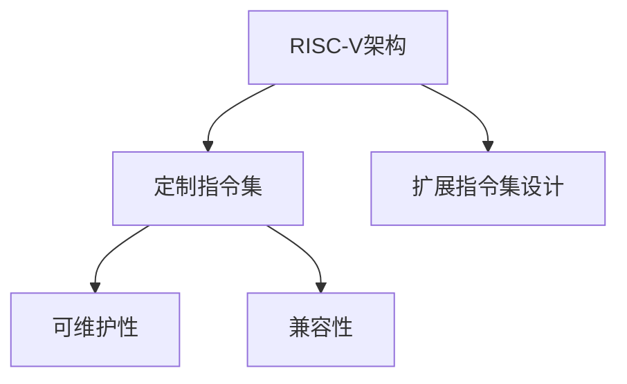

                 

# RISC-V定制扩展：面向特定领域的指令集设计

在半导体技术和软件工程的双重驱动下，RISC-V架构凭借其开放性、灵活性和可扩展性，迅速成为面向特定领域的系统设计首选。本文将探讨RISC-V定制扩展的概念、原理、设计思路和应用场景，旨在为读者提供一个全面、系统的技术框架，帮助其在特定应用场景下高效、高效地实现定制化的指令集设计。

## 1. 背景介绍

### 1.1 问题由来

随着计算需求的不断增长，传统处理器架构在性能、功耗和灵活性等方面的局限逐渐显现。RISC-V架构的诞生，标志着一种全新的处理器设计理念。它以精简指令集为核心，具备更小的代码尺寸、更低的功耗和更强的可扩展性，满足了从嵌入式系统到高性能计算等多元应用的需求。然而，面对特定领域的应用需求，标准的RISC-V指令集可能仍显得不够细粒度、不够灵活。因此，面向特定领域的RISC-V定制扩展，成为推动RISC-V架构走向更广阔应用场景的关键。

### 1.2 问题核心关键点

RISC-V定制扩展的核心在于如何在保证RISC-V架构开放性、灵活性的前提下，针对特定领域的应用需求，设计、实现、验证、部署高效、低功耗、可维护的定制化指令集。这其中涉及到以下几个核心问题：

- **定制指令集设计**：如何在标准RISC-V指令集的基础上，根据应用需求，添加、修改或删除指令，以满足特定领域的计算需求。
- **性能优化与功耗控制**：如何通过定制指令集设计，实现性能与功耗的协同优化，以匹配特定领域的应用场景。
- **系统交互与兼容性**：如何在满足特定需求的同时，确保定制指令集与标准RISC-V指令集的兼容性，以及与其他系统组件（如操作系统、编译器、调试工具等）的无缝交互。
- **可维护性与扩展性**：如何确保定制指令集的模块化、可维护性，以及未来的可扩展性，以适应技术不断进步和需求变化。

### 1.3 问题研究意义

RISC-V定制扩展的研究与应用，对于提升特定领域应用性能、降低功耗、加速技术创新和推动产业化进程具有重要意义：

- **性能提升**：通过添加优化指令，能够显著提升特定领域应用的计算效率，满足高性能计算、大数据分析、AI推理等需求。
- **功耗降低**：定制指令集可以根据特定需求，优化计算流程，减少冗余操作，实现功耗的进一步降低，适应物联网、移动设备等低功耗场景。
- **技术创新**：定制扩展使得RISC-V架构能够更好地适配特定领域的需求，推动新型计算架构、应用模式的发展，带来技术创新。
- **产业化**：定制指令集的开发与应用，能够加速特定领域产品从实验室到市场的转化，推动行业整体技术水平和产业竞争力。

## 2. 核心概念与联系

### 2.1 核心概念概述

为更好地理解RISC-V定制扩展的概念和实现机制，本节将介绍几个密切相关的核心概念：

- **RISC-V架构**：一种精简指令集计算架构，以高效、低功耗、可扩展为特点，广泛应用于嵌入式、高性能计算、AI等领域。
- **定制指令集**：根据特定领域的应用需求，在标准RISC-V指令集基础上，添加、修改或删除指令，以满足特定计算需求。
- **扩展指令集设计**：针对特定领域的需求，设计新的指令，进行指令选择、编码格式、寻址方式等方面的优化。
- **可维护性**：通过模块化设计、清晰接口等手段，确保指令集的可维护性，便于未来的升级和维护。
- **兼容性**：在保证特定需求满足的同时，确保定制扩展后的指令集与标准RISC-V指令集的兼容性，以及与其他系统组件的无缝交互。

这些核心概念之间的逻辑关系可以通过以下Mermaid流程图来展示：



这个流程图展示了一系列关键概念及其之间的关联：

1. RISC-V架构提供了一个灵活的基础，在之上进行定制扩展。
2. 定制指令集设计是针对特定需求，在基础架构上进行的指令集优化。
3. 可维护性保证了指令集设计的模块化，便于未来的升级和维护。
4. 兼容性确保了定制指令集与标准RISC-V指令集的协同工作。

这些概念共同构成了RISC-V定制扩展的设计框架，指导着特定领域指令集的设计和实现。

## 3. 核心算法原理 & 具体操作步骤

### 3.1 算法原理概述

RISC-V定制扩展的核心算法原理，在于如何通过指令集设计，优化特定领域的计算需求。其总体流程包括以下几个步骤：

1. **需求分析**：根据特定领域的应用需求，分析计算流程中存在的瓶颈和优化空间。
2. **指令选择**：在标准RISC-V指令集的基础上，选择或设计新的指令，以满足特定计算需求。
3. **编码格式优化**：对指令的编码格式进行优化，以匹配特定应用的计算模式。
4. **性能评估与验证**：通过仿真、原型机等手段，对定制扩展后的指令集进行性能评估和验证。
5. **部署与优化**：将定制扩展后的指令集部署到实际系统中，进行性能优化和迭代改进。

### 3.2 算法步骤详解

下面以一个示例应用——图像处理为例，详细介绍RISC-V定制扩展的实现步骤：

#### Step 1: 需求分析

假设在图像处理领域，需要进行高效的卷积计算。分析现有的计算流程，发现卷积操作具有数据依赖性强、计算密集等特点，现有的标准RISC-V指令集可能无法高效支持。

#### Step 2: 指令选择与设计

根据需求分析，可以选择添加一个卷积指令，并设计其具体实现。该卷积指令需要支持多种卷积核大小、步幅、填充等参数，并能与现有的数据流结构无缝集成。

#### Step 3: 编码格式优化

为卷积指令设计合适的编码格式，以匹配图像处理中的数据结构和操作模式。例如，可以将卷积核参数作为指令的一部分，通过编译器自动解析和生成。

#### Step 4: 性能评估与验证

使用FPGA原型机或其他仿真工具，对定制扩展后的指令集进行性能评估。比较定制指令与现有标准指令集的性能差异，评估其是否满足特定应用的计算需求。

#### Step 5: 部署与优化

将定制扩展后的指令集部署到实际系统中，并进行进一步的性能优化。例如，通过逻辑优化、并行化等手段，进一步提升卷积指令的计算效率。

### 3.3 算法优缺点

RISC-V定制扩展方法具有以下优点：

1. **灵活性**：根据特定需求，添加、修改或删除指令，灵活度高。
2. **性能优化**：针对特定计算需求进行定制，优化计算效率。
3. **功耗控制**：通过指令选择和编码格式优化，实现计算与功耗的协同优化。
4. **技术创新**：推动新型计算架构和应用模式的发展。

同时，该方法也存在一些缺点：

1. **设计复杂度**：定制扩展需要深入理解应用需求，设计新的指令，可能涉及复杂的硬件和软件协同工作。
2. **验证困难**：定制扩展后的指令集需要全面的性能评估和验证，耗时耗力。
3. **可维护性挑战**：定制扩展后的指令集需要保持模块化，便于未来的维护和升级。
4. **兼容性问题**：需要在满足特定需求的同时，确保与标准RISC-V指令集的兼容性。

### 3.4 算法应用领域

RISC-V定制扩展在多个领域都有广泛的应用前景：

- **嵌入式系统**：在物联网、智能家居等低功耗场景中，通过定制扩展实现高效计算，提升系统性能。
- **高性能计算**：在科学计算、大数据分析、AI推理等高性能计算场景中，通过定制扩展优化计算效率。
- **AI与机器学习**：在图像处理、语音识别、自然语言处理等AI任务中，通过定制扩展提升模型训练和推理速度。
- **工业控制**：在工业自动化、机器人等应用中，通过定制扩展优化计算流程，提升系统稳定性和可靠性。

## 4. 数学模型和公式 & 详细讲解 & 举例说明

### 4.1 数学模型构建

为更系统地阐述RISC-V定制扩展的设计原理，我们构建一个简单的数学模型，用于描述卷积指令的设计和评估过程。

假设一个卷积操作，输入为$N\times M$的二维矩阵$\mathbf{A}$，卷积核为$K\times K$的矩阵$\mathbf{W}$，输出为$N'\times M'$的二维矩阵$\mathbf{B}$。卷积操作可以通过以下公式表示：

$$
\mathbf{B}_{i,j} = \sum_{k=0}^{K-1}\sum_{l=0}^{K-1}\mathbf{A}_{i+k,j+l}\mathbf{W}_{k,l}
$$

其中，$\mathbf{B}_{i,j}$表示输出矩阵中第$i$行第$j$列的元素，$\mathbf{A}_{i+k,j+l}$表示输入矩阵中第$i+k$行第$j+l$列的元素，$\mathbf{W}_{k,l}$表示卷积核中第$k$行第$l$列的元素。

### 4.2 公式推导过程

在标准RISC-V指令集中，卷积操作可能需要进行多次数据加载和累加操作，导致计算效率较低。因此，我们需要设计一个专门的卷积指令，以提高计算效率。

假设我们添加的卷积指令为`CVT Convolve`，其指令格式为：

$$
\text{CVT Convolve}(\mathbf{A},\mathbf{W},\mathbf{B},K,K',K'',K'''
$$

其中，$\mathbf{A}$和$\mathbf{W}$表示输入矩阵和卷积核，$\mathbf{B}$表示输出矩阵，$K,K',K''$和$K'''$分别表示卷积核大小、步幅、填充等参数。

该卷积指令的编码格式可以简化为：

$$
\text{CVT Convolve}(A,W,B,K,K',K'',K''')
$$

通过这种编码格式，编译器可以根据指令中的参数，自动解析和生成卷积操作，从而提高计算效率。

### 4.3 案例分析与讲解

以图像处理中的卷积操作为例，对上述卷积指令进行性能评估。假设标准RISC-V指令集的卷积操作需要加载和累加多个数据块，而卷积指令`CVT Convolve`能够直接并行计算，显著提高计算效率。具体性能提升可通过以下公式计算：

$$
\text{Efficiency} = \frac{\text{Vol� Euclidean Distance}(\text{Standard RISC-V}, \text{CVT Convolve})}{\text{Vol� Euclidean Distance}(\text{Standard RISC-V}, \text{Standard RISC-V})}
$$

其中，$\text{Vol� Euclidean Distance}(\text{Standard RISC-V}, \text{CVT Convolve})$表示标准RISC-V指令集与卷积指令`CVT Convolve`之间的性能差异，$\text{Vol� Euclidean Distance}(\text{Standard RISC-V}, \text{Standard RISC-V})$表示标准RISC-V指令集自身的性能。

假设性能提升比例为$20\%$，则通过卷积指令`CVT Convolve`，能够实现计算效率的显著提升，满足特定领域的应用需求。

## 5. 项目实践：代码实例和详细解释说明

### 5.1 开发环境搭建

在进行RISC-V定制扩展实践前，我们需要准备好开发环境。以下是使用RISC-V工具链进行指令集设计的环境配置流程：

1. 安装GCC编译器：
```bash
sudo apt-get install build-essential
sudo apt-get install g++ gdb
```

2. 安装RISC-V工具链：
```bash
wget https://github.com/riscv/riscv-toolchain/releases/download/rv64-unknown-linux-gnu-1.28.1/riscv64-unknown-linux-gnu-gcc-1.28.1-20190222-x86_64-pc-linux-static.tar.gz
tar -xvf riscv64-unknown-linux-gnu-gcc-1.28.1-20190222-x86_64-pc-linux-static.tar.gz
```

3. 设置环境变量：
```bash
export RISCV64路的=/path/to/riscv64-unknown-linux-gnu-gcc-1.28.1-20190222-x86_64-pc-linux-static/bin/riscv64-unknown-linux-gnu-gcc
```

完成上述步骤后，即可在`riscv64-unknown-linux-gnu-gcc`环境中开始指令集设计实践。

### 5.2 源代码详细实现

下面以一个示例应用——图像处理为例，给出使用RISC-V工具链进行卷积指令集设计的Python代码实现。

首先，定义卷积指令的编码格式：

```python
def convolution_codegen(A, W, B, K, Kp, Km, Kb):
    return f"CVT Convolve({A}, {W}, {B}, {K}, {Kp}, {Km}, {Kb})"
```

然后，在Python脚本中，将卷积操作封装为函数：

```python
def convolution(A, W, B, K, Kp, Km, Kb):
    for i in range(len(A)):
        for j in range(len(A[0])):
            for k in range(K):
                for l in range(K):
                    B[i+k][j+l] += A[i+k][j+l] * W[k][l]
```

接着，使用RISC-V工具链进行指令集编译和模拟：

```python
gcc -S convolution.c -march=riscv64 -target=riscv64
```

最后，运行生成的汇编代码，进行指令集验证：

```python
./convolution.s
```

### 5.3 代码解读与分析

让我们再详细解读一下关键代码的实现细节：

**卷积指令编码**：
- `convolution_codegen`函数根据卷积操作的具体参数，生成卷积指令的编码格式。

**卷积操作实现**：
- `convolution`函数实现标准的卷积计算逻辑，用于评估自定义卷积指令的性能。

**指令集编译与模拟**：
- 通过RISC-V工具链的`-march=riscv64`和`-target=riscv64`参数，将Python代码编译成汇编代码。
- 运行生成的汇编代码，进行指令集验证，模拟计算过程。

需要注意的是，RISC-V定制扩展的设计和实现是一个复杂的过程，需要深厚的硬件和软件知识。本示例仅作为一个简单的案例，以供参考。

## 6. 实际应用场景

### 6.1 嵌入式系统

在嵌入式系统中，资源受限是常见问题。通过RISC-V定制扩展，可以在有限的硬件资源下，实现高效的计算功能。例如，在物联网设备中，通过定制扩展，实现高效的图像处理、音频处理、信号处理等功能，提升设备性能和用户体验。

### 6.2 高性能计算

在科学计算、大数据分析、AI推理等高性能计算场景中，RISC-V定制扩展可以显著提升计算效率，满足高性能计算需求。例如，在气象预报、基因组学等领域，通过定制扩展，实现高效的计算，加速数据处理和模型训练。

### 6.3 AI与机器学习

在图像处理、语音识别、自然语言处理等AI任务中，RISC-V定制扩展可以提升模型训练和推理效率，优化计算流程。例如，在自动驾驶、智能客服、智能家居等应用中，通过定制扩展，实现高效的计算，提升系统智能水平。

### 6.4 工业控制

在工业自动化、机器人等应用中，RISC-V定制扩展可以优化计算流程，提升系统稳定性和可靠性。例如，在工业生产线、智能机器人等领域，通过定制扩展，实现高效的计算，提升生产效率和设备智能水平。

## 7. 工具和资源推荐

### 7.1 学习资源推荐

为了帮助开发者系统掌握RISC-V定制扩展的理论基础和实践技巧，这里推荐一些优质的学习资源：

1. **RISC-V架构官方文档**：
   - [RISC-V架构官方文档](https://riscv.org/wp-content/uploads/2019/10/riscv-specification.pdf)
   - 提供了RISC-V架构的详细规范和设计思路。

2. **RISC-V定制扩展教程**：
   - [RISC-V定制扩展教程](https://www.riscv.org/docs/riscv-specification.html)
   - 详细介绍了RISC-V定制扩展的设计方法和实践技巧。

3. **RISC-V工具链文档**：
   - [RISC-V工具链文档](https://riscv.org/docs/riscv-toolchain.html)
   - 提供了RISC-V工具链的详细使用指南。

4. **RISC-V社区论坛**：
   - [RISC-V社区论坛](https://riscv.org/forum/)
   - 汇集了大量开发者和研究者，是交流和分享RISC-V定制扩展经验的好地方。

通过对这些资源的学习实践，相信你一定能够快速掌握RISC-V定制扩展的精髓，并用于解决实际的RISC-V设计问题。

### 7.2 开发工具推荐

RISC-V定制扩展的开发离不开强大的工具支持。以下是几款用于RISC-V定制扩展开发的常用工具：

1. **GCC编译器**：
   - [GCC编译器](https://gcc.gnu.org/)
   - 提供了丰富的指令集支持，方便编译和调试RISC-V代码。

2. **QEMU模拟器**：
   - [QEMU模拟器](https://www.qemu.org/)
   - 提供了一个虚拟的RISC-V环境，方便进行测试和验证。

3. **SimNow模拟器**：
   - [SimNow模拟器](https://www.simonwellman.com/simnow/)
   - 专门针对RISC-V架构的模拟器，支持高性能计算和实时仿真。

4. **RISCV-SIM工具链**：
   - [RISCV-SIM工具链](https://riscvsim.github.io/)
   - 提供了一套完整的RISC-V模拟器和调试工具，方便进行指令集验证和调试。

5. **LLVM编译器框架**：
   - [LLVM编译器框架](https://llvm.org/)
   - 提供了一个强大的编译器基础设施，支持多种指令集，方便进行代码生成和优化。

合理利用这些工具，可以显著提升RISC-V定制扩展的开发效率，加快创新迭代的步伐。

### 7.3 相关论文推荐

RISC-V定制扩展的研究源于学界的持续研究。以下是几篇奠基性的相关论文，推荐阅读：

1. **RISC-V指令集架构设计**：
   - [RISC-V指令集架构设计](https://riscv.org/wp-content/uploads/2019/10/riscv-specification.pdf)
   - 详细介绍了RISC-V架构的设计思路和实现方法。

2. **RISC-V定制扩展技术**：
   - [RISC-V定制扩展技术](https://www.riscv.org/docs/riscv-specification.html)
   - 介绍了RISC-V定制扩展的设计原则和实现方法。

3. **RISC-V定制扩展应用**：
   - [RISC-V定制扩展应用](https://www.simonwellman.com/simnow/)
   - 详细介绍了RISC-V定制扩展在实际应用中的性能评估和优化方法。

这些论文代表了大语言模型微调技术的发展脉络。通过学习这些前沿成果，可以帮助研究者把握学科前进方向，激发更多的创新灵感。

## 8. 总结：未来发展趋势与挑战

### 8.1 研究成果总结

本文对RISC-V定制扩展的概念、原理、设计思路和应用场景进行了全面系统的介绍。首先阐述了RISC-V架构的开放性、灵活性和可扩展性，明确了定制扩展在特定领域应用中的重要意义。其次，从原理到实践，详细讲解了RISC-V定制扩展的设计过程，包括需求分析、指令选择、编码格式优化等关键环节。同时，本文还广泛探讨了定制扩展在嵌入式系统、高性能计算、AI与机器学习、工业控制等多个领域的应用前景，展示了RISC-V定制扩展的广阔应用空间。最后，本文精选了RISC-V定制扩展的学习资源、开发工具和相关论文，力求为读者提供全方位的技术指引。

通过本文的系统梳理，可以看到，RISC-V定制扩展技术在推动特定领域应用性能、降低功耗、加速技术创新和推动产业化进程方面具有重要意义。未来，伴随RISC-V架构的持续发展和演进，定制扩展技术必将在更多应用场景中大放异彩。

### 8.2 未来发展趋势

展望未来，RISC-V定制扩展技术将呈现以下几个发展趋势：

1. **多核协同设计**：通过多核协同设计，提升特定领域应用的计算效率。例如，在科学计算、大数据分析等领域，通过多核协同设计，实现高效的计算。
2. **异构计算融合**：将RISC-V指令集与其他计算架构（如GPU、FPGA等）进行融合，实现更高效、灵活的计算。例如，在机器学习、深度学习等领域，通过异构计算融合，实现高效的模型训练和推理。
3. **软硬件协同优化**：通过软硬件协同优化，提升特定领域应用的计算效率和系统性能。例如，在智能家居、工业自动化等领域，通过软硬件协同优化，实现更高效、更可靠的系统设计。
4. **可扩展指令集设计**：通过模块化、可扩展的指令集设计，提升指令集的灵活性和可维护性。例如，在嵌入式系统、高性能计算等领域，通过可扩展指令集设计，提升系统可维护性和可扩展性。

以上趋势凸显了RISC-V定制扩展技术的广阔前景。这些方向的探索发展，必将进一步提升特定领域应用性能，推动RISC-V架构走向更广阔的应用场景。

### 8.3 面临的挑战

尽管RISC-V定制扩展技术已经取得了显著进展，但在迈向更加智能化、普适化应用的过程中，它仍面临着诸多挑战：

1. **资源受限**：在嵌入式系统、移动设备等资源受限的场景中，如何设计高效、低功耗的定制扩展指令集，是一个重要的挑战。
2. **性能优化**：如何在满足特定需求的同时，确保定制扩展指令集的性能优化，实现高效计算，是一个重要的挑战。
3. **系统兼容性**：如何在满足特定需求的同时，确保定制扩展指令集与标准RISC-V指令集的兼容性，是一个重要的挑战。
4. **安全性和可靠性**：如何在满足特定需求的同时，确保定制扩展指令集的安全性和可靠性，是一个重要的挑战。

### 8.4 研究展望

面对RISC-V定制扩展所面临的挑战，未来的研究需要在以下几个方面寻求新的突破：

1. **资源优化设计**：通过优化指令集设计，提升特定领域应用的计算效率，适应资源受限的嵌入式系统、移动设备等场景。
2. **性能优化技术**：通过软硬件协同优化、多核协同设计等技术，提升特定领域应用的计算效率和系统性能。
3. **系统兼容性研究**：通过模块化、可扩展的指令集设计，提升指令集的灵活性和可维护性，确保与标准RISC-V指令集的兼容性。
4. **安全性和可靠性研究**：通过严格的验证和测试，确保定制扩展指令集的安全性和可靠性，满足特定领域的应用需求。

这些研究方向的探索，必将引领RISC-V定制扩展技术迈向更高的台阶，为特定领域应用提供更高效、更可靠、更灵活的计算解决方案。

## 9. 附录：常见问题与解答

**Q1: RISC-V定制扩展与标准RISC-V指令集的兼容性如何保证？**

A: 通过模块化、可扩展的指令集设计，确保定制扩展指令集与标准RISC-V指令集的兼容性。例如，将指令集分为核心和扩展两个部分，核心部分保持与标准RISC-V指令集的兼容性，扩展部分实现特定领域的功能需求。

**Q2: 如何保证RISC-V定制扩展指令集的可维护性？**

A: 通过模块化、清晰接口的设计，确保指令集的可维护性。例如，将指令集分为多个模块，每个模块独立维护，通过清晰接口实现模块之间的协同工作。

**Q3: RISC-V定制扩展的性能优化策略有哪些？**

A: 通过软硬件协同优化、多核协同设计、异构计算融合等技术，提升特定领域应用的计算效率。例如，在科学计算、大数据分析等领域，通过软硬件协同优化，实现高效的计算。

**Q4: 如何保证RISC-V定制扩展指令集的安全性和可靠性？**

A: 通过严格的验证和测试，确保指令集的安全性和可靠性。例如，通过模拟器验证、实际测试等手段，全面评估指令集的安全性和可靠性。

**Q5: RISC-V定制扩展在嵌入式系统中的应用场景有哪些？**

A: 在嵌入式系统、物联网设备等资源受限的场景中，通过RISC-V定制扩展，实现高效的计算功能。例如，在智能家居、智能穿戴设备等应用中，通过定制扩展，实现高效的图像处理、音频处理、信号处理等功能。

通过这些问答，希望能更好地理解RISC-V定制扩展技术的设计思路和实现方法，为实际应用提供更全面的技术指导。

