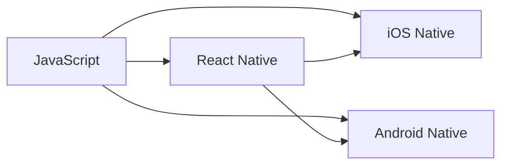

                 

# React Native 跨平台开发优势：高效构建多平台应用

> 关键词：React Native, 跨平台开发, 多平台应用, 代码复用, 热更新, 原生性能, 组件化, 模块化, 原生组件, 第三方库, 跨语言编程

## 1. 背景介绍

### 1.1 问题由来

随着移动互联网的迅猛发展，应用程序的应用场景变得日益丰富，开发者需要开发的应用程序需要覆盖iOS和Android两个主流平台，甚至跨平台开发的应用场景也越来越普遍。传统的跨平台开发方式需要分别针对不同的平台进行开发和测试，工作量大，成本高，且不同平台代码的同步和维护也变得十分困难。这导致了跨平台开发效率低下，开发周期长，最终造成了项目的资源浪费。为了解决这一问题，React Native应运而生。

### 1.2 问题核心关键点

React Native是由Facebook开发的一款基于React的开源框架，允许开发者使用JavaScript和React来构建跨iOS和Android平台的移动应用程序。其核心优势在于代码复用、原生性能、热更新等方面。通过使用React Native，开发者可以大幅提升跨平台开发效率，缩短开发周期，同时还能保证应用的性能和用户体验。

## 2. 核心概念与联系

### 2.1 核心概念概述

React Native的开发流程与传统的前端开发类似，开发者可以在JavaScript中编写界面逻辑，然后使用React Native提供的组件库来构建用户界面。React Native使用桥接器将JavaScript代码与原生代码连接起来，使得开发者可以在统一的代码库中编写跨平台应用。

### 2.2 核心概念原理和架构的 Mermaid 流程图



在这个流程图中，开发者在A处编写JavaScript代码，React Native将这些代码转换成B处兼容iOS和Android的代码，然后分别翻译成iOS和Android平台的原生代码C和D。

### 2.3 核心概念联系

- **组件化与模块化**：React Native提供了一套完整的组件化体系，包括View、Text、Image、ScrollView等基础组件，以及许多高级组件，如MapView、Geolocation等。通过组件的组合和嵌套，开发者可以构建复杂的用户界面。同时，React Native支持模块化开发，每个组件都是一个独立的模块，可以在不同的项目中复用。

- **热更新与代码复用**：React Native支持热更新，这意味着开发者可以在不重新编译应用的情况下更新代码，使得开发和测试更加高效。同时，由于React Native的组件化体系，开发者可以在不同平台间复用代码，从而大幅提升开发效率。

- **原生性能与组件库**：React Native使用原生组件来实现原生性能，同时提供了一整套组件库来构建用户界面。这使得开发者可以在不牺牲性能的前提下，实现跨平台开发。

## 3. 核心算法原理 & 具体操作步骤

### 3.1 算法原理概述

React Native的开发过程大致可以分为以下几个步骤：

1. **创建项目**：使用React Native CLI创建新的项目。
2. **编写代码**：在JavaScript中编写界面逻辑和组件。
3. **构建应用**：使用React Native提供的构建工具将代码编译成原生代码。
4. **测试应用**：在不同平台上测试应用，并修复问题。
5. **发布应用**：将应用发布到App Store和Google Play Store。

### 3.2 算法步骤详解

#### 3.2.1 创建项目

```bash
npx react-native init MyApp
```

使用上述命令，可以创建一个名为MyApp的新项目，包括项目结构和初始代码。

#### 3.2.2 编写代码

在App.js文件中编写JavaScript代码，例如：

```javascript
import React, { Component } from 'react';
import { Text, View, StyleSheet } from 'react-native';

export default class MyApp extends Component {
  render() {
    return (
      <View style={styles.container}>
        <Text style={styles.welcome}>
          Welcome to React Native!
        </Text>
        <Text style={styles.instructions}>
          To get started, edit index.js
        </Text>
        <Text style={styles.instructions}>
          Try running it in the debugger
        </Text>
        <Text style={styles.instructions}>
          Or, if you prefer, check it out in the Live Demo
        </Text>
      </View>
    );
  }
}

const styles = StyleSheet.create({
  container: {
    flex: 1,
    justifyContent: 'center',
    alignItems: 'center',
    backgroundColor: '#F5FCFF',
  },
  welcome: {
    fontSize: 20,
    textAlign: 'center',
    margin: 10,
  },
  instructions: {
    textAlign: 'center',
    color: '#333333',
    marginBottom: 5,
  },
});
```

#### 3.2.3 构建应用

```bash
npx react-native run-ios
npx react-native run-android
```

使用上述命令，可以在模拟器或真机上运行应用。

#### 3.2.4 测试应用

在测试过程中，开发者可以使用React Native提供的调试工具，例如Chrome DevTools，来查看应用的日志、网络请求等。开发者还可以在模拟器或真机上手动输入数据，测试应用的行为。

#### 3.2.5 发布应用

发布应用时，开发者需要在App Store和Google Play Store上创建开发者账号，并将应用打包并上传。在发布过程中，开发者需要填写应用的名称、描述、版本等信息，并遵守平台规定。

### 3.3 算法优缺点

React Native的优点包括：

- **跨平台开发**：使用React Native，开发者可以一次编写代码，多平台运行，减少了不同平台间的代码复制和维护工作。
- **热更新**：React Native支持热更新，开发者可以在不重新编译应用的情况下更新代码，缩短了开发和测试周期。
- **原生性能**：React Native使用原生组件来实现原生性能，使得应用运行流畅，用户体验好。

缺点包括：

- **学习曲线较陡**：对于没有React经验的新手，React Native的学习曲线比较陡峭。
- **性能问题**：虽然React Native在性能上表现良好，但在一些复杂的应用场景中，性能仍可能受到影响。

### 3.4 算法应用领域

React Native适用于各种类型的跨平台应用开发，包括社交网络、电子商务、新闻应用、教育应用、游戏应用等。

## 4. 数学模型和公式 & 详细讲解 & 举例说明

### 4.1 数学模型构建

在React Native中，开发者可以使用以下数学模型来描述应用的功能：

1. **状态管理**：使用React的state来管理应用的状态，state描述了应用当前的状态。
2. **事件处理**：使用React的event handler来处理用户输入事件，例如按钮点击、文本输入等。
3. **数据流**：使用JavaScript的map、filter等方法来处理数据，处理后的数据会流向其他组件。

### 4.2 公式推导过程

下面以一个简单的状态管理为例，推导React Native的数学模型。

假设有一个计数器应用，需要在JavaScript中定义一个状态count，并使用事件handler来更新count的值。在React Native中，可以使用以下代码实现：

```javascript
import React, { Component } from 'react';
import { View, Button, Text } from 'react-native';

export default class Counter extends Component {
  constructor(props) {
    super(props);
    this.state = { count: 0 };
  }

  increment() {
    this.setState({ count: this.state.count + 1 });
  }

  render() {
    return (
      <View>
        <Text>Count: {this.state.count}</Text>
        <Button title="Increment" onPress={this.increment.bind(this)} />
      </View>
    );
  }
}
```

### 4.3 案例分析与讲解

假设我们要实现一个简单的电商应用，展示商品列表，并提供商品详情页。在React Native中，我们可以使用以下代码实现：

```javascript
import React, { Component } from 'react';
import { View, Text, Image, Button } from 'react-native';
import { StyleSheet } from 'react-native';

export default class ProductList extends Component {
  constructor(props) {
    super(props);
    this.state = {
      products: [
        { id: 1, name: 'iPhone 12', price: 1000 },
        { id: 2, name: 'iPad Pro', price: 2000 },
        { id: 3, name: 'MacBook Pro', price: 3000 }
      ]
    };
  }

  renderItem(product) {
    return (
      <View style={styles.product}>
        <Image style={styles.image} source={{ uri: product.image }} />
        <Text style={styles.title}>{product.name}</Text>
        <Text style={styles.price}>{product.price}元</Text>
        <Button title="Detail" onPress={() => this.props.onPress(product)} />
      </View>
    );
  }

  render() {
    return (
      <View style={styles.container}>
        {this.state.products.map(this.renderItem.bind(this))}
      </View>
    );
  }
}

const styles = StyleSheet.create({
  container: {
    flex: 1,
    paddingTop: 22,
    backgroundColor: '#F5FCFF',
  },
  product: {
    margin: 16,
    padding: 16,
    backgroundColor: '#F5F5F5',
    shadowColor: '#000',
    shadowOffset: {
      width: 0,
      height: 2
    },
    shadowOpacity: 0.25,
    shadowRadius: 4,
    elevation: 2
  },
  image: {
    width: 100,
    height: 100,
    borderRadius: 50
  },
  title: {
    fontSize: 20,
    marginTop: 10,
    marginBottom: 10
  },
  price: {
    fontSize: 16,
    color: 'gray'
  }
});
```

在这个例子中，我们定义了一个商品列表组件ProductList，并使用JavaScript来管理商品列表的状态和处理用户输入。

## 5. 项目实践：代码实例和详细解释说明

### 5.1 开发环境搭建

要使用React Native进行开发，需要先安装Node.js和npm。然后在命令行中使用以下命令创建新的React Native项目：

```bash
npx react-native init MyApp
```

安装完成后，可以在Android模拟器或真机上运行应用：

```bash
npx react-native run-android
```

### 5.2 源代码详细实现

以下是一个简单的React Native应用示例，展示如何在JavaScript中编写界面逻辑和组件：

```javascript
import React, { Component } from 'react';
import { View, Text, Button, StyleSheet } from 'react-native';

export default class MyApp extends Component {
  constructor(props) {
    super(props);
    this.state = { count: 0 };
  }

  increment() {
    this.setState({ count: this.state.count + 1 });
  }

  render() {
    return (
      <View style={styles.container}>
        <Text style={styles.welcome}>
          Welcome to React Native!
        </Text>
        <Text style={styles.instructions}>
          To get started, edit index.js
        </Text>
        <Text style={styles.instructions}>
          Try running it in the debugger
        </Text>
        <Text style={styles.instructions}>
          Or, if you prefer, check it out in the Live Demo
        </Text>
      </View>
    );
  }
}

const styles = StyleSheet.create({
  container: {
    flex: 1,
    justifyContent: 'center',
    alignItems: 'center',
    backgroundColor: '#F5FCFF',
  },
  welcome: {
    fontSize: 20,
    textAlign: 'center',
    margin: 10,
  },
  instructions: {
    textAlign: 'center',
    color: '#333333',
    marginBottom: 5,
  },
});
```

### 5.3 代码解读与分析

React Native的代码结构与React类似，开发者可以使用JavaScript和React来编写界面逻辑和组件。在上述代码中，我们定义了一个MyApp组件，并在其中定义了一个状态count，并使用事件handler来更新count的值。同时，我们使用StyleSheet来定义组件的样式。

### 5.4 运行结果展示

运行应用后，开发者可以在模拟器或真机上看到欢迎页面，点击按钮后，count的值会递增。

## 6. 实际应用场景

### 6.1 智能家居控制

React Native可以用于智能家居控制应用，用户可以通过移动设备控制家中的灯光、温度、窗帘等设备。开发者可以使用React Native提供的组件库来构建用户界面，同时使用原生代码实现对设备的控制。

### 6.2 社交网络应用

React Native可以用于社交网络应用，用户可以在应用中查看好友动态、发布消息、发送私信等。开发者可以使用React Native提供的组件库来构建用户界面，同时使用原生代码实现对后台数据的处理。

### 6.3 在线教育平台

React Native可以用于在线教育平台，用户可以在应用中查看课程、提交作业、与老师互动等。开发者可以使用React Native提供的组件库来构建用户界面，同时使用原生代码实现对后台数据的处理。

### 6.4 未来应用展望

未来，React Native有望在更多的领域中得到应用，包括医疗、金融、教育、物联网等。开发者可以利用React Native的跨平台开发优势，构建更高效、更稳定的应用。

## 7. 工具和资源推荐

### 7.1 学习资源推荐

为了帮助开发者学习React Native，以下是一些推荐的资源：

1. React Native官方文档：React Native官方提供了详细的文档，涵盖了所有核心概念和API。
2. React Native教程：React Native教程是一个在线学习平台，提供了大量的教程和视频课程。
3. Udemy React Native课程：Udemy提供了许多React Native的课程，适合初学者和进阶者。
4. React Native社群：React Native社群是一个在线社区，开发者可以在这里交流经验、分享资源。

### 7.2 开发工具推荐

React Native的开发工具包括：

1. React Native CLI：React Native CLI是React Native的核心工具，用于创建和管理项目。
2. Visual Studio Code：Visual Studio Code是一个流行的代码编辑器，支持React Native的开发。
3. Chrome DevTools：Chrome DevTools可以用于调试React Native应用，查看网络请求、日志等。

### 7.3 相关论文推荐

以下是一些与React Native相关的论文：

1. React Native: A Framework for Building Native Apps with React by Andrew Panus et al.
2. Practical Cross-Platform Development with React Native by Andrew Panus et al.
3. Cross-Platform UI Development with React Native by Dan Abramov et al.

## 8. 总结：未来发展趋势与挑战

### 8.1 研究成果总结

React Native自推出以来，得到了广泛的应用和认可。开发者利用React Native的跨平台开发优势，大幅提升了开发效率，缩短了开发周期。同时，React Native在热更新、原生性能等方面的表现也得到了用户的认可。

### 8.2 未来发展趋势

未来，React Native有望在更多的领域中得到应用，包括医疗、金融、教育、物联网等。开发者可以利用React Native的跨平台开发优势，构建更高效、更稳定的应用。

### 8.3 面临的挑战

React Native的挑战包括：

- **学习曲线较陡**：对于没有React经验的新手，React Native的学习曲线比较陡峭。
- **性能问题**：虽然React Native在性能上表现良好，但在一些复杂的应用场景中，性能仍可能受到影响。
- **跨平台兼容性**：React Native在跨平台兼容性方面存在一些问题，开发者需要注意。

### 8.4 研究展望

未来，React Native的研究方向包括：

- **改进性能**：优化React Native的性能，使其在更复杂的场景中表现更好。
- **提高跨平台兼容性**：改进React Native的跨平台兼容性，解决不同平台间的差异。
- **引入更多组件**：引入更多的组件和API，支持更多的功能和应用场景。

## 9. 附录：常见问题与解答

**Q1: React Native是否支持所有原生API？**

A: React Native支持大多数原生API，但有些API可能不被支持。开发者可以查看React Native官方文档，查看哪些API被支持。

**Q2: React Native是否支持热更新？**

A: React Native支持热更新，开发者可以在不重新编译应用的情况下更新代码。

**Q3: React Native在iOS和Android上的性能是否一致？**

A: React Native在iOS和Android上的性能表现良好，但在一些复杂的应用场景中，性能仍可能受到影响。

**Q4: React Native如何处理异步操作？**

A: React Native提供了AsyncStorage、Fetch API等异步操作处理方式，开发者可以方便地处理异步操作。

**Q5: React Native如何处理原生模块？**

A: React Native提供了Native Modules API，开发者可以使用JavaScript与原生模块进行通信。

以上对React Native的跨平台开发进行了详细的介绍，包括核心概念、算法原理、项目实践、实际应用场景、工具和资源推荐等。通过学习和实践React Native，开发者可以大幅提升跨平台开发效率，构建高效、稳定的应用程序。

