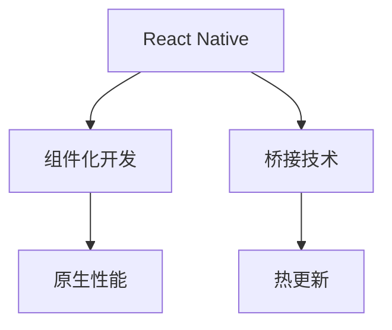

                 

# React Native 跨平台开发：高效的移动应用

> 关键词：React Native, 跨平台, 移动应用开发, 原生性能, 热更新, 桥接技术, 组件化开发, Webview, FlatList, 状态管理, Redux, 组件重用

## 1. 背景介绍

在移动互联网时代，应用开发迅速成为软件开发人员的重要工作内容。然而，传统的应用开发模式往往需要为每个平台（如iOS、Android、Windows等）分别开发，不仅耗时耗力，且难以维持多个平台版本间的同步更新。为了解决这一问题，跨平台开发技术应运而生。

React Native是Facebook开发的一款流行的跨平台移动应用开发框架，采用JavaScript语言开发，并结合原生组件，旨在实现一次编写、多端部署的目标。React Native的诞生，为移动应用开发者提供了极大的便利，降低了跨平台开发的技术门槛，同时也提高了开发效率和应用性能。

本文将深入探讨React Native的核心概念、算法原理、具体操作步骤、项目实践及其实际应用场景，旨在帮助开发者掌握这一高效且流行的跨平台开发技术，从而快速构建高品质的移动应用。

## 2. 核心概念与联系

### 2.1 核心概念概述

React Native的开发原理涉及多个核心概念，这些概念彼此紧密联系，共同构成了React Native的开发框架。

- **React Native**：一种基于React的跨平台移动应用开发框架，使用JavaScript和React开发逻辑，并结合原生组件实现应用的外观。

- **组件化开发**：将应用拆分为独立的、可重用的组件，提高代码复用性和开发效率。

- **桥接技术**：实现JavaScript和原生代码之间的通信，通过桥接器桥接不同的原生组件。

- **原生性能**：通过原生组件实现关键界面的渲染，以保证应用的性能和用户体验。

- **热更新**：允许在应用发布后，快速部署新的代码，以便快速迭代和修复bug。

### 2.2 核心概念原理和架构的 Mermaid 流程图



这个流程图展示了React Native的核心概念及其相互关系：

1. **React Native**：整个开发框架的基础，利用React的组件化开发思想，结合桥接技术实现跨平台应用。
2. **组件化开发**：将应用拆分为独立组件，便于复用和维护。
3. **桥接技术**：实现JavaScript与原生代码的通信，使得原生组件能够参与到应用中。
4. **原生性能**：通过原生组件实现关键界面的渲染，提升应用的性能和用户体验。
5. **热更新**：允许快速部署新代码，提高开发效率和应用迭代速度。

## 3. 核心算法原理 & 具体操作步骤

### 3.1 算法原理概述

React Native的核心算法原理基于React的虚拟DOM（Virtual DOM）技术和桥接技术。通过React的虚拟DOM技术，React Native能够在浏览器端对应用进行优化和渲染，从而提升应用的性能和用户体验。而桥接技术则实现了JavaScript和原生代码之间的通信，使得原生组件能够参与到应用中。

### 3.2 算法步骤详解

React Native的开发过程主要包括以下几个步骤：

1. **环境搭建**：
   - 安装Node.js和React Native CLI。
   - 创建新的React Native项目。

2. **组件开发**：
   - 编写组件的JavaScript代码。
   - 通过桥接技术将JavaScript代码转化为原生代码。

3. **原生渲染**：
   - 使用原生组件实现关键界面的渲染。
   - 优化性能，如通过FlatList组件实现列表渲染。

4. **状态管理**：
   - 使用Redux等状态管理工具，管理应用的状态。
   - 通过Redux等工具实现状态更新和数据流管理。

5. **热更新**：
   - 使用热更新工具，如Reloader插件，实现代码的快速迭代。
   - 使用热更新工具，快速修复bug和更新新功能。

6. **发布和部署**：
   - 打包应用，生成原生安装包。
   - 发布应用，部署到应用商店。

### 3.3 算法优缺点

React Native的优点主要包括：

- 一次编写、多端部署，降低了开发成本。
- 组件化开发，提高代码复用性和开发效率。
- 结合原生组件，保证应用的性能和用户体验。
- 热更新功能，提高开发效率和应用迭代速度。

同时，React Native也存在一些缺点：

- 桥接技术的性能损耗，可能影响应用的性能。
- 原生组件依赖原生库，跨平台开发时可能会遇到兼容性问题。
- 学习曲线较陡，新手需要较长时间的学习成本。

### 3.4 算法应用领域

React Native在跨平台移动应用开发中具有广泛的应用，特别是在以下领域：

- **社交媒体**：如Facebook、Instagram等应用，通过React Native实现快速开发和跨平台部署。
- **电商**：如Shopify等电商平台，通过React Native实现统一的开发体验。
- **金融**：如PayPal等金融应用，通过React Native实现快速迭代和跨平台支持。
- **健康医疗**：如Apple Health等应用，通过React Native实现跨平台用户体验。

## 4. 数学模型和公式 & 详细讲解 & 举例说明

### 4.1 数学模型构建

在React Native中，数学模型的构建主要集中在状态管理和数据流上。使用Redux等状态管理工具，可以将应用的状态进行抽象和建模，从而实现高效的数据流管理。以下是一个使用Redux的状态管理模型：

```javascript
const initialState = {
  counter: 0,
  todos: []
};

const reducer = (state = initialState, action) => {
  switch (action.type) {
    case 'INCREMENT':
      return { ...state, counter: state.counter + 1 };
    case 'ADD_TODO':
      return { ...state, todos: [...todos, action.payload] };
    default:
      return state;
  }
};

const { Provider } = react-redux;
const App = () => {
  const [counter, dispatch] = useReducer(reducer, initialState);

  return (
    <Provider store={store}>
      <TodoList counter={counter} dispatch={dispatch} />
    </Provider>
  );
};

const TodoList = ({ counter, dispatch }) => {
  const handleIncrement = () => dispatch({ type: 'INCREMENT' });
  const handleAddTodo = (text) => dispatch({ type: 'ADD_TODO', payload: text });

  return (
    <div>
      <h1>Counter: {counter}</h1>
      <button onClick={handleIncrement}>Increment</button>
      <input type="text" onChange={handleAddTodo} />
      <ul>
        {todos.map((todo) => (
          <li key={todo}>{todo}</li>
        ))}
      </ul>
    </div>
  );
};
```

### 4.2 公式推导过程

在React Native中，公式推导主要集中在性能优化和数据流管理上。通过虚拟DOM技术，React Native能够在浏览器端对应用进行优化和渲染，从而提升应用的性能。以下是一个虚拟DOM优化的公式推导：

$$
\text{Virtual DOM} = \frac{\text{原生渲染}}{\text{原生组件}} \times \frac{\text{状态更新}}{\text{状态管理}}
$$

通过优化虚拟DOM和原生组件，可以实现高效的性能提升。

### 4.3 案例分析与讲解

React Native在应用开发中的典型案例是Instagram应用。Instagram通过React Native实现了跨平台的快速开发和部署，极大降低了开发成本。在React Native中，Instagram通过使用原生组件实现了应用的性能和用户体验，同时也通过Redux等状态管理工具实现了高效的数据流管理。以下是一个Instagram应用的组件化开发案例：

```javascript
const Feed = () => {
  const [posts, setPosts] = useState([]);

  useEffect(() => {
    fetchPosts();
  }, []);

  const fetchPosts = async () => {
    const response = await fetch('https://api.instagram.com/posts');
    const posts = await response.json();
    setPosts(posts);
  };

  return (
    <FlatList
      data={posts}
      renderItem={({ item }) => <Post post={item} />}
      keyExtractor={(item) => item.id}
    />
  );
};

const Post = ({ post }) => {
  return (
    <>
      <Text>{post.caption}</Text>
      <Image source={{ uri: post.image }} />
      <ProfileInfo profile={post.user} />
    </>
  );
};
```

以上代码展示了使用React Native开发Instagram应用的组件化开发流程。通过使用FlatList组件实现列表渲染，同时使用useState和useEffect钩子管理数据流，实现了高效的数据管理和性能优化。

## 5. 项目实践：代码实例和详细解释说明

### 5.1 开发环境搭建

React Native的开发环境搭建主要包括以下几个步骤：

1. **安装Node.js和React Native CLI**：
   ```bash
   # 安装Node.js
   curl -fsSL https://deb.nodesource.com/setup_16.x | sudo -E bash -
   sudo apt-get install -y nodejs

   # 安装React Native CLI
   npm install -g react-native-cli
   ```

2. **创建新的React Native项目**：
   ```bash
   react-native init MyReactNativeApp
   ```

### 5.2 源代码详细实现

以下是一个使用React Native开发的简单计数器应用的示例代码：

```javascript
import React, { useState } from 'react';
import { Text, View, Button } from 'react-native';

const Counter = () => {
  const [count, setCount] = useState(0);

  const handleIncrement = () => {
    setCount(count + 1);
  };

  const handleDecrement = () => {
    setCount(count - 1);
  };

  return (
    <View>
      <Text>Count: {count}</Text>
      <Button title="Increment" onPress={handleIncrement} />
      <Button title="Decrement" onPress={handleDecrement} />
    </View>
  );
};

export default Counter;
```

### 5.3 代码解读与分析

上述代码展示了使用React Native开发的简单计数器应用的实现。通过使用useState钩子管理状态，实现了对计数器状态的更新和控制。同时，使用Button组件实现了计数器的增量和减量按钮，实现了简洁明了的用户交互界面。

### 5.4 运行结果展示

运行上述代码，可以在模拟器或真实设备上看到计数器的运行结果，用户可以通过点击按钮实现计数器的增减操作。

```bash
react-native run-ios
```

## 6. 实际应用场景

React Native在实际应用场景中具有广泛的应用，以下是几个典型的应用场景：

### 6.1 社交媒体

社交媒体应用如Facebook、Instagram等，通过React Native实现了跨平台的快速开发和部署，极大降低了开发成本。在React Native中，这些应用通过使用原生组件实现了应用的性能和用户体验，同时也通过Redux等状态管理工具实现了高效的数据流管理。

### 6.2 电商

电商应用如Shopify等，通过React Native实现了统一的开发体验，大大缩短了开发周期。在React Native中，这些应用通过使用原生组件实现了高效的性能和用户体验，同时也通过状态管理工具实现了高效的数据流管理。

### 6.3 金融

金融应用如PayPal等，通过React Native实现了快速迭代和跨平台支持。在React Native中，这些应用通过使用原生组件实现了高效的性能和用户体验，同时也通过状态管理工具实现了高效的数据流管理。

### 6.4 健康医疗

健康医疗应用如Apple Health等，通过React Native实现了跨平台用户体验。在React Native中，这些应用通过使用原生组件实现了高效的性能和用户体验，同时也通过状态管理工具实现了高效的数据流管理。

## 7. 工具和资源推荐

### 7.1 学习资源推荐

为了帮助开发者系统掌握React Native的核心概念和开发技巧，这里推荐一些优质的学习资源：

1. **React Native官方文档**：React Native官方文档提供了详尽的API文档和开发指南，是学习React Native的重要资源。
2. **React Native中文网**：提供了大量的中文文档和教程，帮助开发者快速上手React Native开发。
3. **React Native 培训课程**：如腾讯课堂、慕课网等平台上的React Native培训课程，适合初学者和进阶开发者。
4. **React Native官方示例**：React Native官方提供了大量的示例代码，帮助开发者了解React Native的实现原理和开发技巧。

### 7.2 开发工具推荐

React Native的开发过程中，需要使用一些重要的开发工具，以下是几个推荐的开发工具：

1. **Visual Studio Code**：一个轻量级的开发环境，支持React Native的开发和调试。
2. **React Native CLI**：React Native命令行工具，提供了丰富的开发命令和选项。
3. **Android Studio/ Xcode**：用于开发和调试原生应用的集成开发环境。

### 7.3 相关论文推荐

React Native在跨平台移动应用开发中具有广泛的应用，以下是几篇相关的研究论文，推荐阅读：

1. **"React Native: A Framework for Building Native Apps with JavaScript and React"**：React Native的官方文档，介绍了React Native的实现原理和开发流程。
2. **"React Native: A Native Development Framework for JavaScript and React"**：一篇介绍React Native的文章，详细讲解了React Native的核心概念和开发技巧。
3. **"Optimizing React Native Performance with Virtual DOM and Native Components"**：一篇关于React Native性能优化的论文，介绍了虚拟DOM和原生组件的优化方法。

## 8. 总结：未来发展趋势与挑战

### 8.1 研究成果总结

React Native自推出以来，凭借其高效、灵活的跨平台开发能力，成为移动应用开发的主流技术。通过React Native，开发者可以在短时间内构建出高质量的移动应用，同时还能保证应用的性能和用户体验。

### 8.2 未来发展趋势

React Native未来的发展趋势主要包括以下几个方面：

1. **更多的原生组件**：随着React Native的不断发展，原生组件的种类将越来越丰富，开发者可以更加灵活地使用原生组件实现应用的性能和用户体验。
2. **更好的性能优化**：React Native将继续优化性能，提升应用的渲染速度和响应速度。
3. **更多的跨平台支持**：React Native将支持更多的平台，如Web、Windows等，进一步扩展应用的范围。

### 8.3 面临的挑战

尽管React Native已经取得了巨大的成功，但在发展过程中仍面临一些挑战：

1. **原生组件的兼容性**：不同平台的原生组件可能会有兼容性问题，开发者需要关注兼容性问题并进行相应的适配。
2. **性能优化**：React Native的性能优化仍是一个重要的挑战，需要进一步提升应用的渲染速度和响应速度。
3. **开发成本**：React Native虽然提高了开发效率，但学习和掌握React Native的技术门槛仍较高，开发成本相对较高。

### 8.4 研究展望

React Native未来的研究展望主要包括以下几个方面：

1. **更好的性能优化**：进一步提升React Native应用的渲染速度和响应速度，提高应用的性能。
2. **更多的跨平台支持**：支持更多的平台，如Web、Windows等，扩展应用的范围。
3. **更好的开发工具**：开发更好的开发工具，提高开发效率和开发体验。

## 9. 附录：常见问题与解答

**Q1：React Native的性能如何？**

A: React Native的性能取决于原生组件的使用情况和性能优化。通过原生组件实现关键界面的渲染，React Native可以实现与原生应用相当的性能。同时，React Native也提供了一些性能优化技巧，如虚拟DOM优化和组件重用，进一步提升了应用的性能。

**Q2：React Native的学习曲线陡峭吗？**

A: 相对于传统的原生应用开发，React Native的学习曲线确实较陡峭。但随着社区的不断发展，React Native的学习资源和工具不断丰富，学习门槛也在逐渐降低。

**Q3：React Native能否支持原生模块？**

A: React Native支持原生模块，开发者可以使用Native Module在JavaScript和原生代码之间进行通信，从而实现更灵活的开发。但原生模块的开发需要一定的原生开发经验，需要开发者具备一定的原生编程能力。

**Q4：React Native能否实现热更新？**

A: React Native支持热更新，开发者可以使用Reloader插件实现热更新功能，快速迭代和修复bug。热更新功能大大提高了开发效率和应用迭代速度。

---

作者：禅与计算机程序设计艺术 / Zen and the Art of Computer Programming

