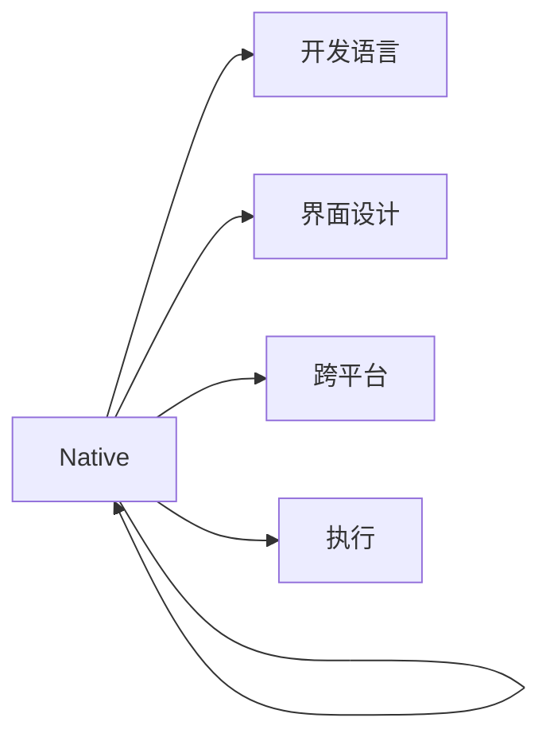

                 

# React Native：跨平台移动应用开发

> 关键词：React Native, 跨平台, JavaScript, 移动应用, 热更新, 性能优化, 社区生态

## 1. 背景介绍

随着移动互联网的蓬勃发展，企业对跨平台移动应用的需求日益增加。传统的基于原生语言（如Objective-C、Java）的开发方式，存在着开发周期长、维护成本高、代码重复多等问题。为了解决这些问题，跨平台移动应用开发应运而生，其中以React Native为代表的技术，以其高效、灵活、可维护性高而广受开发者欢迎。

React Native由Facebook于2013年开发，采用JavaScript和React作为开发语言，可以同时支持iOS和Android平台。自发布以来，React Native社区生态不断壮大，吸引了大量开发者和企业使用，广泛应用于社交网络、电商、教育、医疗等多个领域。

## 2. 核心概念与联系

### 2.1 核心概念概述

React Native的核心概念主要包括以下几点：

- **React**：一种用于构建用户界面的JavaScript库，React Native是基于React构建的跨平台移动应用开发框架。
- **JavaScript**：作为React Native的开发语言，JavaScript的跨平台性和可维护性使其成为跨平台移动应用开发的理想选择。
- **组件化**：React Native将界面拆分成多个组件，通过组合不同的组件实现复杂界面。
- **桥接机制**：React Native使用桥接机制，将JavaScript代码编译成原生代码，从而实现跨平台运行。

### 2.2 核心概念原理和架构的 Mermaid 流程图



通过以上流程图，可以清晰地理解React Native的工作原理和架构：首先，React Native使用JavaScript和React进行界面设计，然后通过桥接机制将JavaScript代码编译成原生代码，从而实现跨平台运行。

## 3. 核心算法原理 & 具体操作步骤

### 3.1 算法原理概述

React Native的开发过程主要包括以下步骤：

1. **组件设计**：将界面设计成多个独立的组件，每个组件负责实现特定的功能。
2. **桥接编译**：使用桥接机制将JavaScript代码编译成原生代码，并调用原生组件。
3. **渲染引擎**：使用React Native的渲染引擎，将组件的渲染结果呈现到原生界面。
4. **热更新**：通过热更新技术，实现代码的快速更新和发布，提高开发效率。

### 3.2 算法步骤详解

#### 3.2.1 组件设计

组件是React Native开发的核心，通过组件化设计，可以实现复杂界面的快速搭建。例如，一个简单的界面可以由多个组件构成，如文本组件、按钮组件、图片组件等。

```javascript
import React from 'react';
import { Text, View } from 'react-native';

function App() {
  return (
    <View style={{ flex: 1, justifyContent: 'center', alignItems: 'center' }}>
      <Text>Hello, React Native!</Text>
    </View>
  );
}

export default App;
```

#### 3.2.2 桥接编译

React Native使用桥接机制将JavaScript代码编译成原生代码。通过React Native提供的桥接接口，可以实现JavaScript与原生代码的交互。

例如，在Android平台上，可以使用以下代码调用原生相机：

```javascript
import React from 'react';
import { Button, Platform } from 'react-native';

function App() {
  const takePhoto = () => {
    Platform.OS === 'android' ? PermissionsAndroid.requestCamera() : Permissions.IOS.requestCamera();
  };

  return (
    <Button title="拍照" onPress={takePhoto} />
  );
}

export default App;
```

#### 3.2.3 渲染引擎

React Native使用React作为渲染引擎，将组件的渲染结果呈现到原生界面。通过React的虚拟DOM技术，React Native可以高效地更新和渲染界面。

```javascript
import React from 'react';
import { Text, View } from 'react-native';

function App() {
  return (
    <View style={{ flex: 1, justifyContent: 'center', alignItems: 'center' }}>
      <Text>Hello, React Native!</Text>
    </View>
  );
}

export default App;
```

#### 3.2.4 热更新

热更新是React Native的一个重要特性，通过热更新技术，可以在不重启应用的情况下更新代码。这极大地提高了开发效率，缩短了应用的发布周期。

React Native的热更新技术主要通过以下步骤实现：

1. 修改代码并保存。
2. 发送更新请求到服务器。
3. 服务器将更新代码发送给客户端。
4. 客户端将更新代码下载并应用。

### 3.3 算法优缺点

React Native的优势主要体现在以下几个方面：

1. **跨平台性**：React Native可以同时支持iOS和Android平台，大大缩短了跨平台应用的开发周期。
2. **性能优化**：React Native提供了一些性能优化技巧，如组件复用、懒加载、代码分割等。
3. **热更新**：React Native的热更新技术使得开发和发布应用更加便捷高效。
4. **组件化设计**：React Native的组件化设计使得界面设计更加模块化、易于维护。

React Native也存在一些缺点：

1. **原生依赖**：React Native的性能依赖原生代码，因此原生代码的性能优化对整个应用的性能影响较大。
2. **学习成本**：对于原生开发者来说，学习React和JavaScript有一定的难度。
3. **生态系统**：虽然React Native的生态系统不断壮大，但一些第三方库和组件的质量和稳定性还需要进一步提升。

### 3.4 算法应用领域

React Native的应用领域非常广泛，以下列举几个典型场景：

- **社交网络应用**：如Facebook、Twitter等，使用React Native开发移动应用，可以实现快速迭代和高效维护。
- **电商平台**：如Shopify、Magento等，通过React Native实现跨平台购物体验，提升用户体验。
- **教育应用**：如Khan Academy、Duolingo等，使用React Native开发移动应用，提高教育的可访问性和可维护性。
- **医疗应用**：如Pocket Cast、Ireliant等，通过React Native开发移动应用，实现医疗信息的快速获取和传播。

## 4. 数学模型和公式 & 详细讲解 & 举例说明

### 4.1 数学模型构建

React Native的开发过程主要涉及以下几个数学模型：

1. **虚拟DOM模型**：React Native使用虚拟DOM模型，将组件的渲染结果呈现到原生界面。
2. **桥接编译模型**：React Native使用桥接编译模型，将JavaScript代码编译成原生代码。
3. **热更新模型**：React Native使用热更新模型，实现代码的快速更新和发布。

### 4.2 公式推导过程

#### 4.2.1 虚拟DOM模型

虚拟DOM模型是React的核心技术，通过虚拟DOM模型，React可以在内存中构建组件树，并对其进行高效的更新和渲染。

虚拟DOM模型的公式推导如下：

1. 初始状态：组件树为空，表示渲染结果为空。
2. 更新操作：对组件树进行更新操作，修改组件的状态或属性。
3. 计算差异：计算更新操作对组件树的影响，生成差异结果。
4. 更新原生代码：将差异结果应用到原生代码中，完成更新操作。

#### 4.2.2 桥接编译模型

桥接编译模型是React Native的跨平台技术，通过桥接编译模型，React Native可以将JavaScript代码编译成原生代码，并调用原生组件。

桥接编译模型的公式推导如下：

1. 编译源代码：将JavaScript代码编译成中间代码。
2. 翻译中间代码：将中间代码翻译成原生代码。
3. 执行原生代码：在原生平台上执行编译后的原生代码。

#### 4.2.3 热更新模型

热更新模型是React Native的重要特性，通过热更新模型，可以在不重启应用的情况下更新代码。

热更新模型的公式推导如下：

1. 下载更新代码：从服务器下载更新代码。
2. 加载更新代码：将更新代码加载到内存中。
3. 应用更新代码：将更新代码应用到原生代码中。

### 4.3 案例分析与讲解

以下是一个使用React Native开发的简单应用案例：

```javascript
import React from 'react';
import { View, Text } from 'react-native';

function App() {
  return (
    <View style={{ flex: 1, justifyContent: 'center', alignItems: 'center' }}>
      <Text>Hello, React Native!</Text>
    </View>
  );
}

export default App;
```

在这个案例中，我们使用了React Native提供的View和Text组件，实现了简单的界面设计。

## 5. 项目实践：代码实例和详细解释说明

### 5.1 开发环境搭建

#### 5.1.1 安装React Native

1. 安装Node.js和npm：React Native的开发环境依赖Node.js和npm，可以从官网下载并安装。
2. 安装React Native CLI：

   ```
   npm install -g react-native-cli
   ```

   React Native CLI是一个命令行工具，用于管理React Native项目。

3. 安装Android Studio和Xcode：Android Studio是Android开发的IDE，Xcode是iOS开发的IDE。

#### 5.1.2 创建React Native项目

使用React Native CLI创建新项目：

```
react-native init MyProject
```

其中，MyProject是你的项目名称。

### 5.2 源代码详细实现

#### 5.2.1 界面设计

在项目中，我们可以使用React Native提供的组件进行界面设计，例如：

```javascript
import React from 'react';
import { View, Text, StyleSheet } from 'react-native';

const styles = StyleSheet.create({
  container: {
    flex: 1,
    justifyContent: 'center',
    alignItems: 'center',
    backgroundColor: '#F5FCFF',
  },
  welcome: {
    fontSize: 20,
    textAlign: 'center',
    margin: 10,
  },
});

export default function App() {
  return (
    <View style={styles.container}>
      <Text style={styles.welcome}>Hello, React Native!</Text>
    </View>
  );
}
```

#### 5.2.2 桥接编译

React Native使用桥接编译模型，将JavaScript代码编译成原生代码。例如，在Android平台上，可以使用以下代码调用原生相机：

```javascript
import React from 'react';
import { Button, Platform } from 'react-native';

function App() {
  const takePhoto = () => {
    Platform.OS === 'android' ? PermissionsAndroid.requestCamera() : Permissions.IOS.requestCamera();
  };

  return (
    <Button title="拍照" onPress={takePhoto} />
  );
}

export default App;
```

### 5.3 代码解读与分析

#### 5.3.1 组件设计

组件是React Native开发的核心，通过组件化设计，可以实现复杂界面的快速搭建。例如，一个简单的界面可以由多个组件构成，如文本组件、按钮组件、图片组件等。

#### 5.3.2 桥接编译

React Native使用桥接机制将JavaScript代码编译成原生代码。通过React Native提供的桥接接口，可以实现JavaScript与原生代码的交互。

### 5.4 运行结果展示

通过React Native开发的移动应用可以在iOS和Android平台上运行，并且具有跨平台的特性。

## 6. 实际应用场景

### 6.1 社交网络应用

社交网络应用如Facebook、Twitter等，使用React Native开发移动应用，可以实现快速迭代和高效维护。

### 6.2 电商平台

电商平台如Shopify、Magento等，通过React Native实现跨平台购物体验，提升用户体验。

### 6.3 教育应用

教育应用如Khan Academy、Duolingo等，使用React Native开发移动应用，提高教育的可访问性和可维护性。

### 6.4 医疗应用

医疗应用如Pocket Cast、Ireliant等，通过React Native开发移动应用，实现医疗信息的快速获取和传播。

## 7. 工具和资源推荐

### 7.1 学习资源推荐

为了帮助开发者系统掌握React Native的理论基础和实践技巧，这里推荐一些优质的学习资源：

1. React Native官方文档：React Native的官方文档是学习React Native的重要资源，详细介绍了React Native的各个组件和API。
2. React Native中文网：React Native中文网提供了大量的中文学习资源，包括教程、文章、视频等。
3. Udemy React Native课程：Udemy提供的React Native课程，系统讲解了React Native的各个方面，适合初学者学习。

### 7.2 开发工具推荐

#### 7.2.1 React Native CLI

React Native CLI是React Native的命令行工具，用于管理React Native项目。

#### 7.2.2 Expo

Expo是React Native的框架，提供了自动化配置、代码共享等特性，方便开发者进行跨平台开发。

#### 7.2.3 React Native Elements

React Native Elements是一个UI库，提供了丰富的UI组件，方便开发者进行界面设计。

### 7.3 相关论文推荐

1. React Native官方文档：React Native的官方文档详细介绍了React Native的各个组件和API，是学习React Native的重要资源。
2. React Native实战教程：RealWorldJS提供的React Native实战教程，提供了大量的实战案例和代码示例，适合开发者进行实践学习。
3. React Native生态报告：React Native官方发布的生态报告，介绍了React Native的最新动态和未来方向。

## 8. 总结：未来发展趋势与挑战

### 8.1 总结

本文对React Native跨平台移动应用开发进行了全面系统的介绍。首先阐述了React Native的技术背景和应用价值，明确了React Native在跨平台应用开发中的重要地位。其次，从原理到实践，详细讲解了React Native的开发过程和关键技术，提供了丰富的代码示例。最后，讨论了React Native的应用场景和未来发展方向。

通过本文的系统梳理，可以看到，React Native作为跨平台移动应用开发的理想工具，已经在多个领域得到了广泛应用。未来，随着React Native生态的不断壮大和社区的不断活跃，React Native必将在更多领域发挥其重要作用，推动跨平台移动应用开发技术的进步。

### 8.2 未来发展趋势

React Native的未来发展趋势主要包括以下几个方面：

1. **性能优化**：React Native的性能优化是未来的重要方向，通过优化组件复用、懒加载、代码分割等技术，提升应用的性能和用户体验。
2. **组件化设计**：React Native的组件化设计是未来的一个重要方向，通过不断扩展和丰富组件库，提升开发效率和可维护性。
3. **热更新优化**：React Native的热更新技术是未来的一个重要方向，通过优化热更新模型，实现更快速、更稳定的热更新。
4. **跨平台性提升**：React Native的跨平台性是未来的重要方向，通过提升跨平台能力，实现更广泛的适用性和兼容性。
5. **生态系统完善**：React Native的生态系统是未来的重要方向，通过丰富第三方库和组件，提升开发效率和应用质量。

### 8.3 面临的挑战

尽管React Native已经取得了瞩目成就，但在迈向更加智能化、普适化应用的过程中，它仍面临诸多挑战：

1. **原生依赖**：React Native的性能依赖原生代码，因此原生代码的性能优化对整个应用的性能影响较大。
2. **学习成本**：对于原生开发者来说，学习React和JavaScript有一定的难度。
3. **生态系统**：虽然React Native的生态系统不断壮大，但一些第三方库和组件的质量和稳定性还需要进一步提升。
4. **热更新稳定性**：热更新技术虽然提高了开发效率，但有时也会出现不稳定的问题。
5. **跨平台一致性**：跨平台一致性是React Native的重要挑战，不同平台间的差异可能导致用户体验不一致。

### 8.4 研究展望

未来的研究需要在以下几个方面寻求新的突破：

1. **性能优化**：开发更高效的组件和算法，提升应用的性能和用户体验。
2. **组件化设计**：不断扩展和丰富组件库，提升开发效率和可维护性。
3. **热更新优化**：优化热更新模型，实现更快速、更稳定的热更新。
4. **跨平台性提升**：提升跨平台能力，实现更广泛的适用性和兼容性。
5. **生态系统完善**：丰富第三方库和组件，提升开发效率和应用质量。

通过以上研究方向的探索，必将引领React Native技术迈向更高的台阶，为构建人机协同的智能系统铺平道路。面向未来，React Native还需要与其他人工智能技术进行更深入的融合，如知识表示、因果推理、强化学习等，多路径协同发力，共同推动跨平台移动应用开发技术的进步。只有勇于创新、敢于突破，才能不断拓展React Native的边界，让跨平台移动应用开发技术更好地服务于社会。

## 9. 附录：常见问题与解答

**Q1：React Native的优势和劣势有哪些？**

A: React Native的优势主要体现在以下几个方面：

1. **跨平台性**：React Native可以同时支持iOS和Android平台，大大缩短了跨平台应用的开发周期。
2. **性能优化**：React Native提供了一些性能优化技巧，如组件复用、懒加载、代码分割等。
3. **热更新**：React Native的热更新技术使得开发和发布应用更加便捷高效。
4. **组件化设计**：React Native的组件化设计使得界面设计更加模块化、易于维护。

React Native也存在一些缺点：

1. **原生依赖**：React Native的性能依赖原生代码，因此原生代码的性能优化对整个应用的性能影响较大。
2. **学习成本**：对于原生开发者来说，学习React和JavaScript有一定的难度。
3. **生态系统**：虽然React Native的生态系统不断壮大，但一些第三方库和组件的质量和稳定性还需要进一步提升。

**Q2：React Native的热更新技术有哪些优势？**

A: React Native的热更新技术具有以下优势：

1. **开发效率高**：热更新技术可以在不重启应用的情况下更新代码，极大地提高了开发效率。
2. **用户体验好**：热更新技术可以在用户使用过程中进行代码更新，不影响用户体验。
3. **发布周期短**：热更新技术可以缩短应用的发布周期，提升应用的市场竞争力。

**Q3：React Native的性能优化有哪些方法？**

A: React Native的性能优化方法主要包括以下几个方面：

1. **组件复用**：通过复用组件，减少代码量，提升性能。
2. **懒加载**：只有在需要时才加载组件，减少内存占用。
3. **代码分割**：将代码分割成多个小包，减少初始加载时间。
4. **原生代码优化**：优化原生代码的性能，提升应用的整体性能。

**Q4：React Native的学习资源有哪些？**

A: React Native的学习资源主要包括以下几个方面：

1. React Native官方文档：React Native的官方文档是学习React Native的重要资源，详细介绍了React Native的各个组件和API。
2. React Native中文网：React Native中文网提供了大量的中文学习资源，包括教程、文章、视频等。
3. Udemy React Native课程：Udemy提供的React Native课程，系统讲解了React Native的各个方面，适合初学者学习。

---

作者：禅与计算机程序设计艺术 / Zen and the Art of Computer Programming

