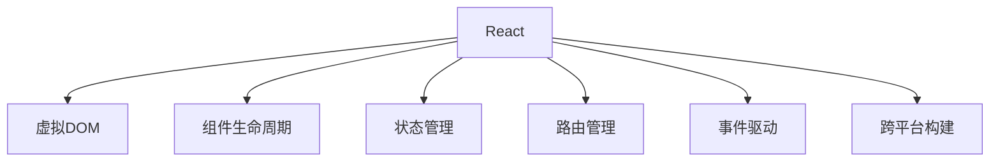

                 

# React 和前端框架：构建动态用户界面

> 关键词：React,前端框架,动态用户界面,UI组件,虚拟DOM,组件生命周期,状态管理,路由管理,事件驱动,跨平台开发,跨端构建

## 1. 背景介绍

### 1.1 问题由来
随着Web应用的不断发展，前端开发逐渐从传统的静态页面建设向动态、交互式、个性化的方向转变。其中，构建动态用户界面成为了前端开发的核心任务之一。传统的HTML+CSS+JavaScript方式已经无法满足日益复杂的业务需求，开发效率和代码复用性均受到限制。

为了解决上述问题，前端框架应运而生，其中最为人熟知的是React，它通过组件化的思路和虚拟DOM技术，大幅提升了前端开发的效率和性能，同时也为其他框架提供了可借鉴的模式。

### 1.2 问题核心关键点
React及其相关框架的出现，彻底改变了前端开发的模式，从静态页面到动态用户界面，从单一功能到复杂交互，从浏览器到移动端，前端框架均提供了高效、可靠、灵活的解决方案。关键点包括：

- **组件化开发**：通过组件化的思路，实现代码的复用和封装，提升开发效率。
- **虚拟DOM**：利用虚拟DOM技术，优化DOM操作，提升性能。
- **状态管理**：提供统一的状态管理方案，确保组件状态的一致性。
- **路由管理**：支持复杂的页面导航和数据管理，提升用户体验。
- **事件驱动**：通过事件机制，实现组件之间的交互和数据传递。
- **跨平台构建**：支持跨浏览器、跨设备、跨端开发，实现一致的用户体验。

本文将系统介绍React及其相关框架构建动态用户界面的核心概念、原理、以及实战应用，帮助读者全面掌握前端开发的最新技术和方法。

## 2. 核心概念与联系

### 2.1 核心概念概述

为更好地理解React及其相关框架构建动态用户界面的方法，本节将介绍几个关键概念：

- **React**：由Facebook开发的开源前端库，通过组件化和虚拟DOM技术，实现高效的UI构建。React提供了虚拟DOM、组件生命周期、状态管理等核心特性，支持跨端开发，是构建复杂交互式Web应用的首选。
- **虚拟DOM**：虚拟DOM是React的核心概念，它是一个轻量级的DOM表示，用于描述实际DOM的结构和属性。通过虚拟DOM，React能够在组件状态变化时，只更新实际DOM中发生变化的部分，从而提升了性能。
- **组件生命周期**：React组件拥有生命周期方法，用于在组件创建、更新和销毁等不同阶段执行特定操作。通过生命周期方法，可以控制组件的状态、实现数据缓存等功能。
- **状态管理**：前端状态管理是确保组件状态一致性的关键。React提供多种状态管理方案，如Recoil、MobX、Redux等，可根据项目需求选择合适的方式。
- **路由管理**：路由管理负责在应用中导航和维护页面之间的链接关系。React Router是React社区中常用的路由管理工具，支持复杂的页面导航和数据管理。
- **事件驱动**：事件驱动是React中重要的通信机制，通过事件，组件之间可以实现数据的传递和交互。React提供了多种事件类型和事件处理方法，支持复杂交互逻辑的实现。
- **跨平台构建**：跨平台构建技术如React Native、Flutter等，使得前端开发能够无缝扩展到移动端，提升开发效率和用户体验。

这些核心概念之间的逻辑关系可以通过以下Mermaid流程图来展示：



这个流程图展示了他React及其相关框架的核心概念及其之间的关系：

1. React通过虚拟DOM实现UI的构建。
2. 组件生命周期方法用于控制组件的创建、更新和销毁。
3. 状态管理确保组件状态的一致性。
4. 路由管理维护页面之间的链接关系。
5. 事件驱动实现组件之间的数据传递和交互。
6. 跨平台构建技术支持前端开发在移动端的应用。

这些概念共同构成了React及其相关框架构建动态用户界面的基础，使得开发者能够高效地实现复杂交互和跨端开发。

## 3. 核心算法原理 & 具体操作步骤
### 3.1 算法原理概述

React及其相关框架构建动态用户界面的核心算法原理包括以下几个方面：

- **虚拟DOM技术**：虚拟DOM是React的核心技术之一，通过维护一个虚拟DOM树，React能够在组件状态变化时，只更新实际DOM中发生变化的部分，从而提升性能。
- **组件生命周期**：React组件生命周期方法用于控制组件的不同阶段，如挂载、更新、卸载等，确保组件状态和数据的一致性。
- **状态管理**：通过状态管理方案，React能够统一管理组件的状态，确保数据的一致性和可靠性。
- **路由管理**：React Router负责在应用中维护页面之间的链接关系，通过URL路由实现页面导航和数据管理。
- **事件驱动**：React通过事件机制，实现组件之间的数据传递和交互，支持复杂交互逻辑的实现。

### 3.2 算法步骤详解

基于React及其相关框架构建动态用户界面的一般步骤包括：

**Step 1: 初始化开发环境**

- 安装Node.js和npm，创建React项目。
- 安装相关的开发工具，如React Router、Redux等。
- 搭建开发环境，如本地开发服务器、Webpack等。

**Step 2: 设计UI组件**

- 根据页面需求，设计UI组件的布局和样式。
- 编写组件的代码，定义组件的属性和方法。
- 使用React提供的组件生命周期方法，控制组件的不同阶段。

**Step 3: 实现数据管理**

- 根据项目需求，选择合适的状态管理方案。
- 定义全局状态，使用状态管理工具更新状态。
- 在组件中订阅状态变化，更新UI组件。

**Step 4: 实现路由管理**

- 配置React Router，定义URL路由和组件映射关系。
- 在组件中使用路由工具进行页面导航和数据管理。

**Step 5: 实现事件驱动**

- 定义事件处理函数，响应用户的操作。
- 在组件中订阅事件，触发相应的事件处理函数。

**Step 6: 测试和优化**

- 编写测试用例，确保代码的正确性和性能。
- 对代码进行优化，提升性能和可维护性。
- 在实际环境中进行测试，确保应用的稳定性和可靠性。

### 3.3 算法优缺点

React及其相关框架构建动态用户界面的方法具有以下优点：

1. **高效性能**：通过虚拟DOM和只更新变化部分的技术，React能够显著提升UI构建的性能。
2. **代码复用性**：组件化的开发模式，使得代码可以复用，提升开发效率和维护性。
3. **跨端支持**：React Native、Flutter等跨平台构建技术，使得前端开发能够无缝扩展到移动端。
4. **灵活性**：支持复杂交互逻辑和跨平台开发，满足多样化的应用需求。
5. **生态系统丰富**：React社区拥有丰富的生态系统，提供了多种状态管理、路由管理、事件处理等工具。

同时，该方法也存在以下缺点：

1. **学习成本高**：由于React提供了许多高级特性，初学者需要投入更多时间进行学习和实践。
2. **性能优化复杂**：虚拟DOM虽然提升了性能，但需要开发者深入理解其原理和优化方法。
3. **调试困难**：组件化开发和复杂的组件生命周期，使得调试过程更加复杂。
4. **状态管理复杂**：状态管理方案的选择和实现较为复杂，需要根据项目需求进行综合考虑。
5. **兼容性问题**：跨平台构建技术虽然带来了便利，但也带来了兼容性问题，需要进行跨端适配。

尽管存在这些局限性，但就目前而言，React及其相关框架构建动态用户界面的方法仍然是最主流和广泛采用的技术。未来相关研究的重点在于如何进一步优化性能、提升用户体验、降低学习成本等。

### 3.4 算法应用领域

React及其相关框架构建动态用户界面的方法已经在Web应用、移动应用、跨平台应用等众多领域得到了广泛应用，例如：

- **Web应用开发**：如电商平台、社交网络、企业管理系统等。通过React，开发者能够快速构建复杂交互式的Web应用。
- **移动应用开发**：如原生应用、混合应用等。通过React Native等跨平台构建技术，前端开发者能够轻松扩展到移动端。
- **跨平台应用开发**：如跨浏览器应用、跨设备应用等。通过React及其相关框架，开发者能够实现跨平台开发，提升开发效率和用户体验。
- **前端框架适配**：如Vue、Angular等。通过React及其相关框架的API兼容性，开发者能够快速将已有前端框架适配到React环境。

除了上述这些经典应用外，React及其相关框架还被创新性地应用到更多场景中，如游戏开发、实时数据处理、物联网应用等，为前端技术带来了全新的突破。随着React及其相关框架的不断演进，相信前端技术将在更广阔的领域大放异彩。

## 4. 数学模型和公式 & 详细讲解  
### 4.1 数学模型构建

本节将使用数学语言对React及其相关框架构建动态用户界面的过程进行更加严格的刻画。

假设React应用中的组件为 $C$，状态为 $S$，虚拟DOM树为 $T$。则组件 $C$ 的更新过程可以表示为：

$$
C(S) = \begin{cases}
C_{new}(S) & \text{如果 } S_{new} \neq S \\
C(S) & \text{如果 } S_{new} = S
\end{cases}
$$

其中 $S_{new}$ 为新的状态，$C_{new}$ 为新的组件。如果状态没有变化，则不需要重新渲染组件，否则重新渲染新的组件。

通过上述数学模型，可以看出，React的核心算法原理是通过维护虚拟DOM树，控制组件的渲染和更新，从而实现高效的UI构建。

### 4.2 公式推导过程

以下我们以React Router为例，推导路由管理的数学模型。

假设应用中定义了两个路由：

```javascript
<Route path="/" exact component={Home} />
<Route path="/about" component={About} />
```

当用户访问根路径时，进入Home组件；访问/about路径时，进入About组件。通过React Router，可以自动管理页面之间的链接关系，确保路由的正确性和数据的一致性。

在路由管理中，React Router使用了一个路由表，记录了所有路由的定义和关系。通过路由表，React Router能够根据URL路径自动匹配路由，渲染对应的组件。路由管理的具体过程可以表示为：

$$
routePath = \begin{cases}
"/" & \text{如果用户访问根路径} \\
"/about" & \text{如果用户访问/about路径}
\end{cases}
$$

通过路由表，React Router能够自动匹配路由路径，调用对应的组件，从而实现路由管理。

## 5. 项目实践：代码实例和详细解释说明
### 5.1 开发环境搭建

在进行React及其相关框架构建动态用户界面的项目实践前，我们需要准备好开发环境。以下是使用React及其相关框架搭建开发环境的步骤：

1. 安装Node.js和npm：
```bash
npm install -g npx
```

2. 初始化React项目：
```bash
npx create-react-app my-app
cd my-app
```

3. 安装相关的开发工具：
```bash
npm install react-router-dom redux react-redux
```

4. 搭建开发环境：
```bash
npm start
```

完成上述步骤后，即可在本地开发环境中进行React及其相关框架的实践。

### 5.2 源代码详细实现

下面以React Router和Redux为例，给出React及其相关框架构建动态用户界面的PyTorch代码实现。

首先，定义React Router路由：

```javascript
import React from 'react';
import { BrowserRouter as Router, Route, Switch } from 'react-router-dom';
import Home from './components/Home';
import About from './components/About';

function App() {
  return (
    <Router>
      <Switch>
        <Route exact path="/" component={Home} />
        <Route path="/about" component={About} />
      </Switch>
    </Router>
  );
}

export default App;
```

然后，定义Redux的状态管理：

```javascript
import { createStore } from 'redux';
import rootReducer from './reducers';

const store = createStore(rootReducer);

function App() {
  return (
    <div>
      <Route exact path="/" component={Home} />
      <Route path="/about" component={About} />
    </div>
  );
}

export default App;
```

接着，定义Redux的reducers和actions：

```javascript
import { combineReducers } from 'redux';
import { createAction } from 'redux-actions';

const initialState = {
  count: 0
};

const countReducer = (state = initialState, action) => {
  switch (action.type) {
    case 'INCREMENT':
      return { ...state, count: state.count + 1 };
    case 'DECREMENT':
      return { ...state, count: state.count - 1 };
    default:
      return state;
  }
};

const rootReducer = combineReducers({
  count: countReducer
});

const increment = createAction('INCREMENT');
const decrement = createAction('DECREMENT');
```

最后，使用Redux的状态管理：

```javascript
import { Provider } from 'react-redux';
import countReducer from './reducers/countReducer';

function App() {
  return (
    <Provider store={store}>
      <Route exact path="/" component={Home} />
      <Route path="/about" component={About} />
    </Provider>
  );
}

export default App;
```

以上就是使用React及其相关框架构建动态用户界面的完整代码实现。可以看到，React Router和Redux等工具的使用，使得前端开发变得更加高效和灵活。

### 5.3 代码解读与分析

让我们再详细解读一下关键代码的实现细节：

**React Router定义路由**：
- `BrowserRouter`：定义了React Router的路由管理器。
- `Route`：用于定义具体的路由路径和组件。
- `Switch`：用于组合多个`Route`，确保只有一个路由被匹配。

**Redux状态管理**：
- `createStore`：创建Redux的状态管理 store。
- `combineReducers`：将多个reducers组合成一个root reducer。
- `createAction`：创建Redux action。

**reducers和actions**：
- `combineReducers`：将多个reducers组合成一个root reducer。
- `createAction`：创建Redux action。

**Provider使用**：
- `Provider`：将Redux store传递给组件树，使得子组件可以访问状态。

React及其相关框架构建动态用户界面的过程中，通过React Router和Redux等工具的组合使用，能够实现复杂的页面导航和数据管理，确保应用的稳定性和可靠性。

## 6. 实际应用场景
### 6.1 智能客服系统

基于React及其相关框架构建的智能客服系统，可以显著提升客服服务的效率和体验。通过React，开发者可以轻松构建复杂的交互式界面，实现自然语言处理、语音识别、对话管理等功能。同时，React Router能够确保页面导航的正确性和数据的一致性，Redux则能够管理全局状态，确保系统的高可靠性和可维护性。

### 6.2 金融舆情监测

React及其相关框架在金融舆情监测中的应用，可以提升金融机构的舆情监测能力和风险预警水平。通过React，开发者可以构建复杂的分析界面，展示舆情数据的实时变化。同时，React Router和Redux能够确保数据的一致性和可靠性，提升监测系统的稳定性和性能。

### 6.3 个性化推荐系统

React及其相关框架在个性化推荐系统中的应用，可以提升推荐算法的实时性和准确性。通过React，开发者可以构建高效的推荐页面，实时展示用户的推荐内容。同时，React Router和Redux能够确保推荐系统的高可靠性和可维护性，提升用户体验和满意度。

### 6.4 未来应用展望

随着React及其相关框架的不断演进，其应用场景也将不断扩展，为各行各业带来新的变革。

在智慧医疗领域，React及其相关框架可以构建高效的医疗数据分析和智能诊断系统，提升医疗服务的智能化水平。

在智能教育领域，React及其相关框架可以构建个性化的学习管理系统，提升教育资源的利用效率和学习效果。

在智慧城市治理中，React及其相关框架可以构建智能的城市管理平台，提升城市的智能化和自动化水平。

此外，在企业生产、社会治理、文娱传媒等众多领域，React及其相关框架的应用也将不断涌现，为经济社会发展注入新的动力。相信随着技术的日益成熟，React及其相关框架必将在构建人机协同的智能时代中扮演越来越重要的角色。

## 7. 工具和资源推荐
### 7.1 学习资源推荐

为了帮助开发者系统掌握React及其相关框架构建动态用户界面的技术，这里推荐一些优质的学习资源：

1. React官方文档：React官方文档提供了全面的API文档和最佳实践，是学习React及其相关框架的必备资料。
2. React Router官方文档：React Router官方文档提供了详细的路由管理教程和示例，是学习路由管理的必备资料。
3. Redux官方文档：Redux官方文档提供了全面的状态管理教程和示例，是学习状态管理的必备资料。
4. React教程（freeCodeCamp）：freeCodeCamp提供的React教程，内容详细、实用，适合初学者入门。
5. React生态系统：React生态系统拥有丰富的学习资源和开发工具，适合进阶学习和实际开发。

通过对这些资源的学习实践，相信你一定能够快速掌握React及其相关框架的精髓，并用于解决实际的开发问题。

### 7.2 开发工具推荐

高效的开发离不开优秀的工具支持。以下是几款用于React及其相关框架构建动态用户界面开发的常用工具：

1. Visual Studio Code：一款轻量级的代码编辑器，支持多种语言和插件，适合开发React应用。
2. Webpack：一个打包工具，支持模块化开发和资源优化，适合开发React应用。
3. Babel：一个代码转换工具，支持ES6+语法和模块化开发，适合开发React应用。
4. ESLint：一个代码检查工具，支持语法检查和代码规范，适合开发React应用。
5. Prettier：一个代码格式化工具，支持自动代码格式化，适合开发React应用。

合理利用这些工具，可以显著提升React及其相关框架构建动态用户界面任务的开发效率，加快创新迭代的步伐。

### 7.3 相关论文推荐

React及其相关框架的发展源于学界的持续研究。以下是几篇奠基性的相关论文，推荐阅读：

1. React: A JavaScript Library for Building User Interfaces：React的官方论文，详细介绍React的设计思想和核心特性。
2. The Case for Redux：Redux的创始作者提出状态管理方案的原理和优势，适合理解Redux的核心思想。
3. React Router API Reference：React Router的官方API文档，详细介绍路由管理的API和用法。

这些论文代表了大前端技术的发展脉络。通过学习这些前沿成果，可以帮助研究者把握学科前进方向，激发更多的创新灵感。

## 8. 总结：未来发展趋势与挑战

### 8.1 总结

本文对基于React及其相关框架构建动态用户界面的方法进行了全面系统的介绍。首先阐述了React及其相关框架的背景和意义，明确了构建动态用户界面的独特价值。其次，从原理到实践，详细讲解了React及其相关框架的数学原理和核心步骤，给出了构建动态用户界面的项目实践代码。同时，本文还广泛探讨了React及其相关框架在智能客服、金融舆情、个性化推荐等多个行业领域的应用前景，展示了其巨大的潜力。

通过本文的系统梳理，可以看到，基于React及其相关框架构建动态用户界面的方法已经成为前端开发的重要范式，极大地提升了Web应用和跨端应用的开发效率和性能。未来，伴随React及其相关框架的不断演进，相信前端技术将在更广阔的应用领域大放异彩，深刻影响人类的生产生活方式。

### 8.2 未来发展趋势

展望未来，React及其相关框架构建动态用户界面技术将呈现以下几个发展趋势：

1. **组件化开发**：组件化开发将继续是前端开发的核心模式，通过组件化的思路，实现代码的复用和封装，提升开发效率和维护性。
2. **跨平台构建**：跨平台构建技术如React Native、Flutter等将继续发展，使得前端开发能够无缝扩展到移动端，提升开发效率和用户体验。
3. **声明式开发**：声明式开发将继续成为前端开发的主流，通过声明式的开发模式，提升开发效率和代码可维护性。
4. **低代码/无代码开发**：低代码/无代码开发工具将进一步发展，使得非技术背景的人员也能够轻松构建动态用户界面，提升开发效率和用户体验。
5. **可视化开发**：可视化开发工具将进一步普及，通过拖拽式界面设计，提升开发效率和用户体验。
6. **实时协作**：实时协作工具将进一步发展，提升团队协作效率和开发效率。

以上趋势凸显了React及其相关框架构建动态用户界面技术的广阔前景。这些方向的探索发展，必将进一步提升前端开发的效率和性能，为人类生产生活方式带来深远影响。

### 8.3 面临的挑战

尽管React及其相关框架构建动态用户界面技术已经取得了瞩目成就，但在迈向更加智能化、普适化应用的过程中，它仍面临着诸多挑战：

1. **学习成本高**：React及其相关框架提供了许多高级特性，初学者需要投入更多时间进行学习和实践。
2. **性能优化复杂**：虚拟DOM虽然提升了性能，但需要开发者深入理解其原理和优化方法。
3. **调试困难**：组件化开发和复杂的组件生命周期，使得调试过程更加复杂。
4. **状态管理复杂**：状态管理方案的选择和实现较为复杂，需要根据项目需求进行综合考虑。
5. **跨平台兼容性**：跨平台构建技术虽然带来了便利，但也带来了兼容性问题，需要进行跨端适配。

尽管存在这些局限性，但就目前而言，React及其相关框架构建动态用户界面的方法仍然是最主流和广泛采用的技术。未来相关研究的重点在于如何进一步优化性能、提升用户体验、降低学习成本等。

### 8.4 研究展望

面对React及其相关框架构建动态用户界面所面临的种种挑战，未来的研究需要在以下几个方面寻求新的突破：

1. **组件化优化**：进一步提升组件化的开发效率和性能，优化组件的复用和封装。
2. **跨平台优化**：提升跨平台构建技术的性能和兼容性，优化跨端适配。
3. **声明式优化**：优化声明式开发模式，提升开发效率和代码可维护性。
4. **低代码/无代码优化**：提升低代码/无代码开发工具的性能和易用性，支持更广泛的开发场景。
5. **可视化优化**：提升可视化开发工具的性能和功能，支持更复杂的UI设计。
6. **实时协作优化**：提升实时协作工具的性能和功能，支持更高效的团队协作。

这些研究方向的探索，必将引领React及其相关框架构建动态用户界面技术迈向更高的台阶，为前端开发带来更多创新和突破。面向未来，React及其相关框架必将在构建人机协同的智能时代中扮演越来越重要的角色。总之，React及其相关框架需要在性能、易用性、可维护性等方面不断优化，才能真正实现其潜力，为人类生产生活方式带来深远影响。

## 9. 附录：常见问题与解答

**Q1：React及其相关框架构建动态用户界面是否适用于所有前端项目？**

A: React及其相关框架构建动态用户界面的方法适用于大多数前端项目，特别是复杂交互和跨端构建的应用。但对于简单的静态页面项目，使用传统的HTML+CSS+JavaScript方式更为合适。

**Q2：如何选择合适的状态管理方案？**

A: 根据项目需求选择合适的状态管理方案。Redux适用于大型项目和复杂状态管理场景，Recoil适用于轻量级项目和实时状态更新场景，MobX适用于小型项目和实时状态更新场景。

**Q3：React Router如何处理404错误？**

A: 通过配置`<Route>`, `<Switch>`等组件，React Router可以自动处理404错误。如果页面路径无法匹配，则渲染404页面。

**Q4：React Router如何处理路由嵌套？**

A: 通过嵌套`<Route>`组件，React Router可以实现路由嵌套。在嵌套路由中，内层路由的路径需要添加前缀，以区分路径。

**Q5：React及其相关框架构建动态用户界面是否需要跨平台构建技术？**

A: 对于仅需要Web端的应用，React及其相关框架已经足够。如果需要跨平台构建，如移动端应用，可以借助React Native等跨平台构建技术。

综上所述，React及其相关框架构建动态用户界面技术在现代前端开发中扮演着重要角色，为开发者提供了高效、灵活、可维护的开发模式。通过对React及其相关框架的学习和实践，相信开发者能够更好地构建复杂交互的动态用户界面，提升应用性能和用户体验。

