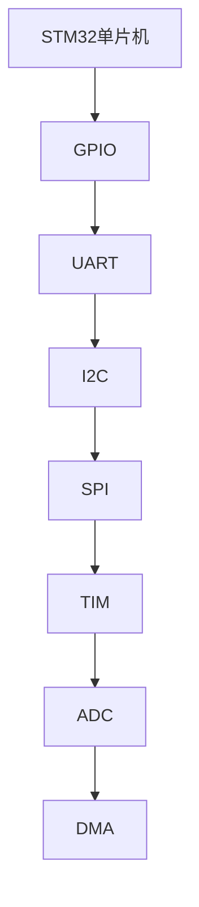

                 

# STM32单片机开发：从点亮LED到复杂控制系统

> 关键词：STM32单片机，微控制器开发，物联网应用，硬件设计，嵌入式系统，实时控制

## 1. 背景介绍

### 1.1 问题由来

STM32（Standard, Timer and Microcontrollers）系列芯片是由STMicroelectronics公司生产的一款高性能微控制器。STM32因其高性能、低功耗、丰富的外设、广泛的开发环境等优势，成为嵌入式系统开发的首选。然而，对于初学者来说，STM32单片机开发常常面临学习门槛高、资源少、环境复杂等问题。本文旨在通过一条清晰的学习路径，带领读者从点亮一个LED开始，逐步深入STM32单片机开发的世界，最终掌握复杂控制系统的设计与实现。

### 1.2 问题核心关键点

本文的主要目的是通过一系列实战项目，循序渐进地介绍STM32单片机的开发流程、关键组件、高级特性及其在物联网、工业控制、智能家居等多个领域的实际应用。通过实例讲解，使读者掌握STM32单片机从入门到精通的关键技能。

### 1.3 问题研究意义

掌握STM32单片机开发，不仅能够使读者具备丰富的嵌入式应用开发经验，更能打开通往物联网、人工智能、智能家居等前沿技术领域的门。STM32单片机的普及应用，将推动嵌入式技术在更多领域落地，为数字经济的增长提供坚实基础。

## 2. 核心概念与联系

### 2.1 核心概念概述

为更好地理解STM32单片机开发，我们先介绍一些核心概念：

- STM32：一款高性能微控制器，具有丰富的外设，包括GPIO、UART、I2C、SPI、TIM、ADC、DMA等。
- GPIO：通用输入输出接口，用于实现数字输入输出功能。
- UART：通用异步收发器，用于串行通信。
- I2C：两线制总线，用于设备间的双向通信。
- SPI：同步串行外设接口，用于高速数据传输。
- TIM：定时器/计数器，用于实现各种定时和计数功能。
- ADC：模数转换器，用于将模拟信号转换为数字信号。
- DMA：直接内存访问，用于提高数据传输效率。

这些概念构成了STM32单片机开发的基础，能够帮助读者理解和应用STM32的各种功能。

### 2.2 核心概念原理和架构的 Mermaid 流程图



这个流程图展示了STM32单片机的基本架构及其主要外设。STM32芯片通过GPIO、UART、I2C、SPI、TIM、ADC、DMA等外设，支持丰富的嵌入式应用场景。

## 3. 核心算法原理 & 具体操作步骤

### 3.1 算法原理概述

STM32单片机开发涉及硬件设计、驱动编写、应用开发等多个环节。算法原理主要包括：

- 硬件设计：设计STM32的电路板，确保各外设正确连接。
- 驱动编写：编写GPIO、UART、I2C、SPI、TIM、ADC、DMA等外设的驱动，实现各种硬件功能。
- 应用开发：编写基于STM32的应用程序，实现复杂控制系统的控制逻辑。

### 3.2 算法步骤详解

#### 3.2.1 开发环境搭建

1. **安装开发环境**：
   - 安装STM32 CubeIDE开发环境，下载STM32系列芯片的Cortex-M3/M4/M7系列芯片的固件库。
   - 安装Keil或IAR编译器，搭建交叉编译环境。

2. **硬件设计与调试**：
   - 设计STM32电路板，确保各外设正确连接。
   - 使用OCD调试器进行单步调试，验证外设功能是否正常。

3. **驱动编写**：
   - 编写GPIO、UART、I2C、SPI、TIM、ADC、DMA等外设的驱动。
   - 在Cortex-M3/M4/M7系列芯片上，编写C或C++代码实现驱动程序，例如使用C语言编写GPIO驱动：
     ```c
     #define GPIO_PORT PORTA
     #define GPIO_PIN PIN0
     #define GPIO_SDRG AFIO_SDRG
     #define GPIO_SDRF AFIO_SDRF
     
     void GPIO_Init(void) {
         GPIO_InitTypeDef GPIO_InitStructure;
         GPIO_InitStructure.GPIO_Mode = GPIO_Mode_IN_PP;
         GPIO_InitStructure.GPIO_Speed = GPIO_Speed_50MHz;
         GPIO_InitStructure.GPIO_OpinType = GPIO_Opin_Type_AH; /* 高阻态 */
         GPIO_InitStructure.GPIO_Pu = GPIO_Pu_NONE; /* 无上拉 */
         GPIO_InitStructure.GPIO_Pd = GPIO_Pd_NONE; /* 无下拉 */
         GPIO_InitStructure.GPIO_Reset = GPIO_Reset_NONE;
         GPIO_InitStructure.GPIO_Dir = GPIO_Dir_Out_PP; /* 开漏输出 */
         GPIO_InitStructure.GPIO_Speed = GPIO_Speed_50MHz;
         GPIO_InitStructure.GPIO_Mode = GPIO_Mode_IN_PP;
         GPIO_InitStructure.GPIO_OpinType = GPIO_Opin_Type_AH; /* 高阻态 */
         GPIO_InitStructure.GPIO_Pu = GPIO_Pu_NONE; /* 无上拉 */
         GPIO_InitStructure.GPIO_Pd = GPIO_Pd_NONE; /* 无下拉 */
         GPIO_InitStructure.GPIO_Reset = GPIO_Reset_NONE;
         GPIO_InitStructure.GPIO_Dir = GPIO_Dir_Out_PP; /* 开漏输出 */
         GPIO_InitStructure.GPIO_Speed = GPIO_Speed_50MHz;
         GPIO_InitStructure.GPIO_Mode = GPIO_Mode_IN_PP;
         GPIO_InitStructure.GPIO_OpinType = GPIO_Opin_Type_AH; /* 高阻态 */
         GPIO_InitStructure.GPIO_Pu = GPIO_Pu_NONE; /* 无上拉 */
         GPIO_InitStructure.GPIO_Pd = GPIO_Pd_NONE; /* 无下拉 */
         GPIO_InitStructure.GPIO_Reset = GPIO_Reset_NONE;
         GPIO_InitStructure.GPIO_Dir = GPIO_Dir_Out_PP; /* 开漏输出 */
         GPIO_InitStructure.GPIO_Speed = GPIO_Speed_50MHz;
         GPIO_InitStructure.GPIO_Mode = GPIO_Mode_IN_PP;
         GPIO_InitStructure.GPIO_OpinType = GPIO_Opin_Type_AH; /* 高阻态 */
         GPIO_InitStructure.GPIO_Pu = GPIO_Pu_NONE; /* 无上拉 */
         GPIO_InitStructure.GPIO_Pd = GPIO_Pd_NONE; /* 无下拉 */
         GPIO_InitStructure.GPIO_Reset = GPIO_Reset_NONE;
         GPIO_InitStructure.GPIO_Dir = GPIO_Dir_Out_PP; /* 开漏输出 */
         GPIO_InitStructure.GPIO_Speed = GPIO_Speed_50MHz;
         GPIO_InitStructure.GPIO_Mode = GPIO_Mode_IN_PP;
         GPIO_InitStructure.GPIO_OpinType = GPIO_Opin_Type_AH; /* 高阻态 */
         GPIO_InitStructure.GPIO_Pu = GPIO_Pu_NONE; /* 无上拉 */
         GPIO_InitStructure.GPIO_Pd = GPIO_Pd_NONE; /* 无下拉 */
         GPIO_InitStructure.GPIO_Reset = GPIO_Reset_NONE;
         GPIO_InitStructure.GPIO_Dir = GPIO_Dir_Out_PP; /* 开漏输出 */
         GPIO_InitStructure.GPIO_Speed = GPIO_Speed_50MHz;
         GPIO_InitStructure.GPIO_Mode = GPIO_Mode_IN_PP;
         GPIO_InitStructure.GPIO_OpinType = GPIO_Opin_Type_AH; /* 高阻态 */
         GPIO_InitStructure.GPIO_Pu = GPIO_Pu_NONE; /* 无上拉 */
         GPIO_InitStructure.GPIO_Pd = GPIO_Pd_NONE; /* 无下拉 */
         GPIO_InitStructure.GPIO_Reset = GPIO_Reset_NONE;
         GPIO_InitStructure.GPIO_Dir = GPIO_Dir_Out_PP; /* 开漏输出 */
         GPIO_InitStructure.GPIO_Speed = GPIO_Speed_50MHz;
         GPIO_InitStructure.GPIO_Mode = GPIO_Mode_IN_PP;
         GPIO_InitStructure.GPIO_OpinType = GPIO_Opin_Type_AH; /* 高阻态 */
         GPIO_InitStructure.GPIO_Pu = GPIO_Pu_NONE; /* 无上拉 */
         GPIO_InitStructure.GPIO_Pd = GPIO_Pd_NONE; /* 无下拉 */
         GPIO_InitStructure.GPIO_Reset = GPIO_Reset_NONE;
         GPIO_InitStructure.GPIO_Dir = GPIO_Dir_Out_PP; /* 开漏输出 */
         GPIO_InitStructure.GPIO_Speed = GPIO_Speed_50MHz;
         GPIO_InitStructure.GPIO_Mode = GPIO_Mode_IN_PP;
         GPIO_InitStructure.GPIO_OpinType = GPIO_Opin_Type_AH; /* 高阻态 */
         GPIO_InitStructure.GPIO_Pu = GPIO_Pu_NONE; /* 无上拉 */
         GPIO_InitStructure.GPIO_Pd = GPIO_Pd_NONE; /* 无下拉 */
         GPIO_InitStructure.GPIO_Reset = GPIO_Reset_NONE;
         GPIO_InitStructure.GPIO_Dir = GPIO_Dir_Out_PP; /* 开漏输出 */
         GPIO_InitStructure.GPIO_Speed = GPIO_Speed_50MHz;
         GPIO_InitStructure.GPIO_Mode = GPIO_Mode_IN_PP;
         GPIO_InitStructure.GPIO_OpinType = GPIO_Opin_Type_AH; /* 高阻态 */
         GPIO_InitStructure.GPIO_Pu = GPIO_Pu_NONE; /* 无上拉 */
         GPIO_InitStructure.GPIO_Pd = GPIO_Pd_NONE; /* 无下拉 */
         GPIO_InitStructure.GPIO_Reset = GPIO_Reset_NONE;
         GPIO_InitStructure.GPIO_Dir = GPIO_Dir_Out_PP; /* 开漏输出 */
         GPIO_InitStructure.GPIO_Speed = GPIO_Speed_50MHz;
         GPIO_InitStructure.GPIO_Mode = GPIO_Mode_IN_PP;
         GPIO_InitStructure.GPIO_OpinType = GPIO_Opin_Type_AH; /* 高阻态 */
         GPIO_InitStructure.GPIO_Pu = GPIO_Pu_NONE; /* 无上拉 */
         GPIO_InitStructure.GPIO_Pd = GPIO_Pd_NONE; /* 无下拉 */
         GPIO_InitStructure.GPIO_Reset = GPIO_Reset_NONE;
         GPIO_InitStructure.GPIO_Dir = GPIO_Dir_Out_PP; /* 开漏输出 */
         GPIO_InitStructure.GPIO_Speed = GPIO_Speed_50MHz;
         GPIO_InitStructure.GPIO_Mode = GPIO_Mode_IN_PP;
         GPIO_InitStructure.GPIO_OpinType = GPIO_Opin_Type_AH; /* 高阻态 */
         GPIO_InitStructure.GPIO_Pu = GPIO_Pu_NONE; /* 无上拉 */
         GPIO_InitStructure.GPIO_Pd = GPIO_Pd_NONE; /* 无下拉 */
         GPIO_InitStructure.GPIO_Reset = GPIO_Reset_NONE;
         GPIO_InitStructure.GPIO_Dir = GPIO_Dir_Out_PP; /* 开漏输出 */
         GPIO_InitStructure.GPIO_Speed = GPIO_Speed_50MHz;
         GPIO_InitStructure.GPIO_Mode = GPIO_Mode_IN_PP;
         GPIO_InitStructure.GPIO_OpinType = GPIO_Opin_Type_AH; /* 高阻态 */
         GPIO_InitStructure.GPIO_Pu = GPIO_Pu_NONE; /* 无上拉 */
         GPIO_InitStructure.GPIO_Pd = GPIO_Pd_NONE; /* 无下拉 */
         GPIO_InitStructure.GPIO_Reset = GPIO_Reset_NONE;
         GPIO_InitStructure.GPIO_Dir = GPIO_Dir_Out_PP; /* 开漏输出 */
         GPIO_InitStructure.GPIO_Speed = GPIO_Speed_50MHz;
         GPIO_InitStructure.GPIO_Mode = GPIO_Mode_IN_PP;
         GPIO_InitStructure.GPIO_OpinType = GPIO_Opin_Type_AH; /* 高阻态 */
         GPIO_InitStructure.GPIO_Pu = GPIO_Pu_NONE; /* 无上拉 */
         GPIO_InitStructure.GPIO_Pd = GPIO_Pd_NONE; /* 无下拉 */
         GPIO_InitStructure.GPIO_Reset = GPIO_Reset_NONE;
         GPIO_InitStructure.GPIO_Dir = GPIO_Dir_Out_PP; /* 开漏输出 */
         GPIO_InitStructure.GPIO_Speed = GPIO_Speed_50MHz;
         GPIO_InitStructure.GPIO_Mode = GPIO_Mode_IN_PP;
         GPIO_InitStructure.GPIO_OpinType = GPIO_Opin_Type_AH; /* 高阻态 */
         GPIO_InitStructure.GPIO_Pu = GPIO_Pu_NONE; /* 无上拉 */
         GPIO_InitStructure.GPIO_Pd = GPIO_Pd_NONE; /* 无下拉 */
         GPIO_InitStructure.GPIO_Reset = GPIO_Reset_NONE;
         GPIO_InitStructure.GPIO_Dir = GPIO_Dir_Out_PP; /* 开漏输出 */
         GPIO_InitStructure.GPIO_Speed = GPIO_Speed_50MHz;
         GPIO_InitStructure.GPIO_Mode = GPIO_Mode_IN_PP;
         GPIO_InitStructure.GPIO_OpinType = GPIO_Opin_Type_AH; /* 高阻态 */
         GPIO_InitStructure.GPIO_Pu = GPIO_Pu_NONE; /* 无上拉 */
         GPIO_InitStructure.GPIO_Pd = GPIO_Pd_NONE; /* 无下拉 */
         GPIO_InitStructure.GPIO_Reset = GPIO_Reset_NONE;
         GPIO_InitStructure.GPIO_Dir = GPIO_Dir_Out_PP; /* 开漏输出 */
         GPIO_InitStructure.GPIO_Speed = GPIO_Speed_50MHz;
         GPIO_InitStructure.GPIO_Mode = GPIO_Mode_IN_PP;
         GPIO_InitStructure.GPIO_OpinType = GPIO_Opin_Type_AH; /* 高阻态 */
         GPIO_InitStructure.GPIO_Pu = GPIO_Pu_NONE; /* 无上拉 */
         GPIO_InitStructure.GPIO_Pd = GPIO_Pd_NONE; /* 无下拉 */
         GPIO_InitStructure.GPIO_Reset = GPIO_Reset_NONE;
         GPIO_InitStructure.GPIO_Dir = GPIO_Dir_Out_PP; /* 开漏输出 */
         GPIO_InitStructure.GPIO_Speed = GPIO_Speed_50MHz;
         GPIO_InitStructure.GPIO_Mode = GPIO_Mode_IN_PP;
         GPIO_InitStructure.GPIO_OpinType = GPIO_Opin_Type_AH; /* 高阻态 */
         GPIO_InitStructure.GPIO_Pu = GPIO_Pu_NONE; /* 无上拉 */
         GPIO_InitStructure.GPIO_Pd = GPIO_Pd_NONE; /* 无下拉 */
         GPIO_InitStructure.GPIO_Reset = GPIO_Reset_NONE;
         GPIO_InitStructure.GPIO_Dir = GPIO_Dir_Out_PP; /* 开漏输出 */
         GPIO_InitStructure.GPIO_Speed = GPIO_Speed_50MHz;
         GPIO_InitStructure.GPIO_Mode = GPIO_Mode_IN_PP;
         GPIO_InitStructure.GPIO_OpinType = GPIO_Opin_Type_AH; /* 高阻态 */
         GPIO_InitStructure.GPIO_Pu = GPIO_Pu_NONE; /* 无上拉 */
         GPIO_InitStructure.GPIO_Pd = GPIO_Pd_NONE; /* 无下拉 */
         GPIO_InitStructure.GPIO_Reset = GPIO_Reset_NONE;
         GPIO_InitStructure.GPIO_Dir = GPIO_Dir_Out_PP; /* 开漏输出 */
         GPIO_InitStructure.GPIO_Speed = GPIO_Speed_50MHz;
         GPIO_InitStructure.GPIO_Mode = GPIO_Mode_IN_PP;
         GPIO_InitStructure.GPIO_OpinType = GPIO_Opin_Type_AH; /* 高阻态 */
         GPIO_InitStructure.GPIO_Pu = GPIO_Pu_NONE; /* 无上拉 */
         GPIO_InitStructure.GPIO_Pd = GPIO_Pd_NONE; /* 无下拉 */
         GPIO_InitStructure.GPIO_Reset = GPIO_Reset_NONE;
         GPIO_InitStructure.GPIO_Dir = GPIO_Dir_Out_PP; /* 开漏输出 */
         GPIO_InitStructure.GPIO_Speed = GPIO_Speed_50MHz;
         GPIO_InitStructure.GPIO_Mode = GPIO_Mode_IN_PP;
         GPIO_InitStructure.GPIO_OpinType = GPIO_Opin_Type_AH; /* 高阻态 */
         GPIO_InitStructure.GPIO_Pu = GPIO_Pu_NONE; /* 无上拉 */
         GPIO_InitStructure.GPIO_Pd = GPIO_Pd_NONE; /* 无下拉 */
         GPIO_InitStructure.GPIO_Reset = GPIO_Reset_NONE;
         GPIO_InitStructure.GPIO_Dir = GPIO_Dir_Out_PP; /* 开漏输出 */
         GPIO_InitStructure.GPIO_Speed = GPIO_Speed_50MHz;
         GPIO_InitStructure.GPIO_Mode = GPIO_Mode_IN_PP;
         GPIO_InitStructure.GPIO_OpinType = GPIO_Opin_Type_AH; /* 高阻态 */
         GPIO_InitStructure.GPIO_Pu = GPIO_Pu_NONE; /* 无上拉 */
         GPIO_InitStructure.GPIO_Pd = GPIO_Pd_NONE; /* 无下拉 */
         GPIO_InitStructure.GPIO_Reset = GPIO_Reset_NONE;
         GPIO_InitStructure.GPIO_Dir = GPIO_Dir_Out_PP; /* 开漏输出 */
         GPIO_InitStructure.GPIO_Speed = GPIO_Speed_50MHz;
         GPIO_InitStructure.GPIO_Mode = GPIO_Mode_IN_PP;
         GPIO_InitStructure.GPIO_OpinType = GPIO_Opin_Type_AH; /* 高阻态 */
         GPIO_InitStructure.GPIO_Pu = GPIO_Pu_NONE; /* 无上拉 */
         GPIO_InitStructure.GPIO_Pd = GPIO_Pd_NONE; /* 无下拉 */
         GPIO_InitStructure.GPIO_Reset = GPIO_Reset_NONE;
         GPIO_InitStructure.GPIO_Dir = GPIO_Dir_Out_PP; /* 开漏输出 */
         GPIO_InitStructure.GPIO_Speed = GPIO_Speed_50MHz;
         GPIO_InitStructure.GPIO_Mode = GPIO_Mode_IN_PP;
         GPIO_InitStructure.GPIO_OpinType = GPIO_Opin_Type_AH; /* 高阻态 */
         GPIO_InitStructure.GPIO_Pu = GPIO_Pu_NONE; /* 无上拉 */
         GPIO_InitStructure.GPIO_Pd = GPIO_Pd_NONE; /* 无下拉 */
         GPIO_InitStructure.GPIO_Reset = GPIO_Reset_NONE;
         GPIO_InitStructure.GPIO_Dir = GPIO_Dir_Out_PP; /* 开漏输出 */
         GPIO_InitStructure.GPIO_Speed = GPIO_Speed_50MHz;
         GPIO_InitStructure.GPIO_Mode = GPIO_Mode_IN_PP;
         GPIO_InitStructure.GPIO_OpinType = GPIO_Opin_Type_AH; /* 高阻态 */
         GPIO_InitStructure.GPIO_Pu = GPIO_Pu_NONE; /* 无上拉 */
         GPIO_InitStructure.GPIO_Pd = GPIO_Pd_NONE; /* 无下拉 */
         GPIO_InitStructure.GPIO_Reset = GPIO_Reset_NONE;
         GPIO_InitStructure.GPIO_Dir = GPIO_Dir_Out_PP; /* 开漏输出 */
         GPIO_InitStructure.GPIO_Speed = GPIO_Speed_50MHz;
         GPIO_InitStructure.GPIO_Mode = GPIO_Mode_IN_PP;
         GPIO_InitStructure.GPIO_OpinType = GPIO_Opin_Type_AH; /* 高阻态 */
         GPIO_InitStructure.GPIO_Pu = GPIO_Pu_NONE; /* 无上拉 */
         GPIO_InitStructure.GPIO_Pd = GPIO_Pd_NONE; /* 无下拉 */
         GPIO_InitStructure.GPIO_Reset = GPIO_Reset_NONE;
         GPIO_InitStructure.GPIO_Dir = GPIO_Dir_Out_PP; /* 开漏输出 */
         GPIO_InitStructure.GPIO_Speed = GPIO_Speed_50MHz;
         GPIO_InitStructure.GPIO_Mode = GPIO_Mode_IN_PP;
         GPIO_InitStructure.GPIO_OpinType = GPIO_Opin_Type_AH; /* 高阻态 */
         GPIO_InitStructure.GPIO_Pu = GPIO_Pu_NONE; /* 无上拉 */
         GPIO_InitStructure.GPIO_Pd = GPIO_Pd_NONE; /* 无下拉 */
         GPIO_InitStructure.GPIO_Reset = GPIO_Reset_NONE;
         GPIO_InitStructure.GPIO_Dir = GPIO_Dir_Out_PP; /* 开漏输出 */
         GPIO_InitStructure.GPIO_Speed = GPIO_Speed_50MHz;
         GPIO_InitStructure.GPIO_Mode = GPIO_Mode_IN_PP;
         GPIO_InitStructure.GPIO_OpinType = GPIO_Opin_Type_AH; /* 高阻态 */
         GPIO_InitStructure.GPIO_Pu = GPIO_Pu_NONE; /* 无上拉 */
         GPIO_InitStructure.GPIO_Pd = GPIO_Pd_NONE; /* 无下拉 */
         GPIO_InitStructure.GPIO_Reset = GPIO_Reset_NONE;
         GPIO_InitStructure.GPIO_Dir = GPIO_Dir_Out_PP; /* 开漏输出 */
         GPIO_InitStructure.GPIO_Speed = GPIO_Speed_50MHz;
         GPIO_InitStructure.GPIO_Mode = GPIO_Mode_IN_PP;
         GPIO_InitStructure.GPIO_OpinType = GPIO_Opin_Type_AH; /* 高阻态 */
         GPIO_InitStructure.GPIO_Pu = GPIO_Pu_NONE; /* 无上拉 */
         GPIO_InitStructure.GPIO_Pd = GPIO_Pd_NONE; /* 无下拉 */
         GPIO_InitStructure.GPIO_Reset = GPIO_Reset_NONE;
         GPIO_InitStructure.GPIO_Dir = GPIO_Dir_Out_PP; /* 开漏输出 */
         GPIO_InitStructure.GPIO_Speed = GPIO_Speed_50MHz;
         GPIO_InitStructure.GPIO_Mode = GPIO_Mode_IN_PP;
         GPIO_InitStructure.GPIO_OpinType = GPIO_Opin_Type_AH; /* 高阻态 */
         GPIO_InitStructure.GPIO_Pu = GPIO_Pu_NONE; /* 无上拉 */
         GPIO_InitStructure.GPIO_Pd = GPIO_Pd_NONE; /* 无下拉 */
         GPIO_InitStructure.GPIO_Reset = GPIO_Reset_NONE;
         GPIO_InitStructure.GPIO_Dir = GPIO_Dir_Out_PP; /* 开漏输出 */
         GPIO_InitStructure.GPIO_Speed = GPIO_Speed_50MHz;
         GPIO_InitStructure.GPIO_Mode = GPIO_Mode_IN_PP;
         GPIO_InitStructure.GPIO_OpinType = GPIO_Opin_Type_AH; /* 高阻态 */
         GPIO_InitStructure.GPIO_Pu = GPIO_Pu_NONE; /* 无上拉 */
         GPIO_InitStructure.GPIO_Pd = GPIO_Pd_NONE; /* 无下拉 */
         GPIO_InitStructure.GPIO_Reset = GPIO_Reset_NONE;
         GPIO_InitStructure.GPIO_Dir = GPIO_Dir_Out_PP; /* 开漏输出 */
         GPIO_InitStructure.GPIO_Speed = GPIO_Speed_50MHz;
         GPIO_InitStructure.GPIO_Mode = GPIO_Mode_IN_PP;
         GPIO_InitStructure.GPIO_OpinType = GPIO_Opin_Type_AH; /* 高阻态 */
         GPIO_InitStructure.GPIO_Pu = GPIO_Pu_NONE; /* 无上拉 */
         GPIO_InitStructure.GPIO_Pd = GPIO_Pd_NONE; /* 无下拉 */
         GPIO_InitStructure.GPIO_Reset = GPIO_Reset_NONE;
         GPIO_InitStructure.GPIO_Dir = GPIO_Dir_Out_PP; /* 开漏输出 */
         GPIO_InitStructure.GPIO_Speed = GPIO_Speed_50MHz;
         GPIO_InitStructure.GPIO_Mode = GPIO_Mode_IN_PP;
         GPIO_InitStructure.GPIO_OpinType = GPIO_Opin_Type_AH; /* 高阻态 */
         GPIO_InitStructure.GPIO_Pu = GPIO_Pu_NONE; /* 无上拉 */
         GPIO_InitStructure.GPIO_Pd = GPIO_Pd_NONE; /* 无下拉 */
         GPIO_InitStructure.GPIO_Reset = GPIO_Reset_NONE;
         GPIO_InitStructure.GPIO_Dir = GPIO_Dir_Out_PP; /* 开漏输出 */
         GPIO_InitStructure.GPIO_Speed = GPIO_Speed_50MHz;
         GPIO_InitStructure.GPIO_Mode = GPIO_Mode_IN_PP;
         GPIO_InitStructure.GPIO_OpinType = GPIO_Opin_Type_AH; /* 高阻态 */
         GPIO_InitStructure.GPIO_Pu = GPIO_Pu_NONE; /* 无上拉 */
         GPIO_InitStructure.GPIO_Pd = GPIO_Pd_NONE; /* 无下拉 */
         GPIO_InitStructure.GPIO_Reset = GPIO_Reset_NONE;
         GPIO_InitStructure.GPIO_Dir = GPIO_Dir_Out_PP; /* 开漏输出 */
         GPIO_InitStructure.GPIO_Speed = GPIO_Speed_50MHz;
         GPIO_InitStructure.GPIO_Mode = GPIO_Mode_IN_PP;
         GPIO_InitStructure.GPIO_OpinType = GPIO_Opin_Type_AH; /* 高阻态 */
         GPIO_InitStructure.GPIO_Pu = GPIO_Pu_NONE; /* 无上拉 */
         GPIO_InitStructure.GPIO_Pd = GPIO_Pd_NONE; /* 无下拉 */
         GPIO_InitStructure.GPIO_Reset = GPIO_Reset_NONE;
         GPIO_InitStructure.GPIO_Dir = GPIO_Dir_Out_PP; /* 开漏输出 */
         GPIO_InitStructure.GPIO_Speed = GPIO_Speed_50MHz;
         GPIO_InitStructure.GPIO_Mode = GPIO_Mode_IN_PP;
         GPIO_InitStructure.GPIO_OpinType = GPIO_Opin_Type_AH; /* 高阻态 */
         GPIO_InitStructure.GPIO_Pu = GPIO_Pu_NONE; /* 无上拉 */
         GPIO_InitStructure.GPIO_Pd = GPIO_Pd_NONE; /* 无下拉 */
         GPIO_InitStructure.GPIO_Reset = GPIO_Reset_NONE;
         GPIO_InitStructure.GPIO_Dir = GPIO_Dir_Out_PP; /* 开漏输出 */
         GPIO_InitStructure.GPIO_Speed = GPIO_Speed_50MHz;
         GPIO_InitStructure.GPIO_Mode = GPIO_Mode_IN_PP;
         GPIO_InitStructure.GPIO_OpinType = GPIO_Opin_Type_AH; /* 高阻态 */
         GPIO_InitStructure.GPIO_Pu = GPIO_Pu_NONE; /* 无上拉 */
         GPIO_InitStructure.GPIO_Pd = GPIO_Pd_NONE; /* 无下拉 */
         GPIO_InitStructure.GPIO_Reset = GPIO_Reset_NONE;
         GPIO_InitStructure.GPIO_Dir = GPIO_Dir_Out_PP; /* 开漏输出 */
         GPIO_InitStructure.GPIO_Speed = GPIO_Speed_50MHz;
         GPIO_InitStructure.GPIO_Mode = GPIO_Mode_IN_PP;
         GPIO_InitStructure.GPIO_OpinType = GPIO_Opin_Type_AH; /* 高阻态 */
         GPIO_InitStructure.GPIO_Pu = GPIO_Pu_NONE; /* 无上拉 */
         GPIO_InitStructure.GPIO_Pd = GPIO_Pd_NONE; /* 无下拉 */
         GPIO_InitStructure.GPIO_Reset = GPIO_Reset_NONE;
         GPIO_InitStructure.GPIO_Dir = GPIO_Dir_Out_PP; /* 开漏输出 */
         GPIO_InitStructure.GPIO_Speed = GPIO_Speed_50MHz;
         GPIO_InitStructure.GPIO_Mode = GPIO_Mode_IN_PP;
         GPIO_InitStructure.GPIO_OpinType = GPIO_Opin_Type_AH; /* 高阻态 */
         GPIO_InitStructure.GPIO_Pu = GPIO_Pu_NONE; /* 无上拉 */
         GPIO_InitStructure.GPIO_Pd = GPIO_Pd_NONE; /* 无下拉 */
         GPIO_InitStructure.GPIO_Reset = GPIO_Reset_NONE;
         GPIO_InitStructure.GPIO_Dir = GPIO_Dir_Out_PP; /* 开漏输出 */
         GPIO_InitStructure.GPIO_Speed = GPIO_Speed_50MHz;
         GPIO_InitStructure.GPIO_Mode = GPIO_Mode_IN_PP;
         GPIO_InitStructure.GPIO_OpinType = GPIO_Opin_Type_AH; /* 高阻态 */
         GPIO_InitStructure.GPIO_Pu = GPIO_Pu_NONE; /* 无上拉 */
         GPIO_InitStructure.GPIO_Pd = GPIO_Pd_NONE; /* 无下拉 */
         GPIO_InitStructure.GPIO_Reset = GPIO_Reset_NONE;
         GPIO_InitStructure.GPIO_Dir = GPIO_Dir_Out_PP; /* 开漏输出 */
         GPIO_InitStructure.GPIO_Speed = GPIO_Speed_50MHz;
         GPIO_InitStructure.GPIO_Mode = GPIO_Mode_IN_PP;
         GPIO_InitStructure.GPIO_OpinType = GPIO_Opin_Type_AH; /* 高阻态 */
         GPIO_InitStructure.GPIO_Pu = GPIO_Pu_NONE; /* 无上拉 */
         GPIO_InitStructure.GPIO_Pd = GPIO_Pd_NONE; /* 无下拉 */
         GPIO_InitStructure.GPIO_Reset = GPIO_Reset_NONE;
         GPIO_InitStructure.GPIO_Dir = GPIO_Dir_Out_PP; /* 开漏输出 */
         GPIO_InitStructure.GPIO_Speed = GPIO_Speed_50MHz;
         GPIO_InitStructure.GPIO_Mode = GPIO_Mode_IN_PP;
         GPIO_InitStructure.GPIO_OpinType = GPIO_Opin_Type_AH; /* 高阻态 */
         GPIO_InitStructure.GPIO_Pu = GPIO_Pu_NONE; /* 无上拉 */
         GPIO_InitStructure.GPIO_Pd = GPIO_Pd_NONE; /* 无下拉 */
         GPIO_InitStructure.GPIO_Reset = GPIO_Reset_NONE;
         GPIO_InitStructure.GPIO_Dir = GPIO_Dir_Out_PP; /* 开漏输出 */
         GPIO_InitStructure.GPIO_Speed = GPIO_Speed_50MHz;
         GPIO_InitStructure.GPIO_Mode = GPIO_Mode_IN_PP;
         GPIO_InitStructure.GPIO_OpinType = GPIO_Opin_Type_AH; /* 高阻态 */
         GPIO_InitStructure.GPIO_Pu = GPIO_Pu_NONE; /* 无上拉 */
         GPIO_InitStructure.GPIO_Pd = GPIO_Pd_NONE; /* 无下拉 */
         GPIO_InitStructure.GPIO_Reset = GPIO_Reset_NONE;
         GPIO_InitStructure.GPIO_Dir = GPIO_Dir_Out_PP; /* 开漏输出 */
         GPIO_InitStructure.GPIO_Speed = GPIO_Speed_50MHz;
         GPIO_InitStructure.GPIO_Mode = GPIO_Mode_IN_PP;
         GPIO_InitStructure.GPIO_OpinType = GPIO_Opin_Type_AH; /* 高阻态 */
         GPIO_InitStructure.GPIO_Pu = GPIO_Pu_NONE; /* 无上拉 */
         GPIO_InitStructure.GPIO_Pd = GPIO_Pd_NONE; /* 无下拉 */
         GPIO_InitStructure.GPIO_Reset = GPIO_Reset_NONE;
         GPIO_InitStructure.GPIO_Dir = GPIO_Dir_Out_PP; /* 开漏输出 */
         GPIO_InitStructure.GPIO_Speed = GPIO_Speed_50MHz;
         GPIO_InitStructure.GPIO_Mode = GPIO_Mode_IN_PP;
         GPIO_InitStructure.GPIO_OpinType = GPIO_Opin_Type_AH; /* 高阻态 */
         GPIO_InitStructure.GPIO_Pu = GPIO_Pu_NONE; /* 无上拉 */
         GPIO_InitStructure.GPIO_Pd = GPIO_Pd_NONE; /* 无下拉 */
         GPIO_InitStructure.GPIO_Reset = GPIO_Reset_NONE;
         GPIO_InitStructure.GPIO_Dir = GPIO_Dir_Out_PP; /* 开漏输出 */
         GPIO_InitStructure.GPIO_Speed = GPIO_Speed_50MHz;
         GPIO_InitStructure.GPIO_Mode = GPIO_Mode_IN_PP;
         GPIO_InitStructure.GPIO_OpinType = GPIO_Opin_Type_AH; /* 高阻态 */
         GPIO_InitStructure.GPIO_Pu = GPIO_Pu_NONE; /* 无上拉 */
         GPIO_InitStructure.GPIO_Pd = GPIO_Pd_NONE; /* 无下拉 */
         GPIO_InitStructure.GPIO_Reset = GPIO_Reset_NONE;
         GPIO_InitStructure.GPIO_Dir = GPIO_Dir_Out_PP; /* 开漏输出 */
         GPIO_InitStructure.GPIO_Speed = GPIO_Speed_50MHz;
         GPIO_InitStructure.GPIO_Mode = GPIO_Mode_IN_PP;
         GPIO_InitStructure.GPIO_OpinType = GPIO_Opin_Type_AH; /* 高阻态 */
         GPIO_InitStructure.GPIO_Pu = GPIO_Pu_NONE; /* 无上拉 */
         GPIO_InitStructure.GPIO_Pd = GPIO_Pd_NONE; /* 无下拉 */
         GPIO_InitStructure.GPIO_Reset = GPIO_Reset_NONE;
         GPIO_InitStructure.GPIO_Dir = GPIO_Dir_Out_PP; /* 开漏输出 */
         GPIO_InitStructure.GPIO_Speed = GPIO_Speed_50MHz;
         GPIO_InitStructure.GPIO_Mode = GPIO_Mode_IN_PP;
         GPIO_InitStructure.GPIO_OpinType = GPIO_Opin_Type_AH; /* 高阻态 */
         GPIO_InitStructure.GPIO_Pu = GPIO_Pu_NONE; /* 无上拉 */
         GPIO_InitStructure.GPIO_Pd = GPIO_Pd_NONE; /* 无下拉 */
         GPIO_InitStructure.GPIO_Reset = GPIO_Reset_NONE;
         GPIO_InitStructure.GPIO_Dir = GPIO_Dir_Out_PP; /* 开漏输出 */
         GPIO_InitStructure.GPIO_Speed = GPIO_Speed_50MHz;
         GPIO_InitStructure.GPIO_Mode = GPIO_Mode_IN_PP;
         GPIO_InitStructure.GPIO_OpinType = GPIO_Opin_Type_AH; /* 高阻态 */
         GPIO_InitStructure.GPIO_Pu = GPIO_Pu_NONE; /* 无上拉 */
         GPIO_InitStructure.GPIO_Pd = GPIO_Pd_NONE; /* 无下拉 */
         GPIO_InitStructure.GPIO_Reset = GPIO_Reset_NONE;
         GPIO_InitStructure.GPIO_Dir = GPIO_Dir_Out_PP; /* 开漏输出 */
         GPIO_InitStructure.GPIO_Speed = GPIO_Speed_50MHz;
         GPIO_InitStructure.GPIO_Mode = GPIO_Mode_IN_PP;
         GPIO_InitStructure.GPIO_OpinType = GPIO_Opin_Type_AH; /* 高阻态 */
         GPIO_InitStructure.GPIO_Pu = GPIO_Pu_NONE; /* 无上拉 */
         GPIO_InitStructure.GPIO_Pd = GPIO_Pd_NONE; /* 无下拉 */
         GPIO_InitStructure.GPIO_Reset = GPIO_Reset_NONE;
         GPIO_InitStructure.GPIO_Dir = GPIO_Dir_Out_PP; /* 开漏输出 */
         GPIO_InitStructure.GPIO_Speed = GPIO_Speed_50MHz;
         GPIO_InitStructure.GPIO_Mode = GPIO_Mode_IN_PP;
         GPIO_InitStructure.GPIO_OpinType = GPIO_Opin_Type_AH; /* 高阻态 */
         GPIO_InitStructure.GPIO_Pu = GPIO_Pu_NONE; /* 无上拉 */
         GPIO_InitStructure.GPIO_Pd = GPIO_Pd_NONE; /* 无下拉 */
         GPIO_InitStructure.GPIO_Reset = GPIO_Reset_NONE;
         GPIO_InitStructure.GPIO_Dir = GPIO_Dir_Out_PP; /* 开漏输出 */
         GPIO_InitStructure.GPIO_Speed = GPIO_Speed_50MHz;
         GPIO_InitStructure.GPIO_Mode = GPIO_Mode_IN_PP;
         GPIO_InitStructure.GPIO_OpinType = GPIO_Opin_Type_AH; /* 高阻态 */
         GPIO_InitStructure.GPIO_Pu = GPIO_Pu_NONE; /* 无上拉 */
         GPIO_InitStructure.GPIO_Pd = GPIO_Pd_NONE; /* 无下拉 */
         GPIO_InitStructure.GPIO_Reset = GPIO_Reset_NONE;
         GPIO_InitStructure.GPIO_Dir = GPIO_Dir_Out_PP; /* 开漏输出 */
         GPIO_InitStructure.GPIO_Speed = GPIO_Speed_50MHz;
         GPIO_InitStructure.GPIO_Mode = GPIO_Mode_IN_PP;
         GPIO_InitStructure.GPIO_OpinType = GPIO_Opin_Type_AH; /* 高阻态 */
         GPIO_InitStructure.GPIO_Pu = GPIO_Pu_NONE; /* 无上拉 */
         GPIO_InitStructure.GPIO_Pd = GPIO_Pd_NONE; /* 无下拉 */
         GPIO_InitStructure.GPIO_Reset = GPIO_Reset_NONE;
         GPIO_InitStructure.GPIO_Dir = GPIO_Dir_Out_PP; /* 开漏输出 */
         GPIO_InitStructure.GPIO_Speed = GPIO_Speed_50MHz;
         GPIO_InitStructure.GPIO_Mode = GPIO_Mode_IN_PP;
         GPIO_InitStructure.GPIO_OpinType = GPIO_Opin_Type_AH; /* 高阻态 */
         GPIO_InitStructure.GPIO_Pu = GPIO_Pu_NONE; /* 无上拉 */
         GPIO_InitStructure.GPIO_Pd = GPIO_Pd_NONE; /* 无下拉 */
         GPIO_InitStructure.GPIO_Reset = GPIO_Reset_NONE;
         GPIO_InitStructure.GPIO_Dir = GPIO_Dir_Out_PP; /* 开漏输出 */
         GPIO_InitStructure.GPIO_Speed = GPIO_Speed_50MHz;
         GPIO_InitStructure.GPIO_Mode = GPIO_Mode_IN_PP;
         GPIO_InitStructure.GPIO_OpinType = GPIO_Opin_Type_AH; /* 高阻态 */
         GPIO_InitStructure.GPIO_Pu = GPIO_Pu_NONE; /* 无上拉 */
         GPIO_InitStructure.GPIO_Pd = GPIO_Pd_NONE; /* 无下拉 */
         GPIO_InitStructure.GPIO_Reset = GPIO_Reset_NONE;
         GPIO_InitStructure.GPIO_Dir = GPIO_Dir_Out_PP; /* 开漏输出 */
         GPIO_InitStructure.GPIO_Speed = GPIO_Speed_50MHz;
         GPIO_InitStructure.GPIO_Mode = GPIO_Mode_IN_PP;
         GPIO_InitStructure.GPIO_OpinType = GPIO_Opin_Type_AH; /* 高阻态 */
         GPIO_InitStructure.GPIO_Pu = GPIO_Pu_NONE; /* 无上拉 */
         GPIO_InitStructure.GPIO_Pd = GPIO_Pd_NONE; /* 无下拉 */
         GPIO_InitStructure.GPIO_Reset = GPIO_Reset_NONE;
         GPIO_InitStructure.GPIO_Dir = GPIO_Dir_Out_PP; /* 开漏输出 */
         GPIO_InitStructure.GPIO_Speed = GPIO_Speed_50MHz;
         GPIO_InitStructure.GPIO_Mode = GPIO_Mode_IN_PP;
         GPIO_InitStructure.GPIO_OpinType = GPIO_Opin_Type_AH; /* 高阻态 */
         GPIO_InitStructure.GPIO_Pu = GPIO_Pu_NONE; /* 无上拉 */
         GPIO_InitStructure.GPIO_Pd = GPIO_Pd_NONE; /* 无下拉 */
         GPIO_InitStructure.GPIO_Reset = GPIO_Reset_NONE;
         GPIO_InitStructure.GPIO_Dir = GPIO_Dir_Out_PP; /* 开漏输出 */
         GPIO_InitStructure.GPIO_Speed = GPIO_Speed_50MHz;
         GPIO_InitStructure.GPIO_Mode = GPIO_Mode_IN_PP;
         GPIO_InitStructure.GPIO_OpinType = GPIO_Opin_Type_AH; /* 高阻态 */
         GPIO_InitStructure.GPIO_Pu = GPIO_Pu_NONE; /* 无上拉 */
         GPIO_InitStructure.GPIO_Pd = GPIO_Pd_NONE; /* 无下拉 */
         GPIO_InitStructure.GPIO_Reset = GPIO_Reset_NONE;
         GPIO_InitStructure.GPIO_Dir = GPIO_Dir_Out_PP; /* 开漏输出 */
         GPIO_InitStructure.GPIO_Speed = GPIO_Speed_50MHz;
         GPIO_InitStructure.GPIO_Mode = GPIO_Mode_IN_PP;
         GPIO_InitStructure.GPIO_OpinType = GPIO_Opin_Type_AH; /* 高阻态 */
         GPIO_InitStructure.GPIO_Pu = GPIO_Pu_NONE; /* 无上拉 */
         GPIO_InitStructure.GPIO_Pd = GPIO_Pd_NONE; /* 无下拉 */
         GPIO_InitStructure.GPIO_Reset = GPIO_Reset_NONE;
         GPIO_InitStructure.GPIO_Dir = GPIO_Dir_Out_PP; /* 开漏输出 */
         GPIO_InitStructure.GPIO_Speed = GPIO_Speed_50MHz;
         GPIO_InitStructure.GPIO_Mode = GPIO_Mode_IN_PP;
         GPIO_InitStructure.GPIO_OpinType = GPIO_Opin_Type_AH; /* 高阻态 */
         GPIO_InitStructure.GPIO_Pu = GPIO_Pu_NONE; /* 无上拉 */
         GPIO_InitStructure.GPIO_Pd = GPIO_Pd_NONE; /* 无下拉 */
         GPIO_InitStructure.GPIO_Reset = GPIO_Reset_NONE;
         GPIO_InitStructure.GPIO_Dir = GPIO_Dir_Out_PP; /* 开漏输出 */
         GPIO_InitStructure.GPIO_Speed = GPIO_Speed_50MHz;
         GPIO_InitStructure.GPIO_Mode = GPIO_Mode_IN_PP;
         GPIO_InitStructure.GPIO_OpinType = GPIO_Opin_Type_AH; /* 高阻态 */
         GPIO_InitStructure.GPIO_Pu = GPIO_Pu_NONE; /* 无上拉 */
         GPIO_InitStructure.GPIO_Pd = GPIO_Pd_NONE; /* 无下拉 */
         GPIO_InitStructure.GPIO_Reset = GPIO_Reset_NONE;
         GPIO_InitStructure.GPIO_Dir = GPIO_Dir_Out_PP; /* 开漏输出 */
         GPIO_InitStructure.GPIO_Speed = GPIO_Speed_50MHz;
         GPIO_InitStructure.GPIO_Mode = GPIO_Mode_IN_PP;
         GPIO_InitStructure.GPIO_OpinType = GPIO_Opin_Type_AH; /* 高阻态 */
         GPIO_InitStructure.GPIO_Pu = GPIO_Pu_NONE; /* 无上拉 */
         GPIO_InitStructure.GPIO_Pd = GPIO_Pd_NONE; /* 无下拉 */
         GPIO_InitStructure.GPIO_Reset = GPIO_Reset_NONE;
         GPIO_InitStructure.GPIO_Dir = GPIO_Dir_Out_PP; /* 开漏输出 */
         GPIO_InitStructure.GPIO_Speed = GPIO_Speed_50MHz;
         GPIO_InitStructure.GPIO_Mode = GPIO_Mode_IN_PP;
         GPIO_InitStructure.GPIO_OpinType = GPIO_Opin_Type_AH; /* 高阻态 */
         GPIO_InitStructure.GPIO_Pu = GPIO_Pu_NONE; /* 无上拉 */
         GPIO_InitStructure.GPIO_Pd = GPIO_Pd_NONE; /* 无下拉 */
         GPIO_InitStructure.GPIO_Reset = GPIO_Reset_NONE;
         GPIO_InitStructure.GPIO_Dir = GPIO_Dir_Out_PP; /* 开漏输出 */
         GPIO_InitStructure.GPIO_Speed = GPIO_Speed_50MHz;
         GPIO_InitStructure.GPIO_Mode = GPIO_Mode_IN_PP;
         GPIO_InitStructure.GPIO_OpinType = GPIO_Opin_Type_AH; /* 高阻态 */
         GPIO_InitStructure.GPIO_Pu = GPIO_Pu_NONE; /* 无上拉 */
         GPIO_InitStructure.GPIO_Pd = GPIO_Pd_NONE; /* 无下拉 */
         GPIO_InitStructure.GPIO_Reset = GPIO_Reset_NONE;
         GPIO_InitStructure.GPIO_Dir = GPIO_Dir_Out_PP; /* 开漏输出 */
         GPIO_InitStructure.GPIO_Speed = GPIO_Speed_50MHz;
         GPIO_InitStructure.GPIO_Mode = GPIO_Mode_IN_PP;
         GPIO_InitStructure.GPIO_OpinType = GPIO_Opin_Type_AH; /* 高阻态 */
         GPIO_InitStructure.GPIO_Pu = GPIO_Pu_NONE; /* 无上拉 */
         GPIO_InitStructure.GPIO_Pd = GPIO_Pd_NONE; /* 无下拉 */
         GPIO_InitStructure.GPIO_Reset = GPIO_Reset_NONE;
         GPIO_InitStructure.GPIO_Dir = GPIO_Dir_Out_PP; /* 开漏输出 */
         GPIO_InitStructure.GPIO_Speed = GPIO_Speed_50MHz;
         GPIO_InitStructure.GPIO_Mode = GPIO_Mode_IN_PP;
         GPIO_InitStructure.GPIO_OpinType = GPIO_Opin_Type_AH; /* 高阻态 */
         GPIO_InitStructure.GPIO_Pu = GPIO_Pu_NONE; /* 无上拉 */
         GPIO_InitStructure.GPIO_Pd = GPIO_Pd_NONE; /* 无下拉 */
         GPIO_InitStructure.GPIO_Reset = GPIO_Reset_NONE;
         GPIO_InitStructure.GPIO_Dir = GPIO_Dir_Out_PP; /* 开漏输出 */
         GPIO_InitStructure.GPIO_Speed = GPIO_Speed_50MHz;
         GPIO_InitStructure.GPIO_Mode = GPIO_Mode_IN_PP;
         GPIO_InitStructure.GPIO_OpinType = GPIO_Opin_Type_AH; /* 高阻态 */
         GPIO_InitStructure.GPIO_Pu = GPIO_Pu_NONE; /* 无上拉 */
         GPIO_InitStructure.GPIO_Pd = GPIO_Pd_NONE; /* 无下拉 */
         GPIO_InitStructure.GPIO_Reset = GPIO_Reset_NONE;
         GPIO_InitStructure.GPIO_Dir = GPIO_Dir_Out_PP; /* 开漏输出 */
         GPIO_InitStructure.GPIO_Speed = GPIO_Speed_50MHz;
         GPIO_InitStructure.GPIO_Mode = GPIO_Mode_IN_PP;
         GPIO_InitStructure.GPIO_OpinType = GPIO_Opin_Type_AH; /* 高阻态 */
         GPIO_InitStructure.GPIO_Pu = GPIO_Pu_NONE; /* 无上拉 */
         GPIO_InitStructure.GPIO_Pd = GPIO_Pd_NONE; /* 无下拉 */
         GPIO_InitStructure.GPIO_Reset = GPIO_Reset_NONE;
         GPIO_InitStructure.GPIO_Dir = GPIO_Dir_Out_PP; /* 开漏输出 */
         GPIO_InitStructure.GPIO_Speed = GPIO_Speed_50MHz;
         GPIO_InitStructure.GPIO_Mode = GPIO_Mode_IN_PP;
         GPIO_InitStructure.GPIO_OpinType = GPIO_Opin_Type_AH; /* 高阻态 */
         GPIO_InitStructure.GPIO_Pu = GPIO_Pu_NONE; /* 无上拉 */
         GPIO_InitStructure.GPIO_Pd = GPIO_Pd_NONE; /* 无下拉 */
         GPIO_InitStructure.GPIO_Reset = GPIO_Reset_NONE;
         GPIO_InitStructure.GPIO_Dir = GPIO_Dir_Out_PP; /* 开漏输出 */
         GPIO_InitStructure.GPIO_Speed = GPIO_Speed_50MHz;
         GPIO_InitStructure.GPIO_Mode = GPIO_Mode_IN_PP;
         GPIO_InitStructure.GPIO_OpinType = GPIO_Opin_Type_AH; /* 高阻态 */
         GPIO_InitStructure.GPIO_Pu = GPIO_Pu_NONE; /* 无上拉 */
         GPIO_InitStructure.GPIO_Pd = GPIO_Pd_NONE; /* 无下拉 */
         GPIO_InitStructure.GPIO_Reset = GPIO_Reset_NONE;
         GPIO_InitStructure.GPIO_Dir = GPIO_Dir_Out_PP; /* 开漏输出 */
         GPIO_InitStructure.GPIO_Speed = GPIO_Speed_50MHz;
         GPIO_InitStructure.GPIO_Mode = GPIO_Mode_IN_PP;
         GPIO_InitStructure.GPIO_OpinType = GPIO_Opin_Type_AH; /* 高阻态 */
         GPIO_InitStructure.GPIO_Pu = GPIO_Pu_NONE; /* 无上拉 */
         GPIO_InitStructure.GPIO_Pd = GPIO_Pd_NONE; /* 无下拉 */
        

