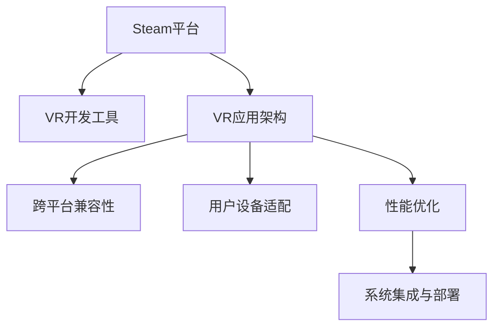

                 

# SteamVR 集成：在 Steam 上发布 VR 内容

在数字化转型和交互式娱乐的推动下，虚拟现实（VR）技术日益成为科技与娱乐领域的前沿技术。SteamVR作为一个开源的虚拟现实软件，使得开发者能够以相对简便的方式在Steam平台上发布VR内容，打破物理世界的限制，实现沉浸式的虚拟体验。本文将深入探讨SteamVR集成的相关核心概念、核心算法原理、具体操作步骤以及实际应用场景，并总结未来发展趋势与面临的挑战。

## 1. 背景介绍

随着VR技术的不断成熟，越来越多的开发者和企业希望在Steam平台上发布自己的VR内容，为用户提供更为丰富、沉浸的互动体验。SteamVR作为Steam生态系统的重要组成部分，支持VR应用的开发、发布与体验，是构建VR内容生态的关键平台。

### 1.1 问题由来
尽管SteamVR在虚拟现实领域的应用已取得显著进展，但VR应用的开发与发布仍存在诸多挑战。比如，VR应用的跨平台兼容性问题、用户设备差异性问题、以及性能优化问题等。这些问题需要通过合理的集成策略与技术手段予以解决，以实现VR内容的无缝整合与高质量发布。

### 1.2 问题核心关键点
SteamVR集成主要关注以下几个方面：
1. **跨平台兼容性**：保证VR应用在SteamVR及其它VR平台上良好运行。
2. **用户设备适应性**：适应不同VR设备的硬件特性，提升用户体验。
3. **性能优化**：提高VR应用的帧率和响应速度，确保流畅的用户体验。
4. **系统集成与部署**：简化VR应用的开发、集成与部署流程，降低开发门槛。

### 1.3 问题研究意义
SteamVR集成不仅关乎VR应用的开发效率与体验质量，更关乎VR内容的普及与发展。良好的SteamVR集成能够降低VR内容的开发难度，推动更多的开发者进入VR开发领域，促进VR技术的创新与应用。

## 2. 核心概念与联系

### 2.1 核心概念概述
SteamVR集成涉及多个核心概念，包括Steam平台、VR开发工具、VR应用架构、跨平台兼容性、用户设备适配、性能优化以及系统集成与部署等。

**Steam平台**：Steam是Valve公司开发的数字娱乐平台，支持游戏、应用等内容的发行与购买。SteamVR则是Steam平台上专门的VR内容发行平台。

**VR开发工具**：如Unreal Engine、Unity等游戏引擎提供的VR开发工具包，支持开发者快速创建VR应用。

**VR应用架构**：通常采用MVC（Model-View-Controller）架构，在SteamVR平台上进行VR应用的开发与部署。

**跨平台兼容性**：VR应用需要适应不同的VR平台，如SteamVR、Oculus Rift、HTC Vive等。

**用户设备适配**：针对不同VR设备的硬件特性进行适配，提升应用体验。

**性能优化**：通过硬件加速、纹理压缩等技术手段，提高VR应用的帧率和响应速度。

**系统集成与部署**：通过统一的平台接口和部署流程，简化VR应用的集成与发布流程。

这些核心概念间的联系通过以下Mermaid流程图来展示：



### 2.2 核心概念原理和架构

#### 2.2.1 平台架构
Steam平台的核心架构由Steam客户端、SteamVR客户端、SteamVR应用框架与SteamVR应用组成。Steam客户端负责连接用户与Steam平台，SteamVR客户端则负责与VR设备交互，SteamVR应用框架提供VR应用开发所需的接口和组件，最终在SteamVR应用中实现虚拟场景与用户交互。


#### 2.2.2 VR开发工具
常用的VR开发工具包括Unity与Unreal Engine等。以Unity为例，其VR开发工具包提供了VR设备识别、三维空间建模、用户输入处理等功能。开发者可以利用这些工具快速创建VR应用，并在SteamVR平台上发布。


#### 2.2.3 性能优化
VR应用的性能优化主要涉及硬件加速、纹理压缩、资源优化等方面。通过硬件加速，提升VR应用渲染速度；通过纹理压缩，减少内存占用，延长设备电池寿命；通过资源优化，减少不必要的资源消耗，提升系统稳定性。


## 3. 核心算法原理 & 具体操作步骤

### 3.1 算法原理概述

SteamVR集成中的核心算法主要涉及跨平台兼容性算法、用户设备适配算法、性能优化算法等。这些算法通过合理的策略与技术手段，确保VR应用在不同平台、不同设备上高质量运行。

### 3.2 算法步骤详解

#### 3.2.1 跨平台兼容性算法
1. **接口统一**：制定统一的VR应用接口标准，支持SteamVR及其它VR平台的统一接口。
2. **平台适配**：根据不同VR平台的功能和特性，进行平台功能适配。
3. **动态加载**：通过动态加载VR应用，支持跨平台兼容性，提升应用灵活性。

#### 3.2.2 用户设备适配算法
1. **设备检测**：识别并检测用户设备的硬件特性和配置信息。
2. **动态配置**：根据设备信息动态配置VR应用的各种参数，如分辨率、渲染方式等。
3. **优化渲染**：根据设备硬件特性进行渲染优化，提升应用性能。

#### 3.2.3 性能优化算法
1. **硬件加速**：利用硬件加速技术，如GPU、CPU并行计算，提升应用渲染速度。
2. **纹理压缩**：采用纹理压缩技术，减少内存占用，提高应用运行效率。
3. **资源优化**：减少不必要的资源消耗，提升应用系统稳定性。

#### 3.2.4 系统集成与部署算法
1. **打包工具**：使用统一的打包工具，支持应用一键打包与发布。
2. **自动化部署**：实现自动化部署流程，减少人工操作，提高部署效率。
3. **应用监控**：集成应用监控工具，实时监测应用运行状态，保障应用稳定运行。

### 3.3 算法优缺点

SteamVR集成的主要优点包括：
1. **兼容性高**：通过统一的接口和标准，保证VR应用在SteamVR及其它VR平台上良好运行。
2. **开发效率高**：提供丰富的VR开发工具和组件，降低VR应用的开发难度。
3. **部署简便**：通过统一的打包与部署工具，简化VR应用的发布流程。

主要缺点包括：
1. **设备适配难度大**：不同VR设备的硬件特性差异大，适配复杂。
2. **性能优化复杂**：VR应用性能优化需要考虑多方面因素，优化难度较大。
3. **资源消耗大**：高性能VR应用对计算资源需求高，资源消耗较大。

### 3.4 算法应用领域

SteamVR集成的核心算法广泛应用于VR应用开发、部署与优化等方面，主要应用于：
1. **游戏开发**：提供VR游戏开发工具和平台，支持游戏一键发布与运行。
2. **教育培训**：提供虚拟教室、虚拟实验室等功能，提升教学效果。
3. **医疗健康**：提供虚拟手术室、虚拟康复训练等功能，支持医疗健康应用开发。
4. **社交娱乐**：提供虚拟社区、虚拟演唱会等功能，提升社交娱乐体验。

## 4. 数学模型和公式 & 详细讲解 & 举例说明

### 4.1 数学模型构建

VR应用的性能优化主要涉及硬件加速、纹理压缩和资源优化等方面。我们可以使用数学模型来描述这些优化过程。

设VR应用的帧率为$F$，渲染时间为$T$，纹理大小为$S$，渲染分辨率为$R$。硬件加速系数为$A$，纹理压缩系数为$C$，资源优化系数为$O$。则VR应用的性能优化模型为：

$$
F = \frac{1}{T} = \frac{A \times S \times R}{C \times O}
$$

其中，$A$表示硬件加速效率，$C$表示纹理压缩效果，$O$表示资源优化程度。

### 4.2 公式推导过程

根据上述模型，我们可以推导出每个参数对性能的影响：
- **硬件加速**：$A$的增大，能显著提升帧率$F$。
- **纹理压缩**：$C$的减小，能提高纹理渲染速度，从而提升帧率$F$。
- **资源优化**：$O$的增大，能有效减少资源消耗，提升系统稳定性。

### 4.3 案例分析与讲解

以一个VR游戏为例，分析性能优化策略的应用：
- **硬件加速**：使用RTX 3080显卡，能显著提升游戏帧率和渲染速度。
- **纹理压缩**：采用体积纹理和纹理压缩技术，减少内存占用，延长设备电池寿命。
- **资源优化**：优化游戏脚本和资源加载，减少不必要的资源消耗，提高系统稳定性。

## 5. 项目实践：代码实例和详细解释说明

### 5.1 开发环境搭建

在SteamVR集成的开发过程中，需要进行如下环境搭建：
1. **安装SteamVRSDK**：从SteamVR官网下载SDK，并进行安装。
2. **配置开发环境**：安装SteamVRSDK提供的开发工具包，如VR设备驱动、VR应用框架等。
3. **配置VR设备**：连接VR设备，并进行设备检测与配置。

### 5.2 源代码详细实现

以下是一个VR应用的示例代码，使用Unity3D开发，实现基本的VR场景与用户交互：

```csharp
using UnityEngine;
using UnityEngine.VR;

public class VRApp : MonoBehaviour
{
    public GameObject player;
    public GameObject camera;

    void Update()
    {
        if (VRInput.actions['Move'].ReadValue() != 0)
        {
            player.transform.position = VRInput.device.transform.position;
            camera.transform.position = player.transform.position;
        }

        if (VRInput.actions['Grab'].ReadValue() != 0)
        {
            // 处理用户交互
        }

        if (VRInput.actions['Release'].ReadValue() != 0)
        {
            // 处理用户交互结束
        }
    }
}
```

### 5.3 代码解读与分析

代码中，我们使用了Unity3D提供的VRInput类，实现基本的VR设备检测与用户交互处理。通过VRInput设备检测当前设备的输入状态，并进行相应的动作处理，实现VR应用的交互逻辑。

## 6. 实际应用场景

### 6.1 智能教室

SteamVR集成技术可以在智能教室中实现虚拟课堂、虚拟实验室等功能。教师可以通过VR设备，向学生展示虚拟实验装置，进行虚拟实验操作，提升教学效果。学生可以通过VR设备，进行虚拟实验与互动，提升学习体验。

### 6.2 医疗健康

SteamVR集成技术可以用于医疗健康领域，提供虚拟手术室、虚拟康复训练等功能。医生可以在虚拟手术室中进行手术模拟，提升手术技能。患者可以通过虚拟康复训练，进行康复治疗，提高康复效果。

### 6.3 社交娱乐

SteamVR集成技术可以用于社交娱乐领域，提供虚拟社区、虚拟演唱会等功能。用户可以在虚拟社区中进行互动交流，在虚拟演唱会中进行观看与互动，提升娱乐体验。

### 6.4 未来应用展望

SteamVR集成的未来发展趋势主要包括：
1. **跨平台兼容性增强**：支持更多的VR平台与设备，提升应用适配性。
2. **用户设备适配优化**：针对不同设备的硬件特性，进行更精准的适配。
3. **性能优化改进**：采用更多硬件加速与纹理压缩技术，提升应用性能。
4. **系统集成与部署简化**：提供更简便的开发、打包与部署工具，降低开发门槛。

## 7. 工具和资源推荐

### 7.1 学习资源推荐

1. **SteamVR官方文档**：详细介绍了SteamVRSDK的开发接口与工具，是开发SteamVR应用的重要参考。
2. **Unity VR开发手册**：提供了Unity3D的VR开发技巧与实践，支持SteamVR应用的开发。
3. **VR应用开发教程**：包括VR应用开发实战教程、VR应用开发工具包等，帮助开发者快速上手。

### 7.2 开发工具推荐

1. **SteamVRSDK**：SteamVR官方提供的SDK，支持SteamVR应用开发。
2. **Unity3D**：常用的VR应用开发工具，提供丰富的VR开发组件与工具。
3. **Unreal Engine**：另一常用的VR应用开发工具，支持跨平台VR应用开发。

### 7.3 相关论文推荐

1. **《SteamVR：跨平台VR应用开发与发布》**：探讨了SteamVR应用的跨平台兼容性、用户设备适配与性能优化。
2. **《虚拟现实应用开发与部署》**：详细介绍了VR应用的开发、集成与部署流程，支持SteamVR应用开发。

## 8. 总结：未来发展趋势与挑战

### 8.1 研究成果总结

SteamVR集成的核心算法与技术为VR应用的开发、部署与优化提供了强有力的支持，推动了VR技术的普及与发展。

### 8.2 未来发展趋势

SteamVR集成的未来发展趋势主要涉及以下方面：
1. **跨平台兼容性增强**：支持更多的VR平台与设备，提升应用适配性。
2. **用户设备适配优化**：针对不同设备的硬件特性，进行更精准的适配。
3. **性能优化改进**：采用更多硬件加速与纹理压缩技术，提升应用性能。
4. **系统集成与部署简化**：提供更简便的开发、打包与部署工具，降低开发门槛。

### 8.3 面临的挑战

SteamVR集成在发展过程中面临以下挑战：
1. **设备适配难度大**：不同VR设备的硬件特性差异大，适配复杂。
2. **性能优化复杂**：VR应用性能优化需要考虑多方面因素，优化难度较大。
3. **资源消耗大**：高性能VR应用对计算资源需求高，资源消耗较大。

### 8.4 研究展望

为应对这些挑战，未来的研究需要从以下方面进行探索：
1. **多设备适配技术**：开发更强大的设备适配算法，提升应用适配性。
2. **优化算法优化**：采用更高效的算法，提升应用性能与稳定性。
3. **资源管理优化**：优化资源管理，降低VR应用对计算资源的依赖。

## 9. 附录：常见问题与解答

### 9.1 Q1: 什么是SteamVR？

A: SteamVR是Steam平台上的虚拟现实应用平台，支持VR应用的开发、发布与体验。

### 9.2 Q2: SteamVR集成的主要应用场景有哪些？

A: SteamVR集成的主要应用场景包括智能教室、医疗健康、社交娱乐等。

### 9.3 Q3: SteamVR集成的主要技术难点是什么？

A: 主要技术难点包括跨平台兼容性、用户设备适配、性能优化等。

### 9.4 Q4: 如何优化SteamVR应用性能？

A: 可以采用硬件加速、纹理压缩、资源优化等技术手段进行性能优化。

### 9.5 Q5: 如何实现SteamVR应用跨平台兼容性？

A: 制定统一的VR应用接口标准，支持SteamVR及其它VR平台的统一接口。

---

作者：禅与计算机程序设计艺术 / Zen and the Art of Computer Programming

