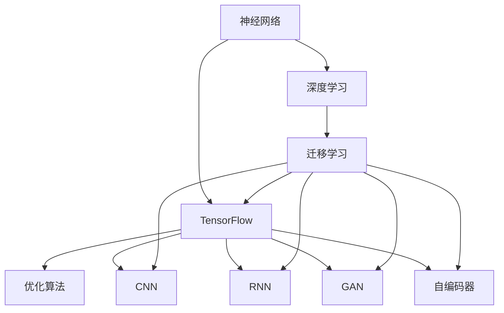

                 

# TensorFlow深度学习：从基础到高级应用

> 关键词：深度学习, TensorFlow, 神经网络, 优化算法, 卷积神经网络, 循环神经网络, 自编码器, 迁移学习, 生成对抗网络, 图像处理, 自然语言处理, 模型优化, 分布式训练

## 1. 背景介绍

### 1.1 问题由来
深度学习是当前人工智能领域最具影响力的技术之一，广泛应用于计算机视觉、自然语言处理、语音识别、推荐系统等领域。TensorFlow作为深度学习的主流框架之一，提供了灵活高效的计算图机制，支持丰富的模型和算法实现。通过TensorFlow进行深度学习建模，可以有效提升模型的泛化能力和应用表现。

深度学习的基础是神经网络(Neural Network)，通过多层非线性变换，学习输入数据的内在结构和模式，实现高效的特征提取与数据建模。而TensorFlow则是神经网络模型的得力助手，提供了便捷的API和高效的计算引擎，使得模型开发和训练变得简单高效。

### 1.2 问题核心关键点
TensorFlow在深度学习中的核心作用主要体现在以下几个方面：

- **灵活的计算图**：TensorFlow采用计算图(Computation Graph)的方式进行模型定义，模型结构可以通过计算图轻松构建和修改，具有高度灵活性和可复用性。
- **高效的计算引擎**：TensorFlow内部使用高度优化的计算引擎，支持GPU、TPU等高性能硬件加速，能够高效处理大规模数据和复杂模型。
- **丰富的模型和算法实现**：TensorFlow内置了大量的经典深度学习模型和算法，如卷积神经网络(CNN)、循环神经网络(RNN)、生成对抗网络(GAN)、自编码器(Autoencoder)等，方便用户进行模型选择和调参。
- **强大的分布式训练支持**：TensorFlow支持分布式训练，能够在多机环境下高效并行计算，快速训练大规模模型。
- **友好的开发环境**：TensorFlow提供了Jupyter Notebook、Keras等高层次的API，使得模型开发和调试更加便捷。

这些特性使得TensorFlow成为深度学习领域的重要工具，广泛应用于学术研究、工程开发和工业应用中。

### 1.3 问题研究意义
研究TensorFlow深度学习技术，对于推动人工智能技术的发展，提升各行业应用场景的智能化水平，具有重要意义：

1. **加速模型开发**：TensorFlow的强大计算图和API设计，使得模型开发和调试变得更加简单高效，加速了深度学习应用的落地进程。
2. **提高模型性能**：TensorFlow的优化算法和分布式训练机制，能够有效提升模型的训练速度和泛化能力，改善应用效果。
3. **支持大规模应用**：TensorFlow强大的计算引擎和分布式训练能力，支持处理大规模数据和复杂模型，适用于各种高计算需求的应用场景。
4. **促进学术交流**：TensorFlow的开源特性和社区支持，使得深度学习技术的学术交流和合作更加便捷，推动了技术进步。
5. **推动产业创新**：TensorFlow在各行各业的应用实践，促进了深度学习技术的产业化进程，加速了传统行业的数字化转型。

## 2. 核心概念与联系

### 2.1 核心概念概述

为了更好地理解TensorFlow深度学习的核心概念，本节将介绍几个密切相关的核心概念：

- **神经网络(Neural Network)**：由多个神经元(或称节点)组成的计算图结构，用于学习数据的内在模式和规律。
- **深度学习(Deep Learning)**：一种基于多层神经网络的机器学习范式，通过学习数据的多层次抽象特征，实现复杂的模式识别和预测任务。
- **TensorFlow**：谷歌开源的深度学习框架，提供了灵活的计算图和高效的计算引擎，支持丰富的模型和算法实现。
- **优化算法(Optimization Algorithm)**：用于更新模型参数，使模型在训练数据上最小化损失函数，从而提升模型性能。
- **卷积神经网络(Convolutional Neural Network, CNN)**：一种常用于图像处理任务的深度学习模型，通过卷积层和池化层提取局部特征。
- **循环神经网络(Recurrent Neural Network, RNN)**：一种常用于序列数据处理的深度学习模型，通过循环连接结构，捕捉时间序列的动态变化。
- **生成对抗网络(Generative Adversarial Network, GAN)**：一种用于生成和合成数据的新兴深度学习模型，通过生成器和判别器之间的对抗训练，生成高质量的伪造数据。
- **自编码器(Autoencoder)**：一种无监督学习的深度学习模型，通过编码器和解码器实现数据的压缩和重构，用于特征提取和降维。
- **迁移学习(Transfer Learning)**：一种利用已有模型在新任务上进行微调，提升模型性能的深度学习技术。

这些核心概念之间的逻辑关系可以通过以下Mermaid流程图来展示：



这个流程图展示了大语言模型的核心概念及其之间的关系：

1. 神经网络是深度学习的基础。
2. TensorFlow是大语言模型的计算图工具。
3. 深度学习模型包括CNN、RNN、GAN等。
4. 优化算法和迁移学习是深度学习的关键技术。
5. TensorFlow支持深度学习模型的实现和训练。

这些概念共同构成了TensorFlow深度学习的学习和应用框架，使得深度学习技术在各领域得到了广泛应用。

## 3. 核心算法原理 & 具体操作步骤
### 3.1 算法原理概述

TensorFlow深度学习的核心算法原理包括神经网络的结构设计、损失函数的选择、优化算法的应用等。以下将详细讲解这些原理。

**神经网络结构设计**：
神经网络通常由输入层、隐藏层和输出层组成。输入层接收原始数据，隐藏层进行特征提取和抽象，输出层输出模型预测结果。隐藏层可以包含多个神经元，每个神经元接收来自上一层的所有输入，并进行加权求和，通过激活函数输出结果。

**损失函数选择**：
损失函数用于衡量模型预测结果与真实标签之间的差异。常用的损失函数包括均方误差、交叉熵等。在TensorFlow中，可以通过`tf.losses`模块选择和定义不同的损失函数。

**优化算法应用**：
优化算法用于更新模型参数，使得模型在训练数据上最小化损失函数。常用的优化算法包括梯度下降、Adam、Adagrad等。在TensorFlow中，可以通过`tf.train`模块实现各种优化算法。

### 3.2 算法步骤详解

TensorFlow深度学习模型开发和训练通常包括以下关键步骤：

**Step 1: 数据预处理**
- 准备训练集、验证集和测试集，并进行数据预处理，如归一化、数据增强等。

**Step 2: 定义计算图**
- 使用TensorFlow定义计算图，包括输入层、隐藏层、输出层、损失函数和优化器等。

**Step 3: 训练模型**
- 将训练集数据输入计算图，进行前向传播和反向传播，更新模型参数。

**Step 4: 评估模型**
- 在验证集上评估模型性能，监控训练过程中的损失和准确率变化。

**Step 5: 测试模型**
- 在测试集上评估模型性能，最终确定模型的预测能力。

**Step 6: 模型部署**
- 将训练好的模型保存和部署到实际应用中。

### 3.3 算法优缺点

TensorFlow深度学习模型的优点包括：
1. 灵活的计算图机制，支持复杂模型的设计和实现。
2. 高效的计算引擎，支持大规模数据和复杂模型的训练。
3. 丰富的模型和算法实现，方便用户选择和调用。
4. 强大的分布式训练支持，支持多机环境下的高效并行计算。
5. 友好的开发环境，支持Jupyter Notebook、Keras等高层次API。

同时，TensorFlow也存在一些局限性：
1. 学习曲线较陡峭，需要一定的数学和编程基础。
2. 性能调优复杂，需要综合考虑计算图结构、模型参数、硬件资源等。
3. 内存占用较大，特别是使用大规模模型时，需要更多的内存支持。
4. 模型压缩和优化难度较大，特别是面对大规模应用时，需要高效的压缩和优化方法。

尽管存在这些局限性，TensorFlow作为深度学习的主流框架，其强大的计算图和优化算法使其成为深度学习应用的重要工具。

### 3.4 算法应用领域

TensorFlow深度学习模型在各个领域都得到了广泛的应用，例如：

- 计算机视觉：用于图像分类、目标检测、人脸识别、图像生成等任务。
- 自然语言处理：用于文本分类、机器翻译、情感分析、问答系统等任务。
- 语音识别：用于语音识别、语音合成、语音增强等任务。
- 推荐系统：用于用户行为预测、商品推荐等任务。
- 医疗健康：用于医学影像分析、病历分析、药物发现等任务。
- 游戏娱乐：用于游戏AI、游戏场景生成等任务。
- 工业制造：用于工业质量检测、设备故障预测等任务。

除了上述这些经典应用外，TensorFlow深度学习技术还在更多领域得到创新性地应用，如自动驾驶、金融风险预测、社交网络分析等，为人工智能技术带来了新的突破。

## 4. 数学模型和公式 & 详细讲解  
### 4.1 数学模型构建

本节将使用数学语言对TensorFlow深度学习模型的构建过程进行更加严格的刻画。

设输入数据为 $X$，输出数据为 $Y$，模型参数为 $\theta$。定义模型 $M_{\theta}$，其输出为 $\hat{Y}$，损失函数为 $\mathcal{L}(\theta)$，优化器为 $Opt$。TensorFlow深度学习模型的构建步骤如下：

1. **定义模型结构**：
   - 输入层：定义输入数据的形状和类型，如 `input_shape=(None, 28, 28)` 表示输入为28x28的图像。
   - 隐藏层：定义隐藏层的结构，如 `tf.keras.layers.Dense(units=128, activation='relu')` 表示一个包含128个神经元的全连接层。
   - 输出层：定义输出层的结构，如 `tf.keras.layers.Dense(units=10, activation='softmax')` 表示一个包含10个神经元的softmax层。

2. **定义损失函数**：
   - 选择适当的损失函数，如 `tf.keras.losses.categorical_crossentropy` 表示交叉熵损失函数。

3. **定义优化器**：
   - 选择适当的优化器，如 `tf.keras.optimizers.Adam` 表示Adam优化器。

4. **定义模型训练过程**：
   - 定义训练过程，包括模型定义、损失函数、优化器、训练数据等。

5. **定义模型评估过程**：
   - 定义模型评估过程，包括模型定义、评估指标、评估数据等。

6. **定义模型测试过程**：
   - 定义模型测试过程，包括模型定义、测试指标、测试数据等。

### 4.2 公式推导过程

以下我们以二分类任务为例，推导交叉熵损失函数及其梯度的计算公式。

设模型 $M_{\theta}$ 在输入 $x$ 上的输出为 $\hat{y}=M_{\theta}(x) \in [0,1]$，表示样本属于正类的概率。真实标签 $y \in \{0,1\}$。则二分类交叉熵损失函数定义为：

$$
\mathcal{L}(\theta) = -\frac{1}{N}\sum_{i=1}^N [y_i\log \hat{y} + (1-y_i)\log(1-\hat{y})]
$$

将其代入经验风险公式，得：

$$
\mathcal{L}(\theta) = -\frac{1}{N}\sum_{i=1}^N [y_i\log M_{\theta}(x_i)+(1-y_i)\log(1-M_{\theta}(x_i))]
$$

根据链式法则，损失函数对参数 $\theta_k$ 的梯度为：

$$
\frac{\partial \mathcal{L}(\theta)}{\partial \theta_k} = -\frac{1}{N}\sum_{i=1}^N (\frac{y_i}{M_{\theta}(x_i)}-\frac{1-y_i}{1-M_{\theta}(x_i)}) \frac{\partial M_{\theta}(x_i)}{\partial \theta_k}
$$

其中 $\frac{\partial M_{\theta}(x_i)}{\partial \theta_k}$ 可进一步递归展开，利用自动微分技术完成计算。

在得到损失函数的梯度后，即可带入优化器更新模型参数，完成模型的迭代优化。重复上述过程直至收敛，最终得到最优模型参数 $\theta^*$。

## 5. 项目实践：代码实例和详细解释说明
### 5.1 开发环境搭建

在进行TensorFlow深度学习项目开发前，我们需要准备好开发环境。以下是使用Python进行TensorFlow开发的环境配置流程：

1. 安装Anaconda：从官网下载并安装Anaconda，用于创建独立的Python环境。

2. 创建并激活虚拟环境：
```bash
conda create -n tf-env python=3.8 
conda activate tf-env
```

3. 安装TensorFlow：根据CUDA版本，从官网获取对应的安装命令。例如：
```bash
conda install tensorflow=2.4.0 tf-nightly=2.4.0+tf2_2_0rc1 py=3.8_cudatoolkit=11.1
```

4. 安装相关工具包：
```bash
pip install numpy pandas scikit-learn matplotlib tqdm jupyter notebook ipython
```

完成上述步骤后，即可在`tf-env`环境中开始TensorFlow深度学习项目开发。

### 5.2 源代码详细实现

这里我们以手写数字识别任务为例，给出使用TensorFlow和Keras实现深度学习模型的完整代码实现。

首先，定义模型数据处理函数：

```python
import tensorflow as tf
from tensorflow.keras.datasets import mnist
from tensorflow.keras.utils import to_categorical

def load_data(batch_size=64):
    (x_train, y_train), (x_test, y_test) = mnist.load_data()
    x_train = x_train.reshape(-1, 28, 28, 1).astype('float32') / 255.0
    x_test = x_test.reshape(-1, 28, 28, 1).astype('float32') / 255.0
    y_train = to_categorical(y_train, num_classes=10)
    y_test = to_categorical(y_test, num_classes=10)
    return tf.data.Dataset.from_tensor_slices((x_train, y_train)).shuffle(60000).batch(batch_size),
           tf.data.Dataset.from_tensor_slices((x_test, y_test)).batch(batch_size)
```

然后，定义模型：

```python
import tensorflow as tf
from tensorflow.keras import layers

model = tf.keras.Sequential([
    layers.Conv2D(32, 3, activation='relu', input_shape=(28, 28, 1)),
    layers.MaxPooling2D(pool_size=(2, 2)),
    layers.Flatten(),
    layers.Dense(64, activation='relu'),
    layers.Dense(10, activation='softmax')
])
```

接着，定义训练和评估函数：

```python
from tensorflow.keras import losses, optimizers

def train_epoch(model, dataset, batch_size, optimizer):
    model.compile(optimizer=optimizer, loss='categorical_crossentropy', metrics=['accuracy'])
    model.fit(dataset, epochs=1, validation_data=validation_data)
    
def evaluate(model, dataset, batch_size):
    model.evaluate(dataset)
```

最后，启动训练流程并在测试集上评估：

```python
epochs = 5
batch_size = 64

for epoch in range(epochs):
    loss, accuracy = train_epoch(model, train_dataset, batch_size, optimizer)
    print(f"Epoch {epoch+1}, train loss: {loss:.3f}, train accuracy: {accuracy:.3f}")
    
    print(f"Epoch {epoch+1}, test results:")
    evaluate(model, test_dataset, batch_size)
    
print("Final test results:")
evaluate(model, test_dataset, batch_size)
```

以上就是使用TensorFlow和Keras实现手写数字识别任务的完整代码实现。可以看到，TensorFlow提供了强大的API和计算图机制，使得模型开发和调试变得更加简单高效。

### 5.3 代码解读与分析

让我们再详细解读一下关键代码的实现细节：

**load_data函数**：
- 定义数据加载和预处理函数，包括加载MNIST数据集、归一化、one-hot编码、批处理等操作。

**model定义**：
- 定义一个包含卷积层、池化层、全连接层的深度学习模型，用于对手写数字进行识别。

**train_epoch函数**：
- 定义模型训练函数，包括模型编译、训练过程、验证集评估等。

**evaluate函数**：
- 定义模型评估函数，用于在测试集上评估模型性能。

**训练流程**：
- 定义总的epoch数和batch size，开始循环迭代
- 每个epoch内，先在训练集上训练，输出损失和准确率
- 在验证集上评估，输出验证集损失和准确率
- 所有epoch结束后，在测试集上评估，给出最终测试结果

可以看到，TensorFlow提供了便捷的API和计算图机制，使得模型开发和调试变得更加简单高效。开发者可以将更多精力放在数据处理、模型改进等高层逻辑上，而不必过多关注底层的实现细节。

当然，工业级的系统实现还需考虑更多因素，如模型保存和部署、超参数调优、分布式训练等。但核心的深度学习建模过程基本与此类似。

## 6. 实际应用场景
### 6.1 计算机视觉

TensorFlow深度学习技术在计算机视觉领域得到了广泛的应用，覆盖了图像分类、目标检测、图像分割、图像生成等诸多任务。通过深度学习模型，可以从复杂的视觉数据中提取出有用的特征和信息，实现高效的图像理解和处理。

在图像分类任务中，使用卷积神经网络(CNN)模型可以对图像进行分类，例如识别照片中的动物、物体等。在目标检测任务中，使用YOLO、Faster R-CNN等模型可以实时检测图像中的目标位置和类别。在图像分割任务中，使用U-Net、Mask R-CNN等模型可以对图像进行像素级别的分割，例如分割医学影像、卫星影像等。在图像生成任务中，使用GAN模型可以生成高质量的伪造图像，例如生成人脸、风景等。

### 6.2 自然语言处理

TensorFlow深度学习技术在自然语言处理领域也得到了广泛的应用，包括文本分类、机器翻译、情感分析、问答系统等任务。通过深度学习模型，可以从大量的文本数据中提取出有用的信息，实现高效的文本理解和生成。

在文本分类任务中，使用循环神经网络(RNN)、长短期记忆网络(LSTM)等模型可以对文本进行分类，例如情感分析、主题分类等。在机器翻译任务中，使用序列到序列模型(Seq2Seq)可以完成语言的自动翻译，例如将英文翻译成中文。在情感分析任务中，使用卷积神经网络(CNN)、门控循环单元(GRU)等模型可以判断文本的情感倾向，例如判断电影评论的情感。在问答系统任务中，使用注意力机制的模型可以回答用户的问题，例如智能客服、智能助手等。

### 6.3 语音识别

TensorFlow深度学习技术在语音识别领域也有广泛的应用，包括语音识别、语音合成、语音增强等任务。通过深度学习模型，可以从声音信号中提取出有用的信息，实现高效的语音理解和生成。

在语音识别任务中，使用卷积神经网络(CNN)、循环神经网络(RNN)等模型可以对音频进行识别，例如识别语音中的数字、单词等。在语音合成任务中，使用深度学习模型可以生成高质量的语音输出，例如生成语音指令、语音播报等。在语音增强任务中，使用深度学习模型可以消除音频中的噪声和干扰，例如去噪、回声消除等。

### 6.4 未来应用展望

未来，随着深度学习技术的不断进步，TensorFlow深度学习技术也将迎来新的发展机遇，推动更多领域的应用落地。

在智慧医疗领域，基于深度学习的影像分析、病历分析、药物发现等应用将提升医疗服务的智能化水平，辅助医生诊疗，加速新药开发进程。

在智能教育领域，深度学习技术可应用于作业批改、学情分析、知识推荐等方面，因材施教，促进教育公平，提高教学质量。

在智能制造领域，深度学习技术可以用于工业质量检测、设备故障预测等任务，推动制造业的智能化升级。

此外，在自动驾驶、金融风险预测、社交网络分析等众多领域，TensorFlow深度学习技术也将不断拓展应用场景，为人工智能技术的发展注入新的动力。相信随着技术的日益成熟，TensorFlow深度学习技术必将在更多的领域得到广泛应用，深刻影响人类的生产生活方式。

## 7. 工具和资源推荐
### 7.1 学习资源推荐

为了帮助开发者系统掌握TensorFlow深度学习的理论基础和实践技巧，这里推荐一些优质的学习资源：

1. **TensorFlow官方文档**：TensorFlow官方提供了详细的文档和API参考，包括基础概念、模型实现、优化算法等，是学习TensorFlow的重要资料。
2. **《TensorFlow深度学习》书籍**：深度学习领域专家所著的TensorFlow深度学习教材，涵盖了从基础到高级的各类知识，是深入理解TensorFlow的重要参考资料。
3. **DeepLearning.ai课程**：由Andrew Ng教授主讲的深度学习课程，通过在线视频和实践项目，系统讲解深度学习的基本概念和TensorFlow应用。
4. **Kaggle竞赛**：Kaggle平台提供了大量的深度学习竞赛项目，通过实际应用场景提升TensorFlow的应用能力。
5. **GitHub开源项目**：GitHub上有大量的TensorFlow项目，通过阅读和学习这些开源项目，可以快速掌握TensorFlow的实际应用。

通过对这些资源的学习实践，相信你一定能够快速掌握TensorFlow深度学习的精髓，并用于解决实际的深度学习问题。

### 7.2 开发工具推荐

高效的开发离不开优秀的工具支持。以下是几款用于TensorFlow深度学习开发的常用工具：

1. Jupyter Notebook：一个开源的Web交互式编程环境，支持Python、TensorFlow等库的开发和调试。
2. PyCharm：一款功能强大的Python IDE，支持TensorFlow的深度学习开发和调试。
3. Visual Studio Code：一款轻量级的代码编辑器，支持TensorFlow的深度学习开发和调试。
4. TensorBoard：TensorFlow的可视化工具，支持模型的训练过程监控、模型结构展示等。
5. Weights & Biases：模型训练的实验跟踪工具，可以记录和可视化模型训练过程中的各项指标，方便对比和调优。

合理利用这些工具，可以显著提升TensorFlow深度学习任务的开发效率，加快创新迭代的步伐。

### 7.3 相关论文推荐

TensorFlow深度学习技术的不断发展离不开学界的持续研究。以下是几篇奠基性的相关论文，推荐阅读：

1. LeNet-5：提出卷积神经网络的基本结构，开创深度学习在计算机视觉领域的应用。
2. AlexNet：提出使用深度卷积神经网络进行图像分类，刷新了ImageNet比赛的冠军记录。
3. RNN：提出循环神经网络的基本结构，用于处理序列数据。
4. LSTM：提出长短期记忆网络，解决了传统RNN的长期记忆问题。
5. GAN：提出生成对抗网络，实现了高质量的伪造图像生成。
6. Transformer：提出自注意力机制，用于处理自然语言序列数据。

这些论文代表了大语言模型微调技术的发展脉络。通过学习这些前沿成果，可以帮助研究者把握学科前进方向，激发更多的创新灵感。

## 8. 总结：未来发展趋势与挑战

### 8.1 总结

本文对TensorFlow深度学习技术进行了全面系统的介绍。首先阐述了深度学习的背景和意义，明确了TensorFlow在大规模数据处理和复杂模型训练中的核心作用。其次，从原理到实践，详细讲解了深度学习模型的构建、训练和评估过程，给出了深度学习任务的完整代码实现。同时，本文还广泛探讨了深度学习技术在各行业领域的应用前景，展示了深度学习技术的巨大潜力。此外，本文精选了深度学习技术的各类学习资源，力求为读者提供全方位的技术指引。

通过本文的系统梳理，可以看到，TensorFlow深度学习技术正在成为人工智能技术的重要组成部分，极大地拓展了深度学习应用的边界，推动了各领域的技术进步。未来，伴随深度学习技术的不断发展，TensorFlow深度学习技术也将迎来更多的应用场景，深刻影响人类的生产生活方式。

### 8.2 未来发展趋势

展望未来，TensorFlow深度学习技术将呈现以下几个发展趋势：

1. **深度学习模型的可解释性**：随着深度学习技术的不断成熟，可解释性将成为重要的研究方向。TensorFlow正在探索多种可解释性技术，如局部可解释模型(LIME)、梯度热图等，以帮助用户更好地理解模型的内部工作机制。
2. **联邦学习(Federated Learning)**：联邦学习是一种分布式学习技术，通过在多个本地数据集上训练模型，保护数据隐私的同时，提升模型的泛化能力。TensorFlow正在积极开发联邦学习框架，支持分布式训练和模型更新。
3. **自监督学习(Self-Supervised Learning)**：自监督学习是一种无监督学习范式，通过预训练模型在未标注数据上学习知识，提升模型的泛化能力。TensorFlow正在探索多种自监督学习技术，如Masked Language Model(MLM)、Auto-Encoder等。
4. **模型优化与压缩**：深度学习模型通常包含大量参数，计算复杂度高。TensorFlow正在探索多种模型优化与压缩技术，如剪枝、量化、知识蒸馏等，以提高模型的效率和可部署性。
5. **分布式训练与模型部署**：深度学习模型的计算需求高，需要高效的分布式训练和模型部署。TensorFlow正在开发多种分布式训练工具，如TPU、Kubeflow等，支持多机环境下的模型训练和部署。

这些趋势凸显了TensorFlow深度学习技术的广泛应用前景和持续发展潜力。未来，TensorFlow将持续推进深度学习技术的创新和应用，为各行业带来更深层次的智能化变革。

### 8.3 面临的挑战

尽管TensorFlow深度学习技术已经取得了显著成就，但在迈向更加智能化、普适化应用的过程中，仍面临诸多挑战：

1. **计算资源瓶颈**：深度学习模型的计算需求高，需要高效的分布式训练和优化算法。如何更好地利用硬件资源，提升模型的训练速度和性能，仍是重要的研究课题。
2. **数据隐私与安全**：深度学习模型通常需要大量的数据进行训练，如何保护数据隐私和安全，防止数据泄露和滥用，仍需更多的技术手段和安全措施。
3. **模型的可解释性**：深度学习模型通常被视为"黑盒"系统，难以解释其内部工作机制和决策逻辑。如何在提高模型性能的同时，增强其可解释性，仍需更多的研究。
4. **模型的泛化能力**：深度学习模型在特定数据集上的表现优异，但面对新数据和新任务，模型的泛化能力有限。如何提高模型的泛化能力，适应更多领域的应用，仍需更多的研究。
5. **模型的迁移能力**：深度学习模型在不同领域和任务上的迁移能力不足，如何通过迁移学习等技术，提高模型的迁移能力，仍需更多的探索。

尽管面临这些挑战，TensorFlow深度学习技术仍将继续发展，通过不断的研究和创新，克服技术障碍，推动深度学习技术的进一步应用。

### 8.4 研究展望

面对TensorFlow深度学习技术所面临的挑战，未来的研究需要在以下几个方面寻求新的突破：

1. **提升模型的可解释性**：研究多种可解释性技术，如梯度热图、LIME等，帮助用户更好地理解模型的内部工作机制。
2. **优化模型训练效率**：开发高效的分布式训练算法，如联邦学习、分布式优化器等，提升模型的训练速度和性能。
3. **提高模型的泛化能力**：通过自监督学习、迁移学习等技术，提高模型的泛化能力和迁移能力。
4. **增强数据隐私保护**：研究多种数据隐私保护技术，如差分隐私、联邦学习等，保护数据隐私和安全。
5. **优化模型结构与参数**：研究多种模型优化与压缩技术，如剪枝、量化、知识蒸馏等，提升模型的效率和可部署性。

这些研究方向的探索，必将引领TensorFlow深度学习技术迈向更高的台阶，为构建安全、可靠、可解释、可控的智能系统铺平道路。面向未来，TensorFlow深度学习技术还需要与其他人工智能技术进行更深入的融合，如知识表示、因果推理、强化学习等，多路径协同发力，共同推动人工智能技术的发展。只有勇于创新、敢于突破，才能不断拓展深度学习模型的边界，让智能技术更好地造福人类社会。

## 9. 附录：常见问题与解答

**Q1：TensorFlow深度学习模型的训练速度较慢，如何加速训练？**

A: 可以通过以下方式加速TensorFlow深度学习模型的训练：
1. **使用GPU/TPU加速**：利用GPU或TPU的并行计算能力，可以显著提升模型的训练速度。
2. **使用分布式训练**：通过多机环境下的并行计算，可以进一步提高训练速度。
3. **数据预处理和优化**：对数据进行归一化、数据增强等预处理，可以提高模型的训练速度和性能。
4. **优化器选择**：选择高效的优化器，如Adam、RMSprop等，可以提升模型的训练速度和收敛速度。
5. **模型压缩与量化**：通过模型剪枝、量化等技术，可以减小模型规模，提高模型的训练和推理速度。

**Q2：TensorFlow深度学习模型的可解释性较差，如何提高模型的可解释性？**

A: 可以通过以下方式提高TensorFlow深度学习模型的可解释性：
1. **使用可解释性模型**：选择可解释性强的模型，如LIME、SHAP等，可以提升模型的可解释性。
2. **可视化模型结构**：使用TensorBoard等可视化工具，可以可视化模型的计算图和梯度信息，帮助理解模型的内部工作机制。
3. **局部可解释性方法**：使用局部可解释性方法，如梯度热图、特征重要性等，可以解释模型的局部行为和决策逻辑。
4. **解释性模型融合**：将可解释性模型与深度学习模型结合，提升模型的可解释性。

**Q3：TensorFlow深度学习模型在实际应用中，如何处理大规模数据和复杂模型？**

A: 可以通过以下方式处理TensorFlow深度学习模型在实际应用中的大规模数据和复杂模型：
1. **分布式训练**：利用多机环境下的并行计算，可以处理大规模数据和复杂模型。
2. **模型压缩与优化**：通过剪枝、量化、知识蒸馏等技术，可以减小模型规模，提高模型的效率和可部署性。
3. **自适应学习率**：使用自适应学习率算法，如AdaGrad、AdaDelta等，可以提高模型的训练速度和收敛速度。
4. **GPU/TPU加速**：利用GPU或TPU的并行计算能力，可以显著提升模型的训练速度和性能。

**Q4：TensorFlow深度学习模型在实际应用中，如何提升模型的泛化能力？**

A: 可以通过以下方式提升TensorFlow深度学习模型的泛化能力：
1. **增加数据多样性**：通过数据增强、多源数据融合等技术，增加模型的数据多样性，提升模型的泛化能力。
2. **自监督学习**：使用自监督学习技术，如Masked Language Model(MLM)、Auto-Encoder等，提升模型的泛化能力。
3. **迁移学习**：通过迁移学习技术，将模型在新任务上进行微调，提升模型的泛化能力。
4. **正则化技术**：使用正则化技术，如L2正则、Dropout等，防止模型过拟合，提升模型的泛化能力。
5. **联邦学习**：通过联邦学习技术，在多个本地数据集上训练模型，提升模型的泛化能力和鲁棒性。

**Q5：TensorFlow深度学习模型在实际应用中，如何保护数据隐私和安全？**

A: 可以通过以下方式保护TensorFlow深度学习模型在实际应用中的数据隐私和安全：
1. **差分隐私**：使用差分隐私技术，保护数据隐私和安全。
2. **联邦学习**：通过联邦学习技术，在多个本地数据集上训练模型，保护数据隐私和安全。
3. **模型加密**：使用模型加密技术，保护模型的隐私和安全。
4. **访问控制**：设置模型访问权限，控制模型的访问和使用。
5. **安全审计**：定期对模型进行安全审计，检测和修复潜在的安全漏洞。

这些问题的答案展示了TensorFlow深度学习技术在实际应用中的广泛应用和面临的挑战。通过不断的研究和创新，TensorFlow深度学习技术必将带来更广泛的应用和更深入的智能变革。

---

作者：禅与计算机程序设计艺术 / Zen and the Art of Computer Programming

