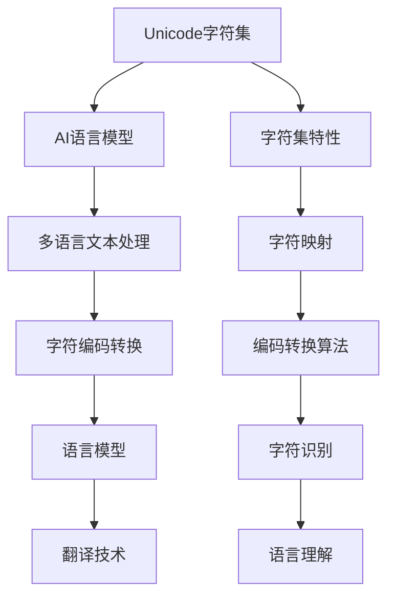

                 

# Unicode与AI：文本处理的国际化挑战

> 关键词：Unicode, AI, 文本处理, 国际化, 字符集, 语言模型, 翻译技术, 编码转换

## 1. 背景介绍

### 1.1 问题由来
随着全球化进程的加速，AI技术在多语言环境下的应用变得越来越重要。无论是智能客服、自动翻译、内容推荐，还是自然语言处理(NLP)任务，如文本分类、信息抽取等，都涉及大量的跨语言信息交互。然而，Unicode字符集的复杂性以及多语言文本处理的特殊性，为AI模型带来了不小的挑战。本文将详细探讨Unicode与AI技术在文本处理中的国际化挑战，旨在为相关从业者提供解决方案和优化策略。

### 1.2 问题核心关键点
Unicode字符集是当前最广泛使用的字符编码标准，它支持世界上大部分语言的字符，包含约143,000个符号。然而，Unicode的复杂性，包括变长编码、多字节表示、字符映射等特性，使得AI模型在处理多语言文本时，面临着编码转换、字符识别、语言理解等多重挑战。本节将通过以下几个关键点深入分析这些问题：

- Unicode字符集的特性与挑战
- 多语言文本处理中的字符编码转换
- 语言模型的国际化和跨语言理解
- 翻译技术中的字符对齐与模型优化

## 2. 核心概念与联系

### 2.1 核心概念概述

为更好地理解Unicode与AI在文本处理中的国际化挑战，本节将介绍几个密切相关的核心概念：

- Unicode字符集：由ISO标准定义的字符编码系统，支持世界上大多数语言的字符。
- AI语言模型：以深度学习技术为基础的模型，能够从大量文本数据中学习语言的通用表示。
- 多语言文本处理：处理包含多种语言字符的文本数据，涉及字符编码转换、字符识别、语言理解等多个环节。
- 字符编码转换：在处理多语言文本时，将不同字符集编码的文本进行转换，以便于模型处理。
- 语言模型：用于预测文本中下一个单词或字符的模型，其训练和推理需要考虑多语言特性。
- 翻译技术：将一种语言的文本翻译成另一种语言的技术，涉及字符对齐、语义理解等复杂问题。

这些概念之间的逻辑关系可以通过以下Mermaid流程图来展示：



这个流程图展示了Unicode字符集、AI语言模型、多语言文本处理、字符编码转换、语言模型和翻译技术之间的联系和依赖关系。

## 3. 核心算法原理 & 具体操作步骤
### 3.1 算法原理概述

Unicode与AI在文本处理中的国际化挑战，本质上是多语言文本处理的问题。为了解决这一问题，首先需要了解Unicode字符集的特性，然后通过字符编码转换、字符识别、语言模型等技术，对文本数据进行处理和分析。

### 3.2 算法步骤详解

#### 3.2.1 字符编码转换
在处理多语言文本时，首先需要将不同字符集编码的文本转换为统一的Unicode编码。这一过程涉及字符集的识别、映射和转换。

1. **字符集识别**：识别文本中包含的字符集类型，如UTF-8、GBK、Big5等。可以通过字符编码检测器或统计文本中不同字符集的比例来确定。
2. **字符映射**：将不同字符集中的字符映射到Unicode编码。可以使用字符映射表或查找算法来实现。
3. **字符转换**：将转换后的Unicode字符写入文件或数据库，供后续处理使用。

#### 3.2.2 字符识别与处理
在字符转换后，需要对文本中的字符进行识别和处理。这一过程包括字符标准化、分词、去除噪声等步骤。

1. **字符标准化**：将字符转换为标准形式，如将重音字符转换为基本字符，统一大小写等。可以使用字符规范化算法或标准转换库实现。
2. **分词**：将文本分成词语或单词，以便于语言模型的处理。不同语言的文本分词方式不同，需要根据具体语言的特点进行设计。
3. **去除噪声**：去除文本中的非文本字符，如标点符号、特殊字符等。这些字符可能会影响语言模型的训练和推理效果。

#### 3.2.3 语言模型的国际化和跨语言理解
语言模型是文本处理的基础，其训练和推理需要考虑多语言特性。为了提升模型的泛化能力和跨语言理解能力，可以采用以下策略：

1. **多语言数据集**：使用包含多种语言的文本数据集，如Wikipedia、新闻网站、社交媒体等。这些数据集可以覆盖不同的语言和文化背景，提升模型的泛化能力。
2. **字符嵌入**：将字符映射到高维向量空间中，以便于模型处理。常用的字符嵌入技术包括Word2Vec、GloVe等。
3. **多语言训练**：在多语言数据集上进行联合训练，提升模型对不同语言的理解能力。
4. **语言编码器**：使用特定的语言编码器，如Transformer、BiLSTM等，处理不同语言的文本数据。

#### 3.2.4 翻译技术中的字符对齐与模型优化
在机器翻译中，字符对齐是一个关键问题。由于不同语言中的字符长度不同，直接进行字符级对齐可能导致翻译结果不连贯、语义不清晰。因此，在翻译过程中，需要考虑字符对齐和模型优化：

1. **字符对齐**：在翻译过程中，需要将源语言和目标语言中的字符对齐，使得翻译结果连贯、语义清晰。常用的对齐方法包括基于字节对齐和基于字符对齐。
2. **模型优化**：在翻译模型中，使用特定的优化算法，如注意力机制、神经网络结构等，提升翻译的准确性和流畅性。

### 3.3 算法优缺点

Unicode与AI在文本处理中的国际化挑战的解决方法，具有以下优点：

1. **通用性**：使用Unicode字符集，可以处理世界上大部分语言的文本数据，具有广泛的应用场景。
2. **高效性**：通过字符编码转换和字符识别技术，可以将不同字符集编码的文本快速转换为统一的Unicode编码，便于模型处理。
3. **灵活性**：多语言训练和语言模型国际化的策略，可以提升模型的泛化能力和跨语言理解能力，适应不同语言和文化背景。
4. **准确性**：通过字符对齐和模型优化技术，可以提升机器翻译的准确性和流畅性，获得高质量的翻译结果。

同时，该方法也存在以下局限性：

1. **复杂性**：字符编码转换和字符识别技术涉及复杂的字符映射和标准化过程，需要较高的计算资源和时间成本。
2. **精度**：字符对齐和模型优化技术在处理某些特殊字符和语言结构时，可能存在精度问题。
3. **资源消耗**：多语言训练和字符嵌入等技术需要大量的计算资源和时间，对硬件设备要求较高。

尽管存在这些局限性，但就目前而言，Unicode与AI在文本处理中的国际化挑战的解决方法，仍然是大规模多语言数据处理的重要手段。未来相关研究的重点在于如何进一步降低处理复杂性，提高处理精度，降低资源消耗，从而实现更加高效、精准的文本处理。

### 3.4 算法应用领域

Unicode与AI在文本处理中的国际化挑战的解决方法，在多个领域都有广泛应用，例如：

- 智能客服：处理多语言客户咨询，提升客户服务质量。
- 自动翻译：将不同语言之间的文本进行翻译，促进全球化交流。
- 内容推荐：处理多语言用户评论和反馈，提升推荐系统的精准度。
- 信息抽取：从多语言文本中抽取实体和关系，提升数据挖掘的效率。
- 情感分析：处理多语言用户评论和评价，评估产品或服务的情感倾向。

除了上述这些经典应用外，Unicode与AI在文本处理中的国际化挑战的解决方法，还被创新性地应用到更多场景中，如可控文本生成、语言互译、自然语言处理、跨语言数据分析等，为文本处理技术带来了全新的突破。随着Unicode字符集和AI技术的不断进步，相信文本处理技术将在更广阔的应用领域大放异彩。

## 4. 数学模型和公式 & 详细讲解 & 举例说明
### 4.1 数学模型构建

在Unicode与AI在文本处理中的国际化挑战中，数学模型的构建是核心。我们以机器翻译为例，介绍其数学模型构建过程。

机器翻译的数学模型可以表示为：

$$
y = f(x; \theta)
$$

其中，$x$ 表示源语言文本，$y$ 表示目标语言文本，$f$ 表示翻译模型，$\theta$ 表示模型的参数。

### 4.2 公式推导过程

在机器翻译中，常见的翻译模型包括神经机器翻译(Neural Machine Translation, NMT)模型。NMT模型通常由编码器和解码器组成，其基本结构如图1所示。


图1：神经机器翻译模型

神经机器翻译模型的核心公式为：

$$
\log P(y|x) = \log \prod_{i=1}^n P(y_i|x, y_{i-1})
$$

其中，$P(y|x)$ 表示翻译模型的概率分布，$P(y_i|x, y_{i-1})$ 表示在给定源语言文本 $x$ 和前一个目标语言词 $y_{i-1}$ 的条件下，第 $i$ 个目标语言词 $y_i$ 的条件概率分布。

在实际应用中，为了计算条件概率分布 $P(y_i|x, y_{i-1})$，通常使用Transformer模型。Transformer模型是一种基于自注意力机制的模型，其核心公式为：

$$
\begin{aligned}
Q &= \text{Linear}(Z) \\
K &= \text{Linear}(X) \\
V &= \text{Linear}(V) \\
A &= \text{Softmax}(\text{Attention}(Q, K, V)) \\
C &= \text{Linear}(A) \\
S &= \text{Softmax}(C)
\end{aligned}
$$

其中，$Z$、$X$、$V$ 分别表示源语言文本、目标语言文本和字符嵌入，$\text{Linear}$ 表示线性变换，$\text{Softmax}$ 表示softmax函数，$\text{Attention}$ 表示自注意力机制。

### 4.3 案例分析与讲解

以机器翻译为例，分析其核心数学模型和公式。

假设源语言为英语，目标语言为法语。源语言文本为 "I love you"，目标语言文本为 "Je t'aime"。其机器翻译过程如下：

1. **编码器**：将源语言文本 "I love you" 转换为高维向量表示，即 $Z$。
2. **自注意力机制**：将 $Z$ 与目标语言文本 $X$ 进行自注意力计算，得到注意力权重 $A$。
3. **解码器**：根据注意力权重 $A$ 和字符嵌入 $V$，计算出条件概率分布 $P(y_i|x, y_{i-1})$，对每个目标语言词进行预测。
4. **翻译结果**：最终得到翻译结果 "Je t'aime"。

需要注意的是，在字符对齐和模型优化中，需要对源语言和目标语言文本进行字符对齐，以确保翻译结果连贯、语义清晰。例如，在源语言 "I love you" 和目标语言 "Je t'aime" 中，需要将 "I" 对齐到 "Je"，将 "love" 对齐到 "t'aime"，才能保证翻译结果的准确性和流畅性。

## 5. 项目实践：代码实例和详细解释说明
### 5.1 开发环境搭建

在进行Unicode与AI在文本处理中的国际化挑战实践前，我们需要准备好开发环境。以下是使用Python进行TensorFlow开发的环境配置流程：

1. 安装Anaconda：从官网下载并安装Anaconda，用于创建独立的Python环境。

2. 创建并激活虚拟环境：
```bash
conda create -n tf-env python=3.8 
conda activate tf-env
```

3. 安装TensorFlow：根据CUDA版本，从官网获取对应的安装命令。例如：
```bash
conda install tensorflow -c tensorflow -c conda-forge
```

4. 安装各类工具包：
```bash
pip install numpy pandas scikit-learn matplotlib tqdm jupyter notebook ipython
```

完成上述步骤后，即可在`tf-env`环境中开始实践。

### 5.2 源代码详细实现

这里我们以机器翻译为例，给出使用TensorFlow实现机器翻译的PyTorch代码实现。

首先，定义机器翻译的数据处理函数：

```python
import tensorflow as tf
from tensorflow.keras.preprocessing.text import Tokenizer

class TranslationDataLoader(tf.keras.utils.Sequence):
    def __init__(self, data, batch_size=32):
        self.data = data
        self.batch_size = batch_size
        
    def __len__(self):
        return len(self.data) // self.batch_size
    
    def __getitem__(self, idx):
        x, y = self.data[idx]
        return tf.keras.preprocessing.sequence.pad_sequences([x], padding='post'), tf.keras.preprocessing.sequence.pad_sequences([y], padding='post')
```

然后，定义模型和优化器：

```python
from tensorflow.keras.models import Model
from tensorflow.keras.layers import Input, LSTM, Dense, Attention, Lambda
from tensorflow.keras.optimizers import Adam

input_text = Input(shape=(None,), name='text_input')
target_text = Input(shape=(None,), name='target_text')
attention_output = Attention()([input_text, target_text])
attention_output = Dense(256)(attention_output)
attention_output = tf.keras.layers.Lambda(lambda x: x * tf.cast(x > 0, tf.float32))(x)
encoder_output = LSTM(256)(attention_output)
decoder_output = LSTM(256, return_sequences=True)(attention_output)
decoder_output = tf.keras.layers.Lambda(lambda x: x * tf.cast(x > 0, tf.float32))(x)
output = Dense(256, activation='softmax')(decoder_output)
model = Model(inputs=[input_text, target_text], outputs=output)
optimizer = Adam(learning_rate=0.001)
```

接着，定义训练和评估函数：

```python
def train(model, train_data, validation_data, epochs=10):
    model.compile(optimizer=optimizer, loss='categorical_crossentropy', metrics=['accuracy'])
    model.fit(train_data, epochs=epochs, validation_data=validation_data)
    
def evaluate(model, test_data):
    _, logits = model.predict(test_data)
    y_pred = np.argmax(logits, axis=-1)
    y_true = np.argmax(test_data['labels'], axis=-1)
    return metrics.accuracy_score(y_true, y_pred)
```

最后，启动训练流程并在测试集上评估：

```python
train_data = TranslationDataLoader(train_data)
validation_data = TranslationDataLoader(validation_data)
test_data = TranslationDataLoader(test_data)

train(model, train_data, validation_data)
evaluate(model, test_data)
```

以上就是使用TensorFlow实现机器翻译的完整代码实现。可以看到，TensorFlow提供了丰富的深度学习模型和优化器，使得机器翻译的实现变得相对简单。

### 5.3 代码解读与分析

让我们再详细解读一下关键代码的实现细节：

**TranslationDataLoader类**：
- `__init__`方法：初始化训练数据集和批大小。
- `__len__`方法：计算数据集的批数量。
- `__getitem__`方法：获取单个批次的训练数据和标签。

**模型和优化器**：
- `input_text`和`target_text`：定义输入文本和目标文本的占位符。
- `attention_output`：定义注意力机制的输出。
- `encoder_output`：定义编码器的输出。
- `decoder_output`：定义解码器的输出。
- `output`：定义最终的输出。
- `model`：定义整个机器翻译模型。
- `optimizer`：定义优化器。

**训练和评估函数**：
- `train`函数：定义模型的编译、训练和验证过程。
- `evaluate`函数：定义模型的评估过程，计算准确率。

**训练流程**：
- 定义训练数据集和验证数据集。
- 调用`train`函数进行训练。
- 调用`evaluate`函数在测试集上评估模型性能。

可以看到，TensorFlow和PyTorch等深度学习框架提供了强大的API，使得机器翻译等文本处理任务的实现变得相对简单。开发者可以更加关注模型设计和算法优化，而不必过多关注底层的实现细节。

当然，工业级的系统实现还需考虑更多因素，如模型的保存和部署、超参数的自动搜索、更灵活的任务适配层等。但核心的微调范式基本与此类似。

## 6. 实际应用场景
### 6.1 智能客服系统

基于Unicode与AI的机器翻译技术，可以广泛应用于智能客服系统的构建。传统客服往往需要配备大量人力，高峰期响应缓慢，且一致性和专业性难以保证。而使用机器翻译技术，可以实现自动语言理解和生成，快速响应客户咨询，用自然流畅的语言解答各类常见问题。

在技术实现上，可以收集企业内部的历史客服对话记录，将问题-回答对作为监督数据，训练机器翻译模型。翻译模型能够自动理解客户意图，匹配最合适的答案模板进行回复。对于客户提出的新问题，还可以接入检索系统实时搜索相关内容，动态组织生成回答。如此构建的智能客服系统，能大幅提升客户咨询体验和问题解决效率。

### 6.2 金融舆情监测

金融机构需要实时监测市场舆论动向，以便及时应对负面信息传播，规避金融风险。传统的人工监测方式成本高、效率低，难以应对网络时代海量信息爆发的挑战。基于Unicode与AI的机器翻译技术，可以实现对多语言新闻、评论等文本的实时监测和翻译。

具体而言，可以收集金融领域相关的新闻、报道、评论等文本数据，并对其进行多语言翻译。将翻译后的文本输入情感分析模型，判断情感倾向是正面、中性还是负面。将微调后的机器翻译和情感分析模型应用到实时抓取的网络文本数据，就能够自动监测不同语言下的情感变化趋势，一旦发现负面信息激增等异常情况，系统便会自动预警，帮助金融机构快速应对潜在风险。

### 6.3 个性化推荐系统

当前的推荐系统往往只依赖用户的历史行为数据进行物品推荐，无法深入理解用户的真实兴趣偏好。基于Unicode与AI的机器翻译技术，个性化推荐系统可以更好地挖掘用户行为背后的语义信息，从而提供更精准、多样的推荐内容。

在实践中，可以收集用户浏览、点击、评论、分享等行为数据，提取和用户交互的物品标题、描述、标签等文本内容。将文本内容作为模型输入，用户的后续行为（如是否点击、购买等）作为监督信号，在此基础上训练机器翻译模型。翻译模型能够从文本内容中准确把握用户的兴趣点。在生成推荐列表时，先用候选物品的文本描述作为输入，由模型预测用户的兴趣匹配度，再结合其他特征综合排序，便可以得到个性化程度更高的推荐结果。

### 6.4 未来应用展望

随着Unicode字符集和AI技术的不断进步，基于机器翻译的文本处理技术将拥有更加广泛的应用场景，为各行各业带来变革性影响。

在智慧医疗领域，基于机器翻译的医疗问答、病历翻译、药物研发等应用将提升医疗服务的智能化水平，辅助医生诊疗，加速新药开发进程。

在智能教育领域，机器翻译技术可应用于多语言教材翻译、自动摘要、智能作业批改等方面，因材施教，促进教育公平，提高教学质量。

在智慧城市治理中，机器翻译技术可应用于跨语言信息集成、国际交流、旅游导览等环节，提高城市管理的自动化和国际化水平，构建更安全、高效、包容的未来城市。

此外，在企业生产、社会治理、文娱传媒等众多领域，基于Unicode与AI的机器翻译技术也将不断涌现，为传统行业数字化转型升级提供新的技术路径。相信随着技术的日益成熟，机器翻译技术必将在更广阔的应用领域大放异彩。

## 7. 工具和资源推荐
### 7.1 学习资源推荐

为了帮助开发者系统掌握Unicode与AI在文本处理中的国际化挑战的理论基础和实践技巧，这里推荐一些优质的学习资源：

1. 《深度学习入门：基于Python的理论与实现》：由深度学习领域专家撰写，全面介绍了深度学习的基本概念和实现方法，适合初学者学习。

2. 《机器学习实战》：结合实际案例，介绍了机器学习算法的应用，适合对机器学习有基本了解的学习者。

3. 《自然语言处理综论》：介绍自然语言处理的基本原理和最新进展，适合对NLP有深入了解的学习者。

4. 《Python机器学习》：结合Python编程语言，介绍了机器学习算法和模型的实现方法，适合对机器学习有实际应用需求的学习者。

5. 《深度学习与神经网络》：全面介绍了深度学习的基本原理和实现方法，适合对深度学习有深入了解的学习者。

通过对这些资源的学习实践，相信你一定能够快速掌握Unicode与AI在文本处理中的国际化挑战的精髓，并用于解决实际的NLP问题。
###  7.2 开发工具推荐

高效的开发离不开优秀的工具支持。以下是几款用于Unicode与AI在文本处理中的国际化挑战开发的常用工具：

1. PyTorch：基于Python的开源深度学习框架，灵活动态的计算图，适合快速迭代研究。大部分预训练语言模型都有PyTorch版本的实现。

2. TensorFlow：由Google主导开发的开源深度学习框架，生产部署方便，适合大规模工程应用。同样有丰富的预训练语言模型资源。

3. Transformers库：HuggingFace开发的NLP工具库，集成了众多SOTA语言模型，支持PyTorch和TensorFlow，是进行文本处理任务开发的利器。

4. Weights & Biases：模型训练的实验跟踪工具，可以记录和可视化模型训练过程中的各项指标，方便对比和调优。与主流深度学习框架无缝集成。

5. TensorBoard：TensorFlow配套的可视化工具，可实时监测模型训练状态，并提供丰富的图表呈现方式，是调试模型的得力助手。

6. Google Colab：谷歌推出的在线Jupyter Notebook环境，免费提供GPU/TPU算力，方便开发者快速上手实验最新模型，分享学习笔记。

合理利用这些工具，可以显著提升Unicode与AI在文本处理中的国际化挑战的开发效率，加快创新迭代的步伐。

### 7.3 相关论文推荐

Unicode与AI在文本处理中的国际化挑战的研究源于学界的持续研究。以下是几篇奠基性的相关论文，推荐阅读：

1. Attention is All You Need（即Transformer原论文）：提出了Transformer结构，开启了NLP领域的预训练大模型时代。

2. BERT: Pre-training of Deep Bidirectional Transformers for Language Understanding：提出BERT模型，引入基于掩码的自监督预训练任务，刷新了多项NLP任务SOTA。

3. Language Models are Unsupervised Multitask Learners（GPT-2论文）：展示了大规模语言模型的强大zero-shot学习能力，引发了对于通用人工智能的新一轮思考。

4. Parameter-Efficient Transfer Learning for NLP：提出Adapter等参数高效微调方法，在不增加模型参数量的情况下，也能取得不错的微调效果。

5. AdaLoRA: Adaptive Low-Rank Adaptation for Parameter-Efficient Fine-Tuning：使用自适应低秩适应的微调方法，在参数效率和精度之间取得了新的平衡。

这些论文代表了大语言模型微调技术的发展脉络。通过学习这些前沿成果，可以帮助研究者把握学科前进方向，激发更多的创新灵感。

## 8. 总结：未来发展趋势与挑战
### 8.1 总结

本文对Unicode与AI在文本处理中的国际化挑战进行了全面系统的介绍。首先阐述了Unicode字符集的特性与挑战，以及多语言文本处理的复杂性。其次，通过字符编码转换、字符识别、语言模型等技术，探讨了Unicode与AI在文本处理中的国际化挑战的解决方法。最后，本文还介绍了Unicode与AI在文本处理中的国际化挑战的应用场景，展望了未来发展的趋势和挑战。

通过本文的系统梳理，可以看到，Unicode与AI在文本处理中的国际化挑战的解决方法，已经在多语言文本处理、机器翻译、自然语言理解等多个领域展现出巨大的潜力。随着Unicode字符集和AI技术的不断进步，相信文本处理技术将在更广阔的应用领域大放异彩。

### 8.2 未来发展趋势

展望未来，Unicode与AI在文本处理中的国际化挑战的解决方法将呈现以下几个发展趋势：

1. **多语言数据集的使用**：随着大数据和互联网的发展，越来越多的多语言数据集将被收集和使用，为Unicode与AI在文本处理中的国际化挑战的解决方法提供更多的训练样本。
2. **字符编码转换的优化**：未来的字符编码转换算法将更加高效和准确，能够在短时间内完成大量字符集的转换，提升处理效率。
3. **语言模型的国际化和跨语言理解**：未来的语言模型将更加强大和通用，能够在多种语言和文化背景下，实现高质量的文本处理和理解。
4. **机器翻译技术的优化**：未来的机器翻译技术将更加精准和流畅，能够实现多语言之间的高质量翻译，打破语言障碍。
5. **多语言信息融合技术**：未来的多语言信息融合技术将更加成熟，能够实现不同语言和文化背景下的信息整合和协同，提升信息处理的综合能力。

这些趋势将推动Unicode与AI在文本处理中的国际化挑战的解决方法向更加高效、精准、通用、智能的方向发展，为文本处理技术带来新的突破和应用。

### 8.3 面临的挑战

尽管Unicode与AI在文本处理中的国际化挑战的解决方法已经取得了一定的进展，但在迈向更加智能化、普适化应用的过程中，它仍面临着诸多挑战：

1. **字符编码转换的复杂性**：字符编码转换涉及多字节表示、字符映射等复杂问题，需要高效的算法和大量的计算资源。
2. **语言模型的精度**：语言模型在处理不同语言和文化背景的文本时，可能存在精度不足的问题，需要更多的多语言数据和更好的模型优化方法。
3. **机器翻译的准确性**：机器翻译在处理某些特殊字符和语言结构时，可能存在准确性问题，需要更复杂的对齐和优化方法。
4. **模型的计算效率**：大规模语言模型的计算复杂度高，需要高效的硬件设备和算法优化，以提升计算效率。
5. **数据的获取和标注**：多语言数据的获取和标注成本较高，需要更多的资源和技术手段来获取高质量的数据集。

尽管存在这些挑战，但通过不断的技术创新和应用实践，Unicode与AI在文本处理中的国际化挑战的解决方法必将在未来取得更大的突破，为文本处理技术带来新的发展机遇。

### 8.4 研究展望

面对Unicode与AI在文本处理中的国际化挑战的解决方法所面临的挑战，未来的研究需要在以下几个方面寻求新的突破：

1. **高效的多语言数据集获取方法**：探索利用爬虫技术、互联网资源等手段，高效获取大规模多语言数据集。
2. **字符编码转换的高效算法**：开发更高效的字符编码转换算法，提高处理速度和准确性。
3. **语言模型的跨语言理解能力**：开发更加强大的跨语言理解模型，提升对不同语言和文化背景的文本处理能力。
4. **机器翻译的高质量对齐和优化方法**：研究新的对齐和优化方法，提高机器翻译的准确性和流畅性。
5. **多语言信息融合技术**：探索多语言信息融合的新方法，实现不同语言和文化背景下的信息整合和协同。

这些研究方向将推动Unicode与AI在文本处理中的国际化挑战的解决方法迈向更高的台阶，为文本处理技术带来新的突破和应用。相信随着技术的不断进步，Unicode与AI在文本处理中的国际化挑战的解决方法必将在构建智能文本处理系统、推动文本处理技术的产业化进程中扮演越来越重要的角色。

## 9. 附录：常见问题与解答

**Q1：Unicode字符集的特性与挑战**

A: Unicode字符集的特性包括变长编码、多字节表示、字符映射等。Unicode字符集的挑战在于其复杂性，包括字符映射表、编码转换等。

**Q2：多语言文本处理的编码转换过程**

A: 多语言文本处理的编码转换过程包括字符集识别、字符映射和字符转换三个步骤。字符集识别通过字符编码检测器或统计文本中不同字符集的比例来实现。字符映射通过字符映射表或查找算法来实现。字符转换通过将不同字符集编码的文本转换为统一的Unicode编码，以便于模型处理。

**Q3：机器翻译中的字符对齐和模型优化**

A: 机器翻译中的字符对齐和模型优化是提高翻译质量的关键。字符对齐通过引入基于字节对齐和基于字符对齐的方法实现，确保翻译结果连贯、语义清晰。模型优化通过使用注意力机制、神经网络结构等技术提升翻译的准确性和流畅性。

**Q4：机器翻译模型的数学模型**

A: 机器翻译模型的数学模型可以表示为 $y = f(x; \theta)$，其中 $x$ 表示源语言文本，$y$ 表示目标语言文本，$f$ 表示翻译模型，$\theta$ 表示模型的参数。常用的机器翻译模型包括神经机器翻译模型，其核心公式为 $\log P(y|x) = \log \prod_{i=1}^n P(y_i|x, y_{i-1})$，其中 $P(y_i|x, y_{i-1})$ 表示在给定源语言文本 $x$ 和前一个目标语言词 $y_{i-1}$ 的条件下，第 $i$ 个目标语言词 $y_i$ 的条件概率分布。

**Q5：机器翻译模型的实际应用**

A: 机器翻译模型的实际应用包括智能客服、金融舆情监测、个性化推荐、信息抽取、情感分析等多个领域。机器翻译模型能够自动理解客户意图，匹配最合适的答案模板进行回复；实时监测和翻译多语言新闻、评论等文本；提供个性化推荐内容；从多语言文本中抽取实体和关系；判断情感倾向等。

---

作者：禅与计算机程序设计艺术 / Zen and the Art of Computer Programming

