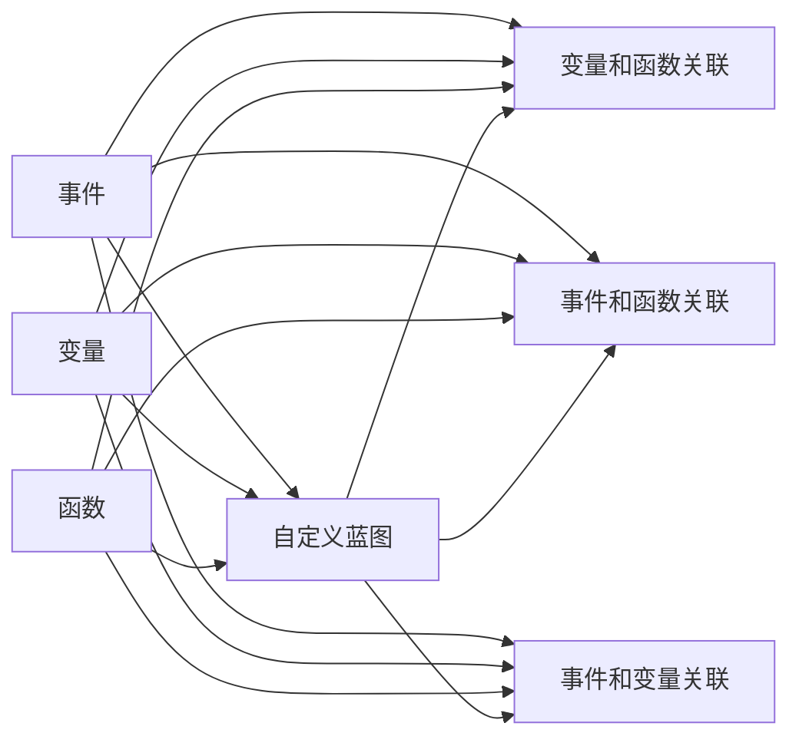

                 

# Unreal Engine蓝图系统：快速游戏原型开发

在现代游戏开发中，蓝图（Blueprint）系统是Unreal Engine中一个不可或缺的重要工具。蓝图系统以其直观、易用、高效的特点，极大地降低了游戏开发的门槛，使得初学者也能快速上手，构建出自己的游戏原型。本文将详细介绍蓝图系统的核心概念、原理及具体应用，并通过代码实例帮助读者深入理解如何利用蓝图系统快速构建游戏原型。

## 1. 背景介绍

### 1.1 问题由来
随着虚拟现实（VR）、增强现实（AR）技术的兴起，游戏开发行业竞争愈发激烈。如何在短时间内快速开发出原型，成为游戏公司成功的重要因素。传统的C++编程语言虽然强大，但开发效率较低，代码复杂度高，不适合快速迭代。

### 1.2 问题核心关键点
蓝图系统本质上是一个可视化编程系统，通过拖拽拖拽的方式创建游戏逻辑。它继承了C++的强大性能和面向对象的特性，同时具备界面化的编辑体验。使用蓝图系统，开发者可以在不编写一行代码的情况下，快速实现游戏逻辑的构建和功能的实现。

## 2. 核心概念与联系

### 2.1 核心概念概述

为更好地理解Unreal Engine蓝图系统的原理和架构，本节将介绍几个关键概念：

- **蓝图（Blueprint）**：蓝图系统提供了一套可视化编程语言，允许开发者以拖拽元素的方式构建游戏逻辑。蓝图的主要组件包括事件、变量、函数等，可以与C++代码无缝结合。

- **节点（Node）**：节点是蓝图系统中最基本的元素，代表一个独立的逻辑单元。通过拖拽和组合不同的节点，可以构建复杂的逻辑。

- **事件（Event）**：事件节点用于触发特定的逻辑。例如，点击事件、碰撞事件、时间事件等。

- **变量（Variable）**：变量节点用于存储和读取数据。可以分为本地变量、全局变量和静态变量，方便数据的读取和修改。

- **函数（Function）**：函数节点用于封装可复用的代码块，实现特定的逻辑。函数可以接受参数，返回值，具有高内聚性和可复用性。

- **自定义蓝图（Custom Blueprint）**：自定义蓝图允许开发者基于现有蓝图创建新的蓝图，并继承原有蓝图的属性和方法。

### 2.2 核心概念原理和架构的 Mermaid 流程图(Mermaid 流程节点中不要有括号、逗号等特殊字符)



该图展示了蓝图系统的核心组件及其之间的关系。事件、变量、函数通过节点进行组合，可以构建出复杂的游戏逻辑。自定义蓝图扩展了蓝图系统的功能，进一步提升了开发效率。

## 3. 核心算法原理 & 具体操作步骤

### 3.1 算法原理概述

蓝图系统本质上是一个基于面向对象的程序设计范式。开发者通过拖拽不同的节点，组合成特定的逻辑流程。每个节点代表一个独立的逻辑单元，具有独立的输入和输出。事件节点触发特定逻辑，变量节点存储和读取数据，函数节点封装可复用的代码块。

蓝图系统通过拖拽的方式进行可视化编程，支持高层次的抽象和设计。它与C++代码无缝结合，开发者可以在蓝图中定义函数和变量，并在C++代码中进行调用和修改。

### 3.2 算法步骤详解

蓝图系统的开发过程大致包括以下几个步骤：

**Step 1: 创建蓝图**

1. 打开项目浏览器，选择“游戏”类别，创建新的蓝图文件。

2. 输入蓝图名称，并选择继承的蓝图基类。

**Step 2: 添加节点**

1. 在蓝图编辑器中，开始拖拽节点。节点会自动对齐。

2. 通过拖拽和放置，组合出完整的逻辑流程。例如，点击事件、碰撞事件、变量读取等。

3. 节点可以通过双击或右键点击进行详细编辑。

**Step 3: 连接节点**

1. 将节点之间的输入和输出通过线连接。

2. 线的颜色和类型可以根据需求选择。例如，蓝色线表示变量，绿色线表示函数调用，红色线表示事件触发。

3. 确保所有连接线无误后，保存蓝图文件。

**Step 4: 编译和测试**

1. 点击蓝图的“Compiled”按钮，编译蓝图。

2. 在编辑器中，点击“Play”按钮，进行测试。

3. 测试过程中，可以观察节点的输出，进行调试和优化。

**Step 5: 导出和部署**

1. 将蓝图导出为C++代码。

2. 在C++代码中，可以调用蓝图中的函数和变量。

3. 将蓝图部署到目标设备或平台上，进行测试和优化。

### 3.3 算法优缺点

蓝图系统的主要优点包括：

1. 易于上手：无需编写代码，通过拖拽节点即可构建逻辑。

2. 高效率：快速迭代，快速构建游戏原型。

3. 可复用性：可复用现有的节点和函数，提高开发效率。

4. 可视化设计：直观的设计界面，方便开发者进行逻辑抽象。

5. 与C++无缝结合：蓝图中的函数和变量可以与C++代码无缝结合。

蓝图系统的主要缺点包括：

1. 性能问题：由于是可视化编程，蓝图节点的执行效率可能低于纯C++代码。

2. 可扩展性：有些复杂逻辑可能难以通过蓝图实现，需要结合C++代码进行优化。

3. 学习曲线：对于没有C++基础的开发者，可能需要时间熟悉蓝图系统的使用方法。

4. 代码冗余：蓝图中的重复逻辑可能会在C++代码中体现出来。

## 4. 数学模型和公式 & 详细讲解 & 举例说明

### 4.1 数学模型构建

蓝图系统的核心数学模型可以抽象为一个有向图，其中节点表示逻辑单元，线表示数据流。通过线将节点连接起来，表示数据流的传递和逻辑的组合。蓝图的执行过程可以视为对有向图的遍历，从起点节点开始，按照数据流的方向遍历整个图，直到到达终点节点。

### 4.2 公式推导过程

假设有一个简单的蓝图，包括两个事件节点A和B，一个变量节点C，以及一个函数节点D。事件A触发，读取变量C的值，并将其传递给事件B和函数D。事件B输出结果，函数D计算结果并存储到变量C中。蓝图的执行过程可以表示为：

1. A触发，读取C的值。
2. B读取A的值，并输出结果。
3. D读取A的值，计算结果，并存储到C中。

### 4.3 案例分析与讲解

以一个简单的点击事件为例，分析如何通过蓝图实现：

1. 创建蓝图文件，输入名称为“点击事件”。

2. 拖拽事件节点A，选择“BeginPlay”事件。

3. 拖拽变量节点B，输入名称为“点击次数”，类型为整型。

4. 拖拽函数节点C，输入名称为“增加点击次数”，类型为void。

5. 将A节点连接B节点的输入，B节点的输出连接C节点的输入。

6. 完成连接后，保存蓝图文件。

7. 编译并测试蓝图，观察点击事件是否正确触发，并在变量C中累加点击次数。

## 5. 项目实践：代码实例和详细解释说明

### 5.1 开发环境搭建

在Unreal Engine中，蓝图系统是与C++代码紧密结合的。因此，首先需要安装Unreal Engine开发环境，并确保已安装Visual Studio等编译工具。

### 5.2 源代码详细实现

下面以一个简单的2D游戏为例，演示如何使用蓝图系统实现“跟随鼠标移动”的逻辑：

1. 创建一个新的蓝图文件，输入名称为“跟随鼠标”。

2. 拖拽事件节点A，选择“BeginPlay”事件。

3. 拖拽变量节点B，输入名称为“鼠标位置”，类型为向量。

4. 拖拽函数节点C，输入名称为“更新位置”，类型为void。

5. 将A节点连接B节点的输入，B节点的输出连接C节点的输入。

6. 完成连接后，保存蓝图文件。

7. 在C++代码中，定义函数“UpdateMousePosition”，更新鼠标位置并传递给蓝图。

```cpp
void AYourClass::UpdateMousePosition()
{
    FVector MousePos = FVector(GetWorldToScreen(UEngine::GameViewport->GetWindow()->GetScreenSpacePosition(UEngine::GameViewport->GetLocation()));
    GetWorld()->GetFirstPlayerController()->GetPlayerViewPoint(Cast<APlayerController>(GetController()), MousePos);
}
```

### 5.3 代码解读与分析

在蓝图和C++代码中，我们可以看到如何通过事件和函数实现游戏逻辑。蓝图中的事件节点A在BeginPlay时触发，读取变量B的值，并传递给函数C。C函数在收到事件A触发时，计算鼠标位置并更新变量B。

### 5.4 运行结果展示

通过测试蓝图，可以看到在“跟随鼠标”蓝图中，移动鼠标时，被选中的对象会跟随鼠标移动。

## 6. 实际应用场景

### 6.1 快速原型开发

蓝图系统是快速原型开发的重要工具。在游戏设计初期，开发者可以通过蓝图快速搭建游戏框架，进行功能验证和调整。例如，创建角色、创建场景、实现碰撞等基本功能，均可以通过蓝图实现。

### 6.2 多人协作开发

蓝图系统支持多人协作开发，多个开发者可以在同一个蓝图中进行协作，提高开发效率。开发过程中，可以通过注释和代码片段进行交流和优化，确保代码质量。

### 6.3 功能扩展

蓝图系统可以与其他插件和工具进行集成，实现更多的功能扩展。例如，结合物理引擎，实现角色的物理碰撞和运动；结合粒子系统，实现火、爆炸等特效效果。

### 6.4 未来应用展望

未来，蓝图系统将继续在Unreal Engine中发挥重要作用，成为游戏开发者的重要工具。它将更加注重性能优化和可扩展性，结合最新的AI和VR技术，为游戏开发提供更加强大的支持。

## 7. 工具和资源推荐

### 7.1 学习资源推荐

1. Unreal Engine官方文档：提供蓝图系统的详细教程和示例，适合初学者入门。

2. Udemy《Unreal Engine蓝图编程》课程：系统介绍蓝图系统，并结合实际项目进行讲解。

3. Udacity《Unreal Engine蓝图编程》课程：通过项目实战，深入理解蓝图系统。

### 7.2 开发工具推荐

1. Unreal Engine：作为蓝图系统的开发平台，支持多平台开发和发布。

2. Visual Studio：用于蓝图代码的编译和调试。

3. TensorFlow：用于AI和机器学习任务的开发。

### 7.3 相关论文推荐

1. Unreal Engine Blueprints for Game Development：介绍蓝图系统的应用和技术细节。

2. Visual Scripting in Unreal Engine Blueprints：探讨蓝图系统在可视化编程中的应用。

3. Unreal Engine Blueprint Performance Optimization：讨论蓝图系统的性能优化策略。

## 8. 总结：未来发展趋势与挑战

### 8.1 研究成果总结

蓝图系统在Unreal Engine中发挥了重要作用，为游戏开发者提供了高效、易用的工具。通过可视化编程，开发者可以快速构建游戏原型，进行功能验证和优化。蓝图系统与C++代码无缝结合，使得开发者可以灵活使用多种编程技术，提高开发效率。

### 8.2 未来发展趋势

未来，蓝图系统将继续发展，具有以下几个趋势：

1. 支持更多的编程范式：蓝图系统将支持更多的编程范式，如面向对象、函数式编程等。

2. 增强性能优化：蓝图系统将引入更多的优化策略，提高运行效率。

3. 实现更多的功能：蓝图系统将与其他插件和工具进行深度集成，实现更多的功能。

4. 支持更多的平台：蓝图系统将支持更多的平台，如VR、AR等新兴技术。

### 8.3 面临的挑战

蓝图系统在发展过程中，仍面临以下挑战：

1. 性能问题：蓝图系统的执行效率可能低于纯C++代码。

2. 代码冗余：蓝图中的重复逻辑可能需要在C++代码中体现。

3. 学习曲线：对于没有C++基础的开发者，可能需要时间熟悉蓝图系统的使用方法。

### 8.4 研究展望

未来，蓝图系统需要在性能优化、代码重用、学习曲线等方面进行改进，进一步提升开发效率和代码质量。蓝图系统与其他编程范式和技术进行深度集成，实现更加丰富的功能和更好的用户体验。

## 9. 附录：常见问题与解答

**Q1：蓝图系统是否支持多线程编程？**

A: 蓝图系统主要支持单线程编程。如果需要多线程编程，可以在C++代码中进行处理，并通过蓝图调用。

**Q2：蓝图系统是否支持自定义插件？**

A: 蓝图系统支持自定义插件的开发。开发者可以通过插件扩展蓝图系统的功能，实现更加丰富的游戏逻辑。

**Q3：蓝图系统是否支持与其他编程语言进行集成？**

A: 蓝图系统支持与其他编程语言的集成，如C++、Python等。开发者可以在C++代码中调用蓝图中的函数，或在蓝图中调用Python脚本。

**Q4：蓝图系统是否支持自定义事件？**

A: 蓝图系统支持自定义事件，开发者可以创建自定义事件节点，实现特定的游戏逻辑。

---

作者：禅与计算机程序设计艺术 / Zen and the Art of Computer Programming

