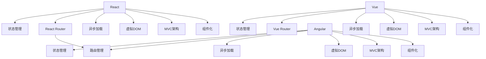

                 

# Web 前端框架选择：满足不同需求

## 1. 背景介绍

随着互联网的快速发展和Web技术的不断进步，前端框架的选择变得越来越重要。一个合适的前端框架不仅可以提高开发效率，还能保证应用性能和用户体验。然而，目前市场上前端框架种类繁多，选择一款合适的框架并不容易。本文将深入探讨前端框架的选择，帮助开发者更好地应对不同需求。

### 1.1 问题由来

当前流行的前端框架包括React、Vue和Angular等，它们各有优缺点。React以其高效和灵活著称，Vue则以简单易学和易用见长，Angular则以其强大的功能和完整的生态系统著称。开发者在选择框架时，需要考虑项目需求、团队技术栈和开发效率等因素。

## 2. 核心概念与联系

### 2.1 核心概念概述

在探讨前端框架选择时，需要先理解几个核心概念：

- **前端框架(Frontend Framework)**：一种用于指导前端开发的标准化工具，提供了一些核心组件和API，方便开发者快速构建Web应用。
- **组件化(Components)**：将Web应用拆分成多个独立的模块，每个模块独立开发和测试，提高开发效率和维护性。
- **MVC架构(MVC)**：将Web应用分为模型(Model)、视图(View)和控制器(Controller)三部分，简化开发流程，提高开发效率。
- **虚拟DOM(Virtual DOM)**：通过将实际DOM表示为JavaScript对象，减少DOM操作次数，提高Web应用性能。
- **异步加载(Async Loading)**：通过懒加载、代码分割等技术，减少应用初始加载时间，提高Web应用性能。

这些核心概念构成了前端框架的基础，不同的框架在这些概念上的实现和优化有所不同。

### 2.2 核心概念原理和架构的 Mermaid 流程图



## 3. 核心算法原理 & 具体操作步骤

### 3.1 算法原理概述

前端框架的选择主要考虑以下几个方面：

- **性能**：前端框架的性能直接影响Web应用的响应速度和加载时间。
- **易用性**：前端框架的易用性直接影响开发效率和开发体验。
- **社区支持**：前端框架的社区支持直接影响开发中的问题解决和资源获取。
- **生态系统**：前端框架的生态系统直接影响应用的扩展性和可持续性。
- **可维护性**：前端框架的可维护性直接影响应用的长期维护成本。

### 3.2 算法步骤详解

选择合适的前端框架，需要经过以下几个步骤：

1. **需求分析**：分析项目需求，明确功能、性能、交互等要求。
2. **框架对比**：根据需求，对比主流框架的特点和优缺点，选择合适的框架。
3. **技术评估**：评估团队技术栈和开发效率，确保框架符合团队需求。
4. **测试验证**：通过小规模的测试，验证框架在实际项目中的表现。
5. **优化调整**：根据测试结果，对框架进行优化和调整，确保其满足项目需求。

### 3.3 算法优缺点

#### 优点

- **提高开发效率**：主流前端框架提供了丰富的组件和API，大大减少了开发工作量。
- **提升应用性能**：虚拟DOM和异步加载等技术，显著提升了Web应用性能。
- **增强可维护性**：组件化、MVC架构等设计理念，提高了应用的可维护性和可扩展性。
- **丰富社区资源**：主流前端框架有强大的社区支持，可以快速解决问题和获取资源。

#### 缺点

- **学习曲线陡峭**：主流框架的学习曲线较陡峭，需要一定时间掌握。
- **性能优化难度大**：框架的性能优化需要深入了解框架内部机制，对开发者要求较高。
- **生态系统复杂**：不同框架的生态系统各不相同，需要仔细选择。
- **维护成本高**：框架的不断迭代和更新，增加了维护成本。

### 3.4 算法应用领域

不同前端框架适用于不同的应用场景，以下是几个常见的应用领域：

- **单页应用(SPA)**：Vue和React在单页应用中表现出色，Angular也有不错的表现。
- **企业级应用**：Angular在企业级应用中较为流行，提供丰富的功能和强大的生态系统。
- **移动端应用**：React Native和Vue Native是移动端应用开发的热门选择，提供丰富的组件和API。
- **大数据应用**：Angular和React在大数据应用中也有广泛应用，提供了良好的数据处理和可视化功能。

## 4. 数学模型和公式 & 详细讲解 & 举例说明

### 4.1 数学模型构建

前端框架的选择涉及到多个因素，可以通过构建数学模型来评估这些因素。设 $F$ 为前端框架集合，$N$ 为需求集合，$P$ 为性能指标集合，$U$ 为易用性指标集合，$C$ 为社区支持指标集合，$E$ 为生态系统指标集合，$M$ 为可维护性指标集合。则前端框架选择的数学模型为：

$$
\begin{aligned}
    \max_{F_i} & \quad \sum_{n \in N} \sum_{p \in P} w_{pn} p(F_i) + \sum_{n \in N} \sum_{u \in U} w_{un} u(F_i) \\
    & \quad + \sum_{n \in N} \sum_{c \in C} w_{cn} c(F_i) + \sum_{n \in N} \sum_{e \in E} w_{en} e(F_i) \\
    & \quad + \sum_{n \in N} \sum_{m \in M} w_{mn} m(F_i) \\
    \text{s.t.} & \quad F_i \in F \\
\end{aligned}
$$

其中，$w_{pn}$、$w_{un}$、$w_{cn}$、$w_{en}$、$w_{mn}$ 为权重系数，需要根据实际需求进行调整。

### 4.2 公式推导过程

将数学模型分解为五个子模型：

1. **性能子模型**：$P(F_i) = \sum_{p \in P} w_{pn} p(F_i)$
2. **易用性子模型**：$U(F_i) = \sum_{u \in U} w_{un} u(F_i)$
3. **社区支持子模型**：$C(F_i) = \sum_{c \in C} w_{cn} c(F_i)$
4. **生态系统子模型**：$E(F_i) = \sum_{e \in E} w_{en} e(F_i)$
5. **可维护性子模型**：$M(F_i) = \sum_{m \in M} w_{mn} m(F_i)$

性能子模型和易用性子模型的推导相对简单，可以直接通过需求和框架的性能和易用性指标计算得到。社区支持子模型和生态系统子模型需要考虑框架的社区活跃度、文档质量、工具支持等指标。可维护性子模型则需要考虑框架的可维护性、代码质量、开发工具等指标。

### 4.3 案例分析与讲解

假设我们需要选择前端框架来开发一个高性能、易用、社区活跃的企业级应用，可以按照以下步骤进行：

1. **需求分析**：性能、易用性、社区支持、生态系统和可维护性。
2. **框架对比**：React、Vue、Angular。
3. **技术评估**：团队熟悉React，需要高性能、易用性和社区支持。
4. **测试验证**：选择React进行小规模测试，验证其性能和易用性。
5. **优化调整**：根据测试结果，优化React的性能和易用性，确保其满足需求。

## 5. 项目实践：代码实例和详细解释说明

### 5.1 开发环境搭建

- **Node.js**：搭建Node.js环境，安装npm和npx。
- **WebStorm**：安装WebStorm，配置IDE环境。
- **React**：安装React和相关依赖。

### 5.2 源代码详细实现

以下是一个简单的React组件示例，用于展示React的基本用法：

```jsx
import React, { Component } from 'react';

class App extends Component {
    state = {
        count: 0
    };

    incrementCount = () => {
        this.setState({ count: this.state.count + 1 });
    };

    render() {
        return (
            <div>
                <h1>React App</h1>
                <p>Count: {this.state.count}</p>
                <button onClick={this.incrementCount}>Increment Count</button>
            </div>
        );
    }
}

export default App;
```

### 5.3 代码解读与分析

该示例展示了React组件的基本结构和生命周期方法。组件状态通过this.state来管理，更新状态使用this.setState方法。组件的渲染和更新通过render方法实现，按钮的点击事件通过onClick属性绑定事件处理函数。

## 6. 实际应用场景

### 6.1 企业级应用

在企业级应用中，React和Vue都有广泛应用。React提供了丰富的组件库和生态系统，适合开发大型应用。Vue则以其简洁的语法和易用性著称，适合中小型应用。Angular在企业级应用中也有不错的表现，提供了完整的生态系统和强大的功能。

### 6.2 移动端应用

React Native和Vue Native是移动端应用开发的热门选择。React Native提供丰富的组件和API，适合跨平台开发。Vue Native则以其易用性著称，适合快速开发和维护。

### 6.3 大数据应用

Angular在大数据应用中也有广泛应用，提供了良好的数据处理和可视化功能。React和Vue在大数据应用中也有一定应用，但需要更多的生态系统和社区支持。

### 6.4 未来应用展望

未来，前端框架将向着更加灵活、高效、易用的方向发展。新的框架和工具将不断涌现，推动前端技术的进步。开发者需要持续关注新技术的发展，不断学习和优化。

## 7. 工具和资源推荐

### 7.1 学习资源推荐

1. **《JavaScript高级程序设计》**：一本经典的JavaScript入门书籍，适合初学者学习。
2. **《React官方文档》**：React的官方文档，提供了详细的API和使用指南。
3. **《Vue官方文档》**：Vue的官方文档，提供了详细的API和使用指南。
4. **《Angular官方文档》**：Angular的官方文档，提供了详细的API和使用指南。
5. **《前端框架比较与选择》**：一篇详细的前端框架比较文章，介绍了React、Vue和Angular的特点和优缺点。

### 7.2 开发工具推荐

1. **WebStorm**：一款强大的IDE，适合前端开发。
2. **Visual Studio Code**：一款轻量级的代码编辑器，支持多种编程语言和框架。
3. **React Developer Tools**：React的开发工具，帮助开发者调试和优化React应用。
4. **Vue Devtools**：Vue的开发工具，帮助开发者调试和优化Vue应用。
5. **Angular CLI**：Angular的命令行工具，方便开发和构建Angular应用。

### 7.3 相关论文推荐

1. **《Web前端框架的选择与优化》**：论文介绍了前端框架的选择和优化方法，适合开发者参考。
2. **《React性能优化与实践》**：论文介绍了React性能优化的方法和案例，适合开发者学习。
3. **《Vue架构设计与实践》**：论文介绍了Vue的架构设计和实践方法，适合开发者学习。
4. **《Angular性能优化与实践》**：论文介绍了Angular性能优化的方法和案例，适合开发者学习。

## 8. 总结：未来发展趋势与挑战

### 8.1 研究成果总结

本文深入探讨了前端框架的选择，帮助开发者更好地应对不同需求。选择合适的前端框架，可以提高开发效率，保证应用性能和用户体验。

### 8.2 未来发展趋势

1. **组件化**：组件化技术将继续发展，提高开发效率和代码可维护性。
2. **MVC架构**：MVC架构将继续优化，提升应用的可扩展性和可维护性。
3. **虚拟DOM**：虚拟DOM技术将继续优化，提升Web应用性能。
4. **异步加载**：异步加载技术将继续优化，提升Web应用性能。
5. **社区支持**：社区支持将继续增强，帮助开发者快速解决问题和获取资源。
6. **生态系统**：生态系统将继续完善，提供丰富的工具和插件。

### 8.3 面临的挑战

1. **学习曲线陡峭**：主流前端框架的学习曲线较陡峭，需要一定时间掌握。
2. **性能优化难度大**：框架的性能优化需要深入了解框架内部机制，对开发者要求较高。
3. **生态系统复杂**：不同框架的生态系统各不相同，需要仔细选择。
4. **维护成本高**：框架的不断迭代和更新，增加了维护成本。

### 8.4 研究展望

1. **组件化技术**：进一步发展组件化技术，提高开发效率和代码可维护性。
2. **MVC架构优化**：优化MVC架构，提升应用的可扩展性和可维护性。
3. **虚拟DOM优化**：优化虚拟DOM技术，提升Web应用性能。
4. **异步加载优化**：优化异步加载技术，提升Web应用性能。
5. **社区支持加强**：加强社区支持，帮助开发者快速解决问题和获取资源。
6. **生态系统完善**：完善生态系统，提供丰富的工具和插件。

## 9. 附录：常见问题与解答

**Q1：如何选择前端框架？**

A: 选择前端框架需要根据项目需求、团队技术栈和开发效率等因素进行综合评估。主要考虑性能、易用性、社区支持、生态系统和可维护性等指标。

**Q2：React和Vue的区别是什么？**

A: React和Vue都是现代前端框架，但两者在理念和实现上有一定区别。React强调组件化开发，通过虚拟DOM提升性能。Vue则强调易用性，提供双向数据绑定和声明式编程。

**Q3：Angular和React的优缺点是什么？**

A: Angular在企业级应用中表现出色，提供丰富的功能和强大的生态系统。React则以其高效和灵活著称，适合中小型应用。

**Q4：如何选择前端框架进行移动端应用开发？**

A: 选择前端框架进行移动端应用开发，需要考虑框架的跨平台支持和移动端性能。React Native和Vue Native是移动端应用开发的热门选择，提供丰富的组件和API。

**Q5：如何选择前端框架进行大数据应用开发？**

A: 选择前端框架进行大数据应用开发，需要考虑框架的数据处理和可视化功能。Angular在大数据应用中也有广泛应用，提供了良好的数据处理和可视化功能。

---

作者：禅与计算机程序设计艺术 / Zen and the Art of Computer Programming

