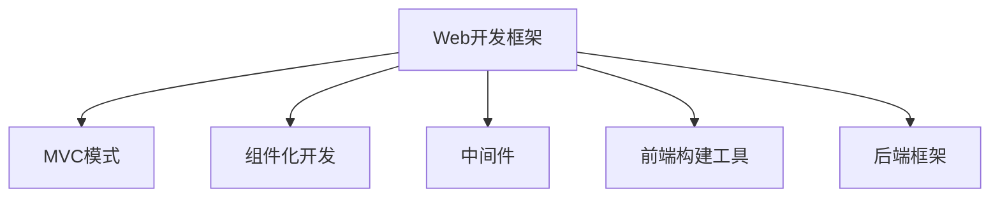
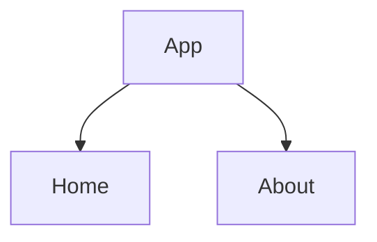

                 

# Web 开发框架：提升网站开发效率

> 关键词：Web开发框架, 前端开发, 后端开发, 性能优化, 跨平台开发

## 1. 背景介绍

### 1.1 问题由来
随着互联网的飞速发展，网站开发需求日益多样化，开发效率和质量要求越来越高。传统的网站开发需要前端和后端开发团队各自独立开发，容易产生沟通障碍，开发周期长、成本高。Web开发框架的诞生，极大提升了网站开发的效率和质量，成为现代网站开发的主流范式。

### 1.2 问题核心关键点
Web开发框架的核心在于通过封装和抽象，简化开发流程，提升开发效率。其主要功能包括：

1. 组件库：提供预定义的UI组件，帮助开发者快速构建页面。
2. 数据流管理：通过状态管理工具（如Redux、Vue Router）管理组件状态和路由。
3. 请求处理：封装HTTP请求，简化API调用。
4. 错误处理：通过中间件（如Express、Flask）捕获和处理异常。
5. 性能优化：提供缓存、懒加载、异步加载等技术，提升页面加载速度。
6. 安全性：提供跨站脚本(XSS)防护、跨站请求伪造(CSRF)防护、Cookie安全等保障。

Web开发框架通过这些功能，使得开发者能够快速构建高质量、高效率的网站，适应各种开发需求。

### 1.3 问题研究意义
研究Web开发框架，对于提高网站开发效率、降低开发成本、提升网站质量具有重要意义：

1. 降低开发复杂度：通过封装抽象，简化开发流程，减少代码量和维护成本。
2. 提升开发速度：提供丰富的组件和工具，减少重复劳动，提高开发效率。
3. 增强开发适应性：适应各种平台和需求，便于跨平台开发和迭代更新。
4. 强化开发质量：提供性能优化和安全性保障，提升网站用户体验和安全性。
5. 促进团队协作：框架提供了统一的标准和工具，便于团队成员之间的协作和沟通。

综上所述，Web开发框架是现代网站开发不可或缺的工具，是提升网站开发效率的重要手段。

## 2. 核心概念与联系

### 2.1 核心概念概述

为更好地理解Web开发框架的原理和应用，本节将介绍几个关键概念及其之间的关系：

- Web开发框架（Web Development Frameworks）：通过封装和抽象，简化开发流程，提升开发效率的工具。常用的Web开发框架包括React、Angular、Vue等。
- MVC模式（Model-View-Controller）：一种软件架构模式，用于分离数据模型、用户界面和控制器，便于代码组织和管理。
- 组件化开发（Component-Based Development）：将页面拆分为独立的UI组件，便于重用和维护。
- 中间件（Middleware）：在请求处理链中插入的代码片段，用于拦截、处理请求和响应。
- 前端构建工具（Front-end Build Tools）：如Webpack、Gulp等，用于自动化打包、压缩和优化前端资源。
- 后端框架（Back-end Frameworks）：如Django、Flask等，提供API路由、请求处理和数据库管理等功能。

这些概念之间的逻辑关系可以通过以下Mermaid流程图来展示：



这个流程图展示了我们Web开发框架的核心概念及其之间的关系：

1. Web开发框架封装了MVC模式、组件化开发、中间件、前端构建工具和后端框架等多个组件和工具，简化开发流程。
2. MVC模式和组件化开发是Web开发框架的重要组成，提供数据模型和UI组件，便于代码组织和管理。
3. 中间件和前端构建工具用于请求处理和资源优化，后端框架提供API路由和数据库管理等功能，共同构成Web开发框架的基础设施。

## 3. 核心算法原理 & 具体操作步骤
### 3.1 算法原理概述

Web开发框架的核心算法原理在于封装和抽象，通过预定义的工具和组件，简化开发流程，提升开发效率。其主要工作流程包括：

1. 框架初始化：通过配置文件（如Express的app.js）加载框架实例。
2. 路由配置：将URL和处理函数进行绑定，创建路由表。
3. 请求处理：根据请求URL查找对应的路由，执行处理函数。
4. 组件渲染：根据处理函数返回的数据和组件，渲染UI页面。
5. 数据流管理：通过状态管理工具（如Redux）管理组件状态。
6. 前端构建：使用前端构建工具（如Webpack）打包、压缩和优化资源。

以上流程构成Web开发框架的基本工作原理。框架通过预定义的工具和组件，封装了这些步骤，使得开发者能够快速构建高质量、高效率的网站。

### 3.2 算法步骤详解

以React框架为例，下面详细介绍其核心步骤：

**Step 1: 框架初始化**

React框架通过创建React实例，并加载组件树，初始化框架环境。

```javascript
import React from 'react';
import ReactDOM from 'react-dom';

ReactDOM.render(
  <React.StrictMode>
    <App />
  </React.StrictMode>,
  document.getElementById('root')
);
```

**Step 2: 路由配置**

React Router提供路由配置工具，将URL和处理函数进行绑定，创建路由表。

```javascript
import { BrowserRouter as Router, Switch, Route, Link } from 'react-router-dom';
import Home from './components/Home';
import About from './components/About';

const App = () => (
  <Router>
    <div>
      <nav>
        <ul>
          <li><Link to="/">Home</Link></li>
          <li><Link to="/about">About</Link></li>
        </ul>
      </nav>
      <Switch>
        <Route path="/" exact component={Home} />
        <Route path="/about" component={About} />
      </Switch>
    </div>
  </Router>
);
```

**Step 3: 请求处理**

React框架通过组件渲染和数据流管理处理请求，渲染UI页面。

```javascript
import React, { useState } from 'react';
import { useFetch } from './hooks';

const Home = () => {
  const { data } = useFetch('https://api.example.com/data');
  return <div>{data}</div>;
};

export default Home;
```

**Step 4: 组件渲染**

React框架通过组件树渲染UI页面，实现组件化和数据绑定。

```javascript
import React, { useState } from 'react';

const App = () => {
  const [count, setCount] = useState(0);
  return (
    <div>
      <h1>Hello, World!</h1>
      <p>You clicked {count} times.</p>
      <button onClick={() => setCount(count + 1)}>
        Click me
      </button>
    </div>
  );
};

export default App;
```

**Step 5: 数据流管理**

React框架通过状态管理工具（如Redux）管理组件状态，便于组件之间的数据传递和同步。

```javascript
import { createStore } from 'redux';
import { Provider } from 'react-redux';

const initialState = { count: 0 };
const reducer = (state = initialState, action) => {
  switch (action.type) {
    case 'INCREMENT':
      return { ...state, count: state.count + 1 };
    case 'DECREMENT':
      return { ...state, count: state.count - 1 };
    default:
      return state;
  }
};

const store = createStore(reducer);
const App = ({ count, increment, decrement }) => (
  <div>
    <h1>Hello, World!</h1>
    <p>You clicked {count} times.</p>
    <button onClick={increment}>+</button>
    <button onClick={decrement}>-</button>
  </div>
);

const mapStateToProps = state => ({
  count: state.count,
  increment: () => store.dispatch({ type: 'INCREMENT' }),
  decrement: () => store.dispatch({ type: 'DECREMENT' })
});

export default connect(mapStateToProps)(App);
```

### 3.3 算法优缺点

Web开发框架的优点包括：

1. 提升开发效率：框架封装和抽象了重复的开发任务，减少了代码量和维护成本。
2. 提高开发质量：框架提供了性能优化和安全性保障，提升了网站的用户体验和安全性。
3. 促进团队协作：框架提供了统一的标准和工具，便于团队成员之间的协作和沟通。

然而，Web开发框架也存在一些缺点：

1. 学习曲线较陡：框架提供了大量的功能和工具，需要开发者具备一定的编程基础和学习能力。
2. 灵活性不足：框架封装了大量的细节，开发者无法自由定制和扩展框架功能。
3. 性能损耗：框架的抽象和封装可能带来一些性能开销，需要开发者进行优化。

综上所述，Web开发框架通过封装和抽象，极大地提升了网站开发的效率和质量，但同时也存在一些局限性，需要开发者在实际开发中灵活运用。

### 3.4 算法应用领域

Web开发框架在Web开发中得到了广泛应用，覆盖了几乎所有常见的Web应用场景，例如：

- 电商网站：通过React框架构建交互性强的电商页面，提升用户体验。
- 内容管理系统（CMS）：如WordPress使用Vue框架管理页面和用户数据。
- 社交网络：如Facebook使用React和Node.js构建后端服务。
- 在线教育：如Coursera使用Angular框架构建课程页面。
- 企业应用：如Salesforce使用Django框架管理后台系统。

除了上述这些经典应用外，Web开发框架还被创新性地应用到更多场景中，如渐进式Web应用（PWA）、单页面应用（SPA）、桌面应用（如Electron）等，为Web技术带来了全新的突破。

## 4. 数学模型和公式 & 详细讲解  
### 4.1 数学模型构建

在Web开发框架中，常见数学模型包括：

- 组件树模型：将页面拆分为独立的UI组件，通过递归关系表示组件之间的父子关系。
- 路由模型：将URL和处理函数进行绑定，构建路由表。
- 状态模型：通过状态管理工具（如Redux）管理组件状态，保证状态一致性。

以下是一个简单的React组件树模型：



以上图表展示了React组件树模型，通过组件树结构表示页面的层级关系，便于组件之间的通信和数据传递。

### 4.2 公式推导过程

以React组件树模型为例，推导其数学表达：

设页面由$n$个组件组成，组件之间的关系用有向图表示，每个组件表示为一个节点，有向边表示父子关系。则组件树模型的数学表达式为：

$$
G = (V, E)
$$

其中，$V=\{C_1, C_2, ..., C_n\}$ 为组件集合，$E=\{(C_i, C_j)|C_i \rightarrow C_j\}$ 为边集合，表示父子关系。

组件树模型可以用递归算法求解，例如：

```javascript
function getComponentChildren(component) {
  const children = [];
  if (component.props.children) {
    component.props.children.forEach(child => {
      const newChildren = getComponentChildren(child);
      children.push(newChildren);
    });
  }
  return children;
}
```

通过递归算法，可以遍历整个组件树，获取所有子组件。

### 4.3 案例分析与讲解

以Redux状态管理工具为例，介绍其核心原理和用法：

Redux使用单向数据流模型管理组件状态，通过Action和Reducer描述状态的演变。

**Action**：描述状态的改变，通常由事件触发。

**Reducer**：根据Action描述状态的演变，返回新的状态。

以下是一个简单的Redux状态管理工具的使用示例：

```javascript
import { createStore } from 'redux';
import { Provider } from 'react-redux';

const initialState = { count: 0 };
const reducer = (state = initialState, action) => {
  switch (action.type) {
    case 'INCREMENT':
      return { ...state, count: state.count + 1 };
    case 'DECREMENT':
      return { ...state, count: state.count - 1 };
    default:
      return state;
  }
};

const store = createStore(reducer);
const mapStateToProps = state => ({
  count: state.count,
  increment: () => store.dispatch({ type: 'INCREMENT' }),
  decrement: () => store.dispatch({ type: 'DECREMENT' })
});

const App = ({ count, increment, decrement }) => (
  <div>
    <h1>Hello, World!</h1>
    <p>You clicked {count} times.</p>
    <button onClick={increment}>+</button>
    <button onClick={decrement}>-</button>
  </div>
);

export default connect(mapStateToProps)(App);
```

在Redux中，Action描述状态的改变，Reducer根据Action计算新的状态。通过Provider和connect函数，将Redux与React组件进行绑定，实现组件状态的管理和更新。

## 5. 项目实践：代码实例和详细解释说明
### 5.1 开发环境搭建

在进行Web开发框架项目实践前，我们需要准备好开发环境。以下是使用Node.js和React框架开发的项目环境配置流程：

1. 安装Node.js：从官网下载安装Node.js，并配置环境变量。
2. 安装React和React Router：通过npm安装React和React Router库。
3. 创建新项目：使用create-react-app创建新项目。
4. 编写代码：编写React组件和路由配置。
5. 运行项目：使用npm start命令启动项目，在本地浏览器访问。

完成上述步骤后，即可在本地环境中运行React项目。

### 5.2 源代码详细实现

这里我们以Redux状态管理工具为例，给出使用React和Redux进行状态管理的完整代码实现。

首先，定义Redux store：

```javascript
import { createStore } from 'redux';

const initialState = { count: 0 };
const reducer = (state = initialState, action) => {
  switch (action.type) {
    case 'INCREMENT':
      return { ...state, count: state.count + 1 };
    case 'DECREMENT':
      return { ...state, count: state.count - 1 };
    default:
      return state;
  }
};

const store = createStore(reducer);
```

然后，定义React组件：

```javascript
import React, { useState } from 'react';
import { connect } from 'react-redux';

const mapStateToProps = state => ({
  count: state.count,
  increment: () => store.dispatch({ type: 'INCREMENT' }),
  decrement: () => store.dispatch({ type: 'DECREMENT' })
});

const App = ({ count, increment, decrement }) => (
  <div>
    <h1>Hello, World!</h1>
    <p>You clicked {count} times.</p>
    <button onClick={increment}>+</button>
    <button onClick={decrement}>-</button>
  </div>
);

export default connect(mapStateToProps)(App);
```

最后，启动项目并测试：

```bash
npm start
```

在浏览器中访问http://localhost:3000，即可看到一个简单的计数器应用，可以通过点击按钮增加或减少计数。

### 5.3 代码解读与分析

下面我们对关键代码的实现细节进行详细解读：

**Redux store**：

- `createStore`函数创建Redux store实例，接收Reducer函数作为参数。
- `initialState`初始化状态为0。
- `reducer`函数根据Action计算新的状态，返回新的状态对象。
- `store`通过`createStore`函数初始化store实例，保存Reducer函数。

**React组件**：

- `mapStateToProps`函数将Redux状态映射到React组件的属性中，提供`count`、`increment`和`decrement`函数。
- `App`组件通过`connect`函数将React组件与Redux store连接，实现状态的更新。
- `connect`函数接收`mapStateToProps`函数，返回一个连接后的React组件。

**状态管理**：

- `count`表示当前的计数器数值。
- `increment`函数调用`dispatch`函数，发送Action对象`{ type: 'INCREMENT' }`，更新状态为`count + 1`。
- `decrement`函数调用`dispatch`函数，发送Action对象`{ type: 'DECREMENT' }`，更新状态为`count - 1`。

**测试**：

- 在浏览器中访问http://localhost:3000，看到一个简单的计数器应用。
- 通过点击“+”和“-”按钮，计数器数值发生增减。

## 6. 实际应用场景

### 6.1 电商平台

在电商平台上，Web开发框架可以用于构建交互性强的页面，提升用户体验。例如，React框架可以帮助开发者实现动态展示商品信息、生成订单等复杂功能，提升电商平台的交互性和用户体验。

### 6.2 内容管理系统

内容管理系统（CMS）需要高效管理大量内容和用户数据。通过使用React框架构建前端页面，开发者可以快速实现单页面应用（SPA），提升内容管理和用户交互的效率和质量。例如，WordPress使用Vue框架管理页面和用户数据，提升了系统的响应速度和稳定性。

### 6.3 社交网络

社交网络需要处理大量的用户交互和数据更新。通过使用React和Node.js构建后端服务，前端页面可以实时更新数据，提升用户体验。例如，Facebook使用React和Node.js构建后端服务，实现了快速渲染页面和实时数据更新。

### 6.4 在线教育

在线教育需要高效管理课程和用户数据。通过使用Angular框架构建前端页面，开发者可以快速实现复杂的交互功能，提升在线教育的体验和效果。例如，Coursera使用Angular框架构建课程页面，实现了动态展示课程内容和实时数据更新。

### 6.5 企业应用

企业应用需要高效管理业务数据和管理后台。通过使用Django框架构建后端服务，前端页面可以实时更新数据，提升业务管理和运营的效率和质量。例如，Salesforce使用Django框架管理后台系统，实现了高效的数据管理和实时监控。

## 7. 工具和资源推荐
### 7.1 学习资源推荐

为了帮助开发者系统掌握Web开发框架的理论基础和实践技巧，这里推荐一些优质的学习资源：

1. React官方文档：React官方提供的详细文档，涵盖从基础到高级的各个方面，是入门React的必备资源。
2. Vue官方文档：Vue官方提供的详细文档，涵盖从基础到高级的各个方面，是入门Vue的必备资源。
3. Angular官方文档：Angular官方提供的详细文档，涵盖从基础到高级的各个方面，是入门Angular的必备资源。
4. Webpack官方文档：Webpack官方提供的详细文档，涵盖从基础到高级的各个方面，是理解前端构建工具的必备资源。
5. Redux官方文档：Redux官方提供的详细文档，涵盖从基础到高级的各个方面，是理解状态管理工具的必备资源。
6. React Router官方文档：React Router官方提供的详细文档，涵盖从基础到高级的各个方面，是理解路由管理的必备资源。

通过对这些资源的学习实践，相信你一定能够快速掌握Web开发框架的精髓，并用于解决实际的Web开发问题。

### 7.2 开发工具推荐

高效的开发离不开优秀的工具支持。以下是几款用于Web开发框架开发的常用工具：

1. VS Code：微软推出的免费开源编辑器，支持多语言开发，提供了丰富的插件和扩展，是Web开发的主流选择。
2. Git：版本控制系统，方便团队协作和代码管理。
3. npm/yarn：Node.js的包管理工具，支持高效的安装、发布和管理依赖包。
4. Postman：API测试工具，方便调试和测试API接口。
5. Cypress：端到端的测试框架，可以自动化测试Web应用的功能和性能。

合理利用这些工具，可以显著提升Web开发框架项目的开发效率，加快创新迭代的步伐。

### 7.3 相关论文推荐

Web开发框架的演进和发展离不开学界的持续研究。以下是几篇奠基性的相关论文，推荐阅读：

1. "React: A JavaScript Library for Building User Interfaces"：React框架的官方论文，详细介绍了React的核心原理和用法。
2. "Vue: The Progressive Framework"：Vue框架的官方论文，详细介绍了Vue的核心原理和用法。
3. "Angular: The Definitive Guide"：Angular框架的官方指南，详细介绍了Angular的核心原理和用法。
4. "Webpack: Configuration, Usage, and Plugins"：Webpack官方文档，详细介绍了Webpack的核心原理和用法。
5. "Redux Toolkit: The Toolset for Redux"：Redux Toolkit官方文档，详细介绍了Redux Toolkit的核心原理和用法。
6. "React Router: The Routing Library for JavaScript"：React Router官方文档，详细介绍了React Router的核心原理和用法。

这些论文代表了大框架演进的发展脉络，通过学习这些前沿成果，可以帮助研究者把握学科前进方向，激发更多的创新灵感。

## 8. 总结：未来发展趋势与挑战

### 8.1 总结

本文对Web开发框架的原理和应用进行了全面系统的介绍。首先阐述了Web开发框架的研究背景和意义，明确了框架在提升开发效率、质量等方面的独特价值。其次，从原理到实践，详细讲解了框架的核心算法和具体操作步骤，给出了框架开发的具体代码实现。同时，本文还广泛探讨了框架在电商、内容管理、社交网络、在线教育、企业应用等多个领域的应用前景，展示了框架范式的巨大潜力。此外，本文精选了框架的学习资源，力求为读者提供全方位的技术指引。

通过本文的系统梳理，可以看到，Web开发框架通过封装和抽象，极大提升了Web开发的效率和质量，成为现代Web开发的主流范式。框架封装了大量的功能和工具，使得开发者能够快速构建高质量、高效率的网站，适应各种开发需求。未来，伴随Web开发技术的不断发展，框架将在更多领域得到应用，为Web技术带来新的突破。

### 8.2 未来发展趋势

展望未来，Web开发框架将呈现以下几个发展趋势：

1. 组件化和数据流管理：组件化开发和数据流管理是框架的核心功能，未来将进一步提升开发效率和质量。新的组件库和状态管理工具将不断涌现，满足更复杂的应用需求。

2. 响应式和异步开发：框架将引入更多响应式和异步开发技术，提升用户体验和页面加载速度。例如，React引入Fiber引擎提升性能，Angular引入变化检测机制提升响应速度。

3. 跨平台开发：框架将支持更多的平台和设备，提升跨平台开发的效率和质量。例如，React Native和Flutter等跨平台框架将进一步发展，支持更多的移动平台。

4. 深度集成和生态建设：框架将与更多的生态工具和平台深度集成，提升开发和部署的便捷性和可维护性。例如，Webpack与云部署工具深度集成，提供一键部署功能。

5. 多模态开发：框架将支持更多的数据类型和开发模式，提升多模态应用的开发效率。例如，React与TensorFlow深度集成，支持实时数据处理和AI应用。

6. 开发工具和社区支持：框架的开发工具和社区支持将进一步完善，提升开发效率和质量。例如，VS Code等编辑器将与框架深度集成，提供更便捷的开发体验。

以上趋势凸显了Web开发框架的广阔前景。这些方向的探索发展，必将进一步提升Web开发的效率和质量，为Web技术带来新的突破。

### 8.3 面临的挑战

尽管Web开发框架已经取得了瞩目成就，但在迈向更加智能化、普适化应用的过程中，它仍面临诸多挑战：

1. 学习曲线较陡：框架提供了大量的功能和工具，需要开发者具备一定的编程基础和学习能力。新手入门难度较大，需要更多的培训和文档支持。

2. 框架更新频繁：框架的快速迭代和更新，可能导致开发者需要不断学习和适应新的API和工具。如何保持框架和技术的同步更新，是开发团队的挑战之一。

3. 性能瓶颈：框架的抽象和封装可能带来一些性能开销，需要开发者进行优化。例如，React的虚拟DOM性能问题需要进一步优化。

4. 生态碎片化：框架的生态系统可能存在碎片化问题，不同框架之间的兼容性和互通性不足。如何构建统一的标准和生态，是开发团队的挑战之一。

5. 安全漏洞：框架的漏洞和安全问题需要持续关注和修复。例如，React的XSS漏洞需要持续关注和修复。

6. 可维护性：框架的复杂性和代码量可能带来可维护性的问题。如何提升代码的可读性和可维护性，是开发团队的挑战之一。

综上所述，Web开发框架虽然带来了巨大的开发效率和质量提升，但在实际应用中仍面临诸多挑战。开发团队需要不断优化和改进框架的性能和生态，提升开发体验和质量。

### 8.4 研究展望

面对框架面临的挑战，未来的研究需要在以下几个方面寻求新的突破：

1. 组件化和数据流管理：开发更多组件库和状态管理工具，提升开发效率和质量。例如，开发新的UI组件库和状态管理库，满足更复杂的应用需求。

2. 响应式和异步开发：引入更多响应式和异步开发技术，提升用户体验和页面加载速度。例如，引入Fiber引擎提升React性能，引入异步数据处理技术提升Angular性能。

3. 跨平台开发：支持更多的平台和设备，提升跨平台开发的效率和质量。例如，支持更多的移动平台和Web平台，提升开发效率和用户体验。

4. 深度集成和生态建设：与更多的生态工具和平台深度集成，提升开发和部署的便捷性和可维护性。例如，与云部署工具深度集成，提供一键部署功能。

5. 多模态开发：支持更多的数据类型和开发模式，提升多模态应用的开发效率。例如，与TensorFlow深度集成，支持实时数据处理和AI应用。

6. 开发工具和社区支持：开发工具和社区支持的完善，提升开发效率和质量。例如，开发更多的开发工具和社区支持，提升开发体验和质量。

这些研究方向的探索，必将引领Web开发框架技术的演进和应用，推动Web技术的持续发展。通过不断优化和改进框架的性能和生态，提升开发体验和质量，Web开发框架必将在未来继续引领Web技术的发展，为Web技术带来新的突破。

## 9. 附录：常见问题与解答

**Q1：Web开发框架是否适用于所有Web应用场景？**

A: Web开发框架在大多数Web应用场景上都能取得不错的效果，特别是对于数据量较小、交互性较强的应用。但对于一些特定领域的应用，如实时通信、高并发系统等，框架可能存在性能瓶颈，需要进一步优化和改进。

**Q2：Web开发框架的学习曲线较陡，如何入门？**

A: 学习Web开发框架需要具备一定的编程基础和学习能力。可以通过以下步骤进行入门：
1. 学习基础编程语言，如JavaScript、Python等。
2. 阅读官方文档，了解框架的核心功能和使用方法。
3. 参与开源项目，实践代码编写和项目构建。
4. 参与社区讨论，获取技术支持和交流经验。
5. 多练习、多实践，提升编程能力和项目经验。

**Q3：Web开发框架的性能瓶颈如何优化？**

A: Web开发框架的性能瓶颈主要来自于组件渲染、状态管理和数据流等方面。可以通过以下方法进行优化：
1. 组件渲染优化：使用懒加载、异步加载等技术，提升页面加载速度。
2. 状态管理优化：使用状态管理工具（如Redux Toolkit）提升状态管理的效率和可维护性。
3. 数据流优化：优化数据流的处理和计算，减少计算量和内存占用。
4. 前端构建优化：使用前端构建工具（如Webpack）优化资源压缩和缓存，提升性能。

**Q4：Web开发框架的生态系统如何构建？**

A: 构建Web开发框架的生态系统需要多方协作和支持。可以通过以下方法进行构建：
1. 开发丰富的组件库和工具库，满足更多应用需求。
2. 支持开源社区，促进社区交流和技术分享。
3. 提供官方文档和培训资源，提升开发者技能和经验。
4. 支持企业合作，提供商业支持和商业化解决方案。
5. 持续更新和维护，保持框架和技术的先进性和竞争力。

这些方法将有助于构建一个健康、活跃的Web开发框架生态系统，提升开发效率和质量。

**Q5：Web开发框架的安全性如何保障？**

A: Web开发框架的安全性需要从多个方面进行保障：
1. 框架设计安全：设计安全的API接口和数据处理机制，防止XSS、SQL注入等安全漏洞。
2. 安全工具支持：使用安全工具（如Helmet）对框架进行安全加固，防止常见安全攻击。
3. 安全最佳实践：遵循安全最佳实践，进行代码审计和漏洞扫描，及时修复安全漏洞。
4. 开发者教育：提高开发者的安全意识和技能，定期进行安全培训和演习。
5. 社区支持：构建安全社区，共享安全经验和解决方案，提升整体安全性。

这些措施将有助于保障Web开发框架的安全性，提升应用的安全性和可靠性。

---

作者：禅与计算机程序设计艺术 / Zen and the Art of Computer Programming

