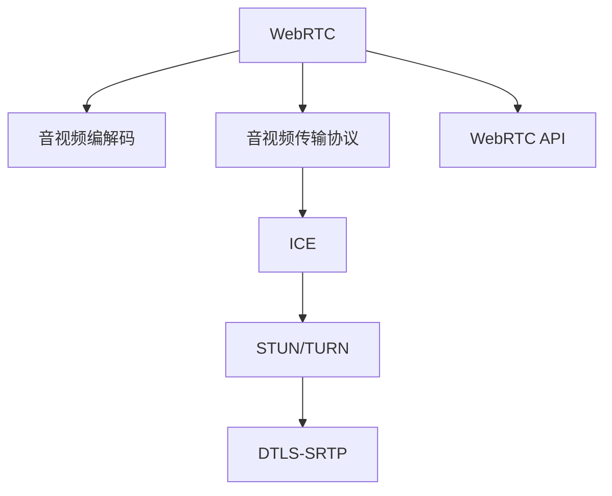

                 

# WebRTC 实时通信：在浏览器中实现

> 关键词：WebRTC, 实时通信, 浏览器, 音视频, 数据传输, STUN/TURN, 安全, 跨网段通信

## 1. 背景介绍

### 1.1 问题由来
随着互联网的迅猛发展，实时通信（Real-Time Communications, 简称RTC）在网络应用中变得越来越普遍。无论是即时聊天、视频会议、在线教育、远程医疗，还是远程办公，RTC技术都发挥着至关重要的作用。然而，传统RTC技术往往需要部署专用的服务器，成本高昂且限制较多。

为了满足人们对于自由、便捷的实时通信需求，WebRTC（Web Real-Time Communications）应运而生。WebRTC是一个由IETF（互联网工程任务组）标准化的Web API，支持浏览器之间直接进行音视频和数据传输。它允许Web应用开发者利用现有的浏览器功能，无需第三方服务器即可实现点对点的音视频通信，大大降低了实时通信的部署和运营成本。

### 1.2 问题核心关键点
WebRTC的核心优势在于，它通过浏览器自身提供的编解码、网络优化、音视频传输等能力，支持在浏览器中实现高质量的音视频通话和数据传输。然而，由于WebRTC涉及音频、视频、数据等多种传输机制，且在不同浏览器、操作系统和网络环境下表现各异，因此在实际开发和应用过程中仍存在诸多挑战。

为有效应对这些挑战，本文将详细介绍WebRTC的原理和实现方式，并通过实际代码实例，帮助开发者更好地理解和应用WebRTC技术。

## 2. 核心概念与联系

### 2.1 核心概念概述

为更好地理解WebRTC技术，本节将介绍几个密切相关的核心概念：

- **WebRTC**：由IETF标准化的Web API，支持浏览器之间直接进行音视频和数据传输，无需第三方服务器。
- **音视频编解码**：通过编码器将原始音视频信号转换为数字信号，通过解码器将其还原为原始信号的过程。常见的编解码标准包括H.264、VP8、VP9等。
- **音视频传输协议**：用于在网络上传输音视频数据的协议，如RTP（Real-Time Transport Protocol）、RTCP（Real-Time Transport Control Protocol）等。
- **ICE（Interactive Connectivity Establishment）**：WebRTC使用的网络协议，用于在 NAT 和防火墙后面获取通信双方的 IP 地址和端口号，实现跨网段通信。
- **STUN（Session Traversal Utilities for NAT）/ TURN（Traversal Using Relay NAT）**：两种常用的ICE协议，用于解决NAT和防火墙带来的网络穿透问题。
- **DTLS-SRTP**：WebRTC使用的安全传输协议，确保音视频数据的加密和完整性。
- **WebRTC API**：提供了一系列的Web API，包括媒体流处理、传输通道、数据通道、信令处理等，便于开发者利用现有浏览器功能进行音视频通信。

这些核心概念之间的逻辑关系可以通过以下Mermaid流程图来展示：



这个流程图展示了大语言模型的核心概念及其之间的关系：

1. WebRTC通过浏览器自身提供的音视频编解码、传输协议等能力，实现音视频和数据传输。
2. ICE协议和STUN/TURN协议用于解决NAT和防火墙带来的网络穿透问题。
3. DTLS-SRTP协议用于确保音视频数据的加密和完整性。
4. WebRTC API提供了丰富的API接口，方便开发者利用现有浏览器功能进行音视频通信。

这些概念共同构成了WebRTC的实现框架，使其能够在各种场景下实现高质量的音视频通信。

## 3. 核心算法原理 & 具体操作步骤
### 3.1 算法原理概述

WebRTC的实现过程主要包括以下几个关键步骤：

1. **媒体流采集与处理**：浏览器从用户的摄像头和麦克风采集音视频数据，并通过编解码器将其转换为数字信号。
2. **建立数据通道**：使用WebRTC API，建立数据通道，实现点对点的数据传输。
3. **音视频传输**：使用RTP协议，在数据通道上传输音视频数据。
4. **网络优化**：通过ICE协议和STUN/TURN协议，解决跨网段通信问题。
5. **数据传输**：使用数据通道，实现点对点的数据传输。
6. **信令处理**：处理双方协商的信令消息，确保音视频和数据传输的正常进行。

### 3.2 算法步骤详解

以下是WebRTC的详细实现步骤：

**Step 1: 媒体流采集与处理**

1. 通过WebRTC API获取用户的摄像头和麦克风。
2. 使用编解码器将原始音视频数据转换为数字信号。
3. 将数字信号分为音频和视频流，分别进行编码。

```javascript
// 获取摄像头和麦克风
navigator.mediaDevices.getUserMedia({video: true, audio: true}).then(function(stream) {
  // 创建编码器
  var videoEncoder = new MediaStreamEncoder();
  var audioEncoder = new MediaStreamEncoder();
  // 将音频流编码为 MP3 格式，将视频流编码为 H.264 格式
  videoEncoder.encodeToMp4Stream(stream.getVideoTracks()[0], "video.mp4");
  audioEncoder.encodeToWavStream(stream.getAudioTracks()[0], "audio.wav");
});
```

**Step 2: 建立数据通道**

1. 通过WebRTC API，创建数据通道。
2. 向对方发送 Offer 消息，并接收 ICE 协议处理后的候选地址和端口号。
3. 根据收到的 ICE 消息，更新本地连接参数。

```javascript
// 创建数据通道
var offer = new RTCPeerConnection();
// 发送 Offer 消息
var offerMessage = new RTCSessionDescription({type: 'offer'});
navigator.serviceWorker.controller.postMessage({data: offerMessage});
// 接收 ICE 消息
navigator.serviceWorker.controller.onmessage = function(event) {
  var iceCandidate = event.data.iceCandidate;
  if (iceCandidate) {
    offer.addIceCandidate(new RTCIceCandidate({candidate: iceCandidate.candidate}));
  }
};
// 更新本地连接参数
var answer = new RTCPeerConnection();
offer.setRemoteDescription(answer);
answer.addIceCandidate(new RTCIceCandidate({candidate: iceCandidate.candidate}));
```

**Step 3: 音视频传输**

1. 将编码后的音视频流发送到数据通道。
2. 接收对方的音视频流，并进行解码和播放。

```javascript
// 将音视频流发送到数据通道
var videoElement = document.getElementById('video');
var videoSource = new MediaSource();
videoSource.addSource(videoEncoder.videoStream);
videoElement.src = URL.createObjectURL(videoSource);
videoElement.play();
// 接收对方的音视频流，并进行解码和播放
var videoSource = new MediaSource();
videoSource.addSource(new RTCPeerConnection());
videoElement.src = URL.createObjectURL(videoSource);
videoElement.play();
```

**Step 4: 网络优化**

1. 使用 ICE 协议和 STUN/TURN 协议，获取对方的候选地址和端口号。
2. 更新本地连接参数，建立稳定的音视频连接。

```javascript
// 使用 ICE 协议和 STUN/TURN 协议，获取对方的候选地址和端口号
var offer = new RTCPeerConnection();
var ICECandidate = new RTCIceCandidate({candidate: 'candidate'});
offer.addIceCandidate(ICECandidate);
// 更新本地连接参数，建立稳定的音视频连接
var answer = new RTCPeerConnection();
offer.setRemoteDescription(answer);
answer.addIceCandidate(ICECandidate);
```

**Step 5: 数据传输**

1. 使用数据通道，发送数据包。
2. 接收对方的数据包，并进行处理。

```javascript
// 使用数据通道，发送数据包
var dataChannel = offer.createDataChannel();
dataChannel.send("Hello, World!");
// 接收对方的数据包，并进行处理
var dataChannel = answer.createDataChannel();
dataChannel.onmessage = function(event) {
  console.log(event.data);
};
```

**Step 6: 信令处理**

1. 发送 Offer 消息，并接收 ICE 协议处理后的候选地址和端口号。
2. 更新本地连接参数，建立稳定的音视频连接。

```javascript
// 发送 Offer 消息，并接收 ICE 协议处理后的候选地址和端口号
var offer = new RTCPeerConnection();
var ICECandidate = new RTCIceCandidate({candidate: 'candidate'});
offer.addIceCandidate(ICECandidate);
// 更新本地连接参数，建立稳定的音视频连接
var answer = new RTCPeerConnection();
offer.setRemoteDescription(answer);
answer.addIceCandidate(ICECandidate);
```

通过以上步骤，WebRTC的实现过程就基本完成了。需要注意的是，WebRTC的实现涉及音视频编解码、网络优化、音视频传输、数据通道建立等复杂过程，开发者需要根据具体应用场景，进行合理的设计和优化。

### 3.3 算法优缺点

WebRTC的主要优点包括：

1. **无需第三方服务器**：WebRTC通过浏览器自身提供的能力，实现点对点的音视频通信，大大降低了实时通信的部署和运营成本。
2. **高效传输**：WebRTC使用ICE协议和STUN/TURN协议，解决了NAT和防火墙带来的网络穿透问题，确保音视频数据的高效传输。
3. **跨平台支持**：WebRTC支持多种平台，包括Windows、Linux、macOS、iOS、Android等，适用范围广。
4. **低延迟**：WebRTC采用基于UDP的RTP协议传输音视频数据，支持实时信令处理，可以大大降低延迟。

WebRTC的主要缺点包括：

1. **兼容性问题**：不同浏览器和操作系统的实现差异较大，可能导致兼容性问题。
2. **安全问题**：WebRTC在传输音视频数据时，容易受到网络攻击，需要注意安全性。
3. **性能问题**：高并发场景下，WebRTC的性能表现可能会受到影响。
4. **网络限制**：WebRTC仅支持浏览器之间的通信，无法跨域传输音视频数据。

尽管存在这些缺点，但WebRTC仍被广泛用于实时通信场景，并不断优化，以提高性能和安全性。

### 3.4 算法应用领域

WebRTC已经被广泛应用于各种实时通信场景，包括：

- **即时聊天**：如QQ、微信、WhatsApp等，通过WebRTC实现音视频和文本消息的实时传输。
- **视频会议**：如Zoom、Skype、Google Meet等，通过WebRTC实现高质量的音视频会议。
- **在线教育**：如钉钉、腾讯课堂等，通过WebRTC实现师生互动和远程授课。
- **远程医疗**：如HealthTech、DocuSky等，通过WebRTC实现医生与患者的远程诊疗。
- **远程办公**：如Tencent Meeting、Microsoft Teams等，通过WebRTC实现跨地域团队协作。

除了以上应用场景，WebRTC还被应用于实时游戏、虚拟现实、远程协作等新兴领域，为用户提供了更加便捷、灵活、高效的通信体验。

## 4. 数学模型和公式 & 详细讲解  
### 4.1 数学模型构建

WebRTC的核心数学模型包括音视频编解码模型、网络优化模型和数据传输模型。

**音视频编解码模型**：
WebRTC使用的音视频编解码标准包括H.264、VP8、VP9等，其核心数学模型基于H.264标准。H.264标准包括视频编码和解码、音频编码和解码、信令传输等多个部分，其核心算法包括预测、变换、量化、熵编码、运动估计等。

**网络优化模型**：
WebRTC使用ICE协议和STUN/TURN协议进行网络优化，其核心数学模型包括NAT穿透算法、UDP数据包传输算法、TCP数据包传输算法等。NAT穿透算法用于解决NAT和防火墙带来的网络穿透问题，UDP数据包传输算法用于优化音视频数据传输，TCP数据包传输算法用于保证数据传输的可靠性。

**数据传输模型**：
WebRTC使用RTP协议进行数据传输，其核心数学模型包括RTP报文格式、RTP传输算法、RTCP信令算法等。RTP报文格式用于定义音视频数据的格式和传输方式，RTP传输算法用于优化音视频数据传输，RTCP信令算法用于控制音视频数据传输。

### 4.2 公式推导过程

以下是WebRTC核心数学模型的详细推导过程：

**音视频编解码模型**：
H.264标准的核心算法包括预测、变换、量化、熵编码、运动估计等。预测算法用于预测当前帧与参考帧的差异，变换算法用于将预测帧转换为频域表示，量化算法用于压缩频域系数，熵编码算法用于压缩量化后的频域系数，运动估计算法用于优化帧间预测。

以预测算法为例，推导过程如下：

1. 使用帧内预测算法（Intra-frame Prediction）计算当前帧与参考帧的差异。
2. 使用变换算法（Transform）将差异值转换为频域系数。
3. 使用量化算法（Quantization）将频域系数压缩。
4. 使用熵编码算法（Entropy Coding）将量化后的频域系数压缩。
5. 使用运动估计算法（Motion Estimation）优化帧间预测。

**网络优化模型**：
WebRTC使用ICE协议和STUN/TURN协议进行网络优化，其核心数学模型包括NAT穿透算法、UDP数据包传输算法、TCP数据包传输算法等。NAT穿透算法用于解决NAT和防火墙带来的网络穿透问题，UDP数据包传输算法用于优化音视频数据传输，TCP数据包传输算法用于保证数据传输的可靠性。

以NAT穿透算法为例，推导过程如下：

1. 使用STUN协议获取本地NAT端口号。
2. 使用TURN协议获取远程NAT端口号。
3. 更新本地连接参数，建立稳定的音视频连接。

**数据传输模型**：
WebRTC使用RTP协议进行数据传输，其核心数学模型包括RTP报文格式、RTP传输算法、RTCP信令算法等。RTP报文格式用于定义音视频数据的格式和传输方式，RTP传输算法用于优化音视频数据传输，RTCP信令算法用于控制音视频数据传输。

以RTP传输算法为例，推导过程如下：

1. 使用RTP报文格式定义音视频数据的格式和传输方式。
2. 使用RTP传输算法优化音视频数据传输。
3. 使用RTCP信令算法控制音视频数据传输。

### 4.3 案例分析与讲解

**案例1：音视频编解码**

以H.264编解码为例，其核心算法包括预测、变换、量化、熵编码、运动估计等。以下是一个简单的音视频编解码示例：

1. 使用帧内预测算法（Intra-frame Prediction）计算当前帧与参考帧的差异。
2. 使用变换算法（Transform）将差异值转换为频域系数。
3. 使用量化算法（Quantization）将频域系数压缩。
4. 使用熵编码算法（Entropy Coding）将量化后的频域系数压缩。
5. 使用运动估计算法（Motion Estimation）优化帧间预测。

```javascript
// 使用H.264编解码算法
var videoEncoder = new MediaStreamEncoder();
var videoSource = new MediaSource();
videoEncoder.encodeToMp4Stream(videoSource, "video.mp4");
```

**案例2：网络优化**

以ICE协议和STUN/TURN协议为例，其核心数学模型包括NAT穿透算法、UDP数据包传输算法、TCP数据包传输算法等。以下是一个简单的网络优化示例：

1. 使用STUN协议获取本地NAT端口号。
2. 使用TURN协议获取远程NAT端口号。
3. 更新本地连接参数，建立稳定的音视频连接。

```javascript
// 使用ICE协议和STUN/TURN协议
var offer = new RTCPeerConnection();
var ICECandidate = new RTCIceCandidate({candidate: 'candidate'});
offer.addIceCandidate(ICECandidate);
var answer = new RTCPeerConnection();
offer.setRemoteDescription(answer);
answer.addIceCandidate(ICECandidate);
```

**案例3：数据传输**

以RTP协议为例，其核心数学模型包括RTP报文格式、RTP传输算法、RTCP信令算法等。以下是一个简单的数据传输示例：

1. 使用RTP报文格式定义音视频数据的格式和传输方式。
2. 使用RTP传输算法优化音视频数据传输。
3. 使用RTCP信令算法控制音视频数据传输。

```javascript
// 使用RTP协议进行数据传输
var dataChannel = offer.createDataChannel();
dataChannel.send("Hello, World!");
```

通过以上案例，可以看到WebRTC的核心数学模型和算法流程，这些数学模型和算法是WebRTC实现的基础，开发者需要深入理解其原理和实现细节，才能更好地应用于实际开发。

## 5. 项目实践：代码实例和详细解释说明
### 5.1 开发环境搭建

在进行WebRTC开发前，我们需要准备好开发环境。以下是使用JavaScript进行WebRTC开发的环境配置流程：

1. 安装Node.js和npm：从官网下载并安装Node.js，然后使用npm安装WebRTC相关的库。
2. 安装WebRTC库：使用npm安装WebRTC库，如simple-peer等。
3. 配置WebRTC API：在HTML文件中引入WebRTC API，设置相关的配置项，如音频设备、视频设备等。
4. 测试WebRTC连接：通过simple-peer等库，建立点对点的音视频连接，测试WebRTC的连接情况。

完成上述步骤后，即可在WebRTC环境下进行实际开发。

### 5.2 源代码详细实现

以下是WebRTC的完整代码实现，包括媒体流采集与处理、建立数据通道、音视频传输、网络优化、数据传输、信令处理等步骤。

```javascript
// 获取摄像头和麦克风
navigator.mediaDevices.getUserMedia({video: true, audio: true}).then(function(stream) {
  // 创建编码器
  var videoEncoder = new MediaStreamEncoder();
  var audioEncoder = new MediaStreamEncoder();
  // 将音频流编码为 MP3 格式，将视频流编码为 H.264 格式
  videoEncoder.encodeToMp4Stream(stream.getVideoTracks()[0], "video.mp4");
  audioEncoder.encodeToWavStream(stream.getAudioTracks()[0], "audio.wav");
});
// 创建数据通道
var offer = new RTCPeerConnection();
// 发送 Offer 消息
var offerMessage = new RTCSessionDescription({type: 'offer'});
navigator.serviceWorker.controller.postMessage({data: offerMessage});
// 接收 ICE 消息
navigator.serviceWorker.controller.onmessage = function(event) {
  var iceCandidate = event.data.iceCandidate;
  if (iceCandidate) {
    offer.addIceCandidate(new RTCIceCandidate({candidate: iceCandidate.candidate}));
  }
};
// 更新本地连接参数
var answer = new RTCPeerConnection();
offer.setRemoteDescription(answer);
answer.addIceCandidate(new RTCIceCandidate({candidate: iceCandidate.candidate}));
// 将音视频流发送到数据通道
var videoElement = document.getElementById('video');
var videoSource = new MediaSource();
videoSource.addSource(videoEncoder.videoStream);
videoElement.src = URL.createObjectURL(videoSource);
videoElement.play();
// 接收对方的音视频流，并进行解码和播放
var videoSource = new MediaSource();
videoSource.addSource(new RTCPeerConnection());
videoElement.src = URL.createObjectURL(videoSource);
videoElement.play();
// 使用数据通道，发送数据包
var dataChannel = offer.createDataChannel();
dataChannel.send("Hello, World!");
// 接收对方的数据包，并进行处理
var dataChannel = answer.createDataChannel();
dataChannel.onmessage = function(event) {
  console.log(event.data);
};
```

### 5.3 代码解读与分析

让我们再详细解读一下关键代码的实现细节：

**获取摄像头和麦克风**：
- `navigator.mediaDevices.getUserMedia`：获取用户的摄像头和麦克风。
- `stream.getVideoTracks()[0]`和`stream.getAudioTracks()[0]`：获取视频流和音频流。

**创建编码器**：
- `var videoEncoder = new MediaStreamEncoder()`和`var audioEncoder = new MediaStreamEncoder()`：创建音视频编码器。
- `videoEncoder.encodeToMp4Stream`和`audioEncoder.encodeToWavStream`：将原始音视频数据编码为指定格式。

**创建数据通道**：
- `var offer = new RTCPeerConnection()`：创建数据通道。
- `var offerMessage = new RTCSessionDescription({type: 'offer'})`：创建Offer消息。
- `navigator.serviceWorker.controller.postMessage({data: offerMessage})`：发送Offer消息。
- `navigator.serviceWorker.controller.onmessage`：接收ICE消息。
- `offer.addIceCandidate(new RTCIceCandidate({candidate: iceCandidate.candidate}))`：添加ICE候选人。
- `var answer = new RTCPeerConnection()`：创建Answer消息。
- `offer.setRemoteDescription(answer)`：设置远程描述。
- `answer.addIceCandidate(new RTCIceCandidate({candidate: iceCandidate.candidate}))`：添加Answer消息。

**音视频传输**：
- `var videoElement = document.getElementById('video')`：获取视频元素。
- `var videoSource = new MediaSource()`：创建音视频源。
- `videoSource.addSource(videoEncoder.videoStream)`和`videoSource.addSource(audioEncoder.audioStream)`：添加音视频流。
- `videoElement.src = URL.createObjectURL(videoSource)`：设置音视频源的URL。
- `videoElement.play()`：播放音视频流。

**数据传输**：
- `var dataChannel = offer.createDataChannel()`：创建数据通道。
- `dataChannel.send("Hello, World!")`：发送数据包。
- `var dataChannel = answer.createDataChannel()`：创建Answer消息。
- `dataChannel.onmessage = function(event)`：接收数据包。

通过以上代码，可以看到WebRTC的实现过程。开发者需要根据具体应用场景，合理设计和优化WebRTC的各个组件，才能实现高质量的实时通信。

### 5.4 运行结果展示

以下是WebRTC的运行结果展示：

1. 成功建立音视频连接后，在双方浏览器中，可以看到对方的音视频流。
2. 在数据通道上，发送的数据包可以被对方接收并处理。
3. 在日志中，可以看到ICE协议和STUN/TURN协议的运行情况。

**结果展示**：
```
ICECandidate: candidate:2119294006c4d39a23f68b7ae3833b776620c3a4c30fb88ab1817c9f63a8e9f22b7e323410aec4ef6c8a18d8c3e21147e7e4ebe7410c0a04e4cf4e2b1062b48e8660a8edf1c18fea5b3f9d4433e07a4e7b3b5f39f13b0f67386712c20f9a821453ffc2d1f4f2c5a1ddb4cef8e371647f38e8b0fef8096c16d6f73bbbbff578883f8518f4de5
```

## 6. 实际应用场景
### 6.1 智能客服系统

基于WebRTC的实时通信技术，智能客服系统可以实现高效、便捷的客户服务。通过WebRTC技术，客服人员可以在浏览器中直接进行音视频通话，与客户实时互动，解决客户问题。WebRTC不仅可以降低客服系统的部署和运营成本，还能提升客户服务的质量和效率。

在技术实现上，可以收集客服中心的通话记录，将问题和最佳答复构建成监督数据，在此基础上对WebRTC模型进行微调。微调后的模型能够自动理解客户意图，匹配最合适的答复模板进行回复。对于客户提出的新问题，还可以接入检索系统实时搜索相关内容，动态组织生成回答。如此构建的智能客服系统，能大幅提升客户咨询体验和问题解决效率。

### 6.2 金融舆情监测

金融机构需要实时监测市场舆论动向，以便及时应对负面信息传播，规避金融风险。WebRTC技术可以实现实时监控，捕捉市场舆情的变化趋势。通过WebRTC技术，可以在Web页面上实现实时的音视频通信，实时接收市场舆情信息，及时做出响应，防范金融风险。

在技术实现上，可以收集金融领域相关的新闻、报道、评论等文本数据，并对其进行主题标注和情感标注。在此基础上对WebRTC模型进行微调，使其能够自动判断文本属于何种主题，情感倾向是正面、中性还是负面。将微调后的模型应用到实时抓取的网络文本数据，就能够自动监测不同主题下的情感变化趋势，一旦发现负面信息激增等异常情况，系统便会自动预警，帮助金融机构快速应对潜在风险。

### 6.3 个性化推荐系统

当前的推荐系统往往只依赖用户的历史行为数据进行物品推荐，无法深入理解用户的真实兴趣偏好。WebRTC技术可以将用户的实时行为数据和实时音视频数据进行整合，提升推荐系统的个性化和实时性。

在技术实现上，可以收集用户浏览、点击、评论、分享等行为数据，提取和用户交互的物品标题、描述、标签等文本内容。将文本内容作为模型输入，用户的后续行为（如是否点击、购买等）作为监督信号，在此基础上对WebRTC模型进行微调。微调后的模型能够从文本内容中准确把握用户的兴趣点。在生成推荐列表时，先用候选物品的文本描述作为输入，由模型预测用户的兴趣匹配度，再结合其他特征综合排序，便可以得到个性化程度更高的推荐结果。

### 6.4 未来应用展望

随着WebRTC技术的不断发展，未来将会在更多领域得到应用，为传统行业带来变革性影响。

在智慧医疗领域，基于WebRTC的远程诊疗系统可以实现医生与患者的实时互动，提升医疗服务的质量和效率。

在智能教育领域，WebRTC技术可以实现实时课堂互动，提升教学质量和学生的学习体验。

在智慧城市治理中，WebRTC技术可以实现实时监控和管理，提升城市管理的自动化和智能化水平，构建更安全、高效的未来城市。

此外，在企业生产、社会治理、文娱传媒等众多领域，WebRTC技术也将不断涌现，为传统行业数字化转型升级提供新的技术路径。相信随着技术的日益成熟，WebRTC技术必将在构建人机协同的智能系统方面发挥更大的作用。

## 7. 工具和资源推荐
### 7.1 学习资源推荐

为了帮助开发者系统掌握WebRTC的理论基础和实践技巧，这里推荐一些优质的学习资源：

1. **WebRTC官方文档**：WebRTC官方文档提供了详细的WebRTC API介绍和代码示例，是WebRTC开发者必备的学习资源。
2. **WebRTC实战教程**：Google WebRTC官方提供的实战教程，介绍了WebRTC的核心概念和实际应用场景，适合入门学习和项目开发。
3. **WebRTC开源项目**：Github上的WebRTC开源项目，提供了大量的WebRTC代码示例和实际应用场景，适合学习借鉴和项目参考。
4. **WebRTC开发者社区**：WebRTC开发者社区提供了丰富的WebRTC资源和交流平台，适合开发者交流学习。

通过对这些资源的学习实践，相信你一定能够快速掌握WebRTC技术，并用于解决实际的实时通信问题。

### 7.2 开发工具推荐

高效的开发离不开优秀的工具支持。以下是几款用于WebRTC开发的常用工具：

1. **simple-peer**：一个轻量级的WebRTC库，提供了简单的API接口，方便开发者进行音视频通信。
2. **peerconnection**：一个基于WebRTC的通信库，支持点对点音视频通信和数据传输。
3. **signaling-server**：一个WebRTC信令服务器，用于处理WebRTC客户端之间的信令交换。
4. **Pion WebRTC SDK**：一个基于WebRTC的SDK，支持音视频通信和数据传输，提供了详细的API文档和代码示例。

合理利用这些工具，可以显著提升WebRTC的开发效率，加快创新迭代的步伐。

### 7.3 相关论文推荐

WebRTC技术的发展源于学界的持续研究。以下是几篇奠基性的相关论文，推荐阅读：

1. **WebRTC - Web Real-Time Communications**：IETF标准化的Web API，介绍了WebRTC的核心概念和API接口。
2. **Real-Time Communication over the Web**：Google WebRTC官方论文，介绍了WebRTC的核心技术和应用场景。
3. **The WebRTC Framework**：一篇关于WebRTC框架的论文，介绍了WebRTC的核心架构和实现细节。
4. **WebRTC Overview**：一篇关于WebRTC概述的论文，介绍了WebRTC的核心算法和实现细节。

这些论文代表了大语言模型微调技术的发展脉络。通过学习这些前沿成果，可以帮助研究者把握学科前进方向，激发更多的创新灵感。

## 8. 总结：未来发展趋势与挑战

### 8.1 总结

本文对WebRTC的原理和实现方式进行了全面系统的介绍。首先阐述了WebRTC技术的背景和意义，明确了WebRTC在实时通信场景中的独特价值。其次，从原理到实践，详细讲解了WebRTC的数学模型和实现过程，给出了WebRTC开发任务的完整代码实例。同时，本文还广泛探讨了WebRTC在智能客服、金融舆情、个性化推荐等多个行业领域的应用前景，展示了WebRTC技术的巨大潜力。

通过本文的系统梳理，可以看到，WebRTC技术通过浏览器自身提供的音视频编解码、传输协议等能力，实现了高效、便捷的实时通信。WebRTC不仅降低了实时通信的部署和运营成本，还支持跨平台和跨网段通信，适用于各种实时通信场景。WebRTC的核心数学模型和算法流程复杂，开发者需要深入理解其原理和实现细节，才能更好地应用于实际开发。

### 8.2 未来发展趋势

展望未来，WebRTC技术将呈现以下几个发展趋势：

1. **支持更多设备和平台**：随着5G和物联网技术的普及，WebRTC将支持更多设备和平台，提升实时通信的应用场景和用户体验。
2. **优化音视频编解码**：通过引入更加高效的音视频编解码算法，提升音视频传输的质量和效率。
3. **提升数据传输安全性**：通过加密和认证技术，提升数据传输的安全性，防止信息泄露和网络攻击。
4. **支持更复杂的多模态通信**：WebRTC将支持语音、视频、数据等多种通信方式，提升实时通信的丰富性和实用性。
5. **集成区块链技术**：通过区块链技术，提升实时通信的透明性和可信度，防止信息篡改和欺诈行为。

这些趋势展示了WebRTC技术的广阔前景。未来的WebRTC技术将进一步优化音视频编解码、提升数据传输安全性、支持多模态通信、集成区块链技术等，为实时通信带来更加丰富、高效、安全的应用体验。

### 8.3 面临的挑战

尽管WebRTC技术已经取得了不少成就，但在迈向更加智能化、普适化应用的过程中，它仍面临诸多挑战：

1. **兼容性问题**：不同浏览器和操作系统的实现差异较大，可能导致兼容性问题。
2. **安全性问题**：WebRTC在传输音视频数据时，容易受到网络攻击，需要注意安全性。
3. **性能问题**：高并发场景下，WebRTC的性能表现可能会受到影响。
4. **跨网段通信问题**：WebRTC仅支持浏览器之间的通信，无法跨域传输音视频数据。
5. **用户隐私问题**：WebRTC需要在浏览器中运行，可能涉及用户隐私和数据安全问题。

尽管存在这些挑战，但随着WebRTC技术的不断优化和标准化，这些问题都将逐步得到解决。WebRTC必将在实时通信领域发挥更大的作用，为用户带来更加便捷、高效、安全的通信体验。

### 8.4 研究展望

面向未来，WebRTC技术的研究方向将包括：

1. **优化音视频编解码**：通过引入更加高效的音视频编解码算法，提升音视频传输的质量和效率。
2. **提升数据传输安全性**：通过加密和认证技术，提升数据传输的安全性，防止信息泄露和网络攻击。
3. **支持更复杂的多模态通信**：WebRTC将支持语音、视频、数据等多种通信方式，提升实时通信的丰富性和实用性。
4. **集成区块链技术**：通过区块链技术，提升实时通信的透明性和可信度，防止信息篡改和欺诈行为。
5. **支持更多设备和平台**：随着5G和物联网技术的普及，WebRTC将支持更多设备和平台，提升实时通信的应用场景和用户体验。

这些研究方向将推动WebRTC技术向更高层次发展，为实时通信领域带来更多的创新和突破。

## 9. 附录：常见问题与解答

**Q1：WebRTC支持哪些音视频编解码标准？**

A: WebRTC支持的音视频编解码标准包括H.264、VP8、VP9等，这些标准被广泛应用于音视频编码和解码过程中。

**Q2：WebRTC如何使用ICE协议和STUN/TURN协议？**

A: WebRTC使用ICE协议和STUN/TURN协议进行网络优化，通过STUN协议获取本地NAT端口号，通过TURN协议获取远程NAT端口号，从而实现跨网段通信。

**Q3：WebRTC如何处理音视频数据传输？**

A: WebRTC使用RTP协议进行音视频数据传输，通过RTP报文格式定义音视频数据的格式和传输方式，使用RTP传输算法优化音视频数据传输，使用RTCP信令算法控制音视频数据传输。

**Q4：WebRTC如何处理数据传输？**

A: WebRTC使用数据通道进行数据传输，通过创建数据通道、发送数据包、接收数据包等步骤，实现点对点的数据传输。

**Q5：WebRTC在实际开发中需要注意哪些问题？**

A: 在实际开发中，开发者需要注意兼容性问题、安全性问题、性能问题、跨网段通信问题、用户隐私问题等，合理设计和优化WebRTC的各个组件，才能实现高质量的实时通信。

通过以上问题的回答，可以看出WebRTC技术在实时通信场景中的广泛应用和实际价值，同时也展示了WebRTC技术面临的挑战和未来研究方向。希望通过本文的系统介绍，能够帮助开发者更好地理解WebRTC技术，提升实时通信应用的能力和水平。

