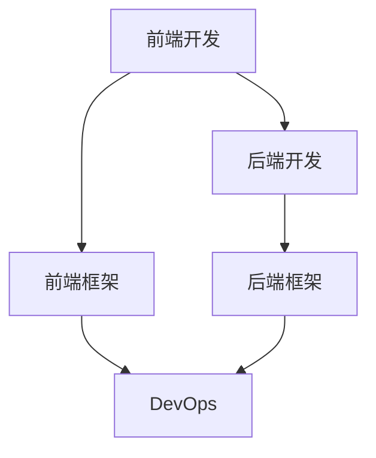

                 

# Web全栈开发：前端到后端的全面指南

> 关键词：Web全栈开发,前端,后端,JavaScript,Node.js,React,Express,全栈开发指南

## 1. 背景介绍

### 1.1 问题由来
随着互联网技术的发展，企业对于Web应用的开发需求日益增长。传统的Web应用开发模式通常分为前后端分离的方式，前端负责界面展示和用户体验，后端负责数据存储和业务逻辑。然而，这种分离的模式存在着一定的局限性，如前后端沟通成本高、维护复杂、性能瓶颈等。为解决这些问题，全栈开发（Full Stack Development）应运而生。全栈开发指开发人员掌握前端和后端的知识，实现从数据获取到界面展示的端到端开发。

全栈开发不仅能提高开发效率，减少前后端沟通成本，还能实现更稳定、更高效的系统架构。如今，越来越多的企业开始采用全栈开发模式，希望通过提升开发者的能力，优化开发流程，最终提高项目交付速度和用户满意度。

## 2. 核心概念与联系

### 2.1 核心概念概述

为更好地理解Web全栈开发，本节将介绍几个关键概念及其之间的联系：

- **前端开发**：指开发Web页面展示和用户交互的部分，通常使用HTML、CSS、JavaScript等技术，实现界面渲染、交互逻辑等功能。

- **后端开发**：指开发Web应用的后台部分，通常使用服务器端语言（如Python、Java、Node.js等），实现数据存储、业务逻辑等功能。

- **全栈开发**：指开发人员同时掌握前端和后端开发技术，能够独立完成Web应用的开发。

- **前端框架**：如React、Vue、Angular等，提供组件化开发、状态管理等特性，加快前端开发效率。

- **后端框架**：如Express、Django、Spring等，提供路由、中间件、ORM等特性，加快后端开发效率。

- **DevOps**：涵盖软件开发和运维的完整流程，包括持续集成、持续交付、自动化测试等，提升开发和运维效率。

这些概念之间的联系通过以下Mermaid流程图来展示：



## 3. 核心算法原理 & 具体操作步骤

### 3.1 算法原理概述

Web全栈开发的核心算法原理，主要包括以下几个方面：

- **前端渲染技术**：如模板引擎、组件化开发等，提高页面渲染效率。
- **后端API设计**：如RESTful API、GraphQL等，规范后端接口，降低前后端耦合。
- **数据管理与存储**：如数据库技术、缓存技术等，优化数据访问性能。
- **分布式系统架构**：如微服务架构、容器化技术等，提高系统的可扩展性和稳定性。

### 3.2 算法步骤详解

全栈开发流程大致可以分为以下几个步骤：

**Step 1: 需求分析与设计**

- 与客户或团队进行沟通，明确需求和目标。
- 设计系统的整体架构，包括前端展示、后端逻辑、数据存储等。
- 选择合适的技术栈和工具，如React、Express、MongoDB等。

**Step 2: 搭建开发环境**

- 在本地或云端搭建开发环境，如Node.js、MongoDB、Docker等。
- 配置相关依赖和配置文件，如package.json、.env等。
- 搭建数据库和缓存系统，如MongoDB、Redis等。

**Step 3: 前端开发**

- 使用前端框架（如React、Vue等）开发界面展示和用户交互部分。
- 编写组件和样式，实现功能模块。
- 通过HTTP请求与后端进行数据交互，获取和渲染数据。

**Step 4: 后端开发**

- 使用后端框架（如Express、Django等）编写API接口，实现业务逻辑。
- 设计数据模型，配置ORM，进行数据库操作。
- 实现数据验证、授权、异常处理等。

**Step 5: 接口测试**

- 使用Postman、Jest等工具进行接口测试。
- 确保API接口正确响应，数据格式符合预期。

**Step 6: 集成与部署**

- 将前后端代码进行集成，配置路由、中间件等。
- 使用DevOps工具（如Docker、Jenkins等）进行自动化测试和部署。
- 在服务器上部署应用，并进行性能优化。

**Step 7: 维护与优化**

- 监控系统运行状态，收集用户反馈。
- 优化代码性能，提升用户体验。
- 进行系统迭代，持续改进。

### 3.3 算法优缺点

全栈开发具有以下优点：

- 提升开发效率：开发人员掌握前端和后端知识，减少前后端沟通成本。
- 提高系统稳定性：前后端由同一人开发，熟悉整体架构，易于维护和排查问题。
- 灵活性高：可以根据实际需求快速调整和优化系统架构。

但全栈开发也存在一些缺点：

- 学习曲线陡峭：需要同时掌握前端和后端技术，学习成本较高。
- 工作量大：涉及前端和后端两个方面的开发和维护。
- 性能瓶颈：对于大规模、复杂系统，可能难以兼顾前端和后端的性能优化。

## 4. 数学模型和公式 & 详细讲解

### 4.1 数学模型构建

全栈开发的数学模型主要涉及前端渲染和后端API设计两方面。

- **前端渲染模型**：如模板引擎模型，将数据和HTML模板进行渲染。公式表示如下：

  $$
  R_{html} = T_{tmpl}(D_{data}, S_{style})
  $$

  其中 $R_{html}$ 表示渲染后的HTML代码，$T_{tmpl}$ 表示模板引擎，$D_{data}$ 表示数据，$S_{style}$ 表示样式。

- **后端API设计模型**：如RESTful API设计，定义资源、方法和HTTP请求方式。公式表示如下：

  $$
  R_{api} = U_{method}(R_{resource}, E_{endpoint})
  $$

  其中 $R_{api}$ 表示API接口，$U_{method}$ 表示HTTP方法，$R_{resource}$ 表示资源，$E_{endpoint}$ 表示API端点。

### 4.2 公式推导过程

以上公式仅为简化示例，实际应用中需要考虑更多因素，如性能优化、安全性等。

### 4.3 案例分析与讲解

以一个电商系统的开发为例，前端需要实现商品展示、购物车管理、支付结算等功能；后端需要实现商品管理、订单处理、支付系统等。前端使用React框架，后端使用Express框架，数据库使用MongoDB。通过定义RESTful API接口，前端向后端发送请求，获取数据并进行展示。

## 5. 项目实践：代码实例和详细解释说明

### 5.1 开发环境搭建

以下是使用Node.js和Express框架搭建后端环境的示例：

1. 安装Node.js和npm。
2. 创建项目目录，初始化npm包管理。
3. 安装Express框架及其依赖。
4. 配置.env文件，设置数据库连接和端口号。

### 5.2 源代码详细实现

以下是一个简单的Express应用代码实现：

```javascript
const express = require('express');
const app = express();
const port = process.env.PORT || 3000;

// 定义API接口
app.get('/api/products', (req, res) => {
  // 从MongoDB中获取商品列表
  const products = [
    { id: 1, name: 'iPhone 13', price: 699 },
    { id: 2, name: 'iPad Pro', price: 999 },
    { id: 3, name: 'MacBook Air', price: 1399 }
  ];
  res.json(products);
});

// 启动服务器
app.listen(port, () => {
  console.log(`Server listening on port ${port}`);
});
```

### 5.3 代码解读与分析

以上代码实现了简单的商品列表查询API接口。前端通过HTTP请求访问该接口，获取商品数据并展示在界面上。需要注意的是，实际开发中需要考虑更多的安全和性能问题，如数据验证、限流、缓存等。

## 6. 实际应用场景

### 6.1 电商系统

电商系统是一个典型的全栈开发场景。前端负责用户界面展示和交互逻辑，后端负责商品管理、订单处理、支付系统等功能。通过全栈开发，可以实现高效、稳定、用户体验良好的电商系统。

### 6.2 在线教育平台

在线教育平台需要同时考虑前端用户界面和后端课程管理、用户注册、在线交互等功能。全栈开发可以更好地实现前后端集成，提升用户体验和系统性能。

### 6.3 医疗系统

医疗系统通常包含用户注册、病历管理、预约挂号等功能。全栈开发可以帮助开发团队快速搭建完整的医疗系统，提供高效、可靠的医疗服务。

### 6.4 未来应用展望

随着技术的不断进步，全栈开发将更多地应用于AI、IoT、大数据等领域，助力更多行业实现数字化转型。全栈开发不仅能提升开发效率，还能优化系统架构，实现端到端的数据管理和用户交互，推动Web应用迈向更高层次的发展。

## 7. 工具和资源推荐

### 7.1 学习资源推荐

1. **《JavaScript高级程序设计》**：深入讲解JavaScript核心特性和开发技巧，帮助开发人员掌握前端开发技术。
2. **《Node.js实战》**：讲解Node.js核心特性和实战应用，提供丰富的项目实践案例。
3. **《React权威指南》**：全面介绍React的核心概念和开发技术，帮助开发人员掌握组件化开发和状态管理。
4. **《Django实战》**：讲解Django核心特性和实战应用，提供丰富的项目实践案例。
5. **《全栈Web开发实战》**：详细介绍前端和后端开发技术，涵盖前端框架和后端框架的实用技巧。

### 7.2 开发工具推荐

1. **VS Code**：轻量级开发环境，支持多种语言和框架。
2. **Docker**：容器化技术，方便开发和部署。
3. **Jest**：JavaScript测试框架，快速进行单元测试和集成测试。
4. **MongoDB**：非关系型数据库，适合电商系统等大规模数据处理场景。
5. **Redis**：内存数据库，适合缓存和快速读写操作。

### 7.3 相关论文推荐

1. **《全栈Web开发架构设计》**：介绍全栈开发架构设计的基本原则和技术。
2. **《Web前端开发最佳实践》**：讲解前端开发的最佳实践，提升开发效率和代码质量。
3. **《Web后端API设计规范》**：介绍RESTful API设计的规范和最佳实践。
4. **《全栈开发与DevOps的结合》**：探讨全栈开发与DevOps的结合，提升开发和运维效率。

## 8. 总结：未来发展趋势与挑战

### 8.1 总结

本文对Web全栈开发进行了全面的介绍，从核心概念、算法原理到具体操作步骤，详细讲解了全栈开发的实践过程。通过系统梳理，可以看到全栈开发在提升开发效率、优化系统架构等方面的巨大优势。

全栈开发不仅能提升开发人员的技能水平，还能促进团队协作，降低沟通成本，是Web开发未来的重要趋势。

### 8.2 未来发展趋势

1. **全栈开发工具化**：开发工具的不断进步，将使得全栈开发更加高效。如自动化的前后端集成、自动化测试等。
2. **云原生技术**：云计算技术的普及，将推动全栈开发向云原生架构转变，提升系统可扩展性和运维效率。
3. **人工智能与全栈结合**：AI技术的发展，将为全栈开发带来新的应用场景，如智能推荐、自然语言处理等。
4. **DevOps的深入应用**：DevOps技术将推动全栈开发向持续交付和自动化运维发展，提升开发效率和系统稳定性。

### 8.3 面临的挑战

1. **学习成本高**：全栈开发需要掌握多种技术，学习成本较高。
2. **团队协作复杂**：团队成员需要跨领域的协作，可能存在沟通和理解上的困难。
3. **性能瓶颈**：大规模系统的性能优化需要兼顾前端和后端，存在一定的难度。
4. **安全性和可靠性**：全栈开发涉及大量的数据和用户交互，安全性和可靠性需要持续关注。

### 8.4 研究展望

未来，全栈开发需要在技术层面进一步深化，如自动化测试、DevOps、云原生技术等。同时，还需要在应用层面进行探索，如AI技术的应用、行业特定的开发模式等。通过不断探索和优化，全栈开发必将在Web开发领域发挥更大的作用，推动技术的不断进步。

## 9. 附录：常见问题与解答

**Q1: 前端和后端应该如何分工？**

A: 前端主要负责界面展示和用户体验，后端主要负责数据存储和业务逻辑。但在实际开发中，前端的API调用和后端的接口设计需要进行紧密协作，以确保系统的整体性能和稳定性。

**Q2: 全栈开发是否需要掌握所有前端和后端技术？**

A: 全栈开发需要掌握前端和后端的核心技术，但不意味着需要精通所有技术细节。开发人员可以根据实际需求，灵活选择合适的技术栈，进行重点学习和掌握。

**Q3: 如何保证前端和后端的同步开发？**

A: 通过定期的沟通会议和代码评审，确保前后端的同步开发。使用版本控制工具，进行代码的版本管理和协同开发。

**Q4: 全栈开发有哪些难点？**

A: 全栈开发的学习成本较高，团队协作复杂，性能优化难度大。需要不断学习和实践，才能掌握全栈开发的技术和技巧。

**Q5: 如何提升全栈开发效率？**

A: 通过自动化工具和技术，如自动化测试、DevOps、云原生技术等，提升全栈开发的效率和质量。

---

作者：禅与计算机程序设计艺术 / Zen and the Art of Computer Programming

