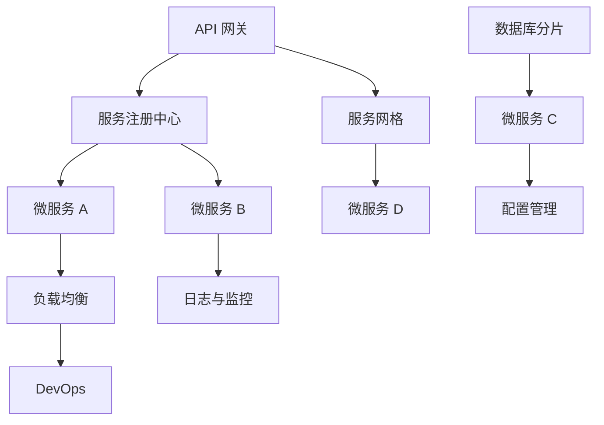

                 

# Web后端微服务架构设计

> 关键词：微服务架构,Web后端,服务网格,分布式系统,DevOps,API网关,数据库分片,负载均衡,日志与监控,容器化,云原生,RESTful API

## 1. 背景介绍

在当今互联网时代，企业应用程序的复杂度和用户需求的多样性日益增加。为了应对这些挑战，微服务架构逐渐成为构建可扩展、高性能、易维护的Web后端系统的首选方案。微服务架构通过将大型应用拆分成一系列小型、独立的服务，实现了服务间的松耦合，提高了系统的灵活性和可扩展性。但随之而来的，是系统复杂度的增加和管理成本的上升。本文将深入探讨微服务架构的核心概念和设计原则，并提出一些基于Web后端微服务的最佳实践，帮助企业构建稳定、高效、可扩展的分布式系统。

## 2. 核心概念与联系

### 2.1 核心概念概述

微服务架构是一种将应用拆分为一系列独立运行、各自负责特定功能的微型服务的设计范式。每个微服务通过RESTful API或消息队列进行通信，部署和更新可以独立进行，简化了系统的开发、部署和维护过程。

以下是微服务架构的几个关键组件：

- **API网关**：提供统一的入口，将请求路由到相应的微服务。
- **服务注册中心**：记录所有微服务的地址和状态，供服务发现使用。
- **服务发现与配置管理**：动态获取微服务的地址和配置，以便服务间相互调用。
- **负载均衡与故障转移**：保证服务的高可用性和可靠性。
- **日志与监控**：收集、分析日志和性能数据，保障系统稳定运行。
- **数据库分片与事务管理**：将数据分离到不同的数据库实例，保证数据的一致性和安全性。
- **DevOps与持续集成/持续部署(CI/CD)**：通过自动化流程，提升开发和交付效率。
- **服务网格**：为微服务间通信提供统一管理和监控机制，提高服务的互操作性和管理效率。

这些组件通过合理设计和配置，可以实现微服务架构的高可用性、可扩展性和易维护性。

### 2.2 核心概念原理和架构的 Mermaid 流程图



该流程图展示了微服务架构的基本组件和它们之间的联系。API网关作为入口，将请求路由到服务注册中心，服务注册中心记录了所有服务的地址和状态。微服务之间通过负载均衡和故障转移机制进行通信，同时日志与监控系统记录并分析系统的运行状态。数据库分片和配置管理保证了数据一致性和服务的可配置性。DevOps自动化流程提升了开发和交付效率，服务网格为服务间的通信提供了统一管理和监控机制。

## 3. 核心算法原理 & 具体操作步骤

### 3.1 算法原理概述

微服务架构的算法原理基于服务拆分的思想，将大型应用分解为多个小型、独立的服务，每个服务负责处理特定功能，通过API网关或消息队列进行通信。服务间的通信通过HTTP/RESTful API或消息队列完成，服务内部的逻辑通过容器化技术进行封装。

### 3.2 算法步骤详解

1. **需求分析与系统设计**：
   - 根据业务需求，确定系统的模块划分和功能拆分。
   - 定义服务间的通信协议和接口规范，以便服务间的互操作性。

2. **服务拆分与部署**：
   - 将应用分解为多个独立的服务，每个服务部署在独立的容器中。
   - 使用Docker或Kubernetes等容器化技术进行部署和扩展。

3. **服务注册与发现**：
   - 使用服务注册中心（如Eureka、Consul）记录所有服务的地址和状态。
   - 服务发现模块动态获取微服务的地址和配置，以便服务间相互调用。

4. **负载均衡与故障转移**：
   - 使用Nginx、HAProxy等负载均衡器实现服务的高可用性和可靠性。
   - 设计服务降级和重试机制，避免因服务故障导致的系统崩溃。

5. **日志与监控**：
   - 集成日志收集工具（如ELK Stack），收集并分析服务运行的日志数据。
   - 使用监控工具（如Prometheus、Grafana）实时监控系统的性能指标，及时发现和解决潜在问题。

6. **数据库分片与事务管理**：
   - 将数据分片到多个数据库实例，减少单点故障和性能瓶颈。
   - 使用分布式事务管理工具（如TCC、Saga）保证数据的一致性和事务的原子性。

7. **DevOps与CI/CD**：
   - 使用DevOps工具链（如Jenkins、GitLab CI）进行自动化测试和部署。
   - 构建持续集成/持续部署（CI/CD）流程，提升开发和交付效率。

8. **服务网格与通信管理**：
   - 引入服务网格（如Istio、Linkerd），提供统一的服务发现、负载均衡、故障转移和管理机制。
   - 使用服务网格的API网关和路由功能，实现服务的统一入口和负载均衡。

### 3.3 算法优缺点

**优点**：

- **可扩展性**：通过服务拆分和独立部署，可以灵活扩展系统规模，满足不断增长的业务需求。
- **高可用性**：服务间的故障互不影响，通过负载均衡和故障转移机制保证系统的稳定性。
- **快速迭代**：服务独立部署和更新，可以独立进行版本迭代，加快产品创新和交付速度。
- **灵活性**：服务间通过API网关和消息队列通信，解耦了服务间的依赖关系，提高了系统的灵活性。

**缺点**：

- **复杂度增加**：系统拆分后，服务间的关系和依赖关系更加复杂，增加了系统的维护成本。
- **管理难度大**：服务间的通信和数据管理需要复杂的协调机制，增加了系统的管理难度。
- **部署难度高**：每个服务都需要独立的部署和运维，增加了部署的复杂性和成本。
- **开发难度大**：服务拆分后的开发和测试需要更多的时间和资源。

### 3.4 算法应用领域

微服务架构广泛应用于各种类型的企业应用，包括电商、金融、医疗、教育等。其核心应用领域包括：

- **电商系统**：电商系统的复杂性和用户需求的多样性，使其成为微服务架构的理想应用场景。电商系统的各个模块，如商品管理、订单处理、支付系统等，可以独立拆分和部署。
- **金融系统**：金融系统的高并发和低延迟要求，使得微服务架构成为其不二选择。通过微服务拆分，可以提升系统的响应速度和处理能力。
- **医疗系统**：医疗系统需要处理大量患者数据和复杂的医疗流程，通过微服务架构，可以更好地管理和协调各个模块。
- **教育系统**：教育系统需要处理海量的教学数据和复杂的教学流程，通过微服务架构，可以实现灵活的教学资源管理和高效的教学调度。

## 4. 数学模型和公式 & 详细讲解

### 4.1 数学模型构建

微服务架构的数学模型主要涉及服务间的通信协议和接口规范。以RESTful API为例，其数学模型可以描述为：

- **输入**：客户端发送的HTTP请求，包括请求方法、URL、请求头、请求体等。
- **输出**：服务返回的HTTP响应，包括响应状态码、响应头、响应体等。

### 4.2 公式推导过程

以RESTful API为例，推导其数学模型如下：

1. **请求处理模型**：
   - 请求方法：$R$ 表示请求方法（GET、POST、PUT、DELETE等）。
   - URL：$U$ 表示请求的URL地址。
   - 请求头：$H$ 表示请求的HTTP头部信息。
   - 请求体：$B$ 表示请求的HTTP请求体。

   请求处理模型的数学表达式为：
   $$
   \text{Request} = (R, U, H, B)
   $$

2. **响应处理模型**：
   - 响应状态码：$S$ 表示响应状态码。
   - 响应头：$H'$ 表示响应的HTTP头部信息。
   - 响应体：$B'$ 表示响应的HTTP请求体。

   响应处理模型的数学表达式为：
   $$
   \text{Response} = (S, H', B')
   $$

3. **通信模型**：
   - 客户端发送请求：$C$ 表示客户端发送的请求信息。
   - 服务端接收请求：$S$ 表示服务端接收的请求信息。
   - 服务端处理请求：$P$ 表示服务端处理请求的过程。
   - 服务端发送响应：$S'$ 表示服务端发送的响应信息。
   - 客户端接收响应：$C'$ 表示客户端接收的响应信息。

   通信模型的数学表达式为：
   $$
   \text{Communication} = (C, S, P, S', C')
   $$

### 4.3 案例分析与讲解

**案例1：电商系统微服务架构**

电商系统是一个复杂的业务系统，包括商品管理、订单处理、支付系统等多个模块。通过微服务架构，可以将这些模块拆分并独立部署。

- **商品管理服务**：负责商品的增删改查，其接口定义如下：
  - GET /product/{id}：获取指定商品信息。
  - POST /product：创建商品。
  - PUT /product/{id}：更新商品信息。
  - DELETE /product/{id}：删除商品。

- **订单处理服务**：负责订单的生成、支付和发货，其接口定义如下：
  - POST /order：创建订单。
  - GET /order/{id}：获取指定订单信息。
  - PUT /order/{id}：更新订单信息。
  - DELETE /order/{id}：删除订单。

- **支付服务**：负责支付的接入和处理，其接口定义如下：
  - POST /payment：创建支付订单。
  - GET /payment/{id}：获取指定支付订单信息。
  - PUT /payment/{id}：更新支付订单信息。
  - DELETE /payment/{id}：删除支付订单。

通过RESTful API的定义，电商系统的各个模块可以独立进行开发和部署，同时通过API网关实现统一入口和负载均衡。

**案例2：金融系统微服务架构**

金融系统的高并发和低延迟要求，使其成为微服务架构的理想应用场景。

- **交易服务**：负责处理交易请求，其接口定义如下：
  - POST /transaction：创建交易。
  - GET /transaction/{id}：获取指定交易信息。
  - PUT /transaction/{id}：更新交易信息。
  - DELETE /transaction/{id}：删除交易。

- **风控服务**：负责风险控制和欺诈检测，其接口定义如下：
  - POST /risk：创建风险评估。
  - GET /risk/{id}：获取指定风险评估信息。
  - PUT /risk/{id}：更新风险评估信息。
  - DELETE /risk/{id}：删除风险评估。

- **清算服务**：负责交易清算和资金处理，其接口定义如下：
  - POST /clearing：创建清算请求。
  - GET /clearing/{id}：获取指定清算请求信息。
  - PUT /clearing/{id}：更新清算请求信息。
  - DELETE /clearing/{id}：删除清算请求。

通过微服务架构，金融系统的各个模块可以独立进行部署和更新，同时通过负载均衡和故障转移机制，保证系统的稳定性和可靠性。

## 5. 项目实践：代码实例和详细解释说明

### 5.1 开发环境搭建

1. **安装Docker和Kubernetes**：
   ```bash
   sudo apt-get update
   sudo apt-get install docker.io
   sudo apt-get install docker-compose
   sudo apt-get install kubeadm
   sudo apt-get install kubectl
   ```

2. **安装Kubernetes**：
   ```bash
   sudo kubeadm init
   kubectl apply -f https://docs.kubeflow.org/docs/install/kf-quickstart.yaml
   ```

3. **安装PostgreSQL和Redis**：
   ```bash
   sudo apt-get install postgresql
   sudo apt-get install redis-server
   ```

4. **安装Spring Boot应用**：
   ```bash
   sudo apt-get install maven
   sudo apt-get install curl
   ```

### 5.2 源代码详细实现

以下是一个基于微服务架构的电商系统的Spring Boot代码实现示例：

**商品管理服务**：

```java
@RestController
@RequestMapping("/product")
public class ProductController {
    
    @Autowired
    private ProductService productService;
    
    @GetMapping("/{id}")
    public ResponseEntity<Product> getProduct(@PathVariable Long id) {
        Product product = productService.findById(id);
        if (product == null) {
            return ResponseEntity.status(HttpStatus.NOT_FOUND).build();
        }
        return ResponseEntity.ok(product);
    }
    
    @PostMapping
    public ResponseEntity<String> createProduct(@RequestBody Product product) {
        productService.createProduct(product);
        return ResponseEntity.status(HttpStatus.CREATED).body("Product created");
    }
    
    @PutMapping("/{id}")
    public ResponseEntity<String> updateProduct(@PathVariable Long id, @RequestBody Product product) {
        productService.updateProduct(id, product);
        return ResponseEntity.status(HttpStatus.OK).body("Product updated");
    }
    
    @DeleteMapping("/{id}")
    public ResponseEntity<String> deleteProduct(@PathVariable Long id) {
        productService.deleteProduct(id);
        return ResponseEntity.status(HttpStatus.OK).body("Product deleted");
    }
}
```

**订单处理服务**：

```java
@RestController
@RequestMapping("/order")
public class OrderController {
    
    @Autowired
    private OrderService orderService;
    
    @PostMapping
    public ResponseEntity<String> createOrder(@RequestBody Order order) {
        orderService.createOrder(order);
        return ResponseEntity.status(HttpStatus.CREATED).body("Order created");
    }
    
    @GetMapping("/{id}")
    public ResponseEntity<Order> getOrder(@PathVariable Long id) {
        Order order = orderService.findById(id);
        if (order == null) {
            return ResponseEntity.status(HttpStatus.NOT_FOUND).build();
        }
        return ResponseEntity.ok(order);
    }
    
    @PutMapping("/{id}")
    public ResponseEntity<String> updateOrder(@PathVariable Long id, @RequestBody Order order) {
        orderService.updateOrder(id, order);
        return ResponseEntity.status(HttpStatus.OK).body("Order updated");
    }
    
    @DeleteMapping("/{id}")
    public ResponseEntity<String> deleteOrder(@PathVariable Long id) {
        orderService.deleteOrder(id);
        return ResponseEntity.status(HttpStatus.OK).body("Order deleted");
    }
}
```

**支付服务**：

```java
@RestController
@RequestMapping("/payment")
public class PaymentController {
    
    @Autowired
    private PaymentService paymentService;
    
    @PostMapping
    public ResponseEntity<String> createPayment(@RequestBody Payment payment) {
        paymentService.createPayment(payment);
        return ResponseEntity.status(HttpStatus.CREATED).body("Payment created");
    }
    
    @GetMapping("/{id}")
    public ResponseEntity<Payment> getPayment(@PathVariable Long id) {
        Payment payment = paymentService.findById(id);
        if (payment == null) {
            return ResponseEntity.status(HttpStatus.NOT_FOUND).build();
        }
        return ResponseEntity.ok(payment);
    }
    
    @PutMapping("/{id}")
    public ResponseEntity<String> updatePayment(@PathVariable Long id, @RequestBody Payment payment) {
        paymentService.updatePayment(id, payment);
        return ResponseEntity.status(HttpStatus.OK).body("Payment updated");
    }
    
    @DeleteMapping("/{id}")
    public ResponseEntity<String> deletePayment(@PathVariable Long id) {
        paymentService.deletePayment(id);
        return ResponseEntity.status(HttpStatus.OK).body("Payment deleted");
    }
}
```

**Spring Boot应用配置**：

```yaml
spring:
  application:
    name: microservice
  datasource:
    url: jdbc:postgresql://localhost:5432/microservice
    username: postgres
    password: postgres
    driver-class-name: org.postgresql.Driver
  h2:
    enabled: true
  server:
    port: 8080
```

### 5.3 代码解读与分析

1. **商品管理服务**：
   - 通过Spring MVC注解，定义了商品管理的RESTful API接口。
   - 使用Spring Data JPA，方便进行数据库操作。
   - 通过HTTP请求和响应，实现商品信息的增删改查。

2. **订单处理服务**：
   - 通过Spring MVC注解，定义了订单管理的RESTful API接口。
   - 使用Spring Data JPA，方便进行数据库操作。
   - 通过HTTP请求和响应，实现订单信息的增删改查。

3. **支付服务**：
   - 通过Spring MVC注解，定义了支付管理的RESTful API接口。
   - 使用Spring Data JPA，方便进行数据库操作。
   - 通过HTTP请求和响应，实现支付信息的增删改查。

### 5.4 运行结果展示

启动Spring Boot应用，访问商品管理服务的API：

```bash
curl -X GET http://localhost:8080/product/1
```

启动订单处理服务的API：

```bash
curl -X GET http://localhost:8080/order/1
```

启动支付服务的API：

```bash
curl -X GET http://localhost:8080/payment/1
```

通过API网关（如Spring Cloud Gateway）实现服务的统一入口和负载均衡，可以实现更好的服务管理和系统扩展。

## 6. 实际应用场景

### 6.1 智能合约平台

智能合约平台是区块链技术的重要应用场景。通过微服务架构，可以实现智能合约的灵活管理和高效调用。

- **合约管理服务**：负责智能合约的创建、部署和管理，其接口定义如下：
  - POST /contract：创建智能合约。
  - GET /contract/{id}：获取指定智能合约信息。
  - PUT /contract/{id}：更新智能合约信息。
  - DELETE /contract/{id}：删除智能合约。

- **合约执行服务**：负责智能合约的执行和调用，其接口定义如下：
  - POST /execute：执行智能合约。
  - GET /execute/{id}：获取指定执行结果。
  - PUT /execute/{id}：更新执行结果。
  - DELETE /execute/{id}：删除执行结果。

通过微服务架构，智能合约平台可以独立进行合约的创建、部署、执行和管理，同时通过API网关实现服务的统一入口和负载均衡。

### 6.2 医疗信息系统

医疗信息系统是一个复杂的应用场景，需要处理大量的患者数据和复杂的医疗流程。通过微服务架构，可以实现系统的灵活管理和高效调用。

- **患者管理服务**：负责患者的增删改查，其接口定义如下：
  - POST /patient：创建患者。
  - GET /patient/{id}：获取指定患者信息。
  - PUT /patient/{id}：更新患者信息。
  - DELETE /patient/{id}：删除患者。

- **诊断服务**：负责诊断结果的生成和管理，其接口定义如下：
  - POST /diagnosis：创建诊断结果。
  - GET /diagnosis/{id}：获取指定诊断结果信息。
  - PUT /diagnosis/{id}：更新诊断结果信息。
  - DELETE /diagnosis/{id}：删除诊断结果。

- **治疗服务**：负责治疗方案的生成和管理，其接口定义如下：
  - POST /treatment：创建治疗方案。
  - GET /treatment/{id}：获取指定治疗方案信息。
  - PUT /treatment/{id}：更新治疗方案信息。
  - DELETE /treatment/{id}：删除治疗方案。

通过微服务架构，医疗信息系统可以独立进行患者管理、诊断和治疗方案的管理，同时通过API网关实现服务的统一入口和负载均衡。

### 6.3 金融数据分析平台

金融数据分析平台需要处理大量的金融数据，进行复杂的分析和建模。通过微服务架构，可以实现系统的灵活管理和高效调用。

- **数据管理服务**：负责数据的增删改查，其接口定义如下：
  - POST /data：创建数据。
  - GET /data/{id}：获取指定数据信息。
  - PUT /data/{id}：更新数据信息。
  - DELETE /data/{id}：删除数据。

- **分析服务**：负责数据的分析和建模，其接口定义如下：
  - POST /analysis：创建数据分析模型。
  - GET /analysis/{id}：获取指定数据分析模型信息。
  - PUT /analysis/{id}：更新数据分析模型信息。
  - DELETE /analysis/{id}：删除数据分析模型。

- **报告服务**：负责数据分析结果的生成和管理，其接口定义如下：
  - POST /report：创建数据分析报告。
  - GET /report/{id}：获取指定数据分析报告信息。
  - PUT /report/{id}：更新数据分析报告信息。
  - DELETE /report/{id}：删除数据分析报告。

通过微服务架构，金融数据分析平台可以独立进行数据管理、分析和报告的管理，同时通过API网关实现服务的统一入口和负载均衡。

## 7. 工具和资源推荐

### 7.1 学习资源推荐

1. **Spring Cloud**：Spring Cloud是微服务架构的重要组成部分，提供了丰富的服务治理、配置管理、负载均衡等工具。官方文档和社区资源非常丰富，适合入门和深入学习。
2. **Istio**：Istio是服务网格的代表，提供统一的服务发现、负载均衡、故障转移和管理机制。官方文档和社区资源非常丰富，适合深入学习和使用。
3. **Kubernetes**：Kubernetes是容器编排的领先平台，提供弹性伸缩、自动化部署和运维等核心功能。官方文档和社区资源非常丰富，适合深入学习和使用。
4. **Docker**：Docker是容器化的领先平台，提供轻量级、可移植的容器应用。官方文档和社区资源非常丰富，适合深入学习和使用。
5. **Prometheus**：Prometheus是开源的监控系统，提供实时监控和告警功能。官方文档和社区资源非常丰富，适合深入学习和使用。

### 7.2 开发工具推荐

1. **Spring Boot**：Spring Boot是Spring框架的轻量级版本，提供快速开发和部署的能力。官方文档和社区资源非常丰富，适合入门和深入学习。
2. **Kubernetes**：Kubernetes是容器编排的领先平台，提供弹性伸缩、自动化部署和运维等核心功能。官方文档和社区资源非常丰富，适合深入学习和使用。
3. **Istio**：Istio是服务网格的代表，提供统一的服务发现、负载均衡、故障转移和管理机制。官方文档和社区资源非常丰富，适合深入学习和使用。
4. **Docker**：Docker是容器化的领先平台，提供轻量级、可移植的容器应用。官方文档和社区资源非常丰富，适合深入学习和使用。
5. **Prometheus**：Prometheus是开源的监控系统，提供实时监控和告警功能。官方文档和社区资源非常丰富，适合深入学习和使用。

### 7.3 相关论文推荐

1. **《微服务架构：原则、模式、实践》**：这本书是微服务架构的经典之作，介绍了微服务架构的核心概念和设计原则。
2. **《Spring Cloud》**：Spring Cloud是微服务架构的重要组成部分，提供了丰富的服务治理、配置管理、负载均衡等工具。官方文档和社区资源非常丰富，适合入门和深入学习。
3. **《Istio：开源服务网格》**：Istio是服务网格的代表，提供统一的服务发现、负载均衡、故障转移和管理机制。官方文档和社区资源非常丰富，适合深入学习和使用。
4. **《Kubernetes：生产级容器编排系统》**：Kubernetes是容器编排的领先平台，提供弹性伸缩、自动化部署和运维等核心功能。官方文档和社区资源非常丰富，适合深入学习和使用。
5. **《Docker：轻量级容器引擎》**：Docker是容器化的领先平台，提供轻量级、可移植的容器应用。官方文档和社区资源非常丰富，适合深入学习和使用。

## 8. 总结：未来发展趋势与挑战

### 8.1 研究成果总结

微服务架构是构建可扩展、高性能、易维护的Web后端系统的最佳实践之一。通过将应用拆分成多个小型、独立的服务，可以实现服务间的松耦合，提高系统的灵活性和可扩展性。

### 8.2 未来发展趋势

1. **云原生架构**：微服务架构将与云原生技术深度融合，提供更加灵活和高效的应用部署和运维机制。
2. **服务网格**：服务网格将成为微服务架构的核心组件，提供统一的服务发现、负载均衡、故障转移和管理机制。
3. **DevOps自动化**：DevOps自动化流程将进一步提升微服务系统的开发和交付效率，实现持续集成和持续部署。
4. **微服务容器化**：微服务容器化将成为微服务架构的标配，通过Docker和Kubernetes等技术，实现应用的快速部署和弹性伸缩。
5. **分布式事务管理**：分布式事务管理技术将进一步完善，提供更加稳定和可靠的事务处理机制。

### 8.3 面临的挑战

尽管微服务架构具有诸多优势，但在实际应用中也面临一些挑战：

1. **服务拆分复杂**：服务拆分的粒度和方式需要精心设计，避免过度拆分成微服务后影响系统性能和可维护性。
2. **服务通信复杂**：服务间通信需要通过API网关和消息队列等机制进行协调，增加了系统的复杂性。
3. **服务治理复杂**：服务注册、配置管理和负载均衡等机制需要精细设计和协调，增加了系统的管理难度。
4. **系统部署复杂**：每个服务需要独立的部署和运维，增加了系统的部署和运维复杂性。
5. **数据一致性管理**：微服务架构中，数据一致性管理是一个复杂的问题，需要谨慎设计和实现。

### 8.4 研究展望

微服务架构的未来发展方向包括：

1. **微服务容器化**：微服务容器化将成为微服务架构的标配，通过Docker和Kubernetes等技术，实现应用的快速部署和弹性伸缩。
2. **微服务云原生**：微服务架构将与云原生技术深度融合，提供更加灵活和高效的应用部署和运维机制。
3. **微服务自动发现**：微服务自动发现机制将进一步优化，提高服务间的互操作性和管理效率。
4. **微服务自动化运维**：微服务自动化运维流程将进一步完善，提升系统的稳定性和可靠性。
5. **微服务无状态化**：微服务无状态化将成为微服务架构的核心思想，通过状态分片和状态同步机制，实现系统的灵活性和可扩展性。

通过不断的技术创新和实践探索，微服务架构必将在未来的Web后端系统中发挥更大的作用，为企业带来更高的应用价值。

## 9. 附录：常见问题与解答

**Q1：微服务架构和单体架构有何不同？**

A: 微服务架构和单体架构的主要区别在于应用的结构和部署方式。单体架构将整个应用作为单一的进程部署，各个模块共享同一进程内的资源和状态。而微服务架构将应用拆分为多个独立的服务，每个服务独立部署和运行，通过API网关或消息队列进行通信。微服务架构通过服务拆分，提高了系统的灵活性和可扩展性。

**Q2：微服务架构为何能提高系统的可扩展性？**

A: 微服务架构通过将应用拆分为多个独立的服务，每个服务独立部署和运行，可以灵活扩展和维护。服务间的通信通过API网关和消息队列进行，服务之间的依赖关系更加清晰和可控，可以避免因单体架构中模块间的复杂依赖导致的性能瓶颈和维护困难。同时，微服务架构通过容器化和容器编排工具，可以实现服务的快速部署和弹性伸缩，提高系统的可扩展性和可用性。

**Q3：微服务架构为何需要服务发现机制？**

A: 微服务架构中，每个服务独立部署和运行，服务间的通信需要通过API网关和消息队列进行。服务发现机制可以帮助服务动态获取其他服务的地址和状态，以便服务间相互调用。通过服务发现机制，可以实现服务的自动配置和故障转移，提高系统的稳定性和可靠性。

**Q4：微服务架构为何需要负载均衡机制？**

A: 微服务架构中，每个服务独立部署和运行，服务间的通信需要通过API网关和消息队列进行。负载均衡机制可以保证服务的高可用性和可靠性，避免因某个服务故障导致的系统崩溃。通过负载均衡机制，可以实现服务的自动扩展和故障转移，提高系统的稳定性和可扩展性。

**Q5：微服务架构为何需要日志和监控机制？**

A: 微服务架构中，每个服务独立部署和运行，服务间的通信需要通过API网关和消息队列进行。日志和监控机制可以记录和分析服务运行的日志数据和性能数据，及时发现和解决潜在问题，提高系统的稳定性和可靠性。通过日志和监控机制，可以实现系统的自动监控和告警，保障服务的稳定运行。

---

作者：禅与计算机程序设计艺术 / Zen and the Art of Computer Programming

