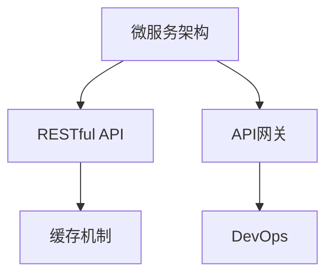

                 

# Web应用架构：从后端API到前端交互

> 关键词：Web应用,架构设计,后端API,前端交互,前后端解耦,微服务,DevOps,API网关,缓存机制,性能优化

## 1. 背景介绍

### 1.1 问题由来
随着互联网技术的飞速发展，Web应用架构面临着前所未有的挑战。如何构建高效、可扩展、可维护的Web应用，成为了现代软件开发中最重要的议题之一。而传统的"单片代码"模式（Monolithic Architecture）存在代码耦合度高、维护成本大、部署效率低等问题，严重制约了Web应用的敏捷开发和快速迭代。

为了应对这些挑战，现代Web应用逐渐向微服务架构（Microservices Architecture）转型。微服务架构通过将应用拆分为多个独立的小模块（微服务），每个微服务独立部署、独立扩展、独立维护，大大提升了系统的灵活性和可维护性。但是，随着微服务数量增多，系统复杂度也会显著增加。如何在微服务架构中实现高效的数据交互和前后端无缝配合，成为一个亟待解决的难点问题。

## 2. 核心概念与联系

### 2.1 核心概念概述

为更好地理解Web应用架构的演进和实践，本节将介绍几个关键概念：

- 微服务架构（Microservices Architecture）：将应用拆分为多个独立的小模块（微服务），每个微服务独立部署、独立扩展、独立维护，大大提升了系统的灵活性和可维护性。
- RESTful API：基于HTTP协议的Web服务架构，强调资源的唯一标识和操作的独立性，支持REST风格的数据交换。
- API网关（API Gateway）：作为微服务系统的入口，负责路由、限流、认证等基础功能，同时也负责前后端解耦和数据交互。
- 缓存机制（Caching Mechanism）：通过缓存中间结果，减少重复计算，提升系统的响应速度和扩展能力。
- DevOps：以开发、测试、部署、运维一体化为核心，通过自动化工具和流程，实现软件交付的快速和稳定。

这些核心概念之间的逻辑关系可以通过以下Mermaid流程图来展示：



这个流程图展示出微服务架构的演进过程，以及各个关键组件的角色和关系。

## 3. 核心算法原理 & 具体操作步骤
### 3.1 算法原理概述

Web应用架构的核心算法原理在于将前后端数据交互过程进行解耦，实现数据交互的高效性和可靠性。通过API网关和缓存机制，可以实现微服务架构下的前后端无缝配合。

### 3.2 算法步骤详解

基于微服务架构的Web应用架构，主要包括以下几个关键步骤：

**Step 1: 设计微服务组件**

- 将应用拆分为多个独立的微服务，每个微服务负责独立的功能模块。
- 根据业务场景设计微服务的接口规范，通常采用RESTful风格。
- 每个微服务设计独立的数据库和缓存，提升系统的扩展性和隔离性。

**Step 2: 实现API网关**

- 设计API网关，作为微服务系统的入口，负责路由、限流、认证等基础功能。
- 引入API网关，将所有微服务的接口统一管理，便于统一处理和调度。
- 通过API网关实现前后端的解耦，使得前端只与API网关交互，屏蔽内部微服务的复杂性。

**Step 3: 实现缓存机制**

- 引入缓存机制，对高频访问的数据进行缓存，减少重复计算。
- 实现多级缓存，包括客户端缓存、API网关缓存和微服务缓存，提升系统的响应速度。
- 通过缓存一致性协议（如分布式锁）和失效机制（如TTL、LRU），保障缓存数据的一致性和可靠性。

**Step 4: 实现DevOps流程**

- 引入DevOps工具和流程，实现软件开发、测试、部署、运维的一体化管理。
- 采用CI/CD工具，实现微服务的自动构建、测试、部署和回滚，提升开发效率。
- 通过监控、日志、告警等工具，实时监控微服务运行状态，保障系统稳定。

**Step 5: 实现前后端数据交互**

- 通过API网关实现前后端的统一数据交互接口。
- 实现API网关与各个微服务的接口调用，将数据请求转发给对应的微服务进行处理。
- 将微服务的响应数据缓存到API网关，提升响应速度。
- 通过API网关进行数据格式转换和校验，确保数据的正确性和一致性。

### 3.3 算法优缺点

基于微服务架构的Web应用架构具有以下优点：
1. 独立部署：每个微服务独立部署，便于快速迭代和扩展。
2. 解耦性强：通过API网关实现前后端的解耦，简化系统的复杂度。
3. 高可用性：微服务的分布式部署和负载均衡，提高了系统的可靠性。
4. 可扩展性强：微服务的独立部署和扩展，便于系统的横向扩展。

同时，该架构也存在一定的局限性：
1. 开发和运维复杂：微服务架构需要较高的开发和运维技术水平，需要协同工作。
2. 服务间通信复杂：微服务之间的通信需要处理跨服务调用、分布式事务等问题，技术难度较大。
3. 数据一致性问题：多级缓存和分布式事务，可能带来数据一致性问题。
4. 系统复杂度提高：微服务数量增多，系统复杂度提升，维护成本增加。

尽管存在这些局限性，但就目前而言，微服务架构依然是Web应用架构的主流范式。未来相关研究的重点在于如何进一步优化微服务之间的通信机制，降低系统复杂度，提高系统的可维护性和性能。

### 3.4 算法应用领域

基于微服务架构的Web应用架构，已经广泛应用于金融、电商、社交、教育、医疗等多个领域，成为现代Web应用开发的主流模式。例如：

- 金融领域：各大银行和金融公司广泛采用微服务架构，处理高并发交易、高频结算等业务。
- 电商领域：阿里巴巴、京东等电商巨头使用微服务架构，实现订单处理、库存管理、物流跟踪等核心功能。
- 社交领域：微信、微博等社交应用采用微服务架构，处理用户消息、内容生成、关系维护等复杂业务。
- 教育领域：MOOC平台、在线教育应用采用微服务架构，实现课程管理、学生互动、智能推荐等功能。
- 医疗领域：医疗应用采用微服务架构，处理患者诊疗、病历管理、药品配送等业务。

除了上述这些经典应用外，微服务架构也被创新性地应用到更多场景中，如物联网、智慧城市、人工智能等领域，为各行各业带来了全新的技术变革。

## 4. 数学模型和公式 & 详细讲解
### 4.1 数学模型构建

为了更好地理解Web应用架构的算法原理，我们引入一个简单的数学模型：假设一个Web应用由两个微服务A和B组成，每个微服务包含一个计算单元。

**微服务A的计算单元**：
\[ f_A(x) = x^2 + ax + b \]

**微服务B的计算单元**：
\[ f_B(y) = y^2 + cy + d \]

**API网关**：
\[ f_{API}(x, y) = f_A(x) + f_B(y) \]

假设x和y为微服务的输入参数，通过API网关进行数据交互，实现两个微服务的计算。

### 4.2 公式推导过程

通过上述公式，我们可以推导出API网关的数据交互过程：
- 微服务A接收到数据x，进行计算得到结果$x_A = f_A(x)$。
- 微服务B接收到数据y，进行计算得到结果$y_B = f_B(y)$。
- API网关将$x_A$和$y_B$作为输入，进行计算得到最终结果$z = f_{API}(x_A, y_B)$。

这个推导过程展示了微服务架构下的数据交互过程，每个微服务独立计算，API网关将结果汇总，实现前后端数据的无缝配合。

### 4.3 案例分析与讲解

以一个在线购物系统为例，分析微服务架构下的数据交互过程。

**用户下单微服务（Order Service）**：
- 接收用户订单信息，进行订单处理。
- 调用支付微服务进行支付处理。

**支付微服务（Payment Service）**：
- 接收支付信息，进行支付处理。
- 调用订单微服务更新订单状态。

**订单微服务（Order Service）**：
- 接收用户订单信息，进行订单处理。
- 调用物流微服务进行物流跟踪。

**物流微服务（Logistics Service）**：
- 接收物流信息，进行物流处理。
- 调用订单微服务更新订单状态。

在API网关上，这些微服务通过RESTful API进行统一管理。用户下单时，先访问API网关，API网关将请求转发给订单微服务进行订单处理。订单处理完成后，调用支付微服务和物流微服务进行支付和物流跟踪。

## 5. 项目实践：代码实例和详细解释说明
### 5.1 开发环境搭建

在进行微服务架构实践前，我们需要准备好开发环境。以下是使用Spring Boot和Docker进行微服务架构开发的环境配置流程：

1. 安装JDK：从官网下载并安装JDK，用于开发和运行Java应用。
2. 安装Maven：从官网下载并安装Maven，用于管理项目依赖和构建。
3. 安装Spring Boot：从官网下载并安装Spring Boot，用于快速开发Web应用。
4. 安装Docker：从官网下载并安装Docker，用于微服务的容器化部署。
5. 安装Kubernetes：从官网下载并安装Kubernetes，用于容器编排和自动扩缩容。

完成上述步骤后，即可在本地环境或云端进行微服务架构的开发和测试。

### 5.2 源代码详细实现

以下是一个简单的微服务架构示例，包含订单服务和支付服务两个微服务，使用Spring Boot和Spring Cloud实现。

**订单服务（OrderService）**：
```java
@RestController
@RequestMapping("/order")
public class OrderServiceController {
    
    @Autowired
    private OrderService orderService;
    
    @GetMapping("/{id}")
    public ResponseEntity<RestResponse> getOrderById(@PathVariable("id") Long id) {
        RestResponse response = new RestResponse();
        response.setSuccess(true);
        response.setResult(orderService.getOrderById(id));
        return ResponseEntity.ok(response);
    }
    
    @PostMapping
    public ResponseEntity<RestResponse> createOrder(@RequestBody Order order) {
        RestResponse response = new RestResponse();
        response.setSuccess(true);
        response.setResult(orderService.createOrder(order));
        return ResponseEntity.ok(response);
    }
    
    // 其他接口...
}

```

**支付服务（PaymentService）**：
```java
@RestController
@RequestMapping("/payment")
public class PaymentServiceController {
    
    @Autowired
    private PaymentService paymentService;
    
    @GetMapping("/{id}")
    public ResponseEntity<RestResponse> getPaymentById(@PathVariable("id") Long id) {
        RestResponse response = new RestResponse();
        response.setSuccess(true);
        response.setResult(paymentService.getPaymentById(id));
        return ResponseEntity.ok(response);
    }
    
    @PostMapping
    public ResponseEntity<RestResponse> createPayment(@RequestBody Payment payment) {
        RestResponse response = new RestResponse();
        response.setSuccess(true);
        response.setResult(paymentService.createPayment(payment));
        return ResponseEntity.ok(response);
    }
    
    // 其他接口...
}

```

**订单服务接口定义**：
```java
@FeignClient(name = "order-service")
public interface OrderServiceFeignClient {
    
    @GetMapping("/{id}")
    Order getOrderById(@PathVariable("id") Long id);
    
    @PostMapping
    Order createOrder(@RequestBody Order order);
    
    // 其他接口...
}

```

**支付服务接口定义**：
```java
@FeignClient(name = "payment-service")
public interface PaymentServiceFeignClient {
    
    @GetMapping("/{id}")
    Payment getPaymentById(@PathVariable("id") Long id);
    
    @PostMapping
    Payment createPayment(@RequestBody Payment payment);
    
    // 其他接口...
}

```

**订单服务实现类**：
```java
@Service
public class OrderService implements OrderServiceFeignClient {
    
    @Override
    public Order getOrderById(Long id) {
        // 实现订单获取逻辑...
    }
    
    @Override
    public Order createOrder(Order order) {
        // 实现订单创建逻辑...
    }
    
    // 其他方法...
}

```

**支付服务实现类**：
```java
@Service
public class PaymentService implements PaymentServiceFeignClient {
    
    @Override
    public Payment getPaymentById(Long id) {
        // 实现支付获取逻辑...
    }
    
    @Override
    public Payment createPayment(Payment payment) {
        // 实现支付创建逻辑...
    }
    
    // 其他方法...
}

```

**订单服务启动类**：
```java
@SpringBootApplication
@EnableAutoConfiguration
public class OrderServiceApplication {
    
    public static void main(String[] args) {
        SpringApplication.run(OrderServiceApplication.class, args);
    }
}

```

**支付服务启动类**：
```java
@SpringBootApplication
@EnableAutoConfiguration
public class PaymentServiceApplication {
    
    public static void main(String[] args) {
        SpringApplication.run(PaymentServiceApplication.class, args);
    }
}

```

**订单服务配置类**：
```java
@Configuration
public class OrderServiceConfiguration {
    
    @Value("${order-service.port}")
    private String orderServicePort;
    
    @Bean
    public RestTemplate restTemplate() {
        return new RestTemplate();
    }
    
    @Bean
    public OrderServiceFeignClient orderServiceFeignClient(RestTemplate restTemplate) {
        return new OrderServiceFeignClient(restTemplate, orderServicePort);
    }
    
    // 其他配置...
}

```

**支付服务配置类**：
```java
@Configuration
public class PaymentServiceConfiguration {
    
    @Value("${payment-service.port}")
    private String paymentServicePort;
    
    @Bean
    public RestTemplate restTemplate() {
        return new RestTemplate();
    }
    
    @Bean
    public PaymentServiceFeignClient paymentServiceFeignClient(RestTemplate restTemplate) {
        return new PaymentServiceFeignClient(restTemplate, paymentServicePort);
    }
    
    // 其他配置...
}

```

### 5.3 代码解读与分析

让我们再详细解读一下关键代码的实现细节：

**Restful API接口定义**：
- 使用`@RestController`注解定义RESTful API接口。
- 使用`@RequestMapping`注解指定API路径。
- 使用`@GetMapping`和`@PostMapping`注解定义不同HTTP请求方法对应的接口。

**Feign客户端接口定义**：
- 使用`@FeignClient`注解定义Feign客户端接口，通过`name`属性指定微服务名称。
- 使用`@GetMapping`和`@PostMapping`注解定义不同HTTP请求方法对应的接口。

**微服务实现类**：
- 使用`@Service`注解定义微服务实现类。
- 实现微服务接口中定义的业务逻辑。

**微服务启动类**：
- 使用`@SpringBootApplication`注解定义Spring Boot启动类。
- 通过`@SpringBootApplication`注解提供的`@EnableAutoConfiguration`注解启用Spring Boot的自动配置功能。

**微服务配置类**：
- 使用`@Configuration`注解定义微服务配置类。
- 通过`@Value`注解获取微服务端口信息。
- 通过`@Bean`注解定义RestTemplate和Feign客户端。
- 通过Feign客户端实现微服务调用。

这些关键代码展示了微服务架构的实现细节，通过Spring Boot和Spring Cloud，实现了微服务的快速开发和部署。

## 6. 实际应用场景
### 6.1 智能客服系统

基于微服务架构的智能客服系统，可以充分发挥微服务的高可用性和可扩展性，提升客服系统的响应速度和服务质量。具体实现如下：

**微服务设计**：
- 将客服系统拆分为用户管理、知识库、对话管理等微服务。
- 每个微服务独立部署，便于快速迭代和扩展。

**API网关设计**：
- 设计API网关，实现用户对话和知识库的统一管理。
- 通过API网关实现前后端的解耦，简化系统的复杂度。

**缓存机制设计**：
- 引入缓存机制，对高频访问的数据进行缓存，减少重复计算。
- 实现多级缓存，包括客户端缓存、API网关缓存和微服务缓存，提升系统的响应速度。

**DevOps流程设计**：
- 引入DevOps工具和流程，实现微服务的自动构建、测试、部署和回滚，提升开发效率。
- 通过监控、日志、告警等工具，实时监控微服务运行状态，保障系统稳定。

通过微服务架构的实现，智能客服系统可以实现快速响应、高并发处理、服务隔离和系统监控等功能，提升用户体验和系统稳定性。

### 6.2 电商商品推荐系统

基于微服务架构的电商商品推荐系统，可以通过微服务的独立计算和数据共享，实现高效的商品推荐和个性化服务。具体实现如下：

**微服务设计**：
- 将电商系统拆分为商品管理、用户管理、推荐引擎等微服务。
- 每个微服务独立部署，便于快速迭代和扩展。

**API网关设计**：
- 设计API网关，实现商品推荐和用户行为的统一管理。
- 通过API网关实现前后端的解耦，简化系统的复杂度。

**缓存机制设计**：
- 引入缓存机制，对高频访问的数据进行缓存，减少重复计算。
- 实现多级缓存，包括客户端缓存、API网关缓存和微服务缓存，提升系统的响应速度。

**DevOps流程设计**：
- 引入DevOps工具和流程，实现微服务的自动构建、测试、部署和回滚，提升开发效率。
- 通过监控、日志、告警等工具，实时监控微服务运行状态，保障系统稳定。

通过微服务架构的实现，电商商品推荐系统可以实现高效的商品推荐、个性化服务、数据共享和系统监控等功能，提升用户体验和系统稳定性。

### 6.3 医疗健康管理系统

基于微服务架构的医疗健康管理系统，可以通过微服务的独立计算和数据共享，实现高效的医疗数据管理和健康服务。具体实现如下：

**微服务设计**：
- 将医疗系统拆分为患者管理、病历管理、诊断服务等微服务。
- 每个微服务独立部署，便于快速迭代和扩展。

**API网关设计**：
- 设计API网关，实现医疗数据和健康服务的统一管理。
- 通过API网关实现前后端的解耦，简化系统的复杂度。

**缓存机制设计**：
- 引入缓存机制，对高频访问的数据进行缓存，减少重复计算。
- 实现多级缓存，包括客户端缓存、API网关缓存和微服务缓存，提升系统的响应速度。

**DevOps流程设计**：
- 引入DevOps工具和流程，实现微服务的自动构建、测试、部署和回滚，提升开发效率。
- 通过监控、日志、告警等工具，实时监控微服务运行状态，保障系统稳定。

通过微服务架构的实现，医疗健康管理系统可以实现高效的医疗数据管理、健康服务、数据共享和系统监控等功能，提升用户体验和系统稳定性。

### 6.4 未来应用展望

随着微服务架构的不断发展和应用，未来的Web应用将呈现以下几个发展趋势：

1. **微服务数量增多**：微服务数量将不断增加，系统复杂度也会相应提升。
2. **微服务编排管理**：引入容器编排工具，如Kubernetes，实现微服务的自动化部署和扩缩容。
3. **微服务安全管理**：引入微服务安全管理工具，保障微服务的身份验证、权限控制、加密通信等安全需求。
4. **微服务数据治理**：引入微服务数据治理工具，实现数据的分库、分表、数据同步和数据一致性管理。
5. **微服务治理平台**：引入微服务治理平台，如Dubbo、Spring Cloud，实现微服务的统一管理、监控、调度和负载均衡。

以上趋势凸显了微服务架构在Web应用中的重要性和未来潜力。微服务架构将继续引领Web应用的演进，推动应用系统的敏捷开发和快速迭代，带来更高的性能、扩展性和稳定性。

## 7. 工具和资源推荐
### 7.1 学习资源推荐

为了帮助开发者系统掌握微服务架构的理论基础和实践技巧，这里推荐一些优质的学习资源：

1. 《微服务架构设计》系列博文：由微服务架构专家撰写，深入浅出地介绍了微服务架构的核心概念和实践方法。

2. Spring Cloud官方文档：Spring Cloud官方文档，提供了丰富的微服务开发和部署示例，是微服务架构学习的最佳参考。

3. Kubernetes官方文档：Kubernetes官方文档，提供了容器的编排和部署指南，是微服务架构部署的必备资源。

4. 《微服务架构实战》书籍：微服务架构实战，详细介绍了微服务架构的开发、测试、部署、运维一体化，提供了丰富的实战案例。

5. 《DevOps 从零开始》书籍：DevOps从零开始，介绍了DevOps工具链的搭建和使用，帮助开发者实现软件交付的自动化。

通过对这些资源的学习实践，相信你一定能够快速掌握微服务架构的精髓，并用于解决实际的Web应用问题。

### 7.2 开发工具推荐

高效的开发离不开优秀的工具支持。以下是几款用于微服务架构开发的常用工具：

1. Spring Boot：基于Spring框架的快速开发框架，提供了大量的核心功能，如Spring MVC、RESTful API、依赖注入等。

2. Spring Cloud：基于Spring Boot的微服务架构框架，提供了丰富的微服务组件，如Eureka、Ribbon、Feign等。

3. Docker：开源容器化平台，支持微服务的打包、部署、运行和管理。

4. Kubernetes：开源容器编排工具，支持微服务的自动部署、扩缩容、负载均衡和监控。

5. GitLab CI/CD：基于Git的持续集成和持续部署工具，支持微服务的自动构建、测试和部署。

6. Prometheus：开源监控工具，支持微服务的性能监控、告警和日志分析。

合理利用这些工具，可以显著提升微服务架构的开发效率，加快创新迭代的步伐。

### 7.3 相关论文推荐

微服务架构的研究始于2009年，历经十多年的发展，已经形成了一套较为完整的理论体系。以下是几篇奠基性的相关论文，推荐阅读：

1. "Design Patterns for Distributed Microservices"：提出了微服务架构的设计模式，包括服务拆分、服务注册、服务发现等。

2. "Microservices: A Service-Oriented Architecture in Distributed Systems"：介绍了微服务架构的定义、特点和优势，奠定了微服务架构的基础。

3. "Spring Cloud: A Microservice Toolkit for Microservice Architectures"：介绍了Spring Cloud微服务框架，提供了微服务开发的工具和组件。

4. "Kubernetes: A Framework for Distributed Systems"：介绍了Kubernetes容器编排工具，提供了微服务部署和管理的基础设施。

5. "Cloud-Native DevOps: A New Age of Microservices"：介绍了DevOps工具链和微服务架构的结合，提升了微服务开发的效率和稳定性。

这些论文代表了大规模微服务架构的发展脉络，通过学习这些前沿成果，可以帮助研究者把握学科前进方向，激发更多的创新灵感。

## 8. 总结：未来发展趋势与挑战

### 8.1 总结

本文对基于微服务架构的Web应用架构进行了全面系统的介绍。首先阐述了微服务架构的背景和演进过程，明确了微服务架构在现代软件开发中的重要性和应用前景。其次，从原理到实践，详细讲解了微服务架构的数学模型和实现步骤，提供了完整的微服务架构示例。同时，本文还广泛探讨了微服务架构在智能客服、电商推荐、医疗健康等诸多领域的应用前景，展示了微服务架构的广泛适用性和强大潜力。此外，本文精选了微服务架构的学习资源、开发工具和相关论文，力求为读者提供全方位的技术指引。

通过本文的系统梳理，可以看到，基于微服务架构的Web应用架构已经逐渐成为现代Web应用开发的主流模式，广泛应用于各个行业领域，极大地提升了Web应用的灵活性、可维护性和扩展性。未来，随着微服务架构的不断发展和应用，将在更多的行业场景中展现其强大的生命力。

### 8.2 未来发展趋势

展望未来，微服务架构将呈现以下几个发展趋势：

1. **微服务数量增多**：微服务数量将不断增加，系统复杂度也会相应提升。微服务之间的数据交互和通信成为未来研究的重要方向。

2. **微服务编排管理**：引入容器编排工具，如Kubernetes，实现微服务的自动化部署和扩缩容，提升系统的可管理性和可扩展性。

3. **微服务安全管理**：引入微服务安全管理工具，保障微服务的身份验证、权限控制、加密通信等安全需求，提升系统的安全性。

4. **微服务数据治理**：引入微服务数据治理工具，实现数据的分库、分表、数据同步和数据一致性管理，提升系统的数据管理和可靠性。

5. **微服务治理平台**：引入微服务治理平台，如Dubbo、Spring Cloud，实现微服务的统一管理、监控、调度和负载均衡，提升系统的稳定性。

以上趋势凸显了微服务架构在Web应用中的重要性和未来潜力。微服务架构将继续引领Web应用的演进，推动应用系统的敏捷开发和快速迭代，带来更高的性能、扩展性和稳定性。

### 8.3 面临的挑战

尽管微服务架构已经取得了显著进展，但在迈向更加智能化、普适化应用的过程中，它仍面临着诸多挑战：

1. **微服务数量众多**：微服务数量增多，系统复杂度提升，维护成本增加。需要更好的微服务治理和管理工具。

2. **微服务通信复杂**：微服务之间的通信需要处理跨服务调用、分布式事务等问题，技术难度较大。

3. **数据一致性问题**：多级缓存和分布式事务，可能带来数据一致性问题，需要更好的数据治理工具。

4. **微服务安全管理**：微服务的身份验证、权限控制、加密通信等安全需求需要进一步加强。

5. **微服务治理平台**：微服务的统一管理、监控、调度和负载均衡需要更好的治理平台支持。

尽管存在这些挑战，但通过积极应对并寻求突破，微服务架构必将在未来继续发挥其重要作用，推动Web应用的发展和演进。

### 8.4 研究展望

面对微服务架构所面临的挑战，未来的研究需要在以下几个方面寻求新的突破：

1. **微服务通信优化**：研究微服务之间的高效通信机制，降低跨服务调用的延迟和网络开销。

2. **微服务数据治理**：研究微服务的数据一致性管理和分布式事务处理，保障微服务的数据可靠性。

3. **微服务安全管理**：研究微服务的安全机制和治理平台，提升微服务的安全性和可靠性。

4. **微服务治理平台**：研究微服务的统一管理、监控、调度和负载均衡，提升微服务的稳定性和扩展性。

5. **微服务自动化运维**：研究微服务的自动化运维和DevOps工具链，提升微服务的交付效率和质量。

这些研究方向的探索，必将引领微服务架构不断优化和升级，为构建更加高效、可靠、灵活的Web应用奠定基础。面向未来，微服务架构将与云计算、大数据、人工智能等技术进一步融合，成为推动Web应用技术演进的重要引擎。

## 9. 附录：常见问题与解答

**Q1：微服务架构和单片代码架构有何区别？**

A: 微服务架构和单片代码架构（Monolithic Architecture）的主要区别在于系统的组织方式和部署方式。

单片代码架构是将整个应用代码编译成一个可执行文件，部署在一个服务器上运行。所有模块共用同一个数据库和缓存，代码耦合度高，维护成本大，难以扩展和部署。

微服务架构是将应用拆分为多个独立的微服务，每个微服务独立部署、独立扩展、独立维护。微服务通过API网关进行统一管理，前后端解耦，提升系统的灵活性和可维护性。

微服务架构的优势在于：
1. 独立部署：每个微服务独立部署，便于快速迭代和扩展。
2. 解耦性强：通过API网关实现前后端的解耦，简化系统的复杂度。
3. 高可用性：微服务的分布式部署和负载均衡，提高了系统的可靠性。
4. 可扩展性强：微服务的独立部署和扩展，便于系统的横向扩展。

**Q2：微服务架构如何进行性能优化？**

A: 微服务架构的性能优化主要从以下几个方面入手：

1. 缓存机制：引入缓存机制，对高频访问的数据进行缓存，减少重复计算，提升系统的响应速度和扩展能力。

2. 负载均衡：引入负载均衡机制，将请求合理分配到各个微服务，提升系统的并发处理能力。

3. 服务降级：引入服务降级机制，当某个微服务出现故障时，降级处理其请求，保障系统的稳定性和可用性。

4. 异步处理：引入异步处理机制，通过消息队列等方式，异步处理非实时任务，提升系统的并发处理能力和资源利用率。

5. 数据分区：对数据进行分区处理，减少数据传输和计算量，提升系统的响应速度和扩展能力。

6. 代码优化：优化代码实现，减少不必要的计算和资源消耗，提升系统的效率。

这些优化措施，可以有效提升微服务架构的性能，保障系统的稳定性和可靠性。

**Q3：微服务架构如何实现前后端的解耦？**

A: 微服务架构通过API网关实现前后端的解耦，具体步骤如下：

1. 设计API网关，作为微服务系统的入口，负责路由、限流、认证等基础功能。

2. 通过API网关将所有微服务的接口统一管理，便于统一处理和调度。

3. 在前端访问时，只与API网关交互，屏蔽内部微服务的复杂性，使得前端开发更加简单和高效。

4. 在后端服务处理时，将API请求转发给对应的微服务进行处理，实现微服务之间的隔离和独立计算。

通过API网关的引入，前后端实现了数据的隔离和统一管理，简化了系统的复杂度，提升了系统的扩展性和可维护性。

**Q4：微服务架构如何进行数据一致性管理？**

A: 微服务架构的数据一致性管理主要从以下几个方面入手：

1. 引入分布式事务管理工具，如XA事务、TCC事务等，保障微服务之间的数据一致性。

2. 引入缓存一致性协议，如分布式锁、乐观锁等，保障缓存数据的一致性和可靠性。

3. 引入消息队列，通过异步通信方式，减少跨服务调用和数据一致性问题。

4. 引入数据分库、分表技术，提升系统的扩展性和数据管理能力。

5. 引入数据同步工具，如Kafka、RabbitMQ等，实现微服务之间的数据同步和同步机制。

通过以上措施，可以有效保障微服务架构的数据一致性，提升系统的可靠性和稳定性。

**Q5：微服务架构如何进行性能监控和告警？**

A: 微服务架构的性能监控和告警主要从以下几个方面入手：

1. 引入监控工具，如Prometheus、Grafana等，实时监控微服务运行状态和性能指标。

2. 设置告警阈值，当系统性能指标异常时，自动发送告警通知，保障系统的稳定性。

3. 引入日志管理工具，如ELK Stack、Logstash等，实时采集和分析系统日志，方便问题定位和调试。

4. 引入性能分析工具，如JProfiler、YourKit等，分析系统性能瓶颈，优化系统性能。

通过以上措施，可以有效保障微服务架构的性能和稳定性，提升系统的可靠性和用户体验。

---

作者：禅与计算机程序设计艺术 / Zen and the Art of Computer Programming

