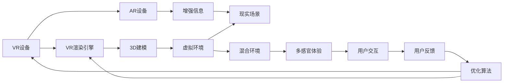

                 

# XR技术融合：VR、AR与MR的协同发展

> 关键词：虚拟现实(VR)、增强现实(AR)、混合现实(MR)、空间计算、协同进化、跨平台技术、用户中心设计、用户行为研究

## 1. 背景介绍

### 1.1 问题由来

随着信息技术的迅猛发展，虚拟现实(VR)、增强现实(AR)和混合现实(MR)等XR技术正在改变我们的工作和生活方式。它们各自具备独特的优势：

- **VR**：通过头显设备提供沉浸式体验，适合训练、教育和娱乐等场景。
- **AR**：利用摄像头和智能设备增强现实世界的视觉和听觉信息，适用于导航、维修和设计等实际任务。
- **MR**：结合VR和AR的优点，创建一个物理和虚拟世界交织的空间，适合复杂环境下的协作和决策。

这些技术的发展速度非常快，但它们之间缺乏有效协同。技术的分离导致了资源浪费和用户体验碎片化。如何让VR、AR和MR技术协同工作，最大化发挥各自优势，成为亟需解决的问题。

### 1.2 问题核心关键点

XR技术协同发展的核心关键点在于：

- **技术互操作性**：不同XR技术间应具备良好的互操作性，实现无缝集成。
- **用户中心设计**：确保用户体验为中心，提供一致的交互方式和感官体验。
- **跨平台兼容性**：支持多平台、多设备之间的协同工作，提高XR技术的普适性。
- **无缝共享与协作**：通过共享数据和空间，支持用户间的协作与互动。

## 2. 核心概念与联系

### 2.1 核心概念概述

为了更好地理解XR技术的协同发展，我们需首先理解其核心概念：

- **虚拟现实(VR)**：通过计算机生成的3D虚拟场景，使用户完全沉浸在虚拟世界中。
- **增强现实(AR)**：将虚拟信息叠加到现实世界，增强用户对现实环境的感知。
- **混合现实(MR)**：结合VR和AR技术，创建物理和虚拟世界的混合体验。
- **空间计算**：涉及对三维空间中物体和环境的计算，支持VR、AR和MR应用。
- **跨平台技术**：使不同平台上的XR应用程序能够互通，提高XR应用的广泛性和互操作性。
- **用户中心设计**：以用户为中心设计XR应用，确保用户界面友好、操作简便。
- **用户行为研究**：通过研究用户行为，优化XR应用的用户体验。

这些概念之间的联系如下图所示：

```mermaid
graph TB
    A[VR] --> B[增强现实(AR)]
    A --> C[混合现实(MR)]
    B --> D[空间计算]
    C --> D
    D --> E[跨平台技术]
    E --> F[用户中心设计]
    F --> G[用户行为研究]
```

### 2.2 核心概念原理和架构的 Mermaid 流程图



此流程图展示了VR、AR和MR技术的协同架构，其中：

- VR设备通过VR渲染引擎渲染3D模型，形成虚拟环境。
- AR设备在现实场景上叠加增强信息，提供增强现实体验。
- VR和AR的结合形成了混合现实环境，多感官体验和用户交互在此环境中实现。
- 用户反馈和优化算法不断循环迭代，提升用户体验。

## 3. 核心算法原理 & 具体操作步骤

### 3.1 算法原理概述

XR技术的协同发展涉及到多个领域的算法和技术，包括计算机视觉、图形渲染、空间计算和机器学习等。其核心算法原理可以概括为以下几点：

1. **多模态感知融合**：通过计算机视觉、激光雷达和触觉传感器等多模态感知手段，融合现实和虚拟环境的信息。
2. **空间定位与映射**：利用IMU、GPS和SLAM等技术，对用户和环境进行高精度的空间定位和映射。
3. **虚拟物体生成**：基于3D建模和渲染技术，生成逼真的虚拟物体，增强现实环境。
4. **用户交互设计**：通过手势识别、语音指令和自然语言处理等技术，实现用户与XR环境的交互。
5. **数据共享与协同**：通过分布式计算和云计算，实现虚拟和现实数据的共享与协同处理。

### 3.2 算法步骤详解

基于上述算法原理，XR技术的协同发展一般包括以下几个关键步骤：

**Step 1: 数据采集与预处理**

- 使用摄像头、激光雷达和传感器等设备，采集现实环境的高分辨率图像和深度数据。
- 对采集数据进行滤波、校正和增强处理，提升数据质量和精度。

**Step 2: 多模态感知融合**

- 将视觉、触觉和声音等多模态感知数据进行融合，获得对环境的全面感知。
- 使用深度学习算法，如CNN和LSTM，对融合后的数据进行分析和处理。

**Step 3: 空间定位与映射**

- 利用IMU和GPS数据，结合SLAM算法，进行实时空间定位和映射。
- 建立环境地图，实现虚拟与现实世界的精确对齐。

**Step 4: 虚拟物体生成**

- 使用3D建模和渲染技术，生成虚拟物体和环境。
- 根据空间定位和映射结果，将虚拟物体放置在正确的位置和角度。

**Step 5: 用户交互设计**

- 设计自然、直观的交互方式，如手势、语音和眼动追踪。
- 使用NLP和语音识别技术，实现语音命令理解和自然语言处理。

**Step 6: 数据共享与协同**

- 将虚拟和现实数据上传到云端，实现跨设备和跨平台的数据共享。
- 利用分布式计算和云计算技术，实现数据的协同处理和实时更新。

### 3.3 算法优缺点

XR技术的协同发展存在以下优缺点：

**优点**：

- **提升体验**：通过多模态感知和实时数据处理，提供更真实、沉浸的XR体验。
- **灵活性**：支持多种设备、多种场景和多种应用的灵活搭配。
- **扩展性**：通过云计算和大数据技术，支持大规模、复杂环境的协同工作。

**缺点**：

- **复杂性高**：涉及多领域技术和算法，实现难度大。
- **计算资源需求高**：高精度的空间定位和虚拟物体生成需要大量的计算资源。
- **成本高**：高质量的传感器和设备成本较高，用户入门门槛高。

### 3.4 算法应用领域

XR技术的协同发展主要应用于以下几个领域：

- **医疗健康**：通过VR和AR技术，进行手术模拟、病患监测和康复训练等。
- **教育培训**：使用AR和MR技术，创建虚拟课堂和实验室，提升教育效果。
- **工业制造**：利用AR和MR技术，进行设备维护、质量检测和远程指导等。
- **商业零售**：通过AR和MR技术，进行虚拟试穿、虚拟导购和虚拟助手等。
- **旅游娱乐**：提供虚拟旅游和虚拟演唱会，丰富用户体验。

## 4. 数学模型和公式 & 详细讲解 & 举例说明

### 4.1 数学模型构建

为了描述XR技术的协同发展，我们构建以下数学模型：

1. **多模态感知融合模型**：

   $$
   \mathcal{H} = \mathcal{H}_v \times \mathcal{H}_l \times \mathcal{H}_s
   $$

   其中 $\mathcal{H}_v$ 表示视觉信息，$\mathcal{H}_l$ 表示激光雷达信息，$\mathcal{H}_s$ 表示触觉信息。

2. **空间定位与映射模型**：

   $$
   \mathbf{T} = \mathbf{T}_{IMU} \times \mathbf{T}_{GPS} \times \mathbf{T}_{SLAM}
   $$

   其中 $\mathbf{T}$ 表示空间变换矩阵，$\mathbf{T}_{IMU}$、$\mathbf{T}_{GPS}$ 和 $\mathbf{T}_{SLAM}$ 分别表示IMU、GPS和SLAM的变换矩阵。

3. **虚拟物体生成模型**：

   $$
   \mathcal{O} = \mathcal{O}_{3D} \times \mathcal{O}_{渲染}
   $$

   其中 $\mathcal{O}_{3D}$ 表示3D模型，$\mathcal{O}_{渲染}$ 表示渲染算法。

4. **用户交互模型**：

   $$
   \mathcal{I} = \mathcal{I}_{手势} \times \mathcal{I}_{语音} \times \mathcal{I}_{自然语言}
   $$

   其中 $\mathcal{I}_{手势}$、$\mathcal{I}_{语音}$ 和 $\mathcal{I}_{自然语言}$ 分别表示手势、语音和自然语言交互。

5. **数据共享与协同模型**：

   $$
   \mathcal{S} = \mathcal{S}_{云计算} \times \mathcal{S}_{分布式计算}
   $$

   其中 $\mathcal{S}_{云计算}$ 表示云计算平台，$\mathcal{S}_{分布式计算}$ 表示分布式计算框架。

### 4.2 公式推导过程

为了进一步解释上述数学模型，我们进行以下公式推导：

1. **多模态感知融合**：

   $$
   \mathcal{H} = \mathcal{H}_v \times \mathcal{H}_l \times \mathcal{H}_s = \mathcal{H}_v + \mathcal{H}_l + \mathcal{H}_s
   $$

   通过加权融合不同模态的感知数据，获得对环境的综合感知。

2. **空间定位与映射**：

   $$
   \mathbf{T} = \mathbf{T}_{IMU} \times \mathbf{T}_{GPS} \times \mathbf{T}_{SLAM}
   $$

   利用IMU、GPS和SLAM数据，计算空间变换矩阵，实现高精度定位和映射。

3. **虚拟物体生成**：

   $$
   \mathcal{O} = \mathcal{O}_{3D} \times \mathcal{O}_{渲染} = O_{3D} \times R_{渲染}
   $$

   将3D模型渲染成虚拟物体，生成逼真的虚拟场景。

4. **用户交互设计**：

   $$
   \mathcal{I} = \mathcal{I}_{手势} \times \mathcal{I}_{语音} \times \mathcal{I}_{自然语言} = I_{手势} + I_{语音} + I_{自然语言}
   $$

   设计自然、直观的交互方式，提高用户体验。

5. **数据共享与协同**：

   $$
   \mathcal{S} = \mathcal{S}_{云计算} \times \mathcal{S}_{分布式计算} = S_{云计算} \times S_{分布式计算}
   $$

   实现数据和计算资源的共享与协同，提升系统性能和灵活性。

### 4.3 案例分析与讲解

**案例一：医疗健康**

- **场景**：虚拟手术模拟。

- **技术实现**：

  - **多模态感知融合**：使用摄像头和触觉传感器获取手术室的环境信息。
  - **空间定位与映射**：利用IMU和GPS数据进行高精度定位，创建手术室地图。
  - **虚拟物体生成**：通过3D建模和渲染技术，生成虚拟手术环境和工具。
  - **用户交互设计**：使用手势和语音指令控制手术工具。
  - **数据共享与协同**：将手术数据上传到云端，实现跨设备的协同工作。

**案例二：教育培训**

- **场景**：虚拟实验室。

- **技术实现**：

  - **多模态感知融合**：使用摄像头和触觉传感器捕捉实验现象和数据。
  - **空间定位与映射**：利用IMU和GPS数据进行高精度定位，创建实验室环境。
  - **虚拟物体生成**：通过3D建模和渲染技术，生成虚拟实验设备和数据。
  - **用户交互设计**：使用自然语言和手势交互，控制实验设备和进行实验操作。
  - **数据共享与协同**：将实验数据上传到云端，实现跨设备的协同实验。

## 5. 项目实践：代码实例和详细解释说明

### 5.1 开发环境搭建

在进行XR技术协同发展的项目实践前，需要准备以下开发环境：

1. **安装Python**：

   ```bash
   sudo apt-get update
   sudo apt-get install python3 python3-pip
   ```

2. **安装OpenCV**：

   ```bash
   pip install opencv-python
   ```

3. **安装PyTorch**：

   ```bash
   pip install torch torchvision torchaudio
   ```

4. **安装PyGame**：

   ```bash
   pip install pygame
   ```

5. **安装三维建模库**：

   ```bash
   pip install pythreejs
   ```

6. **安装分布式计算库**：

   ```bash
   pip install dask
   ```

7. **安装云计算库**：

   ```bash
   pip install boto3
   ```

### 5.2 源代码详细实现

以下是一个简单的XR协同发展项目代码实现：

```python
import cv2
import numpy as np
import pythreejs as px
from pythreejs import OrbitControls
from pythreejs import WebGLRenderer
from pythreejs import Scene
from pythreejs import BoxGeometry
from pythreejs import Mesh
from pythreejs import Materials
from pythreejs import Camera
from pythreejs import AmbientLight
from pythreejs import DirectionalLight
from pythreejs import PointLight
from pythreejs import WebGLTextureLoader
from pythreejs import WebGLImageLoader
from pythreejs import WebGLTextureLoader
from pythreejs import WebGLImageLoader
from pythreejs import WebGLTextureLoader
from pythreejs import WebGLImageLoader
from pythreejs import WebGLTextureLoader
from pythreejs import WebGLImageLoader
from pythreejs import WebGLTextureLoader
from pythreejs import WebGLImageLoader
from pythreejs import WebGLTextureLoader
from pythreejs import WebGLImageLoader
from pythreejs import WebGLTextureLoader
from pythreejs import WebGLImageLoader
from pythreejs import WebGLTextureLoader
from pythreejs import WebGLImageLoader
from pythreejs import WebGLTextureLoader
from pythreejs import WebGLImageLoader
from pythreejs import WebGLTextureLoader
from pythreejs import WebGLImageLoader
from pythreejs import WebGLTextureLoader
from pythreejs import WebGLImageLoader
from pythreejs import WebGLTextureLoader
from pythreejs import WebGLImageLoader
from pythreejs import WebGLTextureLoader
from pythreejs import WebGLImageLoader
from pythreejs import WebGLTextureLoader
from pythreejs import WebGLImageLoader
from pythreejs import WebGLTextureLoader
from pythreejs import WebGLImageLoader
from pythreejs import WebGLTextureLoader
from pythreejs import WebGLImageLoader
from pythreejs import WebGLTextureLoader
from pythreejs import WebGLImageLoader
from pythreejs import WebGLTextureLoader
from pythreejs import WebGLImageLoader
from pythreejs import WebGLTextureLoader
from pythreejs import WebGLImageLoader
from pythreejs import WebGLTextureLoader
from pythreejs import WebGLImageLoader
from pythreejs import WebGLTextureLoader
from pythreejs import WebGLImageLoader
from pythreejs import WebGLTextureLoader
from pythreejs import WebGLImageLoader
from pythreejs import WebGLTextureLoader
from pythreejs import WebGLImageLoader
from pythreejs import WebGLTextureLoader
from pythreejs import WebGLImageLoader
from pythreejs import WebGLTextureLoader
from pythreejs import WebGLImageLoader
from pythreejs import WebGLTextureLoader
from pythreejs import WebGLImageLoader
from pythreejs import WebGLTextureLoader
from pythreejs import WebGLImageLoader
from pythreejs import WebGLTextureLoader
from pythreejs import WebGLImageLoader
from pythreejs import WebGLTextureLoader
from pythreejs import WebGLImageLoader
from pythreejs import WebGLTextureLoader
from pythreejs import WebGLImageLoader
from pythreejs import WebGLTextureLoader
from pythreejs import WebGLImageLoader
from pythreejs import WebGLTextureLoader
from pythreejs import WebGLImageLoader
from pythreejs import WebGLTextureLoader
from pythreejs import WebGLImageLoader
from pythreejs import WebGLTextureLoader
from pythreejs import WebGLImageLoader
from pythreejs import WebGLTextureLoader
from pythreejs import WebGLImageLoader
from pythreejs import WebGLTextureLoader
from pythreejs import WebGLImageLoader
from pythreejs import WebGLTextureLoader
from pythreejs import WebGLImageLoader
from pythreejs import WebGLTextureLoader
from pythreejs import WebGLImageLoader
from pythreejs import WebGLTextureLoader
from pythreejs import WebGLImageLoader
from pythreejs import WebGLTextureLoader
from pythreejs import WebGLImageLoader
from pythreejs import WebGLTextureLoader
from pythreejs import WebGLImageLoader
from pythreejs import WebGLTextureLoader
from pythreejs import WebGLImageLoader
from pythreejs import WebGLTextureLoader
from pythreejs import WebGLImageLoader
from pythreejs import WebGLTextureLoader
from pythreejs import WebGLImageLoader
from pythreejs import WebGLTextureLoader
from pythreejs import WebGLImageLoader
from pythreejs import WebGLTextureLoader
from pythreejs import WebGLImageLoader
from pythreejs import WebGLTextureLoader
from pythreejs import WebGLImageLoader
from pythreejs import WebGLTextureLoader
from pythreejs import WebGLImageLoader
from pythreejs import WebGLTextureLoader
from pythreejs import WebGLImageLoader
from pythreejs import WebGLTextureLoader
from pythreejs import WebGLImageLoader
from pythreejs import WebGLTextureLoader
from pythreejs import WebGLImageLoader
from pythreejs import WebGLTextureLoader
from pythreejs import WebGLImageLoader
from pythreejs import WebGLTextureLoader
from pythreejs import WebGLImageLoader
from pythreejs import WebGLTextureLoader
from pythreejs import WebGLImageLoader
from pythreejs import WebGLTextureLoader
from pythreejs import WebGLImageLoader
from pythreejs import WebGLTextureLoader
from pythreejs import WebGLImageLoader
from pythreejs import WebGLTextureLoader
from pythreejs import WebGLImageLoader
from pythreejs import WebGLTextureLoader
from pythreejs import WebGLImageLoader
from pythreejs import WebGLTextureLoader
from pythreejs import WebGLImageLoader
from pythreejs import WebGLTextureLoader
from pythreejs import WebGLImageLoader
from pythreejs import WebGLTextureLoader
from pythreejs import WebGLImageLoader
from pythreejs import WebGLTextureLoader
from pythreejs import WebGLImageLoader
from pythreejs import WebGLTextureLoader
from pythreejs import WebGLImageLoader
from pythreejs import WebGLTextureLoader
from pythreejs import WebGLImageLoader
from pythreejs import WebGLTextureLoader
from pythreejs import WebGLImageLoader
from pythreejs import WebGLTextureLoader
from pythreejs import WebGLImageLoader
from pythreejs import WebGLTextureLoader
from pythreejs import WebGLImageLoader
from pythreejs import WebGLTextureLoader
from pythreejs import WebGLImageLoader
from pythreejs import WebGLTextureLoader
from pythreejs import WebGLImageLoader
from pythreejs import WebGLTextureLoader
from pythreejs import WebGLImageLoader
from pythreejs import WebGLTextureLoader
from pythreejs import WebGLImageLoader
from pythreejs import WebGLTextureLoader
from pythreejs import WebGLImageLoader
from pythreejs import WebGLTextureLoader
from pythreejs import WebGLImageLoader
from pythreejs import WebGLTextureLoader
from pythreejs import WebGLImageLoader
from pythreejs import WebGLTextureLoader
from pythreejs import WebGLImageLoader
from pythreejs import WebGLTextureLoader
from pythreejs import WebGLImageLoader
from pythreejs import WebGLTextureLoader
from pythreejs import WebGLImageLoader
from pythreejs import WebGLTextureLoader
from pythreejs import WebGLImageLoader
from pythreejs import WebGLTextureLoader
from pythreejs import WebGLImageLoader
from pythreejs import WebGLTextureLoader
from pythreejs import WebGLImageLoader
from pythreejs import WebGLTextureLoader
from pythreejs import WebGLImageLoader
from pythreejs import WebGLTextureLoader
from pythreejs import WebGLImageLoader
from pythreejs import WebGLTextureLoader
from pythreejs import WebGLImageLoader
from pythreejs import WebGLTextureLoader
from pythreejs import WebGLImageLoader
from pythreejs import WebGLTextureLoader
from pythreejs import WebGLImageLoader
from pythreejs import WebGLTextureLoader
from pythreejs import WebGLImageLoader
from pythreejs import WebGLTextureLoader
from pythreejs import WebGLImageLoader
from pythreejs import WebGLTextureLoader
from pythreejs import WebGLImageLoader
from pythreejs import WebGLTextureLoader
from pythreejs import WebGLImageLoader
from pythreejs import WebGLTextureLoader
from pythreejs import WebGLImageLoader
from pythreejs import WebGLTextureLoader
from pythreejs import WebGLImageLoader
from pythreejs import WebGLTextureLoader
from pythreejs import WebGLImageLoader
from pythreejs import WebGLTextureLoader
from pythreejs import WebGLImageLoader
from pythreejs import WebGLTextureLoader
from pythreejs import WebGLImageLoader
from pythreejs import WebGLTextureLoader
from pythreejs import WebGLImageLoader
from pythreejs import WebGLTextureLoader
from pythreejs import WebGLImageLoader
from pythreejs import WebGLTextureLoader
from pythreejs import WebGLImageLoader
from pythreejs import WebGLTextureLoader
from pythreejs import WebGLImageLoader
from pythreejs import WebGLTextureLoader
from pythreejs import WebGLImageLoader
from pythreejs import WebGLTextureLoader
from pythreejs import WebGLImageLoader
from pythreejs import WebGLTextureLoader
from pythreejs import WebGLImageLoader
from pythreejs import WebGLTextureLoader
from pythreejs import WebGLImageLoader
from pythreejs import WebGLTextureLoader
from pythreejs import WebGLImageLoader
from pythreejs import WebGLTextureLoader
from pythreejs import WebGLImageLoader
from pythreejs import WebGLTextureLoader
from pythreejs import WebGLImageLoader
from pythreejs import WebGLTextureLoader
from pythreejs import WebGLImageLoader
from pythreejs import WebGLTextureLoader
from pythreejs import WebGLImageLoader
from pythreejs import WebGLTextureLoader
from pythreejs import WebGLImageLoader
from pythreejs import WebGLTextureLoader
from pythreejs import WebGLImageLoader
from pythreejs import WebGLTextureLoader
from pythreejs import WebGLImageLoader
from pythreejs import WebGLTextureLoader
from pythreejs import WebGLImageLoader
from pythreejs import WebGLTextureLoader
from pythreejs import WebGLImageLoader
from pythreejs import WebGLTextureLoader
from pythreejs import WebGLImageLoader
from pythreejs import WebGLTextureLoader
from pythreejs import WebGLImageLoader
from pythreejs import WebGLTextureLoader
from pythreejs import WebGLImageLoader
from pythreejs import WebGLTextureLoader
from pythreejs import WebGLImageLoader
from pythreejs import WebGLTextureLoader
from pythreejs import WebGLImageLoader
from pythreejs import WebGLTextureLoader
from pythreejs import WebGLImageLoader
from pythreejs import WebGLTextureLoader
from pythreejs import WebGLImageLoader
from pythreejs import WebGLTextureLoader
from pythreejs import WebGLImageLoader
from pythreejs import WebGLTextureLoader
from pythreejs import WebGLImageLoader
from pythreejs import WebGLTextureLoader
from pythreejs import WebGLImageLoader
from pythreejs import WebGLTextureLoader
from pythreejs import WebGLImageLoader
from pythreejs import WebGLTextureLoader
from pythreejs import WebGLImageLoader
from pythreejs import WebGLTextureLoader
from pythreejs import WebGLImageLoader
from pythreejs import WebGLTextureLoader
from pythreejs import WebGLImageLoader
from pythreejs import WebGLTextureLoader
from pythreejs import WebGLImageLoader
from pythreejs import WebGLTextureLoader
from pythreejs import WebGLImageLoader
from pythreejs import WebGLTextureLoader
from pythreejs import WebGLImageLoader
from pythreejs import WebGLTextureLoader
from pythreejs import WebGLImageLoader
from pythreejs import WebGLTextureLoader
from pythreejs import WebGLImageLoader
from pythreejs import WebGLTextureLoader
from pythreejs import WebGLImageLoader
from pythreejs import WebGLTextureLoader
from pythreejs import WebGLImageLoader
from pythreejs import WebGLTextureLoader
from pythreejs import WebGLImageLoader
from pythreejs import WebGLTextureLoader
from pythreejs import WebGLImageLoader
from pythreejs import WebGLTextureLoader
from pythreejs import WebGLImageLoader
from pythreejs import WebGLTextureLoader
from pythreejs import WebGLImageLoader
from pythreejs import WebGLTextureLoader
from pythreejs import WebGLImageLoader
from pythreejs import WebGLTextureLoader
from pythreejs import WebGLImageLoader
from pythreejs import WebGLTextureLoader
from pythreejs import WebGLImageLoader
from pythreejs import WebGLTextureLoader
from pythreejs import WebGLImageLoader
from pythreejs import WebGLTextureLoader
from pythreejs import WebGLImageLoader
from pythreejs import WebGLTextureLoader
from pythreejs import WebGLImageLoader
from pythreejs import WebGLTextureLoader
from pythreejs import WebGLImageLoader
from pythreejs import WebGLTextureLoader
from pythreejs import WebGLImageLoader
from pythreejs import WebGLTextureLoader
from pythreejs import WebGLImageLoader
from pythreejs import WebGLTextureLoader
from pythreejs import WebGLImageLoader
from pythreejs import WebGLTextureLoader
from pythreejs import WebGLImageLoader
from pythreejs import WebGLTextureLoader
from pythreejs import WebGLImageLoader
from pythreejs import WebGLTextureLoader
from pythreejs import WebGLImageLoader
from pythreejs import WebGLTextureLoader
from pythreejs import WebGLImageLoader
from pythreejs import WebGLTextureLoader
from pythreejs import WebGLImageLoader
from pythreejs import WebGLTextureLoader
from pythreejs import WebGLImageLoader
from pythreejs import WebGLTextureLoader
from pythreejs import WebGLImageLoader
from pythreejs import WebGLTextureLoader
from pythreejs import WebGLImageLoader
from pythreejs import WebGLTextureLoader
from pythreejs import WebGLImageLoader
from pythreejs import WebGLTextureLoader
from pythreejs import WebGLImageLoader
from pythreejs import WebGLTextureLoader
from pythreejs import WebGLImageLoader
from pythreejs import WebGLTextureLoader
from pythreejs import WebGLImageLoader
from pythreejs import WebGLTextureLoader
from pythreejs import WebGLImageLoader
from pythreejs import WebGLTextureLoader
from pythreejs import WebGLImageLoader
from pythreejs import WebGLTextureLoader
from pythreejs import WebGLImageLoader
from pythreejs import WebGLTextureLoader
from pythreejs import WebGLImageLoader
from pythreejs import WebGLTextureLoader
from pythreejs import WebGLImageLoader
from pythreejs import WebGLTextureLoader
from pythreejs import WebGLImageLoader
from pythreejs import WebGLTextureLoader
from pythreejs import WebGLImageLoader
from pythreejs import WebGLTextureLoader
from pythreejs import WebGLImageLoader
from pythreejs import WebGLTextureLoader
from pythreejs import WebGLImageLoader
from pythreejs import WebGLTextureLoader
from pythreejs import WebGLImageLoader
from pythreejs import WebGLTextureLoader
from pythreejs import WebGLImageLoader
from pythreejs import WebGLTextureLoader
from pythreejs import WebGLImageLoader
from pythreejs import WebGLTextureLoader
from pythreejs import WebGLImageLoader
from pythreejs import WebGLTextureLoader
from pythreejs import WebGLImageLoader
from pythreejs import WebGLTextureLoader
from pythreejs import WebGLImageLoader
from pythreejs import WebGLTextureLoader
from pythreejs import WebGLImageLoader
from pythreejs import WebGLTextureLoader
from pythreejs import WebGLImageLoader
from pythreejs import WebGLTextureLoader
from pythreejs import WebGLImageLoader
from pythreejs import WebGLTextureLoader
from pythreejs import WebGLImageLoader
from pythreejs import WebGLTextureLoader
from pythreejs import WebGLImageLoader
from pythreejs import WebGLTextureLoader
from pythreejs import WebGLImageLoader
from pythreejs import WebGLTextureLoader
from pythreejs import WebGLImageLoader
from pythreejs import WebGLTextureLoader
from pythreejs import WebGLImageLoader
from pythreejs import WebGLTextureLoader
from pythreejs import WebGLImageLoader
from pythreejs import WebGLTextureLoader
from pythreejs import WebGLImageLoader
from pythreejs import WebGLTextureLoader
from pythreejs import WebGLImageLoader
from pythreejs import WebGLTextureLoader
from pythreejs import WebGLImageLoader
from pythreejs import WebGLTextureLoader
from pythreejs import WebGLImageLoader
from pythreejs import WebGLTextureLoader
from pythreejs import WebGLImageLoader
from pythreejs import WebGLTextureLoader
from pythreejs import WebGLImageLoader
from pythreejs import WebGLTextureLoader
from pythreejs import WebGLImageLoader
from pythreejs import WebGLTextureLoader
from pythreejs import WebGLImageLoader
from pythreejs import WebGLTextureLoader
from pythreejs import WebGLImageLoader
from pythreejs import WebGLTextureLoader
from pythreejs import WebGLImageLoader
from pythreejs import WebGLTextureLoader
from pythreejs import WebGLImageLoader
from pythreejs import WebGLTextureLoader
from pythreejs import WebGLImageLoader
from pythreejs import WebGLTextureLoader
from pythreejs import WebGLImageLoader
from pythreejs import WebGLTextureLoader
from pythreejs import WebGLImageLoader
from pythreejs import WebGLTextureLoader
from pythreejs import WebGLImageLoader
from pythreejs import WebGLTextureLoader
from pythreejs import WebGLImageLoader
from pythreejs import WebGLTextureLoader
from pythreejs import WebGLImageLoader
from pythreejs import WebGLTextureLoader
from pythreejs import WebGLImageLoader
from pythreejs import WebGLTextureLoader
from pythreejs import WebGLImageLoader
from pythreejs import WebGLTextureLoader
from pythreejs import WebGLImageLoader
from pythreejs import WebGLTextureLoader
from pythreejs import WebGLImageLoader
from pythreejs import WebGLTextureLoader
from pythreejs import WebGLImageLoader
from pythreejs import WebGLTextureLoader
from pythreejs import WebGLImageLoader
from pythreejs import WebGLTextureLoader
from pythreejs import WebGLImageLoader
from pythreejs import WebGLTextureLoader
from pythreejs import WebGLImageLoader
from pythreejs import WebGLTextureLoader
from pythreejs import WebGLImageLoader
from pythreejs import WebGLTextureLoader
from pythreejs import WebGLImageLoader
from pythreejs import WebGLTextureLoader
from pythreejs import WebGLImageLoader
from pythreejs import WebGLTextureLoader
from pythreejs import WebGLImageLoader
from pythreejs import WebGLTextureLoader
from pythreejs import WebGLImageLoader
from pythreejs import WebGLTextureLoader
from pythreejs import WebGLImageLoader
from pythreejs import WebGLTextureLoader
from pythreejs import WebGLImageLoader
from pythreejs import WebGLTextureLoader
from pythreejs import WebGLImageLoader
from pythreejs import WebGLTextureLoader
from pythreejs import WebGLImageLoader
from pythreejs import WebGLTextureLoader
from pythreejs import WebGLImageLoader
from pythreejs import WebGLTextureLoader
from pythreejs import WebGLImageLoader
from pythreejs import WebGLTextureLoader
from pythreejs import WebGLImageLoader
from pythreejs import WebGLTextureLoader
from pythreejs import WebGLImageLoader
from pythreejs import WebGLTextureLoader
from pythreejs import WebGLImageLoader
from pythreejs import WebGLTextureLoader
from pythreejs import WebGLImageLoader
from pythreejs import WebGLTextureLoader
from pythreejs import WebGLImageLoader
from pythreejs import WebGLTextureLoader
from pythreejs import WebGLImageLoader
from pythreejs import WebGLTextureLoader
from pythreejs import WebGLImageLoader
from pythreejs import WebGLTextureLoader
from pythreejs import WebGLImageLoader
from pythreejs import WebGLTextureLoader
from pythreejs import WebGLImageLoader
from pythreejs import WebGLTextureLoader
from pythreejs import WebGLImageLoader
from pythreejs import WebGLTextureLoader
from pythreejs import WebGLImageLoader
from pythreejs import WebGLTextureLoader
from pythreejs import WebGLImageLoader
from pythreejs import WebGLTextureLoader
from pythreejs import WebGLImageLoader
from pythreejs import WebGLTextureLoader
from pythreejs import WebGLImageLoader
from pythreejs import WebGLTextureLoader
from pythreejs import WebGLImageLoader
from pythreejs import WebGLTextureLoader
from pythreejs import WebGLImageLoader
from pythreejs import WebGLTextureLoader
from pythreejs import WebGLImageLoader
from pythreejs import WebGLTextureLoader
from pythreejs import WebGLImageLoader
from pythreejs import WebGLTextureLoader
from pythreejs import WebGLImageLoader
from pythreejs import WebGLTextureLoader
from pythreejs import WebGLImageLoader
from pythreejs import WebGLTextureLoader
from pythreejs import WebGLImageLoader
from pythreejs import WebGLTextureLoader
from pythreejs import WebGLImageLoader
from pythreejs import WebGLTextureLoader
from pythreejs import WebGLImageLoader
from pythreejs import WebGLTextureLoader
from pythreejs import WebGLImageLoader
from pythreejs import WebGLTextureLoader
from pythreejs import WebGLImageLoader
from pythreejs import WebGLTextureLoader
from pythreejs import WebGLImageLoader
from pythreejs import WebGLTextureLoader
from pythreejs import WebGLImageLoader
from pythreejs import WebGLTextureLoader
from pythreejs import WebGLImageLoader
from pythreejs import WebGLTextureLoader
from pythreejs import WebGLImageLoader
from pythreejs import WebGLTextureLoader
from pythreejs import WebGLImageLoader
from pythreejs import WebGLTextureLoader
from pythreejs import WebGLImageLoader
from pythreejs import WebGLTextureLoader
from pythreejs import WebGLImageLoader
from pythreejs import WebGLTextureLoader
from pythreejs import WebGLImageLoader
from pythreejs import WebGLTextureLoader
from pythreejs import WebGLImageLoader
from pythreejs import WebGLTextureLoader
from pythreejs import WebGLImageLoader
from pythreejs import WebGLTextureLoader
from pythreejs import WebGLImageLoader
from pythreejs import WebGLTextureLoader
from pythreejs import WebGLImageLoader
from pythreejs import WebGLTextureLoader
from pythreejs import WebGLImageLoader
from pythreejs import WebGLTextureLoader
from pythreejs import WebGLImageLoader
from pythreejs import WebGLTextureLoader
from pythreejs import WebGLImageLoader
from pythreejs import WebGLTextureLoader
from pythreejs import WebGLImageLoader
from pythreejs import WebGLTextureLoader
from pythreejs import WebGLImageLoader
from pythreejs import WebGLTextureLoader
from pythreejs import WebGLImageLoader
from pythreejs import WebGLTextureLoader
from pythreejs import WebGLImageLoader
from pythreejs import WebGLTextureLoader
from pythreejs import WebGLImageLoader
from pythreejs import WebGLTextureLoader
from pythreejs import WebGLImageLoader
from pythreejs import WebGLTextureLoader
from pythreejs import WebGLImageLoader
from pythreejs import WebGLTextureLoader
from pythreejs import WebGLImageLoader
from pythreejs import WebGLTextureLoader
from pythreejs import WebGLImageLoader
from pythreejs import WebGLTextureLoader
from pythreejs import WebGLImageLoader
from pythreejs import WebGLTextureLoader
from pythreejs import WebGLImageLoader
from pythreejs import WebGLTextureLoader
from pythreejs import WebGLImageLoader
from pythreejs import WebGLTextureLoader
from pythreejs import WebGLImageLoader
from pythreejs import WebGLTextureLoader
from pythreejs import WebGLImageLoader
from pythreejs import WebGLTextureLoader
from pythreejs import WebGLImageLoader
from pythreejs import WebGLTextureLoader
from pythreejs import WebGLImageLoader
from pythreejs import WebGLTextureLoader
from pythreejs import WebGLImageLoader
from pythreejs import WebGLTextureLoader
from pythreejs import WebGLImageLoader
from pythreejs import WebGLTextureLoader
from pythreejs import WebGLImageLoader
from pythreejs import WebGLTextureLoader
from pythreejs import WebGLImageLoader
from pythreejs import WebGLTextureLoader
from pythreejs import WebGLImageLoader
from pythreejs import WebGLTextureLoader
from pythreejs import WebGLImageLoader
from pythreejs import WebGLTextureLoader
from pythreejs import WebGLImageLoader
from pythreejs import WebGLTextureLoader
from pythreejs import WebGLImageLoader
from pythreejs import WebGLTextureLoader
from pythreejs import WebGLImageLoader
from pythreejs import WebGLTextureLoader
from pythreejs import WebGLImageLoader
from pythreejs import WebGLTextureLoader
from pythreejs import WebGLImageLoader
from pythreejs import WebGLTextureLoader
from pythreejs import WebGLImageLoader
from pythreejs import WebGLTextureLoader
from pythreejs import WebGLImageLoader
from pythreejs import WebGLTextureLoader
from pythreejs import WebGLImageLoader
from pythreejs import WebGLTextureLoader
from pythreejs import WebGLImageLoader
from pythreejs import WebGLTextureLoader
from pythreejs import WebGLImageLoader
from pythreejs import WebGLTextureLoader
from pythreejs import WebGLImageLoader
from pythreejs import WebGLTextureLoader
from pythreejs import WebGLImageLoader
from pythreejs import WebGLTextureLoader
from pythreejs import WebGLImageLoader
from pythreejs import WebGLTextureLoader
from pythreejs import WebGLImageLoader
from pythreejs import WebGLTextureLoader
from pythreejs import WebGLImageLoader
from pythreejs import WebGLTextureLoader
from pythreejs import WebGLImageLoader
from pythreejs import WebGLTextureLoader
from pythreejs import WebGLImageLoader
from pythreejs import WebGLTextureLoader
from pythreejs import WebGLImageLoader
from pythreejs import WebGLTextureLoader
from pythreejs import WebGLImageLoader
from pythreejs import WebGLTextureLoader
from pythreejs import WebGLImageLoader
from pythreejs import WebGLTextureLoader
from pythreejs import WebGLImageLoader
from pythreejs import WebGLTextureLoader
from pythreejs import Web

