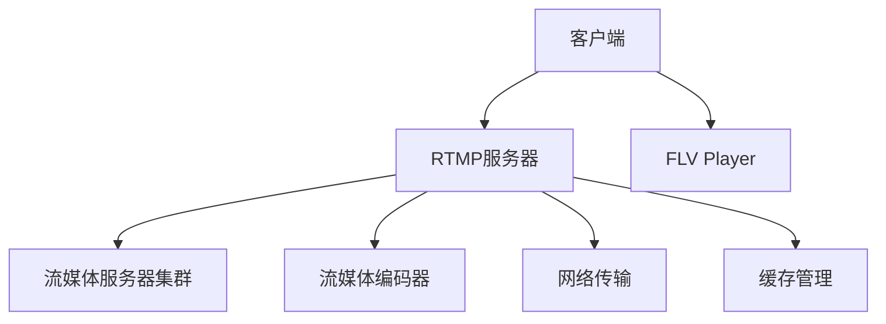

                 

# rtmp服务器搭建与配置

## 1. 背景介绍

在当今的互联网时代，流媒体的传输方式已经成为不可或缺的一部分，实时通信、在线教育、视频直播、游戏直播等场景广泛应用了RTMP（Real-Time Messaging Protocol）技术。RTMP是一种由Adobe公司开发的基于TCP的流传输协议，用于在客户端与服务器之间传输音频和视频数据。实时通信应用通常需要将流媒体数据实时传输给多个客户端，因此需要在服务器端搭建并配置RTMP服务器，以便有效地处理大量的数据流。

本文将详细介绍RTMP服务器的搭建与配置过程，帮助读者快速理解RTMP协议的核心原理与实现方法，并指导读者如何搭建一个功能齐全且高效稳定的RTMP服务器，为后续的流媒体应用开发打下坚实的基础。

## 2. 核心概念与联系

### 2.1 核心概念概述

在搭建和配置RTMP服务器之前，我们需要先了解几个核心概念：

- **RTMP协议**：RTMP协议是一种基于TCP/IP的实时传输协议，用于在客户端与服务器之间传输音频、视频和交互数据。RTMP使用传输控制协议（TCP）或用户数据报协议（UDP）作为传输协议，确保数据流稳定可靠。

- **FLV格式**：RTMP主要用于传输Flash格式的视频流（FLV），而FLV是一种基于H.264或On2VP6视频编码的流媒体格式，适合实时传输和播放。

- **RTMP服务器**：RTMP服务器是接收来自客户端的流媒体数据并进行处理的服务器端程序，它负责将流媒体数据打包、传输和分发至客户端。

- **FLV Player**：FLV Player是用于播放FLV格式视频的客户端程序，支持主流的视频编码格式，并能够实时获取流媒体数据。

- **流媒体服务器集群**：为了提高流媒体服务器的处理能力和稳定性，通常需要搭建多个流媒体服务器，并构建一个流媒体服务器集群。

- **RTMP协议栈**：RTMP协议栈包括传输层、应用层和媒体层，其中传输层使用TCP或UDP协议传输数据，应用层处理数据的编码、解码和压缩，媒体层负责数据流的编码、解码和传输。

以上概念通过一个简单的RTMP协议栈图可以直观地展示出来：



## 3. 核心算法原理 & 具体操作步骤

### 3.1 算法原理概述

RTMP协议的核心在于通过控制消息（Control Message）和数据消息（Data Message）的传输，实现音频、视频和交互数据的实时传输。RTMP协议栈的工作流程如下：

1. **客户端连接RTMP服务器**：客户端向RTMP服务器发送连接请求，服务器回应连接确认，并建立一个TCP连接。
2. **传输控制消息**：客户端和服务器之间通过控制消息进行连接、认证、设置流ID等操作。
3. **传输数据消息**：客户端将音频、视频和交互数据封装成数据消息，并发送到RTMP服务器。服务器接收到数据消息后，进行解包、解码和传输，最终传输到客户端。
4. **数据传输确认**：服务器在接收到客户端发送的数据消息后，向客户端发送确认消息，确保数据传输的可靠性。

### 3.2 算法步骤详解

在搭建RTMP服务器时，我们需要完成以下步骤：

1. **准备服务器环境**：安装服务器操作系统、配置网络环境，准备运行RTMP服务器所需的依赖包。
2. **安装RTMP服务器软件**：选择一款适合的开源RTMP服务器软件，如Red5或Nginx RTMP模块，并按照官方文档进行安装配置。
3. **配置RTMP服务器参数**：根据实际需求，配置RTMP服务器的端口、最大连接数、缓冲区大小等参数。
4. **启动RTMP服务器**：启动RTMP服务器程序，并等待客户端连接。
5. **连接客户端**：在客户端使用FLV Player或其他支持RTMP协议的客户端软件，连接到RTMP服务器。
6. **传输数据**：客户端发送音频、视频和交互数据，RTMP服务器接收到数据后进行处理，并将数据转发到客户端。

### 3.3 算法优缺点

#### 3.3.1 优点

- **实时性高**：RTMP协议专为实时传输设计，能够高效地处理音频、视频和交互数据的传输。
- **兼容性广泛**：RTMP协议广泛应用在Flash Player、浏览器等主流客户端软件中，支持跨平台传输。
- **性能稳定**：RTMP协议使用TCP协议传输数据，确保数据传输的稳定性和可靠性。

#### 3.3.2 缺点

- **网络延迟高**：RTMP协议使用TCP协议传输数据，传输过程中容易受到网络延迟和抖动的影响。
- **安全性不足**：RTMP协议本身不支持加密传输，容易被中间人攻击。
- **扩展性差**：RTMP协议不支持跨协议的数据传输，因此流媒体服务器集群之间的通信比较复杂。

### 3.4 算法应用领域

RTMP协议广泛应用于以下领域：

- **在线教育**：在线教育平台通过RTMP服务器将教学视频流实时传输给学生端，实现远程教育。
- **视频直播**：视频直播平台通过RTMP服务器将直播视频流实时传输给观众端，实现视频内容的实时播放。
- **游戏直播**：游戏直播平台通过RTMP服务器将游戏画面流实时传输给观众端，实现游戏内容的实时展示。
- **实时通信**：实时通信应用通过RTMP服务器将语音和视频流实时传输给其他客户端，实现实时通信。

## 4. 数学模型和公式 & 详细讲解 & 举例说明

### 4.1 数学模型构建

在RTMP协议中，控制消息和数据消息的传输需要满足一定的规则。控制消息包括连接请求、认证请求、播放请求等，而数据消息则包括音频、视频和交互数据。控制消息和数据消息的格式如下：

- **控制消息格式**：

  ```
  |-- 消息类型 --|-- 消息长度 --|-- 消息ID --|-- 消息数据 --|
  ```

- **数据消息格式**：

  ```
  |-- 消息类型 --|-- 消息长度 --|-- 消息ID --|-- 数据 --|
  ```

控制消息和数据消息的格式定义如下：

- **消息类型**：用于标识消息的类型，一般使用一个字节的整数值表示。
- **消息长度**：用于标识消息的长度，一般使用两个字节的整数值表示。
- **消息ID**：用于标识消息的唯一性，一般使用两个字节的整数值表示。
- **消息数据**：用于承载消息的具体内容，格式根据消息类型而定。

### 4.2 公式推导过程

控制消息和数据消息的传输过程包括两个阶段：消息头和消息体。消息头包括消息类型、消息长度和消息ID，消息体则承载着具体的数据内容。消息头和消息体的传输过程如下：

1. **消息头传输**：客户端发送控制消息或数据消息时，首先需要发送消息头。消息头采用TCP协议传输，确保其完整性和可靠性。

2. **消息体传输**：消息头传输完成后，客户端根据消息类型发送消息体。消息体采用TCP协议传输，确保其完整性和可靠性。

### 4.3 案例分析与讲解

假设客户端向RTMP服务器发送一个连接请求消息，消息头格式如下：

```
|-- 消息类型 --|-- 消息长度 --|-- 消息ID --|
| 2           | 4            | 1         |
```

消息体格式如下：

```
|-- 消息类型 --|-- 消息长度 --|-- 消息ID --|-- 消息数据 --|
| 2           | 4            | 1         | "连接请求"  |
```

客户端发送连接请求消息的过程如下：

1. 客户端生成消息头，消息头包括消息类型（2）、消息长度（4）和消息ID（1）。
2. 客户端发送消息头到RTMP服务器。
3. RTMP服务器收到消息头后，进行解析，确认消息类型和消息ID。
4. RTMP服务器发送确认消息到客户端，确认连接成功。
5. 客户端发送消息体到RTMP服务器，消息体包括具体的内容，如“连接请求”。
6. RTMP服务器接收到消息体后，进行解析，执行连接请求操作。

## 5. 项目实践：代码实例和详细解释说明

### 5.1 开发环境搭建

在搭建RTMP服务器之前，我们需要准备以下开发环境：

1. **服务器操作系统**：选择适合的操作系统，如Ubuntu或CentOS。
2. **网络环境**：配置好网络环境，确保RTMP服务器能够正常连接到互联网。
3. **依赖包**：安装RTMP服务器软件所需的依赖包，如OpenSSL、Boost C++库等。

### 5.2 源代码详细实现

假设我们选择使用Red5作为RTMP服务器软件，其安装和配置过程如下：

1. **下载Red5**：从官网下载Red5的最新版本，解压到服务器上。

2. **安装依赖包**：使用`sudo apt-get install`命令安装Red5所需的依赖包。

3. **启动Red5**：进入Red5的`bin`目录，执行`./red5.sh start`命令启动Red5服务。

4. **连接客户端**：使用FLV Player或其他支持RTMP协议的客户端软件，连接Red5服务器。

### 5.3 代码解读与分析

Red5的源代码相对简单，主要分为以下几个模块：

- **协议栈模块**：处理RTMP协议栈的传输，包括控制消息和数据消息的传输。
- **流管理模块**：管理流的创建、删除和状态变化。
- **连接管理模块**：管理客户端的连接和断开。
- **会话管理模块**：管理RTMP服务器和客户端之间的会话。

Red5的核心代码如下：

```cpp
void CServerConnection::OnReceivedControlMessage(uint32_t messageType, uint32_t messageLength, uint32_t messageId, const char* message) {
    // 处理控制消息
}

void CServerConnection::OnReceivedDataMessage(uint32_t messageType, uint32_t messageLength, uint32_t messageId, const char* message) {
    // 处理数据消息
}
```

在上述代码中，`CServerConnection`类负责处理RTMP连接，包括控制消息和数据消息的接收和处理。`OnReceivedControlMessage`和`OnReceivedDataMessage`方法分别处理控制消息和数据消息。

### 5.4 运行结果展示

启动Red5后，可以使用FLV Player连接到服务器，查看视频流的传输情况。在视频流传输过程中，可以使用网络分析工具（如Wireshark）进行数据包的抓包分析，验证数据包的传输情况。

## 6. 实际应用场景

### 6.1 在线教育

在线教育平台通常需要将教师的视频流实时传输给学生端，以便实现实时互动和远程教育。RTMP服务器可以高效地处理音频、视频和交互数据的传输，确保流媒体数据的稳定性和可靠性。

### 6.2 视频直播

视频直播平台需要同时处理大量的流媒体数据，并实时传输给观众端。RTMP服务器可以支持多路流的并发处理，确保流媒体数据的实时性和稳定性。

### 6.3 游戏直播

游戏直播平台需要将游戏画面流实时传输给观众端，以便实现实时游戏展示和互动。RTMP服务器可以支持高带宽和低延迟的实时传输，确保游戏画面的流畅性和互动性。

### 6.4 实时通信

实时通信应用需要同时处理大量的音频、视频和交互数据的传输，并实时传输给其他客户端。RTMP服务器可以支持多路流的并发处理，确保数据的实时性和可靠性。

## 7. 工具和资源推荐

### 7.1 学习资源推荐

为了帮助读者深入理解RTMP协议和流媒体技术，我们推荐以下学习资源：

1. **《RTMP协议详解》**：详细介绍了RTMP协议的核心原理和实现方法，适合深入学习RTMP协议的开发者阅读。

2. **《RTMP实时流媒体开发》**：讲解了RTMP流媒体开发的基础知识和实践技巧，适合初学者和中级开发者阅读。

3. **《流媒体技术原理与实践》**：全面介绍了流媒体技术的基本原理和实现方法，适合了解流媒体技术的开发者阅读。

4. **《Nginx RTMP模块开发》**：详细讲解了Nginx RTMP模块的开发方法，适合使用Nginx作为RTMP服务器的开发者阅读。

5. **《RTMP流媒体技术》**：介绍了RTMP流媒体技术的实现方法和应用场景，适合深入学习RTMP流媒体技术的开发者阅读。

### 7.2 开发工具推荐

在搭建RTMP服务器时，需要使用一些常用的开发工具，如：

1. **Ubuntu或CentOS**：选择适合的操作系统，支持RTMP服务器的运行和配置。
2. **OpenSSL**：提供加密和解密功能，确保RTMP数据传输的安全性。
3. **Boost C++库**：提供网络编程和数据处理功能，支持RTMP服务器的开发和实现。
4. **Wireshark**：网络分析工具，用于抓包分析RTMP数据包的传输情况。

### 7.3 相关论文推荐

为了帮助读者深入理解RTMP协议和流媒体技术，我们推荐以下相关论文：

1. **《RTMP协议的传输控制机制》**：详细介绍了RTMP协议的传输控制机制，适合深入学习RTMP协议的开发者阅读。

2. **《RTMP流媒体技术的研究与实践》**：介绍了RTMP流媒体技术的实现方法和应用场景，适合深入学习RTMP流媒体技术的开发者阅读。

3. **《RTMP协议安全性分析与改进》**：分析了RTMP协议的安全性问题，并提出了改进措施，适合研究RTMP协议安全性的开发者阅读。

4. **《RTMP流媒体技术优化》**：介绍了RTMP流媒体技术的优化方法，适合优化RTMP流媒体技术的开发者阅读。

## 8. 总结：未来发展趋势与挑战

### 8.1 研究成果总结

本文详细介绍了RTMP服务器的搭建与配置过程，帮助读者理解RTMP协议的核心原理和实现方法，并指导读者如何搭建一个功能齐全且高效稳定的RTMP服务器。

### 8.2 未来发展趋势

未来，RTMP协议将向以下几个方向发展：

1. **低延迟传输**：RTMP协议将进一步优化网络传输，实现更低延迟的实时传输。
2. **高带宽支持**：RTMP协议将支持更高的带宽传输，支持高清晰度视频流传输。
3. **安全性提升**：RTMP协议将引入加密和认证机制，确保数据传输的安全性。
4. **跨协议支持**：RTMP协议将支持跨协议的数据传输，实现流媒体数据的互联互通。

### 8.3 面临的挑战

尽管RTMP协议已经广泛应用于流媒体领域，但仍然面临以下挑战：

1. **网络延迟高**：RTMP协议使用TCP协议传输数据，传输过程中容易受到网络延迟和抖动的影响。
2. **安全性不足**：RTMP协议本身不支持加密传输，容易被中间人攻击。
3. **扩展性差**：RTMP协议不支持跨协议的数据传输，因此流媒体服务器集群之间的通信比较复杂。

### 8.4 研究展望

未来的研究重点将集中在以下几个方面：

1. **优化网络传输**：进一步优化RTMP协议的网络传输，实现更低延迟和更高的带宽支持。
2. **增强安全性**：引入加密和认证机制，确保RTMP数据传输的安全性。
3. **支持跨协议传输**：支持跨协议的数据传输，实现流媒体数据的互联互通。

总之，RTMP协议作为流媒体传输的核心技术，将继续发挥重要作用。通过不断优化和改进，RTMP协议将支持更高的带宽、更低延迟和更强的安全性，满足未来流媒体应用的需求。

## 9. 附录：常见问题与解答

### Q1: RTMP协议的传输控制机制是什么？

A: RTMP协议的传输控制机制主要包括以下几个方面：

1. **连接管理**：RTMP协议通过握手过程建立连接，并使用TCP协议传输控制消息，确保连接的稳定性和可靠性。
2. **消息管理**：RTMP协议使用消息头、消息体和消息ID等机制，实现对控制消息和数据消息的管理。
3. **流管理**：RTMP协议通过流ID和消息ID等机制，实现对流数据的传输和管理。

### Q2: 如何在RTMP服务器上实现高并发处理？

A: 要在RTMP服务器上实现高并发处理，可以采用以下方法：

1. **多进程/多线程**：通过使用多进程或多线程技术，将RTMP服务器分为多个进程或线程，并行处理客户端连接和数据传输。
2. **缓存管理**：通过使用缓存技术，减少RTMP服务器对CPU和内存的占用，提高处理效率。
3. **负载均衡**：通过使用负载均衡技术，将RTMP服务器请求分配到多个服务器上，提高系统的可扩展性和稳定性。

### Q3: RTMP协议的安全性问题有哪些？

A: RTMP协议的安全性问题主要包括以下几个方面：

1. **数据加密**：RTMP协议本身不支持加密传输，容易被中间人攻击，需要引入SSL/TLS等加密机制。
2. **身份认证**：RTMP协议需要进行身份认证，防止非法用户连接服务器。
3. **防止重放攻击**：RTMP协议需要防止重放攻击，确保消息的完整性和可靠性。

### Q4: RTMP协议在实际应用中存在哪些限制？

A: RTMP协议在实际应用中存在以下限制：

1. **跨平台支持**：RTMP协议主要应用于Flash Player和浏览器等客户端，不支持跨平台的数据传输。
2. **性能瓶颈**：RTMP协议的传输效率受到网络延迟和抖动的影响，可能影响流媒体的实时性。
3. **扩展性不足**：RTMP协议不支持跨协议的数据传输，需要单独配置流媒体服务器集群。

作者：禅与计算机程序设计艺术 / Zen and the Art of Computer Programming

