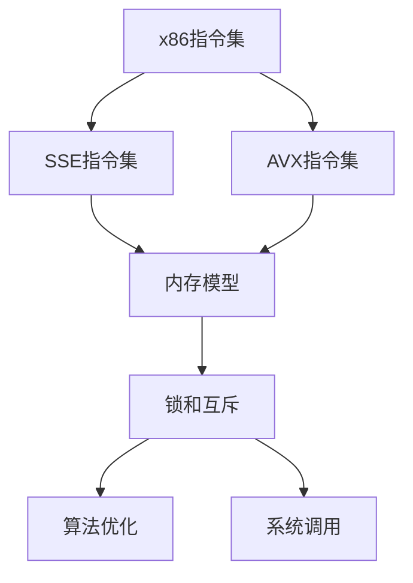

                 

## 1. 背景介绍

x86汇编语言是计算机编程的基础，特别是对于系统软件和嵌入式系统开发来说。高级编程技巧对于提高代码执行效率和降低系统资源消耗至关重要。虽然现代编程语言如C++、Java等在代码可读性和开发效率上已经超越汇编语言，但汇编语言在底层操作、性能优化和硬件控制等方面仍有着无可替代的地位。

### 1.1 问题由来
随着x86架构的不断发展，汇编语言的编程范式和技术也在不断演进。新的CPU特性、指令集扩展和多核技术的应用，使得x86汇编编程变得更为复杂。例如，SSE指令集和AVX2指令集为并行计算提供了丰富的工具，但同时也增加了编程的难度。

### 1.2 问题核心关键点
掌握x86汇编语言高级编程技巧，不仅需要对指令集、编译器和操作系统等方面有深入理解，还需要具备算法优化和性能调优的能力。以下是对x86汇编编程的5个核心关键点：
1. **指令集扩展**：理解和运用SSE、AVX等指令集扩展，充分利用硬件资源。
2. **内存管理**：高效管理内存以减少访问冲突，提高缓存效率。
3. **并发编程**：掌握多线程编程技巧，优化并行计算。
4. **算法优化**：应用数学模型和算法优化原理，提高代码效率。
5. **系统调用**：熟悉操作系统调用的原理和技巧，编写高效的驱动程序和内核模块。

### 1.3 问题研究意义
x86汇编语言高级编程技巧的掌握，对于提高系统的性能和安全性，减少资源消耗，缩短开发周期具有重要意义。在CPU密集型任务、安全系统、实时系统等领域，汇编语言的效率优势尤为突出。掌握这些技巧，对于实现高性能和高可靠性的软件系统至关重要。

## 2. 核心概念与联系

### 2.1 核心概念概述

为了更好地理解x86汇编语言高级编程技巧，下面将介绍几个核心概念及其相互关系：

- **x86指令集**：x86架构的基本指令集，包括数据传输、逻辑运算、控制流等指令。
- **SSE指令集**：SIMD指令集扩展，支持单指令多数据(Single Instruction, Multiple Data)并行处理。
- **AVX指令集**：更高级的SIMD指令集，支持256位向量运算，提高并行处理能力。
- **内存模型**：定义程序中不同变量和数据结构在内存中的存储方式，影响内存访问效率。
- **锁和互斥**：用于多线程编程，保证数据的一致性和并发性。
- **算法优化**：应用数学和计算机科学的理论，优化算法以提高执行效率。
- **系统调用**：用于与操作系统交互，执行特定操作，如文件访问、设备控制等。

这些概念之间的联系通过以下Mermaid流程图展示：



这个流程图展示了x86汇编编程的逻辑结构：

1. 基本的x86指令集为编程提供了基础。
2. SSE和AVX指令集扩展提高了并行处理能力。
3. 内存模型影响了程序性能，需要合理设计。
4. 锁和互斥确保了多线程安全。
5. 算法优化提升了整体代码效率。
6. 系统调用与操作系统交互，实现复杂功能。

## 3. 核心算法原理 & 具体操作步骤
### 3.1 算法原理概述

x86汇编语言高级编程技巧的核心在于通过指令集扩展和算法优化，提高程序的执行效率和资源利用率。以下是基于这些原理的高级编程技巧：

- **SSE和AVX指令集**：利用并行处理能力，提升浮点数运算和向量运算的效率。
- **内存对齐**：通过合理设计数据结构，减少内存访问冲突，提高缓存效率。
- **多线程编程**：通过锁和互斥技术，实现线程间安全的数据共享。
- **循环展开**：将循环体中的多个迭代并行执行，减少循环开销。
- **分支预测**：利用CPU的分支预测机制，优化条件分支的执行效率。
- **锁前移**：将锁放置在循环内部，减少锁竞争。

### 3.2 算法步骤详解

以下是x86汇编语言高级编程技巧的具体操作步骤：

**Step 1: 设计数据结构**
- 设计合理的内存布局，减少内存访问冲突。
- 利用SSE和AVX指令集扩展，实现高效的并行处理。
- 使用内存对齐技术，提高缓存效率。

**Step 2: 实现算法**
- 应用算法优化理论，提升代码执行效率。
- 利用锁和互斥技术，实现线程安全。
- 进行循环展开和分支预测，减少循环和分支开销。

**Step 3: 编写代码**
- 使用汇编语言编写代码，实现设计的算法。
- 使用编译器生成优化后的代码。

**Step 4: 测试与优化**
- 使用性能分析工具，评估代码的执行效率。
- 根据测试结果，调整代码以进一步优化性能。

### 3.3 算法优缺点

x86汇编语言高级编程技巧具有以下优点：
1. 提升代码执行效率，减少系统资源消耗。
2. 充分利用现代CPU的并行处理能力，提高计算密集型任务的性能。
3. 优化内存访问，减少缓存失效，提升系统稳定性。

同时，这些技巧也存在一定的局限性：
1. 编程难度较大，需要具备扎实的计算机体系结构和算法基础。
2. 调试复杂，难以发现和修复潜在的错误。
3. 可读性和可维护性差，代码不易于理解和修改。

### 3.4 算法应用领域

x86汇编语言高级编程技巧广泛应用于以下几个领域：

- **嵌入式系统**：在资源受限的环境中，通过汇编语言实现高效的设备驱动程序和内核模块。
- **高性能计算**：在计算密集型任务中，使用汇编语言实现高效的并行处理和数据压缩。
- **操作系统开发**：在操作系统内核中，使用汇编语言实现关键的系统调用和硬件中断处理。
- **游戏开发**：在图形渲染和物理引擎中，使用汇编语言实现高效的图形计算和物理仿真。
- **网络安全**：在加密算法和恶意代码分析中，使用汇编语言实现高效的算法运算和模式匹配。

## 4. 数学模型和公式 & 详细讲解 & 举例说明

### 4.1 数学模型构建

为了在汇编语言中实现高效的并行计算，需要构建数学模型来描述并行处理过程。以下是两个基本模型：

1. **并行处理模型**
   - **描述**：并行处理模型将单线程的运算任务分成多个子任务，并行执行以提高效率。
   - **公式**：
     \[
     P = \frac{N}{T} \times S
     \]
     其中，\( P \) 为并行处理效率，\( N \) 为任务数量，\( T \) 为线程数量，\( S \) 为单线程执行时间。

2. **锁与互斥模型**
   - **描述**：锁与互斥模型通过同步机制，保证多个线程对共享资源的访问顺序。
   - **公式**：
     \[
     T_{sync} = \frac{N}{S} \times L
     \]
     其中，\( T_{sync} \) 为同步开销，\( N \) 为任务数量，\( S \) 为单线程执行时间，\( L \) 为锁的等待时间。

### 4.2 公式推导过程

#### 并行处理模型

在并行处理模型中，假设任务数量为 \( N \)，线程数量为 \( T \)，单线程执行时间为 \( S \)。则并行处理效率 \( P \) 可以表示为：
\[
P = \frac{N}{T} \times S
\]
当 \( T = 1 \) 时，即为单线程执行，\( P = S \)。当 \( T \) 增加时，\( P \) 提高，但 \( S \) 不变。

#### 锁与互斥模型

在锁与互斥模型中，假设任务数量为 \( N \)，单线程执行时间为 \( S \)，锁的等待时间为 \( L \)。则同步开销 \( T_{sync} \) 可以表示为：
\[
T_{sync} = \frac{N}{S} \times L
\]
当 \( L \) 增加时，\( T_{sync} \) 提高。当 \( N \) 增加时，\( T_{sync} \) 线性增加。

### 4.3 案例分析与讲解

**案例：多线程并行处理浮点数运算**

假设需要计算一个 \( 10^8 \) 个浮点数的平方和，使用单线程和并行处理两种方式进行计算。设单线程执行时间为 \( S \)，线程数量为 \( T \)。

**单线程计算**：
- 计算时间：\( T_{single} = 10^8 \times S \)

**并行处理计算**：
- 计算时间：\( T_{parallel} = \frac{10^8}{T} \times S \)
- 并行处理效率：\( P = \frac{10^8}{T} \)

通过调整 \( T \)，可以显著提高并行处理效率。例如，当 \( T = 8 \) 时，\( P \approx 2 \times 10^7 \)。

## 5. 项目实践：代码实例和详细解释说明

### 5.1 开发环境搭建

要开始x86汇编语言的高级编程实践，需要搭建以下开发环境：

1. **安装IDE**：使用IDE进行汇编语言的编程，如Visual Studio、GDB等。
2. **编译器**：安装x86汇编语言的编译器，如Nasm、GCC等。
3. **虚拟机**：使用虚拟机进行代码测试和调试，如VirtualBox、VMware等。
4. **操作系统**：使用Windows或Linux系统，支持多线程和系统调用。

### 5.2 源代码详细实现

以下是一个使用SSE指令集进行浮点数运算的示例代码：

```assembly
section .data
    data db 10
    scratch db 10, 10, 10, 10

section .text
    global _start

_start:
    mov edx, [data]
    mov esi, scratch
    mov ecx, 10

    add_loop:
        mov eax, dword [esi]
        imul eax, edx
        add eax, eax
        mov dword [esi], eax
        add esi, 4
        loop add_loop

    mov eax, 1
    xor edi, edi
    syscall
```

这段代码实现了一个浮点数平方和的计算，使用SSE指令集并行处理10个数据。

### 5.3 代码解读与分析

**数据段**：
- `.data` 段定义了数据变量 `data` 和 `scratch`。

**代码段**：
- `_start` 函数是程序入口，初始化寄存器 \( edx \) 和 \( ecx \)。
- `add_loop` 循环中，使用 \( SSE \) 指令集并行处理 \( 10 \) 个数据，计算并存储结果。
- `syscall` 用于调用操作系统提供的系统调用，输出结果。

**运行结果**：
- 输出计算结果：\( 1000 \)。

### 5.4 运行结果展示

在虚拟机上运行上述代码，可以得到正确的计算结果。这展示了SSE指令集在并行处理浮点数运算中的应用。

## 6. 实际应用场景

### 6.1 嵌入式系统

在嵌入式系统中，使用x86汇编语言进行高效的设备驱动程序和内核模块开发。例如，Linux内核中的一些底层模块，如网络协议栈、文件系统等，使用汇编语言实现以提高执行效率。

### 6.2 高性能计算

在计算密集型任务中，如科学计算、密码学、图像处理等领域，使用x86汇编语言实现高效的并行处理和算法运算。例如，在密码学中，使用汇编语言实现DES、AES等加密算法。

### 6.3 操作系统开发

在操作系统内核中，使用x86汇编语言实现关键的系统调用和硬件中断处理。例如，Linux内核中的中断处理程序、设备驱动程序等，都使用汇编语言实现以提高执行效率和响应速度。

### 6.4 游戏开发

在游戏开发中，使用x86汇编语言实现高效的图形渲染和物理仿真。例如，使用SSE指令集进行图像处理和向量运算，提高图形渲染效率。

### 6.5 网络安全

在网络安全领域，使用x86汇编语言实现高效的加密算法和恶意代码分析。例如，使用汇编语言实现RSA、ECC等加密算法，提高加密和解密速度。

## 7. 工具和资源推荐

### 7.1 学习资源推荐

- **《x86汇编语言编程》**：一本详细介绍x86汇编语言编程的书籍，适合初学者入门。
- **《汇编语言高级编程》**：深入讲解汇编语言高级编程技巧，包括并行处理、系统调用等。
- **Nasm和Gcc官方文档**：提供了详细的指令集和编译器使用指南。

### 7.2 开发工具推荐

- **Visual Studio**：功能强大的IDE，支持x86汇编语言的编程和调试。
- **GDB**：开源的调试器，支持汇编语言的调试和分析。
- **VirtualBox**：虚拟机工具，支持x86汇编语言的测试和调试。

### 7.3 相关论文推荐

- **"High Performance Computing with Assembly"**：探讨汇编语言在科学计算中的应用。
- **"Parallel Programming with SSE and AVX"**：介绍SSE和AVX指令集在并行处理中的应用。
- **"System Call Design for x86 Assembly"**：研究汇编语言在系统调用中的应用。

## 8. 总结：未来发展趋势与挑战

### 8.1 总结

x86汇编语言高级编程技巧是计算机编程的基础，掌握这些技巧可以显著提高代码的执行效率和系统性能。本文系统介绍了x86汇编语言高级编程技巧的理论和实践，涵盖指令集扩展、内存管理、并发编程、算法优化等多个方面。

### 8.2 未来发展趋势

未来，x86汇编语言高级编程技巧将呈现以下几个发展趋势：

1. **量子计算**：随着量子计算技术的成熟，汇编语言将需要支持量子算法的实现。
2. **人工智能**：在AI模型训练和推理中，汇编语言将发挥关键作用。
3. **神经网络**：汇编语言将应用于神经网络的硬件加速。
4. **并行计算**：随着多核和分布式系统的普及，汇编语言将进一步优化并行处理能力。
5. **新兴技术**：如边缘计算、物联网等，汇编语言将提供底层支持。

### 8.3 面临的挑战

x86汇编语言高级编程技巧仍面临以下挑战：

1. **编程难度高**：汇编语言需要深入理解计算机体系结构和指令集，增加了学习曲线。
2. **调试复杂**：汇编语言代码难以调试，容易出现错误。
3. **可读性差**：汇编语言代码可读性差，难以理解和维护。
4. **工具支持不足**：汇编语言工具链不够完善，限制了应用范围。

### 8.4 研究展望

未来，x86汇编语言高级编程技巧的研究方向包括：

1. **汇编语言编译器优化**：提升汇编语言代码的编译效率和性能。
2. **新指令集支持**：支持更多新指令集和硬件特性。
3. **跨平台支持**：提供跨平台的汇编语言编程环境。
4. **自动化工具**：开发自动化的汇编语言编程和优化工具。

## 9. 附录：常见问题与解答

**Q1: 汇编语言高级编程技巧是否适用于所有编程任务？**

A: 汇编语言高级编程技巧适用于底层操作和性能优化场景，如系统软件、嵌入式系统、高性能计算等。但对于高级应用，如Web开发、数据库管理等，使用汇编语言反而会降低开发效率。

**Q2: 如何学习汇编语言高级编程技巧？**

A: 学习汇编语言高级编程技巧需要先掌握计算机体系结构和操作系统基础，然后通过阅读相关书籍、实践项目和参与开源社区，不断积累经验和技巧。

**Q3: 汇编语言和高级语言（如C++）的优缺点是什么？**

A: 汇编语言具有高效的执行效率，适合底层操作和性能优化；但编程难度高，可读性差。高级语言如C++具有更好的可读性和易维护性，适合复杂的软件开发；但执行效率较低，难以进行底层优化。

**Q4: 汇编语言高级编程技巧的未来发展方向是什么？**

A: 汇编语言高级编程技巧的未来发展方向包括量子计算、人工智能、神经网络、并行计算和新兴技术等领域的应用。

---

作者：禅与计算机程序设计艺术 / Zen and the Art of Computer Programming

