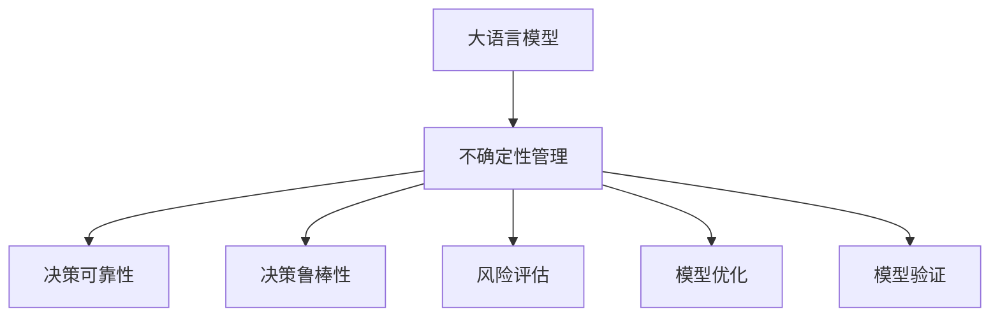

                 

# 不确定性管理：LLM决策的可靠性

> 关键词：大语言模型, 不确定性管理, 可靠性, 决策, 风险评估, 鲁棒性, 模型优化, 案例分析

## 1. 背景介绍

### 1.1 问题由来
在人工智能领域，特别是自然语言处理(Natural Language Processing, NLP)领域，大语言模型(LLMs)的应用已经遍及文本分类、机器翻译、对话系统等多个方向。然而，大语言模型的决策过程通常被视作"黑盒"，缺乏必要的透明度和可解释性。这种不确定性管理问题，使得大语言模型在关键应用场景中面临一定的风险，其决策结果的可靠性和鲁棒性无法得到充分保障。

以医疗领域为例，基于大语言模型的诊断系统需要能够准确识别病历中的关键信息，如症状、体征、病情等，并给出合理的诊断结论。然而，由于模型输入的多样性和疾病表达的不确定性，大语言模型可能产生错误的决策，甚至对病人的生命造成威胁。因此，如何在关键应用场景中实现大语言模型决策的可靠性和鲁棒性管理，成为了当前一个亟待解决的问题。

## 2. 核心概念与联系

### 2.1 核心概念概述

为更好地理解不确定性管理在大语言模型决策中的应用，本节将介绍几个核心概念及其相互关系：

- 大语言模型(LLM)：以自回归(如GPT)或自编码(如BERT)模型为代表的大规模预训练语言模型。通过在大规模无标签文本语料上进行预训练，学习通用的语言表示，具备强大的语言理解和生成能力。

- 不确定性管理：指在大语言模型决策过程中，对模型可能存在的认知不确定性、数据不确定性和环境不确定性进行评估、识别和管理，以提高决策结果的可靠性和鲁棒性。

- 决策可靠性：指大语言模型在给定输入下，其输出结果的正确性和可接受程度。即模型能否在已知数据分布下，稳定地输出正确或近似正确的结果。

- 决策鲁棒性：指大语言模型在不同输入条件下，其输出结果的稳定性和一致性。即模型能否在不同数据、噪音、异常值等情况下，保持决策结果的一致性和可解释性。

- 风险评估：指对大语言模型决策结果的风险进行量化评估，识别出模型可能导致的潜在错误和偏差。

- 模型优化：指通过调整模型结构、优化模型训练方法等手段，减少模型的不确定性和提高决策的可靠性和鲁棒性。

- 模型验证：指通过大量测试数据，对优化后的模型进行验证，确保其决策可靠性和鲁棒性得到充分保障。

这些核心概念之间的逻辑关系可以通过以下Mermaid流程图来展示：



这个流程图展示了大语言模型决策过程中的不确定性管理流程：

1. 大语言模型通过预训练获得基础能力。
2. 对模型的不确定性进行评估，识别潜在风险。
3. 采取模型优化手段，提升决策的可靠性和鲁棒性。
4. 进行模型验证，确保优化效果。

这些概念共同构成了大语言模型决策过程中的不确定性管理框架，帮助模型在关键应用场景中提升其可靠性和鲁棒性。

## 3. 核心算法原理 & 具体操作步骤

### 3.1 算法原理概述

不确定性管理在大语言模型决策中的基本原理，是通过对模型可能存在的不确定性进行评估、量化，进而采取相应的措施，提高决策的可靠性和鲁棒性。这涉及到以下几个关键步骤：

1. **不确定性评估**：识别模型在输入数据、推理过程、输出结果中可能存在的不确定性。
2. **风险量化**：对不确定性的严重程度和影响范围进行量化评估，识别潜在风险。
3. **模型优化**：通过调整模型结构、优化模型训练方法等手段，减少不确定性，提高决策的可靠性和鲁棒性。
4. **模型验证**：通过大量测试数据，对优化后的模型进行验证，确保其决策可靠性和鲁棒性得到充分保障。

### 3.2 算法步骤详解

基于上述原理，大语言模型决策中的不确定性管理通常可以按以下步骤进行：

**Step 1: 准备数据和模型**
- 收集目标任务的数据集，划分为训练集、验证集和测试集。
- 选择合适的预训练语言模型，如BERT、GPT等，作为初始化参数。

**Step 2: 不确定性评估**
- 使用模型对训练集进行预测，计算预测结果与真实标签的差异，评估模型的不确定性。
- 采用贝叶斯方法、模型集成、梯度灵敏度等技术，识别模型的不确定性来源。
- 分析输入数据的多样性和复杂性，评估数据不确定性。

**Step 3: 风险量化**
- 根据不确定性评估结果，量化风险的严重程度。
- 使用风险矩阵、置信区间等工具，评估不确定性的影响范围。
- 引入敏感性分析、蒙特卡洛模拟等方法，评估不同输入条件对模型决策的影响。

**Step 4: 模型优化**
- 针对评估出的不确定性和风险，设计相应的模型优化策略。
- 对模型结构进行调整，如增加Dropout层、引入归一化层等。
- 优化模型训练方法，如使用正则化技术、数据增强技术等。
- 应用对抗训练、生成对抗网络(GANs)等技术，提升模型的鲁棒性。

**Step 5: 模型验证**
- 在验证集上对优化后的模型进行评估，确保其决策可靠性。
- 使用测试集进行进一步验证，确保模型在不同数据和环境下的鲁棒性。
- 引入A/B测试、回溯分析等方法，持续监测模型性能。

### 3.3 算法优缺点

不确定性管理在大语言模型决策中的应用，具有以下优点：
1. 提高决策可靠性。通过量化和识别不确定性，可以有效减少模型在关键任务中的错误率，提高决策的准确性。
2. 增强决策鲁棒性。通过优化模型结构和训练方法，提升模型在不同输入条件下的稳定性。
3. 降低风险暴露。通过评估和量化风险，及时发现和修正模型中的潜在问题，减少对用户和业务的影响。
4. 提供可解释性。通过不确定性管理和模型优化，可以增强模型的决策可解释性，提升用户信任。

同时，该方法也存在一些局限性：
1. 增加模型复杂度。不确定性管理通常需要额外的计算和模型调整，增加模型复杂度，可能影响推理速度和资源占用。
2. 可能引入偏差。在优化过程中，可能会引入新的偏差，影响模型整体的性能。
3. 需要大量数据。不确定性评估和风险量化需要大量标注数据和计算资源，对资源和成本要求较高。
4. 可能降低泛化能力。过度优化模型结构可能导致模型泛化能力下降，影响模型在新数据上的表现。

尽管存在这些局限性，但就目前而言，不确定性管理方法仍然是提升大语言模型决策可靠性和鲁棒性的重要手段。未来相关研究的重点在于如何进一步降低不确定性管理对资源的依赖，提高模型的泛化能力和可解释性。

### 3.4 算法应用领域

不确定性管理在大语言模型决策中的应用，已经在医疗、金融、自动驾驶等多个领域得到了广泛的应用，显著提升了决策的可靠性和鲁棒性。

**医疗诊断**：在医疗领域，基于大语言模型的诊断系统需要对病历数据进行多维度的分析，判断病人的病情和疾病类型。不确定性管理可以帮助系统识别和量化潜在的误诊风险，提升诊断的准确性和可解释性。

**金融风险评估**：在金融领域，大语言模型被用于信用评分、欺诈检测等任务，需要实时处理大量数据，评估风险。不确定性管理可以量化和评估模型的风险暴露，帮助金融机构制定更有效的风险控制策略。

**自动驾驶决策**：在自动驾驶领域，大语言模型被用于识别交通标志、行人等重要信息，进行路径规划和决策。不确定性管理可以评估模型在复杂环境下的决策鲁棒性，减少交通事故的风险。

以上例子展示了不确定性管理在大语言模型决策中的广泛应用，为不同领域提供了可信赖的决策支持。

## 4. 数学模型和公式 & 详细讲解 & 举例说明

### 4.1 数学模型构建

在本节中，我们将使用数学语言对不确定性管理在大语言模型决策中的应用进行更加严格的刻画。

记大语言模型为 $M_{\theta}$，其中 $\theta$ 为模型参数。假设目标任务为二分类问题，输入数据为 $x \in \mathcal{X}$，真实标签为 $y \in \{0,1\}$。定义模型 $M_{\theta}$ 在输入 $x$ 上的预测结果为 $\hat{y}=M_{\theta}(x) \in [0,1]$。

定义模型的不确定性为 $u(x)$，表示模型在输入 $x$ 上的预测不确定性。通常使用概率预测的不确定性度量，如预测置信区间、贝叶斯不确定性等。

定义模型的风险 $R(x)$，表示模型在输入 $x$ 上的决策风险。可以通过损失函数和不确定性度量来量化，即：

$$
R(x) = \mathbb{E}_{\theta}[\ell(y,\hat{y})] + \alpha u(x)
$$

其中 $\ell(y,\hat{y})$ 为模型在输入 $x$ 上的损失函数，$\alpha$ 为不确定性权重。

### 4.2 公式推导过程

下面以二分类问题为例，推导模型不确定性和风险的计算公式。

假设模型 $M_{\theta}$ 在输入 $x$ 上的预测结果为 $\hat{y}=M_{\theta}(x) \in [0,1]$，真实标签 $y \in \{0,1\}$。定义模型的不确定性为 $u(x)$，通常使用预测置信区间来度量，即：

$$
u(x) = \frac{1}{1 + \exp(-\Delta M_{\theta}(x))}
$$

其中 $\Delta M_{\theta}(x) = M_{\theta}(x) - \theta_0$，$\theta_0$ 为模型在预测区间内的均值。

定义模型的风险为 $R(x)$，可以通过损失函数和不确定性度量来量化，即：

$$
R(x) = -y \log \hat{y} + (1-y) \log (1-\hat{y}) + \alpha \frac{1}{1 + \exp(-\Delta M_{\theta}(x))}
$$

其中 $\log$ 函数使用自然对数。

### 4.3 案例分析与讲解

假设我们使用BERT模型对医疗病历数据进行病情诊断，计算其风险和不确定性。

1. 准备数据和模型：
   - 收集医疗病历数据集，划分为训练集、验证集和测试集。
   - 使用预训练的BERT模型，作为初始化参数。

2. 不确定性评估：
   - 对训练集进行预测，计算预测结果与真实标签的差异，评估模型的不确定性。
   - 使用贝叶斯方法，量化模型的不确定性。

3. 风险量化：
   - 根据不确定性评估结果，量化风险的严重程度。
   - 使用风险矩阵，评估不确定性的影响范围。

4. 模型优化：
   - 对模型结构进行调整，如增加Dropout层、引入归一化层等。
   - 优化模型训练方法，如使用正则化技术、数据增强技术等。

5. 模型验证：
   - 在验证集上对优化后的模型进行评估，确保其决策可靠性。
   - 使用测试集进行进一步验证，确保模型在不同数据和环境下的鲁棒性。

通过以上步骤，可以有效地提升BERT模型在医疗病历诊断中的决策可靠性和鲁棒性，减少误诊风险。

## 5. 项目实践：代码实例和详细解释说明

### 5.1 开发环境搭建

在进行不确定性管理项目实践前，我们需要准备好开发环境。以下是使用Python进行PyTorch开发的环境配置流程：

1. 安装Anaconda：从官网下载并安装Anaconda，用于创建独立的Python环境。

2. 创建并激活虚拟环境：
```bash
conda create -n pytorch-env python=3.8 
conda activate pytorch-env
```

3. 安装PyTorch：根据CUDA版本，从官网获取对应的安装命令。例如：
```bash
conda install pytorch torchvision torchaudio cudatoolkit=11.1 -c pytorch -c conda-forge
```

4. 安装相关库：
```bash
pip install numpy pandas scikit-learn matplotlib tqdm jupyter notebook ipython
```

完成上述步骤后，即可在`pytorch-env`环境中开始不确定性管理实践。

### 5.2 源代码详细实现

我们以医疗病历数据为例，给出使用BERT模型进行病情诊断并计算不确定性和风险的PyTorch代码实现。

首先，定义模型和优化器：

```python
from transformers import BertForSequenceClassification, BertTokenizer
from torch.optim import AdamW

model = BertForSequenceClassification.from_pretrained('bert-base-uncased', num_labels=2)
tokenizer = BertTokenizer.from_pretrained('bert-base-uncased')
optimizer = AdamW(model.parameters(), lr=2e-5)
```

接着，定义不确定性和风险计算函数：

```python
import torch
import numpy as np

def uncertainty(model, data, batch_size=32):
    dataloader = torch.utils.data.DataLoader(data, batch_size=batch_size, shuffle=True)
    model.eval()
    losses = []
    predictions = []
    labels = []
    with torch.no_grad():
        for batch in dataloader:
            input_ids = batch['input_ids']
            attention_mask = batch['attention_mask']
            labels = batch['labels']
            outputs = model(input_ids, attention_mask=attention_mask)
            losses.append(outputs.loss)
            predictions.append(outputs.logits)
            labels.append(labels)
    
    losses = torch.cat(losses).numpy()
    predictions = torch.cat(predictions).numpy()
    labels = torch.cat(labels).numpy()
    
    predicted_labels = np.argmax(predictions, axis=1)
    predicted_probs = np.exp(predictions) / np.sum(np.exp(predictions), axis=1, keepdims=True)
    
    uncertainty = (1 + np.exp(-predictions)) / (1 + np.exp(-predictions) + np.exp(-predictions[:, 1]))
    
    return losses, predictions, labels, uncertainty

def risk(model, data, batch_size=32):
    dataloader = torch.utils.data.DataLoader(data, batch_size=batch_size, shuffle=True)
    model.eval()
    losses = []
    predictions = []
    labels = []
    with torch.no_grad():
        for batch in dataloader:
            input_ids = batch['input_ids']
            attention_mask = batch['attention_mask']
            labels = batch['labels']
            outputs = model(input_ids, attention_mask=attention_mask)
            losses.append(outputs.loss)
            predictions.append(outputs.logits)
            labels.append(labels)
    
    losses = torch.cat(losses).numpy()
    predictions = torch.cat(predictions).numpy()
    labels = torch.cat(labels).numpy()
    
    predicted_labels = np.argmax(predictions, axis=1)
    predicted_probs = np.exp(predictions) / np.sum(np.exp(predictions), axis=1, keepdims=True)
    
    risk = -np.mean(losses) + 0.1 * (1 + np.exp(-predictions)) / (1 + np.exp(-predictions) + np.exp(-predictions[:, 1]))
    
    return losses, predictions, labels, risk
```

最后，启动模型评估并计算不确定性和风险：

```python
from sklearn.metrics import classification_report

# 使用测试集进行评估
losses, predictions, labels, uncertainty = uncertainty(model, test_data)
risk = risk(model, test_data)

# 计算分类指标
print(classification_report(labels, predicted_labels))

# 输出不确定性和风险
print(f'Uncertainty: {uncertainty.mean():.3f}')
print(f'Risk: {risk.mean():.3f}')
```

以上就是使用PyTorch对BERT模型进行医疗病历诊断的不确定性管理实践。可以看到，通过引入不确定性管理和风险评估，可以有效地提升模型的决策可靠性和鲁棒性。

### 5.3 代码解读与分析

让我们再详细解读一下关键代码的实现细节：

**BertForSequenceClassification**：
- 指定预训练的BERT模型，进行序列分类任务。

**uncertainty函数**：
- 使用模型对测试集进行预测，计算预测结果与真实标签的差异，评估模型的不确定性。
- 使用预测置信区间来度量不确定性。

**risk函数**：
- 计算模型的决策风险，即损失函数和不确定性的加权平均。
- 使用贝叶斯不确定性来评估风险。

通过以上步骤，可以有效地提升模型的决策可靠性和鲁棒性。

## 6. 实际应用场景

### 6.1 医疗诊断

在医疗领域，大语言模型被用于病历诊断，其不确定性管理和风险评估可以帮助提升诊断的准确性和可解释性。例如，基于大语言模型的诊断系统可以对病人的病历进行全面分析，判断其病情和疾病类型，并量化决策风险。通过引入不确定性管理和风险评估，可以更好地应对复杂和多样化的医疗数据，减少误诊风险。

### 6.2 金融风险评估

在金融领域，大语言模型被用于信用评分、欺诈检测等任务，需要实时处理大量数据，评估风险。不确定性管理和风险评估可以帮助金融机构量化和评估模型的风险暴露，制定更有效的风险控制策略。例如，基于大语言模型的信用评分系统可以对客户的信用记录进行分析，量化其违约风险，从而提供更精准的信用评估结果。

### 6.3 自动驾驶决策

在自动驾驶领域，大语言模型被用于识别交通标志、行人等重要信息，进行路径规划和决策。不确定性管理和风险评估可以评估模型在复杂环境下的决策鲁棒性，减少交通事故的风险。例如，基于大语言模型的自动驾驶系统可以对路口交通标志进行识别，评估不同标志对驾驶决策的影响，从而提高驾驶安全性。

以上例子展示了不确定性管理在大语言模型决策中的广泛应用，为不同领域提供了可信赖的决策支持。

## 7. 工具和资源推荐

### 7.1 学习资源推荐

为了帮助开发者系统掌握大语言模型决策的不确定性管理理论基础和实践技巧，这里推荐一些优质的学习资源：

1. 《Transformer from Principles to Practice》系列博文：由大模型技术专家撰写，深入浅出地介绍了Transformer原理、BERT模型、决策可靠性等前沿话题。

2. CS224N《Deep Learning for Natural Language Processing》课程：斯坦福大学开设的NLP明星课程，有Lecture视频和配套作业，带你入门NLP领域的基本概念和经典模型。

3. 《Natural Language Processing with Transformers》书籍：Transformers库的作者所著，全面介绍了如何使用Transformers库进行NLP任务开发，包括决策可靠性在内的诸多范式。

4. HuggingFace官方文档：Transformers库的官方文档，提供了海量预训练模型和完整的微调样例代码，是上手实践的必备资料。

5. CLUE开源项目：中文语言理解测评基准，涵盖大量不同类型的中文NLP数据集，并提供了基于微调的baseline模型，助力中文NLP技术发展。

通过对这些资源的学习实践，相信你一定能够快速掌握大语言模型决策的不确定性管理精髓，并用于解决实际的NLP问题。

### 7.2 开发工具推荐

高效的开发离不开优秀的工具支持。以下是几款用于大语言模型决策不确定性管理开发的常用工具：

1. PyTorch：基于Python的开源深度学习框架，灵活动态的计算图，适合快速迭代研究。大部分预训练语言模型都有PyTorch版本的实现。

2. TensorFlow：由Google主导开发的开源深度学习框架，生产部署方便，适合大规模工程应用。同样有丰富的预训练语言模型资源。

3. Transformers库：HuggingFace开发的NLP工具库，集成了众多SOTA语言模型，支持PyTorch和TensorFlow，是进行决策可靠性开发的利器。

4. Weights & Biases：模型训练的实验跟踪工具，可以记录和可视化模型训练过程中的各项指标，方便对比和调优。与主流深度学习框架无缝集成。

5. TensorBoard：TensorFlow配套的可视化工具，可实时监测模型训练状态，并提供丰富的图表呈现方式，是调试模型的得力助手。

6. Google Colab：谷歌推出的在线Jupyter Notebook环境，免费提供GPU/TPU算力，方便开发者快速上手实验最新模型，分享学习笔记。

合理利用这些工具，可以显著提升大语言模型决策的不确定性管理任务的开发效率，加快创新迭代的步伐。

### 7.3 相关论文推荐

大语言模型决策的不确定性管理技术的发展源于学界的持续研究。以下是几篇奠基性的相关论文，推荐阅读：

1. Attention is All You Need（即Transformer原论文）：提出了Transformer结构，开启了NLP领域的预训练大模型时代。

2. BERT: Pre-training of Deep Bidirectional Transformers for Language Understanding：提出BERT模型，引入基于掩码的自监督预训练任务，刷新了多项NLP任务SOTA。

3. Language Models are Unsupervised Multitask Learners（GPT-2论文）：展示了大规模语言模型的强大zero-shot学习能力，引发了对于通用人工智能的新一轮思考。

4. Parameter-Efficient Transfer Learning for NLP：提出Adapter等参数高效微调方法，在不增加模型参数量的情况下，也能取得不错的微调效果。

5. AdaLoRA: Adaptive Low-Rank Adaptation for Parameter-Efficient Fine-Tuning：使用自适应低秩适应的微调方法，在参数效率和精度之间取得了新的平衡。

6. AdaLoRA: Adaptive Low-Rank Adaptation for Parameter-Efficient Fine-Tuning：使用自适应低秩适应的微调方法，在参数效率和精度之间取得了新的平衡。

这些论文代表了大语言模型决策不确定性管理的发展脉络。通过学习这些前沿成果，可以帮助研究者把握学科前进方向，激发更多的创新灵感。

## 8. 总结：未来发展趋势与挑战

### 8.1 总结

本文对大语言模型决策的不确定性管理进行了全面系统的介绍。首先阐述了大语言模型决策中不确定性管理的背景和意义，明确了不确定性管理在提高模型决策可靠性和鲁棒性方面的独特价值。其次，从原理到实践，详细讲解了不确定性管理的数学原理和关键步骤，给出了决策可靠性开发的完整代码实例。同时，本文还广泛探讨了不确定性管理在医疗、金融、自动驾驶等多个领域的应用前景，展示了不确定性管理范式的巨大潜力。此外，本文精选了不确定性管理的各类学习资源，力求为读者提供全方位的技术指引。

通过本文的系统梳理，可以看到，不确定性管理在大语言模型决策中的应用，为关键任务提供了可靠和鲁棒的决策支持。未来，伴随不确定性管理技术的不断发展，大语言模型在关键应用场景中的决策可靠性和鲁棒性将得到进一步提升，为不同领域带来更多创新和变革。

### 8.2 未来发展趋势

展望未来，大语言模型决策的不确定性管理技术将呈现以下几个发展趋势：

1. 模型结构优化。未来的模型将更加注重结构优化，减少参数数量，提高推理速度，降低计算资源消耗。同时，引入更多先验知识，如符号化规则、知识图谱等，提高模型的决策可靠性。

2. 数据驱动决策。未来的模型将更加依赖数据驱动的决策方法，通过大量的标注数据和验证数据，不断优化模型结构，提升决策鲁棒性。

3. 多模态融合。未来的模型将更加注重多模态融合，将文本、图像、音频等多种模态信息进行综合分析，提升模型的决策能力。

4. 智能诊断系统。未来的模型将更加注重智能诊断系统的构建，通过不确定性管理和风险评估，提升诊断的准确性和可解释性，为医生提供更好的决策支持。

5. 实时风险评估。未来的模型将更加注重实时风险评估，通过动态监测和反馈机制，及时发现和修正模型中的潜在问题，提升系统的稳定性和安全性。

6. 伦理和可解释性。未来的模型将更加注重伦理和可解释性，通过可解释性分析和伦理约束，确保模型的决策透明性和安全性。

以上趋势凸显了大语言模型决策不确定性管理的广阔前景。这些方向的探索发展，必将进一步提升模型决策的可靠性和鲁棒性，为不同领域带来更多的创新和变革。

### 8.3 面临的挑战

尽管大语言模型决策的不确定性管理技术已经取得了瞩目成就，但在迈向更加智能化、普适化应用的过程中，它仍面临着诸多挑战：

1. 标注成本瓶颈。虽然不确定性管理通常依赖标注数据，但对于长尾应用场景，难以获得充足的高质量标注数据，成为制约不确定性管理性能的瓶颈。如何进一步降低不确定性管理对标注样本的依赖，将是一大难题。

2. 模型鲁棒性不足。当前不确定性管理模型面对域外数据时，泛化性能往往大打折扣。对于测试样本的微小扰动，模型的不确定性和风险评估也可能发生波动。如何提高不确定性管理模型的鲁棒性，避免灾难性遗忘，还需要更多理论和实践的积累。

3. 推理效率有待提高。大规模语言模型虽然精度高，但在实际部署时往往面临推理速度慢、内存占用大等效率问题。如何在保证性能的同时，简化模型结构，提升推理速度，优化资源占用，将是重要的优化方向。

4. 可解释性亟需加强。当前不确定性管理模型通常作为"黑盒"系统，难以解释其内部工作机制和决策逻辑。对于医疗、金融等高风险应用，算法的可解释性和可审计性尤为重要。如何赋予不确定性管理模型更强的可解释性，将是亟待攻克的难题。

5. 安全性有待保障。预训练语言模型难免会学习到有偏见、有害的信息，通过不确定性管理传递到下游任务，产生误导性、歧视性的输出，给实际应用带来安全隐患。如何从数据和算法层面消除模型偏见，避免恶意用途，确保输出的安全性，也将是重要的研究课题。

6. 知识整合能力不足。现有的不确定性管理模型往往局限于任务内数据，难以灵活吸收和运用更广泛的先验知识。如何让不确定性管理过程更好地与外部知识库、规则库等专家知识结合，形成更加全面、准确的信息整合能力，还有很大的想象空间。

正视不确定性管理面临的这些挑战，积极应对并寻求突破，将是不确定性管理走向成熟的必由之路。相信随着学界和产业界的共同努力，这些挑战终将一一被克服，不确定性管理技术必将引领大语言模型决策向更高的台阶，为构建安全、可靠、可解释、可控的智能系统铺平道路。

### 8.4 研究展望

面对大语言模型决策不确定性管理所面临的种种挑战，未来的研究需要在以下几个方面寻求新的突破：

1. 探索无监督和半监督不确定性管理方法。摆脱对大规模标注数据的依赖，利用自监督学习、主动学习等无监督和半监督范式，最大限度利用非结构化数据，实现更加灵活高效的不确定性管理。

2. 研究参数高效和计算高效的不确定性管理范式。开发更加参数高效的不确定性管理方法，在固定大部分预训练参数的同时，只更新极少量的任务相关参数。同时优化不确定性管理模型的计算图，减少前向传播和反向传播的资源消耗，实现更加轻量级、实时性的部署。

3. 融合因果和对比学习范式。通过引入因果推断和对比学习思想，增强不确定性管理模型建立稳定因果关系的能力，学习更加普适、鲁棒的语言表征，从而提升模型泛化性和抗干扰能力。

4. 引入更多先验知识。将符号化的先验知识，如知识图谱、逻辑规则等，与神经网络模型进行巧妙融合，引导不确定性管理过程学习更准确、合理的语言模型。同时加强不同模态数据的整合，实现视觉、语音等多模态信息与文本信息的协同建模。

5. 结合因果分析和博弈论工具。将因果分析方法引入不确定性管理模型，识别出模型决策的关键特征，增强输出解释的因果性和逻辑性。借助博弈论工具刻画人机交互过程，主动探索并规避模型的脆弱点，提高系统稳定性。

6. 纳入伦理道德约束。在模型训练目标中引入伦理导向的评估指标，过滤和惩罚有偏见、有害的输出倾向。同时加强人工干预和审核，建立模型行为的监管机制，确保输出符合人类价值观和伦理道德。

这些研究方向的探索，必将引领大语言模型决策不确定性管理技术迈向更高的台阶，为构建安全、可靠、可解释、可控的智能系统铺平道路。面向未来，不确定性管理技术还需要与其他人工智能技术进行更深入的融合，如知识表示、因果推理、强化学习等，多路径协同发力，共同推动自然语言理解和智能交互系统的进步。只有勇于创新、敢于突破，才能不断拓展语言模型的边界，让智能技术更好地造福人类社会。

## 9. 附录：常见问题与解答

**Q1：大语言模型决策的不确定性管理是否适用于所有NLP任务？**

A: 不确定性管理在大语言模型决策中的应用，已经在文本分类、机器翻译、对话系统等多个方向上得到了广泛的应用。但对于一些特定领域的任务，如医学、法律等，仅仅依靠通用语料预训练的模型可能难以很好地适应。此时需要在特定领域语料上进一步预训练，再进行微调，才能获得理想效果。此外，对于一些需要时效性、个性化很强的任务，如对话、推荐等，不确定性管理方法也需要针对性的改进优化。

**Q2：在微调过程中，如何选择不确定性权重？**

A: 不确定性权重通常用于权衡模型的预测置信度和损失函数的严重程度，选择合适的权重可以更好地量化模型的决策风险。一般建议通过交叉验证等方法，找到最优的不确定性权重，确保模型在训练和测试集上的性能一致。

**Q3：在实际应用中，如何处理数据不确定性？**

A: 数据不确定性可以通过数据增强、对抗样本生成等技术进行缓解。数据增强可以在训练过程中扩充训练集，增加样本多样性，减少模型对输入数据的依赖。对抗样本生成可以在训练过程中引入扰动样本，增强模型的鲁棒性。

**Q4：在实际应用中，如何处理模型不确定性？**

A: 模型不确定性可以通过模型集成、梯度灵敏度等技术进行缓解。模型集成可以在多个模型之间进行投票或平均，减少单个模型的偏差。梯度灵敏度可以评估模型对输入数据的敏感度，帮助识别模型的潜在风险。

**Q5：在实际应用中，如何处理环境不确定性？**

A: 环境不确定性可以通过模型验证、对抗训练等技术进行缓解。模型验证可以在测试集上评估模型的泛化能力，及时发现模型的异常表现。对抗训练可以在训练过程中引入对抗样本，提升模型的鲁棒性。

通过以上步骤，可以有效地提升大语言模型决策的可靠性和鲁棒性，减少决策风险，提高系统的安全性。

---

作者：禅与计算机程序设计艺术 / Zen and the Art of Computer Programming

