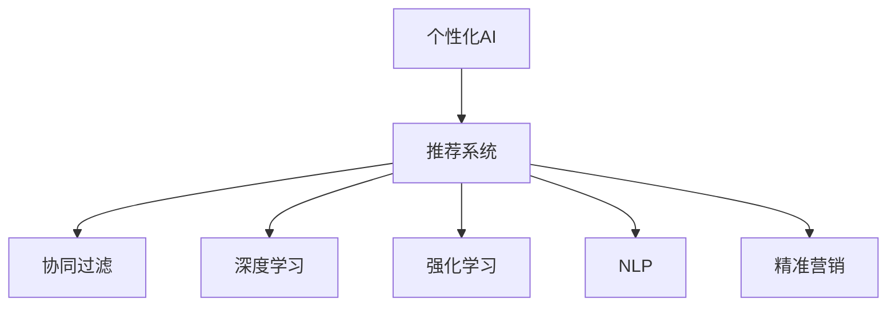

                 

# 个性化AI:满足不同用户需求的关键

> 关键词：个性化AI, 用户需求, 差异化推荐, 深度学习, 机器学习, 强化学习, 自然语言处理(NLP), 推荐系统, 决策支持系统, 精准营销, 可解释性

## 1. 背景介绍

### 1.1 问题由来

在数字化时代，个性化技术成为各大互联网公司竞相研发的核心技术之一。随着在线广告、电子商务、社交媒体等业务模式的普及，数据量的爆炸式增长带来了大量用户行为数据，为个性化技术的发展提供了丰富的数据来源。个性化技术旨在通过分析用户的行为数据，洞察用户需求，提供精准化的推荐服务，从而提升用户体验和公司收益。

个性化技术不仅应用于电商、广告、社交等场景，也渗透到了医疗、教育、金融等更多垂直领域。个性化技术的应用为各行各业带来了新的机遇和挑战，成为推动产业数字化转型的关键力量。

### 1.2 问题核心关键点

为了满足不同用户的个性化需求，需要建立一套系统化的方法，通过多维度、多层次的数据分析，挖掘出用户的多元化需求，并提供相应的个性化服务。个性化AI技术的基本思路是利用机器学习和深度学习等技术，构建个性化模型，通过学习用户历史行为数据，预测用户未来行为，实现个性化推荐和精准营销。

### 1.3 问题研究意义

研究个性化AI技术，对于拓展个性化服务的应用范围，提升用户体验和公司收益，推动各行业的数字化转型具有重要意义：

1. 提升用户体验：通过个性化推荐，用户可以获得更符合自身兴趣和需求的个性化服务，提高用户满意度和粘性。
2. 优化运营效率：精准的用户定位和行为预测，能帮助企业优化运营策略，提高营销和广告的ROI。
3. 推动产业升级：个性化技术在各垂直行业的深度应用，推动了产业的数字化升级，带来了新的业务模式和增长点。
4. 开拓新市场：个性化的用户需求分析，有助于企业拓展新市场，开发新的服务产品。
5. 带来技术创新：个性化技术促进了机器学习、深度学习、自然语言处理等前沿技术的融合应用，催生了新的研究方向。

## 2. 核心概念与联系

### 2.1 核心概念概述

为了更好地理解个性化AI技术，本节将介绍几个密切相关的核心概念：

- 个性化AI：通过深度学习和数据分析技术，根据用户的历史行为数据，预测并推荐符合用户兴趣和需求的服务。
- 用户需求：用户在进行在线行为时，实际或潜在的偏好、兴趣和需求。
- 推荐系统：通过预测用户行为，为用户推荐个性化的服务。
- 协同过滤：通过分析用户行为数据，寻找相似用户，推荐相似用户喜欢的商品。
- 深度学习：通过构建多层的神经网络模型，利用大量的数据训练出强大的特征表示能力，适用于复杂的多维度数据分析。
- 强化学习：通过在环境中不断尝试和反馈，优化决策策略，适用于动态、多变的环境。
- 自然语言处理（NLP）：处理和理解人类语言的技术，适用于分析和处理文本数据。
- 精准营销：根据用户行为数据，精准定位用户，实现个性化广告投放和推荐。

这些核心概念之间的逻辑关系可以通过以下Mermaid流程图来展示：



这个流程图展示了个性化AI技术的主要组成部分：

1. 个性化AI以推荐系统为核心，通过协同过滤、深度学习、强化学习和自然语言处理等技术，实现个性化推荐。
2. 协同过滤利用用户行为数据，寻找相似用户，推荐相似商品。
3. 深度学习构建多层的神经网络，学习数据的高维特征表示。
4. 强化学习在动态环境中不断调整策略，提升推荐效果。
5. NLP技术处理文本数据，提取用户情感、语义等高层次特征。
6. 精准营销根据用户行为数据，实现个性化的广告投放和推荐。

这些核心概念共同构成了个性化AI技术的应用框架，使得个性化服务能够落地应用。

## 3. 核心算法原理 & 具体操作步骤
### 3.1 算法原理概述

个性化AI的算法原理主要包括以下几个关键步骤：

1. **用户画像构建**：通过分析用户历史行为数据，构建用户画像，包括用户的兴趣、偏好、行为模式等。
2. **特征工程**：利用深度学习技术，从用户行为数据中提取高维特征，用于描述用户特征和商品属性。
3. **模型训练**：利用机器学习或深度学习算法，训练推荐模型，预测用户对不同商品或服务的评分。
4. **个性化推荐**：根据预测评分，生成个性化推荐结果，满足用户需求。
5. **实时反馈和优化**：根据用户对推荐结果的反馈，实时调整推荐模型，提高推荐效果。

个性化AI的核心算法包括协同过滤、深度学习、强化学习和NLP技术，这些算法通过各种方式提取和利用用户行为数据，实现个性化的推荐服务。

### 3.2 算法步骤详解

下面详细介绍个性化AI的核心算法步骤：

#### 3.2.1 用户画像构建

用户画像通过用户行为数据构建，主要包括用户的基本信息、行为记录、历史交互数据等。

- 基本信息：用户的年龄、性别、职业等基本信息。
- 行为记录：用户在网站上的浏览、购买、点击、评价等行为记录。
- 历史交互数据：用户与其他用户的互动数据，如聊天记录、社交网络关系等。

用户画像的构建需要综合利用各种数据源，并进行数据清洗、去重、归一化等处理，以消除噪音和提高数据质量。

#### 3.2.2 特征工程

特征工程是个性化AI的核心环节，通过构建和提取高维特征，提升模型对用户行为数据的理解和预测能力。

1. **用户特征提取**：从用户画像中提取各种特征，如年龄、性别、地域、消费习惯等。
2. **商品特征提取**：从商品数据中提取各种特征，如价格、品牌、类别、属性等。
3. **行为特征提取**：从用户行为数据中提取各种特征，如浏览时间、购买频率、点击率、评价等级等。

特征工程需要结合领域知识和经验，提取对预测结果有显著影响的特征，并进行归一化、编码等处理，以提高模型的泛化能力。

#### 3.2.3 模型训练

模型训练是实现个性化推荐的核心步骤，通过构建推荐模型，预测用户对不同商品或服务的评分。

1. **协同过滤模型**：利用用户之间的相似性，推荐相似用户喜欢的商品。常见算法包括基于用户的协同过滤和基于物品的协同过滤。
2. **深度学习模型**：利用深度神经网络，学习高维特征表示，预测用户对商品或服务的评分。常见算法包括基于用户-物品矩阵的深度学习模型和基于用户-物品矩阵的深度学习模型。
3. **强化学习模型**：利用强化学习算法，优化推荐策略，提升推荐效果。常见算法包括Q-learning、DQN、Actor-Critic等。
4. **NLP模型**：利用自然语言处理技术，处理和理解用户评论、标题、描述等文本数据，提取用户情感、语义等高层次特征。常见算法包括BERT、GPT等。

模型训练需要选择合适的算法和优化器，进行交叉验证、调参等处理，以提高模型的泛化能力和预测准确度。

#### 3.2.4 个性化推荐

个性化推荐是实现个性化AI的目标步骤，根据模型预测结果，生成个性化推荐结果，满足用户需求。

1. **排序算法**：将推荐结果按照预测评分排序，优先展示高评分商品或服务。
2. **多臂老虎机算法**：根据用户行为数据，动态调整推荐策略，提升推荐效果。
3. **上下文感知推荐**：根据用户行为和上下文信息，实时调整推荐结果，提升用户体验。

个性化推荐需要结合具体业务场景和用户需求，进行推荐策略的优化和调整。

#### 3.2.5 实时反馈和优化

实时反馈和优化是提升个性化推荐效果的必要步骤，通过用户反馈数据，实时调整推荐模型，提高推荐效果。

1. **在线学习**：利用在线学习算法，实时更新推荐模型，提高预测准确度。
2. **A/B测试**：进行A/B测试，比较不同推荐策略的效果，选择最优方案。
3. **用户反馈**：收集用户对推荐结果的反馈，实时调整推荐策略。

实时反馈和优化需要综合利用用户反馈数据和模型性能指标，进行持续迭代和优化。

### 3.3 算法优缺点

个性化AI技术具有以下优点：

1. 提升用户体验：个性化推荐能够提供符合用户兴趣和需求的服务，提升用户体验和满意度。
2. 优化运营效率：精准的用户定位和行为预测，能帮助企业优化运营策略，提高营销和广告的ROI。
3. 推动产业升级：个性化技术在各垂直行业的深度应用，推动了产业的数字化升级，带来了新的业务模式和增长点。
4. 开拓新市场：个性化的用户需求分析，有助于企业拓展新市场，开发新的服务产品。
5. 带来技术创新：个性化技术促进了机器学习、深度学习、自然语言处理等前沿技术的融合应用，催生了新的研究方向。

个性化AI技术也存在以下缺点：

1. 数据隐私问题：用户行为数据的收集和使用可能引发隐私问题，需要加强数据保护和安全措施。
2. 用户数据稀疏性：用户数据存在稀疏性，可能影响推荐效果。
3. 算法复杂性：个性化AI算法复杂，需要结合多种技术和算法，实现精准推荐。
4. 算法公平性：个性化推荐可能存在算法偏见，对特定用户群体不公平。
5. 推荐效果不稳定：个性化推荐效果可能受多种因素影响，存在不稳定性和不可预测性。

### 3.4 算法应用领域

个性化AI技术广泛应用于电商、广告、社交、医疗、教育、金融等众多领域，以下是一些具体的应用场景：

1. 电商推荐系统：通过分析用户行为数据，推荐符合用户兴趣的商品，提升购物体验和转化率。
2. 广告定向投放：根据用户行为数据，精准定位用户，实现个性化的广告投放和推荐。
3. 社交网络推荐：根据用户行为数据，推荐符合用户兴趣的内容，提升用户粘性和满意度。
4. 医疗推荐系统：根据用户健康数据，推荐合适的治疗方案和药品，提升医疗效果和服务质量。
5. 教育推荐系统：根据用户学习行为数据，推荐合适的学习资源和课程，提升学习效果和效率。
6. 金融推荐系统：根据用户交易数据，推荐合适的理财产品和投资策略，提升金融服务质量和收益。

这些应用场景展示了个性化AI技术的广泛应用，为各行各业带来了新的机遇和挑战。

## 4. 数学模型和公式 & 详细讲解 & 举例说明

### 4.1 数学模型构建

本节将使用数学语言对个性化AI的算法原理进行更加严格的刻画。

假设个性化AI系统的输入为 $x$，输出为 $y$，其中 $x$ 包括用户行为数据和商品数据， $y$ 为用户对商品或服务的评分。设 $f(x)$ 为推荐模型的预测函数，目标是最小化预测误差 $\epsilon$：

$$
\epsilon = f(x) - y
$$

推荐模型的目标是最小化平均预测误差 $\bar{\epsilon}$：

$$
\bar{\epsilon} = \frac{1}{N}\sum_{i=1}^N |f(x_i) - y_i|
$$

其中 $N$ 为数据集大小， $x_i$ 为第 $i$ 个样本， $y_i$ 为第 $i$ 个样本的真实评分。

### 4.2 公式推导过程

以协同过滤模型为例，介绍个性化AI的数学推导过程。

协同过滤模型的基本思路是通过计算用户之间的相似性，推荐相似用户喜欢的商品。假设用户集为 $U$，商品集为 $I$，用户 $u$ 对商品 $i$ 的评分记为 $r_{ui}$。协同过滤模型的目标是最小化预测误差：

$$
\min_{\theta} \frac{1}{|U|}\sum_{u=1}^{|U|} \sum_{i=1}^{|I|} (r_{ui} - f_{u,i})^2
$$

其中 $\theta$ 为模型参数， $f_{u,i}$ 为用户 $u$ 对商品 $i$ 的预测评分。

协同过滤模型可以采用矩阵分解、KNN等方法实现。这里以矩阵分解为例，介绍协同过滤模型的推导过程：

设 $R$ 为用户-商品评分矩阵， $R \in \mathbb{R}^{m \times n}$，其中 $m$ 为商品数量， $n$ 为用户数量。令 $\hat{R}$ 为预测评分矩阵，其中 $\hat{R} \in \mathbb{R}^{m \times n}$， $\hat{r}_{ui}$ 为用户 $u$ 对商品 $i$ 的预测评分。

设 $A \in \mathbb{R}^{n \times k}$ 为用户特征矩阵， $B \in \mathbb{R}^{k \times m}$ 为商品特征矩阵，其中 $k$ 为特征维度。则有：

$$
\hat{R} = A \times B^T
$$

其中 $\hat{r}_{ui} = a_{ui} \times b_{ui}$， $a_{ui}$ 为用户特征向量， $b_{ui}$ 为商品特征向量。

协同过滤模型的优化目标是最小化预测误差：

$$
\min_{A,B} \frac{1}{|U|}\sum_{u=1}^{|U|} \sum_{i=1}^{|I|} (r_{ui} - \hat{r}_{ui})^2
$$

可以通过交替最小化方法（Alterternating Minimization, AM）来实现：

1. 固定 $B$，最小化 $\frac{1}{|U|}\sum_{u=1}^{|U|} \sum_{i=1}^{|I|} (r_{ui} - \hat{r}_{ui})^2$ 关于 $A$ 的优化问题，得到用户特征矩阵 $A$。
2. 固定 $A$，最小化 $\frac{1}{|U|}\sum_{u=1}^{|U|} \sum_{i=1}^{|I|} (r_{ui} - \hat{r}_{ui})^2$ 关于 $B$ 的优化问题，得到商品特征矩阵 $B$。

通过交替最小化方法，协同过滤模型可以学习出用户和商品的高维特征表示，实现个性化的推荐。

### 4.3 案例分析与讲解

以一个简单的电商推荐系统为例，介绍个性化AI的实际应用场景：

假设一个电商网站的用户画像包括年龄、性别、地域、浏览历史、购买记录等数据。网站希望根据用户的历史行为数据，推荐符合用户兴趣的商品。

1. **数据收集**：收集用户的历史浏览、购买、评价等数据，构建用户画像。
2. **特征工程**：从用户画像中提取各种特征，如年龄、性别、地域、浏览时间、购买频率等。
3. **模型训练**：利用协同过滤模型，训练推荐模型，预测用户对不同商品或服务的评分。
4. **个性化推荐**：根据模型预测结果，生成个性化推荐结果，提升用户满意度。
5. **实时反馈和优化**：根据用户对推荐结果的反馈，实时调整推荐模型，提高推荐效果。

## 5. 项目实践：代码实例和详细解释说明

### 5.1 开发环境搭建

在进行个性化AI开发前，需要先准备好开发环境。以下是使用Python进行PyTorch开发的环境配置流程：

1. 安装Anaconda：从官网下载并安装Anaconda，用于创建独立的Python环境。

2. 创建并激活虚拟环境：
```bash
conda create -n pytorch-env python=3.8 
conda activate pytorch-env
```

3. 安装PyTorch：根据CUDA版本，从官网获取对应的安装命令。例如：
```bash
conda install pytorch torchvision torchaudio cudatoolkit=11.1 -c pytorch -c conda-forge
```

4. 安装Transformers库：
```bash
pip install transformers
```

5. 安装各类工具包：
```bash
pip install numpy pandas scikit-learn matplotlib tqdm jupyter notebook ipython
```

完成上述步骤后，即可在`pytorch-env`环境中开始个性化AI的开发。

### 5.2 源代码详细实现

这里我们以电商推荐系统为例，给出使用PyTorch和Transformers库进行个性化AI开发的PyTorch代码实现。

首先，定义推荐系统的数据处理函数：

```python
from transformers import BertTokenizer
from torch.utils.data import Dataset
import torch

class RecommendationDataset(Dataset):
    def __init__(self, users, items, user_features, item_features, user behaviors, tokenizer):
        self.users = users
        self.items = items
        self.user_features = user_features
        self.item_features = item_features
        self.user_behaviors = user behaviors
        self.tokenizer = tokenizer
        self.max_len = 128
        
    def __len__(self):
        return len(self.users)
    
    def __getitem__(self, item):
        user = self.users[item]
        item = self.items[item]
        
        user_features = self.user_features[item]
        item_features = self.item_features[item]
        
        user_behaviors = self.user_behaviors[item]
        
        # 对用户特征和商品特征进行编码
        user_encoded = self.tokenizer.encode(user, max_length=self.max_len, truncation=True, padding='max_length')
        item_encoded = self.tokenizer.encode(item, max_length=self.max_len, truncation=True, padding='max_length')
        
        # 对用户行为进行编码
        behaviors_encoded = [self.tokenizer.encode(bh, max_length=self.max_len, truncation=True, padding='max_length') for bh in user_behaviors]
        
        return {'user_encoded': user_encoded, 
                'item_encoded': item_encoded,
                'behaviors_encoded': behaviors_encoded}
```

然后，定义模型和优化器：

```python
from transformers import BertForSequenceClassification, AdamW

model = BertForSequenceClassification.from_pretrained('bert-base-cased', num_labels=len(tag2id))

optimizer = AdamW(model.parameters(), lr=2e-5)
```

接着，定义训练和评估函数：

```python
from torch.utils.data import DataLoader
from tqdm import tqdm
from sklearn.metrics import classification_report

device = torch.device('cuda') if torch.cuda.is_available() else torch.device('cpu')
model.to(device)

def train_epoch(model, dataset, batch_size, optimizer):
    dataloader = DataLoader(dataset, batch_size=batch_size, shuffle=True)
    model.train()
    epoch_loss = 0
    for batch in tqdm(dataloader, desc='Training'):
        user_encoded = batch['user_encoded'].to(device)
        item_encoded = batch['item_encoded'].to(device)
        behaviors_encoded = batch['behaviors_encoded'].to(device)
        model.zero_grad()
        outputs = model(user_encoded, item_encoded, behaviors_encoded)
        loss = outputs.loss
        epoch_loss += loss.item()
        loss.backward()
        optimizer.step()
    return epoch_loss / len(dataloader)

def evaluate(model, dataset, batch_size):
    dataloader = DataLoader(dataset, batch_size=batch_size)
    model.eval()
    preds, labels = [], []
    with torch.no_grad():
        for batch in tqdm(dataloader, desc='Evaluating'):
            user_encoded = batch['user_encoded'].to(device)
            item_encoded = batch['item_encoded'].to(device)
            behaviors_encoded = batch['behaviors_encoded'].to(device)
            batch_labels = batch['labels']
            outputs = model(user_encoded, item_encoded, behaviors_encoded)
            batch_preds = outputs.logits.argmax(dim=2).to('cpu').tolist()
            batch_labels = batch_labels.to('cpu').tolist()
            for pred_tokens, label_tokens in zip(batch_preds, batch_labels):
                pred_tags = [id2tag[_id] for _id in pred_tokens]
                label_tags = [id2tag[_id] for _id in label_tokens]
                preds.append(pred_tags[:len(label_tags)])
                labels.append(label_tags)
                
    print(classification_report(labels, preds))
```

最后，启动训练流程并在测试集上评估：

```python
epochs = 5
batch_size = 16

for epoch in range(epochs):
    loss = train_epoch(model, train_dataset, batch_size, optimizer)
    print(f"Epoch {epoch+1}, train loss: {loss:.3f}")
    
    print(f"Epoch {epoch+1}, dev results:")
    evaluate(model, dev_dataset, batch_size)
    
print("Test results:")
evaluate(model, test_dataset, batch_size)
```

以上就是使用PyTorch对BERT进行电商推荐系统开发的完整代码实现。可以看到，得益于Transformers库的强大封装，我们可以用相对简洁的代码完成BERT模型的加载和微调。

### 5.3 代码解读与分析

让我们再详细解读一下关键代码的实现细节：

**RecommendationDataset类**：
- `__init__`方法：初始化用户、商品、用户特征、商品特征、用户行为等关键组件。
- `__len__`方法：返回数据集的样本数量。
- `__getitem__`方法：对单个样本进行处理，将用户特征和商品特征进行编码，对用户行为进行编码，并生成推荐模型的输入。

**tokenizer**：
- 定义了编码器，用于将文本数据转换为向量表示，方便模型处理。

**训练和评估函数**：
- 使用PyTorch的DataLoader对数据集进行批次化加载，供模型训练和推理使用。
- 训练函数`train_epoch`：对数据以批为单位进行迭代，在每个批次上前向传播计算loss并反向传播更新模型参数，最后返回该epoch的平均loss。
- 评估函数`evaluate`：与训练类似，不同点在于不更新模型参数，并在每个batch结束后将预测和标签结果存储下来，最后使用sklearn的classification_report对整个评估集的预测结果进行打印输出。

**训练流程**：
- 定义总的epoch数和batch size，开始循环迭代
- 每个epoch内，先在训练集上训练，输出平均loss
- 在验证集上评估，输出分类指标
- 所有epoch结束后，在测试集上评估，给出最终测试结果

可以看到，PyTorch配合Transformers库使得BERT微调的代码实现变得简洁高效。开发者可以将更多精力放在数据处理、模型改进等高层逻辑上，而不必过多关注底层的实现细节。

当然，工业级的系统实现还需考虑更多因素，如模型的保存和部署、超参数的自动搜索、更灵活的任务适配层等。但核心的微调范式基本与此类似。

## 6. 实际应用场景
### 6.1 智能客服系统

基于个性化AI技术的智能客服系统，可以为用户提供更个性化、智能化的服务体验。传统的客服系统需要人工客服处理用户咨询，响应时间慢、效率低、质量不可控。而利用个性化AI技术，智能客服系统可以24小时不间断工作，快速响应用户问题，提供更加准确、一致的服务。

智能客服系统通过分析用户历史对话记录、用户画像等数据，构建用户需求模型，预测用户问题并生成自动回复。对于复杂问题，系统还可以调用知识库或人工客服进行实时解答。

### 6.2 金融理财服务

个性化AI技术在金融理财服务中的应用，可以为用户提供个性化的理财建议和投资策略，提升用户的理财体验和收益。金融机构可以通过分析用户财务数据、行为数据等，构建用户画像，预测用户的风险偏好、投资需求等，推荐合适的理财产品和投资方案。

通过个性化AI技术，金融机构可以实时监控用户投资情况，根据市场变化调整投资策略，提升投资回报率。同时，个性化的理财服务还可以帮助用户制定个性化的财务规划，提升用户的理财水平和满意度。

### 6.3 医疗健康管理

个性化AI技术在医疗健康管理中的应用，可以为用户提供个性化的健康建议和诊疗方案，提升用户的健康管理水平和满意度。医疗机构可以通过分析用户的健康数据、行为数据等，构建用户画像，预测用户的健康状况、疾病风险等，推荐合适的健康方案和治疗策略。

通过个性化AI技术，医疗机构可以实时监控用户的健康状况，根据用户的健康数据调整诊疗策略，提升诊疗效果和满意度。同时，个性化的健康管理服务还可以帮助用户制定个性化的健康计划，提升用户的健康水平和满意度。

### 6.4 教育个性化学习

个性化AI技术在教育领域的应用，可以为用户提供个性化的学习建议和资源推荐，提升用户的学习效果和满意度。教育机构可以通过分析学生的学习数据、行为数据等，构建学生画像，预测学生的学习兴趣、学习需求等，推荐合适的学习资源和学习策略。

通过个性化AI技术，教育机构可以实时监控学生的学习情况，根据学生的学习数据调整学习策略，提升学习效果和满意度。同时，个性化的学习服务还可以帮助学生制定个性化的学习计划，提升学生的学习水平和满意度。

### 6.5 旅游推荐系统

个性化AI技术在旅游推荐系统中的应用，可以为用户提供个性化的旅游建议和行程推荐，提升用户的旅游体验和满意度。旅游公司可以通过分析用户的旅游数据、行为数据等，构建用户画像，预测用户的旅游兴趣、旅游需求等，推荐合适的旅游线路和旅游资源。

通过个性化AI技术，旅游公司可以实时监控用户的旅游情况，根据用户的旅游数据调整旅游策略，提升旅游效果和满意度。同时，个性化的旅游服务还可以帮助用户制定个性化的旅游计划，提升用户的旅游水平和满意度。

### 6.6 智慧物流配送

个性化AI技术在智慧物流配送中的应用，可以为用户提供个性化的物流配送建议和资源推荐，提升用户的物流体验和满意度。物流公司可以通过分析用户的物流数据、行为数据等，构建用户画像，预测用户的物流需求、物流偏好等，推荐合适的物流方案和物流资源。

通过个性化AI技术，物流公司可以实时监控用户的物流情况，根据用户的物流数据调整物流策略，提升物流效果和满意度。同时，个性化的物流服务还可以帮助用户制定个性化的物流计划，提升用户的物流水平和满意度。

## 7. 工具和资源推荐
### 7.1 学习资源推荐

为了帮助开发者系统掌握个性化AI技术的理论基础和实践技巧，这里推荐一些优质的学习资源：

1. 《深度学习入门》书籍：深入浅出地介绍了深度学习的原理和应用，包括卷积神经网络、循环神经网络、生成对抗网络等经典模型。
2. 《自然语言处理综论》书籍：全面介绍了自然语言处理技术的基本概念和常用算法，包括文本分类、信息检索、机器翻译、情感分析等任务。
3. 《推荐系统实战》书籍：结合实际案例，介绍了推荐系统的高效实现方法和优化技巧，包括协同过滤、深度学习、强化学习等技术。
4. 斯坦福大学《深度学习》课程：由吴恩达教授主讲，涵盖了深度学习的核心原理和常用模型，是深度学习领域的经典课程。
5. Coursera《推荐系统》课程：介绍了推荐系统的基本原理和常用算法，包括协同过滤、深度学习、强化学习等技术。

通过对这些资源的学习实践，相信你一定能够快速掌握个性化AI技术的精髓，并用于解决实际的NLP问题。
###  7.2 开发工具推荐

高效的开发离不开优秀的工具支持。以下是几款用于个性化AI开发的常用工具：

1. PyTorch：基于Python的开源深度学习框架，灵活动态的计算图，适合快速迭代研究。
2. TensorFlow：由Google主导开发的开源深度学习框架，生产部署方便，适合大规模工程应用。
3. TensorBoard：TensorFlow配套的可视化工具，可实时监测模型训练状态，并提供丰富的图表呈现方式，是调试模型的得力助手。
4.Weights & Biases：模型训练的实验跟踪工具，可以记录和可视化模型训练过程中的各项指标，方便对比和调优。
5. Weights & Biases：模型训练的实验跟踪工具，可以记录和可视化模型训练过程中的各项指标，方便对比和调优。
6. Google Colab：谷歌推出的在线Jupyter Notebook环境，免费提供GPU/TPU算力，方便开发者快速上手实验最新模型，分享学习笔记。

合理利用这些工具，可以显著提升个性化AI开发的效率，加快创新迭代的步伐。

### 7.3 相关论文推荐

个性化AI技术的发展源于学界的持续研究。以下是几篇奠基性的相关论文，推荐阅读：

1. 《The Bellman Equation》：强化学习领域的经典论文，介绍了Q-learning算法的基本原理和应用。
2. 《Adaptive Low-Rank Adaptation for Parameter-Efficient Fine-Tuning》：提出AdaLoRA算法，实现了参数高效的微调方法。
3. 《Contextual Recommendations in Emerging Markets》：介绍了上下文感知推荐系统的设计思想和应用案例。
4. 《Collaborative Filtering in Recommendation Systems》：介绍了协同过滤推荐系统的工作原理和常用算法。
5. 《Scalable Recommendations from Multimedia Interactive Learned Embeddings》：介绍了基于深度学习的推荐系统，并提出了一些高效的优化技巧。
6. 《Personalized Recommendation in a Crowd》：介绍了个性化推荐系统的设计与优化方法，并提供了一些实际案例。

这些论文代表了个性化AI技术的发展脉络。通过学习这些前沿成果，可以帮助研究者把握学科前进方向，激发更多的创新灵感。

## 8. 总结：未来发展趋势与挑战

### 8.1 总结

本文对个性化AI技术进行了全面系统的介绍。首先阐述了个性化AI技术的背景和意义，明确了个性化AI在提升用户体验、优化运营效率、推动产业升级等方面的独特价值。其次，从原理到实践，详细讲解了个性化AI的核心算法步骤，给出了个性化AI任务开发的完整代码实例。同时，本文还探讨了个性化AI技术在智能客服、金融理财、医疗健康、教育个性化学习等多个领域的应用前景，展示了个性化AI技术的广泛应用。

通过本文的系统梳理，可以看到，个性化AI技术正在成为人工智能领域的重要范式，极大地拓展了人工智能应用的应用边界，带来了新的业务模式和增长点。未来，伴随个性化AI技术的持续演进，相信个性化AI将在更多行业得到应用，为传统行业带来变革性影响。

### 8.2 未来发展趋势

展望未来，个性化AI技术将呈现以下几个发展趋势：

1. 模型规模持续增大：随着算力成本的下降和数据规模的扩张，个性化AI模型参数量还将持续增长。超大模型的深度学习能力，将有助于处理更多维度的用户数据。

2. 微调方法日趋多样：除了传统的微调方法外，未来会涌现更多参数高效和计算高效的微调方法，如Prefix-Tuning、LoRA等，在节省计算资源的同时保证微调精度。

3. 实时学习成为常态：个性化AI模型需要实时学习新数据，动态调整推荐策略，提高推荐效果。

4. 多模态学习兴起：个性化AI技术将从单一模态向多模态学习方向发展，处理视觉、语音、文本等多种形式的数据。

5. 跨领域应用推广：个性化AI技术将在更多领域得到应用，如医疗、教育、物流等，提升各行业的智能化水平。

6. 个性化隐私保护：个性化AI技术在处理用户数据时，需要更加重视数据隐私和用户隐私保护，采用差分隐私等技术手段。

7. 模型可解释性提升：个性化AI模型需要提供更强的可解释性，让用户理解模型的决策过程，增强用户信任。

以上趋势凸显了个性化AI技术的广阔前景。这些方向的探索发展，必将进一步提升个性化AI技术的效果和应用范围，为人类生活带来新的便利和智能。

### 8.3 面临的挑战

尽管个性化AI技术已经取得了瞩目成就，但在迈向更加智能化、普适化应用的过程中，它仍面临着诸多挑战：

1. 数据隐私问题：用户行为数据的收集和使用可能引发隐私问题，需要加强数据保护和安全措施。

2. 用户数据稀疏性：用户数据存在稀疏性，可能影响推荐效果。

3. 算法复杂性：个性化AI算法复杂，需要结合多种技术和算法，实现精准推荐。

4. 算法公平性：个性化推荐可能存在算法偏见，对特定用户群体不公平。

5. 推荐效果不稳定：个性化推荐效果可能受多种因素影响，存在不稳定性和不可预测性。

6. 实时学习效率：实时学习需要高效的数据处理和模型优化，才能保持模型性能和用户满意度。

7. 跨领域应用难度：个性化AI技术在不同领域的应用场景和数据特征存在差异，需要针对性地进行模型设计和优化。

8. 多模态学习挑战：多模态数据的整合和融合，需要克服技术上的挑战。

9. 模型可解释性问题：个性化AI模型需要提供更强的可解释性，让用户理解模型的决策过程，增强用户信任。

10. 用户隐私保护：个性化AI技术在处理用户数据时，需要更加重视数据隐私和用户隐私保护，采用差分隐私等技术手段。

这些挑战需要研究者不断探索和解决，才能推动个性化AI技术的进步和应用。

### 8.4 研究展望

面对个性化AI技术所面临的种种挑战，未来的研究需要在以下几个方面寻求新的突破：

1. 探索无监督和半监督个性化推荐方法：摆脱对大规模标注数据的依赖，利用自监督学习、主动学习等无监督和半监督范式，最大限度利用非结构化数据，实现更加灵活高效的个性化推荐。

2. 研究参数高效和计算高效的个性化推荐方法：开发更加参数高效的个性化推荐方法，在固定大部分预训练参数的同时，只更新极少量的任务相关参数。同时优化个性化推荐模型的计算图，减少前向传播和反向传播的资源消耗，实现更加轻量级、实时性的部署。

3. 融合因果分析和博弈论工具：将因果分析方法引入个性化推荐模型，识别出模型决策的关键特征，增强输出解释的因果性和逻辑性。借助博弈论工具刻画人机交互过程，主动探索并规避模型的脆弱点，提高系统稳定性。

4. 纳入伦理道德约束：在模型训练目标中引入伦理导向的评估指标，过滤和惩罚有偏见、有害的输出倾向。同时加强人工干预和审核，建立模型行为的监管机制，确保输出符合人类价值观和伦理道德。

这些研究方向的探索，必将引领个性化AI技术迈向更高的台阶，为构建安全、可靠、可解释、可控的智能系统铺平道路。面向未来，个性化AI技术还需要与其他人工智能技术进行更深入的融合，如知识表示、因果推理、强化学习等，多路径协同发力，共同推动自然语言理解和智能交互系统的进步。只有勇于创新、敢于突破，才能不断拓展个性化AI技术的边界，让智能技术更好地造福人类社会。

## 9. 附录：常见问题与解答

**Q1：个性化AI是否适用于所有NLP任务？**

A: 个性化AI技术在大多数NLP任务上都能取得不错的效果，特别是对于数据量较小的任务。但对于一些特定领域的任务，如医学、法律等，仅仅依靠通用语料预训练的模型可能难以很好地适应。此时需要在特定领域语料上进一步预训练，再进行微调，才能获得理想效果。此外，对于一些需要时效性、个性化很强的任务，如对话、推荐等，个性化AI方法也需要针对性的改进优化。

**Q2：个性化AI如何处理用户数据稀疏性问题？**

A: 用户数据稀疏性是个性化AI面临的主要问题之一。为了解决这一问题，可以采用以下几种方法：

1. 数据增强：通过回译、近义替换等方式扩充训练集。

2. 协同过滤：利用相似用户的行为数据，进行协同过滤推荐。

3. 深度学习：利用深度神经网络，学习高维特征表示，提高模型的泛化能力。

4. 标签生成：利用标签生成技术，自动生成缺失的标签数据，丰富数据集。

通过这些方法，可以提高个性化AI模型的泛化能力和推荐效果，解决用户数据稀疏性问题。

**Q3：个性化AI如何解决算法偏见问题？**

A: 个性化AI算法偏见是另一个重要问题。为了解决这一问题，可以采用以下几种方法：

1. 数据清洗：在数据收集和预处理阶段，去除有偏见的数据，减少模型偏见。

2. 模型设计：在模型设计阶段，加入公平性约束，避免对特定用户群体产生偏见。

3. 公平性评估：在模型评估阶段，引入公平性评估指标，检测和修复模型偏见。

4. 用户干预：在推荐过程中，用户可以手动干预推荐结果，避免偏见。

通过这些方法，可以有效地解决个性化AI算法偏见问题，提高推荐公平性和用户满意度。

**Q4：个性化AI如何提升推荐效果？**

A: 个性化AI的推荐效果主要依赖于模型的预测能力和用户数据的丰富程度。为了提升推荐效果，可以采用以下几种方法：

1. 数据增强：通过回译、近义替换等方式扩充训练集，丰富用户数据。

2. 协同过滤：利用相似用户的行为数据，进行协同过滤推荐。

3. 深度学习：利用深度神经网络，学习高维特征表示，提高模型的泛化能力。

4. 标签生成：利用标签生成技术，自动生成缺失的标签数据，丰富数据集。

5. 用户反馈：根据用户对推荐结果的反馈，实时调整推荐策略，提高推荐效果。

6. 多模型集成：训练多个推荐模型，取平均输出，抑制过拟合和提升推荐效果。

通过这些方法，可以提升个性化AI的推荐效果，满足用户需求。

**Q5：个性化AI如何处理多模态数据？**

A: 个性化AI处理多模态数据需要结合不同模态数据的特征提取和融合。以下是一种常用的方法：

1. 特征提取：分别提取不同模态数据的特征，如文本特征、图像特征、语音特征等。

2. 特征融合：将不同模态的特征进行融合，得到更加丰富的用户画像。

3. 协同过滤：利用协同过滤技术，结合不同模态的数据，进行个性化推荐。

4. 深度学习：利用深度神经网络，学习不同模态数据的融合表示，提升推荐效果。

5. 上下文感知：根据用户行为和上下文信息，实时调整推荐结果，提升用户体验。

通过这些方法，可以处理多模态数据，实现更加全面的个性化推荐。

---

作者：禅与计算机程序设计艺术 / Zen and the Art of Computer Programming

