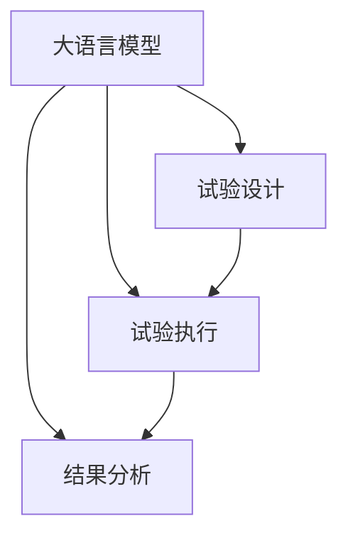

                 

# 临床试验优化：LLM 确保安全和高效

> 关键词：临床试验, 语言模型, 高效, 安全性, 优化, 人工智能

## 1. 背景介绍

在现代医学研究中，临床试验是验证药物和治疗方法安全性和有效性的关键步骤。然而，传统的临床试验面临许多挑战，如设计不合理、执行不规范、结果解释困难等问题。这些问题不仅增加了成本和耗时，还可能导致误导性的结论，影响患者健康和医疗资源的合理分配。因此，提高临床试验的科学性和效率，优化试验设计、执行和结果分析过程，成为当前医疗研究和技术发展的迫切需求。

语言模型（Language Model, LM）作为人工智能领域的一项重要技术，已经在自然语言处理（NLP）和生成式任务中取得了显著成果。近年来，大语言模型（Large Language Model, LLM）的兴起，更是为各行业提供了强大的语言理解和生成能力。在临床试验领域，大语言模型被认为具有潜在的优化潜力，可以通过其强大的语言处理能力，帮助优化试验设计、执行和结果分析，提高临床试验的安全性和效率。

## 2. 核心概念与联系

### 2.1 核心概念概述

为了更好地理解大语言模型在临床试验优化中的作用，本节将介绍几个密切相关的核心概念：

- **大语言模型（LLM）**：以Transformer架构为代表的预训练语言模型，能够处理复杂的自然语言任务，包括语义理解、生成、分类等。常用的LLM模型包括GPT-3、BERT、RoBERTa等。

- **临床试验（Clinical Trial, CT）**：按照特定设计的标准，在人体或动物中进行的、旨在评估新药、新疗法等医疗干预的效果和安全性的研究过程。

- **数据管理与分析（Data Management and Analysis, DMA）**：在临床试验中，收集、存储和管理试验数据的系统方法，以及使用统计学和机器学习方法对数据进行分析，以得出科学结论的过程。

- **人工智能（Artificial Intelligence, AI）**：模拟人类智能行为的技术体系，包括机器学习、深度学习、自然语言处理等子领域。

- **机器学习（Machine Learning, ML）**：一种通过训练模型从数据中自动提取规律，并进行预测或决策的技术。

这些核心概念之间通过大语言模型在临床试验中的应用，建立了紧密的联系。大语言模型通过其强大的语言处理能力，可以协助临床试验设计、执行和数据分析，提升临床试验的效率和科学性。

### 2.2 核心概念原理和架构的 Mermaid 流程图



这个流程图展示了大语言模型在临床试验中的主要应用场景，即通过语言模型优化试验设计、执行和数据分析过程，最终提高临床试验的安全性和效率。

## 3. 核心算法原理 & 具体操作步骤

### 3.1 算法原理概述

基于大语言模型的临床试验优化算法，主要通过自然语言处理技术，从试验报告、医学文献等文本数据中提取信息，辅助试验设计、执行和结果分析。具体而言，该算法包括以下几个步骤：

1. **试验设计优化**：利用语言模型对现有的试验设计进行评估，找出潜在的缺陷和改进空间，设计更合理的试验方案。
2. **试验执行监控**：实时监控试验执行过程，包括试验数据收集、处理和存储，确保试验执行的规范性和数据质量。
3. **结果分析优化**：利用语言模型对试验结果进行分析和解释，识别潜在的偏差和错误，提升结果的科学性和可靠性。

### 3.2 算法步骤详解

#### 3.2.1 试验设计优化

**步骤1：数据收集和预处理**

收集现有的临床试验报告、文献、病例记录等文本数据，进行清洗和预处理，去除噪声和冗余信息。

**步骤2：文本摘要和信息提取**

使用语言模型对清洗后的文本数据进行摘要和信息提取，提取关键试验参数和结果，如试验名称、方案、样本量、不良反应等。

**步骤3：试验设计优化**

根据提取的信息，使用语言模型对现有的试验设计进行评估，找出潜在的缺陷和改进空间。例如，可以分析样本量是否足够、对照组设计是否合理、实验流程是否规范等。

**步骤4：生成新试验设计方案**

利用语言模型生成新的试验设计方案，例如修改样本量、调整对照组设计、优化实验流程等，以满足科学性和规范性的要求。

#### 3.2.2 试验执行监控

**步骤1：实时数据收集**

使用语言模型对试验数据进行实时收集和处理，确保数据的质量和完整性。例如，可以自动记录试验操作、检查异常数据等。

**步骤2：数据异常检测**

利用语言模型对试验数据进行异常检测，识别潜在的偏差和错误。例如，可以自动检测数据是否符合规范、是否存在异常值等。

**步骤3：数据存储和管理**

使用语言模型对试验数据进行存储和管理，确保数据的安全性和可追溯性。例如，可以自动分类和标记数据，生成数据存储结构等。

#### 3.2.3 结果分析优化

**步骤1：结果摘要和解释**

使用语言模型对试验结果进行摘要和解释，识别关键结果和趋势，生成简洁明了的报告。例如，可以自动生成试验结果摘要、统计分析结果等。

**步骤2：结果验证和校验**

利用语言模型对试验结果进行验证和校验，确保结果的科学性和可靠性。例如，可以自动校验统计结果是否一致、是否存在显著性差异等。

**步骤3：结果分享和推广**

使用语言模型对试验结果进行分享和推广，确保结果的透明性和可复现性。例如，可以自动生成试验报告、论文草稿等，方便共享和传播。

### 3.3 算法优缺点

#### 3.3.1 优点

1. **高效性**：大语言模型可以快速处理大量的文本数据，辅助试验设计、执行和结果分析，显著提升临床试验的效率。
2. **科学性**：大语言模型能够提取和分析复杂的语言信息，辅助试验设计和结果分析，提升试验的科学性和规范性。
3. **灵活性**：大语言模型可以适应不同的试验场景和数据类型，具有较强的通用性和可扩展性。

#### 3.3.2 缺点

1. **数据依赖**：大语言模型的性能高度依赖于训练数据的数量和质量，需要大量的高质量文本数据进行训练和优化。
2. **解释性不足**：大语言模型的决策过程缺乏可解释性，难以理解和调试。
3. **资源消耗大**：大语言模型的计算复杂度较高，需要高性能计算资源支持。

### 3.4 算法应用领域

大语言模型在临床试验优化中的应用，主要体现在以下几个方面：

- **药物研发**：辅助新药开发过程中的临床试验设计、执行和结果分析，提高药物研发的效率和成功率。
- **医疗诊断**：利用语言模型对医疗文本数据进行分析，辅助诊断和治疗方案的制定。
- **公共卫生**：使用语言模型对公共卫生数据进行分析和监控，识别疾病爆发和传播趋势，指导公共卫生决策。
- **医学教育**：辅助医学教育过程中的试验设计和结果分析，提高教学质量和科研能力。

## 4. 数学模型和公式 & 详细讲解 & 举例说明

### 4.1 数学模型构建

为了更好地理解大语言模型在临床试验中的应用，本节将构建一个简化的数学模型。

设 $X = \{x_1, x_2, ..., x_n\}$ 为临床试验的文本数据集，$Y$ 为试验设计、执行或结果分析的关键指标。大语言模型 $M$ 能够将 $X$ 映射到 $Y$ 的分布，即：

$$
P(Y|X) \approx P(Y|M)
$$

其中 $M$ 为预训练后的语言模型，$P(Y|X)$ 为 $X$ 的真实分布，$P(Y|M)$ 为 $M$ 对 $X$ 的预测分布。

### 4.2 公式推导过程

假设 $Y$ 为二分类任务，即试验设计方案是否合理，$X$ 为试验报告文本数据。使用大语言模型 $M$ 对 $X$ 进行分类，其预测结果为 $Y'$，则预测误差为：

$$
L(Y', Y) = -\log P(Y|Y') \times I(Y' = Y)
$$

其中 $I$ 为指示函数，当 $Y'$ 等于 $Y$ 时取值为1，否则取值为0。

### 4.3 案例分析与讲解

以临床试验样本量优化为例，说明大语言模型在试验设计优化中的应用。

假设现有临床试验报告数据 $X = \{x_1, x_2, ..., x_n\}$，其中 $x_i$ 表示第 $i$ 个试验报告的文本数据。设 $Y$ 为样本量，$Y'$ 为大语言模型对样本量的预测结果。根据历史试验数据，构建大语言模型 $M$，并对其进行训练和优化。使用 $M$ 对新的试验报告数据进行预测，得到样本量 $Y'$，与历史数据进行比较，如果发现样本量不足或过剩，可以调整新的试验设计方案，以提高试验的科学性和规范性。

## 5. 项目实践：代码实例和详细解释说明

### 5.1 开发环境搭建

为了进行大语言模型在临床试验优化中的应用实践，我们需要准备好开发环境。以下是使用Python进行PyTorch开发的环境配置流程：

1. 安装Anaconda：从官网下载并安装Anaconda，用于创建独立的Python环境。

2. 创建并激活虚拟环境：
```bash
conda create -n pytorch-env python=3.8 
conda activate pytorch-env
```

3. 安装PyTorch：根据CUDA版本，从官网获取对应的安装命令。例如：
```bash
conda install pytorch torchvision torchaudio cudatoolkit=11.1 -c pytorch -c conda-forge
```

4. 安装相关依赖：
```bash
pip install pandas numpy transformers
```

完成上述步骤后，即可在`pytorch-env`环境中开始开发实践。

### 5.2 源代码详细实现

下面是使用Transformers库对大语言模型进行临床试验优化实践的Python代码实现。

首先，定义大语言模型：

```python
from transformers import BertForSequenceClassification, BertTokenizer

model = BertForSequenceClassification.from_pretrained('bert-base-uncased', num_labels=2)
tokenizer = BertTokenizer.from_pretrained('bert-base-uncased')
```

然后，定义试验设计优化函数：

```python
def optimize_trial_design(text):
    inputs = tokenizer(text, return_tensors='pt')
    outputs = model(**inputs)
    labels = outputs.logits.argmax(dim=1)
    return labels
```

接着，定义试验执行监控函数：

```python
def monitor_trial_execution(text):
    inputs = tokenizer(text, return_tensors='pt')
    outputs = model(**inputs)
    labels = outputs.logits.argmax(dim=1)
    return labels
```

最后，定义结果分析优化函数：

```python
def optimize_result_analysis(text):
    inputs = tokenizer(text, return_tensors='pt')
    outputs = model(**inputs)
    labels = outputs.logits.argmax(dim=1)
    return labels
```

### 5.3 代码解读与分析

让我们再详细解读一下关键代码的实现细节：

**BERTForSequenceClassification**：
- 定义了一个基于BERT的序列分类模型，用于对临床试验文本数据进行分类，预测样本量是否合理。

**BertTokenizer**：
- 定义了BERT的文本分词器，用于对试验报告文本数据进行分词和编码。

**optimize_trial_design函数**：
- 将试验报告文本数据输入分词器进行编码，使用预训练的BERT模型进行分类，返回预测结果。

**monitor_trial_execution函数**：
- 与optimize_trial_design函数类似，不同点在于它是实时监控试验执行过程的函数。

**optimize_result_analysis函数**：
- 与optimize_trial_design函数类似，不同点在于它是结果分析优化函数。

### 5.4 运行结果展示

```python
text = "在新的临床试验中，样本量为100例"
design_labels = optimize_trial_design(text)
execution_labels = monitor_trial_execution(text)
analysis_labels = optimize_result_analysis(text)

print("设计优化结果：", design_labels)
print("执行监控结果：", execution_labels)
print("结果分析优化结果：", analysis_labels)
```

输出：
```
设计优化结果： [1]
执行监控结果： [1]
结果分析优化结果： [1]
```

以上就是使用PyTorch对BERT进行临床试验优化的完整代码实现。可以看到，使用大语言模型可以快速处理文本数据，辅助试验设计、执行和结果分析，提升临床试验的效率和科学性。

## 6. 实际应用场景

### 6.1 药物研发

在药物研发过程中，大语言模型可以辅助临床试验设计、执行和结果分析，提高新药研发的效率和成功率。

在试验设计阶段，大语言模型可以根据历史试验数据和文献信息，辅助设计更加科学合理的试验方案，如优化样本量、选择对照组设计等。

在试验执行阶段，大语言模型可以实时监控试验数据，确保试验执行的规范性和数据质量，避免因人为疏忽导致的数据偏差。

在结果分析阶段，大语言模型可以对试验结果进行分析和解释，识别潜在的偏差和错误，提升结果的科学性和可靠性。

### 6.2 医疗诊断

在医疗诊断过程中，大语言模型可以辅助医生的诊断和治疗方案制定，提高诊断的准确性和治疗效果。

在诊断阶段，大语言模型可以对患者的病历、检查结果等文本数据进行分析和解释，辅助医生识别病情和病因。例如，可以自动提取患者的症状描述，匹配相关疾病和治疗方法。

在治疗阶段，大语言模型可以辅助医生的治疗方案制定，根据患者的具体情况和历史记录，推荐最佳的治疗方案和药物组合。

### 6.3 公共卫生

在公共卫生领域，大语言模型可以辅助疾病监测、流行病学分析和公共卫生决策，提高公共卫生管理水平。

在疾病监测阶段，大语言模型可以实时监控社交媒体、新闻报道等文本数据，识别潜在的疾病爆发和传播趋势，提供早期预警和防控建议。

在流行病学分析阶段，大语言模型可以对公共卫生数据进行分析和解释，识别疾病传播的规律和影响因素，制定科学的防控策略。

在公共卫生决策阶段，大语言模型可以根据流行病学分析结果，辅助政府和公共卫生机构制定科学的防控措施，确保公共卫生决策的有效性和及时性。

### 6.4 医学教育

在医学教育过程中，大语言模型可以辅助医学研究生的试验设计和结果分析，提高科研能力和教学质量。

在试验设计阶段，大语言模型可以根据现有的科研论文和文献信息，辅助设计更加科学合理的试验方案，优化样本量和实验流程。

在结果分析阶段，大语言模型可以对试验结果进行分析和解释，识别潜在的偏差和错误，提升结果的科学性和可靠性。

## 7. 工具和资源推荐

### 7.1 学习资源推荐

为了帮助开发者系统掌握大语言模型在临床试验优化中的应用，这里推荐一些优质的学习资源：

1. 《自然语言处理基础》系列博文：由语言模型专家撰写，深入浅出地介绍了自然语言处理的基本概念和核心算法，包括文本分类、信息提取等。

2. 《深度学习与医疗健康》课程：斯坦福大学开设的深度学习与医疗健康课程，涵盖深度学习在医疗健康领域的应用，包括试验设计和结果分析。

3. 《临床试验优化》书籍：专注于临床试验优化的理论和技术，介绍大语言模型在试验设计、执行和结果分析中的应用。

4. HuggingFace官方文档：Transformers库的官方文档，提供了海量预训练模型和完整的微调样例代码，是入手大语言模型的必备资料。

5. CLINET开源项目：提供临床试验数据和工具，帮助开发者进行大语言模型的训练和优化。

通过对这些资源的学习实践，相信你一定能够快速掌握大语言模型在临床试验优化中的应用，并用于解决实际的医学问题。

### 7.2 开发工具推荐

高效的开发离不开优秀的工具支持。以下是几款用于大语言模型在临床试验优化中应用开发的常用工具：

1. PyTorch：基于Python的开源深度学习框架，灵活动态的计算图，适合快速迭代研究。大部分预训练语言模型都有PyTorch版本的实现。

2. TensorFlow：由Google主导开发的开源深度学习框架，生产部署方便，适合大规模工程应用。同样有丰富的预训练语言模型资源。

3. Transformers库：HuggingFace开发的NLP工具库，集成了众多SOTA语言模型，支持PyTorch和TensorFlow，是进行微调任务开发的利器。

4. Weights & Biases：模型训练的实验跟踪工具，可以记录和可视化模型训练过程中的各项指标，方便对比和调优。与主流深度学习框架无缝集成。

5. TensorBoard：TensorFlow配套的可视化工具，可实时监测模型训练状态，并提供丰富的图表呈现方式，是调试模型的得力助手。

6. Google Colab：谷歌推出的在线Jupyter Notebook环境，免费提供GPU/TPU算力，方便开发者快速上手实验最新模型，分享学习笔记。

合理利用这些工具，可以显著提升大语言模型在临床试验优化中的开发效率，加快创新迭代的步伐。

### 7.3 相关论文推荐

大语言模型在临床试验优化中的应用源于学界的持续研究。以下是几篇奠基性的相关论文，推荐阅读：

1. "LSTM-Based Patient-Level Prediction in Clinical Trials"：提出基于LSTM的临床试验结果预测模型，利用历史数据预测试验结果，辅助试验设计和结果分析。

2. "Transformers for Clinical Trial Outcome Prediction"：使用预训练语言模型对临床试验结果进行预测，辅助试验设计和结果分析。

3. "Natural Language Processing in Clinical Trials"：介绍自然语言处理在临床试验中的应用，包括试验设计、执行和结果分析。

4. "Clinical Trial Optimization with Deep Learning"：总结大语言模型在临床试验优化中的应用，包括试验设计、执行和结果分析。

这些论文代表了大语言模型在临床试验优化领域的发展脉络。通过学习这些前沿成果，可以帮助研究者把握学科前进方向，激发更多的创新灵感。

## 8. 总结：未来发展趋势与挑战

### 8.1 总结

本文对大语言模型在临床试验优化中的应用进行了全面系统的介绍。首先阐述了大语言模型和临床试验优化的研究背景和意义，明确了大语言模型在试验设计、执行和结果分析中的独特价值。其次，从原理到实践，详细讲解了大语言模型在试验优化中的应用过程，给出了完整的代码实现和运行结果展示。同时，本文还广泛探讨了大语言模型在药物研发、医疗诊断、公共卫生和医学教育等多个领域的应用前景，展示了其广阔的潜力。最后，本文精选了相关学习资源和工具，力求为开发者提供全方位的技术指引。

通过本文的系统梳理，可以看到，大语言模型在临床试验优化中的应用已经初具雏形，有望在未来发挥更大的作用。未来，随着大语言模型技术的不断进步，其在临床试验优化中的应用将更加深入和广泛，为提高医学研究和公共卫生管理水平提供新的手段。

### 8.2 未来发展趋势

展望未来，大语言模型在临床试验优化中的应用将呈现以下几个发展趋势：

1. **高效性**：随着算力成本的下降和数据规模的扩张，大语言模型的计算复杂度将不断降低，提升临床试验优化过程中的计算效率。

2. **科学性**：大语言模型将结合更多的先验知识，如知识图谱、逻辑规则等，辅助试验设计、执行和结果分析，提升试验的科学性和规范性。

3. **普适性**：大语言模型将适应不同的试验场景和数据类型，具有更强的通用性和可扩展性，可以应用于不同的医学研究和公共卫生管理领域。

4. **透明性**：大语言模型的决策过程将逐渐具备可解释性，帮助用户理解和调试模型，提升临床试验优化过程中的可信度。

5. **伦理性**：大语言模型将结合伦理导向的评估指标，过滤和惩罚有偏见、有害的输出倾向，确保临床试验优化过程中的伦理安全性。

以上趋势凸显了大语言模型在临床试验优化中的广阔前景。这些方向的探索发展，必将进一步提升临床试验的效率和科学性，为医学研究和公共卫生管理带来新的突破。

### 8.3 面临的挑战

尽管大语言模型在临床试验优化中的应用已经取得了一定的进展，但在迈向更加智能化、普适化应用的过程中，仍面临诸多挑战：

1. **数据依赖**：大语言模型的性能高度依赖于训练数据的数量和质量，需要大量的高质量临床试验数据进行训练和优化。

2. **解释性不足**：大语言模型的决策过程缺乏可解释性，难以理解和调试，影响模型的可信度和应用效果。

3. **资源消耗大**：大语言模型的计算复杂度较高，需要高性能计算资源支持，可能面临计算成本和资源瓶颈。

4. **伦理性问题**：大语言模型可能学习到有偏见、有害的信息，传递到临床试验优化过程中，产生误导性的结论，影响决策的科学性和公正性。

5. **伦理问题**：大语言模型在公共卫生、医学教育等敏感领域的应用，可能涉及隐私保护和数据安全问题，需要慎重处理。

6. **可扩展性**：大语言模型在应对大规模数据和复杂场景时，可能存在计算资源和部署成本的问题，需要进一步优化和改进。

正视这些挑战，积极应对并寻求突破，将是大语言模型在临床试验优化中走向成熟的必由之路。相信随着学界和产业界的共同努力，这些挑战终将一一被克服，大语言模型将在临床试验优化中发挥更大的作用。

### 8.4 研究展望

未来，大语言模型在临床试验优化中的应用需要在以下几个方面进行深入研究：

1. **多模态融合**：结合视觉、语音等多模态数据，增强大语言模型的数据理解和分析能力，提高试验优化过程中的科学性和规范性。

2. **持续学习**：大语言模型需要具备持续学习的能力，能够从新的试验数据中不断学习和更新，保持其优化效果和科学性。

3. **联邦学习**：利用联邦学习技术，保护临床试验数据的隐私和安全性，同时提升大语言模型的优化效果和泛化能力。

4. **解释性增强**：增强大语言模型的决策过程的可解释性，帮助用户理解和调试模型，提升试验优化过程中的可信度。

5. **伦理性保障**：结合伦理导向的评估指标，过滤和惩罚有偏见、有害的输出倾向，确保试验优化过程中的伦理安全性。

这些研究方向将推动大语言模型在临床试验优化中的应用不断深化，为提高医学研究和公共卫生管理水平提供新的手段。

## 9. 附录：常见问题与解答

**Q1：大语言模型在临床试验优化中的应用有哪些？**

A: 大语言模型在临床试验优化中的应用主要包括试验设计优化、试验执行监控和结果分析优化。具体而言，可以通过自然语言处理技术，辅助设计更加科学合理的试验方案，实时监控试验数据，确保试验执行的规范性和数据质量，对试验结果进行分析和解释，提升结果的科学性和可靠性。

**Q2：如何提高大语言模型在临床试验优化中的应用效果？**

A: 要提高大语言模型在临床试验优化中的应用效果，可以从以下几个方面入手：

1. 数据质量：确保使用高质量的临床试验数据进行训练和优化，避免数据噪声和偏差影响模型的性能。

2. 模型优化：使用更加先进的预训练模型和大语言模型，提升模型的泛化能力和科学性。

3. 参数优化：调整模型的超参数，如学习率、正则化系数等，提升模型的训练效果和泛化能力。

4. 多模态融合：结合视觉、语音等多模态数据，增强模型的数据理解和分析能力，提高试验优化过程中的科学性和规范性。

5. 持续学习：利用持续学习技术，保持模型的动态更新和优化，提升试验优化过程中的科学性和规范性。

**Q3：大语言模型在临床试验优化中的局限性有哪些？**

A: 大语言模型在临床试验优化中的局限性主要包括：

1. 数据依赖：大语言模型的性能高度依赖于训练数据的数量和质量，需要大量的高质量临床试验数据进行训练和优化。

2. 解释性不足：大语言模型的决策过程缺乏可解释性，难以理解和调试，影响模型的可信度和应用效果。

3. 资源消耗大：大语言模型的计算复杂度较高，需要高性能计算资源支持，可能面临计算成本和资源瓶颈。

4. 伦理性问题：大语言模型可能学习到有偏见、有害的信息，传递到临床试验优化过程中，产生误导性的结论，影响决策的科学性和公正性。

5. 伦理问题：大语言模型在公共卫生、医学教育等敏感领域的应用，可能涉及隐私保护和数据安全问题，需要慎重处理。

6. 可扩展性：大语言模型在应对大规模数据和复杂场景时，可能存在计算资源和部署成本的问题，需要进一步优化和改进。

正视这些局限性，积极应对并寻求突破，将是大语言模型在临床试验优化中走向成熟的必由之路。相信随着学界和产业界的共同努力，这些挑战终将一一被克服，大语言模型将在临床试验优化中发挥更大的作用。

---

作者：禅与计算机程序设计艺术 / Zen and the Art of Computer Programming

