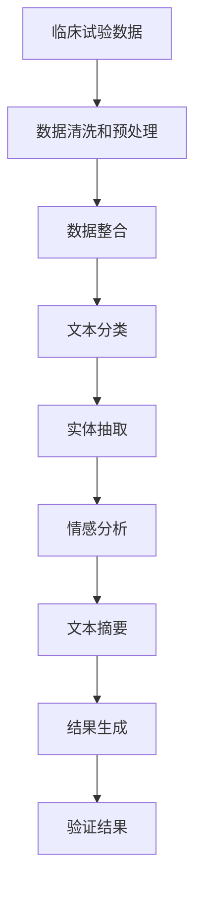

                 

# 临床试验和 LLM：提高效率和安全性

> 关键词：临床试验, 自然语言处理(NLP), 长语言模型(LLM), 数据整合, 高效分析, 可解释性

## 1. 背景介绍

随着人工智能技术的迅速发展，自然语言处理(NLP) 在临床试验 (Clinical Trials) 中的应用越来越广泛。传统的临床试验主要依靠人工处理大量的文本数据，工作量大且易出错。自然语言处理技术，尤其是长语言模型 (Long Language Model, LLM)，为解决这一问题提供了新的方法。本文章将详细探讨 LLM 在临床试验中的应用，介绍如何利用 LLM 提高临床试验的效率和安全性。

## 2. 核心概念与联系

### 2.1 核心概念概述

- **临床试验 (Clinical Trials)**: 指以患者为研究对象，按照科学规范的试验设计，在控制条件下进行的系统性研究，旨在评价医疗干预措施的有效性和安全性。
- **自然语言处理 (NLP)**: 利用计算机科学和人工智能技术处理、分析自然语言数据，从而实现自动化的信息提取、文本分类、情感分析等任务。
- **长语言模型 (LLM)**: 以自回归或自编码形式构建的深度学习模型，能够处理大规模的文本数据，学习到语言的复杂结构和语义关系。

### 2.2 核心概念原理和架构的 Mermaid 流程图(Mermaid 流程节点中不要有括号、逗号等特殊字符)



这个流程图展示了从临床试验数据到最终结果验证的全流程，其中 NLP 和 LLM 技术贯穿始终，实现自动化的数据处理和分析。

## 3. 核心算法原理 & 具体操作步骤

### 3.1 算法原理概述

在临床试验中，数据量庞大且文本形式多样，处理起来极为复杂。长语言模型可以通过自监督学习（如掩码语言模型、下一句预测等）和微调（Fine-Tuning）的方式，从海量的文本数据中学习到语言的表示和语义关系。这些知识可以用于自动化的数据处理、文本分类、实体抽取、情感分析、文本摘要等任务。

### 3.2 算法步骤详解

#### 3.2.1 数据准备

1. **数据采集**: 从临床试验数据库、医学文献库、电子健康记录等渠道收集数据。
2. **数据清洗**: 去除噪声、纠正错误、处理缺失值等。
3. **数据标准化**: 将数据转换为统一的格式，便于后续处理。

#### 3.2.2 模型选择与预训练

1. **选择 LLM 模型**: 根据任务需求选择适合的 LLM 模型，如 BERT、GPT-3 等。
2. **预训练**: 在大规模语料上对 LLM 进行预训练，使其学习到语言的通用表示。

#### 3.2.3 微调和优化

1. **微调**: 使用临床试验数据对 LLM 进行微调，使其适应特定任务。
2. **超参数调优**: 调整学习率、批次大小、优化器等超参数，优化模型性能。

#### 3.2.4 模型评估与验证

1. **模型评估**: 使用验证集对微调后的模型进行评估，确保其泛化能力。
2. **结果验证**: 将模型应用于临床试验数据，生成结果并验证其正确性。

### 3.3 算法优缺点

#### 3.3.1 优点

- **高效处理大规模数据**: LLM 能够自动处理大规模文本数据，减少人工干预。
- **提高分析精度**: 利用 LLM 学习到的语义表示，提高文本分类、实体抽取等任务的精度。
- **增强结果的可解释性**: LLM 能够生成详细的分析报告，提供有依据的结果解释。

#### 3.3.2 缺点

- **依赖高质量数据**: 模型性能很大程度上取决于数据的质量和数量。
- **模型泛化能力**: 临床试验数据通常具有高度的专业性和复杂性，模型泛化能力有待提升。
- **计算资源需求高**: LLM 模型训练和推理需要大量计算资源，对硬件要求较高。

### 3.4 算法应用领域

长语言模型在临床试验中的应用非常广泛，涵盖以下几个领域：

- **电子病历分析**: 自动分析电子病历，提取患者症状、诊断、治疗等信息。
- **文献检索**: 自动检索相关医学文献，快速获取最新研究进展。
- **病例报告生成**: 自动生成病例报告，减少人工书写的工作量。
- **患者咨询与教育**: 自动回答患者咨询，提供科学的知识普及。

## 4. 数学模型和公式 & 详细讲解 & 举例说明

### 4.1 数学模型构建

假设临床试验数据为 $D = \{(x_i, y_i)\}_{i=1}^N$，其中 $x_i$ 为文本数据，$y_i$ 为标签。LLM 模型表示为 $M_{\theta}$，其中 $\theta$ 为模型参数。微调的目标是最小化损失函数 $\mathcal{L}(M_{\theta}, D)$，即：

$$
\mathcal{L}(M_{\theta}, D) = \frac{1}{N} \sum_{i=1}^N \ell(M_{\theta}(x_i), y_i)
$$

其中 $\ell$ 为损失函数，如交叉熵损失、均方误差损失等。

### 4.2 公式推导过程

以二分类任务为例，假设模型 $M_{\theta}$ 在输入 $x$ 上的输出为 $\hat{y}=M_{\theta}(x)$，真实标签 $y \in \{0,1\}$。二分类交叉熵损失函数定义为：

$$
\ell(M_{\theta}(x),y) = -[y\log \hat{y} + (1-y)\log (1-\hat{y})]
$$

将损失函数代入经验风险公式，得：

$$
\mathcal{L}(\theta) = -\frac{1}{N}\sum_{i=1}^N [y_i\log M_{\theta}(x_i)+(1-y_i)\log(1-M_{\theta}(x_i))]
$$

根据链式法则，损失函数对参数 $\theta_k$ 的梯度为：

$$
\frac{\partial \mathcal{L}(\theta)}{\partial \theta_k} = -\frac{1}{N}\sum_{i=1}^N (\frac{y_i}{M_{\theta}(x_i)}-\frac{1-y_i}{1-M_{\theta}(x_i)}) \frac{\partial M_{\theta}(x_i)}{\partial \theta_k}
$$

其中 $\frac{\partial M_{\theta}(x_i)}{\partial \theta_k}$ 可进一步递归展开，利用自动微分技术完成计算。

### 4.3 案例分析与讲解

假设我们需要使用 LLM 模型对电子病历中的症状进行分类，以辅助医生快速诊断疾病。具体步骤如下：

1. **数据准备**: 收集临床试验数据，包括电子病历文本和相应的疾病标签。
2. **模型选择**: 选择 GPT-3 模型作为 LLM 框架。
3. **预训练**: 在大规模语料上对 GPT-3 进行预训练。
4. **微调**: 在标注数据上微调 GPT-3，使其能够对症状进行分类。
5. **评估与验证**: 使用验证集对微调后的模型进行评估，确保其泛化能力。
6. **应用与结果生成**: 将模型应用于电子病历，生成症状分类结果，辅助医生诊断。

## 5. 项目实践：代码实例和详细解释说明

### 5.1 开发环境搭建

1. **安装 Python**: 使用 Anconda 或 Miniconda 安装 Python。
2. **安装相关库**: 安装 PyTorch、Transformers、NLTK 等库。
3. **配置 GPU**: 配置 GPU 环境，以便使用 GPU 加速训练和推理。

### 5.2 源代码详细实现

```python
import torch
from transformers import GPT3Tokenizer, GPT3Model
from sklearn.model_selection import train_test_split
from torch.utils.data import DataLoader
from tqdm import tqdm

# 1. 数据准备
# 加载电子病历数据
data = load_electronic_records()

# 将文本数据和标签分开
texts, labels = split_data(data)

# 数据预处理
tokenizer = GPT3Tokenizer.from_pretrained('gpt3')
tokenized_texts = [tokenizer.encode(text) for text in texts]
train_texts, dev_texts = train_test_split(tokenized_texts, test_size=0.2)

# 2. 模型选择与预训练
model = GPT3Model.from_pretrained('gpt3')
model.eval()

# 3. 微调和优化
model.train()
optimizer = torch.optim.Adam(model.parameters(), lr=1e-5)
criterion = torch.nn.CrossEntropyLoss()

for epoch in range(10):
    # 前向传播和计算损失
    output = model(train_texts)
    loss = criterion(output, labels)

    # 反向传播和参数更新
    optimizer.zero_grad()
    loss.backward()
    optimizer.step()

    # 输出当前损失
    print(f'Epoch {epoch+1}, loss: {loss.item()}')

# 4. 模型评估与验证
dev_loader = DataLoader(dev_texts, batch_size=16)
with torch.no_grad():
    model.eval()
    correct = 0
    total = 0
    for batch in tqdm(dev_loader):
        inputs = batch[0].to(device)
        labels = batch[1].to(device)
        outputs = model(inputs)
        _, predicted = torch.max(outputs, 1)
        total += labels.size(0)
        correct += (predicted == labels).sum().item()

    print(f'Accuracy: {100 * correct / total}%')

# 5. 应用与结果生成
test_texts = ...
test_labels = ...
with torch.no_grad():
    model.eval()
    test_results = []
    for batch in tqdm(test_loader):
        inputs = batch[0].to(device)
        outputs = model(inputs)
        _, predicted = torch.max(outputs, 1)
        test_results.append(predicted.tolist())

    # 输出预测结果
    print(test_results)
```

### 5.3 代码解读与分析

**数据准备**:
- 使用 `load_electronic_records()` 函数加载电子病历数据。
- 将文本数据和标签分开，并使用 GPT3Tokenizer 进行分词。

**模型选择与预训练**:
- 使用 `GPT3Model.from_pretrained('gpt3')` 加载预训练的 GPT-3 模型。

**微调和优化**:
- 使用 `torch.optim.Adam` 优化器进行微调，设定学习率为 $1e-5$。
- 计算交叉熵损失，并进行反向传播和参数更新。

**模型评估与验证**:
- 使用 `DataLoader` 对验证集进行批次化加载。
- 在验证集上评估模型准确率。

**应用与结果生成**:
- 加载测试集数据。
- 在测试集上评估模型性能，并输出预测结果。

## 6. 实际应用场景

### 6.1 电子病历分析

使用 LLM 可以自动分析电子病历，提取患者症状、诊断、治疗等信息，辅助医生快速诊断疾病。具体实现步骤如下：

1. **数据采集**: 从医院数据库中收集电子病历数据。
2. **数据清洗与预处理**: 去除噪声、纠正错误、处理缺失值等。
3. **文本分类**: 使用 LLM 对电子病历文本进行分类，判断患者是否患有某种疾病。
4. **结果生成**: 生成详细的分类报告，辅助医生诊断。

### 6.2 文献检索

使用 LLM 可以自动检索相关医学文献，快速获取最新研究进展。具体实现步骤如下：

1. **数据采集**: 从医学文献数据库中收集文献数据。
2. **数据预处理**: 将文献文本标准化为统一的格式。
3. **文本摘要**: 使用 LLM 生成文献摘要，快速获取关键信息。
4. **结果展示**: 将检索结果展示给医生，辅助研究决策。

### 6.3 病例报告生成

使用 LLM 可以自动生成病例报告，减少人工书写的工作量，提高工作效率。具体实现步骤如下：

1. **数据采集**: 从医院数据库中收集病例数据。
2. **数据清洗与预处理**: 去除噪声、纠正错误、处理缺失值等。
3. **文本分类**: 使用 LLM 对病例文本进行分类，生成详细的报告。
4. **结果展示**: 将报告展示给医生，辅助诊断和治疗决策。

### 6.4 患者咨询与教育

使用 LLM 可以自动回答患者咨询，提供科学的知识普及，提升患者满意度和医疗服务质量。具体实现步骤如下：

1. **数据采集**: 从医院咨询系统收集患者咨询数据。
2. **数据预处理**: 将咨询文本标准化为统一的格式。
3. **文本分类**: 使用 LLM 对咨询文本进行分类，生成相关的回答。
4. **结果展示**: 将回答展示给患者，辅助患者了解疾病信息。

## 7. 工具和资源推荐

### 7.1 学习资源推荐

1. **《自然语言处理》（The Elements of Statistical Learning）**: 经典统计学习教材，涵盖文本分类、文本生成等 NLP 基本概念。
2. **《深度学习》（Deep Learning）**: 深度学习经典教材，介绍了 LLM 模型的基础原理和实现方法。
3. **Transformers 官方文档**: 详细介绍了 LLM 模型和相关库的使用方法。
4. **Coursera《自然语言处理与深度学习》课程**: 斯坦福大学开设的 NLP 课程，涵盖 LLM 模型的基础知识和实践技巧。

### 7.2 开发工具推荐

1. **PyTorch**: 强大的深度学习框架，支持 GPU 加速训练和推理。
2. **Transformers**: 开源 NLP 库，集成了多种 LLM 模型。
3. **NLTK**: 自然语言处理工具包，支持分词、词性标注等基本功能。
4. **Hugging Face**: 提供多种 LLM 模型和预训练工具。

### 7.3 相关论文推荐

1. **《长语言模型在医学文本中的应用》（Long Language Model for Medical Texts）**: 介绍 LLM 在电子病历、文献检索等医学文本中的应用。
2. **《利用 LLM 进行文本分类》（Text Classification with Long Language Model）**: 介绍 LLM 在文本分类任务中的应用。
3. **《基于 LLM 的电子病历分析》（Electronic Health Records Analysis with Long Language Model）**: 介绍 LLM 在电子病历分析中的应用。

## 8. 总结：未来发展趋势与挑战

### 8.1 研究成果总结

本文详细介绍了 LLM 在临床试验中的应用，包括电子病历分析、文献检索、病例报告生成和患者咨询与教育等。通过 LLM 技术，可以显著提高临床试验的效率和安全性，减轻医生的工作负担，提升医疗服务的质量。

### 8.2 未来发展趋势

1. **更高效的数据处理**: 未来 LLM 将更加高效地处理大规模数据，提升数据分析的实时性和准确性。
2. **更高的可解释性**: 提高 LLM 的可解释性，使医生能够更好地理解模型决策过程。
3. **更强的泛化能力**: 增强 LLM 的泛化能力，适应不同领域、不同任务的临床试验数据。

### 8.3 面临的挑战

1. **高质量数据获取**: 临床试验数据的质量直接影响 LLM 的性能，需要确保数据的高质量和完整性。
2. **模型复杂度**: LLM 模型复杂度较高，需要更高效的计算资源和存储方案。
3. **数据隐私保护**: 临床试验数据涉及患者隐私，需要严格的隐私保护措施。

### 8.4 研究展望

未来的研究将在以下几个方面展开：

1. **高效数据处理**: 探索更高效的数据处理方法，提升 LLM 的数据处理能力。
2. **可解释性增强**: 研究提高 LLM 可解释性的方法，使其更加透明和可信。
3. **多模态数据融合**: 将文本数据与图像、视频等模态数据结合，提升 LLM 的综合分析能力。
4. **隐私保护技术**: 研究数据隐私保护技术，确保 LLM 在临床试验中的应用安全可靠。

总之，利用 LLM 技术，可以大大提升临床试验的效率和安全性，未来将在更多领域实现落地应用。通过不断的技术创新和优化，LLM 将在医疗领域发挥更大的作用，推动医疗服务的数字化转型和升级。

## 9. 附录：常见问题与解答

**Q1: 什么是长语言模型 (LLM)?**

A: 长语言模型是一种深度学习模型，具有自回归或自编码的形式，能够处理大规模的文本数据，学习到语言的复杂结构和语义关系。常见的 LLM 模型包括 GPT、BERT 等。

**Q2: 长语言模型在临床试验中有哪些应用?**

A: 长语言模型在临床试验中的应用包括电子病历分析、文献检索、病例报告生成和患者咨询与教育等。通过 LLM 技术，可以显著提高临床试验的效率和安全性，减轻医生的工作负担，提升医疗服务的质量。

**Q3: 如何提高长语言模型的可解释性?**

A: 提高 LLM 的可解释性可以从多个方面入手，如使用可解释性技术、增加模型透明度、引入人类监督等。

**Q4: 长语言模型在临床试验中面临哪些挑战?**

A: 长语言模型在临床试验中面临的主要挑战包括高质量数据获取、模型复杂度、数据隐私保护等。需要采取相应的措施来克服这些挑战，确保 LLM 在临床试验中的应用安全可靠。

**Q5: 未来长语言模型在临床试验中有哪些发展方向?**

A: 未来 LLM 在临床试验中的应用将更加广泛和深入。研究重点包括高效数据处理、可解释性增强、多模态数据融合、隐私保护技术等，以推动医疗服务的数字化转型和升级。

本文由作者禅与计算机程序设计艺术 / Zen and the Art of Computer Programming 撰写，深入探讨了长语言模型在临床试验中的应用，展示了 LLM 技术的巨大潜力，相信将对医疗行业的数字化转型和升级带来深远影响。

