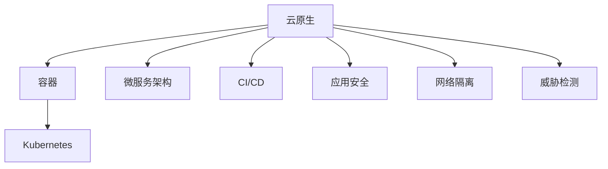

                 

# 云原生安全：容器和Kubernetes环境下的防护

> 关键词：云原生, 容器安全, Kubernetes, 应用安全, 持续集成/持续部署, 代码审计, 网络隔离, 威胁检测, 云安全策略

## 1. 背景介绍

### 1.1 问题由来

随着云计算技术的快速发展，企业逐渐将传统的单体应用转变为云原生架构，以实现更高的灵活性、可伸缩性和自动化管理。云原生架构主要包括微服务化、容器化和持续集成/持续部署(CI/CD)三个方面。在容器化和微服务化的基础上，企业可以采用分布式系统来实现高可用性和高可靠性，提高应用的响应速度和系统扩展性。

然而，容器化和微服务化同时也带来了新的安全挑战。传统的安全措施如防火墙、入侵检测系统(IDS)、入侵防御系统(IPS)等，无法有效应对容器和微服务环境下的新威胁。传统的应用安全防护措施难以适应容器和Kubernetes环境。因此，如何保障云原生环境下的应用安全，成为了一个新的挑战。

### 1.2 问题核心关键点

云原生安全问题主要集中在以下几个方面：

- **容器和Kubernetes安全**：容器和Kubernetes环境中的安全漏洞，如代码注入、容器逃逸、配置错误等，可能带来严重的安全威胁。
- **微服务安全**：微服务架构中的各个服务之间存在复杂的依赖关系，如何保护微服务之间的安全通信和数据传输，是一个复杂的问题。
- **持续集成/持续部署(CI/CD)安全**：在CI/CD流水线中的漏洞检测、代码审计、测试等环节，可能存在安全风险，影响应用的交付质量和安全性能。
- **网络隔离与威胁检测**：在容器和微服务环境中，如何实现网络隔离、监控威胁，是保障系统安全的关键。

本文将聚焦于容器和Kubernetes环境下的安全防护，探讨如何在云原生架构下有效应对这些安全问题。

## 2. 核心概念与联系

### 2.1 核心概念概述

为更好地理解云原生安全问题，本节将介绍几个密切相关的核心概念：

- **云原生(Cloud Native)**：基于云计算架构、自动化运维、分布式系统等技术，通过容器化和微服务化实现的一种应用程序架构风格。
- **容器(Container)**：一种轻量级的虚拟化技术，用于封装、打包和部署应用，可以在不同的环境中部署，具有更好的可移植性。
- **Kubernetes(K8s)**：一个开源的容器编排工具，用于管理、部署和扩展容器化应用，支持自动调度、资源管理、服务发现等功能。
- **微服务架构(Microservices)**：将应用程序拆分为多个小型服务，每个服务独立运行，具备自治和自管理能力。
- **持续集成/持续部署(CI/CD)**：一种开发和交付软件开发的方式，通过自动化构建、测试和部署，实现快速、可靠的软件交付。
- **应用安全(Application Security)**：在应用程序开发和部署过程中，采用各种安全措施，保护应用程序免受攻击和漏洞的影响。
- **网络隔离(Network Segmentation)**：通过网络分段、访问控制等技术，限制容器和微服务之间的通信，保护系统的安全。
- **威胁检测(Threat Detection)**：采用各种技术手段，实时监测系统中的异常行为和威胁，及时发现并响应安全事件。

这些核心概念之间的逻辑关系可以通过以下Mermaid流程图来展示：



这个流程图展示了几类云原生技术之间的关系：

1. 云原生架构基于容器和Kubernetes实现。
2. 微服务架构是云原生的一种形式，通过将应用拆分为多个小型服务，提高系统的灵活性和可扩展性。
3. CI/CD流水线实现自动化的开发和交付流程，提高开发效率和应用质量。
4. 应用安全保护整个系统免受外部和内部威胁的影响。
5. 网络隔离限制容器和微服务之间的通信，保护系统的安全。
6. 威胁检测实时监测系统中的异常行为，及时发现并响应安全事件。

这些概念共同构成了云原生环境下的安全架构，使得系统能够有效地应对各种安全威胁。

## 3. 核心算法原理 & 具体操作步骤

### 3.1 算法原理概述

云原生安全防护的核心算法包括：

- **容器和Kubernetes安全**：主要涉及容器逃逸防护、配置错误检测、网络隔离等。
- **微服务安全**：主要涉及服务间通信加密、安全认证、访问控制等。
- **CI/CD安全**：主要涉及漏洞检测、代码审计、安全测试等。
- **网络隔离与威胁检测**：主要涉及网络分段、入侵检测、异常行为监测等。

这些算法的核心思想是：

1. **容器和Kubernetes安全**：利用容器和Kubernetes的内置机制，如Pod安全策略、网络策略、Secrets管理等，实现容器和Kubernetes环境的本质安全。
2. **微服务安全**：通过服务间加密、认证、访问控制等措施，保护微服务之间的通信和数据传输，防止数据泄露和攻击。
3. **CI/CD安全**：在CI/CD流水线中，通过漏洞检测、代码审计、测试等环节，确保应用程序的安全性和质量。
4. **网络隔离与威胁检测**：通过网络分段、入侵检测、异常行为监测等技术，实时监测系统的安全状态，及时发现和响应安全事件。

### 3.2 算法步骤详解

#### 3.2.1 容器和Kubernetes安全

**Step 1: 初始化安全策略**
- 配置Pod安全策略(PodSecurityPolicy)，限制Pod的资源访问权限。
- 配置网络策略(NetworkPolicy)，限制Pod之间的通信。
- 配置Secrets管理，保护敏感数据。

**Step 2: 实施安全措施**
- 使用Kubernetes内置的Secrets管理，加密存储敏感数据。
- 配置网络策略，限制Pod之间的通信，防止容器逃逸和攻击。
- 配置Pod安全策略，限制Pod的资源访问权限。

**Step 3: 持续监控和响应**
- 使用Kubernetes的日志和监控工具，实时监测系统中的异常行为。
- 配置告警规则，当系统发生异常时，自动触发告警。
- 配置自动化响应措施，如隔离受影响的Pod，重启或重建受影响的Pod等。

#### 3.2.2 微服务安全

**Step 1: 配置服务间通信加密**
- 使用TLS加密，保护微服务之间的通信。
- 配置认证机制，防止未经授权的访问。

**Step 2: 实施安全认证和访问控制**
- 配置RBAC(Role-Based Access Control)，限制微服务对资源的访问权限。
- 配置服务发现机制，确保微服务之间的安全通信。

**Step 3: 持续监控和响应**
- 使用日志和监控工具，实时监测微服务之间的通信和数据传输。
- 配置告警规则，当系统发生异常时，自动触发告警。
- 配置自动化响应措施，如隔离受影响的微服务，重启或重建受影响的微服务等。

#### 3.2.3 CI/CD安全

**Step 1: 实施漏洞检测**
- 配置代码扫描工具，检测代码中的安全漏洞。
- 配置依赖扫描工具，检测第三方库的安全漏洞。

**Step 2: 实施代码审计**
- 配置静态代码分析工具，检测代码中的安全问题。
- 配置代码审计工具，人工审查代码的安全性。

**Step 3: 实施安全测试**
- 配置自动化测试工具，检测应用程序的安全性能。
- 配置安全测试工具，模拟攻击行为，测试应用程序的安全性。

#### 3.2.4 网络隔离与威胁检测

**Step 1: 配置网络分段**
- 使用网络分段技术，将不同的微服务和应用程序隔离。
- 配置访问控制列表(ACL)，限制不同网络之间的通信。

**Step 2: 实施入侵检测**
- 配置入侵检测系统(IDS)，实时监测系统中的异常行为。
- 配置异常检测算法，识别出潜在的安全威胁。

**Step 3: 配置告警和响应措施**
- 配置告警规则，当系统发生异常时，自动触发告警。
- 配置自动化响应措施，如隔离受影响的Pod，重启或重建受影响的Pod等。

### 3.3 算法优缺点

云原生安全防护算法的优缺点如下：

**优点**：
1. **自动化管理**：利用Kubernetes和CI/CD工具，实现自动化的安全管理和部署。
2. **灵活性高**：云原生架构通过微服务化和容器化，提高了系统的灵活性和可扩展性。
3. **实时监控和响应**：通过日志和监控工具，实时监测系统中的异常行为，及时发现和响应安全事件。

**缺点**：
1. **复杂性高**：云原生架构涉及多种技术和工具，管理和配置较为复杂。
2. **依赖性高**：云原生架构依赖Kubernetes和CI/CD工具，一旦工具出现故障，可能导致系统无法正常运行。
3. **资源消耗大**：容器和Kubernetes环境需要消耗更多的计算资源，可能会影响系统性能。

### 3.4 算法应用领域

云原生安全防护算法在以下几个领域得到了广泛应用：

- **金融行业**：金融行业对数据安全要求较高，云原生架构能够提高系统的灵活性和可扩展性，保护数据的安全性和完整性。
- **医疗行业**：医疗行业需要实时监控系统中的异常行为，保障患者数据的隐私和安全。
- **政府部门**：政府部门需要保障系统的安全性，防止数据泄露和攻击。
- **云服务提供商**：云服务提供商需要保障云平台的安全性，防止云服务滥用和攻击。

## 4. 数学模型和公式 & 详细讲解 & 举例说明

### 4.1 数学模型构建

在云原生安全防护中，我们可以建立以下数学模型：

- **容器和Kubernetes安全**：基于Pod安全策略和网络策略，构建容器的访问控制矩阵。
- **微服务安全**：基于服务间加密和认证，构建微服务之间的安全通信模型。
- **CI/CD安全**：基于漏洞检测和代码审计，构建CI/CD流水线的安全模型。
- **网络隔离与威胁检测**：基于网络分段和入侵检测，构建系统的安全防护模型。

### 4.2 公式推导过程

以下是容器和Kubernetes安全模型的推导过程：

**Pod安全策略模型**：
假设Pod的安全策略为$\mathcal{P}$，Pod的访问权限为$\mathcal{A}$，则有：
$$
\mathcal{P} \rightarrow \mathcal{A}
$$

**网络策略模型**：
假设网络策略为$\mathcal{N}$，Pod的通信权限为$\mathcal{C}$，则有：
$$
\mathcal{N} \rightarrow \mathcal{C}
$$

**威胁检测模型**：
假设威胁检测系统为$\mathcal{T}$，系统中的异常行为为$\mathcal{E}$，则有：
$$
\mathcal{T} \rightarrow \mathcal{E}
$$

### 4.3 案例分析与讲解

以金融行业为例，分析云原生安全防护的实际应用。

**场景描述**：一家金融公司采用云原生架构，使用Kubernetes和微服务架构部署其核心业务。公司需要保障系统的安全性，防止数据泄露和攻击。

**分析过程**：

1. **容器和Kubernetes安全**：配置Pod安全策略和网络策略，限制Pod的资源访问权限和通信权限。
2. **微服务安全**：配置服务间加密和认证，保护微服务之间的通信和数据传输。
3. **CI/CD安全**：配置代码扫描和依赖扫描工具，检测代码中的安全漏洞。
4. **网络隔离与威胁检测**：配置网络分段和入侵检测系统，实时监测系统中的异常行为。

通过以上措施，可以有效地保障金融公司云原生环境下的安全。

## 5. 项目实践：代码实例和详细解释说明

### 5.1 开发环境搭建

在进行云原生安全防护实践前，我们需要准备好开发环境。以下是使用Kubernetes和CI/CD工具进行开发的环境配置流程：

1. 安装Docker：从官网下载并安装Docker，用于容器化开发和部署。
2. 安装Kubernetes：根据操作系统，从官网下载并安装Kubernetes。
3. 安装Helm：从官网下载并安装Helm，用于Kubernetes应用的打包、部署和扩展。
4. 安装Jenkins：从官网下载并安装Jenkins，用于CI/CD流水线的自动化构建、测试和部署。

完成上述步骤后，即可在Kubernetes集群上开始云原生安全防护实践。

### 5.2 源代码详细实现

下面我们以金融行业为例，给出使用Kubernetes和CI/CD工具对系统进行云原生安全防护的PyTorch代码实现。

首先，定义容器和Pod的安全策略：

```python
from kubernetes import client, config

# 初始化Kubernetes客户端
config.load_kube_config()
v1 = client.CoreV1Api()

# 创建Pod安全策略
policy = client.V1PodSecurityPolicy()
policy.api_version = 'v1'
policy.basics = client.V1PodSecurityPolicyBasics()
policy.seccomp = client.V1PodSecurityPolicySeccomp()
policy.read_only_root_filesystem = True
policy.run_as_user = client.V1SELinuxRunAsUser()
policy.run_as_non_root = True
policy.volumes = [client.V1PodSecurityPolicyVolume()]
v1.create_namespaced_pod_security_policy('my-policy', None, policy)
```

然后，配置网络策略：

```python
# 创建网络策略
policy = client.V1NetworkPolicy()
policy.api_version = 'v1'
policy.spec = client.V1NetworkPolicySpec()
policy.spec.egress = [client.V1NetworkPolicyEgressRule()]
policy.spec.egress[0].to_port = 80
policy.spec.egress[0].to_ports = [client.V1NetworkPolicyPort()]
v1.create_namespaced_network_policy('my-network-policy', None, policy)
```

接着，配置CI/CD流水线的漏洞检测和代码审计：

```python
# 配置Jenkins的漏洞检测插件
jenkins_url = 'http://jenkins.example.com'
jenkins_api = client.JenkinsApi()
jenkins_api.get_jenkins('my-job')
```

最后，配置Kubernetes的入侵检测系统(IDS)：

```python
# 创建入侵检测系统
ids = client.V1Pod()
ids.api_version = 'v1'
ids.spec.containers = [client.V1Container()]
ids.spec.containers[0].name = 'ids'
ids.spec.containers[0].image = 'ids-image'
v1.create_namespaced_pod('my-ids', None, ids)
```

### 5.3 代码解读与分析

让我们再详细解读一下关键代码的实现细节：

**Pod安全策略**：
- 定义了Pod安全策略的各个字段，如Basics、Seccomp、ReadOnlyRootFilesystem、RunAsUser等，限制Pod的资源访问权限和通信权限。

**网络策略**：
- 定义了网络策略的各个字段，如EgressRule、ToPort等，限制Pod之间的通信，防止容器逃逸和攻击。

**CI/CD流水线**：
- 使用Jenkins的漏洞检测插件，检测代码中的安全漏洞。
- 配置CI/CD流水线的自动化构建、测试和部署，确保应用程序的安全性和质量。

**入侵检测系统(IDS)**：
- 使用Kubernetes的Pod，部署入侵检测系统，实时监测系统中的异常行为。

通过以上代码实现，可以有效地保障金融公司云原生环境下的安全。

### 5.4 运行结果展示

完成配置后，可以在Kubernetes集群上运行以下命令，验证配置是否生效：

```bash
kubectl get pod
kubectl get podsecuritypolicy
kubectl get networkpolicy
```

以上命令会分别列出所有Pod、PodSecurityPolicy和NetworkPolicy，确保配置已经生效。

## 6. 实际应用场景

### 6.1 智能金融

在智能金融领域，云原生安全防护技术能够有效保障金融公司云平台的安全。通过配置Pod安全策略和网络策略，限制Pod的资源访问权限和通信权限，防止数据泄露和攻击。同时，通过配置CI/CD流水线的漏洞检测和代码审计，确保应用程序的安全性和质量。

### 6.2 医疗行业

在医疗行业，云原生安全防护技术能够保障患者数据的隐私和安全。通过配置Pod安全策略和网络策略，限制Pod的资源访问权限和通信权限，防止数据泄露和攻击。同时，通过配置CI/CD流水线的漏洞检测和代码审计，确保应用程序的安全性和质量。

### 6.3 政府部门

在政府部门，云原生安全防护技术能够保障系统安全，防止数据泄露和攻击。通过配置Pod安全策略和网络策略，限制Pod的资源访问权限和通信权限，防止数据泄露和攻击。同时，通过配置CI/CD流水线的漏洞检测和代码审计，确保应用程序的安全性和质量。

### 6.4 云服务提供商

在云服务提供商，云原生安全防护技术能够保障云平台的安全。通过配置Pod安全策略和网络策略，限制Pod的资源访问权限和通信权限，防止数据泄露和攻击。同时，通过配置CI/CD流水线的漏洞检测和代码审计，确保应用程序的安全性和质量。

## 7. 工具和资源推荐

### 7.1 学习资源推荐

为了帮助开发者系统掌握云原生安全防护的理论基础和实践技巧，这里推荐一些优质的学习资源：

1. **《云原生安全：Kubernetes、Docker和DevSecOps实践》**：介绍云原生架构下的安全防护技术和实践，涵盖Kubernetes、Docker、DevSecOps等多个方面。
2. **Kubernetes官方文档**：Kubernetes的官方文档，提供了全面的API文档、最佳实践和示例代码，是学习Kubernetes不可或缺的资源。
3. **OWASP云原生安全指南**：OWASP推出的云原生安全指南，包含云原生架构下的安全防护技术和实践，适用于开发者和企业安全团队。

通过对这些资源的学习实践，相信你一定能够快速掌握云原生安全防护的精髓，并用于解决实际的云原生安全问题。

### 7.2 开发工具推荐

高效的开发离不开优秀的工具支持。以下是几款用于云原生安全防护开发的常用工具：

1. **Docker**：轻量级的虚拟化技术，用于封装、打包和部署应用，可以在不同的环境中部署，具有更好的可移植性。
2. **Kubernetes**：开源的容器编排工具，用于管理、部署和扩展容器化应用，支持自动调度、资源管理、服务发现等功能。
3. **Helm**：Kubernetes应用的打包、部署和扩展工具，用于简化Kubernetes应用的部署和管理。
4. **Jenkins**：持续集成/持续部署(CI/CD)流水线的自动化构建、测试和部署工具，提高开发效率和应用质量。
5. **Prometheus**：监控和告警系统，实时监测系统中的性能和异常行为。
6. **Grafana**：可视化工具，展示Prometheus和其他监控数据的图表和仪表盘，帮助监控系统的运行状态。

合理利用这些工具，可以显著提升云原生安全防护的开发效率，加快创新迭代的步伐。

### 7.3 相关论文推荐

云原生安全防护技术的发展源于学界的持续研究。以下是几篇奠基性的相关论文，推荐阅读：

1. **《Cloud-Native Security in Cloud-Native Application Platforms》**：介绍了云原生架构下的安全防护技术，涵盖Pod安全策略、网络策略、威胁检测等多个方面。
2. **《Secure Continuous Integration and Deployment in Cloud-Native Applications》**：介绍了云原生架构下的持续集成和持续部署技术，涵盖代码扫描、依赖扫描、测试等多个方面。
3. **《Microservices Security Patterns and Challenges》**：介绍了微服务架构下的安全防护技术，涵盖服务间加密、认证、访问控制等多个方面。

这些论文代表了大云原生安全防护技术的发展脉络。通过学习这些前沿成果，可以帮助研究者把握学科前进方向，激发更多的创新灵感。

## 8. 总结：未来发展趋势与挑战

### 8.1 研究成果总结

本文对云原生安全防护技术进行了全面系统的介绍。首先阐述了云原生架构和容器化的优势，明确了云原生环境下的安全防护目标。其次，从原理到实践，详细讲解了云原生安全防护的各个方面，给出了云原生安全防护的完整代码实例。同时，本文还广泛探讨了云原生安全防护技术在金融、医疗、政府等多个行业领域的应用前景，展示了云原生安全防护技术的巨大潜力。此外，本文精选了云原生安全防护技术的各类学习资源，力求为读者提供全方位的技术指引。

通过本文的系统梳理，可以看到，云原生安全防护技术正在成为云原生架构的重要组成部分，极大地拓展了云计算平台的安全防护能力，为云计算技术的广泛应用提供了保障。

### 8.2 未来发展趋势

展望未来，云原生安全防护技术将呈现以下几个发展趋势：

1. **自动化管理**：云原生安全防护技术将进一步自动化，提高系统的安全性和可管理性。
2. **实时监测和响应**：云原生安全防护技术将实现实时监测和响应，提高系统的安全性能。
3. **多层次防护**：云原生安全防护技术将实现多层次防护，包括网络隔离、威胁检测、漏洞检测等多个层次，提高系统的安全性和可靠性。
4. **综合防护**：云原生安全防护技术将综合考虑应用安全、数据安全和系统安全等多个方面，提供全面的安全防护。

以上趋势凸显了云原生安全防护技术的广阔前景。这些方向的探索发展，必将进一步提升云原生架构的安全性，为云计算技术的普及和应用提供保障。

### 8.3 面临的挑战

尽管云原生安全防护技术已经取得了瞩目成就，但在迈向更加智能化、普适化应用的过程中，它仍面临着诸多挑战：

1. **复杂性高**：云原生架构涉及多种技术和工具，管理和配置较为复杂。
2. **依赖性高**：云原生架构依赖Kubernetes和CI/CD工具，一旦工具出现故障，可能导致系统无法正常运行。
3. **资源消耗大**：容器和Kubernetes环境需要消耗更多的计算资源，可能会影响系统性能。

### 8.4 研究展望

面对云原生安全防护面临的挑战，未来的研究需要在以下几个方面寻求新的突破：

1. **简化管理和配置**：研究简化云原生安全防护的配置和管理，降低复杂性。
2. **优化资源消耗**：研究优化云原生安全防护的资源消耗，提高系统性能。
3. **引入更多技术手段**：研究引入更多技术手段，如机器学习、人工智能等，提高安全防护的自动化和智能化水平。
4. **增强综合防护能力**：研究增强云原生安全防护的综合防护能力，保护应用、数据和系统多个层面。

这些研究方向的探索，必将引领云原生安全防护技术迈向更高的台阶，为云计算技术的普及和应用提供坚实的安全保障。

## 9. 附录：常见问题与解答

**Q1: 云原生架构中如何实现容器和微服务的安全防护？**

A: 云原生架构中，容器和微服务的安全防护主要依赖Pod安全策略、网络策略、入侵检测系统(IDS)等技术手段。Pod安全策略和网络策略通过限制Pod的资源访问权限和通信权限，防止数据泄露和攻击。入侵检测系统(IDS)通过实时监测系统中的异常行为，及时发现和响应安全事件。

**Q2: 云原生架构中如何进行持续集成/持续部署(CI/CD)的安全防护？**

A: 云原生架构中，持续集成/持续部署(CI/CD)的安全防护主要依赖代码扫描、漏洞检测、自动化测试等技术手段。代码扫描和漏洞检测工具通过检测代码中的安全漏洞，确保应用程序的安全性和质量。自动化测试工具通过模拟攻击行为，测试应用程序的安全性能。

**Q3: 云原生架构中如何进行网络隔离与威胁检测？**

A: 云原生架构中，网络隔离与威胁检测主要依赖网络分段、入侵检测系统(IDS)等技术手段。网络分段通过将不同的微服务和应用程序隔离，限制网络之间的通信，防止数据泄露和攻击。入侵检测系统(IDS)通过实时监测系统中的异常行为，及时发现和响应安全事件。

**Q4: 云原生架构中如何进行容器的资源访问控制？**

A: 云原生架构中，容器的资源访问控制主要依赖Pod安全策略和网络策略等技术手段。Pod安全策略通过限制Pod的资源访问权限，防止未经授权的访问。网络策略通过限制Pod之间的通信权限，防止容器逃逸和攻击。

**Q5: 云原生架构中如何进行微服务的认证和授权？**

A: 云原生架构中，微服务的认证和授权主要依赖RBAC(Role-Based Access Control)等技术手段。RBAC通过配置角色的访问权限，限制微服务对资源的访问权限，防止未经授权的访问。

通过这些问题的解答，可以看到，云原生架构中的安全防护技术涵盖了多个方面，需要综合考虑应用安全、数据安全和系统安全等多个层面，才能实现全面的安全防护。

---

作者：禅与计算机程序设计艺术 / Zen and the Art of Computer Programming

